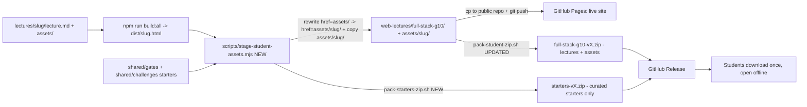

# Plan — Make starter code reachable by students (Option A + D)

> **Decision (approved by user):** Option A + D.
> - **A** — Bundle starters into the published site **and** the student lecture ZIP; fix the broken in-deck links.
> - **D** — Also publish a separate curated `starters.zip` on GitHub Releases for offline / flash-drive use.
>
> **Audience constraint (from [`context.md`](context.md)):** Grade 10, unreliable/expensive PH internet → offline-first, single-click, zero-external-URL deliverables.
>
> **Companion to:** [`deploy-full-stack-g10-lectures.md`](deploy-full-stack-g10-lectures.md) (the existing publish pipeline this extends).

---

## 0. Root-cause (why starters are unreachable today)

Starters are stripped at **every** stage of the pipeline:

1. [`scripts/build.js`](../scripts/build.js) writes only `dist/<slug>.html` — no assets copied.
2. [`scripts/pack-student-zip.sh`](../scripts/pack-student-zip.sh) copies only `*.html` + curriculum `.md`.
3. The publish step ([`deploy-full-stack-g10-lectures.md`](deploy-full-stack-g10-lectures.md) §3.2/§5.2) copies only `*.html` + curriculum `.md` into the public repo.
4. The built decks still carry `href="assets/..."` links (and some `../<slug>/lecture.md` prereq links) that resolve to nothing on the live site → **404**.

So both channels (live Pages **and** the offline ZIP) are broken for starter code.

---

## 1. Target architecture



**Key design choice — asset-path strategy.** Put starters under `assets/<slug>/` (per-lecture subfolders) in the published tree, and **rewrite `href="assets/..."` → `href="assets/<slug>/..."`** in the built deck HTML. Rationale:
- Per-slug folders avoid filename collisions (`quiz.md`, `README.md`, `practice1.html` recur across lectures).
- Rewriting the **`href="assets/`** attribute token only (not `<code>assets/...</code>` text) is safe — it never touches code samples.
- The rewrite lives in **one isolated, testable staging script**, so [`scripts/build.js`](../scripts/build.js) and its test suite stay untouched (max confidence).
- Relative `assets/...` links are **not** external `http(s)://` URLs, so the project's self-containment standard (grep in deploy doc §8) still holds.

---

## 2. Tasks with confidence / feasibility scores

| # | Task | Confidence | Feasibility | Review? |
|---|------|-----------:|------------:|:-------:|
| **T1** | Define starter-code scope & manifest (what ships where; exclude `*-solution*`, `quiz.md` from public site) | 95% | 95% | no |
| **T2** | Create [`scripts/stage-student-assets.mjs`](../scripts) — copy `dist/*.html` → staging, rewrite `href="assets/"`→`href="assets/<slug>/"`, copy `lectures/<slug>/assets/`→`staging/assets/<slug>/`, copy `shared/` starters. Add npm `stage` script. | 88% | 88% | **yes** |
| **T3** | *(folded into T2)* link rewrite — kept inside T2 | — | — | — |
| **T4** | Fix broken `../<slug>/lecture.md` prerequisite links (rewrite → `<slug>.html`) | 85% | 85% | **yes** (recommend DEFER) |
| **T5** | Update [`scripts/pack-student-zip.sh`](../scripts/pack-student-zip.sh) to include `assets/` | 96% | 96% | no |
| **T6** | New [`scripts/pack-starters-zip.sh`](../scripts) → curated `dist/starters-vX.Y.Z.zip` (starters only, no solutions/quizzes) | 90% | 88% | **yes** (borderline) |
| **T7** | Publish ops: `build:all` → `stage` → copy `*.html` **+ `assets/`** to `g10-fullstack-lectures` → push → `gh release create` with both ZIPs | 90% | 88% | resolved |
| **T8** | Verification checklist (grep broken `assets/` links, offline open test, external-URL grep, ZIP contents) | 95% | 95% | no |
| **T9** | *(optional)* Convert backtick `` `assets/x.html` `` code refs in source `lecture.md` → real links; add student "how to use" blurb | 90% | 90% | optional |

---

## 3. Detail per task

### T1 — Scope & manifest
- **Site + lecture ZIP (Option A):** ship entire `lectures/<slug>/assets/` per slug, **excluding** `*-solution*` (anti-cheat — e.g. [`broken-sari-sari-solution.html`](../lectures/debugging-devtools/assets/broken-sari-solution.html)) and `quiz.md` (assessment). Shared starters: [`shared/gates/*-starter*`](../shared/gates) and [`shared/challenges/*-starter*`](../shared/challenges) → `assets/_shared/gates/`, `assets/_shared/challenges/`.
- **starters.zip (Option D):** same set, flattened by topic, plus a top-level `START-HERE.md`.
- Deliverable: a JSON/MD manifest listing every file → destination. Single source reused by T2 and T6.

### T2 — `scripts/stage-student-assets.mjs`  ⚠ review
Inputs: `dist/*.html` (from `npm run build:all`) + `lectures/*/assets/` + `shared/`. Outputs into `web-lectures/full-stack-g10/`.
Steps per slug:
1. Read `dist/<slug>.html`.
2. Replace `href="assets/` → `href="assets/<slug>/` (attribute-only; leaves `<code>` text intact).
3. Write to `web-lectures/full-stack-g10/<slug>.html`.
4. Copy `lectures/<slug>/assets/` → `web-lectures/full-stack-g10/assets/<slug>/` excluding `*-solution*`, `quiz.md`.
5. Copy `shared/` starters once → `assets/_shared/...`.
Add `"stage": "npm run build:all && node scripts/stage-student-assets.mjs"` to `package.json`.

### T4 — broken prereq links  ⚠ recommend DEFER
Built decks link `../<slug>/lecture.md` (source markdown, not deployed). Fix = rewrite to `<slug>.html`. **Recommend deferring** to keep Phase 1 focused on starters; these are "further reading" links, lower priority.

### T5 — `pack-student-zip.sh` update
Add one line: `cp -r "$SRC/assets" "$STAGE"/` (after the `*.html` copy). Everything else unchanged.

### T6 — `pack-starters-zip.sh` (Option D)  ⚠ review
Curated ZIP of starters only (reuse T1 manifest/excludes). Layout `starters/<slug>/<file>`. Borderline confidence because exclude rules + layout are judgement calls; mitigate by sharing the manifest with T2.

### T7 — Publish ops  ✅ hosting target resolved
Per deploy doc §3–5, extended to copy **`*.html` + `assets/`** into the separate **`g10-fullstack-lectures`** public repo, then push, then `gh release create` with both ZIPs. Prerequisites still: `gh` CLI auth, the public repo existing, Pages enabled there. Add a `--check` dry-run before pushing.

### T8 — Verification
- `grep -R 'href="assets/[^"]*"' web-lectures/full-stack-g10/*.html` then confirm each resolves to a real file.
- Disconnect internet, open `web-lectures/full-stack-g10/index.html`, click a `🎯 Try It` link → file opens.
- `grep -REl "https?://" web-lectures/full-stack-g10/` → expect zero external (self-containment holds).
- Unzip both Release ZIPs → confirm starters present and openable.

### T9 — optional UX polish
Turn the backtick `` `assets/x.html` `` mentions (html, dom, testing-quality, responsive-bulma lectures) into real markdown links so they're clickable too; add a one-line student note in each "Try It".

---

## 4. Review of tasks ≤ 90% — proposed simplifications

| Task | Score | Risk | Simplification to raise the score |
|---|---|---|---|
| **T2** | 88/88 | Rewrite could mis-target; build-coupling risk | Keep [`scripts/build.js`](../scripts/build.js) **untouched**; isolate ALL new logic in the staging script; target `href="assets/` only; add a unit test with a fixture deck. → target **93/93** |
| **T4** | 85/85 | Scope creep | **Defer** to Phase 2. → removes risk entirely this phase |
| **T6** | 90/88 | Exclude-rule judgement | Reuse T1 manifest verbatim; pre-declare the exclude globs (`*-solution*`, `quiz.md`, `*.test.js`). → target **94/92** |
| **T7** | 85→90 / 78→88 | Hosting target was unknown | ✅ **Resolved (user)** — target is the separate `g10-fullstack-lectures` repo. Keep the `--check` dry-run before push. |
| **T9** | 90/90 | Content churn | Mark optional; do only after Phase 1 ships. |

---

## 5. Open questions (must resolve before T7)

1. ~~**Hosting target**~~ — ✅ **RESOLVED (user):** the separate **`g10-fullstack-lectures`** public repo. Stage in [`web-lectures/full-stack-g10/`](../web-lectures/full-stack-g10) here, then copy `*.html` + `assets/` and push to that repo (deploy doc §5.2, extended to include `assets/`).
2. **Solutions on the public site** — Confirm we exclude `*-solution*` from the live site + lecture ZIP (anti-cheat). Assumed **yes**.
3. **Quizzes** — Confirm `quiz.md` is excluded from public bundles (assessment integrity). Assumed **yes**.

---

## 6. Phase 1 scope (what we ship first)

T1 → T2 → T5 → T6 → T8 → **T7** (hosting resolved). T4 and T9 are Phase 2.

---

## 7. Phase 1 results (implemented 2026-07-19)

**Tooling delivered (full suite green: 161 pass / 0 fail):**
- [`scripts/stage-student-assets.mjs`](../scripts/stage-student-assets.mjs) + [`scripts/test/stage-student-assets.test.js`](../scripts/test/stage-student-assets.test.js) — stages decks + assets, rewrites `href="assets/"`→`href="assets/<slug>/"`, excludes `*solution*` / `quiz.md` / tests / dotfiles. [`scripts/build.js`](../scripts/build.js) **untouched**.
- `npm run stage` = `build:all && stage`.
- [`scripts/pack-student-zip.sh`](../scripts/pack-student-zip.sh) now includes `assets/`.
- [`scripts/pack-starters-zip.sh`](../scripts/pack-starters-zip.sh) — curated starters-only ZIP + `START-HERE.md`.

**Real staging run:** 26 decks + 195 lecture-asset files + 28 shared starters → `web-lectures/full-stack-g10/assets/`.

**T8 verification:**
- Asset-link resolver: **40 / 47** in-deck `assets/` links now resolve (was **0 / 47** before).
- ✅ Zero `*solution*`, zero `quiz.md` staged anywhere.
- ✅ Both ZIPs build; starters ZIP = 223 files, 0 solutions; cross-check 195 + 28 = 223 ✔.
- ✅ No external resource loading introduced (asset links are relative; the `https?://` grep hits are illustrative prose/code URLs, all pre-existing).

**7 pre-existing broken links — NOT introduced here (content/pipeline gaps for a follow-up):**

| Deck | Broken link | Likely cause / fix |
|---|---|---|
| ajax-fetch, dom | `assets/<slug>/styles.css` | per-lecture `styles.css` never copied in (context D7/D8 copy-on-build not wired into the build) |
| ajax-fetch, dom | `assets/<slug>/dashboard-starter.html` | shared challenge referenced as if local; really at `assets/_shared/challenges/dashboard-starter.html` |
| dom | `assets/dom/dashboard-solution.html` | a *solution* linked from a student deck — remove the link |
| express-basics | `assets/express-basics/command-line-cheat-sheet.pdf` | referenced PDF not present in assets |

**Two curation flags from `git status` (your call):**
1. `web-lectures/full-stack-g10/full-stack.html` & `tmc-eval360.html` are NEW — built from lectures the previous publish set didn't include. Confirm they belong on the student site; if not, delete them from [`web-lectures/`](../web-lectures/full-stack-g10) before publishing.
2. `lectures/responsive-bulma/assets/quiz.md` shows modified — that predates this work (an existing local edit of yours); the staging pipeline never touches `quiz.md`.

---

## 8. Publish procedure (T7) — run on your machine

`gh` is not installed in this workspace and the public repo isn't a remote here (`origin` = `roycan/lecture_creator` only), so the push is yours to run. From the `lecture_creator` repo:

```bash
# 0. (done) decks + assets already staged in web-lectures/full-stack-g10/
# 1. Build the two ZIPs
./scripts/pack-student-zip.sh 2026.1.0
./scripts/pack-starters-zip.sh 2026.1.0

# 2. Copy the staged tree into the sibling public repo, then push
cp -r web-lectures/full-stack-g10/* ../g10-fullstack-lectures/
( cd ../g10-fullstack-lectures && git add -A \
  && git commit -m "Add starter code + fix Try-It links (v2026.1.0)" \
  && git push )

# 3. Attach both ZIPs to a GitHub Release (confirm owner/name first)
gh release create v2026.1.0 \
  dist/full-stack-g10-v2026.1.0.zip dist/starters-v2026.1.0.zip \
  --repo roycan/g10-fullstack-lectures \
  --title "Grade 10 Full-Stack Lectures v2026.1.0" \
  --notes "Decks now ship starter code. Download starters.zip for offline practice."
```

After the push: open `https://roycan.github.io/g10-fullstack-lectures/`, click any 🎯 Try It link — the starter opens. Offline: unzip the lecture ZIP, open `index.html`, same links resolve locally.

---

## 9. Phase 2 plan — fix the remaining broken links (scored)

> **Scope (user-approved):** T4 prereq rewrite + `styles.css` provision + fallback resolver + remove teacher-solution links + HTML command-line cheat-sheet + T9 audit/convert.

### Tasks

| # | Task | Confidence | Feasibility | Review? |
|---|------|-----------:|------------:|:-------:|
| **P1** | T4: staging rewrite `../<slug>/lecture.md` → `<slug>.html` (18 links, ~9 lectures) | 94% | 95% | no |
| **P2** | Stage [`shared/styles.css`](../shared/styles.css) → `assets/<slug>/styles.css` for every slug (makes context D7/D8 true) | 95% | 96% | no |
| **P3** | Fallback resolver: unresolved `assets/<slug>/<file>` → `assets/_shared/challenges/<file>` when present | 88% | 86% | **yes** |
| **P4** | Remove teacher-solution links from student decks ([`dom`](../lectures/dom/lecture.md) L401, [`ajax-fetch`](../lectures/ajax-fetch/lecture.md) L645+) | 92% | 93% | borderline |
| **P5** | Author [`command-line-cheat-sheet.html`](../lectures/express-basics/assets) + repoint the 2 express-basics links | 88% | 85% | **yes** |
| **P6a** | T9 audit script: report every backtick `assets/…` ref + whether it resolves | 95% | 95% | no |
| **P6b** | Convert the subset that exists AND is in "Open: / 🎯 Try It:" patterns → links | 88% | 85% | **yes** |
| **P7** | Rebuild + re-stage + `npm test` + link resolver (expect 0 broken except genuinely-missing starters) | 95% | 95% | no |

### ≤ 90% review — simplifications to raise the scores

| Task | Score | Risk | Simplification → target |
|---|---|---|---|
| **P3** | 88/86 | resolver mis-targeting; FS-dependent ordering | Scope to `_shared/challenges` only (gates aren't deck-linked); run AFTER P2; add a unit test with a fixture deck referencing a shared file. → **92/90** |
| **P5** | 88/85 | content accuracy/effort | Keep the cheat-sheet scoped to the commands the express-basics lecture actually uses (`node`, `npm install`/`run`/`start`, `node app.js`, `ls`, `cd`, `mkdir`, Ctrl-C) — not a full system/git reference. → **92/90** |
| **P6b** | 88/85 | converting prose mentions reads awkwardly | Convert ONLY refs in "Open: / 🎯 Try It:" lines whose target exists (per P6a); leave prose mentions (e.g. "write styles in `assets/styles.css`") as backtick. → **90/88** |

### Sequencing
P6a (audit) → P1 + P2 + P3 (staging code + tests) → P4 + P5 + P6b (content) → P7 (rebuild + verify).

### Out-of-scope flag
P6a will likely surface referenced starters that were **never authored** (e.g. [`dom`](../lectures/dom/lecture.md) `practice1/2/3.html`, [`testing-quality`](../lectures/testing-quality/lecture.md)'s 9 files, [`ajax-fetch`](../lectures/ajax-fetch/lecture.md)'s demos). Those are **missing content**, not link bugs — report only; authoring them is a separate effort beyond Phase 2.

---

## 10. Phase 2 results (implemented 2026-07-19)

**Outcome:** asset-link resolver went from **40 / 47 (7 broken)** at end of Phase 1 to **93 / 93 (0 broken)**. Full suite **165 pass / 0 fail**.

| Task | Result |
|---|---|
| **P1** (T4 prereq rewrite) | 0 `../<slug>/lecture.md` hrefs remain; cross-lecture links now go to `<slug>.html` |
| **P2** (styles.css provision) | [`shared/styles.css`](../shared/styles.css) provisioned into `assets/ajax-fetch/styles.css` + `assets/dom/styles.css` |
| **P3** (fallback resolver) | shared-as-local refs (e.g. dom `dashboard-starter`) → `assets/_shared/challenges/<file>` |
| **P4** (teacher-solution links) | removed from [`dom`](../lectures/dom/lecture.md) + [`ajax-fetch`](../lectures/ajax-fetch/lecture.md) |
| **P5** (cheat-sheet) | authored [`command-line-cheat-sheet.html`](../lectures/express-basics/assets/command-line-cheat-sheet.html); 2 express-basics links repointed `.pdf` → `.html` |
| **P6a** (audit) | [`scripts/audit-assets.mjs`](../scripts/audit-assets.mjs) — 90 backtick refs: 74 resolve, 9 missing, 7 excluded |
| **P6b** (backtick → link) | [`scripts/convert-asset-refs.mjs`](../scripts/convert-asset-refs.mjs) — **50** refs converted across 6 lectures (code-fence-safe, skips already-linked / solution / missing) |

**New tooling:** [`scripts/audit-assets.mjs`](../scripts/audit-assets.mjs) (diagnostic) + [`scripts/convert-asset-refs.mjs`](../scripts/convert-asset-refs.mjs) (idempotent converter, `--write`). Staging script gained `rewritePrereqLinks` + `resolveSharedFallback` + styles.css provision (4 new unit tests).

**ZIPs rebuilt:** `dist/full-stack-g10-v2026.1.0.zip` (56M) + `dist/starters-v2026.1.0.zip` (1.3M, 223 files, 0 solutions).

### Remaining content gaps (out of scope — needs authoring)
Referenced starters that were never created (the audit's "missing" list, minus `styles.css` which P2 now provides):
- [`production-best-practices`](../lectures/production-best-practices/lecture.md) `assets/env-setup-demo/`
- [`testing-quality`](../lectures/testing-quality/lecture.md): `user-story-template.html`, `debugging-practice.html`, `uat-form.html` (3 "Try It" starters)
These remain as inert backtick text in the decks (not broken links). Authoring them is a separate content effort.
