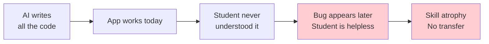
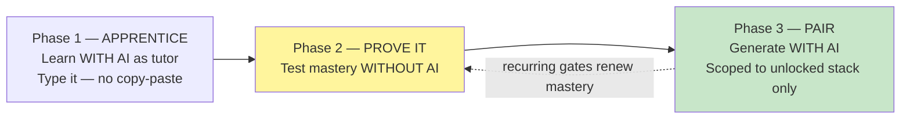
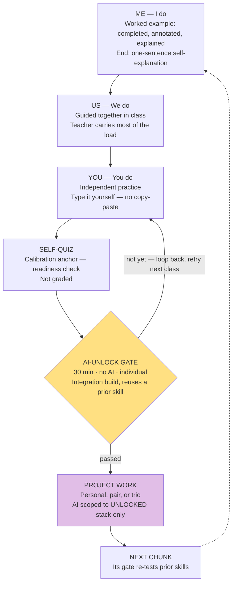

# 📚 Teaching Model — AI-Gated Mastery Learning

> **Purpose:** the single source of truth for *how* this course teaches coding in an AI-saturated world. Written for any teacher — including at other campuses — who will deliver the Grade 10 Full-Stack elective.
> **Read alongside:** [`context.md`](context.md) (the tool/project), [`full-stack-g10-curriculum.md`](../full-stack-g10-curriculum.md) (what to teach & in what order), and [`lectures/ai-assisted-development/lecture.md`](../lectures/ai-assisted-development/lecture.md) (the *how-to-use-AI* lesson students receive).
>
> **Status:** Adopted model · **Last updated:** 2026-06-15

---

## 0. Executive summary (the 60-second version)

AI can now write every line of code a Grade 10 student needs. Left unchecked, students ship *working apps they don't understand* and lose the ability to maintain or debug them — the very skills the course exists to build. Banning AI is neither realistic nor honest about the profession they're entering.

**This course's answer is a gate, not a ban.** Students learn each fundamental *with* AI as a tutor, then prove — *without* AI — that they could write it themselves, and only then earn the privilege of letting AI generate that kind of code for them. The privilege is **scoped**: AI may only generate code in technologies the student has personally unlocked, which *guarantees* they can verify the output. Mastery is renewed, not granted once.

The whole thing sits inside the classic **"Me → Us → You"** gradual-release lesson cycle, so it costs almost nothing extra to run — it's just the *tail* of a lesson teachers already know how to teach.

---

## 1. The dilemma this model solves

The danger is not that students *use* AI. It is that **fluent-looking output creates an illusion of competence** — students (and teachers) mistake "it runs" for "I understand it." When that code later breaks, the student who never understood it cannot rescue it, and nothing they "learned" transfers to the next problem.

A second, subtler trap: **you cannot verify AI output for code you don't already understand.** If a student asks AI for something beyond their grasp, they have no way to tell a correct answer from a confident hallucination. So *verification itself* depends on prior mastery — which means we must *engineer* that mastery before AI generation is safe to allow.

This model makes that engineering explicit.

---

## 2. The core philosophy — three phases

| Phase | Name | What happens | AI role |
|---|---|---|---|
| **1** | **Apprentice** | Learn the fundamental by hand | AI = **tutor**: explain, quiz, demonstrate. **No copy-paste** — type it. |
| **2** | **Prove it** | Demonstrate mastery *without* AI | AI = **off**. A proctored integration build. |
| **3** | **Pair programmer** | Build real projects faster | AI = **generator**, scoped to the *unlocked stack only*. Student verifies everything. |

**The keystone rule (read this twice):**

> 🔑 In Phase 3, a student may use AI to *generate* code **only in technologies they have personally unlocked**. By construction, they are always asking AI for things they've proven they can do themselves — so they are always inside their *verification-competent zone*. The most common AI failure mode (asking for code you can't check) becomes structurally impossible.

**Why this works:** it converts AI from a crutch into *earned leverage*, and it creates genuine motivation to keep unlocking the stack. It also matches reality — senior developers really do author via AI and review; the skill we are training ("check the output, know where to look when it breaks") *is* the job.

---

## 3. Pedagogical foundations

This is not a novel invention — it is a deliberate assembly of well-established, evidence-based learning principles. Teachers familiar with these will recognize the model immediately.

| Principle | Source | Where it shows up in our cycle |
|---|---|---|
| **Gradual Release of Responsibility** ("Me → Us → You") | Pearson & Gallagher (1983) | The lesson spine: teacher models → class does together → student does alone. |
| **Worked-example effect** / Cognitive Load Theory | Sweller (1988); Sweller & Cooper (1985) | The "Me" stage is a *completed, annotated example explained* — not "watch me figure it out live." Lowers novice load. |
| **Retrieval practice / the testing effect** | Roediger & Karpicke (2006); Karpicke & Blunt (2011) | The **no-AI gate** *is* retrieval practice — the single highest-yield learning activity known. Testing beats re-reading. |
| **Spaced practice / spiral curriculum** | Bruner (1960); Bjork (1994, "desirable difficulties") | Each new chunk's gate forces reuse of prior skills, so old material is re-retrieved automatically over time. |
| **Scaffolding → fading** (Zone of Proximal Development) | Vygotsky (1978); Wood, Bruner & Ross (1976) | AI as tutor is the scaffold; the no-AI gate is the *fade* — the student performs unaided. |
| **Performance assessment > knowledge recall** | General psychometrics | The gate is "build a working thing," not "circle the correct answer" — far more valid for "can you actually do it." |
| **Illusion of competence / metacognitive bias** | Kruger & Dunning (1999); Bjork & Bjork | The no-AI gate and the calibration quiz both *break* the false confidence that AI fluency creates. |

> 📌 **For the skeptical teacher:** the techniques ranked *highest* in the most-cited review of learning strategies (Dunlosky et al., 2013) are **practice testing** and **distributed practice** — both are built into this model for free. We are not adding overhead; we are routing existing effort toward what already works.

---

## 4. The weekly instructional cycle

Each "chunk" of the curriculum runs through this loop. It is the familiar *Me → Us → You* cycle with a **proving tail** and a **scoped-AI payoff** grafted on.

### Stage-by-stage

1. **Me — I do (worked example).** Present a *finished, explained* example — a video, a reading, or a live walkthrough of *annotated* code. **Do not** model "thinking out loud while stuck"; that front-loads problem-solving load on novices and undercuts the worked-example effect. End with a 10-second active step: *"in one sentence, what did I just do, and why?"* That self-explanation is what makes a worked example actually teach.
2. **Us — We do (guided practice).** The whole class builds the same thing together; the teacher carries most of the cognitive load and fades support across the session.
3. **You — You do (independent practice).** Each student reproduces and extends it alone. **The code that lands in their project is theirs** — AI may explain and quiz, but it does not author deliverable code, and **copy-paste is forbidden** (see §6).
4. **Self-quiz (calibration anchor).** The student runs the lecture's existing self-quiz (e.g. [`html/assets/quiz.md`](../lectures/html/assets/quiz.md), [`css/assets/quiz.md`](../lectures/css/assets/quiz.md)). *Not graded* — its job is to tell the student **whether they're ready to attempt the gate**, which saves wasted gate attempts and calibrates confidence against reality.
5. **AI-unlock gate.** A 30-minute, **no-AI**, **individual** integration build. Pass = the code runs *and* meets a written functional spec. Fail is not a grade penalty — it means "loop back, retry next class." See §5.
6. **Project work (the payoff).** Students work on a personal / pair / trio web project using AI — but **only within their unlocked stack**. This is where AI earns its keep on boilerplate, and where shippable artifacts come from (see [`full-stack-g10-curriculum.md`](../full-stack-g10-curriculum.md), "a shippable artifact every quarter").

### A realistic week (it *does* fit)

| Day | Stage | Notes |
|---|---|---|
| 1 | Me + Us | Full class — worked example, then guided together. |
| 2 | You + self-quiz | Independent practice (type-it-yourself), then calibration. |
| 3 | **Gate** (30 min) + start project | The 30-minute length is what leaves room for a retry window the same day. |
| 3–5 + HW | Project work | AI scoped to unlocked stack; newly-unlocked skill hand-written on the first cycle (§6). |

> The gate's 30-minute length is what makes the whole model schedulable. Protect it: a gate that drifts to 60 minutes breaks the weekly rhythm.

---

## 5. The AI-unlock gate (the load-bearing mechanism)

The gate is the one part of the model that *must* be done right. Everything else is standard good teaching; the gate is what makes the AI policy safe.

### Two kinds of "mastery check" — don't confuse them

| | Per-topic **self-gate** (internal) | **Integration gate** (external, the real one) |
|---|---|---|
| Who judges | The student themselves | The spec / teacher — objective |
| Format | Run the lecture's self-quiz | 30-min no-AI build |
| Stakes | None — calibration | Unlocks AI-gen for that tech |
| Per skill or combined | One per micro-topic | One per *chunk*, integrating several skills |

The self-quiz keeps the self-report honest; the integration gate is the decision. **Only the integration gate unlocks AI.** Per-topic "I get it" feelings are cheap; building a working thing by hand is proof.

### Design rules for the 30-minute integration gate

These are non-negotiable — they're what stop the gate from becoming a wall or a rubber stamp:

1. **Scoped to 2–3 recently-learned concepts, usually on a provided starter scaffold.** 30 minutes is not enough to build a full-stack feature from a blank file. The gate tests the *new wiring*; the boilerplate is pre-given. "Extend/modify this starter" is the right shape, not "build from scratch."
2. **Objective, functional pass criteria.** Each gate has a written spec — "it runs and produces *this* output / passes *these* cases." Objective pass/fail is what lets you run a "retry next class" loop without arguments or accusations.
3. **A clean "not yet" path — no grade penalty.** A miss = "deferred unlock, retry." This keeps the gate mastery-oriented and humane; fear of failure would push students to cheat.
4. **Reuse at least one previously-unlocked skill.** A Q3 backend gate should require Q2's JavaScript. This is how the spiral performs *spaced retrieval for free* and prevents the skill-atrophy the gate exists to prevent.
5. **Gate only high-leverage chunks.** Don't gate every micro-topic — that would violate "Trim, don't cram." Gate the things that break most often: control flow, async/`fetch`, the request→response model, SQL + prepared statements, DOM/data-flow.

> **Pending deliverable:** a catalog of 30-minute gate activities, one per high-leverage chunk, each with a starter scaffold, a functional spec, and a retry path — mapped to the existing [`lectures/`](../lectures) folders. *(Not yet authored.)*

### Individual vs. group (a real classroom trap)

- **The gate is always individual.** You cannot verify comprehension of a group.
- **The project is collaborative** (personal / pair / trio) — and that is exactly where skill-atrophy can quietly relocate: one strong student unlocks and "carries," the others coast.

> 🔒 **Rule: a group may use AI to generate code in tech area X only when *every* member has individually passed the X gate.**
> This guarantees every teammate is a competent reviewer. The looser "weakest-member sets the ceiling" version is too weak — a trio where two can't read the `fetch` call cannot actually review it as a unit.

---

## 6. Rules for AI use, by phase (the policy layer)

This is the table to put on the classroom wall and in the course syllabus.

| Phase | May AI explain / quiz / demo? | May AI write deliverable code? | Copy-paste? | Source |
|---|---|---|---|---|
| **1 — Apprentice** (learning) | ✅ Yes — that's its job | ❌ No | ❌ **Forbidden** — type it | — |
| **Transition tier** (first project cycle after unlock) | ✅ Yes | ⚠️ Hints / review / autocomplete only; **student still types & owns it** | ⚠️ Only AI *suggestions*, re-typed | "You write it, AI polishes it" ([`§6`](../lectures/ai-assisted-development/lecture.md)) |
| **3 — Pair programmer** (unlocked stack) | ✅ Yes | ✅ Yes — **within unlocked stack only** | ✅ Fine — you're *reviewing*, not learning to type | — |

### Why "no copy-paste" — and why it's lifted later

Typing code by hand (vs. copy-paste) measurably improves retention and comprehension, for two reasons:

- **Attentional** — you can't type `}`, `;`, or `=>` without *noticing* it's there, so students start seeing matching braces, missing semicolons, and arrow-function syntax instead of skating past them.
- **Procedural/motor** — fingers learn where the brackets and quotes live, freeing attention for the *logic* instead of the *keystrokes*.

But the real goal isn't the typing — it's **forced attention**. The strongest version is: *"type it, then before you run it, predict what each line does."* "No copy-paste" is just the simple, enforceable proxy.

**It is a Phase-1 + transition rule, not a forever rule.** In Phase 3, once the code is the student's *verified* output, refusing to paste it would be pointless — by then they are *reviewing*, not learning to type.

### Honesty & attribution

Adopted directly from the existing [`§7 Ethics: Learn, Don't Outsource Understanding`](../lectures/ai-assisted-development/lecture.md):

- ✅ Using AI to **learn, explain, debug** = good.
- ✅ Using AI to **draft** code the student then understands = good.
- ❌ Submitting AI code **without understanding** it = dishonest *and* risky.
- ❌ AI on a **closed-AI assessment** (the gate) = cheating.

**Litmus test (the one-question check for any line of project code):**
> *"If a teacher pointed at this line and asked 'why did you write this?', could the student answer?"* If not, they've outsourced too much. ([`§7`](../lectures/ai-assisted-development/lecture.md))

---

## 7. How this fits the existing course

The model is the *missing policy layer* over material that already exists — not new work.

| This model needs… | …already lives in |
|---|---|
| A stated commitment that "AI is a taught skill, not a secret" | [`full-stack-g10-curriculum.md` §3, principle 5](../full-stack-g10-curriculum.md) |
| A stack "standard enough that AI can support development" | [`full-stack-g10-curriculum.md` §2, design constraint (b)](../full-stack-g10-curriculum.md) |
| The *how* of responsible AI use (prompting, verification, mindset) | [`lectures/ai-assisted-development/lecture.md`](../lectures/ai-assisted-development/lecture.md) (esp. C-T-C-E, "Verify AI Output", Ethics) |
| Calibration self-quizzes for the self-gate | Each lecture's `assets/quiz.md` (e.g. [`html/assets/quiz.md`](../lectures/html/assets/quiz.md)) |
| A spiral that re-demands old skills | [`full-stack-g10-curriculum.md` §3, principle 1 "Web-first spiral"](../full-stack-g10-curriculum.md) |
| Offline, single-file, low-stakes deliverables | [`context.md`](context.md) — the build system already produces these |

> **Recommended change to the curriculum doc:** add a short *"AI-use policy by phase"* section (i.e., a copy of the table in §6) to [`full-stack-g10-curriculum.md`](../full-stack-g10-curriculum.md), so every lecture can reference it (e.g. *"This is an Apprentice-phase exercise — AI may explain but not author"*). The *how* already lives in the lecture; this gives the *when* a home.

---

## 8. Anticipated objections (for presenting to other teachers)

**"Isn't this a lot of extra overhead?"**
No — the front half (Me → Us → You) is a lesson cycle teachers already run. We've only added a *tail* (quiz + gate) that is 30 minutes long. Per-topic mastery is *self-reported* via existing quizzes; only the chunk-level gate is teacher-run. We deliberately do **not** gate every micro-topic ("Trim, don't cram").

**"What about weaker students who can't pass the gate?"**
The gate is low-stakes and repeatable. A miss isn't a failing grade — it defers that chunk's AI-unlock and triggers a "loop back, retry next class." The student keeps the tutor-AI from Phase 1 the entire time, so they're never stuck without help; they're only stuck without *generation*. AI as a tutor is always available; AI as an author must be earned.

**"How do we stop students from cheating on the gate?"**
Individual, proctored, no-devices, with an objective functional spec and a one-on-one "explain any line" litmus test. A student who faked the build cannot explain it.

**"Doesn't all this slow the course down?"
The spiral pays us back: because each gate re-uses prior skills, we get *spaced review built into new lessons* — we spend less total time on remediation later. And unlocking AI is a *motivation accelerant*: students move faster on projects precisely because they've earned the leverage.

**"Why not just let them use AI from day one like real developers?"
Because real senior developers can *already verify the output*. Our students cannot — yet. The gate is the bridge from "novice who can't check the answer" to "practitioner who can." We are not anti-AI; we are *pro-comprehension-first*.

---

## 9. Glossary

- **Chunk** — a coherent unit of the curriculum (e.g. "async + `fetch`") that ends in one integration gate.
- **Worked example** — a *completed* solution shown with explanation, used for initial teaching (as opposed to a problem the learner solves).
- **Retrieval practice / testing effect** — the finding that *recalling* information from memory (e.g. a no-AI build) produces stronger, more durable learning than re-reading or re-exposure.
- **Gradual Release of Responsibility** — the "Me → Us → You" transfer of cognitive load from teacher to learner.
- **Self-gate** — the student's self-administered readiness check (the lecture quiz) before attempting the integration gate.
- **Integration gate** — the 30-minute, no-AI, individual build that unlocks AI generation for a tech area.
- **Unlocked stack** — the set of technologies a student has personally passed a gate for; AI generation is allowed only within this set.
- **Transition tier** — the rule that, on the first project cycle after unlocking a skill, the student writes it by hand before allowing AI to generate it.
- **Litmus test** — the one-question honesty check: "can you explain any line of your code?"

---

## 10. References & further reading

- Bjork, R. A. (1994). *Memory and metamemory considerations in the training of human beings.* In J. Metcalfe & A. Shimamura (Eds.), *Metacognition*. — origin of "desirable difficulties."
- Brown, P. C., Roediger, H. L., & McDaniel, M. A. (2014). *Make It Stick: The Science of Successful Learning.* — the most accessible book for teachers; covers retrieval practice, spacing, and illusions of competence.
- Bruner, J. S. (1960). *The Process of Education.* — the spiral curriculum.
- Dunlosky, J., Rawson, K. A., Marsh, E. J., Nathan, M. J., & Willingham, D. T. (2013). *Improving Students' Learning With Effective Learning Techniques.* Psychological Science in the Public Interest, 14(1). — the review ranking practice testing and distributed practice as highest-utility.
- Karpicke, J. D., & Blunt, J. R. (2011). *Retrieval practice produces more learning than elaborative concept mapping.* Science, 331(6018).
- Kruger, J., & Dunning, D. (1999). *Unskilled and unaware of it.* Journal of Personality and Social Psychology, 77(6). — the metacognitive bias the no-AI gate is designed to break.
- Pearson, P. D., & Gallagher, M. C. (1983). *The instruction of reading comprehension.* Contemporary Educational Psychology, 8(3). — the "gradual release of responsibility."
- Roediger, H. L., & Karpicke, J. D. (2006). *Test-enhanced learning.* Psychological Science, 17(3). — the core retrieval-practice study.
- Sweller, J. (1988). *Cognitive load during problem solving.* Cognitive Science, 12. — cognitive load theory & the worked-example effect.
- Vygotsky, L. S. (1978). *Mind in Society.* — the Zone of Proximal Development.
- Wood, D., Bruner, J., & Ross, G. (1976). *The role of tutoring in problem solving.* Journal of Child Psychology and Psychiatry, 17(2). — origin of the term "scaffolding."
