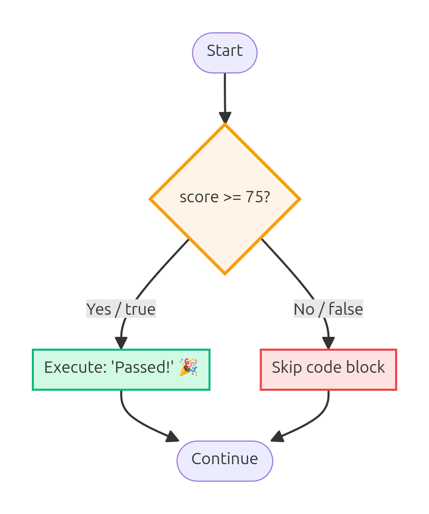
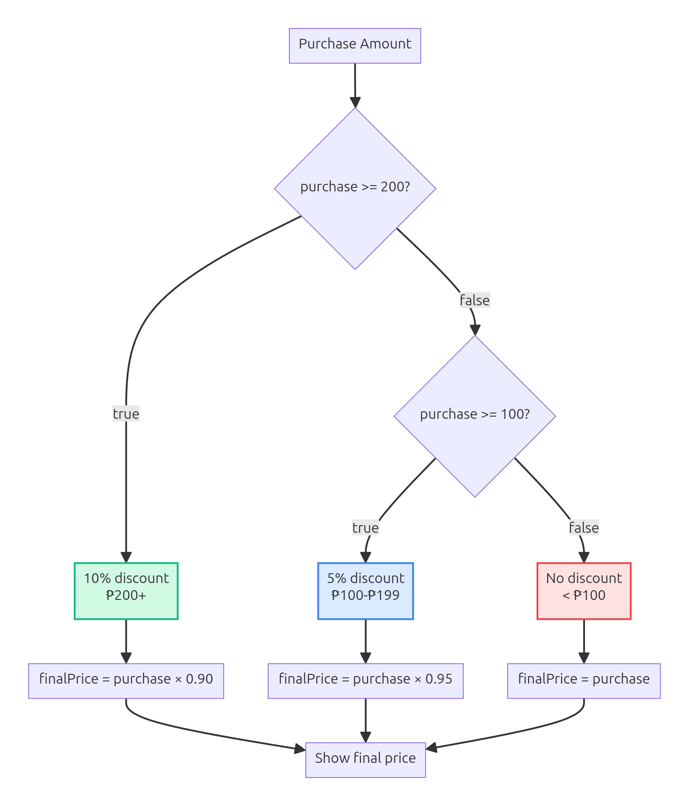
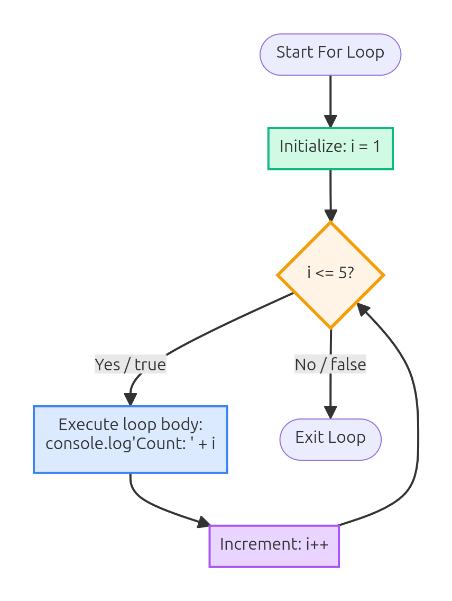
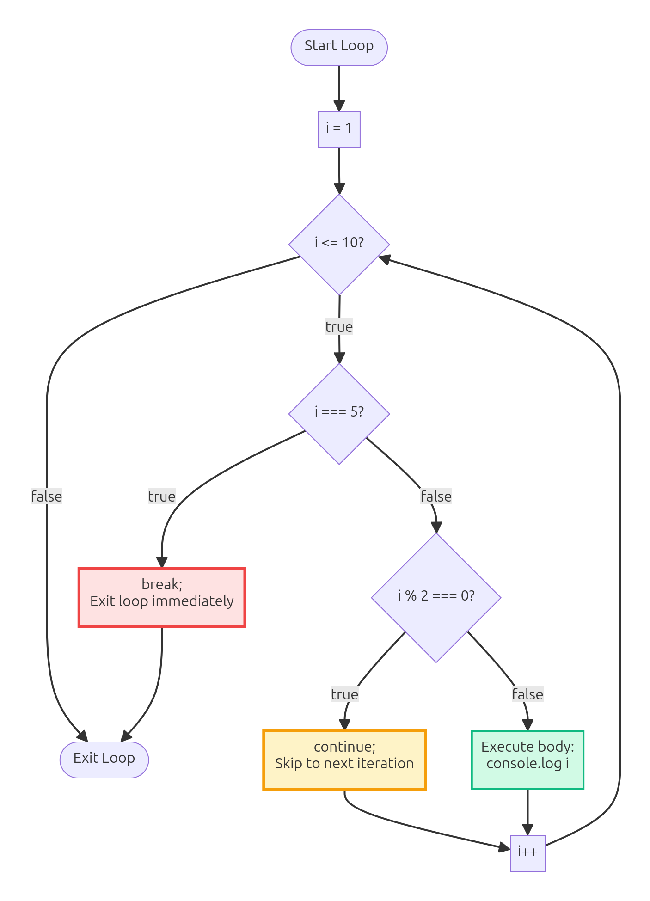
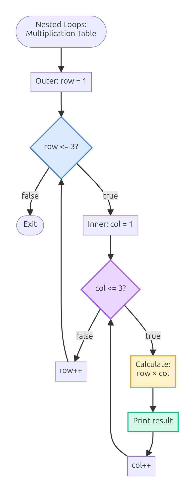
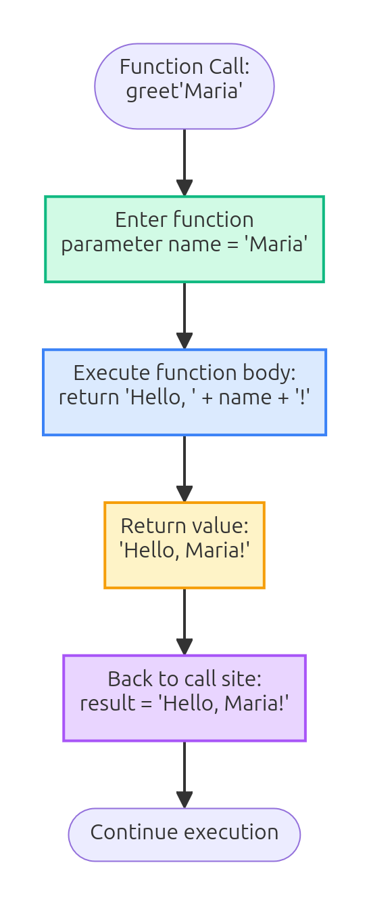

# Welcome to JavaScript - Part 1!

Welcome to your first JavaScript lesson! 🎉

Today we'll learn how to make programs **think** and **make decisions** using JavaScript. By the end of this lesson, you'll be able to write code that checks grades, counts numbers, and calculates totals!

## What is JavaScript?

JavaScript is a **programming language** that makes websites interactive and dynamic.

Think of it this way:
- **HTML** = The skeleton (structure)
- **CSS** = The skin and clothes (style)
- **JavaScript** = The brain and muscles (behavior)

**What can JavaScript do?**
- Make buttons respond to clicks
- Check if your password is correct
- Calculate your quiz score automatically
- Animate images and create games
- And much more!

**Cool fact:** JavaScript runs in every web browser - Chrome, Firefox, Safari, Edge. That's why it's so popular!

## Running Your JavaScript Code

Before we start coding, you need to know **where** to write JavaScript.

### **Option 1: Browser Console** (Easiest for learning!)

1. Open any website
2. Press **F12** (or right-click → "Inspect")
3. Click the **"Console"** tab
4. Type your code and press **Enter**

```javascript
console.log("Hello, Philippines!");
// Try this in your console right now!
```

### **Option 2: HTML File with `<script>` tag**

Create an HTML file and add JavaScript inside:

```html
<!DOCTYPE html>
<html>
<head>
    <title>My JavaScript</title>
</head>
<body>
    <h1>Check the Console!</h1>
    
    <script>
        console.log("This runs when the page loads!");
    </script>
</body>
</html>
```

### **Option 3: External JS File**

```html
<script src="mycode.js"></script>
```

**For this lesson:** Use the **browser console** - it's perfect for learning and testing!

**Pro tip:** `console.log()` is your best friend for seeing what your code does!

## Variables - Storing Information

Variables are like **labeled boxes** where you store data.

### **Creating Variables**

```javascript
let studentName = "Maria Santos";
let age = 15;
let grade = 9;
let isPresent = true;

console.log(studentName); // Output: Maria Santos
console.log(age);         // Output: 15
```

### **Variable Rules**

✅ **Do this:**
```javascript
let firstName = "Jose";      // Use camelCase
let totalScore = 95;
const PI = 3.14159;          // Use const for values that don't change
```

❌ **Don't do this:**
```javascript
let 2students = "error";     // Can't start with number
let student-name = "error";  // Can't use hyphens
let student name = "error";  // Can't have spaces
```

### **Data Types You'll Use**

```javascript
// String (text)
let message = "Hello, World!";

// Number (integers and decimals)
let score = 85;
let price = 49.99;

// Boolean (true or false)
let hasPassed = true;
let isRaining = false;

// Check the type
console.log(typeof score);    // Output: number
console.log(typeof message);  // Output: string
```

**Remember:** JavaScript needs to know what type of data you're working with!

## Your Debug Tool: console.log()

Think of `console.log()` as your way to **see inside your code**.

```javascript
let baon = 100;  // ₱100 daily baon
console.log("My baon is: ₱" + baon);
// Output: My baon is: ₱100

// You can log multiple things
console.log("Name:", "Maria", "Age:", 15);
// Output: Name: Maria Age: 15

// Log calculations
console.log("Total:", 50 + 30);
// Output: Total: 80
```

**Pro tip:** Use `console.log()` everywhere when learning! It helps you understand what your code is doing.

## If Statements - Making Decisions

This is where programming gets exciting! Your code can **make decisions** based on conditions.

### **Basic If Statement**

```javascript
let score = 78;

if (score >= 75) {
    console.log("Congratulations! You passed! 🎉");
}
// Output: Congratulations! You passed! 🎉
```

**How it works:**
```
     Start
       |
       v
  [score >= 75?]
    /        \
  Yes        No
   |          |
   v          v
Execute    Skip
 code      code
   |          |
   +----+-----+
        |
        v
     Continue
```



### **Comparison Operators**

```javascript
// Equal to (value only)
5 == "5"    // true (converts "5" to number)

// Strict equal (value AND type)
5 === "5"   // false (different types)
5 === 5     // true

// Not equal
score != 80  // true if score is not 80

// Greater than / Less than
age > 18     // true if age is greater than 18
age < 13     // true if age is less than 13
age >= 18    // greater than or equal
age <= 12    // less than or equal
```

**Best Practice:** Always use `===` and `!==` (strict comparison)!

### **Real Example: Baon Budget**

```javascript
let baon = 80;         // ₱80 baon
let lunchPrice = 65;   // ₱65 lunch

if (baon >= lunchPrice) {
    console.log("You can afford lunch! 🍱");
}
// Output: You can afford lunch! 🍱
```

## If-Else & Else-If - Multiple Paths

Sometimes you need to handle **different outcomes**.

### **If-Else (Two Options)**

```javascript
let score = 68;

if (score >= 75) {
    console.log("Passed! Great job! ✅");
} else {
    console.log("Not yet - keep studying! 📚");
}
// Output: Not yet - keep studying! 📚
```

**Visual:**
```
  [Condition?]
   /        \
 true      false
  |          |
  v          v
 If        Else
block     block
```

### **Else-If (Multiple Options)**

```javascript
let score = 85;

if (score >= 90) {
    console.log("Excellent! Grade: A 🌟");
} else if (score >= 80) {
    console.log("Very Good! Grade: B 👍");
} else if (score >= 75) {
    console.log("Good! Grade: C ✓");
} else {
    console.log("Keep trying! Grade: D 💪");
}
// Output: Very Good! Grade: B 👍
```

### **Real Example: Sari-Sari Store Discount**

```javascript
let purchase = 250;  // ₱250 purchase

if (purchase >= 200) {
    let discount = purchase * 0.10;  // 10% discount
    console.log("Discount: ₱" + discount);
    console.log("You saved money! 🎁");
} else {
    console.log("Buy ₱" + (200 - purchase) + " more for discount!");
}
// Output: 
// Discount: ₱25
// You saved money! 🎁
```

## Logical Operators - Combining Conditions

Sometimes you need to check **multiple conditions** at once.

### **AND Operator (&&)** - Both must be true

```javascript
let age = 15;
let hasID = true;

if (age >= 13 && hasID) {
    console.log("You can create an account ✅");
} else {
    console.log("Requirements not met ❌");
}
// Output: You can create an account ✅
```

**Truth Table:**
```
true  && true   → true
true  && false  → false
false && true   → false
false && false  → false
```

### **OR Operator (||)** - At least one must be true

```javascript
let day = "Saturday";

if (day === "Saturday" || day === "Sunday") {
    console.log("It's the weekend! 🎉");
} else {
    console.log("School day 📚");
}
// Output: It's the weekend! 🎉
```

**Truth Table:**
```
true  || true   → true
true  || false  → true
false || true   → true
false || false  → false
```

### **NOT Operator (!)** - Flips true/false

```javascript
let isRaining = false;

if (!isRaining) {
    console.log("You can play outside! ☀️");
}
// Output: You can play outside! ☀️
```

### **Combined Example: Game Level**

```javascript
let level = 3;
let coins = 150;
let hasPowerUp = true;

if ((level >= 3 && coins >= 100) || hasPowerUp) {
    console.log("Boss battle unlocked! 🐉");
} else {
    console.log("Keep collecting coins! 💰");
}
// Output: Boss battle unlocked! 🐉
```

## Practice: Store Discount Calculator

**Challenge:** Write code for Aling Maria's store that:
1. Takes a purchase amount
2. If ₱200 or more: Give 10% discount
3. If ₱100-₱199: Give 5% discount
4. If less than ₱100: No discount
5. Show the final price

**Try it yourself first! Then check the solution below:**

```javascript
// Solution
let purchase = 180;  // ₱180
let finalPrice = purchase;

if (purchase >= 200) {
    finalPrice = purchase * 0.90;  // 10% off
    console.log("10% discount applied! 🎁");
} else if (purchase >= 100) {
    finalPrice = purchase * 0.95;  // 5% off
    console.log("5% discount applied! 🎉");
} else {
    console.log("No discount - buy more for savings!");
}

console.log("Final price: ₱" + finalPrice);
// Output:
// 5% discount applied! 🎉
// Final price: ₱171
```



**Try different amounts:** 50, 150, 250 - See what happens!

## For Loops - Repeating Actions

Loops let you do something **multiple times** without writing the same code over and over.

### **For Loop Syntax**

```javascript
for (let i = 1; i <= 5; i++) {
    console.log("Count: " + i);
}
// Output:
// Count: 1
// Count: 2
// Count: 3
// Count: 4
// Count: 5
```

**How it works:**
```
for (start; condition; step)
     ↓        ↓         ↓
  let i=1  i<=5      i++

Execution:
1. Set i = 1
2. Check: i <= 5? Yes → Run code
3. Step: i++ (now i = 2)
4. Check: i <= 5? Yes → Run code
5. Step: i++ (now i = 3)
... repeat ...
6. Check: i <= 5? No → Stop
```



### **Counting Examples**

```javascript
// Count up
for (let i = 1; i <= 3; i++) {
    console.log(i);
}
// Output: 1 2 3

// Count down
for (let i = 3; i >= 1; i--) {
    console.log(i);
}
// Output: 3 2 1

// Count by 2s
for (let i = 0; i <= 10; i += 2) {
    console.log(i);
}
// Output: 0 2 4 6 8 10
```

### **Real Example: Times Tables**

```javascript
// 5 times table
console.log("5 Times Table:");
for (let i = 1; i <= 10; i++) {
    console.log("5 × " + i + " = " + (5 * i));
}
// Output:
// 5 Times Table:
// 5 × 1 = 5
// 5 × 2 = 10
// 5 × 3 = 15
// ... and so on
```

### **Real Example: Jeepney Fare Calculator**

```javascript
console.log("Jeepney Fares:");
for (let km = 1; km <= 10; km++) {
    let baseFare = 13;
    let fare = baseFare;
    
    if (km > 4) {
        fare = baseFare + ((km - 4) * 2);
    }
    
    console.log(km + "km: ₱" + fare);
}
// Output:
// Jeepney Fares:
// 1km: ₱13
// 2km: ₱13
// 3km: ₱13
// 4km: ₱13
// 5km: ₱15
// 6km: ₱17
// ... and so on
```

## While Loops - Repeat Until Condition Fails

While loops are useful when you **don't know how many times** to repeat.

### **While Loop Syntax**

```javascript
let count = 1;

while (count <= 5) {
    console.log("Count: " + count);
    count++;
}
// Output: Count: 1, Count: 2, Count: 3, Count: 4, Count: 5
```

### **When to Use While vs For**

**Use FOR when:** You know how many times to loop
```javascript
for (let i = 1; i <= 10; i++) {
    // Loop exactly 10 times
}
```

**Use WHILE when:** You loop until a condition changes
```javascript
let balance = 100;

while (balance > 0) {
    balance -= 15;  // Spend ₱15
    console.log("Balance: ₱" + balance);
}
```

### **Real Example: Saving Money**

```javascript
let savings = 0;
let goal = 500;  // ₱500 goal
let week = 0;

console.log("Saving ₱50 per week:");

while (savings < goal) {
    week++;
    savings += 50;  // Save ₱50
    console.log("Week " + week + ": ₱" + savings);
}

console.log("Goal reached in " + week + " weeks! 🎯");
// Output:
// Saving ₱50 per week:
// Week 1: ₱50
// Week 2: ₱100
// Week 3: ₱150
// ...
// Week 10: ₱500
// Goal reached in 10 weeks! 🎯
```

### **Real Example: Game Countdown**

```javascript
let lives = 3;

console.log("Game Start! 🎮");

while (lives > 0) {
    console.log("Lives remaining: " + lives + " ❤️");
    lives--;  // Lose a life
}

console.log("Game Over! 💀");
// Output:
// Game Start! 🎮
// Lives remaining: 3 ❤️
// Lives remaining: 2 ❤️
// Lives remaining: 1 ❤️
// Game Over! 💀
```

## Loop Control - Break and Continue

Sometimes you need to **control** how loops run.

### **break - Stop the loop immediately**

```javascript
// Find first number divisible by 7
for (let i = 1; i <= 100; i++) {
    if (i % 7 === 0) {
        console.log("First multiple of 7: " + i);
        break;  // Stop here!
    }
}
// Output: First multiple of 7: 7
```

### **continue - Skip to next iteration**

```javascript
// Print only odd numbers
for (let i = 1; i <= 10; i++) {
    if (i % 2 === 0) {
        continue;  // Skip even numbers
    }
    console.log(i);
}
// Output: 1 3 5 7 9
```



### **Nested Loops**

Loops inside loops! Useful for tables and grids.

```javascript
// Multiplication table (3x3)
for (let row = 1; row <= 3; row++) {
    let line = "";
    for (let col = 1; col <= 3; col++) {
        line += (row * col) + " ";
    }
    console.log(line);
}
// Output:
// 1 2 3
// 2 4 6
// 3 6 9
```



## Practice: Multiplication Table

**Challenge:** Create a 5×5 multiplication table

**Try it yourself! Solution:**

```javascript
console.log("5×5 Multiplication Table:");
console.log("-------------------------");

for (let row = 1; row <= 5; row++) {
    let line = "";
    for (let col = 1; col <= 5; col++) {
        let product = row * col;
        // Add spacing for alignment
        if (product < 10) {
            line += " " + product + " ";
        } else {
            line += product + " ";
        }
    }
    console.log(line);
}
// Output:
// 5×5 Multiplication Table:
// -------------------------
//  1  2  3  4  5
//  2  4  6  8 10
//  3  6  9 12 15
//  4  8 12 16 20
//  5 10 15 20 25
```

## Functions - Reusable Code Blocks

Functions are like **recipes** - write once, use many times!

### **Why Functions?**

❌ **Without functions (repetitive):**
```javascript
let score1 = 85;
if (score1 >= 75) { console.log("Passed"); }

let score2 = 68;
if (score2 >= 75) { console.log("Passed"); }

let score3 = 92;
if (score3 >= 75) { console.log("Passed"); }
```

✅ **With functions (clean):**
```javascript
function checkPass(score) {
    if (score >= 75) {
        console.log("Passed ✅");
    } else {
        console.log("Not yet ❌");
    }
}

checkPass(85);  // Passed ✅
checkPass(68);  // Not yet ❌
checkPass(92);  // Passed ✅
```

### **Function Anatomy**

```
function greet(name) {
   ↑       ↑      ↑
   |       |      |
keyword  name  parameter
          
    console.log("Hello, " + name + "!");
           ↑
     function body
           
}

greet("Maria");  ← function call
```



### **Creating Functions**

```javascript
// Function with no parameters
function sayHello() {
    console.log("Hello, World!");
}

sayHello();  // Output: Hello, World!

// Function with parameters
function greetStudent(name, grade) {
    console.log("Hi " + name + "! Welcome to Grade " + grade + "!");
}

greetStudent("Jose", 9);  // Output: Hi Jose! Welcome to Grade 9!
```

## Parameters and Return Values

Functions can take **input** and give **output**.

### **Parameters (Input)**

```javascript
function calculateArea(length, width) {
    let area = length * width;
    console.log("Area: " + area + " sq meters");
}

calculateArea(5, 3);   // Output: Area: 15 sq meters
calculateArea(10, 7);  // Output: Area: 70 sq meters
```

### **Return Values (Output)**

```javascript
function add(a, b) {
    return a + b;  // Give back the result
}

let sum = add(10, 5);
console.log("Sum: " + sum);  // Output: Sum: 15

// Use directly in expressions
let total = add(20, 30) + add(5, 10);
console.log("Total: " + total);  // Output: Total: 65
```

### **Return vs Console.log**

```javascript
// This just prints (can't use the result)
function add1(a, b) {
    console.log(a + b);
}

// This returns (can use the result)
function add2(a, b) {
    return a + b;
}

add1(5, 3);        // Prints: 8
let x = add1(5, 3); // x is undefined!

let y = add2(5, 3); // y is 8 ✅
console.log(y * 2); // Can use it! Output: 16
```

### **Real Example: Grade Calculator**

```javascript
function calculateGrade(score) {
    if (score >= 90) {
        return "A - Excellent! 🌟";
    } else if (score >= 80) {
        return "B - Very Good! 👍";
    } else if (score >= 75) {
        return "C - Good! ✓";
    } else {
        return "D - Keep trying! 💪";
    }
}

let maria = calculateGrade(88);
let jose = calculateGrade(72);

console.log("Maria: " + maria);  // Maria: B - Very Good! 👍
console.log("Jose: " + jose);    // Jose: D - Keep trying! 💪
```

### **Real Example: Peso to Dollar Converter**

```javascript
function pesoToDollar(pesos) {
    let exchangeRate = 56.50;  // ₱56.50 = $1
    let dollars = pesos / exchangeRate;
    return dollars.toFixed(2);  // Round to 2 decimals
}

console.log("₱1000 = $" + pesoToDollar(1000));  // ₱1000 = $17.70
console.log("₱500 = $" + pesoToDollar(500));    // ₱500 = $8.85
```

## Function Practice Examples

### **Example 1: Check Voting Age**

```javascript
function canVote(age) {
    if (age >= 18) {
        return "You can vote! 🗳️";
    } else {
        let yearsLeft = 18 - age;
        return "Wait " + yearsLeft + " more years.";
    }
}

console.log(canVote(20));  // You can vote! 🗳️
console.log(canVote(15));  // Wait 3 more years.
```

### **Example 2: Calculate Sale Price**

```javascript
function applySaleDiscount(price, discountPercent) {
    let discount = price * (discountPercent / 100);
    let salePrice = price - discount;
    return salePrice;
}

let regularPrice = 1000;
let salePrice = applySaleDiscount(regularPrice, 20);

console.log("Regular: ₱" + regularPrice);
console.log("20% off: ₱" + salePrice);
// Output:
// Regular: ₱1000
// 20% off: ₱800
```

### **Example 3: Calculate Class Average**

```javascript
function calculateAverage(score1, score2, score3) {
    let total = score1 + score2 + score3;
    let average = total / 3;
    return average.toFixed(1);  // 1 decimal place
}

let average = calculateAverage(85, 90, 88);
console.log("Class Average: " + average);
// Output: Class Average: 87.7
```

### **Example 4: Game Score System**

```javascript
function checkHighScore(score) {
    if (score >= 1000) {
        return "🏆 LEGENDARY!";
    } else if (score >= 500) {
        return "⭐ AWESOME!";
    } else if (score >= 100) {
        return "👍 GOOD!";
    } else {
        return "💪 KEEP TRYING!";
    }
}

console.log("Score 1200: " + checkHighScore(1200));  // 🏆 LEGENDARY!
console.log("Score 450: " + checkHighScore(450));    // 👍 GOOD!
```

## Common Mistakes & How to Fix Them

### **Mistake 1: Forgetting Semicolons**

```javascript
// ❌ Can cause weird errors
let x = 5
console.log(x)

// ✅ Always use semicolons
let x = 5;
console.log(x);
```

### **Mistake 2: Using = Instead of ===**

```javascript
// ❌ Assignment, not comparison!
if (score = 75) {  // This assigns 75 to score!
    console.log("Passed");
}

// ✅ Use === for comparison
if (score === 75) {
    console.log("Passed");
}
```

### **Mistake 3: Infinite Loops**

```javascript
// ❌ Never ends!
let i = 0;
while (i < 10) {
    console.log(i);
    // Forgot to increment i!
}

// ✅ Remember to update the counter
let i = 0;
while (i < 10) {
    console.log(i);
    i++;  // Don't forget this!
}
```

### **Mistake 4: Forgetting to Call Function**

```javascript
// ❌ Function never runs
function greet() {
    console.log("Hello!");
}
// Nothing happens...

// ✅ Call the function!
function greet() {
    console.log("Hello!");
}
greet();  // Now it runs!
```

### **Mistake 5: Wrong Variable Scope**

```javascript
// ❌ Variable not accessible
function test() {
    let message = "Hello";
}
console.log(message);  // Error! message doesn't exist here

// ✅ Declare variables where you need them
let message = "Hello";
function test() {
    console.log(message);  // This works!
}
```

## Final Challenge: Grade Calculator System

**Build a complete grade calculator that:**
1. Takes 3 quiz scores
2. Calculates the average
3. Determines if student passed (≥75)
4. Assigns a letter grade
5. Shows everything nicely

**Try building it yourself! Solution below:**

```javascript
// Complete Grade Calculator System

function calculateAverage(score1, score2, score3) {
    return (score1 + score2 + score3) / 3;
}

function getLetterGrade(average) {
    if (average >= 90) {
        return "A";
    } else if (average >= 80) {
        return "B";
    } else if (average >= 75) {
        return "C";
    } else {
        return "D";
    }
}

function checkIfPassed(average) {
    return average >= 75;
}

function displayGradeReport(name, score1, score2, score3) {
    console.log("========================================");
    console.log("GRADE REPORT FOR " + name.toUpperCase());
    console.log("========================================");
    
    console.log("Quiz 1: " + score1);
    console.log("Quiz 2: " + score2);
    console.log("Quiz 3: " + score3);
    console.log("----------------------------------------");
    
    let average = calculateAverage(score1, score2, score3);
    let letter = getLetterGrade(average);
    let passed = checkIfPassed(average);
    
    console.log("Average: " + average.toFixed(1));
    console.log("Letter Grade: " + letter);
    
    if (passed) {
        console.log("Status: PASSED ✅");
        console.log("Great job, " + name + "! 🎉");
    } else {
        console.log("Status: NOT YET ❌");
        console.log("Keep studying, " + name + "! 💪");
    }
    
    console.log("========================================");
}

// Test the system
displayGradeReport("Maria Santos", 85, 90, 88);
displayGradeReport("Jose Cruz", 72, 68, 70);

// Output for Maria:
// ========================================
// GRADE REPORT FOR MARIA SANTOS
// ========================================
// Quiz 1: 85
// Quiz 2: 90
// Quiz 3: 88
// ----------------------------------------
// Average: 87.7
// Letter Grade: B
// Status: PASSED ✅
// Great job, Maria Santos! 🎉
// ========================================
```

**Congratulations!** You just built a complete grading system! 🎓

## Summary - What You Learned Today

**You now know how to:**

1. ✅ **Variables** - Store data (let, const)
2. ✅ **Console.log()** - See your code's output
3. ✅ **If Statements** - Make decisions in code
4. ✅ **Comparison Operators** - Compare values (===, >, <, etc.)
5. ✅ **Logical Operators** - Combine conditions (&&, ||, !)
6. ✅ **For Loops** - Repeat actions a specific number of times
7. ✅ **While Loops** - Repeat until a condition is met
8. ✅ **Break & Continue** - Control loop flow
9. ✅ **Functions** - Create reusable code blocks
10. ✅ **Parameters & Return** - Pass data in and out of functions

**Key Concepts:**
- Programs make decisions using **if-else**
- Loops let you repeat actions **efficiently**
- Functions make code **reusable and organized**
- Always test your code with `console.log()`!

**Next Steps:**
- ✨ **Part 2** will teach you about **Arrays** and **Objects**
- Learn how to store and organize lots of data
- Master powerful array methods like `map()` and `filter()`
- Build a complete sari-sari store inventory system!

## Homework Assignment 📝

### **Easy Level:**

1. **Age Checker**
   - Create a function that takes an age
   - Returns if person is: Child (<13), Teen (13-17), Adult (18+)

2. **Countdown Timer**
   - Use a loop to count down from 10 to 0
   - Print "Blast off! 🚀" at the end

3. **Sum Calculator**
   - Create a function that adds all numbers from 1 to N
   - Example: sumUpTo(5) → 1+2+3+4+5 = 15

### **Medium Level:**

4. **Baon Tracker**
   - Start with ₱500 baon for the week
   - Each day, spend a random amount (₱50-₱100)
   - Use a loop to track daily expenses
   - Show remaining balance each day

5. **Password Checker**
   - Function checks if password is "strong"
   - Strong = at least 8 characters
   - Show appropriate message

### **Challenge Level:**

6. **Quiz Game**
   - Create a simple 3-question quiz
   - Use if-else to check answers
   - Keep track of score
   - Show final grade (A, B, C, D)

**Bonus:** Share your code with a classmate and test each other's programs!

## Resources for Learning More

### **Practice Websites:**
- 🌐 **CodeCademy** - Interactive JavaScript lessons
- 🌐 **freeCodeCamp** - Free full course
- 🌐 **JavaScript.info** - Detailed tutorials

### **Practice Playgrounds:**
- 🎮 **CodePen.io** - Write and test code online
- 🎮 **JSFiddle** - Quick JavaScript testing
- 🎮 **Replit** - Full coding environment

### **What to Learn Next:**
1. ✅ Complete Part 2 (Arrays & Objects)
2. Learn about the DOM (making websites interactive)
3. Build real projects (calculator, todo list, games)
4. Learn ES6+ features (modern JavaScript)

## Questions to Think About 🤔

1. When should you use a **for loop** vs a **while loop**?
2. What's the difference between `==` and `===`?
3. Why is it better to use functions instead of repeating code?
4. How would you make a rock-paper-scissors game with if-else?
5. Can you explain what `return` does in a function?

**Discuss these with your classmates!**

## Thank You! 🎉

Amazing work making it through Part 1! You now have the **foundation** for programming.

**Remember:**
- Practice every day (even just 15 minutes!)
- Break problems into small steps
- Use `console.log()` to understand your code
- Don't be afraid to make mistakes - that's how you learn!

**You're ready for Part 2!** 🚀

See you in the next lesson where we'll learn about **Arrays** and **Objects** - the tools for organizing data like a pro!

Keep coding! 💻✨
