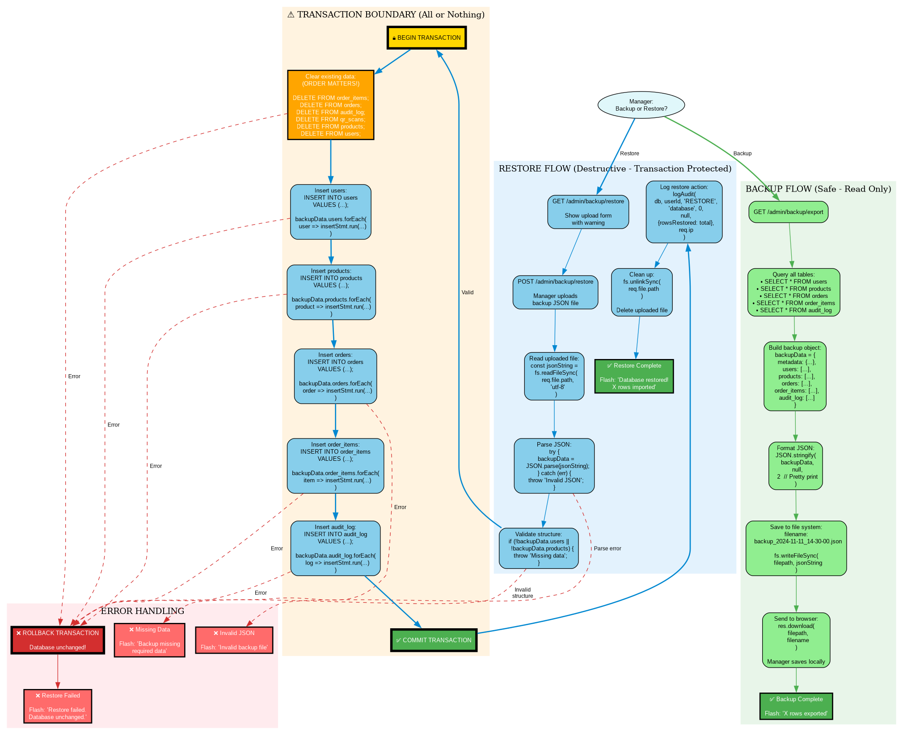
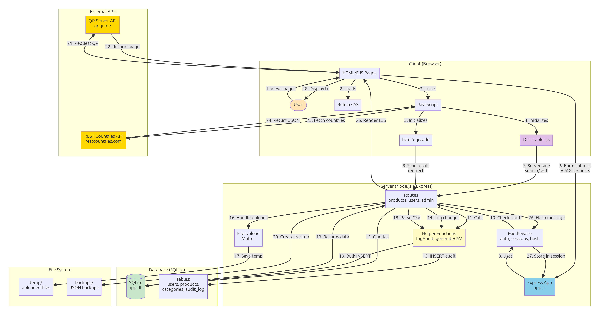

# Building Web Applications - Part 2C (Continued)
## Advanced Features & Professional Polish

*Continuation from Part 1*

---

## 💾 Section 7: JSON Backup & Restore

### Why JSON Backup?

**Database backups** = Insurance policy

**Scenarios:**
- 😱 Accidentally deleted all products
- 💥 Database file corrupted
- 🔄 Migrating to new server
- 🧪 Testing with real data
- 📤 Sharing data with another app

**JSON format benefits:**
- ✅ Human-readable (can inspect with text editor)
- ✅ Works everywhere (any programming language)
- ✅ Easy to version control (Git)
- ✅ Can manually edit if needed



---

### Backup: Database → JSON

**Route:**

```javascript
app.get('/admin/backup/json', requireAdmin, (req, res) => {
  // Get all data from all tables
  const backup = {
    metadata: {
      backup_date: new Date().toISOString(),
      app_version: '1.0.0',
      created_by: res.locals.user.name
    },
    users: db.prepare('SELECT * FROM users').all(),
    products: db.prepare('SELECT * FROM products').all(),
    categories: db.prepare('SELECT * FROM categories').all(),
    sales: db.prepare('SELECT * FROM sales').all()
    // Add all your tables here
  };
  
  // Send as download
  const filename = `backup_${new Date().toISOString().split('T')[0]}.json`;
  res.setHeader('Content-Type', 'application/json');
  res.setHeader('Content-Disposition', `attachment; filename=${filename}`);
  res.json(backup);
});
```

**Add button to admin panel:**

```html
<a href="/admin/backup/json" class="button is-success">
  📥 Download JSON Backup
</a>
```

**Result:** Downloads `backup_2025-11-11.json`:

```json
{
  "metadata": {
    "backup_date": "2025-11-11T10:30:00.000Z",
    "app_version": "1.0.0",
    "created_by": "Administrator"
  },
  "users": [
    {
      "id": 1,
      "username": "admin",
      "name": "Administrator",
      "role": "admin",
      "created_at": "2025-11-01T00:00:00.000Z"
    }
  ],
  "products": [
    {
      "id": 1,
      "name": "Skyflakes",
      "price": 35.5,
      "stock": 100,
      "category_id": 1
    }
  ]
}
```

---

### Restore: JSON → Database

**Upload form:**

```html
<form method="POST" action="/admin/restore/json" enctype="multipart/form-data">
  <div class="field">
    <label class="label">Upload Backup File</label>
    <div class="control">
      <div class="file has-name">
        <label class="file-label">
          <input class="file-input" type="file" name="backupFile" accept=".json" required>
          <span class="file-cta">
            <span class="file-label">Choose backup file…</span>
          </span>
          <span class="file-name" id="fileName">No file selected</span>
        </label>
      </div>
    </div>
  </div>
  
  <div class="field">
    <label class="checkbox">
      <input type="checkbox" name="clearExisting" value="yes">
      Clear existing data first (⚠️ Dangerous! This will delete everything)
    </label>
  </div>
  
  <div class="field">
    <div class="control">
      <button type="submit" class="button is-warning" 
              onclick="return confirm('Are you sure? This will modify your database!')">
        📤 Restore from Backup
      </button>
    </div>
  </div>
</form>
```

**Route:**

```javascript
const multer = require('multer');
const fs = require('fs');

const upload = multer({ dest: 'temp/' });

app.post('/admin/restore/json', requireAdmin, upload.single('backupFile'), (req, res) => {
  try {
    // Read and parse JSON
    const fileContent = fs.readFileSync(req.file.path, 'utf-8');
    const backup = JSON.parse(fileContent);
    
    // Validate backup format
    if (!backup.metadata || !backup.users || !backup.products) {
      throw new Error('Invalid backup file format');
    }
    
    // Optional: Clear existing data
    if (req.body.clearExisting === 'yes') {
      db.exec('DELETE FROM sales');
      db.exec('DELETE FROM products');
      db.exec('DELETE FROM categories');
      // Don't delete users (you might lock yourself out!)
    }
    
    // Restore categories first (referenced by products)
    if (backup.categories) {
      const catStmt = db.prepare('INSERT OR IGNORE INTO categories (id, name) VALUES (?, ?)');
      backup.categories.forEach(cat => {
        catStmt.run(cat.id, cat.name);
      });
    }
    
    // Restore products
    if (backup.products) {
      const prodStmt = db.prepare(`
        INSERT OR IGNORE INTO products (id, name, price, stock, category_id)
        VALUES (?, ?, ?, ?, ?)
      `);
      backup.products.forEach(prod => {
        prodStmt.run(prod.id, prod.name, prod.price, prod.stock, prod.category_id);
      });
    }
    
    // Restore sales
    if (backup.sales) {
      const salesStmt = db.prepare(`
        INSERT OR IGNORE INTO sales (id, product_id, quantity, total_price, cashier_id, created_at)
        VALUES (?, ?, ?, ?, ?, ?)
      `);
      backup.sales.forEach(sale => {
        salesStmt.run(sale.id, sale.product_id, sale.quantity, sale.total_price, sale.cashier_id, sale.created_at);
      });
    }
    
    // Clean up temp file
    fs.unlinkSync(req.file.path);
    
    req.flash('success', `Backup restored successfully! (from ${backup.metadata.backup_date})`);
    res.redirect('/admin');
    
  } catch (error) {
    console.error('Restore error:', error);
    req.flash('error', 'Failed to restore backup: ' + error.message);
    res.redirect('/admin');
  }
});
```

---

### Automatic Daily Backups (Bonus)

**Using node-cron for scheduled backups:**

```bash
npm install node-cron
```

```javascript
const cron = require('node-cron');
const fs = require('fs');
const path = require('path');

// Run every day at 2 AM
cron.schedule('0 2 * * *', () => {
  console.log('Running automatic backup...');
  
  const backup = {
    metadata: {
      backup_date: new Date().toISOString(),
      backup_type: 'automatic'
    },
    users: db.prepare('SELECT * FROM users').all(),
    products: db.prepare('SELECT * FROM products').all(),
    categories: db.prepare('SELECT * FROM categories').all(),
    sales: db.prepare('SELECT * FROM sales').all()
  };
  
  const filename = `auto_backup_${new Date().toISOString().split('T')[0]}.json`;
  const backupDir = 'backups';
  
  // Create backups directory if it doesn't exist
  if (!fs.existsSync(backupDir)) {
    fs.mkdirSync(backupDir);
  }
  
  fs.writeFileSync(
    path.join(backupDir, filename),
    JSON.stringify(backup, null, 2)
  );
  
  console.log(`✅ Automatic backup saved: ${filename}`);
});
```

---

## 🎯 Section 8: Complete Example - Enhanced Store Inventory

Let's put it all together! Here's a complete v4 store with ALL Part 2C features:

### Features Checklist

- ✅ DataTables.js (search, sort, paginate)
- ✅ Flash messages (success/error feedback)
- ✅ CSV export (download products)
- ✅ CSV import (bulk upload)
- ✅ QR codes (product labels)
- ✅ Country selector (customer countries)
- ✅ Audit logging (track all changes)
- ✅ JSON backup/restore



---

### Enhanced Products List (views/products/list.ejs)

```html
<!DOCTYPE html>
<html>
<head>
  <title>Products - Store Inventory</title>
  <link rel="stylesheet" href="https://cdn.jsdelivr.net/npm/bulma@0.9.4/css/bulma.min.css">
  <link rel="stylesheet" href="https://cdn.datatables.net/1.13.6/css/jquery.dataTables.min.css">
  <link rel="stylesheet" href="https://cdn.datatables.net/buttons/2.4.1/css/buttons.dataTables.min.css">
</head>
<body>
  <%- include('../partials/navbar') %>
  
  <section class="section">
    <div class="container">
      <%- include('../partials/flash') %>
      
      <div class="level">
        <div class="level-left">
          <h1 class="title">Products</h1>
        </div>
        <div class="level-right">
          <% if (user.role === 'admin') { %>
            <a href="/products/new" class="button is-primary mr-2">
              ➕ Add Product
            </a>
            <a href="/products/import" class="button is-info mr-2">
              📤 Import CSV
            </a>
            <a href="/products/export/csv" class="button is-success">
              📥 Export CSV
            </a>
          <% } %>
        </div>
      </div>
      
      <table id="productsTable" class="table is-fullwidth is-striped is-hoverable">
        <thead>
          <tr>
            <th>Name</th>
            <th>Category</th>
            <th>Price</th>
            <th>Stock</th>
            <th>Actions</th>
          </tr>
        </thead>
        <tbody>
          <% products.forEach(product => { %>
            <tr>
              <td><%= product.name %></td>
              <td><%= product.category_name %></td>
              <td>₱<%= product.price.toFixed(2) %></td>
              <td>
                <span class="tag <%= product.stock < 10 ? 'is-danger' : product.stock < 50 ? 'is-warning' : 'is-success' %>">
                  <%= product.stock %>
                </span>
              </td>
              <td>
                <a href="/products/<%= product.id %>" class="button is-small is-info">View</a>
                <% if (user.role === 'admin') { %>
                  <a href="/products/<%= product.id %>/edit" class="button is-small is-warning">Edit</a>
                <% } %>
              </td>
            </tr>
          <% }); %>
        </tbody>
      </table>
    </div>
  </section>
  
  <script src="https://code.jquery.com/jquery-3.7.0.min.js"></script>
  <script src="https://cdn.datatables.net/1.13.6/js/jquery.dataTables.min.js"></script>
  <script src="https://cdn.datatables.net/buttons/2.4.1/js/dataTables.buttons.min.js"></script>
  <script src="https://cdnjs.cloudflare.com/ajax/libs/jszip/3.10.1/jszip.min.js"></script>
  <script src="https://cdn.datatables.net/buttons/2.4.1/js/buttons.html5.min.js"></script>
  
  <script>
    $(document).ready(function() {
      $('#productsTable').DataTables({
        pageLength: 25,
        order: [[0, 'asc']],
        dom: 'Bfrtip',
        buttons: ['copy', 'csv', 'excel'],
        columnDefs: [
          { orderable: false, targets: 4 }
        ]
      });
    });
  </script>
</body>
</html>
```

---

### Product Detail with QR Code (views/products/detail.ejs)

```html
<section class="section">
  <div class="container">
    <%- include('../partials/flash') %>
    
    <div class="columns">
      <div class="column is-8">
        <div class="box">
          <h1 class="title"><%= product.name %></h1>
          
          <table class="table is-fullwidth">
            <tr>
              <th>Category:</th>
              <td><%= product.category_name %></td>
            </tr>
            <tr>
              <th>Price:</th>
              <td class="is-size-4 has-text-weight-bold">₱<%= product.price.toFixed(2) %></td>
            </tr>
            <tr>
              <th>Stock:</th>
              <td>
                <span class="tag <%= product.stock < 10 ? 'is-danger' : product.stock < 50 ? 'is-warning' : 'is-success' %> is-large">
                  <%= product.stock %> units
                </span>
              </td>
            </tr>
            <tr>
              <th>Added:</th>
              <td><%= new Date(product.created_at).toLocaleString() %></td>
            </tr>
          </table>
          
          <div class="buttons">
            <a href="/products" class="button">Back to List</a>
            <% if (user.role === 'admin') { %>
              <a href="/products/<%= product.id %>/edit" class="button is-warning">Edit</a>
              <form method="POST" action="/products/<%= product.id %>/delete" style="display: inline;" 
                    onsubmit="return confirm('Delete this product?')">
                <button type="submit" class="button is-danger">Delete</button>
              </form>
            <% } %>
          </div>
        </div>
      </div>
      
      <div class="column is-4">
        <div class="box has-text-centered">
          <h3 class="title is-5">Product QR Code</h3>
          " 
               alt="Product QR Code"
               style="max-width: 100%;">
          <p class="mt-3">
            <small>Scan to view product details</small>
          </p>
          <button class="button is-small is-primary mt-2" onclick="window.print()">
            🖨️ Print QR Code
          </button>
        </div>
      </div>
    </div>
  </div>
</section>
```

---

## 🐛 Section 9: Troubleshooting Guide

### DataTables Not Working

**Problem:** Table doesn't get search/sort features

**Checklist:**
- [ ] jQuery loaded BEFORE DataTables
- [ ] Table has `<thead>` and `<tbody>`
- [ ] Table ID matches JavaScript selector
- [ ] No JavaScript errors in console

**Fix:**
```html
<!-- Correct order -->
<script src="https://code.jquery.com/jquery-3.7.0.min.js"></script>
<script src="https://cdn.datatables.net/1.13.6/js/jquery.dataTables.min.js"></script>
<script>
  $(document).ready(function() {
    $('#myTable').DataTable(); // ID must match table id="myTable"
  });
</script>
```

---

### Flash Messages Not Appearing

**Problem:** Messages don't show after redirect

**Checklist:**
- [ ] `connect-flash` installed and configured
- [ ] Session middleware configured BEFORE flash
- [ ] Flash partial included in view
- [ ] Using `req.flash()` before redirect

**Fix:**
```javascript
// app.js setup
const session = require('express-session');
const flash = require('connect-flash');

app.use(session({ /* ... */ }));
app.use(flash()); // AFTER session

// Make available in views
app.use((req, res, next) => {
  res.locals.success_msg = req.flash('success');
  res.locals.error_msg = req.flash('error');
  next();
});

// In route
app.post('/products', (req, res) => {
  // ... save product ...
  req.flash('success', 'Product added!'); // BEFORE redirect
  res.redirect('/products');
});
```

---

### CSV Import Fails

**Problem:** "Cannot read property 'path' of undefined"

**Cause:** `multer` not configured or form missing `enctype`

**Fix:**
```html
<!-- Form MUST have enctype="multipart/form-data" -->
<form method="POST" action="/import" enctype="multipart/form-data">
  <input type="file" name="csvFile" accept=".csv">
  <button type="submit">Upload</button>
</form>
```

```javascript
// Route MUST use multer middleware
const multer = require('multer');
const upload = multer({ dest: 'temp/' });

app.post('/import', upload.single('csvFile'), (req, res) => {
  console.log(req.file.path); // Now works!
  // ...
});
```

---

### QR Codes Not Showing

**Problem:** Broken image icon

**Causes:**
- URL not properly encoded
- Data contains special characters
- API server down

**Fix:**
```html
<!-- WRONG - not encoded -->


<!-- CORRECT - encoded -->
">
```

---

### REST Countries API Not Loading

**Problem:** Dropdown shows "Loading countries..." forever

**Debug:**
```javascript
fetch('https://restcountries.com/v3.1/all')
  .then(response => {
    console.log('Response status:', response.status);
    return response.json();
  })
  .then(countries => {
    console.log('Loaded countries:', countries.length);
    // ... populate dropdown ...
  })
  .catch(error => {
    console.error('Fetch error:', error);
    // Show error to user
    document.getElementById('country').innerHTML = '<option>Error loading countries (check internet connection)</option>';
  });
```

**Common issues:**
- No internet connection
- API rate limit (wait a minute and try again)
- Browser blocking cross-origin request (unlikely with this API)

---

### Audit Log Slowing Down App

**Problem:** App becomes slow with 10,000+ audit entries

**Solution 1: Add index**
```sql
CREATE INDEX idx_audit_log_user_id ON audit_log(user_id);
CREATE INDEX idx_audit_log_created_at ON audit_log(created_at);
```

**Solution 2: Limit query results**
```javascript
// Only load recent logs
const logs = db.prepare(`
  SELECT * FROM audit_log 
  ORDER BY created_at DESC 
  LIMIT 500
`).all();
```

**Solution 3: Archive old logs**
```javascript
// Move logs older than 90 days to archive table
db.exec(`
  CREATE TABLE IF NOT EXISTS audit_log_archive AS 
  SELECT * FROM audit_log 
  WHERE created_at < date('now', '-90 days')
`);

db.exec(`
  DELETE FROM audit_log 
  WHERE created_at < date('now', '-90 days')
`);
```

---

## 🎓 Section 10: Summary - What You've Learned

**Congratulations!** You've mastered advanced web app features! 🎉

### Part 2C Skills Checklist

✅ **DataTables.js** - Professional table management (search, sort, paginate, export)  
✅ **Flash Messages** - User feedback that persists across redirects  
✅ **CSV Export** - Download data to Excel/Google Sheets  
✅ **CSV Import** - Bulk upload data from spreadsheets  
✅ **QR Codes** - Generate scannable codes for easy sharing  
✅ **REST Countries API** - Integrate external data sources  
✅ **Audit Logging** - Track who changed what, when  
✅ **JSON Backup/Restore** - Database disaster recovery  

---

### The Complete Technology Stack

**Part 1:** Node.js, Express, EJS, JSON files, Bulma CSS  
**Part 2A:** SQLite, better-sqlite3, SQL queries, prepared statements  
**Part 2B:** bcrypt, express-session, authentication, authorization  
**Part 2C:** DataTables, flash messages, CSV, QR codes, APIs, audit logs  

**You can now build professional web applications!** 🚀

---

## 🚀 What's Next?

### 1. Complete Your Mini-Projects v4

Upgrade all three projects to v4 with Part 2C features:

**Barangay Directory v4:**
- DataTables for resident list
- CSV export for reports
- QR codes on resident ID cards
- Audit log for all changes
- JSON backup for disaster recovery

**Class List v4:**
- DataTables for student list
- CSV import for bulk student enrollment
- Flash messages for grade updates
- Audit log for grade changes
- REST Countries API for student countries

**Store Inventory v4:**
- DataTables for product list with export buttons
- CSV import for supplier product lists
- QR codes for product labels
- Customer country tracking (REST Countries API)
- Audit log for price changes and deletions
- JSON backup before major updates

---

### 2. Deploy to Production

**Railway Deployment Checklist:**

- [ ] Set environment variables:
  - `SESSION_SECRET` (long random string)
  - `NODE_ENV=production`
- [ ] Test backup/restore locally first
- [ ] Document admin credentials securely
- [ ] Test all features on Railway
- [ ] Monitor audit logs for issues

---

### 3. Add Your Own Features

**Ideas for expansion:**
- Email notifications (nodemailer)
- PDF generation (pdfkit)
- Charts and graphs (Chart.js)
- Real-time updates (Socket.io)
- File uploads (images for products)
- Advanced search (full-text search)
- Dashboard with statistics
- Mobile-responsive design

---

### 4. Build Your Capstone Project

**Apply everything you've learned!**

**Possible projects:**
- School management system
- Clinic patient records
- Restaurant ordering system
- Library book tracking
- Event registration system
- Tutoring appointment scheduler
- Small business POS system

**Requirements:**
- Use SQLite database (Part 2A)
- Implement authentication (Part 2B)
- Include at least 3 Part 2C features
- Deploy to Railway
- Document for other users

---

## 💭 Reflection Questions

1. Which Part 2C feature do you think is most valuable for real businesses?
2. How would audit logging help prevent problems in a store?
3. Why is CSV export/import important for data portability?
4. When would you use DataTables vs server-side search?
5. What other APIs could you integrate into your projects?

**Discuss with classmates or write in your journal!**

---

## 📚 Additional Resources

### Libraries Used in Part 2C

- **DataTables:** [datatables.net](https://datatables.net)
- **connect-flash:** [npmjs.com/package/connect-flash](https://www.npmjs.com/package/connect-flash)
- **csv-writer:** [npmjs.com/package/csv-writer](https://www.npmjs.com/package/csv-writer)
- **csv-parse:** [npmjs.com/package/csv-parse](https://www.npmjs.com/package/csv-parse)
- **multer:** [npmjs.com/package/multer](https://www.npmjs.com/package/multer)
- **node-cron:** [npmjs.com/package/node-cron](https://www.npmjs.com/package/node-cron)

### Free APIs to Explore

- **REST Countries:** [restcountries.com](https://restcountries.com)
- **QR Server API:** [goqr.me/api](https://goqr.me/api)
- **OpenWeather API:** [openweathermap.org/api](https://openweathermap.org/api)
- **Random User API:** [randomuser.me](https://randomuser.me)
- **Public APIs List:** [github.com/public-apis/public-apis](https://github.com/public-apis/public-apis)

---

## 🏆 You Did It!

**From JSON files to enterprise-grade applications:**
- 3 phases (2A, 2B, 2C)
- 12+ advanced concepts
- 3 complete mini-projects (v2 → v3 → v4)
- Deployment-ready code

**You're now ready to build real applications for real clients!** 🎉

See you in the Migration Guide for step-by-step project upgrades!

---

**Happy coding, and enjoy building amazing things!** 💻✨

*Last updated: November 11, 2025*
