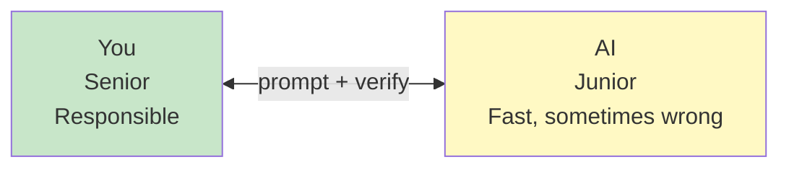
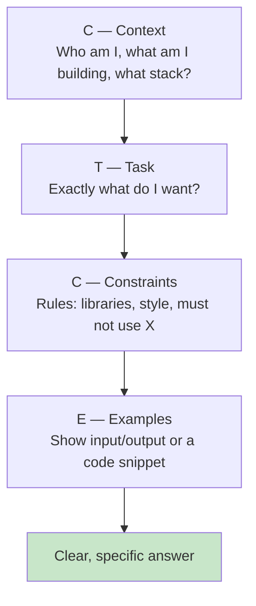
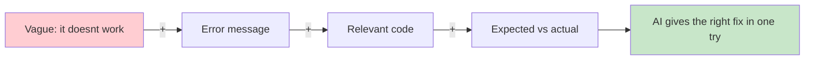
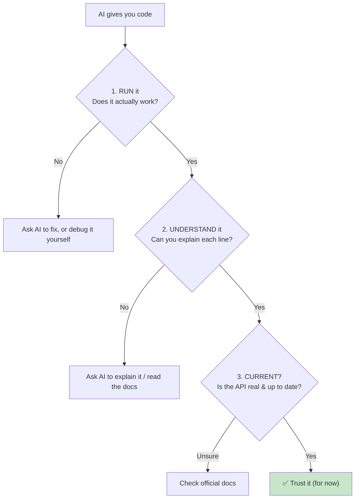
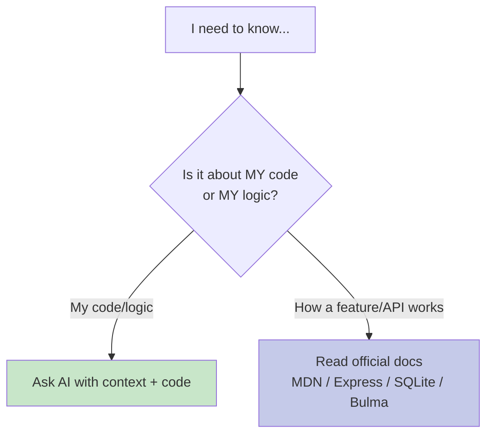
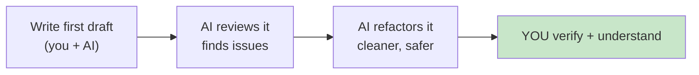
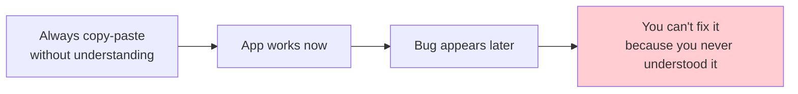
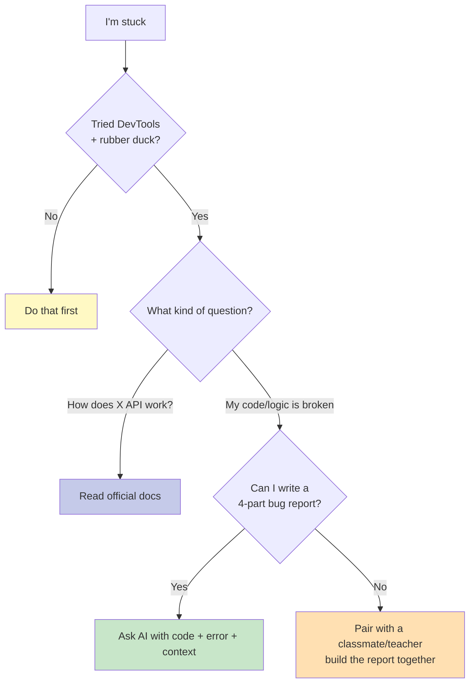

# Building with AI: Your Junior Pair Programmer

**Grade 10 - ICT (Full-Stack Elective)**
**Quarter 4 · Week 6**
**Duration:** 1–2 weeks
**Prerequisite:** [`debugging-devtools`](../debugging-devtools/lecture.md) (you'll need to write good bug reports to get good AI help)

---

## 🎯 Learning Objectives

By the end of this lecture, you will be able to:

1. ✅ Treat AI as a **junior pair programmer** — fast, helpful, but sometimes wrong
2. ✅ Write **effective prompts** using the C-T-C-E structure (Context, Task, Constraints, Examples)
3. ✅ Paste **errors and code** the right way so AI gives correct fixes
4. ✅ **Verify** AI output — spot hallucinations and outdated APIs before you trust them
5. ✅ Know when to **read the docs** instead of asking AI
6. ✅ Use AI for **refactoring and code review**, not just writing from scratch
7. ✅ Use AI **ethically** — learn from it, don't outsource your understanding

---

## 📖 Table of Contents

1. [The Right Mindset: AI Is a Junior Pair](#section-1)
2. [Anatomy of a Good Prompt (C-T-C-E)](#section-2)
3. [Pasting Errors & Code the Right Way](#section-3)
4. [Verifying AI Output (It Lies Confidently)](#section-4)
5. [When to Read the Docs Instead](#section-5)
6. [Using AI for Refactoring & Code Review](#section-6)
7. [Ethics: Learn, Don't Outsource Understanding](#section-7)
8. [When to Use AI (vs Docs vs DevTools vs a Person)](#section-8)
9. [Mini-Projects](#mini-projects)
10. [Final Challenge](#final-challenge)
11. [Troubleshooting](#troubleshooting)
12. [What's Next?](#whats-next)

---

<a name="section-1"></a>
## 1. The Right Mindset: AI Is a Junior Pair

### **Meet Your New Teammate**

Imagine a teammate who:
- ✅ Knows **a lot** and answers **instantly**
- ✅ Never gets tired of your questions
- ✅ Can write boilerplate code in seconds
- ❌ Sometimes **makes things up** with total confidence
- ❌ Suggests **outdated** code from old tutorials
- ❌ Doesn't actually **run** the code, so it can't know if it works

That teammate is an AI coding assistant (ChatGPT, Claude, Gemini, Copilot, etc.). The winning mindset:

> **You are the senior developer. The AI is your fast, eager, sometimes-wrong junior. You stay responsible for the result.**



### **What AI Is Great At**

- Explaining a confusing error message in plain words
- Generating **boilerplate** (the boring repetitive code)
- Suggesting **multiple approaches** to a problem
- Translating an idea into a first draft
- Reviewing your code for obvious mistakes

### **What AI Is Bad At**

- Knowing the **exact current version** of a library's API
- Understanding your **whole project** at once
- Guaranteeing the code actually **runs**
- Knowing what you **didn't** tell it

> 📌 **Golden rule:** The AI's answer is a *draft*, not a *verdict*. Always run it and read it.

---

<a name="section-2"></a>
## 2. Anatomy of a Good Prompt (C-T-C-E)

A **prompt** is the instruction you give the AI. Vague prompts give vague (or wrong) answers. Use the **C-T-C-E** structure:



| Letter | Question it answers | Example |
|---|---|---|
| **C**ontext | What's the situation? | *"I'm a Grade 10 student building a sari-sari store app with vanilla JS + Express + SQLite."* |
| **T**ask | What exactly do you want? | *"Write a function to add an item to the cart."* |
| **C**onstraints | What rules apply? | *"No external libraries. Use prepared statements for SQL. Add a comment explaining each line."* |
| **E**xamples | Can you show what you mean? | *"Input: {name:'Sardinas', qty:2, price:25}. Expected total: 50."* |

### **Bad vs Good Prompt**

❌ **Bad:**
> "fix my code"

(No context, no code, no error. The AI will guess — badly.)

✅ **Good:**
> "I'm building a sari-sari inventory page with vanilla JavaScript. When I click *Add Item*, the Console shows `TypeError: Cannot read properties of null (reading 'value')` at app.js:14. Here's my code: [paste]. My HTML button has id `add-btn`. Why is this null and how do I fix it?"

**🎯 Try It:** Open [`assets/prompt-worksheet.html`](assets/prompt-worksheet.html). Rewrite three vague prompts into proper C-T-C-E prompts. Then (if you have AI access) test them and compare the answers.

---

<a name="section-3"></a>
## 3. Pasting Errors & Code the Right Way

This is where the [`debugging-devtools`](../debugging-devtools/lecture.md) lecture pays off. Remember the **4-part bug report**? That *is* a great AI prompt.

### **The Perfect "Help Me Fix This" Prompt**

1. **What you expected.**
2. **What actually happened.**
3. **The exact error message** (copy it — don't paraphrase).
4. **The smallest code that reproduces it** (paste the relevant function, not your whole project).



### **Paste the SMALLEST Reproducible Code**

❌ **Don't** paste 500 lines of your whole app. The AI gets lost.

✅ **Do** paste just the function that's breaking, plus any `const`s it uses:

```javascript
// I have this function:
function getTotal(cart) {
  return cart.reduce((sum, item) => sum + item.price, 0);
}
// cart looks like: [{ name: 'Sardinas', quantity: 2, price: 25 }]
// I expect 50, but I get 25. Why?
```

The AI will instantly spot it: you're adding `item.price` once per item, ignoring `quantity`. ✅

> 💡 **Pro tip:** Tell the AI what your **data looks like** (a sample object). Half of all "AI was wrong" moments happen because the AI guessed your data shape wrong.

---

<a name="section-4"></a>
## 4. Verifying AI Output (It Lies Confidently)

This is the **most important** section. AI can produce code that **looks** perfect and **doesn't work** — or worse, works but has a hidden bug.

### **Three Things to Check on Every AI Answer**



### **Common AI Mistakes to Watch For**

| Trap | Example | How to catch |
|---|---|---|
| **Hallucinated function** | Invents `array.sum()` (doesn't exist in JS) | Run it; the error reveals it |
| **Outdated API** | Old Express syntax, removed Bulma classes | Check the official docs |
| **Plausible but wrong logic** | Off-by-one, wrong condition | **Read it line by line** before running |
| **Over-engineering** | Adds a library you didn't ask for | Re-read your constraints |

### **The "Explain It Back" Test**

> 📌 If you can't explain what the AI's code does to a classmate, **you don't understand it yet** — and you shouldn't ship it. Ask the AI to explain it, or simplify it.

✅ **Trust, but verify.** Run it. Read it. Understand it.

---

<a name="section-5"></a>
## 5. When to Read the Docs Instead

AI is great for *your* problems. But for **exact, authoritative** information about how a tool works, the **official documentation** is the source of truth.

### **Docs-First Moments**

Reach for the docs (not AI) when you need:
- The **exact name** of an HTML attribute, CSS property, or JS method → **MDN** (developer.mozilla.org)
- The **current** Express/SQLite/Bulma API (AI may give an old version)
- A **complete list** of options/parameters
- The **official** way to do something (AI might suggest a hack)



### **The Combo Move (Best of Both)**

1. **Docs** tell you the *correct, current* way.
2. **AI** helps you *apply* it to your specific situation.

Example: read the MDN page on `fetch()`, then ask the AI *"Given this MDN pattern, how do I adapt it to load my sari-sari products from /api/products?"*

> 💡 Skimming docs builds **real** understanding that compounds over time. Always-only-asking-AI builds dependency.

---

<a name="section-6"></a>
## 6. Using AI for Refactoring & Code Review

AI isn't just for writing new code. Its best uses are often **improving** code you already wrote.

### **Refactoring (making code cleaner without changing behavior)**

> *"Here's my working add-item function. It works, but it's messy. Refactor it to be more readable, but don't change what it does. Explain each change."*

### **Code Review (finding problems)**

> *"Review this Express route for security and bugs. Point out anything a beginner might miss."*

The AI might catch things like: missing `await`, SQL injection risk, no input validation, unused variables.

### **Explaining confusing code**

> *"Explain this code like I'm 15, line by line."*



> 📌 **You write it, AI polishes it.** Not the other way around — if AI writes everything, you learn nothing.

---

<a name="section-7"></a>
## 7. Ethics: Learn, Don't Outsource Understanding

### **The Danger: Skill Atrophy**

If you copy-paste every answer without understanding, your app works **today** but you can't maintain it **tomorrow**. When it breaks, you're helpless.



### **Academic Honesty**

- ✅ Using AI to **learn**, **explain**, and **debug** = good.
- ✅ Using AI to **draft** code you then understand = good.
- ❌ Submitting AI code as your own **without understanding** it = dishonest (and risky).
- ❌ Using AI on a **closed-book assessment** when not allowed = cheating.

### **The Litmus Test**

> If your teacher pointed at any line of your code and asked *"why did you write this?"*, could you answer? If not, you've outsourced too much. Go back and understand it.

### **Attribution**

When AI significantly helped write a chunk of your capstone, it's good practice to note it in your README (e.g., *"The pagination logic was drafted with AI assistance and reviewed/understood by the author."*). Professionals do this. It's honest and professional.

---

<a name="section-8"></a>
## 8. When to Use AI (vs Docs vs DevTools vs a Person)

Putting it all together with the [`debugging-devtools`](../debugging-devtools/lecture.md) decision flow:



| Situation | Best first move |
|---|---|
| Red error in Console | DevTools → then AI with the exact error |
| "How does `fetch` work?" | MDN docs |
| "My function returns NaN" | Log values (DevTools) → AI with code + sample data |
| "Design my database tables" | [`data-modeling`](../data-modeling/lecture.md) lesson → AI to review your draft |
| "Is this code secure?" | AI code review → verify suggestions in docs |
| "I'm completely lost" | A person (teacher/classmate) — then bring AI in |

---

<a name="mini-projects"></a>
## 9. Mini-Projects

### **Mini-Project 1: Prompt Makeover** (Beginner)
Take three vague prompts ("make my site look better", "fix the database", "add login") and rewrite each using the **C-T-C-E** structure. Use [`assets/prompt-worksheet.html`](assets/prompt-worksheet.html) as your template.

### **Mini-Project 2: Verify or Bust** (Beginner)
Ask an AI to "write a function that sums all even numbers in an array." Run it. Then **deliberately** ask it a question designed to produce a hallucinated method (e.g., "use the built-in `.sumEven()` method"). Run that too. Document what breaks and why verification matters.

### **Mini-Project 3: Refactor Relay** (Intermediate)
Take a messy function from an earlier project. Ask the AI to refactor it for readability. **Before** accepting the result, explain each changed line in your own words. Then run it to confirm the behavior didn't change.

---

<a name="final-challenge"></a>
## 10. Final Challenge

### **The Explain-It-Back Capstone Check**

For your current capstone project, pick the **three trickiest** pieces of code (yours or AI-assisted). For each:

1. Write a C-T-C-E prompt asking the AI to **explain** that code to a beginner.
2. Read the explanation. Re-explain it **in your own words** to a classmate.
3. If your classmate understands it → ✅ you own it.
4. If they don't → simplify the code until they do.

**Deliverable:** a short "I understand my own code" document where you explain each tricky section yourself — no copy-paste allowed.

---

<a name="troubleshooting"></a>
## 11. Troubleshooting

### **Problem: "The AI's code doesn't run"**
It happens constantly. Run it, read the **real** error from DevTools, and paste *that* error back to the AI in a follow-up. Iterate.

### **Problem: "The AI keeps using a method that doesn't exist"**
It's hallucinating or outdated. Tell it the exact error ("`array.sumEven is not a function`") or check MDN yourself.

### **Problem: "The AI keeps adding libraries I didn't ask for"**
Re-state your constraints: *"Vanilla JS only. No npm packages. No frameworks."*

### **Problem: "I don't understand the AI's answer"**
Ask: *"Explain this to me line by line as if I'm a beginner. Use an analogy."* If you still don't get it, simplify the question or ask a person.

### **Problem: "I feel like I'm not learning"**
You may be copy-pasting too much. Force yourself to **type** the AI's code and **comment** each line before running it. Understanding is the goal.

---

<a name="whats-next"></a>
## 12. What's Next?

### **You Now Know:**
✅ The senior/junior mindset for working with AI
✅ The C-T-C-E prompt structure
✅ How to paste errors and code for great fixes
✅ How to verify (run → understand → check currency)
✅ When docs beat AI, and when AI beats docs
✅ How to use AI for refactoring and review
✅ How to use AI ethically — and keep learning

### **Coming Up Next**
In **Quarter 6** (extension), you'll go deeper: using AI for **agentic** tasks (multi-step refactors), **AI code review** on teammates' pull requests, and turning AI into a true development partner on your advanced capstone.

### **The Big Idea**
> AI doesn't replace developers — it **multiplies** developers who understand what they're doing. The students who win are the ones who learn *with* AI, not *from* AI blindly.

---

**📝 Quick Reference Card**

```
WORKING WITH AI — CHEAT SHEET

MINDSET
You = senior (responsible). AI = fast junior (sometimes wrong).

PROMPT STRUCTURE (C-T-C-E)
• Context   — what am I building, what stack?
• Task      — exactly what do I want?
• Constraints — libraries, style, "must not use X"
• Examples  — sample data, input → expected output

FIX-IT PROMPT (4 parts, same as a bug report)
1. Expected behavior
2. Actual behavior
3. EXACT error message
4. Smallest code that reproduces it

VERIFY EVERY ANSWER
1. RUN it
2. UNDERSTAND it (explain it back)
3. Is it CURRENT? (check docs if unsure)

WHO TO ASK
DevTools → Docs (how X works) → AI (my code/logic) → a person
```

---

**End of Building with AI Lecture**

*Created for Grade 10 Filipino Students*
*Philippine Context, Real-World Examples, Practical Skills*
