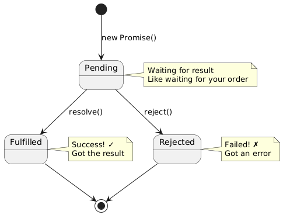
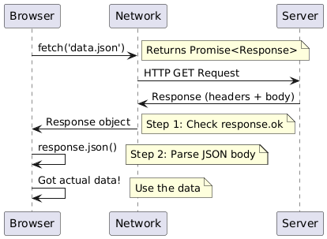
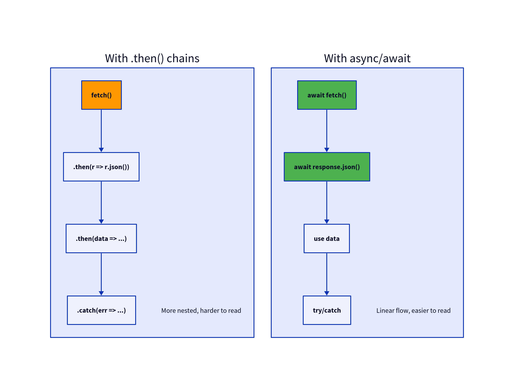
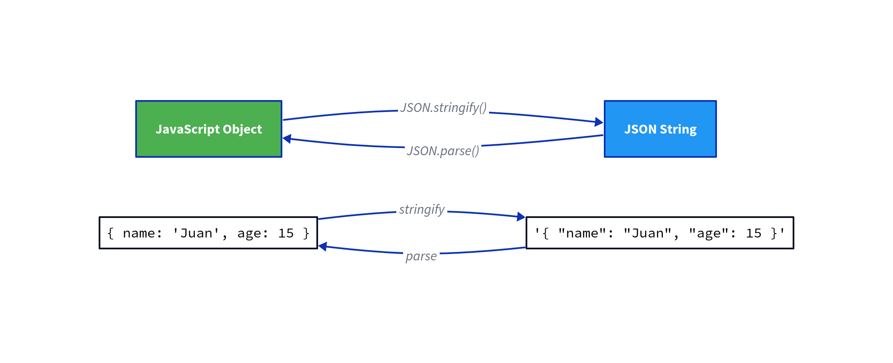
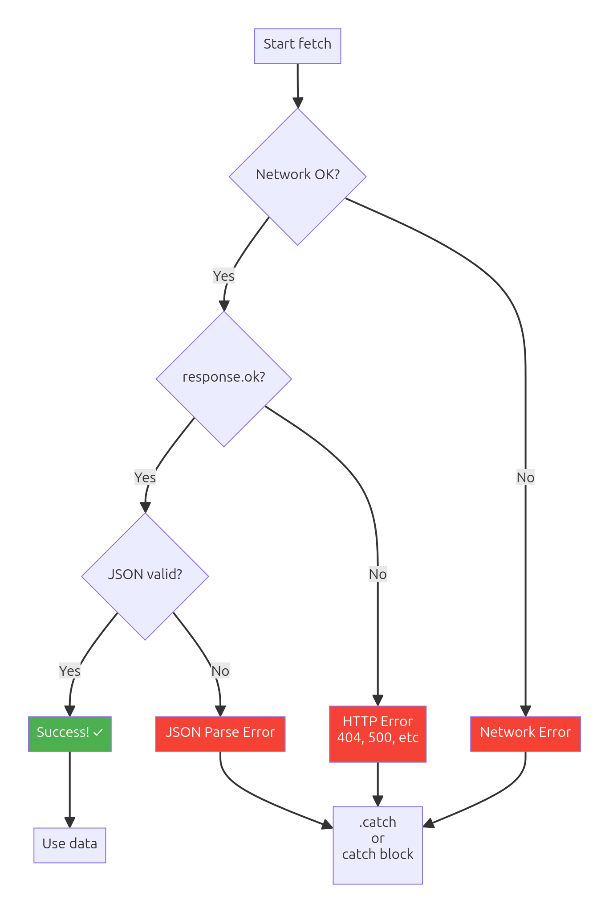
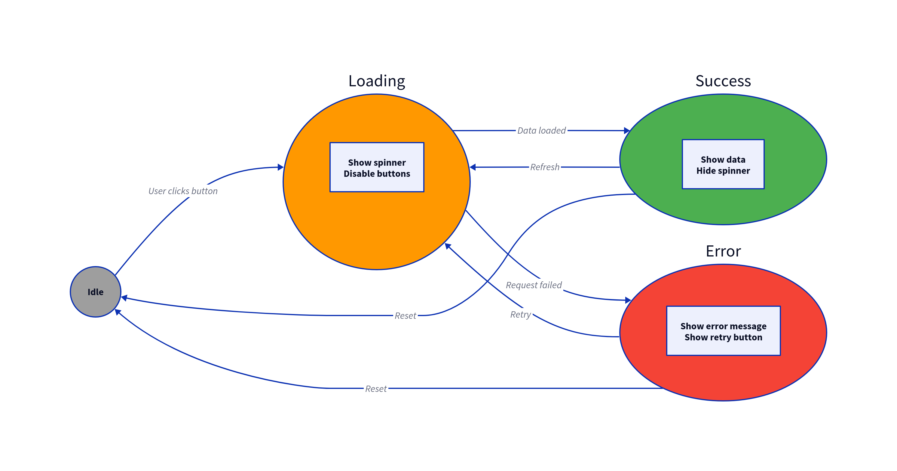
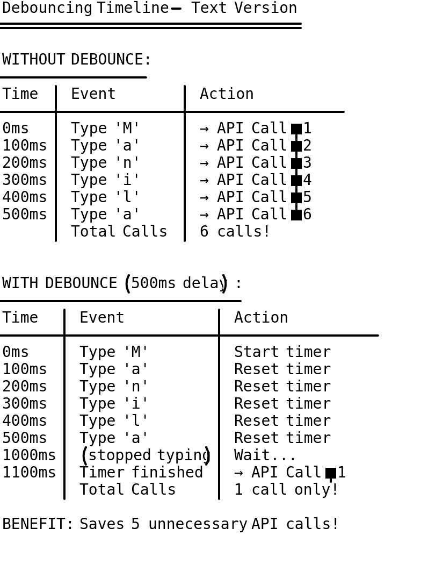

# Asynchronous JavaScript — Fetch Data Like a Pro 🚀

Welcome! 🎉

This lecture teaches you how to fetch data from servers, APIs, and files without freezing your web page. You'll learn Promises, the Fetch API, async/await, and how to handle errors like a professional developer. Perfect for building weather apps, search tools, and data dashboards!

Estimated length: ~2,200 lines. Focus: analogies, visual diagrams, hands-on practice with local and live data.

---

## Quick Plan (What We'll Cover)

- Understanding asynchronous code: why JavaScript doesn't "wait"
- Promises: pending, fulfilled, rejected states
- Fetch API: getting data from files and servers
- Async/await: modern, readable async code
- JSON: parsing and working with data
- Error handling: network failures, loading states
- Real-world patterns: search, debounce, pagination
- Mini projects: Weather Dashboard, Barangay Directory, Quiz App
- Final challenge: Data Dashboard (school/store/transport themes)

---

## Introduction — Why Asynchronous?

Imagine you're at a **Jollibee counter**. Two scenarios:

**❌ Synchronous (Blocking):**
You order Chickenjoy. The cashier stops everything, goes to the kitchen, waits for your food (5 minutes), brings it back, then serves the next customer. Everyone waits!

**✅ Asynchronous (Non-blocking):**
You order Chickenjoy. The cashier gives you a number, serves the next customer immediately. When your food is ready, they call your number. Nobody waits!

JavaScript works the **asynchronous way**. When you fetch data from a server, JavaScript doesn't freeze and wait. It gives you a "promise" that the data will arrive later, then continues running other code.

### 📁 Shared Stylesheet Reference

All practice files use our shared stylesheet from the DOM lecture:

**File:** [`assets/styles.css`](assets/styles.css)

---

## Section 1 — Understanding Asynchronous Code

### The Problem with Waiting

Try this code:

```javascript
console.log('Start');
// Imagine this takes 3 seconds...
console.log('Fetching data from server...');
console.log('End');
```

In synchronous code, everything stops during the "fetch". In JavaScript, we use **callbacks**, **Promises**, or **async/await** to handle "later" events.

### The Simplest Async Example: setTimeout

```javascript
console.log('Ordering food...');

setTimeout(function() {
  console.log('Your Chickenjoy is ready!');
}, 3000); // 3 seconds later

console.log('Cashier serves next customer');
```

**Output:**
```
Ordering food...
Cashier serves next customer
Your Chickenjoy is ready!  // 3 seconds later
```

Notice: JavaScript didn't wait for `setTimeout`. It continued to the next line!

### Enter Promises

A **Promise** is like a claim stub. You don't have your item yet, but you have a promise it will be ready (or fail).

Three states:
1. **Pending** ⏳ — waiting (food is cooking)
2. **Fulfilled** ✅ — success (you got your food)
3. **Rejected** ❌ — failure (kitchen ran out of Chickenjoy)

**Visual: Promise State Machine**



This diagram shows how a Promise transitions from pending to either fulfilled or rejected. Once settled, it never changes state.

### Creating a Simple Promise

```javascript
const foodOrder = new Promise(function(resolve, reject) {
  const kitchenHasChicken = true;
  
  setTimeout(function() {
    if (kitchenHasChicken) {
      resolve('Here is your Chickenjoy!');
    } else {
      reject('Sorry, sold out!');
    }
  }, 2000);
});

foodOrder
  .then(function(message) {
    console.log('✅ Success:', message);
  })
  .catch(function(error) {
    console.log('❌ Error:', error);
  });
```

**Key concepts:**
- `resolve(value)` — marks Promise as fulfilled
- `reject(error)` — marks Promise as rejected
- `.then(callback)` — runs when fulfilled
- `.catch(callback)` — runs when rejected

---

### 🎯 Try it yourself — Promise Basics

- Open: `assets/promise-basics.html`
- How: Double-click to open in your browser

Tasks:
1) Create a Promise that resolves after 2 seconds
2) Chain `.then()` to log the result
3) Create a Promise that rejects and handle with `.catch()`

**Download:** [`promise-basics.html`](assets/promise-basics.html)

---

## Section 2 — The Fetch API

The `fetch()` function returns a Promise that resolves when data arrives from a server or file.

### Basic Syntax

```javascript
fetch('data.json')
  .then(function(response) {
    return response.json(); // Parse JSON
  })
  .then(function(data) {
    console.log(data); // Use the data
  })
  .catch(function(error) {
    console.log('Error:', error);
  });
```

### Two-Step Process

**Step 1:** `fetch(url)` returns a Promise with a **Response object**  
**Step 2:** Call `response.json()` to parse the body (also returns a Promise)

**Visual: Fetch Lifecycle**



This flowchart shows the complete fetch journey: request → response → parse JSON → use data (or handle errors at any step).

### Fetching Local Data (Philippine Provinces)

Let's fetch a list of Philippine provinces from a local JSON file:

```javascript
fetch('assets/provinces.json')
  .then(response => response.json())
  .then(provinces => {
    console.log('Provinces:', provinces);
    provinces.forEach(p => {
      console.log(`${p.name} - Capital: ${p.capital}`);
    });
  })
  .catch(error => console.error('Failed to load:', error));
```

### Checking Response Status

```javascript
fetch('assets/data.json')
  .then(function(response) {
    if (!response.ok) {
      throw new Error(`HTTP error! status: ${response.status}`);
    }
    return response.json();
  })
  .then(data => console.log(data))
  .catch(error => console.error('Error:', error));
```

**Common status codes:**
- `200` — OK (success)
- `404` — Not Found
- `500` — Server Error

---

### 🎯 Try it yourself — Fetch Demo

- Open: `assets/fetch-demo.html`
- How: Double-click to open in your browser

Tasks:
1) Fetch Philippine provinces from `provinces.json`
2) Display them in a list on the page
3) Add error handling for missing file

**Download:** [`fetch-demo.html`](assets/fetch-demo.html)  
**Data:** [`provinces.json`](assets/provinces.json)

---

## Section 3 — Async/Await (Modern Syntax)

Promises with `.then()` chains can get messy. **Async/await** makes async code look synchronous (easier to read).

### The `async` Keyword

```javascript
async function getProvinces() {
  // This function now returns a Promise automatically
}
```

### The `await` Keyword

```javascript
async function getProvinces() {
  const response = await fetch('assets/provinces.json');
  const data = await response.json();
  console.log(data);
}

getProvinces();
```

**What `await` does:** Pauses the function until the Promise resolves, then returns the value.

### Side-by-Side Comparison

**Old way (Promises):**
```javascript
fetch('data.json')
  .then(response => response.json())
  .then(data => console.log(data))
  .catch(error => console.error(error));
```

**New way (Async/Await):**
```javascript
async function loadData() {
  try {
    const response = await fetch('data.json');
    const data = await response.json();
    console.log(data);
  } catch (error) {
    console.error(error);
  }
}

loadData();
```

**Visual: Async/Await vs Promises**



This diagram shows how async/await is just "syntactic sugar" over Promises—it's the same under the hood, but much easier to read and write!

### Error Handling with Try/Catch

```javascript
async function loadProvinces() {
  try {
    const response = await fetch('assets/provinces.json');
    if (!response.ok) {
      throw new Error(`HTTP ${response.status}`);
    }
    const data = await response.json();
    return data;
  } catch (error) {
    console.error('Failed to load provinces:', error);
    return []; // Return empty array as fallback
  }
}
```

---

### 🎯 Try it yourself — Async/Await Demo

- Open: `assets/async-await-demo.html`
- How: Double-click to open in your browser

Tasks:
1) Refactor the fetch example to use async/await
2) Add try/catch error handling
3) Call the function on button click

**Download:** [`async-await-demo.html`](assets/async-await-demo.html)

---

## Section 4 — Working with JSON

**JSON** = JavaScript Object Notation. It's a text format for storing and exchanging data.

### JSON Structure

```json
{
  "name": "Juan Dela Cruz",
  "age": 15,
  "grade": 9,
  "subjects": ["Math", "Science", "English"],
  "address": {
    "city": "Manila",
    "barangay": "San Andres"
  }
}
```

### Arrays of Objects (Most Common)

```json
[
  {"id": 1, "name": "Manila", "region": "NCR"},
  {"id": 2, "name": "Cebu", "region": "VII"},
  {"id": 3, "name": "Davao", "region": "XI"}
]
```

**Visual: JSON Structure**



This diagram shows how JSON supports nested objects, arrays, and various data types—all the structures you learned in JavaScript!

### Parsing and Stringifying

```javascript
// String → Object
const text = '{"name":"Juan","age":15}';
const obj = JSON.parse(text);
console.log(obj.name); // "Juan"

// Object → String
const student = {name: "Maria", age: 14};
const json = JSON.stringify(student);
console.log(json); // '{"name":"Maria","age":14}'
```

### Common JSON Patterns

**Student records:**
```json
{
  "students": [
    {"id": 1, "name": "Ana Santos", "average": 88},
    {"id": 2, "name": "Ben Reyes", "average": 92}
  ]
}
```

**Sari-sari store inventory:**
```json
{
  "products": [
    {"name": "Coke 500ml", "price": 25, "stock": 12},
    {"name": "Lucky Me", "price": 12, "stock": 30}
  ]
}
```

---

### 🎯 Try it yourself — JSON Practice

- Open: `assets/json-practice.html`
- How: Double-click to open in your browser

Tasks:
1) Fetch student records from JSON
2) Parse and display in a table
3) Calculate class average
4) Add a student and stringify to console

**Download:** [`json-practice.html`](assets/json-practice.html)  
**Data:** [`students.json`](assets/students.json)

---

## Section 5 — Error Handling & Loading States

Real apps need to handle three states:

1. **Loading** ⏳ — show spinner or "Loading..." message
2. **Success** ✅ — display data
3. **Error** ❌ — show friendly error message

### Loading State Pattern

```javascript
const loadingEl = document.getElementById('loading');
const resultEl = document.getElementById('result');
const errorEl = document.getElementById('error');

async function loadData() {
  // Show loading
  loadingEl.classList.remove('hidden');
  resultEl.classList.add('hidden');
  errorEl.classList.add('hidden');
  
  try {
    const response = await fetch('data.json');
    if (!response.ok) throw new Error('Network error');
    const data = await response.json();
    
    // Show success
    loadingEl.classList.add('hidden');
    resultEl.classList.remove('hidden');
    resultEl.textContent = JSON.stringify(data, null, 2);
    
  } catch (error) {
    // Show error
    loadingEl.classList.add('hidden');
    errorEl.classList.remove('hidden');
    errorEl.textContent = `Error: ${error.message}`;
  }
}
```

**Visual: Error Handling Flow**



This flowchart shows the three paths: loading → success, loading → network error, loading → parse error. Always handle all three!

**Visual: Loading State Machine**



State diagram showing transitions: idle → loading → success/error, with retry option.

### Common Errors

| Error | Cause | Solution |
|-------|-------|----------|
| `Failed to fetch` | Network offline, CORS issue | Check internet, use correct URL |
| `Unexpected token in JSON` | Invalid JSON format | Check JSON syntax, use validator |
| `404 Not Found` | Wrong file path | Check file exists, correct path |
| `Promise pending` | Forgot `await` or `.then()` | Add await/then to unwrap Promise |

---

### 🎯 Try it yourself — Error Handling

- Open: `assets/error-handling.html`
- How: Double-click to open in your browser

Tasks:
1) Fetch data and show loading spinner
2) Handle successful response
3) Handle network errors
4) Handle invalid JSON errors

**Download:** [`error-handling.html`](assets/error-handling.html)

---

## Section 6 — Real-World Patterns

### Pattern 1: Fetch on Page Load

```javascript
window.addEventListener('DOMContentLoaded', async function() {
  await loadInitialData();
});
```

### Pattern 2: Fetch on Button Click

```javascript
document.getElementById('searchBtn').addEventListener('click', async function() {
  const query = document.getElementById('searchInput').value;
  await searchData(query);
});
```

### Pattern 3: Debouncing (Don't Fetch on Every Keystroke)

When user types in search box, wait for them to stop typing before fetching:

```javascript
let debounceTimer;

searchInput.addEventListener('input', function(e) {
  clearTimeout(debounceTimer);
  
  debounceTimer = setTimeout(async function() {
    const query = e.target.value;
    await searchData(query);
  }, 500); // Wait 500ms after user stops typing
});
```

**Visual: Debounce Timeline**



Timeline diagram showing keystrokes and delayed fetch calls—saves bandwidth and improves UX!

### Pattern 4: Caching (Avoid Duplicate Requests)

```javascript
let cachedData = null;

async function getData() {
  if (cachedData) {
    console.log('Using cached data');
    return cachedData;
  }
  
  const response = await fetch('data.json');
  cachedData = await response.json();
  return cachedData;
}
```

### Pattern 5: Parallel Requests

Fetch multiple resources at once:

```javascript
async function loadAll() {
  const [provinces, students, products] = await Promise.all([
    fetch('provinces.json').then(r => r.json()),
    fetch('students.json').then(r => r.json()),
    fetch('products.json').then(r => r.json())
  ]);
  
  console.log('All loaded!', {provinces, students, products});
}
```

---

### 🎯 Try it yourself — Search with Debounce

- Open: `assets/search-demo.html`
- How: Double-click to open in your browser

Tasks:
1) Create a search input
2) Debounce the input (500ms delay)
3) Filter results from JSON data
4) Display matching items

**Download:** [`search-demo.html`](assets/search-demo.html)

---

## Mini Project A — Philippine Weather Dashboard

**Goal:** Fetch and display weather for major Philippine cities.

**Features:**
- Current temperature, conditions, humidity
- Manila, Cebu, Davao tabs/buttons
- Loading spinner while fetching
- Error handling (use fallback mock data)
- Refresh button

**Download:** [`weather.html`](assets/weather.html)  
**Mock Data:** [`weather-data.json`](assets/weather-data.json)

**Note:** Uses OpenWeatherMap API (free tier). Can work offline with mock data if no internet.

**Steps:**
1. Get city buttons with `getElementById`
2. Listen for click, show loading state
3. Fetch from API (or fallback to mock JSON)
4. Parse response, display temp/conditions
5. Handle errors gracefully

---

## Mini Project B — Barangay Directory

**Goal:** Searchable directory of barangay officials.

**Features:**
- List of officials (Name, Position, Contact)
- Search by name (with debounce)
- Filter by position (Captain, Kagawad, Secretary)
- Pagination (10 results per page)

**Download:** [`directory.html`](assets/directory.html)  
**Data:** [`barangay-data.json`](assets/barangay-data.json)

**Key concepts:** Fetch, filter arrays, pagination logic, debounced search

---

## Mini Project C — Simple Quiz App

**Goal:** Multiple-choice quiz fetched from JSON.

**Features:**
- Fetch questions from JSON file
- Display one question at a time
- Multiple choice buttons
- Show score at end
- Timer (bonus)

**Download:** [`quiz.html`](assets/quiz.html)  
**Data:** [`questions.json`](assets/questions.json)

**Steps:**
1. Fetch questions on page load
2. Display first question
3. Handle answer click
4. Track score
5. Show results screen

---

## Final Challenge — Data Dashboard

Students pick one theme and build a data dashboard with multiple fetch calls, aggregation, and visualization.

**Downloads:**
- [`dashboard-starter.html`](assets/dashboard-starter.html) — Scaffold with TODOs
- Solutions (for teachers):
  - [`dashboard-school.html`](assets/dashboard-school.html) — School Stats
  - [`dashboard-store.html`](assets/dashboard-store.html) — Store Analytics
  - [`dashboard-transport.html`](assets/dashboard-transport.html) — Transport Tracker

### Theme 1: School Stats Dashboard
- Fetch: students, grades, attendance
- Display: total enrollment, average grade, attendance rate
- Charts: simple CSS bar charts by grade level
- Filter: by section, by grade

### Theme 2: Store Analytics
- Fetch: products, sales
- Display: total revenue, top products, low stock alerts
- Charts: sales by category
- Search: products by name

### Theme 3: Public Transport Tracker
- Fetch: routes, schedules
- Display: route list, next departures
- Filter: by route number
- Search: by destination

**Requirements:**
- At least 2 fetch calls
- Loading states for each
- Error handling
- Data aggregation (totals, averages)
- One visualization (chart/graph)
- Search or filter feature

---

## When to Use Fetch/AJAX (vs Other Approaches)

### ✅ Use Fetch When:

**1. Loading Data Without Page Reload**
```javascript
// Perfect: Update content dynamically
async function loadLatestNews() {
    const news = await fetch('/api/news').then(r => r.json());
    displayNews(news);  // Page stays, content updates!
}
```
**Why:** Better UX, faster, no page flicker

**Philippine Example:** Load latest announcements without refreshing entire barangay website

**2. Submitting Forms Asynchronously**
```javascript
// Send data without leaving page
async function submitClearance(formData) {
    const response = await fetch('/api/clearance', {
        method: 'POST',
        headers: {'Content-Type': 'application/json'},
        body: JSON.stringify(formData)
    });
    
    if (response.ok) {
        showSuccess('Application submitted!');
    }
}
```
**Why:** User sees confirmation instantly, no page reload

**3. Real-Time Data Updates**
```javascript
// Poll for updates every 30 seconds
setInterval(async () => {
    const prices = await fetch('/api/prices').then(r => r.json());
    updatePriceDisplay(prices);
}, 30000);
```
**Philippine Example:** Sari-sari store price checker - updates prices from supplier API

**4. Multiple Independent Data Sources**
```javascript
// Load from different sources in parallel
const [students, grades, attendance] = await Promise.all([
    fetch('/api/students').then(r => r.json()),
    fetch('/api/grades').then(r => r.json()),
    fetch('/api/attendance').then(r => r.json())
]);
```
**Why:** Faster than sequential requests

---

### ❌ Don't Use Fetch When:

**1. Initial Page Load (Use Server-Side Rendering)**
```html
<!-- ❌ BAD: Slow, SEO-unfriendly -->
<script>
    fetch('/api/products').then(r => r.json())
        .then(products => displayProducts(products));
</script>

<!-- ✅ BETTER: Server renders HTML directly -->
<ul>
    <li>Product 1</li>
    <li>Product 2</li>
</ul>
```
**Why:** Faster first paint, better for SEO, works without JavaScript

**2. Large File Downloads**
```javascript
// ❌ BAD: Downloading 500 MB file with fetch
// Loads entire file into memory, crashes browser on budget phones

// ✅ BETTER: Direct <a> download link
<a href="/files/large-video.mp4" download>Download Video</a>
```

**3. User Already Expects Full Page Reload**
```javascript
// ❌ Overengineered: Using fetch for simple links
<a href="#" onclick="fetchAndDisplay('/about')">About</a>

// ✅ Simpler: Just use normal link
<a href="/about">About</a>
```
**When:** Navigation between completely different pages

**4. No Internet Connection Required**
```javascript
// ❌ BAD: Fetching data that could be embedded
fetch('cities.json').then(r => r.json());

// ✅ BETTER: Include data directly in page
const cities = ['Manila', 'Cebu', 'Davao', 'Quezon City'];
```
**Philippine Context:** Avoid fetch for static data - works during brownouts!

---

### 🤔 Fetch vs Alternatives: Decision Framework

| Scenario | Use Fetch | Use Regular Link/Form | Use WebSocket |
|----------|-----------|----------------------|---------------|
| Update part of page | ✅ Yes | ❌ Reloads whole page | - |
| Submit form with feedback | ✅ Yes | ❌ No instant feedback | - |
| Navigate to new page | ❌ No | ✅ Yes | - |
| Real-time chat | ❌ Too slow | ❌ No | ✅ Yes |
| Polling every 5 seconds | ✅ Yes | ❌ No | ⚠️ WebSocket better |
| One-time data load | ✅ Yes | ✅ Either works | - |
| Download large file | ❌ No | ✅ Yes | - |
| Offline-first app | ❌ Not alone | - | - |
| SEO important | ❌ No (client-side) | ✅ Yes (server-side) | - |

---

### 📱 Philippine Context Examples

**Barangay Clearance System:**
```javascript
// ✅ Use Fetch: Check application status without reload
async function checkStatus(referenceNumber) {
    const status = await fetch(`/api/clearance/${referenceNumber}`)
        .then(r => r.json());
    
    statusDisplay.textContent = status.message;
    // User sees update without reloading form
}

// ❌ Don't Use Fetch: Initial form display
// Server should render the form directly (faster, works without JS)
```

**Sari-Sari Store Inventory:**
```javascript
// ✅ Use Fetch: Update stock quantity
async function updateStock(productId, quantity) {
    await fetch(`/api/products/${productId}`, {
        method: 'PATCH',
        body: JSON.stringify({quantity})
    });
    
    // Update display immediately
    stockDisplay.textContent = quantity;
}

// ✅ Use Fetch: Search products as user types
searchInput.addEventListener('input', debounce(async () => {
    const results = await fetch(`/api/search?q=${searchInput.value}`)
        .then(r => r.json());
    displayResults(results);
}, 300));
```

**Student Grade Portal:**
```javascript
// ✅ Use Fetch: Load grades for selected quarter
async function loadGrades(quarter) {
    const grades = await fetch(`/api/grades?quarter=${quarter}`)
        .then(r => r.json());
    displayGrades(grades);
    // No page reload, instant switch between quarters
}

// ❌ Don't Use Fetch: Download grade report PDF
// Just use: <a href="/reports/grades.pdf" download>Download</a>
```

---

### 💡 Quick Decision Guide

**Ask yourself:**

1. **Does data change frequently?**
   - Yes, real-time → Fetch + polling or WebSocket
   - No, static → Embed in page (no fetch)

2. **Is it critical for first page load?**
   - Yes → Server-side render (no fetch)
   - No, can load later → Fetch

3. **Will it work offline?**
   - Must work offline → Don't rely on fetch alone
   - Online only → Fetch is fine

4. **Is the data large (>1 MB)?**
   - Yes → Direct download link, not fetch
   - No → Fetch is fine

5. **Does user expect page to stay?**
   - Yes (updating cart, checking status) → Fetch
   - No (navigating to About page) → Regular link

---

### 🎯 Philippine-Specific Considerations

**Slow Internet (3G/4G):**
```javascript
// ✅ Good: Show loading state immediately
button.textContent = 'Loading...';
const data = await fetch('/api/data').then(r => r.json());

// ✅ Good: Add timeout for slow connections
const controller = new AbortController();
const timeout = setTimeout(() => controller.abort(), 5000);

try {
    const response = await fetch('/api/data', {
        signal: controller.signal
    });
} catch (error) {
    if (error.name === 'AbortError') {
        showError('Connection too slow. Try again?');
    }
} finally {
    clearTimeout(timeout);
}
```

**Data Costs (₱1-5 per MB):**
```javascript
// ✅ Good: Cache responses to save data
const cache = {};

async function fetchWithCache(url) {
    if (cache[url]) {
        return cache[url];  // Free! No data cost
    }
    
    const data = await fetch(url).then(r => r.json());
    cache[url] = data;
    return data;
}

// ❌ Bad: Fetching same data repeatedly
// User pays ₱5 for each fetch!
```

**Brownouts (No Power/Internet):**
```javascript
// ✅ Good: Provide offline fallback
async function loadData() {
    try {
        const data = await fetch('/api/data').then(r => r.json());
        localStorage.setItem('cachedData', JSON.stringify(data));
        return data;
    } catch (error) {
        // Use cached data during brownout
        const cached = localStorage.getItem('cachedData');
        if (cached) {
            showWarning('Using offline data');
            return JSON.parse(cached);
        }
        throw error;
    }
}
```

**Budget Phones (Limited Memory):**
```javascript
// ✅ Good: Load data in chunks
async function loadStudents(page = 1, perPage = 20) {
    const data = await fetch(`/api/students?page=${page}&limit=${perPage}`)
        .then(r => r.json());
    return data;
}

// ❌ Bad: Load 10,000 students at once
// Crashes phone, uses all data allowance
```

---

### ✅ Best Practices Summary

**DO:**
- Use fetch for dynamic content updates
- Show loading states (slow Philippine internet)
- Handle errors gracefully (spotty connections)
- Cache responses when possible (save data costs)
- Provide offline fallbacks (brownouts common)
- Use async/await for readable code
- Set reasonable timeouts (3-5 seconds)

**DON'T:**
- Fetch data that could be embedded in HTML
- Forget error handling (networks fail!)
- Fetch large files (use direct downloads)
- Rely solely on fetch for critical content (SEO, first paint)
- Fetch repeatedly without caching (wastes data)
- Forget about users without internet

---

### 📊 Data Cost Comparison

**Without Fetch (Server-Side Render):**
```
Barangay clearance form:
- Initial page load: 100 KB = ₱10
- Submit form: 5 KB = ₱0.50
- View result: 100 KB = ₱10 (full page reload)
Total: 210 KB = ₱21 per submission
```

**With Fetch (Client-Side Updates):**
```
Barangay clearance form:
- Initial page load: 100 KB = ₱10 (once)
- Submit form: 5 KB = ₱0.50 (fetch)
- View result: 2 KB = ₱0.20 (JSON only)
Total: 107 KB = ₱10.70 per submission
SAVINGS: ₱10.30 per submission (49% less!)
```

**For 100 monthly users:**
- Without fetch: ₱2,100
- With fetch: ₱1,070
- **Total savings: ₱1,030/month!**

---

## Troubleshooting & Tips

### CORS Errors

**Error:** `CORS policy: No 'Access-Control-Allow-Origin' header`

**What it means:** Browsers block requests to other domains for security.

**Solutions:**
- Use local JSON files (no CORS issue)
- Use APIs that allow CORS (like JSONPlaceholder)
- Run a local server (Live Server extension)
- For production: backend must send CORS headers

### "Promise Pending" in Console

**Problem:**
```javascript
const data = fetch('data.json');
console.log(data); // Promise {<pending>}
```

**Solution:** Use `await` or `.then()`:
```javascript
const data = await fetch('data.json').then(r => r.json());
console.log(data); // Actual data
```

### JSON Parse Errors

**Error:** `Unexpected token < in JSON at position 0`

**Cause:** Response is HTML (404 page) instead of JSON.

**Solution:** Check response status and content type:
```javascript
if (!response.ok) {
  throw new Error(`HTTP ${response.status}`);
}
const contentType = response.headers.get('content-type');
if (!contentType || !contentType.includes('application/json')) {
  throw new Error('Not JSON response');
}
```

### Network Tab in DevTools

Press `F12` → **Network** tab → Refresh page

You can see:
- All fetch requests
- Response status codes
- Response headers
- Response body (preview JSON)
- Request timing

This is your best debugging tool!

---

## What's Next?

After mastering fetch and async/await, explore:

1. **REST APIs** — GET, POST, PUT, DELETE (CRUD operations)
2. **Authentication** — API keys, Bearer tokens, OAuth
3. **WebSockets** — Real-time data (chat, live scores)
4. **GraphQL** — Alternative to REST with flexible queries
5. **Service Workers** — Offline-first apps, caching strategies
6. **Frameworks** — React/Vue handle async state elegantly

---

## Summary — Key Takeaways

✅ **Asynchronous** = don't block, handle "later"  
✅ **Promises** = pending → fulfilled/rejected  
✅ **Fetch** = get data from files/APIs  
✅ **Async/await** = cleaner than .then() chains  
✅ **JSON** = text format for data exchange  
✅ **Error handling** = always try/catch or .catch()  
✅ **Loading states** = better user experience  
✅ **Real patterns** = debounce, cache, parallel  

You're now ready to build data-driven web apps! 🚀
