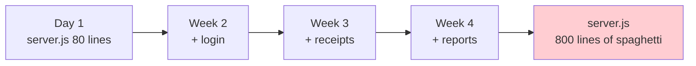
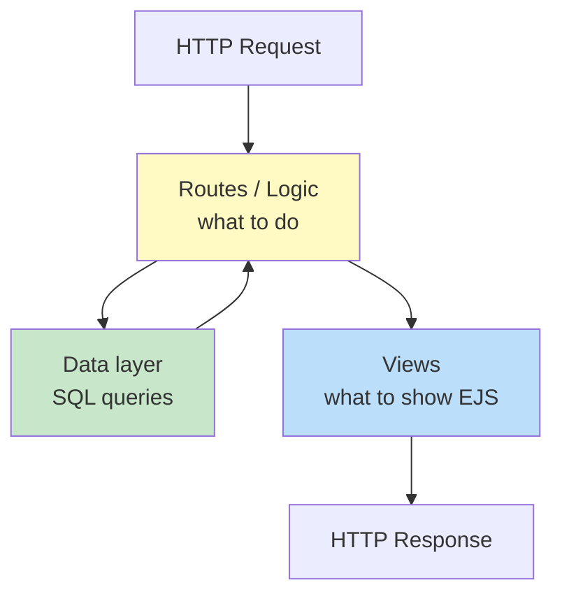
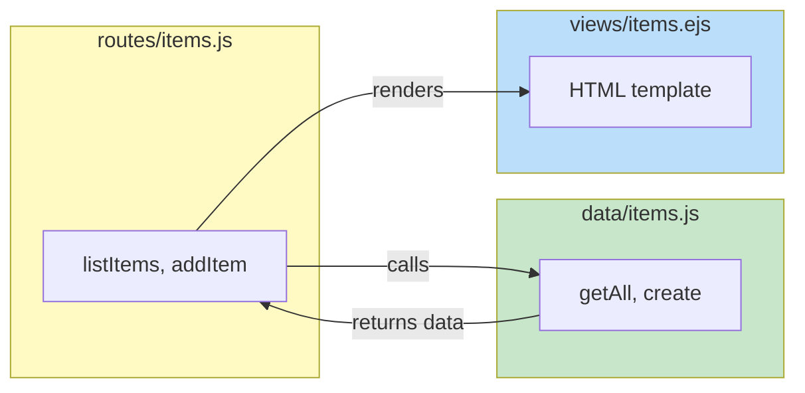
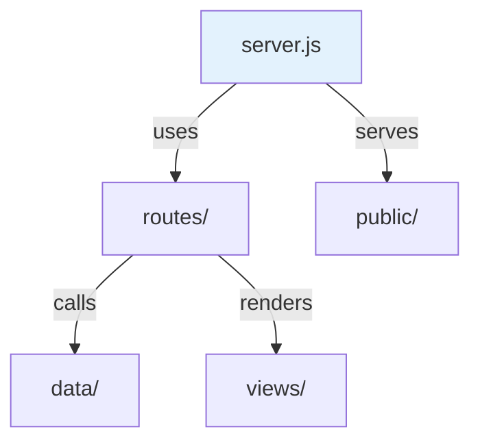
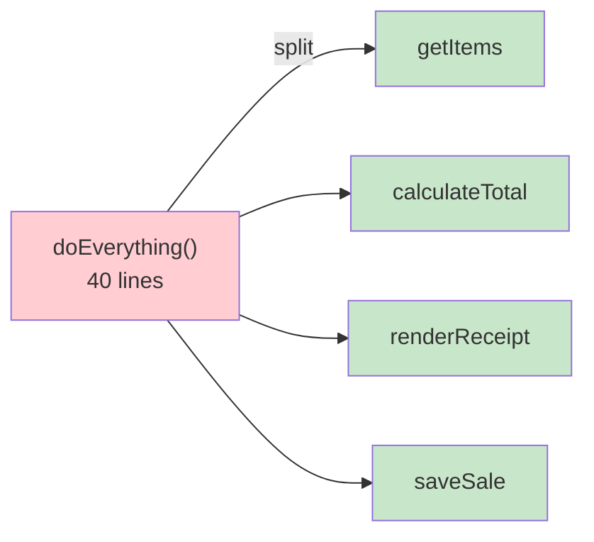
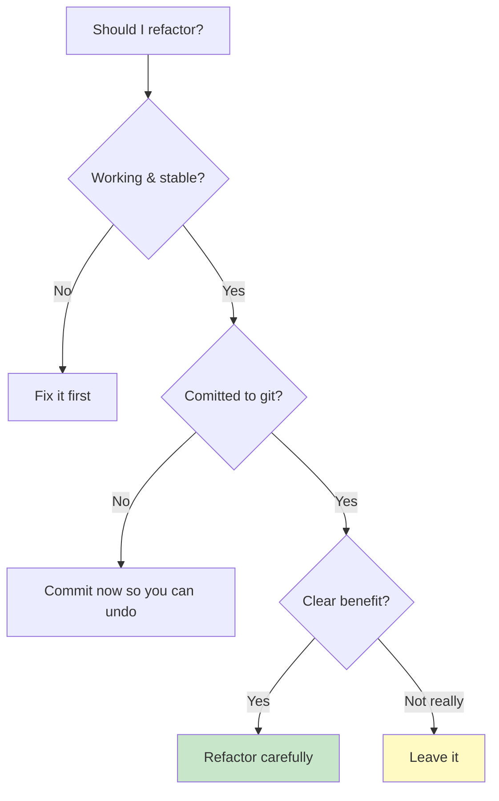

# Code Organization: Building Apps That Last

**Grade 10 - ICT (Full-Stack Elective)**
**Quarter 3 · Week 9**
**Duration:** 1 week
**Prerequisite:** [`express-basics`](../express-basics/lecture.md), [`database-sqlite`](../database-sqlite/lecture.md) (you've built a working app — now make it *maintainable*)

---

## 🎯 Learning Objectives

By the end of this lecture, you will be able to:

1. ✅ Explain **why** code organization matters as an app grows
2. ✅ Organize an Express + EJS + SQLite project into **routes / views / data** folders
3. ✅ Apply **MVC-lite** — separate "what to do" from "how it looks" from "where data lives"
4. ✅ **Name** variables, functions, and files so the code explains itself
5. ✅ Write a **README** that lets anyone run your app
6. ✅ Refactor spaghetti code into clean, readable code without changing behavior

---

## 📖 Table of Contents

1. [The Spaghetti Problem](#section-1)
2. [Separation of Concerns (the Big Idea)](#section-2)
3. [MVC-Lite: Routes, Views, Data](#section-3)
4. [A Project Structure That Scales](#section-4)
5. [Naming: Code That Explains Itself](#section-5)
6. [Small Functions, One Job Each](#section-6)
7. [The README: Your App's Front Door](#section-7)
8. [When to Refactor (and When Not To)](#section-8)
9. [Mini-Projects](#mini-projects)
10. [Final Challenge](#final-challenge)
11. [Troubleshooting](#troubleshooting)
12. [What's Next?](#whats-next)

---

<a name="section-1"></a>
## 1. The Spaghetti Problem

### **How Apps Turn Into Spaghetti**

You build a sari-sari store app. It works. You're proud. Then you add login. Then receipts. Then a daily report. Three weeks later, your `server.js` is **one giant 800-line file**: routes, SQL queries, HTML strings, and passwords all tangled together.

That's **spaghetti code** — everything mixed up, and pulling on one noodle moves all the others.



### **The Cost of Spaghetti**

- 🐛 **Bugs hide** — change one thing, break three others.
- 🤔 **Hard to understand** — you (or a teammate) can't find anything.
- 😰 **Scary to change** — so you don't, and the app rots.
- 🤖 **Hard for AI to help** — paste 800 tangled lines and even AI gets confused.

> 📌 "Maintainable" means: **six months from now, you (or someone else) can understand and safely change this code.** Organization is how you buy that future.

---

<a name="section-2"></a>
## 2. Separation of Concerns (the Big Idea)

The single principle behind all code organization:

> **Separation of Concerns** — each part of your code should be responsible for **one thing**.

In a web app, there are naturally **three concerns**:

| Concern | Question it answers | Example |
|---|---|---|
| **Routing / Logic** | "What should happen when this request comes in?" | "When POST /items arrives, save it." |
| **Presentation (Views)** | "What should the user see?" | The HTML/EJS page |
| **Data** | "Where is information stored and fetched?" | SQLite queries |

Mix them → spaghetti. Separate them → maintainable.



---

<a name="section-3"></a>
## 3. MVC-Lite: Routes, Views, Data

Full **MVC** (Model–View–Controller) is a professional pattern. For Grade 10, we use **MVC-lite** — the same idea, simpler names. (You've seen this diagram before in [`express-basics`](../express-basics/diagramSrc/web-server-basics/09-mvc-pattern.md) — now we *practice* it.)

### **The Three Layers**

1. **Routes (the "Controller")** — receive the request, decide what to do, call the data layer, send the view. **No SQL here. No big HTML here.**
2. **Views** — EJS templates that turn data into HTML. **No logic heavier than a loop or `if`.**
3. **Data (the "Model")** — functions that run SQL and return plain JavaScript data. **No HTML here. No routing here.**



### **Before vs After (a route handler)**

❌ **Spaghetti — everything in one place:**
```javascript
app.get('/items', (req, res) => {
  const db = require('better-sqlite3')('store.db');
  const rows = db.prepare('SELECT * FROM items').all();
  let html = '<ul>';
  for (const r of rows) {
    html += '<li>' + r.name + ' - ₱' + r.price + '</li>';
  }
  html += '</ul>';
  res.send('<html><body>' + html + '</body></html>');
});
```

✅ **Organized — three concerns separated:**
```javascript
// routes/items.js  — just routing + logic
router.get('/items', (req, res) => {
  const items = itemsData.getAll();   // data layer
  res.render('items', { items });     // view layer
});
```
```javascript
// data/items.js  — just SQL
const db = require('better-sqlite3')('store.db');
function getAll() {
  return db.prepare('SELECT * FROM items').all();
}
module.exports = { getAll };
```
```html
<!-- views/items.ejs  — just presentation -->
<ul>
  <% items.forEach(function(item) { %>
    <li><%= item.name %> - ₱<%= item.price %></li>
  <% }) %>
</ul>
```

Each file does **one job**. To change the SQL, edit `data/items.js`. To change the look, edit `views/items.ejs`. To change the behavior, edit `routes/items.js`. **No noodle-pulling.**

---

<a name="section-4"></a>
## 4. A Project Structure That Scales

Here's a folder layout that works from your first Express app to your capstone:

```
sari-sari-app/
├── server.js              ← starts the server, wires routes
├── routes/                ← "what to do" (one file per topic)
│   ├── items.js
│   └── auth.js
├── data/                  ← "where data lives" (SQL)
│   ├── db.js              ← opens the database ONCE
│   └── items.js
├── views/                 ← "what it looks like" (EJS)
│   ├── items.ejs
│   └── layout.ejs
├── public/                ← static files (CSS, images, JS)
│   └── styles.css
├── package.json
└── README.md              ← how to run the app
```

### **Why One File per Topic?**
When `items` and `auth` are in **separate files**, a bug in login doesn't make you scroll through 300 lines of item code. You go straight to `routes/auth.js`.



### **Open the Database ONCE**
A classic beginner mistake: `require('better-sqlite3')('store.db')` in every file. Instead, open it **once** in `data/db.js` and require that everywhere:

```javascript
// data/db.js — the SINGLE database connection
const Database = require('better-sqlite3');
const db = new Database('store.db');
module.exports = db;
```
```javascript
// data/items.js
const db = require('./db');   // reuse the one connection
```

---

<a name="section-5"></a>
## 5. Naming: Code That Explains Itself

Good names mean fewer comments and fewer bugs. The code should **read like a sentence**.

### **The Naming Rules**

| Thing | Rule | ✅ Good | ❌ Bad |
|---|---|---|---|
| Variable | noun, specific | `cartTotal`, `itemName` | `x`, `data`, `temp` |
| Function | verb, what it does | `addItem()`, `calculateTotal()` | `doThing()`, `process()` |
| Boolean | is/has/can | `isLoggedIn`, `hasStock` | `flag`, `status` |
| File | topic, kebab-case | `items.js`, `auth.js` | `stuff.js`, `code2.js` |

### **The "Read It Out Loud" Test**

```javascript
// ❌ Mystery
const a = b.filter(c => c.d > 0).reduce((e, f) => e + f.d, 0);

// ✅ Reads like English
const totalValue = items
  .filter(item => item.stock > 0)
  .reduce((sum, item) => sum + item.stock, 0);
```

Read the second one out loud: *"total value equals items, filtered to those with stock greater than zero, reduced to the sum of their stock."* That's self-documenting code.

> 💡 If you need a comment to explain **what** a variable is, its name is probably bad. Rename it.

**🎯 Try It:** Open [`assets/refactor-exercise.html`](assets/refactor-exercise.html). It's a working sari-sari receipt calculator with terrible names (`a`, `x1`, `doStuff`). Rename everything so the code explains itself — without changing how it works.

---

<a name="section-6"></a>
## 6. Small Functions, One Job Each

### **The Single-Responsibility Rule**

A function should do **one thing**. If you describe it with "and", it's doing too much.

❌ "This function gets the items **and** calculates the total **and** renders the HTML **and** saves to the database."

✅ Split it: `getItems()`, `calculateTotal()`, `renderReceipt()`, `saveSale()`.



### **Why Small Functions?**
- ✅ **Reusable** — `calculateTotal()` works for the cart, the receipt, and the report.
- ✅ **Testable** — easy to check one small thing.
- ✅ **Readable** — `renderReceipt()` tells you what happens at a glance.
- ✅ **Debuggable** — when the total is wrong, you know exactly which function to inspect (tie this to [`debugging-devtools`](../debugging-devtools/lecture.md)).

> 📌 **Rule of thumb:** if a function is longer than ~20 lines or you describe it with "and", consider splitting it.

---

<a name="section-7"></a>
## 7. The README: Your App's Front Door

A **README.md** is the first thing anyone (your teacher, a teammate, future-you, an AI) sees. A project without a README is a project nobody can run.

### **The Minimum Viable README**

```markdown
# Sari-Sari Store Inventory

Track stock and sales for a small sari-sari store.

## Setup
1. Install Node.js 18+
2. Run `npm install`
3. Run `npm start`
4. Open http://localhost:3000

## Features
- Add / edit / delete items
- Record sales
- Daily sales report

## Tech
Express + EJS + better-sqlite3
```

### **Why It Matters**

- 🧑‍🤝‍🧑 **Teammates** can run your app without asking you 10 questions.
- 👨‍🏫 **Teachers** can grade it without guessing.
- 🤖 **AI** understands your project scope faster when you paste the README as context.
- 🕰️ **Future-you** (in 3 months) remembers what this project even is.

> 💡 Always include the **exact commands** to run the app. If `npm start` isn't obvious, the README is broken.

---

<a name="section-8"></a>
## 8. When to Refactor (and When Not To)

**Refactoring** = improving code structure **without changing what it does**.

### **Refactor WHEN:**
- ✅ You're about to add a feature and the code is hard to extend.
- ✅ You can't understand your own code from a month ago.
- ✅ You keep copying the same 10 lines (extract a function).
- ✅ A bug fix would be easier with clearer names.

### **Do NOT refactor when:**
- ❌ It's not broken and you're just bored (risk with no payoff).
- ❌ Right before a deadline (refactor on stable ground, not under panic).
- ❌ You haven't committed to git yet — **commit first**, so you can undo!



> 📌 **Refactor in small steps.** After each change, run the app and confirm it still works. This is the "change ONE thing" rule from [`debugging-devtools`](../debugging-devtools/lecture.md), applied to improvements.

---

<a name="mini-projects"></a>
## 9. Mini-Projects

### **Mini-Project 1: Rename Rescue** (Beginner)
Open [`assets/refactor-exercise.html`](assets/refactor-exercise.html). It works but uses awful names. Rename every variable and function so the code reads like English. The output must stay identical.

### **Mini-Project 2: Split the Function** (Beginner)
Take the `doEverything()`-style function in the exercise and split it into 3–4 small, single-purpose functions (`getItems`, `calculateTotal`, `renderReceipt`). Call them in sequence.

### **Mini-Project 3: Structure an Express App** (Intermediate)
Take your existing single-file Express app and reorganize it into the `routes/` + `data/` + `views/` structure from Section 4. Move the database open into a single `data/db.js`. Confirm the app still works after each move.

---

<a name="final-challenge"></a>
## 10. Final Challenge

### **The Maintainability Audit**

Take your current project (or your Q3 CRUD app). Score it 0–2 on each:

| Criterion | 0 | 1 | 2 |
|---|---|---|---|
| **Separation** | all in one file | partly split | routes/data/views separated |
| **Naming** | `x`, `data`, `temp` | mixed | all names self-explanatory |
| **Functions** | giant functions | some big ones | all small, one job |
| **README** | none | partial | complete + run commands |
| **DB opened once** | opened per file | — | single `db.js` |

**Goal:** raise your total. Pick the **lowest** score and improve just that one. Re-run the app. Repeat. The app that's easiest for a *classmate* to understand and modify wins.

---

<a name="troubleshooting"></a>
## 11. Troubleshooting

### **Problem: "I moved files and now nothing works"**
You forgot a `require` path. Check every `require('./...')` — paths are relative to the file. Commit to git *before* moving so you can `git diff` and undo.

### **Problem: "My data layer returns undefined"**
Did you `module.exports = { getAll }` in the data file and `const itemsData = require('../data/items')` in the route? Check both the export **and** the import name match.

### **Problem: "Renaming broke everything"**
You renamed a variable in one place but not another. Use your editor's **Rename / Find & Replace** carefully. Run after each rename.

### **Problem: "It's too clean and I'm scared to touch it"**
That's normal at first. Commit to git, change **one** thing, run it. Clean code is actually *easier* to change safely — that's the whole point.

---

<a name="whats-next"></a>
## 12. What's Next?

### **You Now Know:**
✅ Why spaghetti happens and what it costs
✅ Separation of concerns → routes / views / data
✅ MVC-lite in practice
✅ A project structure that scales
✅ Naming so code explains itself
✅ Small, single-purpose functions
✅ How to write a real README
✅ When (and when not) to refactor

### **Coming Up Next**
In **Quarter 4**, your group capstone will be *built* on these habits — multiple teammates working on the same app is only possible with clean structure. And in [`ai-assisted-development`](../ai-assisted-development/lecture.md), you'll see how organized code makes AI help far more effective.

### **The Big Idea**
> "Working" gets you a grade. "Maintainable" gets you a real app — one that survives contact with the future. Organize for the person who reads your code six months from now… especially if that person is you.

---

**📝 Quick Reference Card**

```
SEPARATION OF CONCERNS — 3 layers
• routes/  → what to do (no SQL, no big HTML)
• data/    → SQL queries (no HTML, no routing)
• views/   → EJS templates (loops/ifs only)

PROJECT LAYOUT
server.js · routes/ · data/ · views/ · public/ · README.md
Open the DB ONCE in data/db.js.

NAMING
• vars = nouns      (cartTotal, itemName)
• funcs = verbs     (addItem, calculateTotal)
• bools = is/has    (isLoggedIn)
• files = kebab     (items.js, auth.js)

FUNCTIONS
One job each. If you describe it with "and", split it.
~20 lines max is a good smell-test.

README — always include: setup steps + run commands + features.

REFACTOR = improve structure WITHOUT changing behavior.
Commit to git first. Small steps. Run after each.
```

---

**End of Code Organization Lecture**

*Created for Grade 10 Filipino Students*
*Philippine Context, Real-World Examples, Practical Skills*
