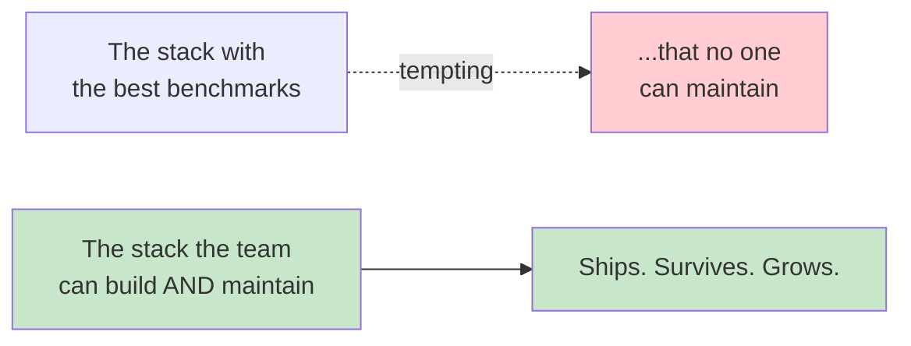
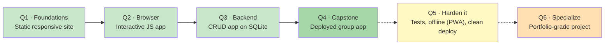
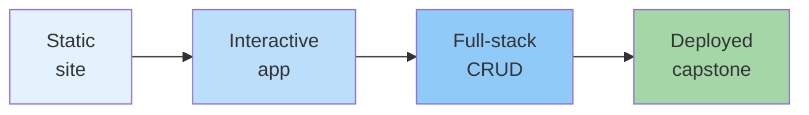
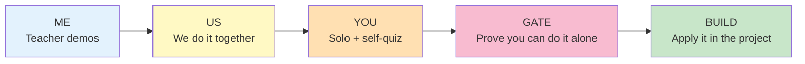
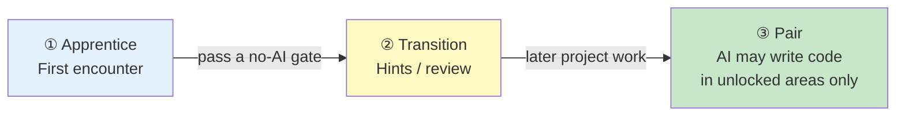
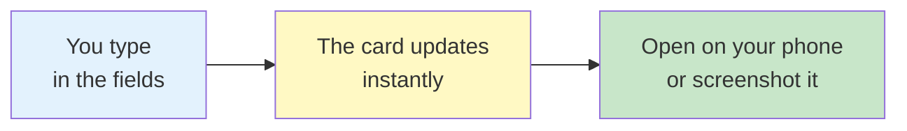

# Full-Stack Web Development

**Grade 10 - ICT (Full-Stack Elective)**
**Day 1 · Course Orientation**
**Duration:** 1 session
**You'll need:** curiosity, a laptop, and a phone you can open a file on

> 🚀 *Welcome. This year you won't just "learn about" the web — you'll build and deploy a real app that a real person actually uses.*

### **Today's Agenda**

1. The promise — what you'll have built by Q4
2. The journey — the 6-quarter roadmap
3. The stack — the tools we've locked in (and why)
4. Ship something every quarter
5. How we learn — web-first spiral, Me/Us/You, "trim, don't cram"
6. The AI rule — you earn the right to let AI write code
7. Why offline matters here (live demo)
8. Expectations & grading
9. Day-one micro-build — show something on your phone today

---

## 1. The Promise: A Real App for a Real Person

> **By Q4, you will have built and deployed a working app that a real person actually uses.**

Not a tutorial you copied. Not a toy that only runs on your laptop. A real, usable app for a real stakeholder — a **barangay clearance tracker**, a **sari-sari store inventory**, a **school club signup page**.

### **What "Done" Looks Like**

| ❌ Not this | ✅ This |
|---|---|
| "I watched some tutorials" | "I shipped an app people use" |
| Runs only on my machine | **Deployed** — anyone with the link can use it |
| Built by ChatGPT, pasted by me | Built by **me** — I can explain every line |

### **The Idea That Drives the Whole Course**

> 📌 **"Survivable" beats "optimal."** We choose the stack this class can actually build and keep alive together — not the flashiest one. That single idea shapes every choice below.

---

## 2. The Journey: A 6-Quarter Roadmap

Two lanes: **Q1–Q4 is the core path** (everyone ships a deployed app by Q4). **Q5–Q6 is the extension path** (turn that app into something portfolio-grade).

### **One Quarter at a Glance**

- **Q1 — Make something you can show on your phone on day one.** A static, responsive multi-page site, committed to GitHub.
- **Q2 — Make the page *do* things and *remember* things.** An interactive client app that saves data locally and calls a real public API.
- **Q3 — Become the kitchen, not just the customer.** A full-stack **CRUD app on SQLite** — real data in, real data out. The "it actually works" milestone.
- **Q4 — Ship it.** A **group capstone**: a real, usable, **deployed** app for a real stakeholder, plus a README.
- **Q5 (extension)** — Harden the capstone: add tests, logging, and **offline support** (PWA).
- **Q6 (extension)** — Go deeper: a second, bigger, portfolio-grade capstone and a demo.

> 📌 Each quarter ends with a **shippable artifact**. You always have something real to show.

---

## 3. The Stack: Locked and Loaded

We pick our tools **once**, then go deep. Here is your entire toolkit for the year:

| Layer | Our choice | Why this one |
|---|---|---|
| Structure | **HTML5** | The real skeleton of every page |
| Styling | **CSS + Bulma** | Class-only framework — no JS, plays nice with AI |
| Client logic | **Vanilla JS (ES6+)** | No build step; you see the real browser model |
| Server | **Express.js + EJS** | The honest request → response loop |
| Database | **better-sqlite3** | One file, prepared statements, no hidden magic |
| Data over the wire | **fetch + async/await + JSON** | How the web actually talks |
| Version control | **Git + GitHub** | Your safety net + your portfolio |

### **Deliberately Left Out (and why)**

- ❌ **React / Vue / Angular** — hides the browser behind abstractions you don't need yet.
- ❌ **ORMs (Prisma, Sequelize)** — hide your SQL. You'll write real queries.
- ❌ **JWT / hand-rolled crypto** — we use **server sessions** (safer, simpler).
- ❌ **Docker / SPA build pipelines** — extra machinery that obscures what's happening.

> 📌 **Two tests every tool must pass:** (1) easy enough that you understand what's going on, and (2) standard enough that AI can help you with it. Anything that fails either test stays out.

---

## 4. Ship Something Every Quarter

You never go a quarter without shipping. These are the **four guaranteed artifacts** — each one builds on the last:

| Quarter | You ship | The leap |
|---|---|---|
| **Q1** | A static, responsive site committed to GitHub | "I can make a real web page" |
| **Q2** | An interactive client app (saves data, calls an API) | "My page *does* things" |
| **Q3** | A full-stack **CRUD app on SQLite** | "Real data goes in, real data comes out" |
| **Q4** | A **deployed** group capstone + README | "A real person is using my app" |

> 📌 Notice the arc: **static → interactive → full-stack → deployed.** By Q4 every prior skill is reused inside the capstone. That reuse *is* the learning.

---

## 5. How We Learn

Three habits run through every single week:

### **① Web-First Spiral**
We revisit concepts with **increasing depth** — we do *not* "master HTML" before touching JS. You'll meet an idea lightly, use it, then meet it again, deeper. Repeated exposure beats rigid sequencing.

### **② Me / Us / You**
Every skill follows the same gradual-release cycle:

### **③ "Trim, Don't Cram"**
Every lecture is a **menu**, not a marathon. We teach the **60–80% that serves this quarter's artifact** and defer the deep stuff to Q5–Q6. The same lecture appears ***(light)*** in the core lane and ***(full)*** in the extension lane.

> 📌 **You will feel lost sometimes — that's the design.** We spiral back. The goal isn't to know everything today; it's to ship something real this quarter.

---

## 6. The AI Rule: You Earn the Right

AI is a **taught skill** here, not a secret — and not a shortcut that does your learning for you. There are three phases:

| Phase | AI explains / quizzes / demos | AI writes your deliverable code | Copy-paste |
|---|---|---|---|
| **① Apprentice** *(first encounter)* | ✅ Yes | ❌ **No — you type it** | ❌ **Forbidden** |
| **② Transition** *(first project after a gate)* | ✅ Yes | ⚠️ Hints / review only — you still type | ⚠️ Re-type suggestions |
| **③ Pair** *(unlocked stack)* | ✅ Yes | ✅ **Within unlocked areas only** | ✅ Fine |

### **"Earn the Right" = Build It Solo First**

AI may **generate** code **only in technologies you have personally unlocked** by passing a no-AI gate. Why? Because by building it yourself first, you **prove you can always tell when the AI is wrong.**

- The unlock is **individual**; project AI-use is **collective** — a group uses AI for area X **only when every member has passed gate X**.
- Each gate is **30 minutes, no AI, individual**, with an objective pass/fail checklist.
- A miss is **never a failing grade** — it just defers that unlock and says "loop back, retry next class."

### **The 7 Gates**

| Gate | What you prove you can do alone | Quarter | Unlocks AI for |
|---|---|---|---|
| **G0** Markup & Responsive | Build a mobile-first Barangay Profile page (semantic HTML + Bulma) | Q1 | HTML / CSS / Bulma |
| **G1** Control Flow & Data | Sari-sari cart calculator (functions, conditionals, arrays) | Q2 | Vanilla JS logic |
| **G2** DOM & Events | Barangay complaint box (select, wire events, update the page) | Q2 | DOM + events |
| **G3** Persistence + Async | Save-a-Quote (fetch + await + localStorage) | Q2 | fetch/async + storage |
| **G4** Request → Response | Barangay greeting server (Express routes + server validation) | Q3 | Express / EJS / validation |
| **G5** Data + SQLite CRUD | Resident records (prepared statements, real CRUD) | Q3 | SQL / schema / data access |
| **G6** Auth & Sessions | Lock the dashboard (login, sessions, route guards) | Q4 | Auth / sessions / middleware |

> 📌 **You're the senior developer; the AI is your fast, eager, sometimes-wrong junior.** You stay responsible for the result.

---

## 7. Why Offline Matters Here

Internet here is **unreliable and data is expensive**. So a core rule of this course:

> 📡 **Everything we build must keep working with NO internet connection.**

### **🎬 Live Demo: "Works With No Internet"**

1. Open this very presentation.
2. Turn off Wi-Fi / mobile data.
3. It still runs — slides, diagrams, colors, all of it.

### **How That's Even Possible**

Our build packs **everything into one `.html` file**:

- ✅ Every image is **embedded as a data URI** (no external image URLs).
- ✅ Code-highlighting and diagram libraries are **bundled inside** the file.
- ✅ Diagrams **render live in your browser** — no trip to a server.
- ❌ **Zero external URLs.** (This is exactly why we never hotlink images from `github.io` — that path dies the moment the link changes.)

> 📌 **If your app needs the internet to even load, it's not finished.** "Works offline" isn't a nice-to-have here — it's the bar. You'll make your capstone a **PWA** in Q5 so it installs and runs on a phone with no signal.

---

## 8. Expectations & Grading

### **🔧 Setup Checklist — Do This Before Next Class**

- [ ] **Install Git** (`git --version` should print a version)
- [ ] **Install VS Code** (our editor)
- [ ] **Install Node.js LTS** (`node --version` should print a version)
- [ ] **Create a free GitHub account** (this becomes your portfolio)

### **How to Succeed**

- ✅ **Ship every quarter.** A finished simple app beats an unfinished ambitious one — every time.
- ✅ **Type your own code** in the Apprentice phase. That's how the gates get passed.
- ✅ **Run the weekly self-quiz.** Spaced retrieval is how memory actually works.
- ✅ **Be honest.** You should always be able to explain your own code.

### **How Grading Works Here**

> 📌 **A gate miss is NOT a failing grade.** It simply *defers* that technology's unlock and tells you "loop back, retry next class." We measure **effort, shipping, and honesty** — not whether you got it perfect on the first try. The goal is a real app you understand, built on time.

---

## 9. Day-One Micro-Build: Show Something on Your Phone

Enough talking — **let's ship something right now.**

### **🎯 Your First "Shipped" Thing**

1. Open [`assets/day-one-build.html`](assets/day-one-build.html).
2. Type your **name**, your **section**, and a **goal for this year**.
3. Pick a **theme color**.
4. Watch the **Dev ID Card** update **live as you type**.
5. Open it on your phone (or screenshot it) and show your seatmate.

### **Why This Tiny Thing Matters**

That live "type → card updates" trick is **exactly the DOM + events magic you'll master in Q2.** Today you'll just *use* it — soon you'll be able to *build* it from scratch, and explain every line.

> 🎉 **On Day 1, you already shipped something real to your phone.** That's the pace of this course.

---

### **What's Next?**

Next class, **Q1 begins.** We start with how the web actually works ([`full-stack`](../full-stack/lecture.md)), then write our first real pages in [`html`](../html/lecture.md) and style them in [`css`](../css/lecture.md). Bring your laptop with the **setup checklist** done.

> 🚀 **The promise again: by Q4, you will have built and deployed a real app a real person uses. Let's go.**
