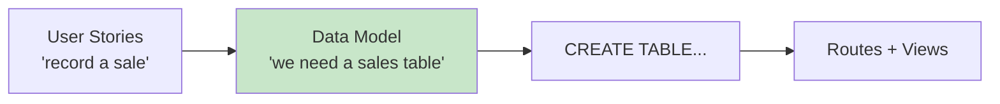
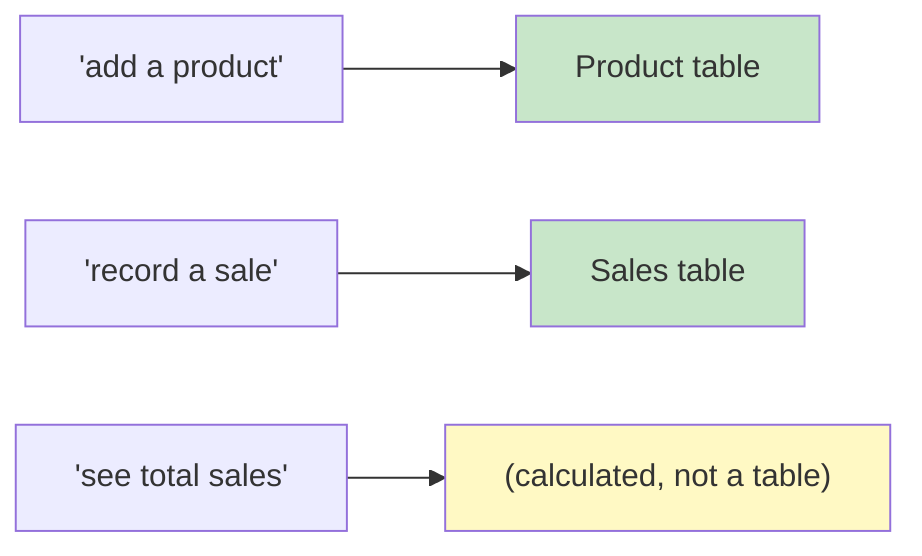
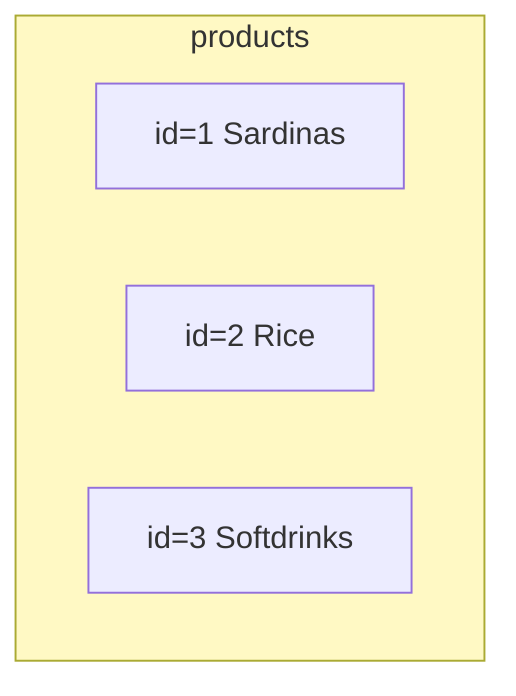
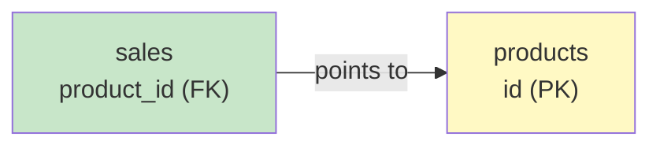
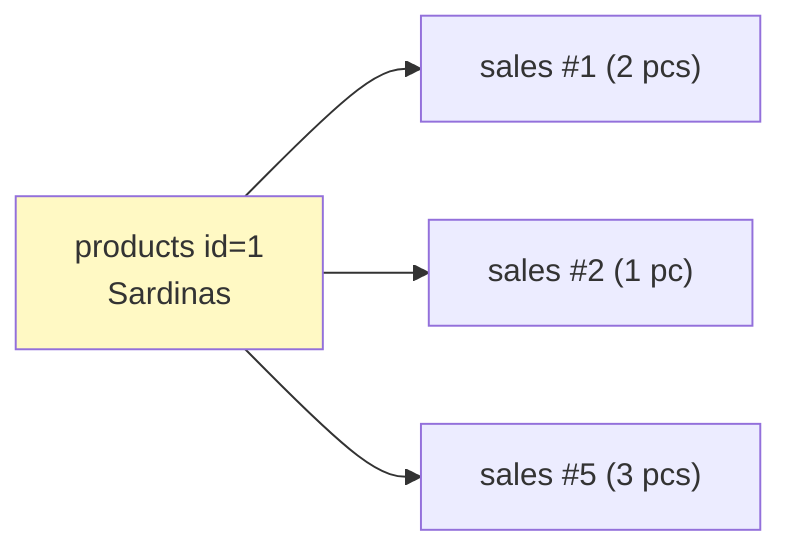
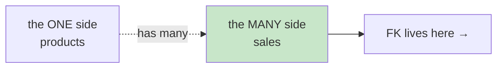
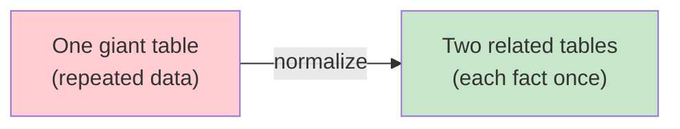

# Data Modeling: Think About Your Data Before You Code

**Grade 10 - ICT (Full-Stack Elective)**
**Quarter 3 · Weeks 3–4**
**Duration:** 1–2 weeks
**Prerequisite:** [`requirements-user-stories`](../requirements-user-stories/lecture.md) (you have features to model), [`database-sqlite`](../database-sqlite/lecture.md) (you've done basic CRUD)

---

## 🎯 Learning Objectives

By the end of this lecture, you will be able to:

1. ✅ Identify the **entities** (things) your app needs to store
2. ✅ Design **tables** with the right **columns** and **data types**
3. ✅ Choose **primary keys** and **foreign keys** correctly
4. ✅ Model a **one-to-many** relationship (e.g., one store → many sales)
5. ✅ Read and draw a simple **schema diagram**
6. ✅ Avoid the "**one giant table**" mistake (normalization-lite)

---

## 📖 Table of Contents

1. [Code-First vs Data-First](#section-1)
2. [Entities and Tables](#section-2)
3. [Columns and Data Types](#section-3)
4. [Primary Keys: The Unique ID](#section-4)
5. [Foreign Keys: Connecting Tables](#section-5)
6. [One-to-Many Relationships](#section-6)
7. [Schema Diagrams](#section-7)
8. [Don't Build One Giant Table](#section-8)
9. [When to Use Data Modeling](#section-9)
10. [Mini-Projects](#mini-projects)
11. [Final Challenge](#final-challenge)
12. [Troubleshooting](#troubleshooting)
13. [What's Next?](#whats-next)

---

<a name="section-1"></a>
## 1. Code-First vs Data-First

### **The Beginner Trap**

Beginners open `server.js` and start typing routes. Halfway through, they realize: *"Wait, what fields does a product even have? Where do I store the sale's date? Do I repeat the customer's name on every sale?"*

That's **code-first** — and it leads to messy, rewrite-heavy apps.

### **Data-First: Plan the Shape of Your Information**

**Data modeling** means deciding **what information your app stores and how it's organized** — *before* you write the routes. Your user stories (from [`requirements-user-stories`](../requirements-user-stories/lecture.md)) tell you *what the app does*; data modeling turns that into *what tables you need*.



> 📌 Get the data shape right first. Bad data design haunts every feature you build afterward.

---

<a name="section-2"></a>
## 2. Entities and Tables

An **entity** is a *thing* your app cares about — a noun that appears over and over in your user stories. Each entity becomes a **table**.

### **Find the Entities (Underline the Nouns)**

Take your sari-sari stories:
- *"As a store owner, I want to **add a product**…"* → entity: **Product**
- *"…I want to **record a sale**…"* → entity: **Sale**
- *"…see today's **total sales**."* → that's a *calculation*, not an entity.



### **One Entity = One Table**

| Entity (noun) | Table |
|---|---|
| Product | `products` |
| Sale | `sales` |
| Resident | `residents` |
| Clearance | `clearances` |

> 💡 Table names are **plural** and **lowercase** (`products`, not `Product` or `ProductList`). Pick a convention and stick to it.

---

<a name="section-3"></a>
## 3. Columns and Data Types

Each table has **columns** (the fields/attributes of the entity). Each column has a **data type** — the kind of value it holds.

### **The `products` Table**

| Column | Type | Meaning | Example |
|---|---|---|---|
| `id` | INTEGER | unique ID | 1 |
| `name` | TEXT | product name | 'Sardinas' |
| `price` | REAL | a number with decimals | 25.00 |
| `stock` | INTEGER | a whole number | 12 |

### **SQLite's Main Types (keep it simple)**

| Type | Use for | Example |
|---|---|---|
| `INTEGER` | whole numbers, IDs, counts | 5, 42 |
| `REAL` | numbers with decimals (money!) | 25.50 |
| `TEXT` | words, names, descriptions | 'Sardinas' |

> ⚠️ **Money uses REAL, not INTEGER.** ₱25.50 has a decimal. If you use INTEGER, you'll lose the 50 centavos.

> 💡 **Dates:** store as TEXT in ISO format (`'2026-06-14'`). It sorts correctly and is easy to read.

---

<a name="section-4"></a>
## 4. Primary Keys: The Unique ID

Every table needs a **primary key (PK)** — a column whose value is **unique for every row**, so you can find exactly one record.



### **The Standard Pattern**

```sql
CREATE TABLE products (
  id INTEGER PRIMARY KEY AUTOINCREMENT,  -- SQLite gives each row a new id
  name TEXT,
  price REAL,
  stock INTEGER
);
```

- `PRIMARY KEY` = "this column uniquely identifies a row."
- `AUTOINCREMENT` = "SQLite assigns 1, 2, 3… automatically — I don't have to."

> 📌 **Never use a name as a primary key.** Two products could both be named "Sardinas." Always use a generated `id`.

---

<a name="section-5"></a>
## 5. Foreign Keys: Connecting Tables

A **foreign key (FK)** is a column that **points to a row in another table**. It's how tables relate.

### **The Problem It Solves**

When you record a sale, you need to know **which product** was sold. You *could* repeat the product name:

❌ **Bad (repeat the data):**
| sale_id | product_name | price | qty |
|---|---|---|---|
| 1 | Sardinas | 25 | 2 |
| 2 | Sardinas | 25 | 1 |

But if the price of Sardinas changes, you'd have to update **every** sale row. Nightmare.

✅ **Good (use a foreign key):** store the product's `id`, not its name/price.

| sale_id | **product_id** | qty | date |
|---|---|---|---|
| 1 | 1 | 2 | 2026-06-14 |
| 2 | 1 | 1 | 2026-06-15 |

`product_id` is a **foreign key** pointing to `products.id`. To get the name/price, you **join** — but the sale row stays small and correct.



```sql
CREATE TABLE sales (
  id INTEGER PRIMARY KEY AUTOINCREMENT,
  product_id INTEGER,          -- foreign key
  qty INTEGER,
  sale_date TEXT,
  FOREIGN KEY (product_id) REFERENCES products(id)
);
```

---

<a name="section-6"></a>
## 6. One-to-Many Relationships

This is the **most common** relationship, and the only one you'll usually need:

> **One** product can appear in **many** sales.



### **The Rule for 1-to-Many**

Put the **foreign key on the "many" side.**

- One product → many sales → the FK (`product_id`) goes on **`sales`**.
- One resident → many clearances → the FK (`resident_id`) goes on **`clearances`**.
- One teacher → many classes → the FK (`teacher_id`) goes on **`classes`**.



> 💡 **Memory trick:** "The many side carries the ID of the one." Sales carry `product_id`. Clearances carry `resident_id`.

---

<a name="section-7"></a>
## 7. Schema Diagrams

A **schema diagram** is a picture of your tables and how they connect. Draw it **before** you write `CREATE TABLE`.

### **Sari-Sari Schema**

```
┌──────────────────┐         ┌──────────────────┐
│     products     │         │      sales       │
├──────────────────┤         ├──────────────────┤
│ id (PK)       ◄──┼─────────┤ product_id (FK)  │
│ name             │         │ id (PK)          │
│ price            │         │ qty              │
│ stock            │         │ sale_date        │
└──────────────────┘         └──────────────────┘
       (1)                          (many)
```

The arrow goes from the FK (`sales.product_id`) to the PK (`products.id`). Reading it: *"each sale points to one product."*

### **Drawing Conventions**

- Each table = a box.
- List columns inside; mark **(PK)** and **(FK)**.
- Draw a line from each **FK** to the **PK** it references.
- Label the ends **1** and **many**.

**🎯 Try It:** Open [`assets/schema-worksheet.html`](assets/schema-worksheet.html). Complete the worked `products`/`sales` example, then design tables for a **barangay clearance** app (residents + clearances).

---

<a name="section-8"></a>
## 8. Don't Build One Giant Table

### **The "One Giant Table" Anti-Pattern**

A beginner stores everything in one table:

❌ **One giant `sales` table (also stuffing product info in):**
| sale_id | product_name | product_price | qty | date |
|---|---|---|---|---|

**Problems:**
- 🔁 **Data duplication** — "Sardinas, ₱25" repeated on every sale.
- 🐛 **Update anomaly** — change the price → update dozens of rows, miss one → inconsistent data.
- 💀 **No single source of truth** — is the price in `products` or in `sales`?

### **Normalization (Lite)**

**Normalization** means: **each fact is stored in exactly one place.**

- Product info (name, price) lives **only** in `products`.
- Sales reference the product by `id` only.



> 📌 **The test:** "If I change this fact, do I have to update it in multiple places?" If yes → split into another table.

---

<a name="section-9"></a>
## 9. When to Use Data Modeling

✅ **Use it when:**
- Starting **any app with a database** (even a small one).
- Your app has **more than one type of thing** (products AND sales).
- You're planning your **capstone** — model it on paper first.

❌ **Skip it when:**
- The app has **a single, flat list** (e.g., a simple to-do with no relations) — one table is fine.
- You're just **practicing SQL syntax** in isolation.

> 📌 For your **capstone**, sketch the schema diagram **before** writing `CREATE TABLE`. It's the cheapest way to avoid a painful redesign.

---

<a name="mini-projects"></a>
## 10. Mini-Projects

### **Mini-Project 1: Find the Entities** (Beginner)
Take the user stories you wrote in [`requirements-user-stories`](../requirements-user-stories/lecture.md). Underline every noun. Decide which are **entities** (→ tables) and which are just **attributes** (→ columns) or **calculations** (→ no table).

### **Mini-Project 2: Schema on Paper** (Beginner)
Draw the schema diagram for a **class attendance** app: `students`, `classes`, and `attendance`. Mark PKs and FKs. Remember: one student → many attendance records (FK on attendance).

### **Mini-Project 3: Fix the Giant Table** (Intermediate)
Open [`assets/schema-worksheet.html`](assets/schema-worksheet.html). Take the deliberately-bad "one giant table" and split it into two properly-related tables with a foreign key.

---

<a name="final-challenge"></a>
## 11. Final Challenge

### **Model Your Capstone**

Take your capstone idea (from your product brief). Produce:

1. A list of **entities** (tables).
2. For each table, its **columns** with types, marking **(PK)** and **(FK)**.
3. A **schema diagram** showing the 1-to-many relationships.
4. The `CREATE TABLE` SQL for each table (test it in SQLite!).

**Check:** for every relationship, the FK is on the **many** side. For every fact, it's stored in **one** place only.

---

<a name="troubleshooting"></a>
## 12. Troubleshooting

### **Problem: "I'm not sure if something is an entity or a column"**
Ask: "Does this thing have its own attributes and a life of its own?" A *product* has a name, price, stock → entity. A *price* is just a number on a product → column. A *sale total* is computed → neither.

### **Problem: "My query returns the same product name over and over"**
You're repeating data instead of joining. Make sure sales reference products by `product_id`, and use a `JOIN` to fetch the name.

### **Problem: "SQLITE_ERROR: no such column"**
A typo in a column name, or you referenced a column from the wrong table. Print your schema (`.schema`) in the sqlite CLI and check spelling exactly.

### **Problem: "I have a many-to-many relationship"**
(e.g., a student enrolled in many classes, and a class has many students.) That needs a **junction table** — ask your teacher; it's a Q5/Q6 topic. For most capstones, 1-to-many is enough.

---

<a name="whats-next"></a>
## 13. What's Next?

### **You Now Know:**
✅ Why to design data *before* coding
✅ How to find entities and make tables
✅ Columns, types (and that money = REAL)
✅ Primary keys and foreign keys
✅ One-to-many relationships (FK on the many side)
✅ How to read/draw a schema diagram
✅ Why to avoid the one-giant-table mistake

### **Coming Up Next**
In [`code-organization`](../code-organization/lecture.md), you'll put these tables behind a clean `data/` layer. And your **capstone** database starts as a sketch on paper — exactly the schema diagram you now know how to draw.

### **The Big Idea**
> The structure of your data outlives your code. Get the tables and relationships right, and your routes, views, and features almost design themselves.

---

**📝 Quick Reference Card**

```
DATA MODELING — THE STEPS
1. Find ENTITIES (nouns in your stories) → each becomes a TABLE
2. Give each table COLUMNS with types (INTEGER, REAL, TEXT)
3. Every table gets a PRIMARY KEY: id INTEGER PRIMARY KEY AUTOINCREMENT
4. Connect tables with a FOREIGN KEY on the "MANY" side
5. Draw a SCHEMA DIAGRAM before writing CREATE TABLE

TYPES
• INTEGER — whole numbers, IDs, counts
• REAL    — money / decimals
• TEXT    — names, words, dates (ISO: 2026-06-14)

1-TO-MANY RULE
The "many" side carries the id of the "one":
  products (1) ──< sales (many) → sales has product_id (FK)

NORMALIZATION
Each fact stored in ONE place.
"Don't repeat product info on every sale — reference it by id."

GOLDEN QUESTION
"If I change this fact, must I update it in many places?"
If YES → split into its own table.
```

---

**End of Data Modeling Lecture**

*Created for Grade 10 Filipino Students*
*Philippine Context, Real-World Examples, Practical Skills*
