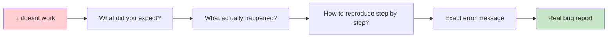
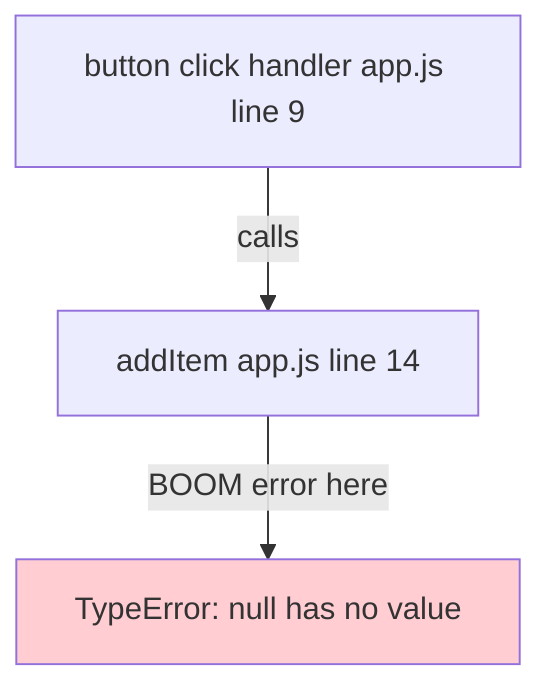
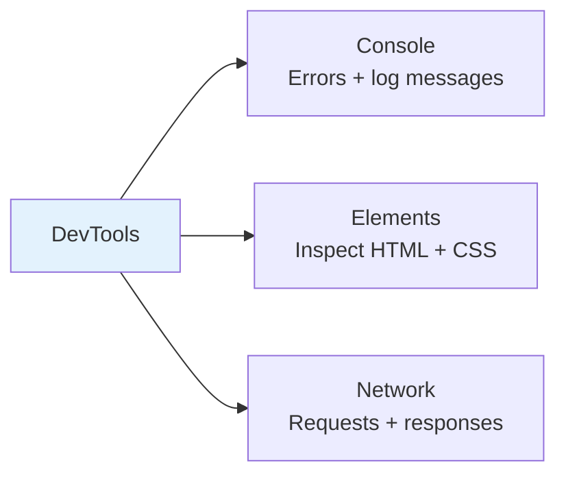
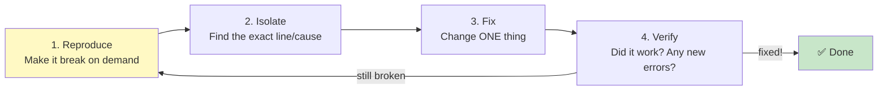
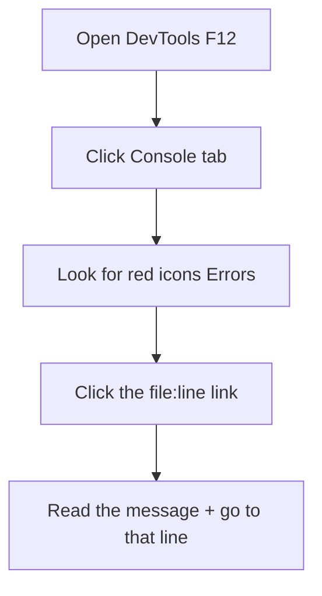
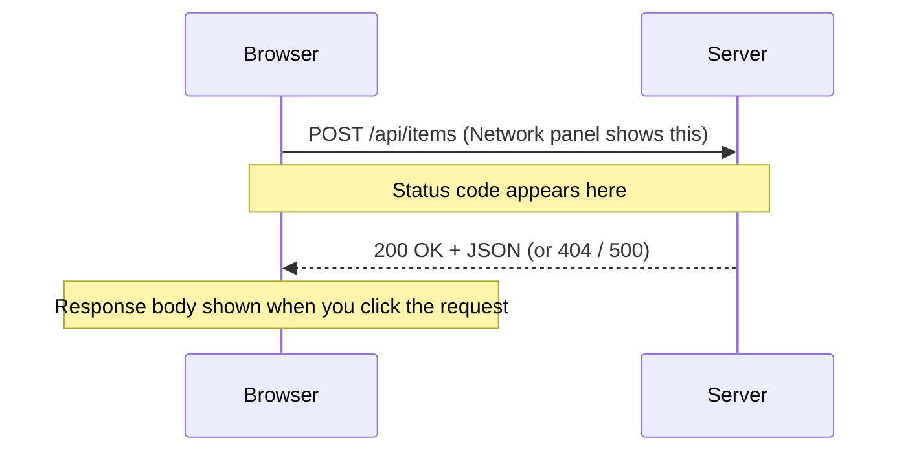
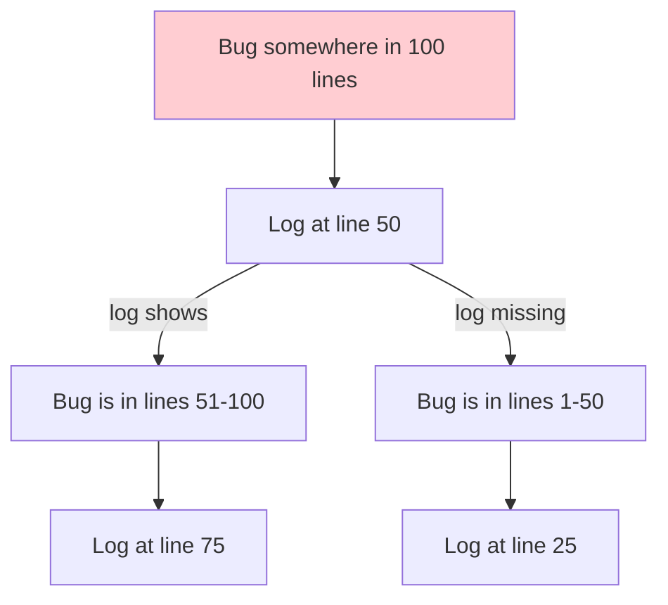
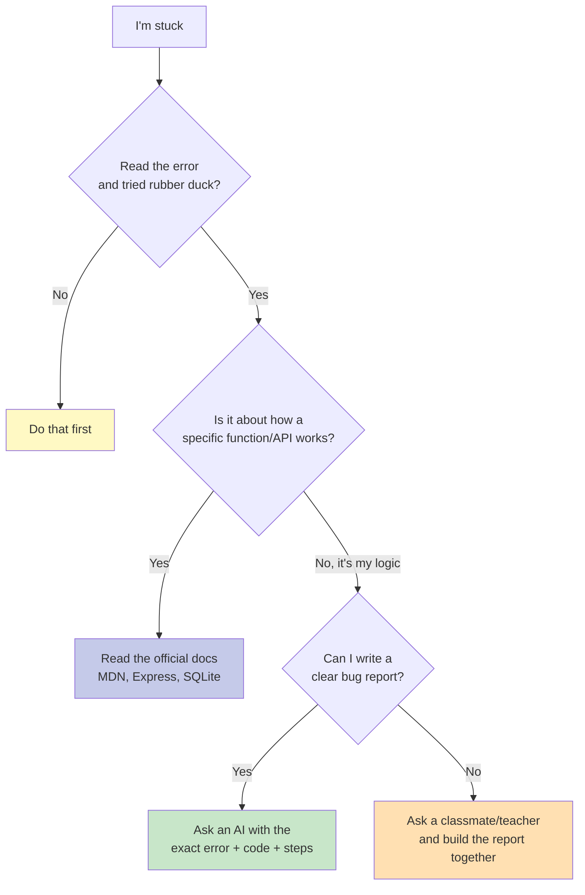

# Debugging & DevTools: Becoming Your Own Fixer

**Grade 10 - ICT (Full-Stack Elective)**
**Quarter 2 · Week 9**
**Duration:** 1–2 weeks
**Prerequisite:** [`js-basics`](../js-basics/lecture.md), [`dom`](../dom/lecture.md) (you need code that can break before you can debug it!)

---

## 🎯 Learning Objectives

By the end of this lecture, you will be able to:

1. ✅ Read an error message and locate the **real** problem (not just the scary red text)
2. ✅ Use the **Console**, **Elements**, and **Network** panels of Chrome DevTools
3. ✅ Run the debugging cycle: **reproduce → isolate → fix → verify**
4. ✅ Recognize common JavaScript, DOM, Fetch, Express, and SQLite error families
5. ✅ Use `console.log`, the `debugger` statement, and logging strategically (not randomly)
6. ✅ Apply mental techniques: **rubber-duck debugging** and **divide & conquer**
7. ✅ Know when to ask an AI, when to read the docs, and when to ask a person

---

## 📖 Table of Contents

1. [Why "It Doesn't Work" Is Not a Bug Report](#section-1)
2. [Anatomy of an Error Message](#section-2)
3. [Chrome DevTools: The Three Panels You'll Live In](#section-3)
4. [The Debugging Cycle](#section-4)
5. [The Console Panel](#section-5)
6. [The Elements Panel](#section-6)
7. [The Network Panel](#section-7)
8. [Strategic Logging & the `debugger` Statement](#section-8)
9. [Common Error Families](#section-9)
10. [Mental Techniques: Rubber Duck & Divide & Conquer](#section-10)
11. [When to Use What (AI vs Docs vs a Person)](#section-11)
12. [Mini-Projects](#mini-projects)
13. [Final Challenge](#final-challenge)
14. [Troubleshooting](#troubleshooting)
15. [What's Next?](#whats-next)

---

<a name="section-1"></a>
## 1. Why "It Doesn't Work" Is Not a Bug Report

### **The Scene at the Sari-Sari Store**

Your classmate built a sari-sari store inventory page. They run to you and say:

> "It doesn't work."

That sentence has **zero** useful information. As a developer — and especially when you ask an AI for help — you need to turn "it doesn't work" into a **bug report**.

### **What Makes a Good Bug Report?**

A good bug report answers **four questions**:

1. **What did you expect to happen?** ("Clicking *Add Item* should show the new product in the list.")
2. **What actually happened?** ("Nothing appears. The button looks dead.")
3. **How do I reproduce it?** Step by step. ("1) Open the page. 2) Type *Sardinas*. 3) Click Add. 4) Nothing.")
4. **What does the error say?** (The exact red text from the Console — see Section 2.)



✅ **Good bug report:**
> "On the inventory page, when I type *Sardinas* and click *Add Item*, nothing is added. The Console shows `Uncaught TypeError: Cannot read properties of null (reading 'value')` at `app.js:14`. Expected: the item appears in the list."

❌ **Bad bug report:**
> "The add button is broken. Fix it."

**🎯 Try It:** Open [`assets/broken-sari-sari.html`](assets/broken-sari-sari.html) in your browser. Find at least **three** things that are broken. Write a proper bug report for each using the four questions above.

### **Why This Matters for AI Too**

When you eventually ask an AI (or a teacher) for help, a good bug report gets you a correct answer in one try. A bad one wastes everyone's time. We'll come back to this in the [`ai-assisted-development`](../ai-assisted-development/lecture.md) lecture.

---

<a name="section-2"></a>
## 2. Anatomy of an Error Message

Error messages look terrifying. They are actually **maps** — they tell you where to look.

### **The Four Parts of a JavaScript Error**

```
Uncaught TypeError: Cannot read properties of null (reading 'value')
   ╰─ ① type ────╯  ╰──────── ② message ──────────────────────╯
    at addItem (app.js:14)
    ╰───── ③ function ──╯  ╰─ ④ file & line number ─╯
    at HTMLButtonElement.<anonymous> (app.js:9)
```

| Part | What it means | What you do |
|---|---|---|
| **① Type** (`TypeError`, `ReferenceError`, `SyntaxError`) | The *category* of mistake | Tells you what family to look for (Section 9) |
| **② Message** | The specific complaint in plain-ish English | Read it slowly, twice |
| **③ Stack trace** (`at addItem`) | Which function was running when it broke | Start reading from the **top** — that's where it exploded |
| **④ File & line** (`app.js:14`) | Exactly where in your code | **Go there first.** Open that file, that line. |

### **Read the Stack Top-Down (Usually)**

The **first** line of the stack trace is where the error *happened*. The lines below it are the chain of function calls that led there.



> 💡 **The fix is usually NOT on the exploding line** — it's wherever the `null` came from. The line `app.js:14` tells you *where it broke*; your job is to find *why that value is null*. (In this example, the `id` you passed to `getElementById` was misspelled, so it returned `null`.)

### **The Number-One Habit**

> 📌 **When you see an error, do not close it. Do not ignore it. Read it.** Then open the file and line it points to.

✅ **DO:** copy the exact error text into your bug report.
❌ **DON'T:** write "there was a red error."

---

<a name="section-3"></a>
## 3. Chrome DevTools: The Three Panels You'll Live In

**DevTools** is the developer's control room, built into Chrome (and Edge). Open it with:

- **Right-click → Inspect**, or
- **`F12`** (Windows/Linux) / **`Cmd + Option + I`** (Mac), or
- **`Ctrl + Shift + J`** (jumps straight to the Console)

You will use three panels 95% of the time:



| Panel | Answers the question | Used when… |
|---|---|---|
| **Console** | "Is my code running? Did it error? What are my values?" | Always. It's your first stop. |
| **Elements** | "What HTML/CSS is *actually* on the page right now?" | The page looks wrong, or `getElementById` returns `null`. |
| **Network** | "Did my request leave? Did the server reply? With what?" | `fetch` / forms / Express seem to do nothing. |

We'll tour each one in Sections 5–7.

**🎯 Try It:** Open [`assets/broken-sari-sari.html`](assets/broken-sari-sari.html), press **F12**, and look at the **Console**. You should already see red errors before you even click anything.

---

<a name="section-4"></a>
## 4. The Debugging Cycle

Debugging is **not** guessing. It's a loop. Memorize these four steps:



### **1. Reproduce**
Make the bug happen **reliably**, on purpose. If you can't reproduce it, you can't confirm you fixed it.
> *"Click Add, type Sardinas, press Enter → nothing happens, error in Console."*

### **2. Isolate**
Narrow down **where** the problem is. Use logs (Section 8) to find the exact line where things go wrong. Use divide & conquer (Section 10) to chop the problem in half.

### **3. Fix — Change ONE thing**
Change **one** thing at a time. If you change five things and it works, you won't know *which* fix mattered — and you may have broken something else silently.

### **4. Verify**
Re-run your reproduction steps. The bug is gone? ✅ Check the Console again — did your fix create a **new** error?

> 🪤 **The classic mistake:** changing ten things at once, the bug disappears, but you've secretly introduced two new bugs. One change at a time.

---

<a name="section-5"></a>
## 5. The Console Panel

The Console is your **first stop, every time**. It shows errors, warnings, and any `console.log` your code prints.

### **Reading the Console**



- 🔴 **Red** = error (code stopped running here).
- 🟡 **Yellow** = warning (code ran, but something's fishy).
- The **blue link** (`app.js:14`) jumps you straight to that line.

### **Logging Your Own Values**

`console.log()` prints a value so you can *see* what your code is doing:

```javascript
// ❌ Unhelpful — you don't know WHICH value this is
console.log(total);

// ✅ Helpful — label it
console.log('total after adding sardinas:', total);

// ✅ Even better — log the whole object
console.log('cart object:', cart);
```

### **Level Up: `console.table` and `console.group`**

```javascript
// Pretty-print arrays of objects (great for product lists)
console.table(products);

// Group related logs together
console.group('Add item flow');
console.log('input value:', input.value);
console.log('before push:', cart);
cart.push(newItem);
console.log('after push:', cart);
console.groupEnd();
```

**🎯 Try It:** Open [`assets/broken-sari-sari.html`](assets/broken-sari-sari.html). Before fixing anything, add `console.log` statements inside each function to trace what runs and what doesn't. Find the function that **never** logs — that's where execution dies.

---

<a name="section-6"></a>
## 6. The Elements Panel

The Elements panel shows the **live** HTML and CSS of your page — exactly as the browser sees it *right now* (which may differ from your source file after JavaScript changes things).

### **When to Reach for Elements**

- `document.getElementById('addBtn')` returns `null` → check **Elements** to see if that `id` really exists (and check the spelling!).
- The page "looks weird" → inspect the element and toggle CSS off/on to find the culprit rule.
- You want to **experiment** without editing your file → change styles live, see the result instantly, *then* copy the fix into your code.

### **The Most Common `null` Bug**

```html
<!-- Your source file -->
<button id="add-btn">Add</button>
```
```javascript
// Your JS
const btn = document.getElementById('addBtn');  // ❌ returns null!
```

**The `id` in HTML is `add-btn` (with a hyphen), but the JS says `addBtn` (camelCase).** They don't match, so `getElementById` returns `null`. Then `btn.addEventListener(...)` throws `TypeError: Cannot read properties of null`.

> 💡 Use the Elements panel to copy-paste the **exact** `id` from the live HTML so it never mismatches.

**🎯 Try It:** In [`assets/broken-sari-sari.html`](assets/broken-sari-sari.html), one button's `id` in the HTML does not match the `id` the JavaScript is looking for. Use the **Elements** panel to find the real `id`, then fix the mismatch in the code.

---

<a name="section-7"></a>
## 7. The Network Panel

The Network panel is your **X-ray for requests**. Whenever your page calls `fetch`, submits a form, or loads data, the Network panel shows:
- **Did the request even leave the browser?**
- **What URL and method** (`GET`/`POST`) was used?
- **What status code** came back? (`200` ok, `404` not found, `500` server error)
- **What did the server actually send back?** (the response body)



### **Reading Status Codes (the short list)**

| Code | Meaning | Likely cause |
|---|---|---|
| **200** | OK | Worked |
| **404** | Not Found | Wrong URL / route doesn't exist |
| **400** | Bad Request | You sent invalid/missing data |
| **500** | Server Error | Your Express/SQLite code crashed |

### **The "Fetch Does Nothing" Checklist**

When `fetch` seems to do nothing:
1. Open **Network** → trigger the action → **is there a new row?**
   - **No row** → your `fetch` code never ran (check the Console + your event listener).
   - **Row exists, status 404** → the URL/route is wrong.
   - **Row exists, status 500** → the server errored (read the response!).
2. Click the request → **Response** tab → read what the server actually said.

> 📌 The Network panel turns "it just doesn't load the data" into a precise question with a precise answer.

**🎯 Try It:** (Requires the Express server running.) Open any page that loads data via `fetch`. Open **Network**, reload, and click a request. Find the **Status** code and the **Response** body. Write down what you see.

---

<a name="section-8"></a>
## 8. Strategic Logging & the `debugger` Statement

### **Logging Is a Probe, Not Decorations**

Beginners sprinkle `console.log` everywhere and drown in output. **Strategic** logging answers a specific question:

| You want to know… | Log this |
|---|---|
| "Did this function even run?" | `console.log('addItem START')` at the top |
| "What's the input?" | `console.log('input:', input.value)` |
| "What's the state before/after?" | `console.log('cart before:', cart)` then `after:` |
| "Where does it die?" | Log at the start of *every* function in the chain |

### **The `debugger` Statement — Pause the Code**

Write the word `debugger;` anywhere in your JS. When DevTools is open, execution **pauses** there, and you can inspect every variable live.

```javascript
function addItem() {
  const name = nameInput.value;
  debugger;  // ⏸ execution pauses here with DevTools open
  const item = { name, qty: 1 };
  cart.push(item);
}
```

When paused:
- **Hover** over any variable to see its value.
- Use the **Scope** panel to see all variables in scope.
- Use **Step over** (F10) to run one line at a time.

> 💡 `debugger;` is a scalpel. Remove it when you're done so it doesn't pause in production.

---

<a name="section-9"></a>
## 9. Common Error Families

Recognize the family → you're halfway to the fix.

### **JavaScript families**

| Error | You probably… | Fix |
|---|---|---|
| `ReferenceError: x is not defined` | Used a variable/typo before declaring it | Check spelling; declare it |
| `TypeError: Cannot read properties of null` | `getElementById` found nothing, or a function returned `null` | Verify the `id`/selector exists in Elements |
| `SyntaxError: Unexpected token` | Missing `)`, `}`, `,` or stray character | Find the unbalanced bracket |
| `TypeError: x is not a function` | Called something that isn't a function (often a typo in the name) | Check the method name |

### **DOM family**
- **Symptom:** nothing happens on click.
- **Cause:** event listener attached to `null`, or script ran before the element existed.
- **Fix:** script at the **end** of `<body>`, or wrap in `DOMContentLoaded`.

### **Fetch / Network family**
- **Symptom:** `.then` never runs, or data is `undefined`.
- **Cause:** forgot `return response.json()`, or the request failed (404/500).
- **Fix:** check **Network** panel; add `.catch(err => console.error(err))`.

### **Express family**
- **Symptom:** "Cannot GET /something" in the browser.
- **Cause:** no route matches that path.
- **Fix:** check `app.get('/something', ...)` exists and the spelling matches.

### **SQLite family**
- **Symptom:** `SQLITE_ERROR: no such table` or `no such column`.
- **Cause:** table/column name mismatch, or the DB file path is wrong.
- **Fix:** print your schema; check column names match the query exactly.

---

<a name="section-10"></a>
## 10. Mental Techniques: Rubber Duck & Divide & Conquer

### **Rubber-Duck Debugging**

Explain your code, line by line, **out loud** to a rubber duck (or a classmate, or a chair). The act of explaining forces you to notice the assumption that's wrong.

> "Okay duck, first I get the input element by its id 'addBtn'… wait. The HTML says 'add-btn'. **Oh.**"

This works **shockingly** often. Try it before asking anyone.

### **Divide & Conquer (Binary Search)**

When you have no idea where the bug is, **cut the problem in half** with a log:

```javascript
console.log('A: got here');  // top of file
// ... 100 lines of mystery ...
console.log('B: got here');  // bottom
```

- If **A** prints but **B** doesn't → the bug is between them. Move **B** up to the halfway point.
- Repeat. In ~7 cuts you isolate one line out of 100.



---

<a name="section-11"></a>
## 11. When to Use What (AI vs Docs vs a Person)

You have three sources of help. Knowing **which** to use saves hours.



| Source | Best for | Watch out |
|---|---|---|
| **Yourself + DevTools** | 80% of bugs | Don't skip straight to asking |
| **Docs** (MDN, Express, SQLite) | "How does X work?" exact syntax | Slower, but builds real understanding |
| **AI** | "Here's my error + code + steps, what's wrong?" | It can be confidently wrong — **verify** (see [`ai-assisted-development`](../ai-assisted-development/lecture.md)) |
| **A person** | You can't even form a bug report yet | Pair up; build the report together |

> 📌 **Order of operations:** DevTools first → docs if it's a "how does X work" question → AI with a real bug report → a person when you're truly stuck.

---

<a name="mini-projects"></a>
## 12. Mini-Projects

### **Mini-Project 1: The Error Detective** (Beginner)
Open [`assets/broken-sari-sari.html`](assets/broken-sari-sari.html). There are **4 intentional bugs**. Using only the Console and Elements panels, find and fix all four. For each, write: the error message, the file:line, and the one-line fix.

### **Mini-Project 2: Log It Right** (Beginner)
Take any working page you built earlier. Add **strategic** `console.log` statements that would help a future you debug it — labeled, grouped, and at the start of each function. No unlabeled logs allowed.

### **Mini-Project 3: Network Hunter** (Intermediate)
With your Express server running, open a page that loads data. Break the route URL on purpose (e.g., change `/api/items` to `/api/item`). Use the **Network** panel to observe the `404`. Then fix it and observe the `200`.

---

<a name="final-challenge"></a>
## 13. Final Challenge

### **Bug Hunt Tournament**

Your teacher hands out a "mystery" page with **5 hidden bugs** across HTML, CSS, and JavaScript. Working in pairs:

1. Reproduce each bug with precise steps.
2. Write a proper bug report (the four questions) for each.
3. Fix them **one at a time**, verifying after each.
4. Keep a "debugging log" — what technique found each bug (Console? Elements? Network? rubber duck?).

**Bonus:** the pair that fixes the most bugs **without** changing more than one thing per attempt wins.

---

<a name="troubleshooting"></a>
## 14. Troubleshooting

### **Problem: "DevTools won't open"**
Press `F12`, or right-click → **Inspect**. If nothing happens, your browser may have it disabled — try Chrome or Edge.

### **Problem: "My console.log doesn't show up"**
- Is DevTools actually open *when the code runs*? Open it first, then reload.
- Is the function even being called? Add a log at the very **top** of the function.

### **Problem: "The error points to a line that looks fine"**
The error is often **before** the reported line — an unclosed bracket, a missing comma, or a `null` created earlier. Look **upward** from the reported line.

### **Problem: "It worked yesterday!"**
You (or git) changed something. Run `git diff` to see exactly what changed since it last worked.

### **Problem: "I changed it and now there are MORE errors"**
You changed more than one thing. Undo to the last working state, then change **one** thing at a time (Section 4).

---

<a name="whats-next"></a>
## 15. What's Next?

### **You Now Know:**
✅ How to turn "it doesn't work" into a real bug report
✅ How to read an error message as a map
✅ The Console, Elements, and Network panels
✅ The reproduce → isolate → fix → verify cycle
✅ Rubber-duck and divide-and-conquer techniques
✅ When to use DevTools vs docs vs AI vs a person

### **Coming Up Next**
These debugging muscles will be tested in **Quarter 3** when you build your first Express + SQLite backend — because servers add a whole new layer of "where did it go wrong?" (Hint: the **Network** and **Console** panels are still your best friends, now joined by server-side `console.log`.)

### **The Big Idea**
> A developer who can debug is worth ten who can only write code. Bugs are not failures — they're puzzles, and you now have a system for solving them.

---

**📝 Quick Reference Card**

```
THE 4-STEP DEBUGGING CYCLE
1. REPRODUCE  — make it break on demand
2. ISOLATE    — log/divide-and-conquer to find the line
3. FIX        — change ONE thing
4. VERIFY     — confirm fixed + no new errors

BUG REPORT (4 questions)
1. What did you EXPECT?
2. What ACTUALLY happened?
3. How do you REPRODUCE it (steps)?
4. What is the EXACT error message?

DEVTOOLS — 3 PANELS
• Console   → errors + your console.log
• Elements  → live HTML/CSS, fix null selectors
• Network   → requests, status codes (200/404/500), responses

ORDER OF HELP
DevTools → Docs → AI (with a real bug report) → a person
```

---

**End of Debugging & DevTools Lecture**

*Created for Grade 10 Filipino Students*
*Philippine Context, Real-World Examples, Practical Skills*
