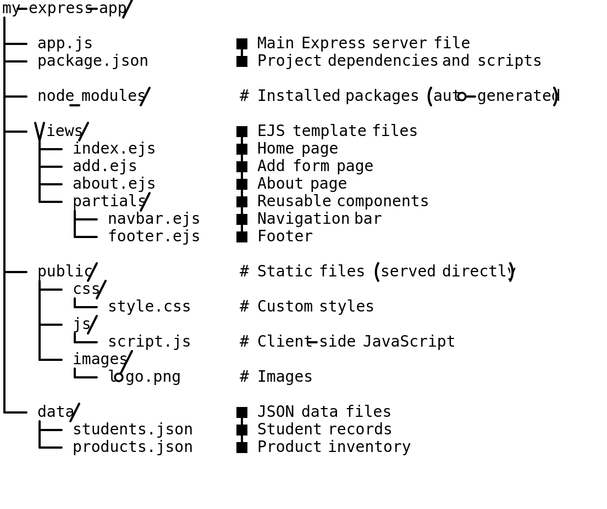
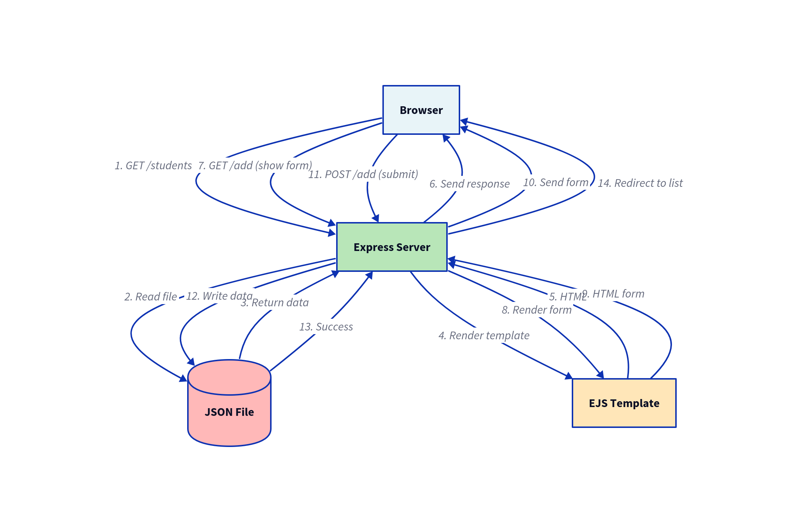
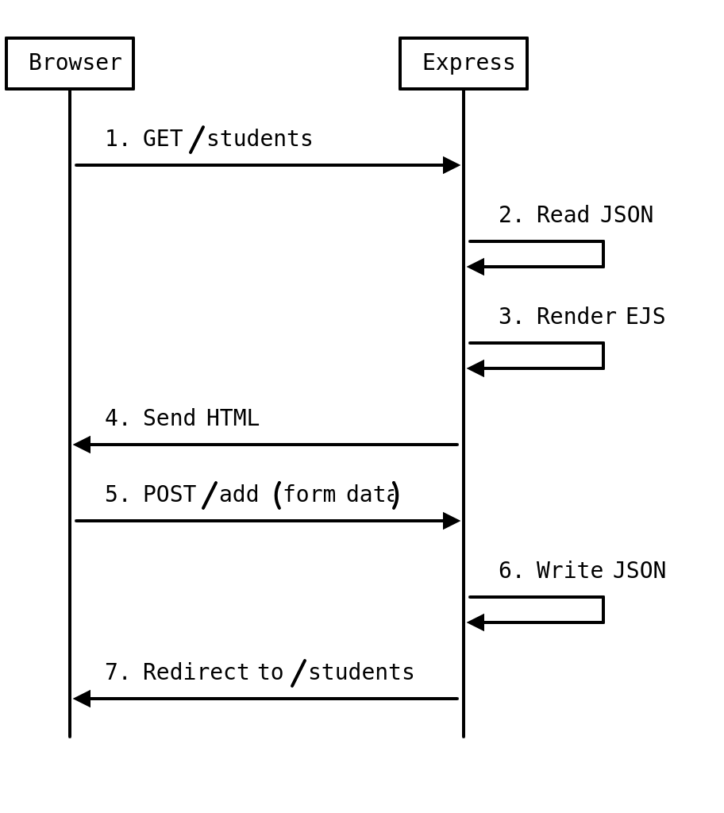
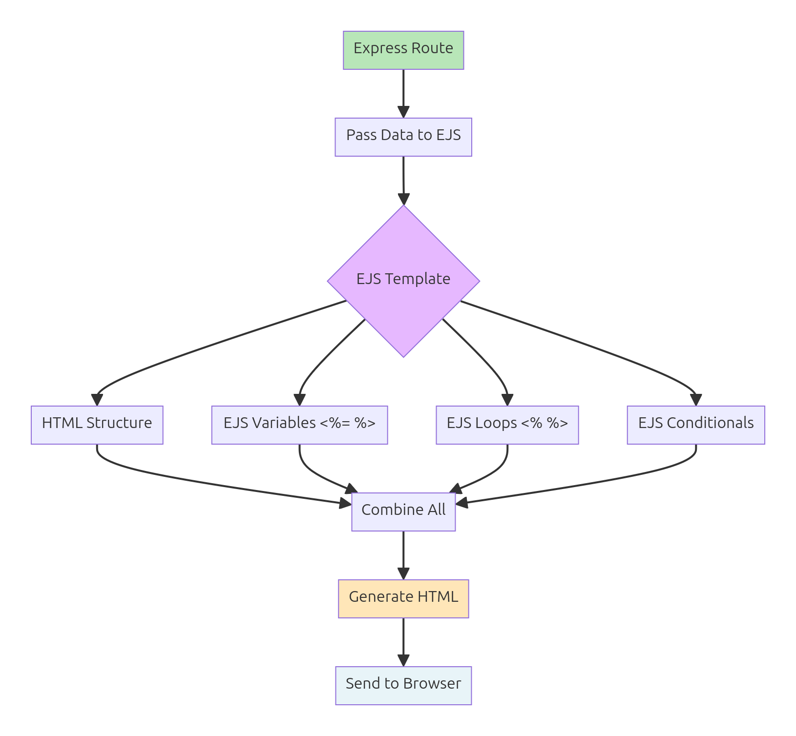
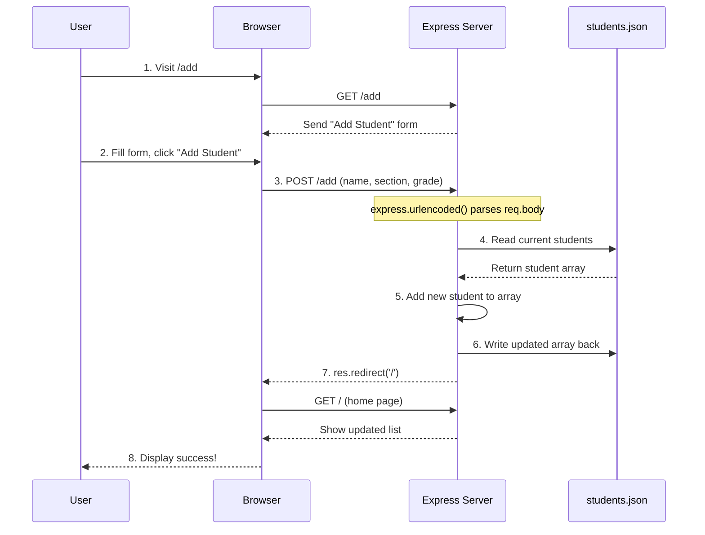
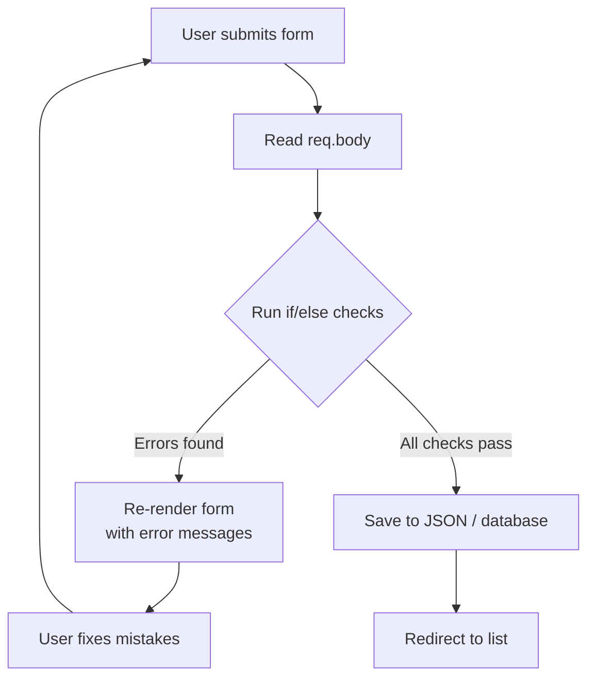
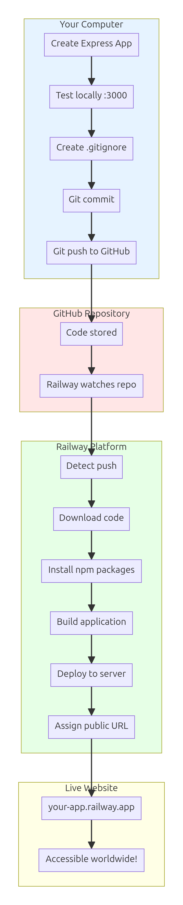
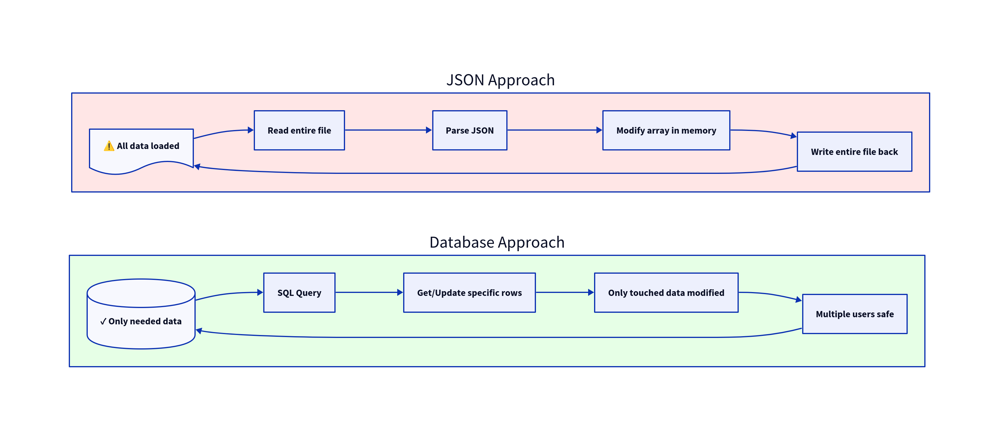

# Building Web Applications - Part 1
## Node.js, Express, EJS, and JSON

**Target Audience:** Grade 10 Students  
**Prerequisites:** HTML/CSS basics, JavaScript fundamentals, AJAX/Fetch API  
**Duration:** 1-2 weeks

---

## 🎯 What You'll Learn

By the end of this lecture, you'll be able to:
- Use the command line to set up and run projects
- Build a web server with Node.js and Express
- Create dynamic web pages with EJS templates
- Style pages quickly with Bulma CSS
- Store and manage data using JSON files
- Deploy your web app online with Railway

**Final Project:** A complete directory web app (your choice: Barangay Directory, Class List, or Store Inventory) that you can share with friends and family!

---

## 🍔 Introduction: From Browser to Server

Remember when we learned about `fetch()` in the AJAX lecture? We were sending requests from the browser to get data. But where was that data coming from? **A server!**

### The Jollibee Counter Analogy

Think of a web application like Jollibee:

**Browser (Customer):**
- You go to the counter
- You place an order (make a request)
- You wait for your food (loading state)
- You receive your meal (get the response)

**Server (Kitchen & Staff):**
- Takes your order
- Prepares the food (processes data)
- Serves it to you (sends response)
- Manages the menu (stores data)

Up until now, we've only been the **customer** (browser side). Today, we're learning to build the **kitchen and counter** (server side)!

### What We're Building

A complete web application that:
- Runs on your computer (or online)
- Serves web pages
- Shows data from files
- Lets users add new data
- Looks professional with Bulma CSS

---

## 🌉 Section 0: The Frontend → Backend Bridge

Before we dive into backend code, let's understand **why** we need it and **what changes** when we move from frontend to backend development.

### What You Already Know (Frontend)

You've learned to build websites with:
- **HTML** - Structure and content
- **CSS** - Styling and layout
- **JavaScript** - Interactivity and behavior
- **fetch()** - Getting data from somewhere else

**Where these run:** In the **browser** (Chrome, Firefox, Edge)

**What you could build:**
- Static portfolios
- Interactive calculators
- Weather dashboards (fetching from APIs)
- Games
- Form validation

**Limitations:**
- Can't save data permanently (only in browser's localStorage)
- Can't protect secrets (API keys visible in source code)
- Can't handle multiple users
- Can't create custom URLs (stuck with files like `index.html`, `about.html`)
- Can't process payments, send emails, etc.

### What Backend Adds

**Backend = Server-side code** that runs on a computer (your laptop or a hosting server), not in the browser.

**New capabilities:**
1. **Permanent Data Storage** - Save to files or databases
2. **Secret Management** - Hide API keys, passwords safely
3. **Custom URLs** - `/about`, `/products/123`, `/users/profile`
4. **User Accounts** - Login, sessions, authentication
5. **Server-Side Processing** - Calculations, image resizing, etc.
6. **Real-Time Features** - Chat, notifications, live updates
7. **Email/SMS** - Send messages automatically
8. **Payment Processing** - Accept payments securely

### The Mental Shift

| Frontend Mindset | Backend Mindset |
|------------------|-----------------|
| "User clicked button" | "Server received request" |
| `onClick` event handlers | Routes (URL patterns) |
| DOM manipulation | Sending HTML/JSON |
| `fetch()` to get data | **Being** the API that sends data |
| Files opened directly | Server serves files |
| One user (you) | Many users simultaneously |
| Browser console for debugging | Terminal/logs for debugging |

**Key insight:** You're switching from **consuming APIs** to **creating APIs**.

### Philippine Example: Sari-Sari Store Evolution

**Frontend only (what you've built so far):**
```
Store Catalog Website
- HTML page with products
- JavaScript to filter/search
- Data hardcoded in JavaScript or loaded from static JSON
- Each customer opens the file directly
```

**Limitations:**
- Aling Rosa can't update inventory (needs to edit HTML/JSON)
- No shopping cart that saves
- No order tracking
- No customer accounts
- Can't show "in stock" vs "out of stock" in real-time

**With Backend (what we're building now):**
```
Store Management System
- Server runs on a computer
- Products stored in JSON file (or database)
- Aling Rosa can add/edit/delete products through web forms
- Shopping cart saves to server
- Order history tracked
- Customer accounts with login
- Real-time inventory updates
```

**The flow:**
1. Customer visits `http://localhost:3000/products`
2. Express server receives request
3. Server reads `products.json` file
4. Server generates HTML page with current data
5. Server sends HTML to customer's browser
6. Customer sees up-to-date product list

### What Changes in Your Code

**Frontend JavaScript (runs in browser):**
```javascript
// Get data
const response = await fetch('products.json');
const products = await response.json();

// Show data
products.forEach(product => {
  const div = document.createElement('div');
  div.textContent = product.name;
  document.body.appendChild(div);
});
```

**Backend JavaScript with Express (runs on server):**
```javascript
// Import Express
const express = require('express');
const app = express();

// Define what happens when someone visits /products
app.get('/products', (req, res) => {
  // Read products.json
  const products = [
    { name: 'Pancit Canton', price: 15 },
    { name: 'Lucky Me', price: 12 }
  ];
  
  // Send HTML response
  res.send(`
    <h1>Products</h1>
    ${products.map(p => `<div>${p.name} - ₱${p.price}</div>`).join('')}
  `);
});

// Start server (listen for requests)
app.listen(3000, () => {
  console.log('Server running on http://localhost:3000');
});
```

**Key differences:**
- No DOM manipulation (`document.getElementById()` doesn't exist on server!)
- No `fetch()` - you're the one **receiving** requests now
- `require()` instead of `<script>` tags
- Server must **always be running** to work
- Terminal output instead of browser console

### New Concepts to Learn

**1. Server**
- A program that listens for requests and sends responses
- Runs continuously (doesn't stop after one page load)
- Handles multiple requests simultaneously

**2. Routes**
- URL patterns that trigger different code
- `/` = home page
- `/products` = products list
- `/about` = about page

**3. Request/Response Cycle**
- **Request:** Browser asks for something (`GET /products`)
- **Response:** Server sends back HTML, JSON, or files

**4. Template Engines (EJS)**
- Like HTML with superpowers
- Can use variables, loops, conditionals
- Server fills in data before sending to browser

**5. Middleware**
- Code that runs between request and response
- Examples: logging, authentication, parsing form data

**6. Environment**
- Development: Your laptop (`localhost:3000`)
- Production: Online server (Railway, Heroku, etc.)

### The Learning Path

```
┌─────────────────────────────────────────┐
│ Where You Are Now (Frontend Complete)   │
├─────────────────────────────────────────┤
│ HTML → CSS → JavaScript → fetch()       │
│ Everything runs in the browser          │
└─────────────────────────────────────────┘
                  ↓
┌─────────────────────────────────────────┐
│ What We're Learning (Backend Basics)    │
├─────────────────────────────────────────┤
│ Command Line → Node.js → Express        │
│ → EJS Templates → JSON Storage          │
│ → Railway Deployment                    │
│ Everything runs on a server             │
└─────────────────────────────────────────┘
                  ↓
┌─────────────────────────────────────────┐
│ Future Lectures (Full-Stack)            │
├─────────────────────────────────────────┤
│ Databases → Authentication → APIs       │
│ → Real-time → Payment Integration       │
│ Frontend + Backend working together     │
└─────────────────────────────────────────┘
```

### Common Questions

**Q: Do I stop using HTML/CSS/JavaScript?**
- No! You still use them. Backend generates HTML and serves CSS/JS files.
- Think: "Backend prepares the food (data), frontend presents it nicely (styling)"

**Q: Can I build everything with just frontend?**
- Simple sites: Yes (portfolios, landing pages)
- Web apps with data: Need backend (stores, directories, social networks)

**Q: Is backend harder than frontend?**
- Different, not harder
- Less visual (can't "see" results in browser immediately)
- More about data flow and logic
- Debugging with console.log() and terminal output

**Q: Do I need to buy hosting now?**
- Not yet! We'll run servers on our own laptop first
- Later: Railway offers free tier perfect for learning

**Q: What about databases?**
- We'll use JSON files first (simpler)
- Next lecture: SQLite database (more powerful)

### Your Mindset Shift

**Before (Frontend Developer thinking):**
> "How do I display this data on the page?"

**Now (Backend Developer thinking):**
> "Where does this data come from? How do I store it? How do I send it to the browser?"

**Soon (Full-Stack Developer thinking):**
> "How do frontend and backend work together to create a complete experience?"

### Ready?

Take a breath. This is a **big shift** in how you think about web development. It's normal to feel confused at first.

**Remember:**
- You're not starting from zero (you know JavaScript!)
- Backend JavaScript uses the same syntax (variables, functions, loops)
- We'll build up gradually (simple servers → complex apps)
- Every concept has a "Try It" section

Let's start with the foundation: **the command line**.

---

## 📁 Section 1: Command Line Basics

Before we build web apps, we need to learn to "talk" to our computer using text commands.

### Why Use the Command Line?

**Real Talk:** The command line looks scary, but it's just a way to give instructions to your computer by typing instead of clicking.

Think of it like:
- **GUI (Graphical Interface):** Pointing at menu items in a restaurant
- **Command Line:** Telling the waiter exactly what you want

### Essential Commands

#### Navigation
```bash
# See where you are
pwd

# List files in current folder
ls

# Change directory (go into a folder)
cd my-folder

# Go back one level
cd ..

# Go to home directory
cd ~
```

#### File Management
```bash
# Create a new folder
mkdir my-project

# Create a new file
touch app.js

# Delete a file (careful!)
rm filename.txt

# Delete a folder (very careful!)
rm -rf folder-name
```

#### Running Node.js
```bash
# Run a JavaScript file
node app.js

# Install packages
npm install express

# Start your project
npm start
```

### 🎯 Try It: Your First Commands

1. Open your terminal (Command Prompt on Windows, Terminal on Mac/Linux)
2. Try these commands:
   ```bash
   pwd
   ls
   mkdir test-folder
   cd test-folder
   pwd
   cd ..
   ```

**Open:** [Command Line Cheat Sheet](assets/command-line-cheat-sheet.html) - Print this and keep it handy!

---

## 📂 Section 2: Project Structure

A well-organized project is like a well-organized sari-sari store - everything has its place!

### Standard Folder Structure

```
my-web-app/
├── app.js                 # Main server file
├── package.json           # Project info and dependencies
├── .gitignore            # Files to ignore in Git
├── public/               # Static files (CSS, images, client JS)
│   ├── css/
│   ├── images/
│   └── js/
├── views/                # EJS templates (HTML with variables)
│   ├── pages/
│   └── partials/
├── data/                 # JSON data files
│   └── items.json
└── routes/              # Route handlers (optional, for organization)
    └── main.js
```

### Why This Structure?

- **`app.js`**: The "main switch" - starts the server, sets up routes
- **`public/`**: Files sent directly to browser (CSS, images, etc.)
- **`views/`**: HTML templates with placeholders for data
- **`data/`**: JSON files that store information
- **`routes/`**: Organize code by feature (users, products, etc.)

**Analogy:** Think of your project like a house:
- `app.js` = Front door (main entrance)
- `public/` = Living room (what guests see)
- `views/` = Kitchen (where you prepare things)
- `data/` = Storage room (where you keep supplies)



---

## 🟢 Section 3: Node.js & Express Basics

### What is Node.js?

**Node.js** lets you run JavaScript **outside the browser** - on your computer or a server.

Before Node.js:
- JavaScript only worked in browsers
- Had to use PHP, Python, or Java for servers

After Node.js:
- JavaScript everywhere!
- One language for browser AND server

### What is Express?

**Express** is a tool (framework) that makes building web servers easy.

Without Express:
```javascript
// Lots of complicated code
// Hard to understand
// Many lines just to serve one page
```

With Express:
```javascript
app.get('/', (req, res) => {
  res.send('Hello World!');
});
```

**Much simpler!**

### Your First Express Server

**🎯 Try It: Hello World Server**

1. Create a new folder and navigate into it:
   ```bash
   mkdir my-first-server
   cd my-first-server
   ```

2. Initialize a Node.js project:
   ```bash
   npm init -y
   ```

3. Install Express:
   ```bash
   npm install express
   ```

4. Open the folder in your code editor and look at `assets/01-hello-express/`

**File: `app.js`**
```javascript
// Import Express
const express = require('express');

// Create an Express application
const app = express();

// Define the port
const PORT = 3000;

// Define a route for the home page
app.get('/', (req, res) => {
  res.send('<h1>Hello from my first server! 🚀</h1>');
});

// Start the server
app.listen(PORT, () => {
  console.log(`Server running at http://localhost:${PORT}`);
});
```

5. Run it:
   ```bash
   node app.js
   ```

6. Open your browser and go to: `http://localhost:3000`

**You just built a web server! 🎉**

### Understanding the Code

```javascript
app.get('/', (req, res) => {
  // app.get = Handle GET requests
  // '/' = The URL path (home page)
  // req = Request (what the browser sent)
  // res = Response (what we send back)
  res.send('Hello!');
});
```

Think of routes like counters at Jollibee:
- `/` = Main counter (home page)
- `/chicken` = Chicken counter
- `/burgers` = Burger counter
- `/drinks` = Drinks counter

Each route handles a different request!




---

## 📄 Section 4: Serving Static Files

Static files are files that don't change - like CSS, images, and client-side JavaScript.

### Setting Up Static Files

**🎯 Try It: Serving Static Files**

Look at `assets/02-static-files/`

**File: `app.js`**
```javascript
const express = require('express');
const app = express();
const PORT = 3000;

// Serve static files from 'public' folder
app.use(express.static('public'));

// Route for home page
app.get('/', (req, res) => {
  res.send(`
    <!DOCTYPE html>
    <html>
    <head>
      <link rel="stylesheet" href="/css/style.css">
    </head>
    <body>
      <h1>Welcome to My App!</h1>
      
    </body>
    </html>
  `);
});

app.listen(PORT, () => {
  console.log(`Server running at http://localhost:${PORT}`);
});
```

**File: `public/css/style.css`**
```css
body {
  font-family: Arial, sans-serif;
  margin: 40px;
  background-color: #f5f5f5;
}

h1 {
  color: #3273dc;
}
```

**Key Point:** Files in `public/` are served directly. The URL `/css/style.css` maps to `public/css/style.css`.

---

## 🎨 Section 5: Introduction to EJS Templates

**EJS (Embedded JavaScript)** lets you create HTML pages with placeholders for data.

### Why Use Templates?

**Without Templates:**
```javascript
app.get('/student', (req, res) => {
  res.send('<h1>Student: Juan Dela Cruz</h1>');
  // Hardcoded! Can't change easily
});
```

**With Templates:**
```javascript
app.get('/student', (req, res) => {
  res.render('student', { name: 'Juan Dela Cruz' });
  // Dynamic! Can pass any name
});
```

### Setting Up EJS

**🎯 Try It: Your First EJS Template**

Look at `assets/03-ejs-basic/`

**File: `app.js`**
```javascript
const express = require('express');
const app = express();
const PORT = 3000;

// Set EJS as the view engine
app.set('view engine', 'ejs');

// Route using EJS template
app.get('/', (req, res) => {
  res.render('home', { 
    title: 'Welcome',
    message: 'Hello from EJS!' 
  });
});

app.listen(PORT, () => {
  console.log(`Server running at http://localhost:${PORT}`);
});
```

**File: `views/home.ejs`**
```html
<!DOCTYPE html>
<html>
<head>
  <title><%= title %></title>
</head>
<body>
  <h1><%= message %></h1>
  <p>Today is: <%= new Date().toLocaleDateString() %></p>
</body>
</html>
```

### EJS Syntax

```ejs
<%= variable %>         <!-- Output value (escaped) -->
<%- htmlVariable %>     <!-- Output HTML (unescaped) -->
<% if (condition) { %>  <!-- JavaScript logic -->
<% } %>

<!-- Example: Loop -->
<% students.forEach(student => { %>
  <li><%= student.name %></li>
<% }); %>
```

**Analogy:** EJS is like a fill-in-the-blanks worksheet. The template has blanks (`<%= %>`) and you provide the answers (data).



---

## 💅 Section 6: Styling with Bulma CSS

**Bulma** is a CSS framework - a collection of pre-made styles you can use to make your site look professional quickly.

### Why Bulma?

- ✅ No JavaScript required (just CSS classes)
- ✅ Clean, modern design
- ✅ Easy to learn (logical class names)
- ✅ Responsive (works on mobile)
- ✅ Smaller than Bootstrap

### Adding Bulma

**Option 1: CDN (easiest)**
```html
<link rel="stylesheet" href="https://cdn.jsdelivr.net/npm/bulma@0.9.4/css/bulma.min.css">
```

**Option 2: Download and use locally**
```bash
npm install bulma
```

### Common Bulma Classes

**🎯 Try It: Bulma Basics**

Look at `assets/04-ejs-data/` - now with Bulma!

**File: `views/home.ejs`**
```html
<!DOCTYPE html>
<html>
<head>
  <title><%= title %></title>
  <link rel="stylesheet" href="https://cdn.jsdelivr.net/npm/bulma@0.9.4/css/bulma.min.css">
</head>
<body>
  <section class="section">
    <div class="container">
      <h1 class="title"><%= message %></h1>
      <p class="subtitle">A simple web app with Bulma CSS</p>
      
      <div class="box">
        <p>This is a box! It looks nice, right?</p>
      </div>
      
      <button class="button is-primary">Click Me!</button>
      <button class="button is-success">Success</button>
      <button class="button is-danger">Danger</button>
    </div>
  </section>
</body>
</html>
```

### Useful Bulma Classes

**Layout:**
- `.container` - Centered, responsive container
- `.section` - Section with padding
- `.columns` / `.column` - Grid layout

**Components:**
- `.box` - Card-like container
- `.button` - Styled button
- `.table` - Styled table
- `.card` - Card component

**Typography:**
- `.title` - Large heading
- `.subtitle` - Smaller heading
- `.content` - Formatted content

**Colors (modifiers):**
- `.is-primary` - Blue
- `.is-success` - Green
- `.is-warning` - Yellow
- `.is-danger` - Red

**Try changing the example above! Add more buttons, boxes, or columns.**

---

## 📊 Section 7: Working with JSON Files

JSON files are perfect for storing small amounts of data during development.

### What is JSON? (Review)

**JSON (JavaScript Object Notation)** is a way to store data in text format.

```json
{
  "name": "Juan Dela Cruz",
  "age": 15,
  "section": "Einstein"
}
```

### Reading JSON Files in Node.js

**🎯 Try It: Display Data from JSON**

Look at `assets/05-json-read/`

**File: `data/students.json`**
```json
[
  { "id": 1, "name": "Maria Santos", "section": "Einstein", "grade": 92 },
  { "id": 2, "name": "Juan Reyes", "section": "Newton", "grade": 88 },
  { "id": 3, "name": "Ana Garcia", "section": "Einstein", "grade": 95 },
  { "id": 4, "name": "Pedro Cruz", "section": "Newton", "grade": 86 }
]
```

**File: `app.js`**
```javascript
const express = require('express');
const fs = require('fs'); // File system module
const app = express();
const PORT = 3000;

app.set('view engine', 'ejs');
app.use(express.static('public'));

// Home page - show all students
app.get('/', (req, res) => {
  // Read the JSON file
  const data = fs.readFileSync('data/students.json', 'utf8');
  const students = JSON.parse(data);
  
  // Pass data to template
  res.render('students', { students: students });
});

app.listen(PORT, () => {
  console.log(`Server running at http://localhost:${PORT}`);
});
```

**File: `views/students.ejs`**
```html
<!DOCTYPE html>
<html>
<head>
  <title>Student List</title>
  <link rel="stylesheet" href="https://cdn.jsdelivr.net/npm/bulma@0.9.4/css/bulma.min.css">
</head>
<body>
  <section class="section">
    <div class="container">
      <h1 class="title">📚 Student List</h1>
      
      <table class="table is-striped is-fullwidth">
        <thead>
          <tr>
            <th>Name</th>
            <th>Section</th>
            <th>Grade</th>
          </tr>
        </thead>
        <tbody>
          <% students.forEach(student => { %>
            <tr>
              <td><%= student.name %></td>
              <td><%= student.section %></td>
              <td><%= student.grade %></td>
            </tr>
          <% }); %>
        </tbody>
      </table>
    </div>
  </section>
</body>
</html>
```

**Key Points:**
- `fs.readFileSync()` - Read file contents
- `JSON.parse()` - Convert JSON string to JavaScript object
- Loop through array in EJS with `forEach()`

---

## ✍️ Section 8: Adding Data with Forms

Now let's let users add new data!

**🎯 Try It: Add New Students**

Look at `assets/06-json-add/`

**File: `app.js`**
```javascript
const express = require('express');
const fs = require('fs');
const app = express();
const PORT = 3000;

app.set('view engine', 'ejs');
app.use(express.static('public'));

// Parse form data
app.use(express.urlencoded({ extended: true }));

// Helper function to read students
function getStudents() {
  const data = fs.readFileSync('data/students.json', 'utf8');
  return JSON.parse(data);
}

// Helper function to save students
function saveStudents(students) {
  fs.writeFileSync('data/students.json', JSON.stringify(students, null, 2));
}

// Show all students
app.get('/', (req, res) => {
  const students = getStudents();
  res.render('students', { students: students });
});

// Show add form
app.get('/add', (req, res) => {
  res.render('add-student');
});

// Handle form submission
app.post('/add', (req, res) => {
  const students = getStudents();
  
  // Create new student object
  const newStudent = {
    id: students.length + 1,
    name: req.body.name,
    section: req.body.section,
    grade: parseInt(req.body.grade)
  };
  
  // Add to array
  students.push(newStudent);
  
  // Save to file
  saveStudents(students);
  
  // Redirect back to list
  res.redirect('/');
});

app.listen(PORT, () => {
  console.log(`Server running at http://localhost:${PORT}`);
});
```

**File: `views/add-student.ejs`**
```html
<!DOCTYPE html>
<html>
<head>
  <title>Add Student</title>
  <link rel="stylesheet" href="https://cdn.jsdelivr.net/npm/bulma@0.9.4/css/bulma.min.css">
</head>
<body>
  <section class="section">
    <div class="container">
      <h1 class="title">➕ Add New Student</h1>
      
      <form method="POST" action="/add">
        <div class="field">
          <label class="label">Name</label>
          <div class="control">
            <input class="input" type="text" name="name" required>
          </div>
        </div>
        
        <div class="field">
          <label class="label">Section</label>
          <div class="control">
            <input class="input" type="text" name="section" required>
          </div>
        </div>
        
        <div class="field">
          <label class="label">Grade</label>
          <div class="control">
            <input class="input" type="number" name="grade" min="0" max="100" required>
          </div>
        </div>
        
        <div class="field is-grouped">
          <div class="control">
            <button class="button is-primary" type="submit">Add Student</button>
          </div>
          <div class="control">
            <a class="button is-light" href="/">Cancel</a>
          </div>
        </div>
      </form>
    </div>
  </section>
</body>
</html>
```

### Understanding the Flow

1. User visits `/add` → Shows form
2. User fills form and clicks "Add Student"
3. Form sends POST request to `/add` with data
4. Server reads current students from JSON
5. Server adds new student to array
6. Server saves array back to JSON file
7. Server redirects to `/` (home page)
8. User sees updated list with new student!

The diagram below traces the full **Add Data Flow** — how the form data travels from the browser to the Express server, into the JSON file, and back to the user as an updated list:



### Important Concepts

**GET vs POST:**
- `app.get()` - Retrieve/show data (read)
- `app.post()` - Submit/create data (write)

**Form Attributes:**
- `method="POST"` - How to send data
- `action="/add"` - Where to send data
- `name="..."` - Field name (becomes `req.body.name`)

**Middleware:**
```javascript
app.use(express.urlencoded({ extended: true }));
// This line lets Express understand form data
```

### 🛡️ Don't Trust the Browser: Server-Side Validation

Look closely at the add form above. It has `required`, `min="0"`, and `max="100"`:

```html
<input class="input" type="number" name="grade" min="0" max="100" required>
```

These are **client-side validation** — the browser checks them. That's helpful, but here's the catch:

> ⚠️ **Anyone can bypass HTML validation.** A user can open DevTools and delete the `required` attribute, or send a POST request with a tool like curl. HTML validation is a *convenience*, not a *guarantee*.

**The golden rule: validate on the server too.** Your Express route is the last line of defense before data gets saved.

**❌ Trusting only HTML validation (dangerous):**
```javascript
app.post('/add', (req, res) => {
  const students = getStudents();
  students.push({
    id: students.length + 1,
    name: req.body.name,        // could be "" or undefined!
    section: req.body.section,  // could be anything!
    grade: parseInt(req.body.grade)  // could be NaN or 99999!
  });
  saveStudents(students);
  res.redirect('/');
});
```

**✅ Adding manual validation (safe):**

We use plain `if`/`else` checks — no extra library needed. If a check fails, we **re-render the form** with an error message instead of saving:

```javascript
// Handle form submission — WITH validation
app.post('/add', (req, res) => {
  // 1. Read what the user sent
  const name = req.body.name;
  const section = req.body.section;
  const grade = parseInt(req.body.grade);

  // 2. Build an empty list of errors
  const errors = [];

  // 3. Check each field with simple if statements
  if (!name || name.trim() === '') {
    errors.push('Name is required.');
  }

  if (!section || section.trim() === '') {
    errors.push('Section is required.');
  }

  // isNaN = "is Not a Number" (catches empty strings, text, etc.)
  if (isNaN(grade)) {
    errors.push('Grade must be a number.');
  } else if (grade < 0 || grade > 100) {
    errors.push('Grade must be between 0 and 100.');
  }

  // 4. If there are errors, re-show the form (DON'T save!)
  if (errors.length > 0) {
    return res.render('add-student', {
      errors: errors,        // send errors to the template
      oldName: name,         // keep what they typed
      oldSection: section,
      oldGrade: req.body.grade
    });
  }

  // 5. All good — save it!
  const students = getStudents();
  students.push({
    id: students.length + 1,
    name: name.trim(),
    section: section.trim(),
    grade: grade
  });
  saveStudents(students);
  res.redirect('/');
});
```

**Show the errors in your EJS template** (`views/add-student.ejs`):

```html
<!-- Show errors if there are any -->
<% if (locals.errors && errors.length > 0) { %>
  <div class="notification is-danger">
    <ul>
      <% errors.forEach(function(error) { %>
        <li><%= error %></li>
      <% }) %>
    </ul>
  </div>
<% } %>

<form method="POST" action="/add">
  <!-- Pre-fill with old values so user doesn't retype everything -->
  <input class="input" type="text" name="name"
         value="<%= locals.oldName || '' %>">
  <!-- ... other fields ... -->
</form>
```

> 💡 **Why `locals.errors`?** When you first load the form via `GET /add`, you don't pass `errors`. The `locals.` check prevents an "errors is not defined" crash. It means "if errors exists, use it."

**Common validation checks (memorize these!):**

| What you're checking | How to check it |
|---|---|
| Required field | `if (!value \|\| value.trim() === '')` |
| Must be a number | `if (isNaN(parseInt(value)))` |
| Number in range | `if (num < min \|\| num > max)` |
| Max length | `if (value.length > 50)` |
| Valid email (basic) | `if (!value.includes('@'))` |



**🎯 Try It:** Add validation to your own mini-project (Section 9). Pick one field and add an `if` check that prevents saving when it's empty. Then test it by sending bad data using DevTools!

**Key takeaway:** Prepared statements (you'll learn these in Part 2) protect you from **hacking**. Server-side validation protects you from **bad data**. You need *both*.

---

## 🚀 Section 9: Mini-Project - Choose Your App!

Time to build a complete application! Choose one:

### Option A: Barangay Directory 🏛️

**What it does:**
- Shows list of barangay officials
- Add new officials
- View official details

**Data Structure:** (`data/barangay.json`)
```json
[
  {
    "id": 1,
    "name": "Juan Dela Cruz",
    "position": "Barangay Captain",
    "contact": "0917-123-4567"
  }
]
```

**Features:**
- Home page with official list
- Add new official form
- Each official shown in a card with Bulma

---

### Option B: Class List 📚

**What it does:**
- Shows list of students
- Add new students
- Display class statistics (average grade, total students)

**Data Structure:** (`data/students.json`)
```json
[
  {
    "id": 1,
    "name": "Maria Santos",
    "section": "Einstein",
    "grade": 92,
    "attendance": 95
  }
]
```

**Features:**
- Home page with student table
- Add new student form
- Statistics dashboard (average, count)

---

### Option C: Sari-Sari Store Inventory 🏪

**What it does:**
- Shows product inventory
- Add new products
- Show total inventory value

**Data Structure:** (`data/products.json`)
```json
[
  {
    "id": 1,
    "name": "Pandesal",
    "price": 3,
    "quantity": 50
  }
]
```

**Features:**
- Home page with product list
- Add new product form
- Total value calculation

---

### 🎯 Try It: Build Your Mini-Project

Choose one and open the corresponding folder:
- `assets/mini-project-barangay/`
- `assets/mini-project-students/`
- `assets/mini-project-store/`

Each contains:
- Complete Express app
- EJS templates with Bulma
- JSON data file
- README with instructions

**Run it:**
```bash
cd assets/mini-project-barangay  # or students, or store
npm install
node app.js
```

**Explore the code, make changes, and make it yours!**

---

## 🌐 Section 10: Deploying to Railway

It's time to put your app online so others can see it!

### Why Deploy?

- Share with friends and family
- Add to your portfolio
- Learn real-world deployment
- Feel like a real developer! 🚀

### What is Railway?

**Railway** is a platform that:
- Hosts your Node.js app for free (small projects)
- Gives you a public URL
- Automatically restarts if your app crashes
- Easy to use with GitHub

### Step-by-Step Deployment Guide

**🎯 Try It: Deploy Your App**

See detailed guide: [`assets/railway-deployment-guide.md`](assets/railway-deployment-guide.md)

**Quick Steps:**

1. **Prepare Your App**
   ```javascript
   // In app.js, use environment variable for port
   const PORT = process.env.PORT || 3000;
   ```

2. **Create `package.json` scripts**
   ```json
   {
     "scripts": {
       "start": "node app.js"
     }
   }
   ```

3. **Create `.gitignore`**
   ```
   node_modules/
   .env
   ```

4. **Push to GitHub**
   ```bash
   git init
   git add .
   git commit -m "Initial commit"
   git remote add origin YOUR_GITHUB_URL
   git push -u origin main
   ```

5. **Deploy on Railway**
   - Go to [railway.app](https://railway.app)
   - Sign up with GitHub
   - Click "New Project"
   - Select "Deploy from GitHub repo"
   - Choose your repository
   - Railway automatically detects and deploys!

6. **Get Your URL**
   - Railway gives you a URL like: `your-app-name.railway.app`
   - Share it with anyone!

### Troubleshooting Common Issues

**Problem:** App crashes on Railway
- **Solution:** Check logs, make sure `PORT` uses `process.env.PORT`

**Problem:** Can't find files
- **Solution:** Make sure all files are committed to GitHub

**Problem:** npm install fails
- **Solution:** Check `package.json` has all dependencies

**See full guide:** [`assets/railway-deployment-guide.md`](assets/railway-deployment-guide.md) with screenshots



---

## ⚠️ Section 11: Limitations of JSON Files

JSON files work great for learning, but they have problems for real apps:

### Problems with JSON Files

1. **Concurrent Access**
   - What if two people add data at the same time?
   - File might get corrupted or lose data

2. **No Relationships**
   - Can't easily link data (students to their grades, products to categories)

3. **No Querying**
   - Can't easily search, filter, or sort
   - Have to load entire file into memory

4. **No Data Validation**
   - Can't enforce rules (e.g., email must be unique)

5. **Not Scalable**
   - Imagine 10,000 students in one JSON file
   - Slow to read/write, uses lots of memory

### The Solution: Databases!

In **Part 2**, we'll learn about **SQLite** - a real database that solves all these problems:
- ✅ Handles multiple users
- ✅ Can relate data (foreign keys)
- ✅ Powerful queries (SQL)
- ✅ Built-in validation
- ✅ Fast and scalable



---

## 🤔 When to Use Express (vs Static Sites, Other Frameworks)

### ✅ Use Express When

#### 1. **You Need Dynamic Content (Changes Based on User/Data)**
```javascript
// Static HTML - SAME for everyone
<h1>Welcome to my store</h1>

// Express + EJS - DIFFERENT for each user
<h1>Welcome back, <%= username %>!</h1>
<p>You have <%= itemCount %> items in cart</p>

✅ GOOD: Sari-sari store with customer accounts
❌ BAD: Simple "About Me" page (just use HTML)
```

#### 2. **You Need Forms That Save Data**
```javascript
// Without Express:
<form action="mailto:you@email.com">  // Opens email app ❌
  <input name="name">
</form>

// With Express:
app.post('/submit', (req, res) => {
  // Save to file/database ✅
  // Send confirmation email ✅
  // Redirect to thank you page ✅
});

✅ GOOD: Barangay clearance request system
❌ BAD: Contact form that just sends one email (use Formspree)
```

#### 3. **You Have Multiple Pages That Share Layout**
```html
<!-- WITHOUT Express - Copy header/footer to every page ❌ -->
<!-- about.html -->
<header>Logo, Menu</header>
<main>About content</main>
<footer>Copyright</footer>

<!-- contact.html -->
<header>Logo, Menu</header>  <!-- DUPLICATED! -->
<main>Contact content</main>
<footer>Copyright</footer>   <!-- DUPLICATED! -->

<!-- WITH Express + EJS - Write once ✅ -->
<!-- layout.ejs -->
<header>Logo, Menu</header>
<%- body %>  <!-- Different for each page -->
<footer>Copyright</footer>

✅ GOOD: 10+ page website with consistent design
❌ BAD: Single landing page (just use HTML)
```

#### 4. **You Need to Work With External APIs or Databases**
```javascript
// Can't do this in plain HTML ❌
fetch('https://api.weather.com')  // CORS blocks you!

// Express can fetch from server-side ✅
app.get('/weather', async (req, res) => {
  const data = await fetch('https://api.weather.com');
  res.render('weather', { data });
});

✅ GOOD: Show barangay's weather forecast (API requires secret key)
❌ BAD: Simple calculator (use JavaScript in browser)
```

### ❌ Don't Use Express When

#### 1. **Simple Static Website (No Forms, No Data)**
```markdown
Project: Personal portfolio with 3 pages (home, projects, contact)
- Just HTML, CSS, images
- No user login, no database
- Contact form uses Formspree or mailto

❌ DON'T: Set up Node, Express, EJS
✅ DO: Just write HTML files, host on GitHub Pages (FREE!)
```

#### 2. **You Need Real-Time Features**
```javascript
// Express is request/response - NOT real-time ❌
app.get('/messages', (req, res) => {
  res.json(messages);  // User must REFRESH to see new messages
});

// Use Socket.io or Supabase for real-time ✅
✅ BETTER: Chat app needs WebSocket, not Express alone
```

#### 3. **Very High Traffic (Thousands of Users)**
```markdown
Express is single-threaded - one request at a time

✅ GOOD: Barangay system (20 households, 100 requests/day)
❌ BAD: National election voting system (millions of users)
      → Use Next.js, serverless, or load balancers
```

#### 4. **Complex React/Vue Frontend**
```markdown
If you're building a modern SPA (Single Page Application):

❌ DON'T: Express serving EJS templates
✅ DO: React frontend + Express API backend (separate concerns)
   OR: Next.js (React with server-side rendering built-in)
```

### 📊 Decision Framework

| Need | Express? | Alternative |
|------|----------|-------------|
| **Static pages** | ❌ NO | Plain HTML + GitHub Pages |
| **1-2 simple forms** | ❌ NO | HTML + Formspree/Netlify Forms |
| **Dynamic content** | ✅ YES | Express + EJS |
| **User accounts + data** | ✅ YES | Express + SQLite |
| **Real-time chat** | ⚠️ MAYBE | Express + Socket.io OR Supabase |
| **Complex SPA** | ⚠️ API ONLY | React frontend, Express API backend |
| **Blog/CMS** | ❌ NO | WordPress, Ghost, or static site generator |
| **E-commerce** | ❌ NO | Shopify, WooCommerce (unless learning) |

### 🇵🇭 Philippine Context Examples

#### Example 1: Sari-Sari Store Inventory
```markdown
FEATURES NEEDED:
- ✅ Show inventory (read JSON)
- ✅ Add new items (form + save to JSON)
- ✅ Update stock (edit JSON)
- ✅ Owner login (different view from customers)

DECISION: Use Express ✅
Why?
- Dynamic content (different for owner vs customer)
- Forms that save data
- Multiple related pages (products, add, edit)
- Can start with JSON, upgrade to SQLite later

ALTERNATIVE if NO Express:
- ❌ Can't save data (without server)
- ❌ Can't have owner login (no sessions)
- ❌ Must manually edit JSON file (not user-friendly)
```

#### Example 2: Barangay Announcements
```markdown
FEATURES NEEDED:
- ✅ Show latest announcements
- ✅ Captain can post new announcements
- ✅ Residents can view only (no login)

VERSION 1 (No Express): Static HTML
- Captain updates HTML file manually
- Re-upload to host every time
- ❌ Not practical for daily updates

VERSION 2 (Express + JSON): Dynamic
- Captain fills form, Express saves to JSON
- Announcements auto-display from JSON
- ✅ Easy to update, no coding needed

DECISION: Use Express ✅ (saves captain's time)
```

#### Example 3: Student Portfolio Website
```markdown
FEATURES NEEDED:
- 5 pages: Home, About, Projects, Skills, Contact
- Contact form sends email
- No database, no user accounts

DECISION: DON'T use Express ❌
Why?
- All content is static (doesn't change)
- Contact form can use Formspree (free, no server)
- GitHub Pages hosting = FREE (Express needs Railway = ₱5/month)

REALITY CHECK:
- Setting up Express: 30 minutes
- Writing plain HTML: 30 minutes
- Deployment: GitHub Pages (1 click) vs Railway (more complex)

✅ Better choice: Plain HTML + CSS + Formspree
💰 Savings: ₱5/month, simpler deployment
```

#### Example 4: School Library Book Tracking
```markdown
FEATURES NEEDED:
- ✅ List all books (300+ books)
- ✅ Librarian adds/edits books
- ✅ Students search by title/author
- ✅ Track borrowed books (who, when)

DECISION: Use Express + SQLite ✅
Why?
- 300 books = too much for manual HTML
- Search functionality needs database
- Relational data: Books ↔ Students ↔ Borrowed
- Multiple users (librarian + students)

DON'T use plain JSON because:
- ❌ JSON can't relate books to students easily
- ❌ Search is slow with large JSON files
- ❌ Multiple users = data conflicts

✅ Best: Express + SQLite (covered in Part 2)
```

### 🎯 Quick Decision Guide

**Ask these questions:**

1. **"Does content change based on who's viewing?"**
   - YES → Express
   - NO → Static HTML

2. **"Do I need to save user data?"**
   - YES (complex data) → Express + Database
   - YES (simple data) → Express + JSON
   - NO → Static HTML

3. **"How many pages share the same design?"**
   - 10+ pages → Express + EJS (use layouts)
   - 1-5 pages → HTML (just copy/paste)

4. **"What's my budget for hosting?"**
   - ₱0 → GitHub Pages (static only)
   - ₱5/month → Railway (can run Express)
   - ₱10+/month → More options

5. **"How often does content change?"**
   - Daily → Express (easy to update)
   - Monthly → Could be static (manual edit OK)
   - Yearly → Definitely static

### 🎓 Learning Path Recommendations

**If you're Grade 10 learning web dev:**

```markdown
WEEK 1-2: Start with Static HTML/CSS ✅
- Build: Personal portfolio, simple landing pages
- Learn: HTML structure, CSS styling
- Host: GitHub Pages (free)
- WHY: Understand basics before adding complexity

WEEK 3-4: Add JavaScript ✅
- Build: Calculator, to-do list (client-side only)
- Learn: DOM manipulation, events
- WHY: Learn programming logic

WEEK 5-6: NOW learn Express ✅
- Build: Blog, inventory system (with forms)
- Learn: Server-side programming, templates
- WHY: Ready to handle dynamic content

❌ DON'T: Start with Express on day 1
```

### 📋 Best Practices Summary

**DO:**
- ✅ Use Express when you need forms that save data
- ✅ Use Express when content changes based on user
- ✅ Start with JSON, upgrade to database later
- ✅ Consider hosting cost (Railway ₱5/month vs GitHub Pages free)
- ✅ Use EJS templates for sites with 5+ pages
- ✅ Keep it simple: Express + EJS is enough for most school projects

**DON'T:**
- ❌ Use Express for static sites (waste of time + money)
- ❌ Use Express if free hosting is priority (use GitHub Pages)
- ❌ Use JSON for complex data (books ↔ students) - use database
- ❌ Overcomplicate: Don't add Express just because "it's professional"
- ❌ Skip learning static HTML first (understand basics before Express)

**🇵🇭 Reality Check:** Most Grade 10 projects DON'T need Express. But when you DO need it (forms, dynamic content, user accounts), Express is the simplest server solution to learn.

---

## 🐛 Section 12: Troubleshooting Guide

### Common Errors and Solutions

#### Error: "Cannot find module 'express'"
**Problem:** Express not installed  
**Solution:**
```bash
npm install express
```

---

#### Error: "Port 3000 is already in use"
**Problem:** Another app using that port  
**Solution:** Change port or stop other app
```javascript
const PORT = 3001; // Try a different port
```

---

#### Error: "Cannot GET /"
**Problem:** No route defined for home page  
**Solution:** Add route
```javascript
app.get('/', (req, res) => {
  res.send('Home page');
});
```

---

#### Error: "Failed to lookup view"
**Problem:** EJS can't find template  
**Solution:** Check view engine is set and file exists
```javascript
app.set('view engine', 'ejs');
// Make sure views/home.ejs exists
```

---

#### Error: "Unexpected token in JSON"
**Problem:** JSON file has syntax error  
**Solution:** Validate JSON at [jsonlint.com](https://jsonlint.com)

---

#### Error: "Cannot read property 'name' of undefined"
**Problem:** Data not passed to template  
**Solution:** Make sure to pass data
```javascript
res.render('page', { data: yourData }); // Don't forget data!
```

---

#### Railway Deployment Issues

**App crashes immediately:**
- Check logs in Railway dashboard
- Make sure `PORT` uses `process.env.PORT`
- Verify all dependencies in `package.json`

**Can't access app:**
- Make sure port is correct
- Check Railway domain is set up
- Wait a few minutes for deployment

**Files not found:**
- Ensure all files committed to GitHub
- Check file paths are relative, not absolute
- Verify `.gitignore` isn't excluding needed files

---

## 🎓 Section 13: What You've Learned

Congratulations! You can now:
- ✅ Use the command line confidently
- ✅ Set up a Node.js project with Express
- ✅ Create routes and serve pages
- ✅ Use EJS templates for dynamic HTML
- ✅ Style with Bulma CSS
- ✅ Read and write JSON files
- ✅ Build forms and handle user input
- ✅ Deploy apps to Railway

**You've built a complete web application from scratch!** 🎉

---

## 🚀 What's Next? (Part 2 Preview)

In **Part 2: Databases, Authentication, and Advanced Features**, you'll learn:

### SQLite Database
- Why databases are better than JSON
- Creating tables and schemas
- SQL queries (SELECT, INSERT, UPDATE, DELETE)
- Relationships between data

### User Authentication
- Session management
- Login and registration
- Password hashing (keeping passwords safe)
- Protecting routes (only logged-in users can access)

### File Uploads
- Let users upload profile pictures
- Handle documents and images
- Store files on server

### Advanced Deployment
- Environment variables (secrets)
- Database on Railway
- Production best practices

**Get ready to level up!** 🚀

---

## 📚 Additional Resources

### Documentation
- [Express.js Official Docs](https://expressjs.com/)
- [EJS Documentation](https://ejs.co/)
- [Bulma Documentation](https://bulma.io/documentation/)
- [Railway Documentation](https://docs.railway.app/)

### Practice Projects
- Build a blog (posts, comments)
- Create a recipe book app
- Make a todo list with categories
- Build a simple e-commerce catalog

### Command Line
- Open: [Command Line Cheat Sheet](assets/command-line-cheat-sheet.html)

### Deployment
- Read: [Railway Deployment Guide](assets/railway-deployment-guide.md)

---

## 🎯 Challenge Ideas

Ready for more? Try these extensions:

### Easy
- Add search functionality to your mini-project
- Create an "About" page with information
- Add more fields to your data (email, phone, etc.)

### Medium
- Add filtering (show only Einstein section)
- Create a details page for each item
- Add pagination (show 5 items per page)

### Hard
- Add edit functionality (update existing data)
- Add delete functionality (with confirmation)
- Create data validation (check for duplicates)

---

## 💭 Reflection Questions

1. What's the difference between a GET and POST request?
2. Why do we use templates (EJS) instead of plain HTML?
3. What are the advantages of using a CSS framework like Bulma?
4. What problems do JSON files have for real applications?
5. How does deploying to Railway differ from running locally?

**Discuss with your classmates or write in your journal!**

---

## 🙏 Closing Thoughts

You've taken a huge step in your web development journey. You started with HTML and CSS, learned JavaScript, mastered async operations, and now you can build and deploy complete web applications!

**Remember:**
- Every developer started where you are
- It's okay to feel confused sometimes
- Practice is the key to mastery
- Build things that interest you
- Share your work and get feedback

**You're not just learning to code - you're building the future!** 🌟

---

**Ready for Part 2? Let's add databases and authentication to make your apps production-ready!**
