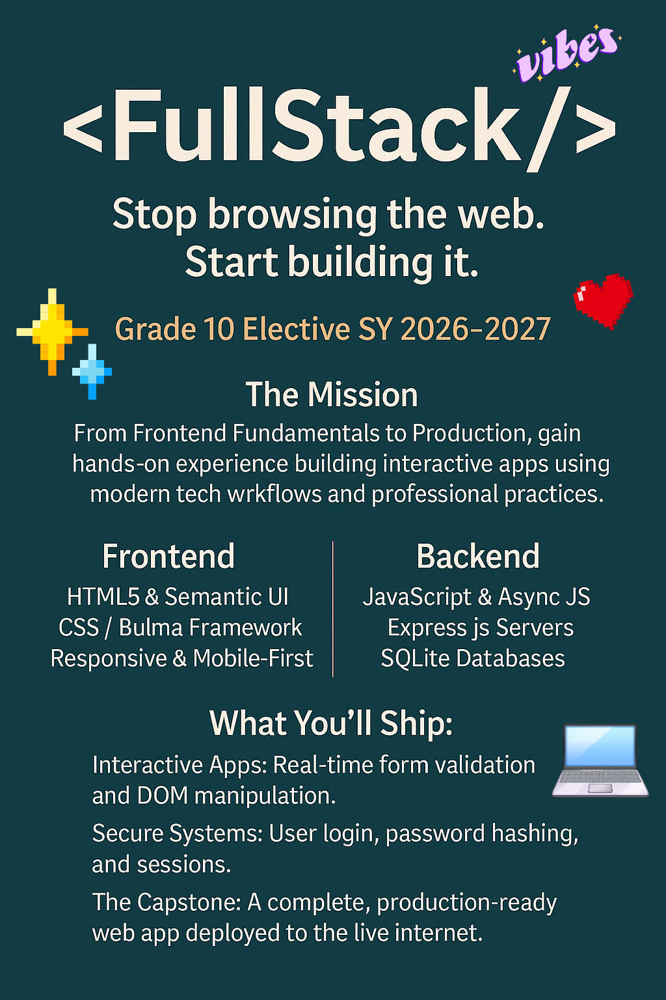
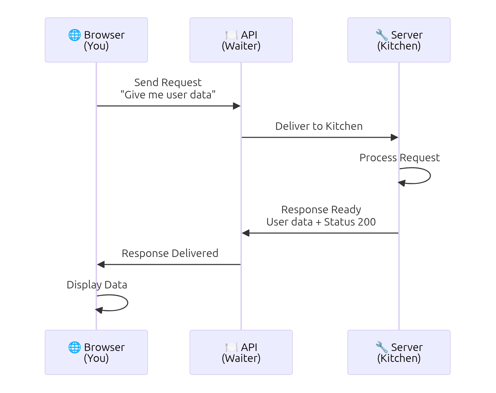
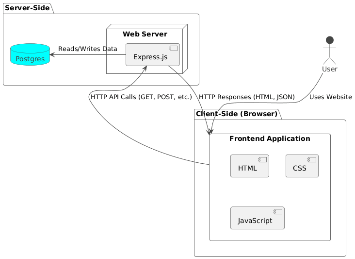
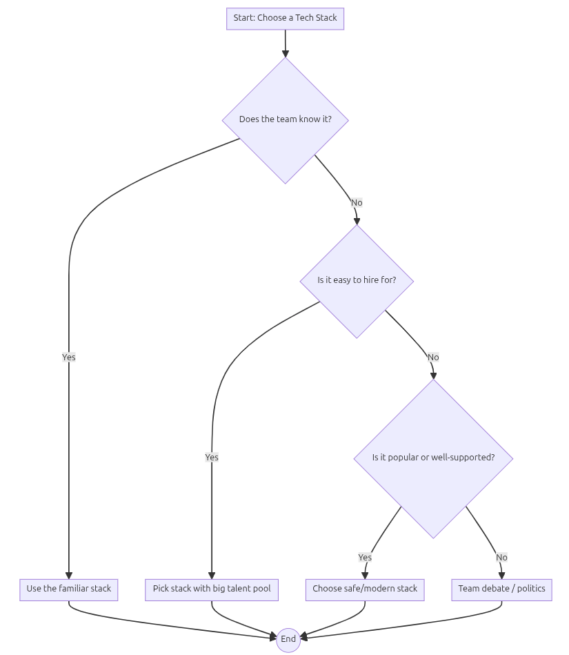

# Full Stack Web Development

> Roy Vincent L. Canseco, MSEE, PhD Cand. CS

# Full Stack Web Development Analogy

- **You** (browser) place an order
- **Waiter** (API) carries your request to the kitchen
- **Kitchen** (server) prepares the response
- **Waiter** (API) delivers it back to you

APIs are the invisible messengers that make websites work.

Here's that exchange as a sequence diagram:

# 🌐 What is Full Stack Development?

### 🚀 The Big Idea

Full Stack Development means **building both the “front” and the “back” of a website or app**. 

### 🖥️ Frontend (What users see)

-   **HTML5** → the structure (like the walls of a house)
    
-   **CSS / Bulma Framework** → the style (colors, layouts, decorations)
    
-   **Responsive Design** → makes sites look good on phones, tablets, and computers
    

👉 Example: Buttons, menus, forms, and the overall look of a webpage.

### ⚙️ Backend (What happens behind the scenes)

-   **JavaScript & Async JS** → the brain that makes things interactive
    
-   **Express.js Servers** → the messenger that handles requests and responses
    
-   **SQLite Databases** → the memory that stores user info, posts, and data
    

👉 Example: Logging in, saving your profile, or posting a comment.

#### Full Stack Architecture

Here is a diagram illustrating how the frontend and backend components work together:

### 🛠️ What You’ll Build

-   **Interactive Apps** → forms that check your input instantly
    
-   **Secure Systems** → logins with password protection
    
-   **Capstone Project** → a complete web app deployed live on the internet
    

### 🎯 Why It Matters

-   Learn skills used by real developers worldwide
    
-   Build a portfolio project before senior high or college
    
-   Understand how the web works — not just how to browse it
    

### 📢 Call to Action

_“Stop browsing. Start building. Join the FullStack elective and ship your own app this year!”_

# the following slides from the article of

[Tombri Bowei](https://dev.to/_boweii)

[Tombri Bowei](https://dev.to/_boweii)

Posted on Jan 20

# Choosing a Stack Is a Social Decision, Not a Technical One

[#softwareengineering](https://dev.to/t/softwareengineering)[#career](https://dev.to/t/career)[#architecture](https://dev.to/t/architecture)[#productivity](https://dev.to/t/productivity)

Ask a group of developers why they chose a particular tech stack, and you’ll hear answers like:

-   “It scales better.”
-   “It’s faster.”
-   “It’s more modern.”
-   “It’s industry standard.”

But here’s the uncomfortable truth most people won’t say out loud:

Most tech stacks are not chosen because they’re technically superior.  
They’re chosen because of people.

And once you see this, you can’t unsee it.

* * *

## The Myth of the “Best Stack”

We like to believe software decisions are rational.

That if you compare performance benchmarks, ecosystem maturity, and scalability charts, one stack will clearly emerge as the best choice.

In reality, most modern stacks are good enough.

React, Vue, Angular.  
Spring, Node, Django.  
Postgres, MySQL, MongoDB.

At a certain point, the differences stop being decisive.

So why do teams still argue so passionately about stacks?

Because the decision isn’t really about code.

It’s about people, trust, incentives, and fear.

* * *

## Stack Choices Are About Who You Can Hire

One of the most influential — and least discussed — reasons stacks are chosen:

“Can we hire for this?”

Not:

-   “Is this the most elegant solution?”
-   “Is this the cleanest architecture?”

But:

-   Are there developers available?
-   Can new hires onboard quickly?
-   Will this scare candidates away?

A technically “better” stack that no one knows is often a business liability, not an advantage.

Teams don’t choose stacks that are optimal.  
They choose stacks that are survivable.

* * *

## Familiarity Beats Excellence Every Time

Here’s a hard truth:

Teams prefer stacks they understand over stacks that are better.

Why?

Because familiarity reduces:

-   Risk
-   Fear
-   Decision fatigue
-   Accountability

If something goes wrong with a familiar stack, everyone knows how to debug it.  
If something goes wrong with a “clever” stack, someone gets blamed.

So people default to what they’ve used before — not because it’s best, but because it’s defensible.

* * *

## Tech Stack Decisions Are Political (Yes, Political)

In many companies, stack choices are shaped by:

-   The loudest voice in the room
-   The most senior engineer
-   The architect’s past experience
-   A previous company’s success story Sometimes the stack is chosen simply because:

“This is what we used at my last job, and it worked.”

That’s not technical reasoning.  
That’s social proof.

And it’s incredibly powerful.

* * *

## “Modern” Often Means “Socially Accepted”

Notice how stacks suddenly become “modern” when:

-   Big companies adopt them
-   They're always mentioned by influencers
-   Job postings mention them

Modern doesn’t mean better.  
It often means safe to choose without explanation.

Choosing a popular stack protects decision-makers.

If it fails, they weren’t reckless — they followed the trend.

* * *

## The Hidden Question Behind Every Stack Choice

What folks really want to know is this:

Not:

-   “Is this the fastest?”
-   “Is this the cleanest?”

But:

-   Might someone point the finger at me?
-   Could this slow down recruitment?
-   Could this make starting take longer?
-   Could this complicate things for the team when upkeep rolls around? These are human concerns, not technical ones.

* * *

## This Is Why Stack Debates Never End

Ever noticed that stack debates rarely reach agreement?

That’s because you’re not debating code.  
You’re debating:

-   Identity
-   Experience
-   Ego
-   Risk tolerance

Two developers can look at the same problem and choose different stacks — both for valid social reasons.

And neither is “wrong”.

* * *

## Why This Matters (Especially for Developers)

Understanding this changes the way you think about:

-   Career growth
-   Learning priorities
-   Project decisions

It explains why:

-   “Worse” stacks survive
-   “Better” stacks die
-   Legacy systems persist
-   Simple tools dominate

It also explains why learning only the “best” technology isn’t enough.

What matters is:

-   Can teams work with it?
-   Can people maintain it?
-   Can the organization support it?

* * *

## The Real Skill Isn’t Choosing the Stack

The real skill is knowing when stack choice matters — and when it doesn’t.

Great engineers don’t obsess over tools.  
They think about:

-   Teams
-   Communication
-   Longevity
-   Change

They understand that software lives longer than trends — and people live longer than code.

* * *

## Final Thought

If you’re early in your career, this is freeing.

It means you don’t have to chase every “hot” technology.  
You don’t need the perfect stack.

You need to understand trade-offs, people, and context.

Because in the real world:

The best stack isn’t the one with the best benchmarks.  
It’s the one the team can actually build, maintain, and evolve together.

>

---

### Summary: The Social Factors of Stack Selection

This flowchart summarizes the key social and practical considerations that often drive technology stack choices in real-world projects, as discussed in the article.

