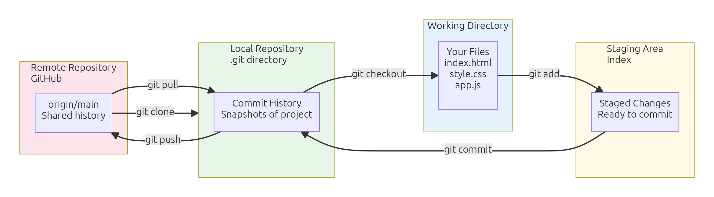
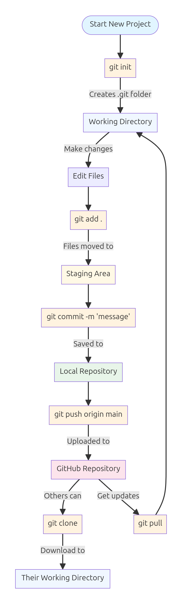
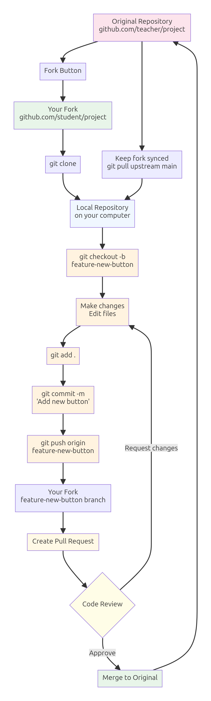
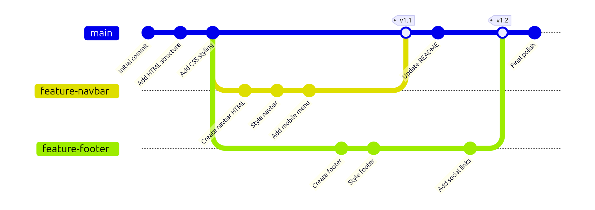
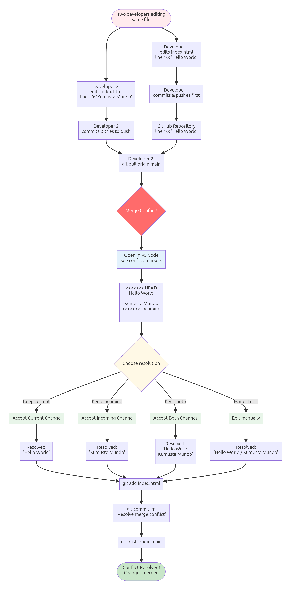
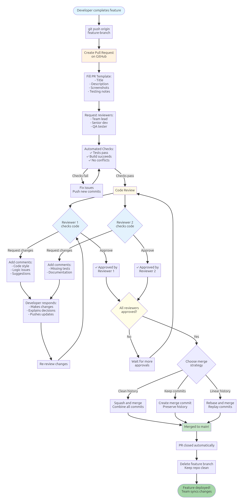
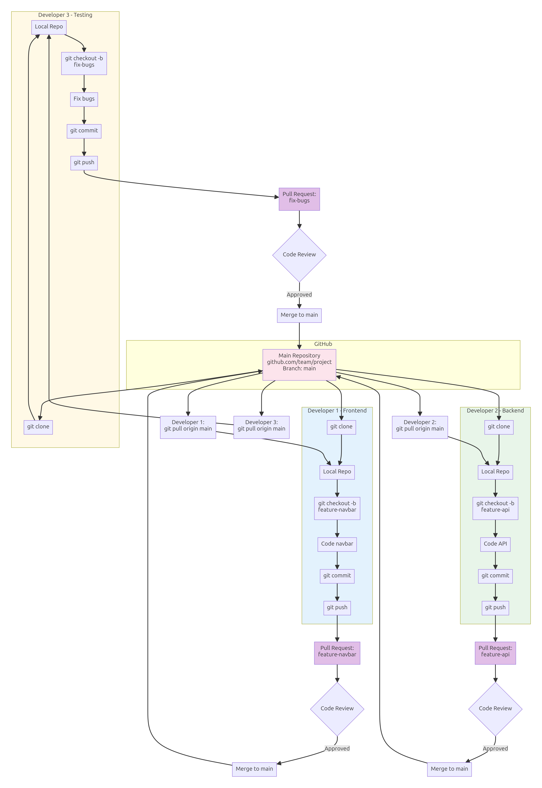

# Git & GitHub: Version Control and Collaboration

**Grade 10 - ICT**  
**Duration:** 2-3 weeks  
**Prerequisites:** Basic file/folder understanding, text editing, internet access

---

## 🎯 Learning Objectives

By the end of this lecture, you will be able to:

1. ✅ Understand why version control is essential for development
2. ✅ Use Git to track changes in your projects
3. ✅ Push code to GitHub for backup and sharing
4. ✅ Collaborate with classmates using branches and pull requests
5. ✅ Resolve merge conflicts confidently
6. ✅ Build a professional portfolio with GitHub
7. ✅ Contribute to existing projects (software maintenance)

---

## 📖 Table of Contents

1. [Why Version Control?](#section-1)
2. [Git Basics: Your Local Time Machine](#section-2)
3. [VSCode Git Integration](#section-3)
4. [GitHub Setup: Your Code in the Cloud](#section-4)
5. [Cloning and Pulling: Getting Code from Others](#section-5)
6. [Branches: Parallel Universes for Code](#section-6)
7. [Merge Conflicts: When Timelines Collide](#section-7)
8. [Pull Requests: Code Review Culture](#section-8)
9. [Software Maintenance: Contributing to Existing Projects](#section-9)
10. [.gitignore: What NOT to Track](#section-10)
11. [Portfolio Building: Your GitHub Profile](#section-11)
12. [When to Use Git/GitHub](#section-12)
13. [Mini-Projects](#mini-projects)
14. [Final Challenge](#final-challenge)
15. [Troubleshooting](#troubleshooting)
16. [What's Next?](#whats-next)

---

<a name="section-1"></a>
## 1. Why Version Control?

### **The Problem Without Version Control**

Imagine you're working on your sari-sari store inventory app:

```
my-project/
├── app.js
├── app-v2.js
├── app-final.js
├── app-final-REAL.js
├── app-final-FOR-REAL-THIS-TIME.js
└── app-backup-before-i-broke-everything.js
```

**Sound familiar?** 😅

**Problems:**
- ❌ Which version actually works?
- ❌ What changed between versions?
- ❌ Can't undo specific changes
- ❌ Collaboration nightmare (who changed what?)
- ❌ No backup if computer breaks

### **The Solution: Git + GitHub**

**Git** = Version control system (tracks changes on YOUR computer)  
**GitHub** = Cloud hosting for Git repositories (backup + collaboration)

**Think of Git like a time machine:**
- 📸 Take snapshots (commits) whenever you want
- ⏮️ Go back to any previous snapshot
- 🌳 Create alternate timelines (branches) to experiment
- 🔀 Merge timelines when experiments work

### **Real-World Scenario: Group Project**

**Without Git:**
```
Juan: "I'll email you my changes"
Maria: "Wait, I'm still working on the same file!"
Pedro: "My version has the new feature, yours has the bug fix"
Teacher: "Why is nothing working?"
```

**With Git + GitHub:**
```
Juan: Creates feature branch, commits changes, pushes to GitHub
Maria: Creates bug-fix branch, works separately
Pedro: Reviews both, merges them together
Teacher: "Wow, professional workflow!" ⭐
```

### **Philippine Context Examples**

**Scenario 1: Barangay Website**
- **Problem**: Barangay captain wants changes, but you need to keep old version as backup
- **Git Solution**: Commit current version, make changes, can always go back

**Scenario 2: School Project with Groupmates**
- **Problem**: 4 students editing same project, files keep getting overwritten
- **Git Solution**: Each student works on their branch, merge at the end

**Scenario 3: Freelance Work**
- **Problem**: Client wants to see progress, needs backup if laptop breaks
- **Git Solution**: Push to GitHub daily, client can see commits, work is safe

### **What You'll Learn**

This lecture covers:
- ✅ **Solo workflow**: Track your own projects
- ✅ **Team workflow**: Collaborate with others
- ✅ **Professional practices**: Branching, pull requests, code review
- ✅ **Portfolio building**: Showcase your work to employers

---

<a name="section-2"></a>
## 2. Git Basics: Your Local Time Machine

### **Core Concepts**

Git has three main "places" your code can be:

1. **Working Directory** = Your actual files (what you see in VSCode)
2. **Staging Area** = Changes marked to save (preparing for snapshot)
3. **Repository** = Saved snapshots (commit history)



**Workflow:**
```
Edit files → Add to staging → Commit to repository
(Working)  →  (git add)   →  (git commit)
```



### **Essential Git Commands**

#### **1. Initialize a Repository**

```bash
# Navigate to your project folder
cd my-project

# Initialize Git (creates hidden .git folder)
git init
```

**What happens:**
- Creates `.git/` folder (don't touch this!)
- Your folder is now a "repository"
- Git starts tracking this folder

#### **2. Check Status**

```bash
git status
```

**Shows:**
- Which files changed
- Which changes are staged
- Which files are untracked

**Example output:**
```
On branch main
Untracked files:
  app.js
  style.css

nothing added to commit
```

#### **3. Add Files to Staging**

```bash
# Add specific file
git add app.js

# Add all files in current folder
git add .

# Add specific file type
git add *.js
```

**Staging = "Mark these changes to save"**

#### **4. Commit (Save Snapshot)**

```bash
git commit -m "Add login feature"
```

**Commit message rules:**
- ✅ Brief but descriptive
- ✅ Present tense ("Add", not "Added")
- ✅ Explain WHAT, not HOW

**Good messages:**
```bash
git commit -m "Add product search functionality"
git commit -m "Fix total calculation bug"
git commit -m "Update README with setup instructions"
```

**Bad messages:**
```bash
git commit -m "changes"           # ❌ Too vague
git commit -m "asdfasdf"          # ❌ Meaningless
git commit -m "I FINALLY FIXED THE BUG AFTER 3 HOURS" # ❌ Unprofessional
```

#### **5. View Commit History**

```bash
git log
```

**Shows:**
- All commits (newest first)
- Author, date, message
- Commit hash (unique ID)

**Short version:**
```bash
git log --oneline
```

### **The Basic Git Workflow**

**Step-by-Step:**

```bash
# 1. Make changes to files in VSCode
# (edit app.js, add feature)

# 2. Check what changed
git status

# 3. Stage the changes
git add app.js

# 4. Commit with message
git commit -m "Add product filter feature"

# 5. Verify it saved
git log --oneline
```

### **Philippine Example: Sari-Sari Store App**

**Day 1: Initial version**
```bash
git init
git add .
git commit -m "Initial sari-sari store app with product list"
```

**Day 2: Add search**
```bash
# Edit app.js to add search functionality
git add app.js
git commit -m "Add product search feature"
```

**Day 3: Add categories**
```bash
# Edit app.js to add category filter
git add app.js
git commit -m "Add category filter (drinks, snacks, toiletries)"
```

**Day 4: Oops, broke something!**
```bash
# No problem! Go back to yesterday
git log --oneline  # Find yesterday's commit
git checkout abc123  # Use that commit's hash
# Your code is back to yesterday's working version!
```

### **Visual Analogy: Git as Checkpoint System**

**Like video game saves:**
- 🎮 Level 1 complete → Save (commit)
- 🎮 Level 2 complete → Save (commit)
- 🎮 Died in Level 3? → Load previous save (checkout)
- 🎮 Try different strategy → Save in different slot (branch)

### **Common Beginner Mistakes**

❌ **Forgetting to commit**
```bash
# Work for 3 hours, change 10 files...
# Computer crashes → Lost everything!
```
✅ **Commit often** (every feature, every fix)

❌ **Bad commit messages**
```bash
git commit -m "stuff"  # ❌ Future you won't understand
```
✅ **Descriptive messages**
```bash
git commit -m "Add quantity input validation"  # ✅ Clear!
```

❌ **Committing everything blindly**
```bash
git add .
git commit -m "update"
# Accidentally committed sensitive files (passwords, .env)
```
✅ **Review what you're committing**
```bash
git status  # Check first!
git add specific-files.js  # Be selective
```

**🎯 Try It:** Initialize Your First Repository

**Steps:**
1. Create a new folder: `my-first-repo`
2. Inside, create `index.html` with basic HTML
3. Open terminal in that folder
4. Run these commands:
   ```bash
   git init
   git status
   git add index.html
   git commit -m "Initial commit with index.html"
   git log
   ```
5. Verify you see your commit!

---

<a name="section-3"></a>
## 3. VSCode Git Integration: Point-and-Click Workflow

### **Why Use VSCode for Git?**

**Command line is powerful, but VSCode makes it visual:**
- ✅ See changes side-by-side (before/after)
- ✅ Stage files with checkboxes
- ✅ Write commit messages in text box
- ✅ Visual branch switcher
- ✅ Built-in merge conflict resolver

**You can do EVERYTHING without typing git commands!**

### **VSCode Source Control Panel**

**Location:** Click the branch icon in left sidebar (or `Ctrl+Shift+G`)

**The Panel Shows:**
1. **Changes** = Modified files (unstaged)
2. **Staged Changes** = Ready to commit
3. **Commit message box** = Type your message here
4. **Commit button** = Save snapshot
5. **More actions menu** = Pull, push, branch, etc.

### **Visual Walkthrough**

#### **1. Initialize Repository (VSCode)**

**Steps:**
1. Open folder in VSCode
2. Click Source Control icon (left sidebar)
3. Click "Initialize Repository" button
4. Done! (Same as `git init`)

#### **2. Stage and Commit (VSCode)**

**Steps:**
1. Edit a file (e.g., `app.js`)
2. Source Control panel shows "M app.js" (M = Modified)
3. Hover over file → Click **+** icon (stages file)
4. File moves to "Staged Changes" section
5. Type commit message in text box
6. Click **✓ Commit** button
7. Done! Snapshot saved

**Visual Changes Indicator:**
- **M** = Modified (file changed)
- **U** = Untracked (new file, not in repo yet)
- **D** = Deleted (file removed)
- **C** = Conflict (merge conflict, need to resolve)

#### **3. View File Differences**

**Steps:**
1. Click on a modified file in Source Control panel
2. VSCode shows **diff view**:
   - Left side = Old version
   - Right side = New version
   - Red = Deleted lines
   - Green = Added lines
3. Review changes before staging!

### **The VSCode Git Workflow**

**Typical daily workflow:**

```
1. Open project in VSCode
2. Make changes to files
3. Source Control panel lights up (shows changes)
4. Review changes (click files to see diff)
5. Stage files (click + icon)
6. Write commit message
7. Click Commit button
8. Repeat!
```

### **Keyboard Shortcuts**

| Action | Windows/Linux | Mac |
|--------|---------------|-----|
| Open Source Control | `Ctrl+Shift+G` | `Cmd+Shift+G` |
| Commit | `Ctrl+Enter` | `Cmd+Enter` |
| View changes | Click file | Click file |
| Stage all | `Ctrl+Shift+A` | `Cmd+Shift+A` |

### **Pro Tips**

**Tip 1: Commit Message in Editor**
- If message is long, click "..." menu → "Commit" → Opens full editor

**Tip 2: Undo Last Commit**
- Click "..." menu → "Commit" → "Undo Last Commit"
- Changes return to unstaged (commit is erased)

**Tip 3: View Full History**
- Click "..." menu → "View History" (shows all commits)
- Or install "Git Graph" extension (visual timeline)

**Tip 4: Stage Partial Changes**
- Right-click changed lines → "Stage Selected Ranges"
- Commit only some changes in a file!

### **Philippine Example: Barangay Directory App**

**Scenario:** Building barangay officials directory

**VSCode workflow:**

**Day 1:**
```
1. Create project folder, open in VSCode
2. Source Control → Initialize Repository
3. Add index.html, app.js
4. Stage both files (click +)
5. Message: "Initial barangay directory structure"
6. Commit ✓
```

**Day 2:**
```
1. Edit app.js (add search feature)
2. Source Control shows "M app.js"
3. Click app.js → Review changes in diff view
4. Looks good! Stage it (+)
5. Message: "Add search by name functionality"
6. Commit ✓
```

**Day 3:**
```
1. Edit app.js (add filter by position)
2. Edit style.css (improve button styles)
3. Source Control shows both files
4. Review both diffs
5. Stage both (+)
6. Message: "Add position filter and improve button styles"
7. Commit ✓
```

**Day 4:**
```
1. Realize search has bug
2. Click "..." → View History
3. Find "Add search by name functionality" commit
4. Right-click → "Checkout"
5. Code goes back to that version
6. Fix the bug
7. Stage, commit: "Fix search case sensitivity bug"
```

### **Command Line vs VSCode**

**Both are valid! Use what's comfortable:**

| Task | Command Line | VSCode |
|------|-------------|--------|
| Init repo | `git init` | Click "Initialize Repository" |
| Stage file | `git add file.js` | Click + icon |
| Commit | `git commit -m "msg"` | Type message, click Commit |
| View history | `git log` | "..." → View History |
| See changes | `git diff` | Click file (auto-shows diff) |

**Pro developers use both:**
- VSCode for visual tasks (reviewing changes, staging)
- Terminal for advanced tasks (rebasing, cherry-picking)

**🎯 Try It:** VSCode Git Workflow

**Steps:**
1. Open your `my-first-repo` folder in VSCode
2. Edit `index.html` (add a paragraph)
3. Open Source Control panel (`Ctrl+Shift+G`)
4. See the M indicator on index.html
5. Click index.html to view diff (old vs new)
6. Click + icon to stage
7. Type message: "Add welcome paragraph"
8. Click Commit ✓
9. Verify in Source Control timeline!

---

<a name="section-4"></a>
## 4. GitHub Setup: Your Code in the Cloud

### **What is GitHub?**

**Git** = Version control on YOUR computer (local)  
**GitHub** = Cloud storage for Git repositories (remote)

**Think of it like:**
- Git = Saving your document on your laptop
- GitHub = Uploading to Google Drive for backup/sharing

**GitHub gives you:**
- ☁️ Cloud backup (safe if computer breaks)
- 🤝 Collaboration (multiple people, same project)
- 🌐 Sharing (public or private repositories)
- 💼 Portfolio (showcase your work to employers)
- 📝 Documentation (README, wikis)

### **Creating a GitHub Account**

**Steps:**
1. Go to [github.com](https://github.com)
2. Click "Sign up"
3. Choose username (pick wisely! Employers will see this)
   - ✅ Good: `juandelacruz`, `mariatech`, `pedrocodes`
   - ❌ Bad: `xxcoolboixx`, `hacker123`, `ilovejollibee69`
4. Enter email (use school email if available)
5. Create strong password
6. Verify email
7. Done! You have a GitHub account

**Free Account Includes:**
- Unlimited public repositories
- Unlimited private repositories
- Collaboration features
- GitHub Pages (free web hosting!)

### **Creating Your First Repository on GitHub**

**Method 1: Start on GitHub (Recommended for beginners)**

**Steps:**
1. Log in to GitHub
2. Click green "New" button (top right)
3. Fill in repository details:
   - **Name**: `my-first-repo` (lowercase, hyphens, no spaces)
   - **Description**: "My first GitHub repository"
   - **Public/Private**: Public (for learning)
   - **Add README**: ✓ Check this (creates initial file)
   - **Add .gitignore**: None (for now)
   - **License**: None (for now)
4. Click "Create repository"
5. Done! Repository exists on GitHub

### **Connecting Local Git to GitHub**

**Now connect YOUR computer's repo to GitHub's repo:**

**If you already have local repo (from Section 2):**

```bash
# 1. Tell Git where GitHub repo is
git remote add origin https://github.com/YOUR-USERNAME/my-first-repo.git

# 2. Check it worked
git remote -v

# 3. Push your commits to GitHub
git push -u origin main
```

**What just happened:**
- `remote add origin` = "Save this GitHub URL as 'origin'"
- `origin` = Default name for GitHub repo
- `push` = "Upload my commits to GitHub"
- `-u origin main` = "Set up tracking for main branch"

### **VSCode Method: Push to GitHub**

**Even easier in VSCode!**

**Steps:**
1. Open Source Control panel
2. Click "..." menu
3. Click "Push to..."
4. Select "Publish to GitHub"
5. Choose repository name
6. Choose Public/Private
7. VSCode handles everything! (Creates repo, pushes code)

**Status bar shows:**
- ☁️ Sync icon = Changes ready to push
- ✓ No icon = Everything synced

### **The Push/Pull Workflow**

**Key commands:**

#### **Push = Upload YOUR changes to GitHub**
```bash
git push
```

**When to push:**
- ✅ After every commit (or group of commits)
- ✅ End of day (backup your work!)
- ✅ Before collaborating (so others see your changes)

#### **Pull = Download OTHERS' changes from GitHub**
```bash
git pull
```

**When to pull:**
- ✅ Start of day (get team's updates)
- ✅ Before starting new feature (stay in sync)
- ✅ When GitHub shows "behind commits"

### **Visual Workflow**

```
YOUR COMPUTER                    GITHUB (Cloud)
┌──────────────┐                ┌──────────────┐
│  Local Repo  │                │  Remote Repo │
│              │                │              │
│  commit 1    │                │  commit 1    │
│  commit 2    │   git push →   │  commit 2    │
│  commit 3    │                │  commit 3    │
│              │   ← git pull   │              │
└──────────────┘                └──────────────┘
```

### **Authentication: HTTPS vs SSH**

**GitHub needs to verify it's really you:**

**Option 1: HTTPS (Easier, recommended for beginners)**
- Use GitHub username + password (or token)
- VSCode can save credentials
- Works everywhere

**Option 2: SSH (More secure, for advanced users)**
- Generate SSH key pair
- Add public key to GitHub
- No password needed after setup

**For this course, use HTTPS.** VSCode will prompt for credentials.

### **Personal Access Token (2021+ Required)**

**GitHub no longer accepts passwords for git operations!**

**Create a token:**
1. GitHub → Settings (your profile)
2. Developer settings → Personal access tokens
3. Generate new token (classic)
4. Give it a name: "VSCode Git"
5. Select scopes: `repo` (full control of private repos)
6. Generate token
7. **COPY IT NOW** (you won't see it again!)
8. Use this instead of password when VSCode asks

**Save token in VSCode:**
- First `git push` will prompt
- Enter username + token (not password)
- VSCode saves it securely

### **Philippine Example: Sari-Sari Store App**

**Scenario:** You built the app locally, now share on GitHub

**Steps:**

**1. Create GitHub repo:**
```
GitHub.com → New repository
Name: sari-sari-store-app
Description: Inventory management for Philippine sari-sari stores
Public
Add README ✓
Create
```

**2. Connect local repo:**
```bash
cd sari-sari-store-app
git remote add origin https://github.com/juandelacruz/sari-sari-store-app.git
git push -u origin main
```

**3. Verify on GitHub:**
- Refresh GitHub page
- See all your files uploaded!
- README shows at bottom
- Commit history visible

**4. Daily workflow:**
```bash
# Morning: Get any changes (if collaborating)
git pull

# Work on features, make commits
git add .
git commit -m "Add receipt printing feature"

# Evening: Backup to GitHub
git push
```

### **Benefits of Using GitHub**

**1. Backup**
- Computer breaks? Code is safe on GitHub
- Accidental deletion? Download from GitHub

**2. Collaboration**
- Groupmates clone your repo
- Everyone works together
- Merge changes easily

**3. Portfolio**
- Employers check GitHub profiles
- Shows you can code
- Shows you collaborate

**4. Open Source**
- Contribute to real projects
- Learn from others' code
- Build reputation

### **Common GitHub Terms**

| Term | Meaning |
|------|---------|
| Repository (repo) | A project (folder with .git) |
| Clone | Download repo to your computer |
| Fork | Copy someone's repo to your account |
| Pull Request (PR) | "Please review and merge my changes" |
| Issue | Bug report or feature request |
| Star | Bookmark/like a repository |
| Watch | Get notifications about repo updates |

**🎯 Try It:** Push to GitHub

**Steps:**
1. Create GitHub account (if you don't have one)
2. Create new repository on GitHub: "test-repo"
3. In VSCode, open your local repo
4. Source Control → "..." menu → "Add Remote"
5. Paste your GitHub repo URL
6. Click sync/push icon
7. Enter credentials (username + token)
8. Refresh GitHub page → See your files uploaded!
9. Make another change locally
10. Commit and push again
11. Refresh GitHub → See new commit!

---

**✅ Session 1 Complete!**

You've learned:
- ✓ Why version control matters
- ✓ Basic Git commands (init, add, commit, log)
- ✓ VSCode Git workflow (visual interface)
- ✓ GitHub setup and push/pull

**Next:** Section 5-8 (Cloning, Branches, Conflicts, Pull Requests)

---

<a name="section-5"></a>
## 5. Cloning and Pulling: Getting Code from Others

### **What is Cloning?**

**Clone** = Download a complete copy of someone's repository to your computer

**Think of it like:**
- Downloading a ZIP file... but with full history + Git powers!
- You get ALL commits, ALL branches, ALL files
- Connected to original GitHub repo (can pull updates)



### **When Do You Clone?**

**Common scenarios:**
1. **Group project** → Clone your team's shared repository
2. **Open source** → Clone a library you want to use/contribute to
3. **Learning** → Clone example projects to study
4. **Your own projects** → Clone to a different computer (home + school)

### **How to Clone a Repository**

#### **Method 1: Command Line**

```bash
# 1. Get the repository URL from GitHub
# (Click green "Code" button → copy HTTPS URL)

# 2. Navigate where you want the folder
cd ~/Documents/projects

# 3. Clone it
git clone https://github.com/username/repo-name.git

# 4. Enter the new folder
cd repo-name

# 5. Start coding!
```

**What happens:**
- Creates folder with repo name
- Downloads all files and commit history
- Sets up `origin` remote automatically
- Checks out main branch

#### **Method 2: VSCode (Easier!)**

**Steps:**
1. `Ctrl+Shift+P` (Command Palette)
2. Type "Git: Clone"
3. Paste GitHub repo URL
4. Choose where to save it
5. VSCode opens the cloned folder
6. Done!

#### **Method 3: GitHub Desktop (Easiest!)**

**Steps:**
1. Open GitHub Desktop app
2. File → Clone Repository
3. Choose from your repos or paste URL
4. Select local path
5. Click Clone
6. Done!

### **Clone vs Download ZIP**

**Why clone instead of downloading ZIP?**

| Feature | Clone | Download ZIP |
|---------|-------|--------------|
| Get files | ✅ | ✅ |
| Commit history | ✅ | ❌ |
| Can push changes | ✅ | ❌ |
| Pull updates | ✅ | ❌ |
| Branches | ✅ | ❌ |
| Connected to GitHub | ✅ | ❌ |

**Use clone if you plan to:**
- Contribute changes back
- Stay updated with new commits
- Work with branches

**Use ZIP if you just want:**
- Quick look at code
- One-time copy
- No Git needed

### **Pulling Updates**

**Your classmate pushed new commits. How do you get them?**

```bash
# Pull = Fetch + Merge (get changes and apply them)
git pull
```

**VSCode method:**
- Click sync icon (circular arrows) in status bar
- Or Source Control → "..." menu → "Pull"

**What pull does:**
1. Downloads new commits from GitHub
2. Merges them into your current branch
3. Updates your files

### **Pull Before You Push**

**IMPORTANT WORKFLOW:**

```bash
# ❌ WRONG
# (You work, commit, push)
git commit -m "Add feature"
git push
# ERROR: GitHub has commits you don't have!

# ✅ RIGHT
# (Always pull first)
git pull                         # Get latest changes
git commit -m "Add feature"      # Then commit your work
git push                         # Then push
```

**Why?**
- Your teammate pushed changes while you worked
- GitHub is now "ahead" of you
- Pull first to sync up
- Then push your changes

### **The Pull-Work-Push Cycle**

**Daily workflow:**

```
Morning:
1. git pull  (get overnight changes)
2. Work on your feature
3. git add + commit
4. git pull  (get any new changes)
5. git push  (upload your work)

Afternoon:
6. git pull  (get morning changes from team)
7. Work more
8. git add + commit
9. git pull  (sync again)
10. git push

End of day:
11. git pull
12. git push  (make sure everything is backed up)
```

### **Philippine Example: Group Barangay Website**

**Scenario:** 4 students building barangay website together

**Setup:**
```
Juan creates repo on GitHub: barangay-website
Juan adds groupmates as collaborators:
  Settings → Collaborators → Add Maria, Pedro, Ana
```

**Each teammate:**
```bash
# 1. Clone the project
git clone https://github.com/juan/barangay-website.git
cd barangay-website

# 2. Pull first (good habit)
git pull

# 3. Work on assigned part
# Maria: officials page
# Pedro: announcements section
# Ana: contact form

# 4. Commit and push
git add officials.html
git commit -m "Add barangay officials page"
git pull  # Get others' changes first!
git push  # Upload mine
```

**Next day:**
```bash
# Everyone pulls to get yesterday's work
git pull

# Continue working...
```

### **Understanding Origin and Remote**

**When you clone, Git remembers where it came from:**

```bash
# See your remotes
git remote -v

# Output:
# origin  https://github.com/juan/barangay-website.git (fetch)
# origin  https://github.com/juan/barangay-website.git (push)
```

**Terms:**
- **Remote** = A GitHub repository connected to your local repo
- **Origin** = Default name for the GitHub repo you cloned from
- **Fetch** = Download commits (but don't merge yet)
- **Push** = Upload your commits
- **Pull** = Fetch + Merge (download and apply)

### **Fetch vs Pull**

**Fetch = "Download but don't merge"**
```bash
git fetch
# Downloads new commits
# Doesn't change your files yet
# Safe to run anytime
```

**Pull = "Download and merge"**
```bash
git pull
# = git fetch + git merge
# Downloads AND applies changes
# Changes your files immediately
```

**When to use each:**
- **Pull**: Normal workflow (want changes now)
- **Fetch**: Checking what's new before merging

### **Handling Pull Conflicts**

**Sometimes pull causes conflicts:**

```bash
git pull

# Auto-merging app.js
# CONFLICT (content): Merge conflict in app.js
# Automatic merge failed; fix conflicts and then commit.
```

**Don't panic!** We'll cover conflict resolution in Section 7.

**For now, remember:**
- Conflicts happen when same lines changed differently
- Git marks conflicts in files
- You choose which version to keep
- Commit after resolving

### **Common Pull Errors**

**Error 1: Uncommitted changes**
```bash
git pull
# error: Your local changes would be overwritten by merge.
# Please commit your changes or stash them.
```

**Solution:**
```bash
# Option A: Commit your changes first
git add .
git commit -m "Work in progress"
git pull

# Option B: Stash (temporary save)
git stash        # Save changes temporarily
git pull         # Get updates
git stash pop    # Restore your changes
```

**Error 2: Merge conflict**
```bash
git pull
# CONFLICT in file.js
```

**Solution:** Resolve conflict (Section 7), then commit

### **Collaborator Permissions**

**On GitHub, repository has access levels:**

| Level | Can Do |
|-------|--------|
| Public | Anyone can view, clone |
| Collaborator | Can push changes |
| Organization | Team permissions |
| Fork + PR | Safe contribution (no direct push) |

**Add collaborators:**
1. GitHub repo → Settings
2. Collaborators
3. Add people (need their GitHub username)
4. They get email invite
5. They accept
6. Now they can push!

**🎯 Try It:** Clone and Pull Practice

**Solo practice:**
1. Use your test-repo from Section 4
2. Clone it to a different folder (simulate different computer)
   ```bash
   git clone https://github.com/yourusername/test-repo.git test-repo-clone
   ```
3. In ORIGINAL folder, make changes and push
4. In CLONED folder, run `git pull`
5. See changes appear!

**Group practice (if available):**
1. Partner with a classmate
2. Add each other as collaborators
3. Clone each other's repos
4. Make changes, push
5. Pull to get each other's changes

---

<a name="section-6"></a>
## 6. Branches: Parallel Universes for Code

### **What are Branches?**

**Branch** = Separate timeline for development

**Think of it like:**
- Main branch = Published book
- Feature branch = Rough draft chapter
- You write the draft separately
- When it's good, merge it into the book

**Or like parallel universes:**
- Main branch = Normal timeline
- Feature branch = "What if?" experiment
- Try risky changes safely
- If it works, merge back to main
- If it fails, delete branch (no harm done!)



### **Why Use Branches?**

**Without branches:**
```
Everyone works on main branch
One person's broken code affects everyone
Can't experiment safely
Hard to work in parallel
```

**With branches:**
```
Each feature gets its own branch
Work independently without conflicts
Merge only when feature is done
Main branch stays stable
```

**Real-world scenarios:**

**Scenario 1: New Feature**
```
main branch    ─────────────┬─────────
                            │
feature branch              └─→ Add search feature
                            
After testing:
main branch    ─────────────┴─────────
                            ↑
                         (merge)
```

**Scenario 2: Bug Fix**
```
main branch    ─────────────┬─────────
                            │
bugfix branch               └─→ Fix calculation error

After fix verified:
main branch    ─────────────┴─────────
                            ↑
                         (merge)
```

### **Branch Basics**

#### **Create a Branch**

```bash
# Create new branch
git branch feature-search

# Create and switch to it (shortcut)
git checkout -b feature-search

# Modern syntax (Git 2.23+)
git switch -c feature-search
```

#### **List Branches**

```bash
# List all branches
git branch

# Output:
#   main
# * feature-search  (← * means current branch)
```

#### **Switch Branches**

```bash
# Old syntax
git checkout main

# New syntax (recommended)
git switch main
```

#### **Delete a Branch**

```bash
# Delete local branch (after merging)
git branch -d feature-search

# Force delete (even if not merged)
git branch -D feature-search
```

### **VSCode Branch Management**

**Much easier visually!**

#### **Create Branch (VSCode)**
1. Click branch name in status bar (bottom left)
2. Click "Create new branch"
3. Type branch name: `feature-search`
4. Press Enter
5. VSCode switches to new branch automatically

#### **Switch Branch (VSCode)**
1. Click branch name in status bar
2. Select branch from list
3. Files change to that branch's version!

#### **Visual Indicator**
- Status bar shows current branch name
- Source Control shows branch in title

### **Branch Naming Conventions**

**Good branch names:**
```bash
feature-user-login
bugfix-calculation-error
hotfix-security-patch
docs-update-readme
experiment-new-ui
```

**Bad branch names:**
```bash
test             # ❌ Too vague
juan             # ❌ Not descriptive
asdf             # ❌ Meaningless
my-branch-12345  # ❌ No context
```

**Common prefixes:**
- `feature-` = New functionality
- `bugfix-` = Fixing a bug
- `hotfix-` = Urgent production fix
- `docs-` = Documentation only
- `refactor-` = Code improvement (no new features)
- `experiment-` = Trying something (might delete)

### **Branch Workflow**

**Typical feature development:**

```bash
# 1. Start from main
git switch main
git pull  # Make sure you're up to date

# 2. Create feature branch
git switch -c feature-product-search

# 3. Work on the feature
# Edit files...
git add .
git commit -m "Add search input UI"

# More work...
git add .
git commit -m "Add search logic"

# More work...
git add .
git commit -m "Add search results display"

# 4. Feature done! Switch back to main
git switch main

# 5. Merge feature into main
git merge feature-product-search

# 6. Delete feature branch (no longer needed)
git branch -d feature-product-search

# 7. Push to GitHub
git push
```

### **Visualizing Branches**

**Before branching:**
```
main: A → B → C
            ↑
        (you are here)
```

**Create branch and work:**
```
main:    A → B → C
                  ↘
feature:           D → E → F
                        ↑
                  (you are here)
```

**Merge back to main:**
```
main:    A → B → C ───────→ G (merge commit)
                  ↘       ↗
feature:           D → E → F
```

**After deleting branch:**
```
main:    A → B → C → D → E → F → G
                              ↑
                        (you are here)
```

### **Philippine Example: Sari-Sari Store Features**

**Main branch** = Working store app (always functional)

**Feature branches:**

**Juan: Add QR code payment**
```bash
git switch -c feature-qr-payment
# Work on QR feature...
# Test it thoroughly
# When done, merge to main
```

**Maria: Add inventory alerts**
```bash
git switch -c feature-low-stock-alerts
# Work on alerts...
# Test it
# Merge to main when ready
```

**Pedro: Fix price calculation bug**
```bash
git switch -c bugfix-price-calculation
# Fix the bug
# Test fix
# Merge immediately (bug fixes are urgent!)
```

**Benefits:**
- Everyone works independently
- Main branch keeps working while features develop
- Can test features thoroughly before merging
- If QR feature fails, delete branch (no harm to main)

### **Remote Branches**

**Push your branch to GitHub:**

```bash
# First time pushing a new branch
git push -u origin feature-search

# After that, just:
git push
```

**Why push branches to GitHub?**
- Backup your work
- Let teammates see your progress
- Enable pull requests (Section 8)
- Collaborate on same feature

**See all branches (local + remote):**
```bash
git branch -a

# Output:
#   main
# * feature-search
#   remotes/origin/main
#   remotes/origin/feature-search
```

### **Pulling Remote Branches**

**Your teammate pushed a branch. How do you get it?**

```bash
# 1. Fetch all branches
git fetch

# 2. See what's available
git branch -a

# 3. Switch to remote branch
git switch feature-from-teammate

# Git automatically creates local tracking branch!
```

### **Branch Protection (GitHub)**

**Protect main branch from accidental changes:**

**GitHub settings:**
1. Repo → Settings → Branches
2. Add rule for `main`
3. Options:
   - ✓ Require pull request reviews
   - ✓ Require status checks to pass
   - ✓ Require branches to be up to date
   - ✓ No direct pushes to main

**Result:**
- Can't push directly to main
- Must use pull requests (Section 8)
- Forces code review
- Keeps main stable

**🎯 Try It:** Branch Workflow Practice

**Steps:**
1. In your test-repo, ensure you're on main:
   ```bash
   git switch main
   ```
2. Create and switch to new branch:
   ```bash
   git switch -c feature-test
   ```
3. Make changes to a file
4. Commit on feature branch:
   ```bash
   git add .
   git commit -m "Test feature"
   ```
5. Switch back to main:
   ```bash
   git switch main
   ```
6. Notice your changes disappeared! (They're in feature branch)
7. Switch back to feature branch:
   ```bash
   git switch feature-test
   ```
8. Changes are back!
9. Merge into main:
   ```bash
   git switch main
   git merge feature-test
   ```
10. Delete feature branch:
    ```bash
    git branch -d feature-test
    ```

---

<a name="section-7"></a>
## 7. Merge Conflicts: When Timelines Collide



### **What is a Merge Conflict?**

**Merge conflict** = Git can't automatically combine changes because two people edited the same lines differently

**Think of it like:**
- Two editors correcting the same sentence differently
- Both changes are valid
- Human must decide which version to keep (or combine both)

### **When Do Conflicts Happen?**

**Scenario 1: Same line, different changes**
```
Juan's version:  const price = product.price * 1.12; // with VAT
Maria's version: const price = product.price * 1.00; // no tax

Git: "Which one should I keep? 🤷"
```

**Scenario 2: One person edits, one deletes**
```
Juan: Edits line 50
Maria: Deletes line 50

Git: "Should this line exist or not? 🤷"
```

**Scenarios that DON'T conflict:**
```
Juan: Edits index.html
Maria: Edits style.css
→ No conflict (different files)

Juan: Edits line 10 in app.js
Maria: Edits line 50 in app.js
→ No conflict (different lines in same file)
```

### **How Conflicts Look**

**When you try to merge or pull:**
```bash
git merge feature-branch

# Auto-merging app.js
# CONFLICT (content): Merge conflict in app.js
# Automatic merge failed; fix conflicts and then commit the result.
```

**Inside the file (app.js):**
```javascript
function calculateTotal(price) {
<<<<<<< HEAD
  // Main branch version
  return price * 1.12; // with VAT
=======
  // Feature branch version
  return price * 1.00; // no tax yet
>>>>>>> feature-branch
}
```

**The markers:**
- `<<<<<<< HEAD` = Start of YOUR version (current branch)
- `=======` = Divider between versions
- `>>>>>>> feature-branch` = End of THEIR version (merging branch)

### **Resolving Conflicts Manually**

**Step-by-step:**

```bash
# 1. Git tells you there's a conflict
git merge feature-branch
# CONFLICT in app.js

# 2. Check which files have conflicts
git status
# both modified: app.js

# 3. Open app.js in editor
# See the conflict markers

# 4. DECIDE what to keep:

# Option A: Keep your version
return price * 1.12; // with VAT

# Option B: Keep their version
return price * 1.00; // no tax yet

# Option C: Keep both (combine)
const vat = 1.12;
return price * vat; // configurable tax

# 5. REMOVE the conflict markers completely
# Delete <<<<<<< HEAD
# Delete =======
# Delete >>>>>>> feature-branch

# 6. Save file

# 7. Mark as resolved
git add app.js

# 8. Complete the merge
git commit -m "Merge feature-branch, resolve price calculation conflict"

# 9. Done! Conflict resolved
```

### **Resolving Conflicts in VSCode**

**Much easier with visual tools!**

**When conflict occurs:**

1. VSCode highlights conflicts in editor
2. Shows 4 options above conflict:
   - **Accept Current Change** (keep your version)
   - **Accept Incoming Change** (keep their version)
   - **Accept Both Changes** (keep both)
   - **Compare Changes** (see side-by-side)

3. Click the option you want
4. VSCode removes conflict markers automatically
5. Save file
6. Stage the file (Source Control → + icon)
7. Commit to complete merge

**Visual indicator:**
- Red/green highlights show conflicting sections
- Source Control panel lists conflicted files with "C" marker

### **Philippine Example: Barangay Website Conflict**

**Scenario:** Juan and Maria both edit officials page

**Juan's changes (on main):**
```html
<h1>Barangay Officials</h1>
<p>Meet our barangay officials serving since 2024</p>
```

**Maria's changes (on feature branch):**
```html
<h1>Our Barangay Leaders</h1>
<p>Meet your community leaders for 2024-2027</p>
```

**Maria tries to merge:**
```bash
git merge main
# CONFLICT in officials.html
```

**File shows:**
```html
<<<<<<< HEAD
<h1>Our Barangay Leaders</h1>
<p>Meet your community leaders for 2024-2027</p>
=======
<h1>Barangay Officials</h1>
<p>Meet our barangay officials serving since 2024</p>
>>>>>>> main
```

**Maria resolves (combines best of both):**
```html
<h1>Barangay Officials</h1>
<p>Meet your community leaders for 2024-2027</p>
```

**Complete merge:**
```bash
git add officials.html
git commit -m "Merge main, use official title and updated term"
git push
```

### **Preventing Conflicts**

**Best practices:**

**1. Pull frequently**
```bash
# Before starting work
git pull

# Before ending work
git pull
git push
```

**2. Communicate with team**
```
"I'm working on the officials page"
"I'm editing app.js lines 50-100"
```

**3. Small, frequent commits**
```bash
# ❌ BAD: One huge commit after 3 days
git commit -m "finished everything"

# ✅ GOOD: Many small commits
git commit -m "Add officials page structure"
git commit -m "Add official profile cards"
git commit -m "Style official cards"
```

**4. Use branches for features**
```bash
# Each feature in its own branch
# Merge when done
# Less chance of conflict
```

**5. Work on different files**
```
Team assignment:
Juan: index.html, home.js
Maria: officials.html, officials.js
Pedro: contact.html, contact.js
→ No conflicts!
```

### **Merge Strategies**

**When merging, Git uses different strategies:**

**Fast-Forward Merge** (simplest)
```
main:    A → B → C
                  ↘
feature:           D → E

After merge:
main:    A → B → C → D → E
```
- No conflicts possible
- Feature branch is just "ahead" of main
- Git just moves main forward

**Three-Way Merge** (common)
```
main:    A → B → C → E
                  ↘   ↗
feature:           D

After merge:
main:    A → B → C → E → F (merge commit)
                  ↘   ↗
feature:           D
```
- Both branches have new commits
- Git creates merge commit
- Conflicts possible here

### **Aborting a Merge**

**Panic button!** If merge goes wrong:

```bash
# Cancel the merge, go back to before
git merge --abort

# Everything goes back to normal
# Try again later
```

**Or in VSCode:**
- Source Control → "..." menu
- "Abort Merge"

### **Complex Conflict Example**

**Multiple conflicts in one file:**

```javascript
<<<<<<< HEAD
function calculatePrice(item) {
  return item.price * 1.12; // VAT included
=======
function getPrice(product) {
  return product.cost * 1.0; // no tax
>>>>>>> feature-branch
}

function calculateTotal(items) {
<<<<<<< HEAD
  return items.reduce((sum, item) => sum + item.price, 0);
=======
  let total = 0;
  items.forEach(item => total += item.cost);
  return total;
>>>>>>> feature-branch
}
```

**Resolution steps:**
1. Resolve FIRST conflict (decide on function name, logic)
2. Resolve SECOND conflict (decide on calculation method)
3. Make sure code still works!
4. Remove ALL conflict markers
5. Test thoroughly
6. Commit

### **Testing After Conflict Resolution**

**CRITICAL:** Always test after resolving conflicts!

```bash
# After resolving conflicts
git add .
git commit -m "Merge feature, resolve conflicts"

# BEFORE pushing:
# 1. Test the app
# 2. Make sure nothing broke
# 3. Verify functionality works

# Then push
git push
```

**Why?**
- Manual conflict resolution can introduce bugs
- You might have kept wrong version
- Combined code might not work together

**🎯 Try It:** Create and Resolve a Conflict

**Steps:**
1. Create a new branch:
   ```bash
   git switch -c conflict-test
   ```
2. Edit line 1 of index.html:
   ```html
   <h1>Version A</h1>
   ```
3. Commit:
   ```bash
   git commit -am "Edit heading in conflict-test"
   ```
4. Switch back to main:
   ```bash
   git switch main
   ```
5. Edit SAME line 1:
   ```html
   <h1>Version B</h1>
   ```
6. Commit:
   ```bash
   git commit -am "Edit heading in main"
   ```
7. Try to merge (conflict will occur!):
   ```bash
   git merge conflict-test
   # CONFLICT!
   ```
8. Open file, see conflict markers
9. Choose which version or combine
10. Remove markers, save
11. Complete merge:
    ```bash
    git add index.html
    git commit -m "Resolve heading conflict"
    ```

---

<a name="section-8"></a>
## 8. Pull Requests: Code Review Culture



### **What is a Pull Request?**

**Pull Request (PR)** = "Please review my changes and merge them into main branch"

**It's NOT actually "pulling"!** 
- More like "merge request"
- GitHub calls it "Pull Request"
- GitLab calls it "Merge Request" (more accurate name)

**Think of it like:**
- Submitting homework for teacher to review
- Teacher can comment, request changes
- After approval, homework is "accepted"
- In code: after approval, branch is merged

### **Why Use Pull Requests?**

**Without PRs:**
```
Everyone pushes directly to main
No review process
Bugs slip through
Hard to track what changed
```

**With PRs:**
```
Push to feature branch
Open PR (request review)
Team reviews code
Discuss changes
Approve and merge
Main branch stays clean ✨
```

**Benefits:**
1. **Code quality** - Others spot bugs before merge
2. **Knowledge sharing** - Team learns from each other
3. **Documentation** - PR shows why change was made
4. **Discussion** - Ask questions, suggest improvements
5. **Safety** - Bad code doesn't reach main

### **Pull Request Workflow**

**Complete process:**

```bash
# 1. Create feature branch
git switch -c feature-search
# Work on feature...
git commit -m "Add search functionality"

# 2. Push branch to GitHub
git push -u origin feature-search

# 3. Go to GitHub (in browser)
# Yellow banner: "feature-search had recent pushes"
# Click "Compare & pull request"

# 4. Fill in PR form:
# Title: "Add product search functionality"
# Description: What changed, why, how to test

# 5. Click "Create pull request"

# 6. Teammates review (leave comments, approve)

# 7. Address feedback (if any):
git commit -m "Fix search case sensitivity"
git push  # PR updates automatically!

# 8. After approval, merge:
# Click "Merge pull request" button on GitHub

# 9. Delete remote branch (GitHub prompts you)

# 10. Locally, clean up:
git switch main
git pull  # Get the merged changes
git branch -d feature-search  # Delete local branch
```

### **Creating a Pull Request on GitHub**

**Step-by-step:**

**After pushing your branch:**

1. **Go to repository on GitHub**
2. **Yellow banner appears:**
   - "Your recently pushed branches: feature-search"
   - "Compare & pull request" button
3. **Click "Compare & pull request"**
4. **Fill in PR form:**
   - **Title**: Clear, concise (auto-filled from last commit)
   - **Description**: Explain the change:
     ```markdown
     ## What changed
     - Added search input field
     - Added search logic to filter products
     - Added "No results" message
     
     ## Why
     Users requested ability to find products quickly
     
     ## How to test
     1. Open app
     2. Type "milk" in search box
     3. Verify only milk products show
     4. Try "xyz" → should show "No results"
     
     ## Screenshots
     (attach if UI changed)
     ```
   - **Reviewers**: Select who should review
   - **Assignees**: Who's responsible (usually yourself)
   - **Labels**: bug, enhancement, documentation, etc.
   - **Milestone**: Which release this is for
5. **Click "Create pull request"**

### **Reviewing a Pull Request**

**As a reviewer:**

**1. Read the description**
- Understand what changed and why
- Check if it makes sense

**2. Review the code**
- Click "Files changed" tab
- See green (added) and red (deleted) lines
- Click line numbers to add comments

**3. Leave comments**
- **Question**: "Why did you use this approach?"
- **Suggestion**: "Consider using a loop here instead"
- **Praise**: "Nice error handling! 👍"
- **Request**: "Can you add a comment explaining this?"

**4. Test it locally (optional but good)**
```bash
# Fetch the PR branch
git fetch origin
git switch feature-branch-name

# Test the code
# Run the app, verify it works
```

**5. Submit review**
- **Comment**: Just feedback, no approval/rejection
- **Approve**: Looks good, ready to merge ✅
- **Request changes**: Needs fixes before merge ❌

### **Responding to Review Comments**

**As the PR author:**

**Good responses:**
```
"Good catch! I'll fix that."
"Thanks for the suggestion, implemented in latest commit"
"I used this approach because [reason]. Let me know if you disagree."
"Added the requested documentation"
```

**Bad responses:**
```
"It works fine, don't worry"  # ❌ Dismissive
"Whatever"  # ❌ Unprofessional
"This is stupid"  # ❌ Rude
(no response)  # ❌ Ignoring feedback
```

**Update PR after feedback:**
```bash
# Make requested changes
# Commit to same branch
git commit -m "Address review feedback: add input validation"

# Push to same branch
git push

# PR updates automatically!
# Reviewer gets notification
```

### **Merging a Pull Request**

**Three merge strategies on GitHub:**

**1. Merge Commit (default)**
```
main: A → B ────────→ E (merge commit)
             ↘     ↗
feature:      C → D
```
- Preserves full history
- Shows feature was developed in branch
- Clutters history with merge commits

**2. Squash and Merge**
```
main: A → B → C' (all feature commits combined)

feature: C → D → E → F (multiple commits)
becomes: C' (one commit)
```
- Combines all feature commits into one
- Cleaner main branch history
- Loses individual commit detail

**3. Rebase and Merge**
```
main: A → B → C → D (feature commits added linearly)
```
- No merge commit
- Linear history
- Advanced technique

**For beginners: Use "Merge Commit" (default)**

### **After Merging**

**Cleanup:**

```bash
# 1. GitHub: Click "Delete branch" button
# (remote branch deleted)

# 2. Locally: Switch to main and pull
git switch main
git pull

# 3. Delete local feature branch
git branch -d feature-search

# 4. Verify
git branch
# Should only see main
```

### **Pull Request Etiquette**

**As author:**
- ✅ Keep PRs small (easier to review)
- ✅ Write clear description
- ✅ Respond to feedback promptly
- ✅ Test before opening PR
- ❌ Don't open PR for broken code
- ❌ Don't get defensive about feedback

**As reviewer:**
- ✅ Be kind and constructive
- ✅ Explain WHY you suggest changes
- ✅ Praise good code
- ✅ Review promptly (don't block teammates)
- ❌ Don't nitpick minor style issues
- ❌ Don't approve without actually reading

### **Philippine Example: School Project PR**

**Scenario:** Group project for school website

**Juan opens PR:**

**Title:** "Add enrollment form with validation"

**Description:**
```markdown
## Changes
- Added enrollment form to enrollment.html
- Input validation (required fields, email format, grade level)
- Success message after submission
- Philippine school context (Grade 7-12, SHS tracks)

## Why
Needed for online enrollment feature (Project Phase 2)

## How to test
1. Open enrollment.html
2. Try submitting empty form → should show errors
3. Fill valid data → should show success
4. Try invalid email → should reject

## Questions
- Should we add TESDA tracks too? (for vocational)
- Is email validation enough or need phone number?

Fixes #12 (closes enrollment form issue)
```

**Maria reviews:**
```
Line 45: Great input validation! 👍

Line 78: Consider adding a loading spinner while form submits?

Line 102: Small typo: "submiting" → "submitting"

Overall: Looks good! Just fix the typo and consider the spinner.
Approve ✅ after typo fix.
```

**Juan responds:**
```
@Maria Thanks for catching the typo!

Added spinner - good suggestion, makes it feel more responsive.

Latest commit has both fixes. PTAL (please take another look)
```

**Maria:**
```
LGTM! (looks good to me) ✅
```

**Teacher merges PR:**
- Click "Squash and merge"
- Merge commit message: "Add enrollment form (#13)"
- Delete feature branch
- Project updated! 🎉



### **Draft Pull Requests**

**GitHub feature: Draft PRs**

**Use when:**
- Work in progress
- Want early feedback
- Not ready to merge yet

**How:**
1. Open PR as normal
2. Click "Create draft pull request" (instead of "Create pull request")
3. Draft PR shows "Work in progress" badge
4. Can't merge until marked "Ready for review"

**Benefits:**
- Team sees your progress
- Can discuss approach early
- Can get help if stuck

### **Common PR Templates**

**Many projects use PR templates:**

**.github/pull_request_template.md**
```markdown
## Description
(What changed and why?)

## Type of change
- [ ] Bug fix
- [ ] New feature
- [ ] Breaking change
- [ ] Documentation

## Testing
(How did you test this?)

## Checklist
- [ ] Code follows style guide
- [ ] Added tests
- [ ] Updated documentation
- [ ] No console.log() left in code
```

**Template auto-fills when you create PR!**

**🎯 Try It:** Create Your First Pull Request

**Steps:**
1. In your test-repo, create feature branch:
   ```bash
   git switch -c pr-practice
   ```
2. Make a change (add line to index.html)
3. Commit:
   ```bash
   git commit -am "Add welcome message"
   ```
4. Push to GitHub:
   ```bash
   git push -u origin pr-practice
   ```
5. Go to GitHub in browser
6. Click "Compare & pull request"
7. Fill in title and description
8. Click "Create pull request"
9. Review your own PR (practice!)
10. Click "Merge pull request"
11. Delete branch on GitHub
12. Locally:
    ```bash
    git switch main
    git pull
    git branch -d pr-practice
    ```

**Bonus:** If you have a partner, review each other's PRs!

---

**✅ Session 2 Complete!**

You've learned:
- ✓ Cloning repositories from GitHub
- ✓ Pulling updates from teammates
- ✓ Creating and managing branches
- ✓ Resolving merge conflicts
- ✓ Using pull requests for code review

**Next:** Section 9-13 (Software Maintenance, .gitignore, Portfolio, When to Use Git) + Mini-Projects + Final Challenge

---

<a name="section-9"></a>
## 9. Software Maintenance: Contributing to Existing Projects

### **What is Software Maintenance?**

**Software maintenance** = Working with code that already exists (not writing from scratch)

**Real-world reality:**
- 80% of developer time = maintaining existing code
- 20% of developer time = writing new code

**You will spend most of your career:**
- Reading other people's code
- Understanding existing systems
- Making improvements
- Fixing bugs
- Adding features to existing projects

### **Why This Skill Matters**

**Scenario 1: Your own project (6 months later)**
```
"Who wrote this code? It's terrible!"
(You wrote it...)
"Oh... past me was not smart..."
```

**Scenario 2: Group project**
```
Classmate created project structure
You add features
Need to understand their organization
```

**Scenario 3: Open source contribution**
```
Found a bug in a library you use
Want to fix it
Need to understand their codebase
```

**Scenario 4: Job/internship**
```
Company has 5-year-old codebase
Your task: Add new feature
Must understand existing patterns
```

### **The Software Maintenance Workflow**

**Step 1: Fork the Repository**

**Fork** = Copy someone's GitHub repo to YOUR GitHub account

**Why fork?**
- You don't have permission to push to their repo
- Fork gives you your own copy
- You can experiment safely
- Can propose changes via pull request

**How to fork:**
1. Go to project on GitHub
2. Click "Fork" button (top right)
3. Choose your account
4. GitHub creates copy under your account
5. Now you have: `original-owner/project` → `your-username/project`

**Step 2: Clone YOUR Fork**

```bash
# Clone YOUR fork (not the original!)
git clone https://github.com/your-username/project.git
cd project
```

**Step 3: Explore the Project**

**Read the documentation:**
- **README.md** - Project overview, setup instructions
- **CONTRIBUTING.md** - How to contribute
- **LICENSE** - What you're allowed to do
- **docs/** folder - Detailed documentation

**Understand the structure:**
```bash
# Look at folder organization
ls -la

# Common structures:
# src/ or lib/ = Source code
# tests/ = Test files
# docs/ = Documentation
# examples/ = Example usage
# public/ or assets/ = Static files
```

**Run the project:**
```bash
# Follow README instructions
npm install  # Or whatever setup needed
npm start    # Run it
```

**Step 4: Find Something to Improve**

**Where to look:**
- **Issues tab** on GitHub - reported bugs/feature requests
- **Good first issue** label - beginner-friendly
- **Help wanted** label - maintainers need help
- Use the project, find bugs yourself

**Types of contributions:**
- 🐛 Fix bugs
- ✨ Add features
- 📝 Improve documentation
- ♻️ Refactor code
- ✅ Add tests
- 🎨 Improve UI/UX

**Step 5: Create a Branch**

```bash
# Always create branch for your changes
git switch -c fix-search-bug

# Or: git switch -c feature-add-export
# Or: git switch -c docs-update-readme
```

**Step 6: Make Changes**

**Best practices:**
- Read existing code style (match it!)
- Keep changes small and focused
- Add comments if logic is complex
- Don't change unrelated stuff

**Example: Fixing a bug**
```javascript
// Original code (has bug)
function calculateTotal(items) {
  return items.reduce((sum, item) => sum + item.price, 0);
  // Bug: doesn't check if items array is empty!
}

// Your fix
function calculateTotal(items) {
  // Handle empty array case
  if (!items || items.length === 0) {
    return 0;
  }
  return items.reduce((sum, item) => sum + item.price, 0);
}
```

**Step 7: Test Your Changes**

```bash
# Run tests (if project has them)
npm test

# Manually test
# Make sure you didn't break anything!
```

**Step 8: Commit Your Changes**

```bash
git add .
git commit -m "Fix: Handle empty array in calculateTotal

- Add check for empty/null items array
- Return 0 for empty array (safe default)
- Prevents TypeError when reducing empty array

Fixes #42"
```

**Good commit message format:**
```
Type: Short summary (50 chars or less)

- Detailed point 1
- Detailed point 2
- Why this change was needed

Fixes #issue-number
```

**Step 9: Push to YOUR Fork**

```bash
git push -u origin fix-search-bug
```

**Step 10: Create Pull Request**

**On GitHub:**
1. Go to YOUR fork
2. Click "Compare & pull request"
3. **Base repository** = original project (where you want changes to go)
4. **Head repository** = your fork (where changes come from)
5. Fill in PR description:
   ```markdown
   ## Problem
   calculateTotal() crashes when array is empty (#42)
   
   ## Solution
   Added check for empty/null array before reduce()
   
   ## Testing
   - Tested with empty array → returns 0 ✓
   - Tested with normal array → still works ✓
   - Existing tests pass ✓
   ```
6. Click "Create pull request"

**Step 11: Respond to Review**

**Maintainer may:**
- ✅ Approve and merge (yay!)
- 💬 Ask questions
- 🔄 Request changes
- ❌ Decline (explain why)

**Be patient and professional:**
```
Maintainer: "Can you add a test for this?"
You: "Sure! Added test in latest commit. Let me know if you need changes."
```

**Step 12: Keep Fork Updated**

**Original project keeps moving forward. Stay in sync:**

```bash
# Add original repo as "upstream"
git remote add upstream https://github.com/original-owner/project.git

# Fetch latest from original
git fetch upstream

# Merge into your main
git switch main
git merge upstream/main

# Push to your fork
git push
```

### **Philippine Example: Contributing to School Project**

**Scenario:** Last year's batch created barangay website. You want to improve it.

**Step-by-step:**

**1. Fork on GitHub**
- Go to `school/barangay-website`
- Click Fork
- Now you have `your-username/barangay-website`

**2. Clone and explore**
```bash
git clone https://github.com/your-username/barangay-website.git
cd barangay-website

# Read README
cat README.md

# Run it
open index.html
```

**3. Find improvement**
- Notice: Search doesn't work for Tagalog names with ñ
- Issue: Need to support Philippine characters

**4. Create branch**
```bash
git switch -c fix-tagalog-search
```

**5. Fix it**
```javascript
// OLD: Case-sensitive search
function search(query) {
  return officials.filter(o => o.name.includes(query));
}

// NEW: Case-insensitive, handles ñ
function search(query) {
  const q = query.toLowerCase();
  return officials.filter(o => 
    o.name.toLowerCase().includes(q)
  );
}
```

**6. Test**
- Search "Jose" → works
- Search "josé" → works now!
- Search "JOSE" → works now!

**7. Commit**
```bash
git add search.js
git commit -m "Fix: Support Tagalog characters in search

- Make search case-insensitive
- Now handles names like José, Niño, etc.
- Important for Philippine context

Fixes #15"
```

**8. Push and PR**
```bash
git push -u origin fix-tagalog-search
```

On GitHub:
- Create PR to school/barangay-website
- Explain the fix
- Wait for teacher/maintainer review

**9. Merged!**
- Your contribution is now in the main project
- Next year's students benefit from your fix
- You've contributed to open source! 🎉

### **Reading Other People's Code**

**Strategies:**

**1. Start from main() or entry point**
```javascript
// Find where program starts
// index.html → which .js file loads?
// app.js → what's the first function called?
```

**2. Follow the data flow**
```javascript
// Where does data come from?
// → fetch() from API
// → loaded from JSON file
// → user input from form

// Where does data go?
// → rendered in HTML
// → saved to localStorage
// → sent to server
```

**3. Draw diagrams**
```
User clicks button
  → handleClick()
    → fetchData()
      → fetch('/api/products')
      → renderProducts()
        → Updates DOM
```

**4. Use console.log liberally**
```javascript
// Add logs to understand flow
function processOrder(items) {
  console.log('Processing order:', items);
  const total = calculateTotal(items);
  console.log('Total calculated:', total);
  return total;
}
```

**5. Ask questions**
```
// In PR or issue:
"I see calculateTotal uses reduce(). 
Why not a simple for loop? 
Is there a performance reason?"
```

### **Contributing Etiquette**

**DO:**
- ✅ Read CONTRIBUTING.md first
- ✅ Search existing issues (don't duplicate)
- ✅ Ask before big changes
- ✅ Follow code style
- ✅ Write clear commit messages
- ✅ Be patient waiting for review
- ✅ Accept feedback gracefully

**DON'T:**
- ❌ Make huge PRs (keep focused)
- ❌ Refactor everything at once
- ❌ Add features without discussion
- ❌ Get upset if PR is rejected
- ❌ Ignore review feedback
- ❌ Rush maintainers

### **Types of Open Source Contributions**

**Beyond code:**
- 📝 Improve documentation (always needed!)
- 🌐 Translate to other languages
- 🐛 Report bugs clearly
- 💬 Help others in issues
- ✅ Add tests
- 🎨 Design improvements
- 📹 Create tutorials

**All contributions matter!**

**🎯 Try It:** Contribute to a Real Project

**Option 1: Classmate's project**
1. Fork a classmate's GitHub repo
2. Find a small improvement (typo in README, better comments, etc.)
3. Make branch, fix it, PR
4. Practice collaboration!

**Option 2: School project**
1. Find last year's project
2. Fork it
3. Improve something
4. PR to teacher

**Option 3: Simple open source**
1. Find project with "good first issue" label
2. Read CONTRIBUTING.md
3. Fix small bug or improve docs
4. Your first real open source contribution!

---

<a name="section-10"></a>
## 10. .gitignore: What NOT to Track

### **The Problem**

**Not everything should be in Git!**

**Example folder:**
```
my-project/
├── node_modules/          ← 100MB of dependencies!
├── .env                   ← Secrets (database password!)
├── dist/                  ← Generated files
├── .DS_Store              ← Mac system file
├── app.js                 ← ✅ Track this
└── package.json           ← ✅ Track this
```

**Problems without .gitignore:**
- 🐌 Slow commits (uploading 100MB node_modules)
- 🔒 Security risk (passwords in GitHub!)
- 🗑️ Cluttered history (generated files change constantly)
- 💾 Wasted space (everyone downloads same node_modules)

### **What is .gitignore?**

**.gitignore** = File that tells Git what to ignore

**Put in .gitignore:**
- Dependencies (node_modules/, venv/)
- Secrets (.env, config with passwords)
- Generated files (dist/, build/)
- System files (.DS_Store, Thumbs.db)
- Logs (*.log)
- Editor files (.vscode/, .idea/)

**Keep in Git:**
- Source code (.js, .html, .css)
- Configuration templates (.env.example)
- Documentation (README.md, docs/)
- Package files (package.json, requirements.txt)

### **Creating .gitignore**

**Create file named `.gitignore` in project root:**

```
# .gitignore

# Dependencies
node_modules/
venv/
vendor/

# Environment variables
.env
.env.local

# Build outputs
dist/
build/
*.min.js

# Logs
*.log
npm-debug.log*

# OS files
.DS_Store
Thumbs.db

# Editor files
.vscode/
.idea/
*.swp

# Database files
*.sqlite
*.db
```

### **.gitignore Syntax**

**Patterns:**

```bash
# Exact filename
.env

# All files with extension
*.log

# Folder (everything inside)
node_modules/

# Specific file in any folder
**/secrets.json

# Everything in folder except one file
dist/*
!dist/README.md

# Wildcard
temp*
# Matches: temp1, temp2, temp-files, etc.
```

**Comments:**
```bash
# This is a comment
# Use # to explain why ignoring

# Ignore all .log files
*.log
```

### **Common .gitignore Templates**

**Node.js/Express projects:**
```
# Node
node_modules/
npm-debug.log*
.env
.env.local

# Logs
logs/
*.log

# Build
dist/
build/

# OS
.DS_Store
Thumbs.db

# Editors
.vscode/
.idea/
```

**Python projects:**
```
# Python
__pycache__/
*.py[cod]
venv/
.venv/

# Environment
.env

# IDE
.vscode/
.idea/
*.swp

# OS
.DS_Store
```

**General web projects:**
```
# Environment
.env
.env.local
.env.production

# Dependencies
node_modules/

# Build
dist/
build/
*.min.js
*.min.css

# Logs
*.log

# OS
.DS_Store
Thumbs.db
```

### **When to Create .gitignore**

**Best practice: Create BEFORE first commit!**

```bash
# 1. Create project folder
mkdir my-project
cd my-project

# 2. Create .gitignore FIRST
touch .gitignore
# Add rules to .gitignore

# 3. THEN initialize Git
git init

# 4. Now safe to add files
git add .
git commit -m "Initial commit"
```

### **Already Committed a File? Remove from Git**

**Oops, already committed node_modules!**

```bash
# Remove from Git (keep local file)
git rm --cached -r node_modules/

# Add to .gitignore
echo "node_modules/" >> .gitignore

# Commit the removal
git add .gitignore
git commit -m "Remove node_modules from Git, add to .gitignore"

# Future commits won't include it
```

### **Philippine Example: Sari-Sari Store App**

**Project structure:**
```
sari-sari-store/
├── app.js
├── package.json
├── .env                  ← DATABASE PASSWORD! Don't commit!
├── .env.example          ← Template (safe to commit)
├── node_modules/         ← 50MB! Don't commit!
├── data/
│   └── products.db       ← Local database (don't commit)
└── public/
    └── style.css
```

**.gitignore:**
```
# Environment (secrets!)
.env

# Dependencies (too big!)
node_modules/

# Database (local only)
*.db
*.sqlite

# Logs
*.log

# OS files
.DS_Store
```

**.env (NOT in Git):**
```
DATABASE_PASSWORD=super_secret_password
API_KEY=abc123xyz
```

**.env.example (IN Git, safe template):**
```
DATABASE_PASSWORD=your_password_here
API_KEY=your_api_key_here
```

**New developer setup:**
```bash
# 1. Clone repo
git clone https://github.com/you/sari-sari-store.git

# 2. Copy template
cp .env.example .env

# 3. Edit .env with YOUR secrets
# (each developer has their own .env!)

# 4. Install dependencies
npm install

# 5. Run app
npm start
```

### **Secrets Management**

**NEVER commit:**
- ❌ Passwords
- ❌ API keys
- ❌ Database credentials
- ❌ OAuth tokens
- ❌ Private keys

**Instead:**
1. Put secrets in `.env`
2. Add `.env` to `.gitignore`
3. Create `.env.example` template
4. Document what variables needed

**Use in code:**
```javascript
// Install dotenv
// npm install dotenv

// Load environment variables
require('dotenv').config();

// Use them (safe, not hardcoded!)
const dbPassword = process.env.DATABASE_PASSWORD;
const apiKey = process.env.API_KEY;
```

### **GitHub's .gitignore Templates**

**GitHub provides templates when creating repo!**

**When creating repo on GitHub:**
1. Choose template from dropdown:
   - Node
   - Python
   - Ruby
   - Java
   - And many more!
2. GitHub auto-creates .gitignore
3. Clone and start working!

**Or use gitignore.io:**
- Go to [gitignore.io](https://www.toptal.com/developers/gitignore)
- Select: Node, VSCode, macOS
- Generate custom .gitignore
- Copy to your project

### **Accidentally Committed Secrets?**

**OH NO! Pushed password to GitHub!**

**Immediate actions:**
1. **Change the password NOW!** (Assume compromised)
2. **Remove from Git history** (advanced, ask teacher)
3. **Review who might have accessed**

**Prevention:**
- Always create .gitignore FIRST
- Review `git status` before committing
- Use git hooks (automatic checks)
- GitHub secret scanning (alerts you)

**🎯 Try It:** Create .gitignore

**Steps:**
1. Create new test project:
   ```bash
   mkdir gitignore-test
   cd gitignore-test
   ```
2. Create .gitignore FIRST:
   ```bash
   touch .gitignore
   ```
3. Add to .gitignore:
   ```
   secrets.txt
   *.log
   temp/
   ```
4. Initialize Git:
   ```bash
   git init
   ```
5. Create test files:
   ```bash
   touch public.txt secrets.txt test.log
   mkdir temp
   touch temp/file.txt
   ```
6. Check status:
   ```bash
   git status
   # Should only see: .gitignore, public.txt
   # Should NOT see: secrets.txt, test.log, temp/
   ```
7. Perfect! .gitignore is working!

---

<a name="section-11"></a>
## 11. Portfolio Building: Your GitHub Profile

### **Why Your GitHub Profile Matters**

**In tech hiring:**
1. **Resume** → HR sees your education/experience
2. **GitHub** → Engineers see your actual code

**Employers check:**
- ✅ What projects have you built?
- ✅ Can you write clean code?
- ✅ Do you collaborate well?
- ✅ Are you active and learning?

**GitHub = Your coding resume**

### **Optimizing Your GitHub Profile**

#### **1. Profile Picture**
- ✅ Professional photo or avatar
- ❌ No blank/default avatar
- ❌ No memes or inappropriate images

#### **2. Bio**
- Short, clear description
- What you do
- What you're learning

**Examples:**
```
Grade 10 student learning web development 
🇵🇭 Building projects with HTML, CSS, JavaScript
🎓 Studying Express.js and SQLite
```

#### **3. Pinned Repositories**
- Pin your 6 BEST projects (top of profile)
- Choose projects that show variety:
  - Frontend (HTML/CSS/JS)
  - Backend (Express/SQLite)
  - Full-stack app
  - Group project (shows collaboration)

**How to pin:**
1. Go to your profile
2. Click "Customize your pins"
3. Select up to 6 repos
4. Drag to reorder
5. Best project = first slot!

#### **4. README.md Profile**
- Special repo: `your-username/your-username`
- Create README.md in it
- Shows on your profile page!

**Example profile README:**
```markdown
# Hi, I'm Juan! 👋

## 🇵🇭 About Me
- 🎓 Grade 10 ICT student from Manila
- 💻 Learning web development
- 🌱 Currently exploring Node.js and databases
- 📫 Reach me: juan@email.com

## 🛠️ Technologies


## 📊 GitHub Stats


## 🔥 Featured Projects
- 🏪 [Sari-Sari Store App](https://github.com/juan/sari-sari-store) - Inventory management with Express.js
- 🏛️ [Barangay Website](https://github.com/juan/barangay-website) - Community portal with search and forms
- 📝 [Student Portal](https://github.com/juan/student-portal) - Grade tracking app
```

### **Creating Great Project READMEs**

**Every project should have README.md:**

**Essential sections:**

```markdown
# Project Name

Short description (one sentence)

## 🎯 Features
- Feature 1
- Feature 2
- Feature 3

## 🛠️ Technologies
- HTML, CSS, JavaScript
- Express.js
- SQLite

## 🚀 Getting Started

### Prerequisites
- Node.js 18+
- npm

### Installation
```bash
git clone https://github.com/username/project.git
cd project
npm install
```

### Running
```bash
npm start
```
Open http://localhost:3000

## 📸 Screenshots
(Add images showing your app!)

## 🤝 Contributing
Pull requests welcome!

## 📝 License
MIT

## 👤 Author
**Your Name**
- GitHub: [@username](https://github.com/username)
- Email: your@email.com
```

### **Project Organization Tips**

**Structure projects professionally:**

```
my-project/
├── README.md          ← ALWAYS include!
├── LICENSE            ← Optional (MIT is common)
├── .gitignore         ← Don't commit secrets
├── package.json       ← If Node.js project
├── src/               ← Source code
│   ├── app.js
│   └── routes/
├── public/            ← Static files
│   ├── css/
│   └── js/
├── views/             ← If using EJS
├── docs/              ← Documentation
└── tests/             ← Tests (if you have them)
```

### **GitHub Activity**

**Be active (employers notice!):**

**Green squares = contributions**
- Commits
- Pull requests
- Issues opened
- Code reviews

**Build streak:**
- Commit regularly (even small changes)
- Doesn't have to be daily
- But consistent is impressive

**Quality over quantity:**
- ✅ 1 good project > 20 empty repos
- ✅ Meaningful commits > "update" commits
- ✅ Clean code > lots of messy code

### **Philippine Example: Student Portfolio**

**Maria's GitHub Profile:**

**Pinned repos:**
1. **barangay-portal** - Full-stack community website (Express + SQLite)
2. **sari-sari-inventory** - Store management app (JavaScript + localStorage)
3. **jeepney-route-finder** - Transport app (HTML/CSS/JS + fetch API)
4. **student-grade-tracker** - Academic tool (Express + EJS)
5. **philippine-recipe-app** - Food blog (Responsive design)
6. **open-source-contributions** - PRs to classmates' projects

**Each repo has:**
- ✅ Clear README with Filipino context
- ✅ Screenshots of running app
- ✅ Setup instructions
- ✅ Philippine examples/data
- ✅ Clean, commented code

**Profile README highlights:**
- 🇵🇭 "Grade 10 from Manila"
- 💻 "Learning full-stack development"
- 🌱 "Interested in apps solving Philippine problems"
- 📫 Contact email
- 🔗 Links to deployed projects (Railway)

**Result:**
- Internship offers from local tech companies
- Invited to coding bootcamp
- Recognized in school tech competition

### **Project Ideas for Portfolio**

**Philippine-context projects:**
1. **Barangay Management System**
   - Officials directory
   - Document requests
   - Announcements

2. **Sari-Sari Store POS**
   - Product inventory
   - Sales tracking
   - Receipt generation

3. **School Portal**
   - Grade tracking
   - Assignment submission
   - Schedule management

4. **Transport Helper**
   - Jeepney routes
   - Fare calculator
   - Real-time tracking (mock)

5. **Recipe Collection**
   - Filipino dishes
   - Ingredient lists
   - Cooking instructions

6. **Weather Dashboard**
   - Philippine cities
   - Typhoon tracking
   - Alerts

**Make them complete:**
- Full CRUD operations
- Responsive design
- Error handling
- Deployed live (Railway)

### **Showcasing Group Projects**

**Collaboration shows:**
- Team work
- Code review
- Merge conflict resolution
- Communication

**In README, credit teammates:**
```markdown
## 👥 Team
- **Juan Dela Cruz** - Backend (Express routes, database)
- **Maria Santos** - Frontend (HTML/CSS, JavaScript)
- **Pedro Garcia** - Design (UI/UX, Bulma styling)
```

**In commits, mention collaborators:**
```bash
git commit -m "Add user authentication

Co-authored-by: Maria Santos <maria@email.com>"
```

### **GitHub Pages for Live Demos**

**Show projects running live!**

**GitHub Pages = Free static site hosting**

**For HTML/CSS/JS projects:**
1. Go to repo Settings
2. Pages section
3. Select branch (main)
4. Select folder (/root or /docs)
5. Save
6. Site published at: `username.github.io/repo-name`

**Add to README:**
```markdown
## 🌐 Live Demo
View live: https://juan.github.io/sari-sari-store
```

**For Express projects:**
- Use Railway (from production lecture)
- Add Railway link to README

### **Portfolio Maintenance**

**Keep it fresh:**
- 🗑️ **Archive old projects** (don't delete, archive!)
- 🆕 **Add new projects** as you learn
- 📝 **Update READMEs** with new skills
- 🔄 **Refactor old code** (shows growth!)

**Before applying for internship/job:**
1. Review pinned repos (best foot forward)
2. Update profile README
3. Check all project READMEs
4. Remove empty/incomplete repos
5. Make sure everything runs!

**🎯 Try It:** Build Your Portfolio

**Steps:**
1. Create profile README:
   ```bash
   # Create special repo
   # Name it YOUR-USERNAME (exactly)
   # Add README.md
   ```
2. Add bio, skills, projects
3. Pin your 3 best projects
4. Write/improve README for each project:
   - Add screenshots
   - Clear setup instructions
   - Philippine context in examples
5. Optional: Deploy one project to GitHub Pages
6. Share GitHub profile link with teacher/classmates!

---

<a name="section-12"></a>
## 12. When to Use Git/GitHub

### **✅ Good For**

**1. Any Code Project**
- Web development (HTML, CSS, JavaScript)
- Backend (Node.js, Python, PHP)
- Mobile apps
- Desktop apps
- Scripts and automation

**2. Collaboration**
- Group school projects
- Team work at job/internship
- Open source contributions
- Pair programming

**3. Version History**
- Track what changed and when
- Undo mistakes easily
- See evolution of project
- Find when bug was introduced

**4. Backup**
- Cloud storage (safe if computer breaks)
- Multiple computers (home + school sync)
- Disaster recovery

**5. Portfolio**
- Show employers your work
- Prove you can code
- Demonstrate collaboration skills

**6. Learning**
- Study others' code
- Contribute to real projects
- Get feedback on your code

### **❌ Not Good For**

**1. Binary Files**
- ❌ Images (use image hosting instead)
- ❌ Videos (too large)
- ❌ Compiled executables
- ❌ Large databases

**Why:** Git tracks every version. Large files = huge repo size.

**Alternative:** 
- Use Git LFS (Large File Storage) for occasional large files
- Store on cloud (Cloudinary, S3) and commit URLs only

**2. Generated Files**
- ❌ node_modules/ (install with npm)
- ❌ build/ or dist/ folders (rebuild from source)
- ❌ .min.js files (minify from source)

**Why:** Can be regenerated from source code.

**3. Secrets**
- ❌ Passwords
- ❌ API keys
- ❌ Private keys
- ❌ Database credentials

**Why:** Once in Git history, hard to remove completely.

**Alternative:** Use .env files (add to .gitignore)

**4. Temporary Files**
- ❌ Log files
- ❌ Cache
- ❌ OS files (.DS_Store)

**Why:** Change constantly, not part of source code.

**5. Non-Text Documents** (less useful)
- ⚠️ Word documents (.docx)
- ⚠️ PDFs
- ⚠️ Design files (Photoshop, Figma)

**Why:** Git diffs don't work well (can't see line changes).

**Alternative:** 
- Convert to Markdown (text-based)
- Use specialized tools (Figma has version control)
- Or just use Google Drive for these

### **⚖️ Trade-offs**

**What You Gain:**
- ✅ Complete history of all changes
- ✅ Safe experimentation (branches)
- ✅ Easy collaboration
- ✅ Professional workflow
- ✅ Free backup

**What You Lose:**
- ⏱️ Time learning Git (upfront cost)
- 📝 Must write commit messages
- 🔀 Must handle merge conflicts
- 💾 Extra storage (Git history)

**Is it worth it?**
- For solo small project: Maybe not (but good practice!)
- For group project: Definitely yes!
- For portfolio: Definitely yes!
- For job/internship: Required!

### **Performance Considerations**

**Git is fast for:**
- ✅ Text files (code, markdown)
- ✅ Small repos (< 1GB)
- ✅ Many branches
- ✅ Frequent commits

**Git slows down with:**
- ⚠️ Large files (> 100MB)
- ⚠️ Very large repos (> 5GB)
- ⚠️ Hundreds of branches
- ⚠️ Thousands of commits per day

**For Grade 10 projects: Git will always be fast!**

### **Complexity Considerations**

**Simple for:**
- Solo projects (you're the only committer)
- Linear development (main branch only)
- Small team (2-4 people)

**Complex when:**
- Large teams (10+ people, need coordination)
- Long-running branches (harder to merge)
- Many contributors (merge conflicts)

**Start simple:**
- Main branch only
- Commit often
- Pull before push
- Add branches when comfortable

### **🇵🇭 Philippine Examples**

**✅ SHOULD use Git:**

**1. School Projects**
- Group barangay website
- Sari-sari store app
- Student portal
- Portfolio projects

**2. Learning Projects**
- HTML/CSS practice
- JavaScript exercises
- Express.js tutorials
- SQLite projects

**3. Freelance Work**
- Client websites
- Custom apps
- Backup for client work
- Show progress to client

**❌ DON'T need Git:**

**1. One-off HTML page**
- Simple CV page
- One-page landing
- (But good practice anyway!)

**2. Homework answers**
- Text answers to questions
- (Unless it's coding homework!)

**3. Personal notes**
- Study notes (use Google Docs)
- To-do lists (use Notion)
- (Unless you want Markdown notes in Git!)

### **💡 Decision Framework**

**Ask yourself:**

1. **Is it code?**
   - Yes → Use Git ✅
   - No → Maybe not

2. **Will I want history?**
   - Yes → Use Git ✅
   - No → Maybe not

3. **Am I collaborating?**
   - Yes → DEFINITELY use Git ✅
   - No → Still useful for backup

4. **Is it for portfolio?**
   - Yes → MUST use Git (+ GitHub) ✅
   - No → Optional

5. **Will I work on it from multiple places?**
   - Yes → Use Git for sync ✅
   - No → Still good for backup

**When in doubt: Use Git!**
- Good practice
- Builds habit
- Costs nothing
- Can't hurt

### **Git Alternatives (Why Git Wins)**

**Other version control systems:**
- **Subversion (SVN)** - Older, centralized
- **Mercurial** - Similar to Git, less popular
- **Perforce** - Enterprise, complex

**Why Git won:**
- ✅ Distributed (work offline)
- ✅ Fast
- ✅ Free
- ✅ Industry standard
- ✅ GitHub ecosystem

**For learning: Stick with Git!**

### **Git Workflows**

**Choose based on team size:**

**Solo (just you):**
```bash
# Simple workflow:
git add .
git commit -m "message"
git push
```

**Small team (2-4 people):**
```bash
# Feature branch workflow:
git switch -c feature-name
# Work...
git commit -m "message"
git push
# Open PR, merge
```

**Larger team (5+ people):**
```
# Git Flow workflow:
main branch (production)
develop branch (staging)
feature branches (new stuff)
hotfix branches (urgent fixes)
```

**For Grade 10: Feature branch workflow is perfect!**

### **When to Commit**

**Commit when:**
- ✅ Feature complete (even small)
- ✅ Bug fixed
- ✅ About to try something risky
- ✅ End of day (backup!)

**Don't commit when:**
- ❌ Code doesn't compile/run
- ❌ Tests are failing
- ❌ Only changed whitespace
- ❌ Mixed unrelated changes

**Frequency:**
- Too few: Risk losing work
- Too many: Cluttered history
- Sweet spot: 3-10 commits per day

---

**✅ Session 3 Part 1 Complete!**

Covered:
- ✓ Software maintenance and contributing
- ✓ .gitignore best practices
- ✓ Building professional portfolio
- ✓ When to use Git/GitHub

**Next:** Mini-Projects, Final Challenge, Troubleshooting, What's Next

---

<a name="mini-projects"></a>
## 📦 Mini-Projects

### **Mini-Project 1: Personal Portfolio with Git**

**Objective:** Create your own portfolio website, tracked with Git and hosted on GitHub Pages

**What to Build:**
- Personal profile page (HTML/CSS)
- Projects showcase
- Contact information
- Responsive design (mobile-friendly)

**Git Practice:**
- Initialize repository
- Make regular commits (feature by feature)
- Push to GitHub
- Deploy with GitHub Pages

**Steps:**

**1. Initialize Project**
```bash
mkdir my-portfolio
cd my-portfolio
touch .gitignore
echo "# My Portfolio" > README.md
git init
git add .
git commit -m "Initial commit with README"
```

**2. Create Structure**
```html
<!DOCTYPE html>
<html lang="en">
<head>
    <meta charset="UTF-8">
    <meta name="viewport" content="width=device-width, initial-scale=1.0">
    <title>Juan Dela Cruz - Web Developer</title>
    <link rel="stylesheet" href="style.css">
</head>
<body>
    <header>
        <h1>Juan Dela Cruz</h1>
        <p>Grade 10 Web Development Student from Manila</p>
    </header>
    
    <section id="about">
        <h2>About Me</h2>
        <p>I'm learning web development with HTML, CSS, JavaScript, and Node.js</p>
    </section>
    
    <section id="projects">
        <h2>My Projects</h2>
        <div class="project">
            <h3>Sari-Sari Store App</h3>
            <p>Inventory management system</p>
            <a href="https://github.com/juan/sari-sari-store">View on GitHub</a>
        </div>
    </section>
    
    <section id="contact">
        <h2>Contact</h2>
        <p>Email: juan@email.com</p>
        <p>GitHub: github.com/juan</p>
    </section>
</body>
</html>
```

**3. Commit Each Section**
```bash
git add index.html
git commit -m "Add basic HTML structure"

# Add styles
git add style.css
git commit -m "Add CSS styling"

# Add projects section
git commit -am "Add projects showcase section"

# Add responsive design
git commit -am "Make portfolio mobile-friendly"
```

**4. Push to GitHub**
```bash
# Create repo on GitHub first
git remote add origin https://github.com/your-username/my-portfolio.git
git push -u origin main
```

**5. Enable GitHub Pages**
- Go to repo Settings → Pages
- Source: main branch
- Save
- Visit: `your-username.github.io/my-portfolio`

**Deliverables:**
- ✅ Portfolio with 3+ sections
- ✅ At least 5 meaningful commits
- ✅ Pushed to GitHub
- ✅ Live on GitHub Pages
- ✅ README with project description

---

### **Mini-Project 2: Collaborative Barangay Website**

**Objective:** Work with 2-3 classmates to build a barangay website using Git branching and pull requests

**What to Build:**
- Home page (overview)
- Officials page (barangay captain, kagawads)
- Services page (certificates, permits)
- Contact page (address, map, hotlines)

**Git Practice:**
- Feature branches
- Merge conflicts
- Pull requests
- Code review

**Team Roles:**
- **Developer 1**: Home + Navigation
- **Developer 2**: Officials + Services
- **Developer 3**: Contact + Footer

**Steps:**

**1. Team Lead Creates Repo**
```bash
mkdir barangay-website
cd barangay-website

# Create basic structure
touch index.html style.css README.md .gitignore

# Initialize Git
git init
git add .
git commit -m "Initial project structure"

# Push to GitHub
# Create repo on GitHub first
git remote add origin https://github.com/teamlead/barangay-website.git
git push -u origin main
```

**2. Add Collaborators**
- Team lead: Go to repo Settings → Collaborators
- Add teammates by GitHub username
- Teammates accept invite

**3. Each Teammate Clones**
```bash
git clone https://github.com/teamlead/barangay-website.git
cd barangay-website
```

**4. Work on Feature Branches**

**Developer 1:**
```bash
git switch -c feature-home-page
# Create home page content
git add index.html
git commit -m "Add home page with welcome section"
git push -u origin feature-home-page
# Open PR on GitHub
```

**Developer 2:**
```bash
git switch -c feature-officials-page
# Create officials page
git add officials.html
git commit -m "Add officials page with profiles"
git push -u origin feature-officials-page
# Open PR on GitHub
```

**Developer 3:**
```bash
git switch -c feature-contact-page
# Create contact page
git add contact.html
git commit -m "Add contact page with form"
git push -u origin feature-contact-page
# Open PR on GitHub
```

**5. Code Review**
- Each teammate reviews others' PRs
- Leave comments, suggestions
- Approve when ready

**6. Team Lead Merges**
- Merge all approved PRs
- Resolve any conflicts
- Test final website

**7. Everyone Pulls Latest**
```bash
git switch main
git pull
# Now everyone has complete website!
```

**Challenges to Practice:**
- **Merge conflict**: Two people edit same file
- **Review feedback**: Request changes, discuss
- **Bug fix**: Find bug, create hotfix branch, PR

**Deliverables:**
- ✅ Complete barangay website (4+ pages)
- ✅ Each member contributed via PR
- ✅ At least 3 PRs merged
- ✅ Code review comments visible
- ✅ No direct pushes to main (all via PR)

---

### **Mini-Project 3: Open Source Contribution**

**Objective:** Contribute to a real open source project or a classmate's project

**What to Do:**
- Fork a project
- Find improvement (bug fix or documentation)
- Create PR
- Respond to feedback

**Options:**

**Option A: Improve Classmate's Project**
```bash
# 1. Fork their repo on GitHub
# 2. Clone YOUR fork
git clone https://github.com/you/their-project.git
cd their-project

# 3. Create branch
git switch -c improve-readme

# 4. Make improvement
# (Fix typo in README, add setup instructions, etc.)
git add README.md
git commit -m "docs: Add setup instructions to README"

# 5. Push to YOUR fork
git push -u origin improve-readme

# 6. Open PR to THEIR repo
# Base: their-username/their-project main
# Head: your-username/their-project improve-readme

# 7. Discuss in PR comments
# 8. They merge! 🎉
```

**Option B: Contribute to School Project**
- Find last year's project
- Update documentation
- Fix outdated dependencies
- Add new feature

**Option C: Real Open Source (Advanced)**
- Find "good first issue" on GitHub
- Filipino open source projects
- Documentation improvements
- Translation to Tagalog

**Things to Contribute:**
- 📝 Fix typos in README
- 📚 Add missing documentation
- 🐛 Fix simple bugs
- ✨ Add small features
- 🌐 Translate to Filipino
- 🧪 Add tests
- 💄 Improve UI/styling

**Best Practices:**
1. **Read CONTRIBUTING.md** (if exists)
2. **Search existing issues** (don't duplicate)
3. **Ask first** for big changes
4. **Keep PR small** (easier to review)
5. **Be patient** (maintainers are volunteers)
6. **Be kind** (constructive feedback)

**Deliverables:**
- ✅ Forked a repository
- ✅ Created branch with fix/improvement
- ✅ Opened pull request
- ✅ Responded to at least one review comment
- ✅ PR merged OR learned from feedback

---

<a name="final-challenge"></a>
## 🏆 Final Challenge: Full Collaboration Workflow

### **The Challenge: Build a Complete Web App as a Team**

**Project:** Student Grade Tracker (Group of 3-4)

**Features:**
- Student list (name, grade level, section)
- Subject list with grades
- Grade calculation (average, GWA)
- Search and filter
- Add/edit/delete students
- Responsive design

**Technical Requirements:**
- Express.js backend
- EJS templates
- SQLite database
- Bulma CSS
- Full CRUD operations

**Git Requirements:**
- Feature branch workflow
- All changes via pull requests
- Code review required
- No direct pushes to main
- Meaningful commit messages
- Proper .gitignore

### **Team Roles**

**1. Project Lead**
- Creates repository
- Sets up branch protection
- Merges pull requests
- Coordinates team

**2. Backend Developer**
- Express routes
- Database schema
- CRUD operations
- API endpoints

**3. Frontend Developer**
- EJS templates
- Bulma styling
- Responsive design
- Form validation

**4. QA/Documentation**
- Tests features
- Writes README
- Documents setup
- Reports bugs

(If 3 people: Combine roles)

### **Step-by-Step Workflow**

#### **Phase 1: Setup (Day 1)**

**Project Lead:**
```bash
# 1. Create project
mkdir grade-tracker
cd grade-tracker

# 2. Initialize
npm init -y
npm install express ejs better-sqlite3

# 3. Create structure
mkdir views routes public data
touch app.js .gitignore README.md

# 4. Add to .gitignore
echo "node_modules/
.env
*.db
*.log
.DS_Store" > .gitignore

# 5. Initial commit
git init
git add .
git commit -m "Initial project setup with Express and dependencies"

# 6. Create GitHub repo and push
git remote add origin https://github.com/teamlead/grade-tracker.git
git push -u origin main

# 7. Add collaborators (Settings → Collaborators)

# 8. Protect main branch
# Settings → Branches → Add rule
# ✓ Require pull request before merging
# ✓ Require 1 approval
```

**All Teammates:**
```bash
git clone https://github.com/teamlead/grade-tracker.git
cd grade-tracker
npm install
```

#### **Phase 2: Development (Days 2-5)**

**Each Developer:**

```bash
# 1. Pull latest
git switch main
git pull

# 2. Create feature branch
git switch -c feature-name

# 3. Work on feature
# Make changes...

# 4. Commit regularly
git add .
git commit -m "Descriptive message"

# 5. Push branch
git push -u origin feature-name

# 6. Open pull request on GitHub

# 7. Request review from teammates

# 8. Address feedback
# Make changes...
git commit -m "Address review feedback"
git push

# 9. After approval, lead merges

# 10. Delete local branch
git switch main
git pull
git branch -d feature-name
```

**Example Feature Branches:**

**Backend Developer:**
- `feature-database-schema`
- `feature-student-routes`
- `feature-grade-calculation`
- `bugfix-duplicate-students`

**Frontend Developer:**
- `feature-student-list-page`
- `feature-add-student-form`
- `feature-grade-input-ui`
- `feature-responsive-tables`

**QA:**
- `docs-update-readme`
- `docs-add-setup-guide`
- `bugfix-form-validation`
- `feature-error-messages`

#### **Phase 3: Integration (Days 6-7)**

**Merge all features:**
1. Each developer's branches merged
2. Test complete application
3. Fix integration bugs
4. Write documentation

**Testing checklist:**
- ✅ Can add student
- ✅ Can edit student
- ✅ Can delete student
- ✅ Can add grades
- ✅ Grade average calculates correctly
- ✅ Search works
- ✅ Responsive on mobile
- ✅ No console errors

#### **Phase 4: Deployment (Day 8)**

```bash
# Create deployment branch
git switch -c deploy-railway

# Add Railway config
# Commit deployment settings
git commit -m "Add Railway deployment configuration"

# Open PR, review, merge
# Deploy to Railway
```

### **Git Best Practices During Project**

**Commit Messages:**
```bash
# Good
git commit -m "feat: Add student search functionality"
git commit -m "fix: Correct grade average calculation"
git commit -m "docs: Update README with setup instructions"
git commit -m "style: Improve table responsive layout"

# Bad
git commit -m "update"
git commit -m "changes"
git commit -m "asdf"
```

**Pull Request Template:**
```markdown
## Description
[What changed and why]

## Type of Change
- [ ] Bug fix
- [ ] New feature
- [ ] Documentation

## Testing Done
- [ ] Tested locally
- [ ] All features work
- [ ] No console errors

## Screenshots
[If UI changed]

## Checklist
- [ ] Code follows project style
- [ ] Added comments for complex logic
- [ ] No console.log() left in code
```

**Code Review Checklist:**
- ✅ Code is readable
- ✅ No obvious bugs
- ✅ Follows project structure
- ✅ Has comments where needed
- ✅ No sensitive data committed
- ✅ Tests pass (if applicable)

### **Common Challenges & Solutions**

**Challenge 1: Merge Conflicts**
```
Solution:
1. Don't panic!
2. Pull latest main first
3. Resolve conflicts in VSCode
4. Test after resolving
5. Commit and push
```

**Challenge 2: Broken main branch**
```
Solution:
1. Find last working commit (git log)
2. Create fix branch from that commit
3. Apply fix
4. PR to merge back
5. Prevent: Always test before merging!
```

**Challenge 3: Lost work**
```
Solution:
1. Check if committed: git log
2. Check other branches: git branch -a
3. Check stash: git stash list
4. Prevention: Commit and push often!
```

**Challenge 4: Teammate didn't follow process**
```
Solution:
1. Politely explain the workflow
2. Show them how (pair programming)
3. Be patient (learning curve)
4. Document process in README
```

### **Deliverables**

**Code:**
- ✅ Complete working application
- ✅ Deployed to Railway
- ✅ All features implemented

**Git History:**
- ✅ 20+ meaningful commits
- ✅ 5+ merged pull requests
- ✅ Each team member contributed
- ✅ Code review comments visible
- ✅ No direct pushes to main

**Documentation:**
- ✅ Comprehensive README
- ✅ Setup instructions
- ✅ API documentation
- ✅ Known issues listed

**Presentation:**
- ✅ Demo live application
- ✅ Show Git history
- ✅ Explain collaboration process
- ✅ Discuss challenges faced

### **Bonus Challenges**

**For extra credit:**
1. **GitHub Actions CI** - Automated tests on every PR
2. **Issue Tracking** - Use GitHub Issues for bugs/features
3. **Project Board** - Use GitHub Projects for task management
4. **GitHub Pages** - Deploy frontend demo
5. **Badges** - Add status badges to README
6. **CHANGELOG.md** - Document version history

---

<a name="troubleshooting"></a>
## 🔧 Troubleshooting

### **Common Errors & Solutions**

#### **1. "fatal: not a git repository"**

**Error:**
```bash
git status
# fatal: not a git repository (or any of the parent directories): .git
```

**Solution:**
```bash
# You're not in a Git repository
# Either:
# A) Initialize one:
git init

# B) Navigate to correct folder:
cd path/to/your/project
git status
```

---

#### **2. "error: failed to push some refs"**

**Error:**
```bash
git push
# error: failed to push some refs to 'https://github.com/user/repo.git'
# hint: Updates were rejected because the remote contains work that you do not have locally
```

**Solution:**
```bash
# Someone pushed before you
# Pull first, then push:
git pull
# (resolve conflicts if any)
git push
```

---

#### **3. "CONFLICT (content): Merge conflict in file.js"**

**Error:**
```bash
git pull
# Auto-merging app.js
# CONFLICT (content): Merge conflict in app.js
# Automatic merge failed; fix conflicts and then commit the result.
```

**Solution:**
```bash
# 1. Open file, see markers:
# <<<<<<< HEAD
# your changes
# =======
# their changes
# >>>>>>> branch-name

# 2. Choose what to keep
# 3. Remove markers
# 4. Save file

# 5. Mark as resolved:
git add app.js

# 6. Complete merge:
git commit -m "Merge branch-name, resolve conflicts"
```

---

#### **4. "fatal: refusing to merge unrelated histories"**

**Error:**
```bash
git pull origin main
# fatal: refusing to merge unrelated histories
```

**Solution:**
```bash
# Happens when repos don't share history
# (e.g., created README on GitHub, different code locally)

# Allow unrelated histories:
git pull origin main --allow-unrelated-histories

# Then resolve any conflicts
```

---

#### **5. Accidentally committed large file**

**Error:**
```bash
git push
# error: file is XXX MB; this exceeds GitHub's file size limit of 100 MB
```

**Solution:**
```bash
# Remove file from last commit:
git rm --cached large-file.zip
echo "large-file.zip" >> .gitignore
git commit --amend -m "Remove large file"
git push
```

---

#### **6. Committed to wrong branch**

**Problem:**
```bash
# Oh no! I committed to main instead of feature branch!
```

**Solution:**
```bash
# DON'T PUSH YET!

# 1. Create branch from current state:
git branch feature-branch-name

# 2. Reset main to previous commit:
git reset --hard HEAD~1

# 3. Switch to feature branch:
git switch feature-branch-name

# Your commit is now on correct branch!
```

---

#### **7. Want to undo last commit**

**Problem:**
```bash
# Last commit was a mistake
```

**Solutions:**

**A) Keep changes, undo commit:**
```bash
git reset --soft HEAD~1
# Changes back in staging area
```

**B) Undo changes too:**
```bash
git reset --hard HEAD~1
# ⚠️ CAREFUL: This deletes changes!
```

**C) Add to last commit:**
```bash
# Forgot to add file
git add forgotten-file.js
git commit --amend --no-edit
```

---

#### **8. Detached HEAD state**

**Error:**
```bash
git checkout abc123
# You are in 'detached HEAD' state...
```

**Solution:**
```bash
# You checked out a commit directly (not a branch)

# If you want to stay here and make changes:
git switch -c new-branch-name

# If you just want to get back:
git switch main
```

---

#### **9. "Permission denied (publickey)"**

**Error:**
```bash
git push
# Permission denied (publickey).
# fatal: Could not read from remote repository.
```

**Solution:**
```bash
# GitHub can't verify you
# Use HTTPS instead of SSH:
git remote set-url origin https://github.com/username/repo.git

# Or set up SSH key (advanced)
```

---

#### **10. Merge conflict in binary file**

**Error:**
```bash
git pull
# CONFLICT (content): Merge conflict in image.png
```

**Solution:**
```bash
# Can't merge binary files automatically
# Choose one version:

# Use your version:
git checkout --ours image.png

# Use their version:
git checkout --theirs image.png

# Then:
git add image.png
git commit -m "Resolve image conflict, use [ours/theirs] version"
```

---

### **Git Command Cheat Sheet**

**Setup & Config:**
```bash
git config --global user.name "Your Name"
git config --global user.email "your@email.com"
git init                    # Initialize repo
git clone <url>             # Clone repo
```

**Basic Workflow:**
```bash
git status                  # See what changed
git add <file>              # Stage file
git add .                   # Stage all
git commit -m "message"     # Commit
git push                    # Upload to GitHub
git pull                    # Download from GitHub
```

**Branching:**
```bash
git branch                  # List branches
git branch <name>           # Create branch
git switch <name>           # Switch branch
git switch -c <name>        # Create and switch
git merge <branch>          # Merge branch
git branch -d <name>        # Delete branch
```

**History:**
```bash
git log                     # Full history
git log --oneline           # Short history
git diff                    # See unstaged changes
git diff --staged           # See staged changes
```

**Undo:**
```bash
git reset --soft HEAD~1     # Undo commit, keep changes
git reset --hard HEAD~1     # Undo commit and changes
git restore <file>          # Discard file changes
git clean -fd               # Remove untracked files
```

**Remote:**
```bash
git remote -v               # List remotes
git remote add origin <url> # Add remote
git fetch                   # Download (don't merge)
git pull                    # Download and merge
git push -u origin <branch> # Push and set upstream
```

---

<a name="whats-next"></a>
## 🚀 What's Next?

### **You've Mastered Git & GitHub!**

**You can now:**
- ✅ Track changes in your projects
- ✅ Collaborate with teams
- ✅ Contribute to open source
- ✅ Build a professional portfolio
- ✅ Handle merge conflicts
- ✅ Use branches effectively
- ✅ Review code professionally

### **Level Up Your Git Skills**

**Intermediate Topics:**

**1. Git Stash**
```bash
# Temporary save changes
git stash
git stash pop
# Useful when switching branches mid-work
```

**2. Git Rebase**
```bash
# Alternative to merge (cleaner history)
git rebase main
# Advanced topic, learn after mastering basics
```

**3. Git Cherry-Pick**
```bash
# Copy single commit to another branch
git cherry-pick <commit-hash>
```

**4. Git Submodules**
```bash
# Include other repos in your project
git submodule add <url>
```

**5. Git Hooks**
```bash
# Automatic actions on git events
# Example: Run tests before commit
```

### **Advanced GitHub Features**

**1. GitHub Actions (CI/CD)**
- Automated testing
- Auto-deploy on push
- Build workflows

**Example: Run tests on PR:**
```yaml
# .github/workflows/test.yml
name: Run Tests
on: [pull_request]
jobs:
  test:
    runs-on: ubuntu-latest
    steps:
      - uses: actions/checkout@v2
      - run: npm install
      - run: npm test
```

**2. GitHub Projects**
- Kanban boards
- Task management
- Sprint planning

**3. GitHub Discussions**
- Q&A forums
- Community discussions
- Better than issues for questions

**4. GitHub Sponsors**
- Support open source developers
- Monetize your projects

**5. GitHub Codespaces**
- Cloud development environment
- Code in browser
- No local setup needed

### **Professional Git Practices**

**1. Commit Message Conventions**
```bash
# Use conventional commits:
feat: Add new feature
fix: Bug fix
docs: Documentation
style: Formatting
refactor: Code improvement
test: Add tests
chore: Maintenance
```

**2. Semantic Versioning**
```
v1.0.0 - First release
v1.1.0 - Add feature (minor)
v1.1.1 - Bug fix (patch)
v2.0.0 - Breaking change (major)
```

**3. Git Flow**
```
main - Production
develop - Staging
feature/* - Features
hotfix/* - Urgent fixes
release/* - Releases
```

**4. Code Review Best Practices**
- Review within 24 hours
- Be constructive, not critical
- Ask questions, don't command
- Praise good code
- Suggest, don't demand

### **Career Applications**

**How Git helps your career:**

**1. Internships**
- Companies require Git
- Shows you're professional
- Team collaboration ready

**2. Freelancing**
- Version control for client projects
- Show progress to clients
- Easy rollback if client changes mind

**3. Bootcamps**
- All bootcamps use Git
- Prerequisite knowledge
- You're ahead of the curve!

**4. Open Source**
- Build reputation
- Learn from experts
- Network with developers
- Possible job opportunities

**5. Portfolio**
- Prove you can code
- Show collaboration skills
- Evidence of consistent work
- GitHub = your developer resume

### **Resources for Continued Learning**

**Free Resources:**
- 📚 [Pro Git Book](https://git-scm.com/book/en/v2) - Complete guide
- 🎥 [GitHub Skills](https://skills.github.com/) - Interactive tutorials
- 🕹️ [Learn Git Branching](https://learngitbranching.js.org/) - Visual game
- 📝 [Oh Shit, Git!](https://ohshitgit.com/) - Fix mistakes
- 🌐 [First Contributions](https://firstcontributions.github.io/) - Practice PRs

**Practice Projects:**
1. Contribute to [freeCodeCamp](https://github.com/freeCodeCamp/freeCodeCamp)
2. Find "good first issue" projects
3. Translate docs to Filipino
4. Help classmates with their projects

**Philippine Open Source:**
- Look for Filipino-made projects
- Government open data projects
- DepEd resources
- Local tech community projects

### **Next Steps**

**Short Term (Next Month):**
1. ✅ Use Git for ALL projects
2. ✅ Contribute to 3 classmates' projects
3. ✅ Build polished portfolio
4. ✅ Practice branches and PRs daily

**Medium Term (Next 6 Months):**
1. ✅ Contribute to real open source
2. ✅ Help classmates learn Git
3. ✅ Master merge conflict resolution
4. ✅ Learn GitHub Actions basics

**Long Term (Next Year):**
1. ✅ Maintain your own open source project
2. ✅ Mentor others in Git
3. ✅ Use advanced Git features
4. ✅ Contribute to major projects

### **Final Tips**

**Remember:**
- 🎯 Commit often (don't lose work)
- 💬 Write clear messages (future you will thank you)
- 🌳 Use branches (experiment safely)
- 🤝 Collaborate kindly (code review with respect)
- 🔄 Pull before push (stay in sync)
- 📝 Document everything (README matters)
- 🎓 Keep learning (Git has depth)

**Most Important:**
- **Practice!** Use Git every day
- **Collaborate!** Work with others
- **Contribute!** Give back to community
- **Build!** Create amazing projects

**You're now a Git & GitHub expert!** 🎉

Go build something amazing and share it with the world! 🚀

---

## 🙏 Acknowledgments

**Created for Grade 10 Filipino students** learning modern web development practices. Git and GitHub are essential professional skills that will serve you throughout your tech career.

**Special thanks to:**
- Linus Torvalds (creator of Git)
- GitHub (making collaboration easy)
- Open source community (sharing knowledge)
- Filipino developers (inspiring the next generation)

**Remember:** Every expert was once a beginner. You've taken the first step. Keep coding! 💻

---

**End of Git & GitHub Collaboration Lecture**

**Previous Lecture:** [Testing & Quality Assurance](testing-quality-lecture.md)  
**Next Lecture:** [Progressive Web Apps (PWA) Basics](pwa-basics-lecture.md)  
**Return to:** [Curriculum Overview](README.md)
