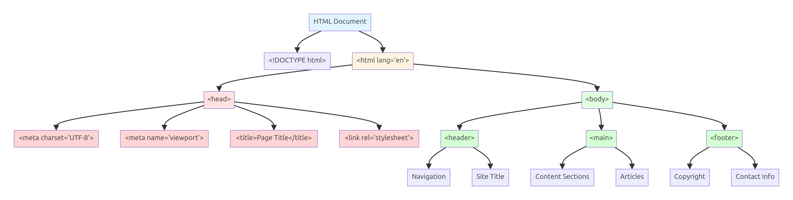
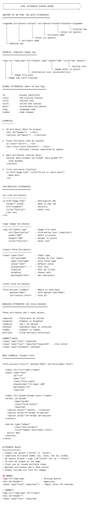
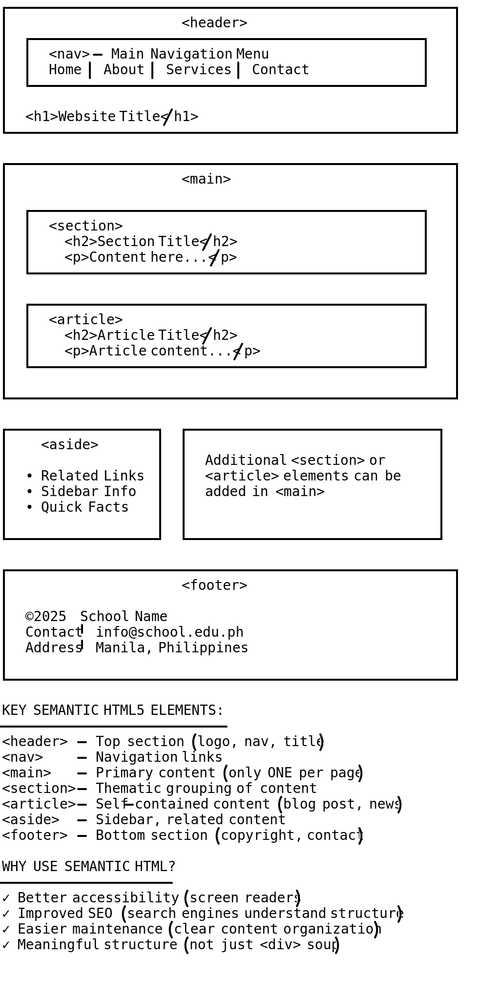
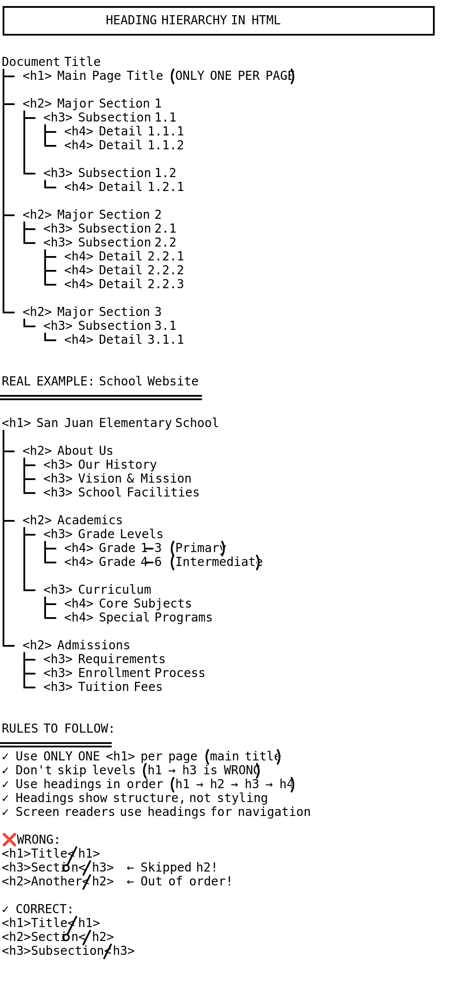
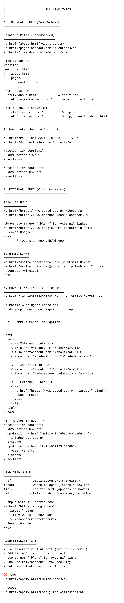
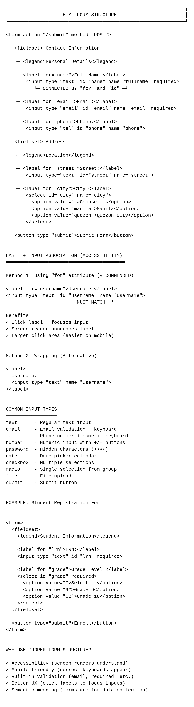
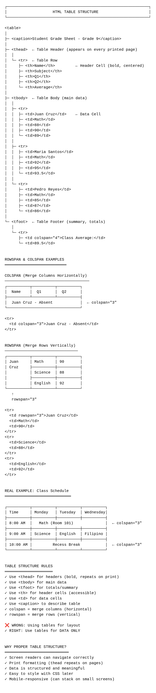

# HTML Fundamentals: Building the Web's Foundation

**Grade 10 - ICT**  
**Duration:** 2-3 weeks  
**Prerequisite:** None (This is the starting point!)

---

## 🎯 Learning Objectives

By the end of this lecture, you will be able to:

1. ✅ Create properly structured HTML documents
2. ✅ Use semantic HTML5 elements for better organization
3. ✅ Build forms for user input
4. ✅ Create tables for displaying data
5. ✅ Understand when and why to use different HTML elements
6. ✅ Apply accessibility best practices
7. ✅ Build real-world Philippine web pages

---

## 📖 Table of Contents

1. [Introduction: Why HTML?](#section-1)
2. [Document Structure](#section-2)
3. [Semantic HTML5 Elements](#section-3)
4. [Text and Content Elements](#section-4)
5. [Links and Images](#section-5)
6. [Forms: Getting User Input](#section-6)
7. [Tables: Displaying Data](#section-7)
8. [Accessibility Basics](#section-8)
9. [When to Use HTML](#section-9)
10. [Mini-Projects](#mini-projects)
11. [Final Challenge](#final-challenge)
12. [Troubleshooting](#troubleshooting)
13. [What's Next?](#whats-next)

---

<a name="section-1"></a>
## 1. Introduction: Why HTML?

### **The Foundation of the Web**

Imagine building a house. HTML is like the structure—the walls, floors, and rooms. Without structure, you can't have a house. Without HTML, you can't have a website.

**HTML** = **H**yper**T**ext **M**arkup **L**anguage

- **HyperText** = Text with links (connects pages together)
- **Markup** = Tags that describe content (not programming, just structure)
- **Language** = Standard way browsers understand web pages

### **What HTML Does (and Doesn't Do)**

✅ **HTML DOES:**
- Define structure (headings, paragraphs, lists)
- Create forms (input fields, buttons)
- Display content (text, images, links)
- Organize information (tables, sections)

❌ **HTML DOESN'T:**
- Style or design (that's CSS)
- Add interactivity (that's JavaScript)
- Store data (that's databases)

### **Real-World HTML Example**

**Barangay Website Structure:**
```
Header → Logo + Navigation
Main Content → Announcements, Services, Contact
Sidebar → Quick Links, Emergency Numbers
Footer → Copyright, Social Media
```

All of this structure is HTML!

---

<a name="section-2"></a>
## 2. Document Structure: The HTML Skeleton

### **Every HTML Page Needs This Structure**

```html
<!DOCTYPE html>
<html lang="en">
<head>
    <meta charset="UTF-8">
    <meta name="viewport" content="width=device-width, initial-scale=1.0">
    <title>My First Web Page</title>
</head>
<body>
    <!-- Your content goes here -->
    <h1>Welcome!</h1>
    <p>This is my first web page.</p>
</body>
</html>
```

### **Visual Guide: HTML Document Structure**


*Figure 1: Complete HTML5 document structure showing DOCTYPE, html, head, and body sections*

### **Understanding Each Part**

#### **1. `<!DOCTYPE html>`**
- Tells browser "This is HTML5"
- Must be the very first line
- Not a tag, just a declaration

#### **2. `<html lang="en">`**
- Root element (contains everything)
- `lang="en"` = language is English (use "tl" for Tagalog!)

#### **3. `<head>` Section**
- Information ABOUT the page (metadata)
- Not visible to users
- Contains:
  - `<meta charset="UTF-8">` = Support all characters (including ñ, é)
  - `<meta name="viewport" ...>` = Mobile-friendly display
  - `<title>` = Shows in browser tab

#### **4. `<body>` Section**
- Everything visible on the page
- Your actual content goes here

### **Comments in HTML**

```html
<!-- This is a comment - browsers ignore it -->
<!-- Use comments to explain your code -->
<!-- Useful for notes and reminders -->
```

### **Visual Guide: HTML Attribute Syntax**


*Figure 2: Anatomy of HTML tags and attributes - understanding opening tags, closing tags, and attribute syntax*

**🎯 Try It:** Basic Structure
- Open `assets/html-structure.html` in your browser
- View the page source (Right-click → View Page Source)
- See how the structure becomes a web page

---

<a name="section-3"></a>
## 3. Semantic HTML5: Meaningful Structure

### **What is "Semantic" HTML?**

**Semantic** = Tags that DESCRIBE what they contain

**Non-Semantic (Bad):**
```html
<div>Top of page</div>
<div>Main content</div>
<div>Side stuff</div>
<div>Bottom of page</div>
```
🤔 What does each `<div>` mean? Not clear!

**Semantic (Good):**
```html
<header>Top of page</header>
<main>Main content</main>
<aside>Side stuff</aside>
<footer>Bottom of page</footer>
```
✅ Clear meaning! Anyone can understand structure.

### **Visual Guide: Semantic Page Layout**


*Figure 3: Modern HTML5 semantic layout showing header, nav, main, article, aside, and footer elements*

### **HTML5 Semantic Elements**

#### **`<header>`** - Top of page or section
```html
<header>
    <h1>Barangay San Juan</h1>
    <p>Serving the community since 1950</p>
</header>
```

#### **`<nav>`** - Navigation menu
```html
<nav>
    <a href="#home">Home</a>
    <a href="#services">Services</a>
    <a href="#contact">Contact</a>
</nav>
```

#### **`<main>`** - Main content (only ONE per page)
```html
<main>
    <h2>Welcome to Our Barangay</h2>
    <p>We are proud to serve our community...</p>
</main>
```

#### **`<article>`** - Independent, self-contained content
```html
<article>
    <h2>Barangay Assembly This Saturday</h2>
    <p>Date: November 16, 2025</p>
    <p>Time: 2:00 PM</p>
    <p>Venue: Barangay Hall</p>
</article>
```

#### **`<section>`** - Thematic grouping
```html
<section>
    <h2>Our Services</h2>
    <p>We offer the following services...</p>
</section>
```

#### **`<aside>`** - Sidebar, related content
```html
<aside>
    <h3>Emergency Hotlines</h3>
    <p>Police: 911</p>
    <p>Fire: 911</p>
    <p>Health Center: (02) 123-4567</p>
</aside>
```

#### **`<footer>`** - Bottom of page or section
```html
<footer>
    <p>&copy; 2025 Barangay San Juan</p>
    <p>Contact: barangay@sanjuan.gov.ph</p>
</footer>
```

### **Complete Semantic Structure Example**

```html
<!DOCTYPE html>
<html lang="tl">
<head>
    <meta charset="UTF-8">
    <meta name="viewport" content="width=device-width, initial-scale=1.0">
    <title>Barangay San Juan</title>
</head>
<body>
    <header>
        <h1>Barangay San Juan</h1>
        <nav>
            <a href="#home">Home</a>
            <a href="#services">Serbisyo</a>
            <a href="#officials">Mga Opisyal</a>
            <a href="#contact">Kontak</a>
        </nav>
    </header>
    
    <main>
        <section id="home">
            <h2>Maligayang Pagdating</h2>
            <p>Welcome to Barangay San Juan website.</p>
        </section>
        
        <section id="services">
            <h2>Mga Serbisyo</h2>
            <article>
                <h3>Barangay Clearance</h3>
                <p>Requirements: Valid ID, 1x1 photo, ₱50 fee</p>
            </article>
            <article>
                <h3>Barangay Certificate</h3>
                <p>Requirements: Valid ID, ₱30 fee</p>
            </article>
        </section>
        
        <aside>
            <h3>Emergency Hotlines</h3>
            <p>Police: 911</p>
            <p>Fire: 911</p>
            <p>Health Center: (02) 123-4567</p>
        </aside>
    </main>
    
    <footer>
        <p>&copy; 2025 Barangay San Juan. All rights reserved.</p>
    </footer>
</body>
</html>
```

**🎯 Try It:** Semantic Structure
- Open `assets/barangay-semantic.html` in your browser
- Inspect with DevTools (F12) - see the clear structure
- Notice how easy it is to understand the layout

---

<a name="section-4"></a>
## 4. Text and Content Elements

### **Headings: `<h1>` to `<h6>`**

```html
<h1>Main Title (use only ONCE per page)</h1>
<h2>Major Section</h2>
<h3>Subsection</h3>
<h4>Sub-subsection</h4>
<h5>Smaller heading</h5>
<h6>Smallest heading</h6>
```

### **Visual Guide: Heading Hierarchy**


*Figure 4: Proper heading hierarchy showing h1 through h6 levels and nesting rules*

**Rules:**
- ✅ Use **ONE** `<h1>` per page (main title)
- ✅ Don't skip levels (`<h1>` → `<h3>` is bad)
- ✅ Use headings for structure, NOT styling
- ❌ Don't use `<h1>` just to make text big

**Example: Sari-Sari Store Price List**
```html
<h1>Tindahan ni Aling Maria</h1>
<h2>Softdrinks</h2>
<h3>Coke</h3>
<p>Sakto: ₱10, Mismo: ₱20</p>
<h3>Sprite</h3>
<p>Sakto: ₱10, Mismo: ₱20</p>
<h2>Snacks</h2>
<h3>Skyflakes</h3>
<p>₱35 per pack</p>
```

### **Paragraphs: `<p>`**

```html
<p>This is a paragraph. Multiple sentences can go here.</p>
<p>Each paragraph is a separate block.</p>
```

### **Line Breaks: `<br>`**

```html
<p>
    Barangay San Juan<br>
    123 Main Street<br>
    Manila, Philippines
</p>
```

**Note:** `<br>` is self-closing (no `</br>` needed)

### **Horizontal Line: `<hr>`**

```html
<h2>Section 1</h2>
<p>Content here...</p>
<hr>
<h2>Section 2</h2>
<p>More content...</p>
```

### **Text Formatting**

```html
<strong>Bold text (important)</strong>
<em>Italic text (emphasis)</em>
<mark>Highlighted text</mark>
<del>Deleted text</del>
<ins>Inserted text</ins>
<small>Small text</small>
<sub>Subscript</sub> like H<sub>2</sub>O
<sup>Superscript</sup> like x<sup>2</sup>
```

**Semantic vs Visual:**
- ✅ `<strong>` = Important (semantic)
- ❌ `<b>` = Bold (just visual)
- ✅ `<em>` = Emphasis (semantic)
- ❌ `<i>` = Italic (just visual)

**Use semantic tags!** They help screen readers and search engines.

### **Lists**

#### **Unordered List (Bullets):**
```html
<ul>
    <li>Skyflakes</li>
    <li>Lucky Me</li>
    <li>Coke</li>
</ul>
```

#### **Ordered List (Numbers):**
```html
<ol>
    <li>Fill out form</li>
    <li>Pay ₱50 fee</li>
    <li>Wait 15 minutes</li>
    <li>Claim barangay clearance</li>
</ol>
```

#### **Nested Lists:**
```html
<ul>
    <li>Barangay Officials
        <ul>
            <li>Barangay Captain: Juan Santos</li>
            <li>Kagawad 1: Maria Cruz</li>
            <li>Kagawad 2: Pedro Reyes</li>
        </ul>
    </li>
    <li>Barangay Services
        <ul>
            <li>Clearance</li>
            <li>Certificate</li>
            <li>Permit</li>
        </ul>
    </li>
</ul>
```

**🎯 Try It:** Text Elements
- Open `assets/text-practice.html`
- See different text elements in action
- Try modifying the content

---

<a name="section-5"></a>
## 5. Links and Images

### **Links: `<a>` Tag**

#### **External Links (to other websites):**
```html
<a href="https://www.google.com">Go to Google</a>
<a href="https://www.deped.gov.ph">DepEd Website</a>
```

#### **Internal Links (to other pages on your site):**
```html
<a href="about.html">About Us</a>
<a href="services.html">Our Services</a>
```

#### **Anchor Links (to sections on same page):**
```html
<!-- In navigation -->
<a href="#contact">Jump to Contact</a>

<!-- Later on the page -->
<section id="contact">
    <h2>Contact Us</h2>
    <p>Email: info@barangay.ph</p>
</section>
```

#### **Email Links:**
```html
<a href="mailto:captain@barangay.ph">Email the Captain</a>
```

#### **Phone Links (clickable on mobile):**
```html
<a href="tel:+639123456789">Call: 0912 345 6789</a>
```

#### **Opening Links in New Tab:**
```html
<a href="https://www.google.com" target="_blank">
    Open Google in new tab
</a>
```

### **Visual Guide: Link Types**


*Figure 5: Different types of HTML links - external, internal, anchor, email, and phone links*

### **Images: `` Tag**

#### **Basic Image:**
```html

```

**Important Attributes:**
- `src` = Image file location (required)
- `alt` = Description for screen readers and if image fails (required)
- `width` = Width in pixels (optional)
- `height` = Height in pixels (optional)

#### **With Size:**
```html

```

#### **Responsive Image (adjusts to screen size):**
```html

```

### **Image Paths**

#### **Same Folder:**
```html

```

#### **In Subfolder:**
```html

```

#### **Parent Folder:**
```html

```

#### **Absolute Path (from website root):**
```html

```

#### **External Image:**
```html

```

### **Image as Link:**
```html
<a href="home.html">
    
</a>
```

### **Figure with Caption:**
```html
<figure>
    
    <figcaption>Barangay Hall - Built in 1985</figcaption>
</figure>
```

**🎯 Try It:** Links and Images
- Open `assets/links-images-practice.html`
- Click different types of links
- See how images are displayed

---

<a name="section-6"></a>
## 6. Forms: Getting User Input

### **Why Forms Matter**

Forms are how users interact with websites:
- Login pages
- Contact forms
- Registration
- Search boxes
- Order forms

### **Visual Guide: Form Structure**


*Figure 6: Complete HTML form structure showing form element, labels, inputs, and submit button*

### **Basic Form Structure**

```html
<form action="/submit" method="POST">
    <!-- Form fields go here -->
    <button type="submit">Submit</button>
</form>
```

**Attributes:**
- `action` = Where to send form data (URL)
- `method` = How to send (`GET` or `POST`)

### **Text Input**

```html
<label for="name">Full Name:</label>
<input type="text" id="name" name="fullname" required>
```

**Important:**
- `<label>` with `for` attribute = Accessibility!
- `id` must match `for` in label
- `name` = How data is sent to server
- `required` = Must be filled out

### **Common Input Types**

#### **Text:**
```html
<label for="fname">First Name:</label>
<input type="text" id="fname" name="firstname">
```

#### **Email:**
```html
<label for="email">Email:</label>
<input type="email" id="email" name="email" required>
```
✅ Automatically validates email format!

#### **Password:**
```html
<label for="pass">Password:</label>
<input type="password" id="pass" name="password" required>
```
✅ Hides the text (shows ••••••)

#### **Number:**
```html
<label for="age">Age:</label>
<input type="number" id="age" name="age" min="1" max="120">
```

#### **Tel (Phone):**
```html
<label for="phone">Phone Number:</label>
<input type="tel" id="phone" name="phone" placeholder="0912 345 6789">
```

#### **Date:**
```html
<label for="bday">Birthdate:</label>
<input type="date" id="bday" name="birthdate">
```
✅ Shows a calendar picker!

### **Textarea (Multi-line Text)**

```html
<label for="message">Message:</label>
<textarea id="message" name="message" rows="5" cols="40"></textarea>
```

### **Select Dropdown**

```html
<label for="barangay">Barangay:</label>
<select id="barangay" name="barangay">
    <option value="">-- Select --</option>
    <option value="san-juan">San Juan</option>
    <option value="santa-cruz">Santa Cruz</option>
    <option value="san-pedro">San Pedro</option>
</select>
```

### **Radio Buttons (Choose ONE)**

```html
<p>Gender:</p>
<label>
    <input type="radio" name="gender" value="male"> Male
</label>
<label>
    <input type="radio" name="gender" value="female"> Female
</label>
```

**Note:** Same `name` = only one can be selected

### **Checkboxes (Choose MULTIPLE)**

```html
<p>Services Needed:</p>
<label>
    <input type="checkbox" name="service" value="clearance"> Barangay Clearance
</label>
<label>
    <input type="checkbox" name="service" value="certificate"> Certificate
</label>
<label>
    <input type="checkbox" name="service" value="permit"> Business Permit
</label>
```

### **Buttons**

```html
<button type="submit">Submit Form</button>
<button type="reset">Clear Form</button>
<button type="button">Just a Button</button>
```

### **Complete Form Example: Barangay Clearance Application**

```html
<form action="/apply-clearance" method="POST">
    <h2>Barangay Clearance Application</h2>
    
    <!-- Personal Information -->
    <fieldset>
        <legend>Personal Information</legend>
        
        <label for="fullname">Full Name:</label>
        <input type="text" id="fullname" name="fullname" required>
        
        <label for="bday">Birthdate:</label>
        <input type="date" id="bday" name="birthdate" required>
        
        <label for="address">Address:</label>
        <textarea id="address" name="address" rows="3" required></textarea>
        
        <label for="phone">Contact Number:</label>
        <input type="tel" id="phone" name="phone" required>
        
        <label for="email">Email (optional):</label>
        <input type="email" id="email" name="email">
    </fieldset>
    
    <!-- Purpose -->
    <fieldset>
        <legend>Purpose of Clearance</legend>
        
        <label for="purpose">Purpose:</label>
        <select id="purpose" name="purpose" required>
            <option value="">-- Select Purpose --</option>
            <option value="employment">Employment</option>
            <option value="travel">Travel/Visa</option>
            <option value="school">School Requirements</option>
            <option value="other">Other</option>
        </select>
    </fieldset>
    
    <!-- Confirmation -->
    <label>
        <input type="checkbox" name="confirm" required>
        I certify that all information provided is true and correct.
    </label>
    
    <button type="submit">Submit Application</button>
    <button type="reset">Clear Form</button>
</form>
```

**🎯 Try It:** Forms
- Open `assets/barangay-clearance-form.html`
- Fill out the form
- Try the validation (submit without filling required fields)
- See how different input types work on mobile

---

<a name="section-7"></a>
## 7. Tables: Displaying Data

### **Why Tables?**

Tables organize data in rows and columns:
- Price lists
- Schedules
- Reports
- Comparison charts

### **Visual Guide: Table Structure**


*Figure 7: HTML table anatomy showing table, thead, tbody, tr, th, and td elements*

### **Basic Table Structure**

```html
<table>
    <thead>
        <tr>
            <th>Header 1</th>
            <th>Header 2</th>
        </tr>
    </thead>
    <tbody>
        <tr>
            <td>Data 1</td>
            <td>Data 2</td>
        </tr>
    </tbody>
</table>
```

**Parts:**
- `<table>` = Container
- `<thead>` = Header section
- `<tbody>` = Body section
- `<tr>` = Table Row
- `<th>` = Table Header (bold, centered)
- `<td>` = Table Data (regular cell)

### **Example: Sari-Sari Store Price List**

```html
<table>
    <thead>
        <tr>
            <th>Product</th>
            <th>Size</th>
            <th>Price</th>
        </tr>
    </thead>
    <tbody>
        <tr>
            <td>Skyflakes</td>
            <td>Regular</td>
            <td>₱35</td>
        </tr>
        <tr>
            <td>Lucky Me</td>
            <td>Single Pack</td>
            <td>₱15</td>
        </tr>
        <tr>
            <td>Coke</td>
            <td>Sakto</td>
            <td>₱10</td>
        </tr>
        <tr>
            <td>Coke</td>
            <td>Mismo</td>
            <td>₱20</td>
        </tr>
    </tbody>
</table>
```

### **Table with Merged Cells**

#### **Colspan (Merge Horizontally):**
```html
<tr>
    <th colspan="3">Softdrinks Section</th>
</tr>
<tr>
    <td>Coke</td>
    <td>Sakto</td>
    <td>₱10</td>
</tr>
```

#### **Rowspan (Merge Vertically):**
```html
<tr>
    <td rowspan="2">Coke</td>
    <td>Sakto</td>
    <td>₱10</td>
</tr>
<tr>
    <td>Mismo</td>
    <td>₱20</td>
</tr>
```

### **Example: Class Schedule**

```html
<table>
    <caption>Grade 10 - Einstein Schedule</caption>
    <thead>
        <tr>
            <th>Time</th>
            <th>Monday</th>
            <th>Tuesday</th>
            <th>Wednesday</th>
        </tr>
    </thead>
    <tbody>
        <tr>
            <td>7:00 - 8:00</td>
            <td>Math</td>
            <td>English</td>
            <td>Science</td>
        </tr>
        <tr>
            <td>8:00 - 9:00</td>
            <td>Filipino</td>
            <td>Math</td>
            <td>English</td>
        </tr>
        <tr>
            <td>9:00 - 10:00</td>
            <td>Science</td>
            <td>Filipino</td>
            <td>ICT</td>
        </tr>
    </tbody>
</table>
```

**🎯 Try It:** Tables
- Open `assets/price-list-table.html`
- See how data is organized
- Try adding more rows/columns

---

<a name="section-8"></a>
## 8. Accessibility Basics

### **Why Accessibility Matters**

**Accessibility** = Making websites usable for EVERYONE, including people with disabilities.

**Who benefits:**
- Blind users (screen readers)
- Low vision users (need larger text)
- Motor disabilities (keyboard navigation)
- Deaf users (captions for videos)
- Everyone! (clearer structure helps all users)

### **Key Accessibility Practices**

#### **1. Always Use Alt Text for Images**

```html
<!-- ✅ Good -->


<!-- ❌ Bad -->

```

#### **2. Use Semantic HTML**

```html
<!-- ✅ Good - Clear structure -->
<header>
<nav>
<main>
<footer>

<!-- ❌ Bad - All divs, no meaning -->
<div class="header">
<div class="navigation">
<div class="content">
<div class="footer">
```

#### **3. Label All Form Inputs**

```html
<!-- ✅ Good -->
<label for="name">Name:</label>
<input type="text" id="name" name="name">

<!-- ❌ Bad -->
<input type="text" name="name" placeholder="Name">
```

#### **4. Use Proper Heading Hierarchy**

```html
<!-- ✅ Good -->
<h1>Main Title</h1>
<h2>Section</h2>
<h3>Subsection</h3>

<!-- ❌ Bad -->
<h1>Main Title</h1>
<h4>Section</h4>  <!-- Skipped h2 and h3! -->
```

#### **5. Provide Text for Icons/Buttons**

```html
<!-- ✅ Good -->
<button aria-label="Close">✖</button>

<!-- Even better -->
<button>✖ Close</button>
```

#### **6. Use Descriptive Link Text**

```html
<!-- ✅ Good -->
<a href="services.html">View our barangay services</a>

<!-- ❌ Bad -->
<a href="services.html">Click here</a>
```

#### **7. Tables Need Headers**

```html
<!-- ✅ Good -->
<table>
    <thead>
        <tr>
            <th>Product</th>
            <th>Price</th>
        </tr>
    </thead>
    <tbody>
        <tr>
            <td>Skyflakes</td>
            <td>₱35</td>
        </tr>
    </tbody>
</table>
```

### **ARIA (Accessible Rich Internet Applications)**

For complex interactions, use ARIA attributes:

```html
<button aria-label="Menu" aria-expanded="false">
    ☰
</button>

<div role="alert">
    Form submitted successfully!
</div>
```

**Note:** Use ARIA only when semantic HTML isn't enough!

---

<a name="section-9"></a>
## 9. When to Use HTML

### **✅ Good Uses of HTML**

#### **1. Defining Structure and Content**
```html
<!-- ✅ HTML's job: Structure -->
<article>
    <h2>Announcement</h2>
    <p>Content here...</p>
</article>
```

#### **2. Creating Forms for User Input**
```html
<!-- ✅ HTML's job: Input collection -->
<form>
    <label>Name:</label>
    <input type="text">
</form>
```

#### **3. Organizing Data in Tables**
```html
<!-- ✅ HTML's job: Data display -->
<table>
    <tr>
        <th>Product</th>
        <th>Price</th>
    </tr>
</table>
```

#### **4. Linking Pages Together**
```html
<!-- ✅ HTML's job: Navigation -->
<nav>
    <a href="home.html">Home</a>
    <a href="about.html">About</a>
</nav>
```

### **❌ Wrong Uses of HTML (Use CSS/JavaScript Instead)**

#### **1. Styling (Use CSS)**
```html
<!-- ❌ Wrong: Inline styling -->
<p style="color: red; font-size: 20px;">Text</p>

<!-- ✅ Right: Separate CSS -->
<p class="highlight">Text</p>
```

#### **2. Layout (Use CSS)**
```html
<!-- ❌ Wrong: Using tables for layout -->
<table>
    <tr>
        <td>Menu</td>
        <td>Content</td>
    </tr>
</table>

<!-- ✅ Right: Semantic HTML + CSS Grid/Flexbox -->
<nav>Menu</nav>
<main>Content</main>
```

#### **3. Interactivity (Use JavaScript)**
```html
<!-- ❌ Wrong: Can't do this with just HTML -->
<button>Click to show more</button>
<!-- Need JavaScript to actually show/hide -->

<!-- ✅ Right: HTML + JavaScript -->
<button onclick="showMore()">Click to show more</button>
<script>
    function showMore() {
        // JavaScript code here
    }
</script>
```

### **⚖️ Trade-offs**

#### **HTML Only:**
**Pros:**
- ✅ Works everywhere (even old browsers)
- ✅ Fast to load
- ✅ Easy to learn
- ✅ Good for content-heavy sites

**Cons:**
- ❌ Not visually appealing (need CSS)
- ❌ No interactivity (need JavaScript)
- ❌ Limited layout control

#### **When HTML Alone is Enough:**
- Simple documentation
- Plain text content
- Government forms (print-focused)
- Basic information pages

#### **When You Need More:**
- Visual design → Add CSS
- User interaction → Add JavaScript
- Data storage → Add backend (Express + database)

### **🇵🇭 Philippine Examples**

#### **HTML-Only Projects (Good):**
- ✅ Barangay clearance form (to be printed)
- ✅ Certificate templates
- ✅ Simple contact information page
- ✅ Text-heavy announcements

#### **Need CSS (Pretty):**
- ✅ Barangay official website
- ✅ Sari-sari store online catalog
- ✅ School information portal

#### **Need JavaScript (Interactive):**
- ✅ Search functionality
- ✅ Image galleries
- ✅ Form validation
- ✅ Dynamic content updates

#### **Need Backend (Data Storage):**
- ✅ User login
- ✅ Inventory management
- ✅ Order tracking
- ✅ Database queries

### **💡 Decision Framework**

```
Question: What do I need to build?

Just content/structure?
└─> HTML only

Need it to look good?
└─> HTML + CSS

Need user interaction?
└─> HTML + CSS + JavaScript

Need to save data?
└─> HTML + CSS + JavaScript + Backend (Express + SQLite)

Need offline access?
└─> HTML + CSS + JavaScript + PWA (coming in later lecture!)
```

---

<a name="mini-projects"></a>
## 10. Mini-Projects

### **Project 1: Barangay Official Profile**

**Goal:** Create a semantic HTML page with header, main content, aside, and footer.

**Requirements:**
- Use proper document structure
- `<header>` with barangay name and navigation
- `<main>` with official information
- `<aside>` with contact details
- `<footer>` with copyright
- At least one image with alt text
- Proper heading hierarchy

**Starter:** `assets/barangay-profile-starter.html`  
**Solution:** `assets/barangay-profile-solution.html`

---

### **Project 2: Sari-Sari Store Catalog**

**Goal:** Create a product catalog using semantic HTML, lists, and a table.

**Requirements:**
- Proper document structure
- `<h1>` store name
- Product categories using `<h2>`
- Unordered list of products per category
- Price table with product, size, and price columns
- At least 10 products
- Contact form at bottom

**Starter:** `assets/store-catalog-starter.html`  
**Solution:** `assets/store-catalog-solution.html`

---

### **Project 3: Contact Form with Validation**

**Goal:** Create a comprehensive contact form using various input types.

**Requirements:**
- Text inputs (name, subject)
- Email input
- Phone input
- Textarea for message
- Select dropdown (topic: question/complaint/suggestion)
- Radio buttons (preferred contact method)
- Checkbox (agree to terms)
- Submit and reset buttons
- All inputs properly labeled
- Required fields marked

**Starter:** `assets/contact-form-starter.html`  
**Solution:** `assets/contact-form-solution.html`

---

<a name="final-challenge"></a>
## 11. Final Challenge: School Website

### **The Challenge**

Create a **complete school homepage** using everything you've learned!

**Requirements:**

1. **Proper HTML5 Document Structure**
   - DOCTYPE, html, head, body
   - Meta tags (charset, viewport)
   - Descriptive title

2. **Semantic Layout**
   - `<header>` with school name and logo
   - `<nav>` with links (Home, About, Programs, Contact)
   - `<main>` with main content
   - `<aside>` with announcements
   - `<footer>` with contact info

3. **Content Sections (in main):**
   - Welcome section with heading and paragraph
   - Programs offered (unordered list)
   - Teacher directory (table with name, subject, email)
   - Enrollment form (various input types)

4. **Multimedia:**
   - At least 2 images (school logo, building photo)
   - All images have alt text

5. **Forms:**
   - Inquiry form with:
     - Name (text, required)
     - Email (email, required)
     - Grade level interested in (select dropdown)
     - Message (textarea)
     - Submit button

6. **Accessibility:**
   - Semantic HTML throughout
   - All form inputs labeled
   - Proper heading hierarchy
   - Descriptive link text

**Variations (Choose ONE):**

**Variation A: Elementary School**
- Focus on younger students (K-6)
- Simple, friendly language
- Colorful descriptions
- Parent-focused information

**Variation B: High School**
- Focus on teens (Grades 7-12)
- Academic programs and tracks
- College preparation info
- Student activities

**Variation C: Vocational School**
- Focus on skills training
- Course offerings (welding, cooking, IT)
- Job placement info
- Industry partnerships

**Files:**
- Starter: `assets/school-website-starter.html`
- Solution A: `assets/school-website-elementary.html`
- Solution B: `assets/school-website-highschool.html`
- Solution C: `assets/school-website-vocational.html`

---

<a name="troubleshooting"></a>
## 12. Troubleshooting Common Issues

### **Problem: Page is Blank**

**Possible Causes:**
1. Missing `<!DOCTYPE html>`
2. Forgot to close `</body>` or `</html>`
3. Content is outside `<body>` tags

**Solution:**
```html
<!DOCTYPE html>
<html lang="en">
<head>
    <meta charset="UTF-8">
    <title>Title</title>
</head>
<body>
    <!-- All content must be here -->
</body>
</html>
```

---

### **Problem: Image Not Showing**

**Possible Causes:**
1. Wrong file path
2. Image file doesn't exist
3. Missing file extension (.jpg, .png)
4. Wrong folder

**Solution:**
```html
<!-- Check file path carefully -->


<!-- Or use absolute URL -->

```

---

### **Problem: Form Not Submitting**

**Possible Causes:**
1. Missing `action` attribute
2. Button type not "submit"
3. Required fields not filled

**Solution:**
```html
<form action="/submit" method="POST">
    <input type="text" required>
    <button type="submit">Submit</button>  <!-- Not type="button"! -->
</form>
```

---

### **Problem: Validation Not Working**

**Cause:** Using wrong input type

**Solution:**
```html
<!-- ❌ Won't validate email -->
<input type="text" name="email">

<!-- ✅ Will validate email -->
<input type="email" name="email" required>
```

---

### **Problem: Headings Look Wrong**

**Cause:** Skipping heading levels

**Solution:**
```html
<!-- ❌ Wrong -->
<h1>Title</h1>
<h4>Section</h4>  <!-- Skipped h2, h3 -->

<!-- ✅ Right -->
<h1>Title</h1>
<h2>Section</h2>
<h3>Subsection</h3>
```

---

### **Problem: Special Characters Don't Show (ñ, á, é)**

**Cause:** Missing charset meta tag

**Solution:**
```html
<head>
    <meta charset="UTF-8">  <!-- Add this! -->
</head>
```

---

<a name="whats-next"></a>
## 13. What's Next?

### **You Now Know:**
✅ HTML document structure  
✅ Semantic HTML5 elements  
✅ Text and content formatting  
✅ Links and images  
✅ Forms and user input  
✅ Tables for data display  
✅ Accessibility basics  
✅ When to use HTML vs CSS/JavaScript  

### **Coming Up Next: CSS**

HTML gives you structure, but CSS makes it beautiful!

**In the CSS Lecture, you'll learn:**
- How to style your HTML
- Colors, fonts, spacing
- Layout with Flexbox and Grid
- Responsive design
- Making your Barangay website look professional

### **The Journey Ahead**

```
HTML (Structure) ← You are here!
    ↓
CSS (Styling)
    ↓
JavaScript (Interactivity)
    ↓
DOM Manipulation
    ↓
AJAX/Fetch (Data Loading)
    ↓
Express (Backend)
    ↓
Databases
    ↓
Authentication
    ↓
Production Deployment
```

### **Practice Suggestions**

1. **Recreate Real Websites (Structure Only)**
   - Look at barangay websites
   - Look at school websites
   - Try to build similar structure in HTML

2. **Build Something for Your Community**
   - Barangay announcement board
   - School event calendar
   - Local business directory

3. **Help Others**
   - Teach HTML to classmates
   - Build a website for your family's business
   - Create forms for barangay officials

### **Resources for Further Learning**

- **MDN Web Docs:** https://developer.mozilla.org/en-US/docs/Web/HTML
- **W3Schools:** https://www.w3schools.com/html/
- **HTML Validator:** https://validator.w3.org/

---

## 🎉 Congratulations!

You've completed the HTML Fundamentals lecture! You now have the foundation to build structured, accessible web pages.

**Remember:**
- HTML is about **structure and meaning**
- Use **semantic tags** for clarity
- Always think about **accessibility**
- Practice by building **real projects**

**Next stop: CSS Lecture** - Let's make these pages look amazing! 🎨

---

**📝 Quick Reference Card**

```html
<!-- Document Structure -->
<!DOCTYPE html>
<html lang="en">
<head>
    <meta charset="UTF-8">
    <meta name="viewport" content="width=device-width, initial-scale=1.0">
    <title>Page Title</title>
</head>
<body>
    <!-- Content here -->
</body>
</html>

<!-- Semantic Elements -->
<header>      <!-- Top of page/section -->
<nav>         <!-- Navigation menu -->
<main>        <!-- Main content (one per page) -->
<article>     <!-- Independent content -->
<section>     <!-- Thematic grouping -->
<aside>       <!-- Sidebar, related content -->
<footer>      <!-- Bottom of page/section -->

<!-- Text -->
<h1> to <h6>  <!-- Headings -->
<p>           <!-- Paragraph -->
<strong>      <!-- Important (bold) -->
<em>          <!-- Emphasis (italic) -->
<br>          <!-- Line break -->
<hr>          <!-- Horizontal line -->

<!-- Lists -->
<ul>          <!-- Unordered list (bullets) -->
<ol>          <!-- Ordered list (numbers) -->
<li>          <!-- List item -->

<!-- Links & Images -->
<a href="url">Link Text</a>


<!-- Forms -->
<form action="/submit" method="POST">
    <label for="id">Label:</label>
    <input type="text" id="id" name="name" required>
    <textarea></textarea>
    <select>
        <option value="val">Text</option>
    </select>
    <button type="submit">Submit</button>
</form>

<!-- Tables -->
<table>
    <thead>
        <tr>
            <th>Header</th>
        </tr>
    </thead>
    <tbody>
        <tr>
            <td>Data</td>
        </tr>
    </tbody>
</table>
```

---

**End of HTML Fundamentals Lecture**

*Created for Grade 10 Filipino Students*  
*Philippine Context, Real-World Examples, Practical Skills*
