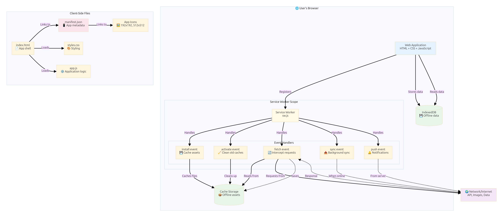
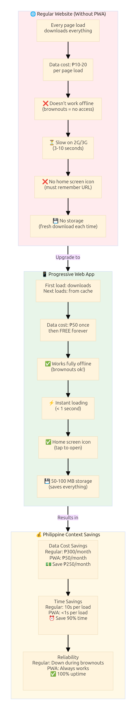
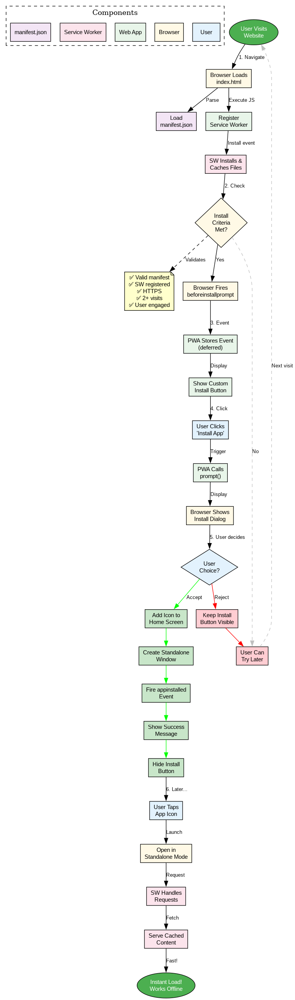
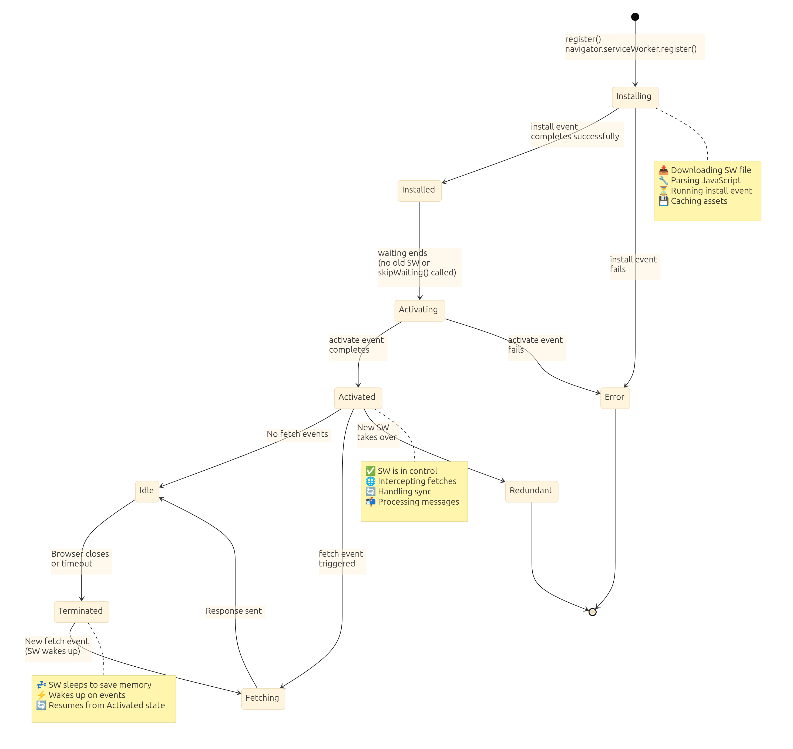
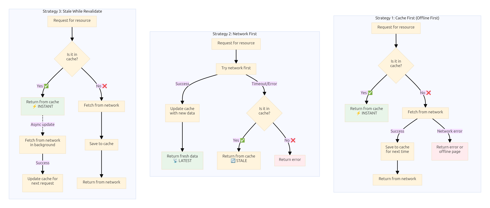
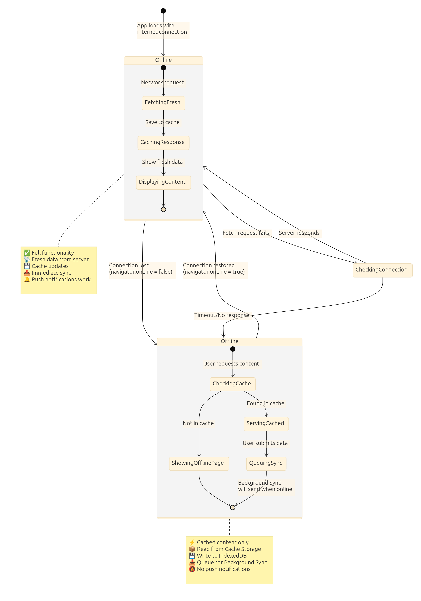
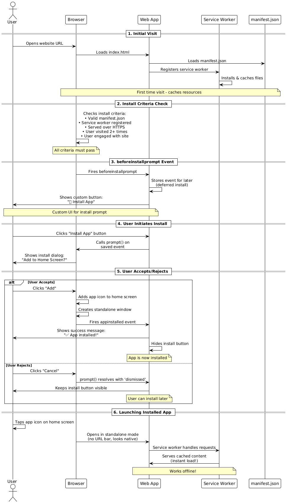

# Progressive Web Apps (PWA): Building Offline-First Applications

**Grade 10 - ICT**  
**Duration:** 2-3 weeks  
**Prerequisites:** HTML, CSS, JavaScript, Basic web servers, Service Workers concept

---

## 🎯 Learning Objectives

By the end of this lecture, you will be able to:

1. ✅ Understand what Progressive Web Apps are and why they matter
2. ✅ Create a manifest.json file for app metadata
3. ✅ Implement basic service workers for offline functionality
4. ✅ Use caching strategies for different types of resources
5. ✅ Make your web app installable on mobile devices
6. ✅ Detect offline status and provide appropriate feedback
7. ✅ Test PWA features using browser DevTools
8. ✅ Optimize for Philippine internet conditions

---

## 📖 Table of Contents

1. [What is a PWA?](#section-1)
2. [Why PWAs Matter in the Philippines](#section-2)
3. [Creating manifest.json](#section-3)
4. [Service Worker Basics](#section-4)
5. [Caching Strategies](#section-5)
6. [Offline Detection](#section-6)
7. [Making Your App Installable](#section-7)
8. [Testing PWA Features](#section-8)
9. [When to Use PWAs](#section-9)
10. [Mini-Projects](#mini-projects)
11. [Final Challenge](#final-challenge)
12. [Troubleshooting](#troubleshooting)
13. [What's Next?](#whats-next)

---

<a name="section-1"></a>
## 1. What is a PWA?

### **Progressive Web App Definition**

**PWA** = Web application that feels like a native mobile app

**Think of it like:**
- Website that you can install on your phone
- Works offline (even without internet!)
- Feels as fast as a real app
- Can receive notifications (advanced)
- Lives on your home screen with an icon

**Not Quite:**
- ❌ Not a native app (no App Store/Play Store needed)
- ❌ Not just a website (has superpowers!)
- ❌ Not an "app wrapper" (no Cordova/PhoneGap)

### **Key Characteristics**

**Progressive Web Apps are:**

**1. Progressive**
- Works for every user
- Regardless of browser choice
- Basic features always work
- Enhanced features when supported

**2. Responsive**
- Fits any screen size
- Mobile, tablet, desktop
- Adapts layout automatically

**3. Connectivity-Independent**
- **Most important!** Works offline
- Or on slow 3G connections
- Caches resources locally
- Syncs when connection returns

**4. App-Like**
- Feels native
- Smooth interactions
- Full-screen mode
- Home screen icon

**5. Fresh**
- Always up-to-date
- Auto-updates when online
- No "Update available" prompts
- User always sees latest version

**6. Safe**
- Served via HTTPS (secure)
- Prevents man-in-the-middle attacks
- Required for service workers

**7. Discoverable**
- Searchable (still a web page!)
- SEO friendly
- Shareable via URL
- No app store gatekeepers

**8. Installable**
- Add to home screen
- Launch from icon (like native app)
- Works full-screen
- No browser UI clutter



### **PWA vs Native App vs Regular Website**

| Feature | Native App | PWA | Regular Website |
|---------|-----------|-----|-----------------|
| **Installation** | App Store | Web browser | No installation |
| **Offline** | ✅ Works | ✅ Works | ❌ Requires internet |
| **Updates** | Manual (user approval) | Automatic | Always latest |
| **Storage** | Phone storage | Cache + IndexedDB | Cookies/localStorage |
| **Home screen** | ✅ Icon | ✅ Icon | ❌ Bookmark only |
| **Performance** | Fastest | Fast | Varies |
| **Development** | Platform-specific code | One codebase | One codebase |
| **Distribution** | App Store approval | Instant (URL) | Instant (URL) |
| **Discoverability** | App Store search | Google search | Google search |
| **Cost** | High (per platform) | Low (one app) | Low (one site) |

### **Philippine Context: Why PWAs Make Sense**

**The Reality:**
- 🇵🇭 70% of Filipinos use mobile for internet
- 📱 Budget Android phones are common (Samsung A, OPPO, Realme, Xiaomi)
- 🐌 Slow internet (3G/4G, not always 5G)
- 💰 Data is expensive (prepaid load, limited data)
- 🏙️ Urban areas have WiFi, but...
- 🏞️ Provinces have spotty coverage
- 🚍 Commuting = moving between cell towers
- 💾 Limited phone storage (no space for many apps!)

**PWA Advantages for Philippines:**

**1. Data Savings**
```
Native App:
- Facebook app: 200MB download
- Messenger: 50MB
- Instagram: 100MB
Total: 350MB (expensive load!)

PWA:
- Initial load: 5-10MB
- Cached locally
- Only new data downloaded
Total: Much less data used!
```

**2. Works Offline**
```
Jeepney ride home from school:
- Connection drops in tunnel
- Native app: Still works (if data loaded)
- Regular website: "No internet connection"
- PWA: Still works! (cached data available)
```

**3. Storage Friendly**
```
16GB phone with 2GB free:
- Can't install more native apps
- PWA: Uses cache (smaller footprint)
- Can "install" many PWAs
```

**4. No App Store Hassle**
```
Native App:
- Find in Play Store
- Check reviews
- Check permissions (scary!)
- Download 200MB
- Install
- Wait 5-10 minutes

PWA:
- Visit website
- Click "Add to Home Screen"
- Done! (30 seconds)
```

### **Real-World PWA Examples**

**Global Apps (PWAs you might use):**
- **Twitter Lite** - Fast, data-saving version
- **Pinterest** - 60% more engagement as PWA
- **Starbucks** - Order offline, sync when online
- **Uber** - Works on 2G connections
- **Spotify** - Offline playlist playback

**Philippine Examples (What You Could Build):**
- **Sari-Sari Store Inventory** - Works even without internet
- **Barangay Directory** - Access official info offline
- **Jeepney Route Finder** - Cached routes, works in transit
- **Class Schedule** - Always accessible (no excuses!)
- **Recipe App** - Cook even without connection
- **Student Portal** - View grades offline

### **What You'll Build**

**In this lecture:**
1. **Simple PWA** (offline news reader)
2. **Store Catalog** (cached products)
3. **Barangay Directory** (offline contacts)
4. **Final Challenge:** Full PWA with offline features

**Core Skills:**
- ✅ manifest.json (app metadata)
- ✅ Service workers (offline magic)
- ✅ Cache API (storing resources)
- ✅ Fetch event handling (intercepting requests)
- ✅ Install prompts (add to home screen)
- ✅ Offline detection (user feedback)

**We WON'T cover (too advanced for Grade 10):**
- ❌ Push notifications (complex server setup)
- ❌ Background sync (advanced API)
- ❌ IndexedDB (complex storage, localStorage is enough)
- ❌ WebAssembly (too advanced)

**Keep it Simple = Keep it Usable!**

---

<a name="section-2"></a>
## 2. Why PWAs Matter in the Philippines



### **The Philippine Internet Reality**

**Stats (2024):**
- 📊 85 million internet users (out of 110 million population)
- 📱 98% access via mobile phones
- 💰 Average prepaid load: ₱100-300/week
- 🐌 Average speed: 25 Mbps (urban), 5-10 Mbps (rural)
- 📉 Connection drops frequently (moving, weather)

**Cost of Data:**
```
Typical Prepaid Load:
₱50 = 1GB for 3 days
₱100 = 2GB for 7 days
₱300 = 6GB for 30 days

Heavy app usage:
- Facebook app alone: 500MB/month
- Instagram: 300MB/month
- Games: 1GB+/month
- Total: Expensive!
```

### **Problems PWAs Solve**

#### **Problem 1: Data Exhaustion**

**Without PWA:**
```
Student checks sari-sari store prices:
- Open website
- Download all images (5MB)
- Check prices
- Close tab

Next day:
- Open website AGAIN
- Download same images AGAIN (5MB)
- Check prices
- Total wasted: 5MB/day = 150MB/month!
```

**With PWA:**
```
Student checks sari-sari store prices:
- Open PWA
- Download images once (5MB)
- Images cached locally

Next day:
- Open PWA
- Images load from cache (0MB download!)
- Only new prices downloaded (1KB)
- Total data: 5MB + (1KB × 30 days) = ~5MB/month
Savings: 145MB/month!
```

#### **Problem 2: Connection Loss**

**Without PWA:**
```
Student on jeepney:
- Opens news site
- Reads article
- Jeepney enters tunnel
- Connection drops
- "No internet connection" error
- Article disappears
- Frustration! 😤
```

**With PWA:**
```
Student on jeepney:
- Opens news PWA
- Reads article (cached)
- Jeepney enters tunnel
- Connection drops
- Article still readable! (from cache)
- Can even read other cached articles
- Happy commute! 😊
```

#### **Problem 3: App Store Barriers**

**Without PWA:**
```
Teacher: "Download our class app!"
Student: 
- Goes to Play Store
- App is 150MB
- "Not enough storage"
- Phone only has 500MB free
- Can't delete photos (precious memories!)
- Can't delete other apps (needs them)
- Can't participate in class 😢
```

**With PWA:**
```
Teacher: "Visit our class portal!"
Student:
- Opens link
- Click "Add to Home Screen"
- Uses 5MB cache space
- Icon on home screen (like native app!)
- Full participation! 🎉
```

#### **Problem 4: Slow Initial Load**

**Without PWA:**
```
Sari-sari store owner:
- Opens inventory app
- 10-second loading (slow 3G)
- Customer waiting
- Awkward silence...
- "Sorry, internet is slow"
- Lost sale opportunity
```

**With PWA:**
```
Sari-sari store owner:
- Opens inventory PWA
- Instant load (from cache!)
- Customer sees products immediately
- Quick transaction
- Happy customer, happy owner! 💰
```

### **Success Stories: Philippine Context**

#### **Case Study 1: Lazada (E-commerce)**

**Before PWA:**
- Mobile website slow
- High bounce rate
- Users download app (or leave)

**After PWA:**
- 88% reduction in size (vs native app)
- 3x faster than before
- Installation on home screen increased engagement

**Result:** More sales, happier customers

#### **Case Study 2: Local Sari-Sari Store (Hypothetical)**

**Scenario:**
- Small store in Quezon City
- Wants digital inventory
- Can't afford expensive POS system
- Spotty internet (rainy season floods)

**PWA Solution:**
- Simple inventory PWA
- Works offline (service worker)
- Syncs when connection returns
- Installed on store's old Android phone
- Total cost: Free (self-developed)

**Benefits:**
- Track stock even during brownouts
- No lost sales due to connection
- Family members can access from home
- Data-efficient (important for load)

#### **Case Study 3: Student Portal (School)**

**Scenario:**
- 500 students need access to grades
- School has limited IT budget
- Students have various phone models
- Some live in areas with poor connection

**Native App Problems:**
- ❌ 150MB app (too big for some phones)
- ❌ iOS version needed too (extra cost)
- ❌ App Store approval (slow process)
- ❌ Updates require re-download
- ❌ Some students can't install

**PWA Solution:**
- ✅ 10MB cached resources
- ✅ Works on any phone (Android, iOS)
- ✅ Instant "installation" (add to home screen)
- ✅ Auto-updates when online
- ✅ 100% student access

**Result:** Equal access for all students!

### **When NOT to Build PWA**

**PWAs aren't perfect for everything:**

**Don't use PWA if:**
❌ **Need device hardware** (camera, GPS, sensors)
   - Modern PWAs can access these, but limited
   - Native apps have deeper access

❌ **Need background processing** (heavy computation)
   - Service workers limited in background
   - Native apps better for heavy tasks

❌ **Need App Store presence** (marketing)
   - Some users only trust App Store
   - App Store provides discovery

❌ **Need monetization via app stores**
   - In-app purchases easier in native apps
   - PWAs can use web payments (but less familiar)

❌ **Target users have always-online broadband**
   - PWA advantages less pronounced
   - Regular website works fine

**In Philippines: PWAs usually the RIGHT choice!**
- Mobile-first
- Data-conscious users
- Spotty connections
- Limited storage
- No App Store gatekeepers

### **The Progressive Enhancement Philosophy**

**Key PWA principle: Everyone gets SOMETHING**

**Level 1: Basic Website** (works on ANY browser)
- HTML content visible
- Links work
- Forms submit
- No JavaScript required

**Level 2: Enhanced Website** (modern browsers)
- JavaScript adds interactivity
- AJAX loads data dynamically
- Better UX

**Level 3: Progressive Web App** (supporting browsers)
- Service worker caches resources
- Works offline
- Installable
- App-like experience

**Level 4: Advanced PWA** (cutting-edge browsers)
- Push notifications
- Background sync
- Bluetooth connectivity
- Hardware access

**Philippines Benefit:**
- Old phones get basic experience (still usable!)
- New phones get full PWA features
- No one left behind!

### **Technical Requirements**

**To build PWA, you need:**

**1. HTTPS** (secure connection)
- ✅ Required for service workers
- ✅ Free with Cloudflare, Let's Encrypt
- ✅ Railway provides HTTPS automatically
- ❌ Won't work on plain HTTP

**2. manifest.json** (app metadata)
- ✅ Name, icons, colors
- ✅ Simple JSON file
- ✅ 10 minutes to create

**3. Service Worker** (JavaScript file)
- ✅ Handles offline caching
- ✅ Intercepts network requests
- ✅ ~50-100 lines of code (basic)

**4. Web Server** (to serve files)
- ✅ Express.js works great
- ✅ Railway for deployment
- ✅ Or any static host (Netlify, Vercel)

**Not required (but nice):**
- ⭕ IndexedDB (localStorage is enough for basics)
- ⭕ Push API (skip for Grade 10)
- ⭕ Background Sync (advanced)

**You already know everything you need!**
- ✅ HTML, CSS, JavaScript ✓
- ✅ Express.js ✓
- ✅ Deploying to Railway ✓
- ✅ Now just add PWA features!

### **Cost-Benefit Analysis**

**Adding PWA features to existing website:**

**Time Investment:**
- manifest.json: 15 minutes
- Basic service worker: 1-2 hours
- Testing: 1 hour
- **Total: Half a day**

**Benefits:**
- ✅ Works offline (huge in PH!)
- ✅ Faster subsequent loads
- ✅ Installable (home screen icon)
- ✅ Better user experience
- ✅ More engagement
- ✅ Competitive advantage

**ROI (Return on Investment):**
- 🚀 Massive in Philippine context
- 📈 Better retention (offline access)
- 💾 Data savings (happier users)
- ⚡ Faster experience (caching)

**Conclusion: ALWAYS worth it for Philippine users!**

---

<a name="section-3"></a>
## 3. Creating manifest.json

### **What is manifest.json?**

**manifest.json** = File that tells browsers how your app should behave when "installed"

**Think of it like:**
- App Store listing (name, icon, description)
- Configuration file
- Metadata about your web app
- Required for installation prompt



**Contains:**
- App name
- Icons (different sizes)
- Theme colors
- Display mode (full-screen, standalone, etc.)
- Start URL
- Orientation

### **Basic manifest.json Structure**

**Minimal example:**

```json
{
  "name": "Sari-Sari Store",
  "short_name": "Store",
  "description": "Inventory management for sari-sari stores",
  "start_url": "/",
  "display": "standalone",
  "background_color": "#ffffff",
  "theme_color": "#4CAF50",
  "icons": [
    {
      "src": "icon-192.png",
      "sizes": "192x192",
      "type": "image/png"
    },
    {
      "src": "icon-512.png",
      "sizes": "512x512",
      "type": "image/png"
    }
  ]
}
```

### **Property Explanations**

#### **1. name** (required)
- Full app name
- Shows in install prompt
- Shows on splash screen
- Maximum ~45 characters

```json
"name": "Barangay San Juan Officials Directory"
```

#### **2. short_name** (required)
- Abbreviated name
- Shows under home screen icon
- Maximum ~12 characters (keep short!)

```json
"short_name": "Brgy Directory"
```

**Examples:**
```json
// Good short names:
"short_name": "Store"       // ✅ 5 chars
"short_name": "Brgy Dir"    // ✅ 8 chars
"short_name": "Recipes"     // ✅ 7 chars

// Bad short names (too long):
"short_name": "Barangay Officials"  // ❌ Truncated on icon
```

#### **3. description**
- What your app does
- Shows in app info
- Good for SEO

```json
"description": "Manage your sari-sari store inventory offline"
```

#### **4. start_url** (required)
- What page loads when app opens
- Usually "/"
- Can be specific page

```json
"start_url": "/",
// Or:
"start_url": "/dashboard",
"start_url": "/index.html?source=pwa"
```

#### **5. display** (required)
- How app displays

**Options:**
```json
"display": "standalone",  // ✅ RECOMMENDED (looks like native app)
"display": "fullscreen",  // Hides everything (games)
"display": "minimal-ui",  // Minimal browser UI
"display": "browser"      // Regular browser tab
```

**Standalone vs Fullscreen:**
```
Standalone:
- No browser address bar
- Has system status bar (time, battery)
- Most app-like (RECOMMENDED)

Fullscreen:
- No browser UI
- No system status bar
- Only for games/media
```

#### **6. orientation**
- Lock screen orientation

```json
"orientation": "portrait",  // Vertical only
"orientation": "landscape", // Horizontal only
"orientation": "any"        // Any (default)
```

**Philippine apps: Usually portrait!**

#### **7. background_color**
- Splash screen background
- Shows while app loads
- Hex color code

```json
"background_color": "#ffffff",  // White
"background_color": "#4CAF50",  // Green
"background_color": "#FF5722"   // Orange/Red
```

#### **8. theme_color** (important!)
- System UI color (top bar)
- Android shows in task switcher
- Should match your brand

```json
"theme_color": "#4CAF50"  // Green (Jollibee-style)
```

**Visual example:**
```
┌──────────────────┐
│ Green top bar    │ ← theme_color
├──────────────────┤
│                  │
│   Your App       │
│                  │
└──────────────────┘
```

#### **9. icons** (required!)
- App icon (home screen, task switcher)
- Multiple sizes needed
- PNG format recommended

**Required sizes:**
```json
"icons": [
  {
    "src": "icon-192.png",
    "sizes": "192x192",
    "type": "image/png",
    "purpose": "any"
  },
  {
    "src": "icon-512.png",
    "sizes": "512x512",
    "type": "image/png",
    "purpose": "any"
  },
  {
    "src": "icon-maskable-512.png",
    "sizes": "512x512",
    "type": "image/png",
    "purpose": "maskable"
  }
]
```

**Purpose:**
- **"any"** = Normal icon (can have transparency)
- **"maskable"** = Safe zone design (for shaped icons)

### **Complete Philippine Example**

**Sari-Sari Store PWA:**

```json
{
  "name": "Tindahan ni Aling Rosa",
  "short_name": "Tindahan",
  "description": "Inventory and sales tracker for sari-sari stores",
  "start_url": "/",
  "display": "standalone",
  "orientation": "portrait",
  "background_color": "#FFF8E1",
  "theme_color": "#FF9800",
  "lang": "en-PH",
  "dir": "ltr",
  "scope": "/",
  "categories": ["business", "shopping"],
  "icons": [
    {
      "src": "/images/icon-72.png",
      "sizes": "72x72",
      "type": "image/png",
      "purpose": "any"
    },
    {
      "src": "/images/icon-96.png",
      "sizes": "96x96",
      "type": "image/png",
      "purpose": "any"
    },
    {
      "src": "/images/icon-128.png",
      "sizes": "128x128",
      "type": "image/png",
      "purpose": "any"
    },
    {
      "src": "/images/icon-144.png",
      "sizes": "144x144",
      "type": "image/png",
      "purpose": "any"
    },
    {
      "src": "/images/icon-192.png",
      "sizes": "192x192",
      "type": "image/png",
      "purpose": "any"
    },
    {
      "src": "/images/icon-512.png",
      "sizes": "512x512",
      "type": "image/png",
      "purpose": "any"
    },
    {
      "src": "/images/icon-maskable-512.png",
      "sizes": "512x512",
      "type": "image/png",
      "purpose": "maskable"
    }
  ],
  "screenshots": [
    {
      "src": "/images/screenshot1.png",
      "sizes": "540x720",
      "type": "image/png",
      "form_factor": "narrow"
    },
    {
      "src": "/images/screenshot2.png",
      "sizes": "1280x720",
      "type": "image/png",
      "form_factor": "wide"
    }
  ]
}
```

### **Creating App Icons**

**Icon requirements:**
- **Sizes needed:** 72, 96, 128, 144, 192, 512 pixels
- **Format:** PNG (transparent background OK)
- **Design:** Simple, recognizable

**Quick method (free tools):**

**Option 1: Online icon generator**
1. Create 512×512 PNG image
2. Use [RealFaviconGenerator](https://realfavicongenerator.net/)
3. Upload image
4. Download all sizes
5. Place in `/images/` folder

**Option 2: Canva**
1. Go to Canva.com
2. Create 512×512 design
3. Download as PNG
4. Use [PWA Asset Generator](https://www.pwabuilder.com/)
5. Generate all sizes

**Option 3: Simple placeholder**
```html
<!-- For testing, use emoji as icon! -->
<link rel="icon" href="data:image/svg+xml,<svg xmlns='http://www.w3.org/2000/svg' viewBox='0 0 100 100'><text y='.9em' font-size='90'>🏪</text></svg>">
```

**Philippine examples:**
- 🏪 Sari-sari store
- 🏛️ Barangay hall
- 📚 School/education
- 🍴 Recipe app
- 🚍 Transport app

### **Linking manifest.json**

**In your HTML `<head>`:**

```html
<!DOCTYPE html>
<html lang="en">
<head>
    <meta charset="UTF-8">
    <meta name="viewport" content="width=device-width, initial-scale=1.0">
    
    <!-- Link to manifest -->
    <link rel="manifest" href="/manifest.json">
    
    <!-- Theme color (should match manifest) -->
    <meta name="theme-color" content="#FF9800">
    
    <!-- Apple iOS support (doesn't use manifest.json) -->
    <meta name="apple-mobile-web-app-capable" content="yes">
    <meta name="apple-mobile-web-app-status-bar-style" content="black-translucent">
    <meta name="apple-mobile-web-app-title" content="Tindahan">
    <link rel="apple-touch-icon" href="/images/icon-192.png">
    
    <title>Tindahan ni Aling Rosa</title>
</head>
<body>
    <!-- Your app content -->
</body>
</html>
```

### **Testing manifest.json**

**Chrome DevTools:**
1. Open your PWA in Chrome
2. F12 (DevTools)
3. Application tab
4. Manifest section (left sidebar)
5. See parsed manifest
6. Check for errors

**Lighthouse (automated check):**
1. DevTools → Lighthouse tab
2. Select "Progressive Web App"
3. Click "Generate report"
4. See manifest score and issues

**Common errors:**
- ❌ Manifest not found (wrong path)
- ❌ Invalid JSON (missing comma, bracket)
- ❌ Missing required icon sizes
- ❌ Invalid color format

### **Manifest.json Best Practices**

**DO:**
- ✅ Use descriptive names
- ✅ Provide all icon sizes
- ✅ Use standalone display
- ✅ Match theme_color to your brand
- ✅ Test on real device
- ✅ Keep short_name under 12 chars

**DON'T:**
- ❌ Use generic names ("My App")
- ❌ Forget maskable icon
- ❌ Use random colors
- ❌ Make short_name too long
- ❌ Forget to link in HTML

### **Philippine-Specific Considerations**

**Language:**
```json
"lang": "en-PH",  // English (Philippines)
"lang": "tl",     // Tagalog
"lang": "ceb"     // Cebuano
```

**Theme colors (Philippine brands):**
```json
"theme_color": "#E21836"  // Jollibee red
"theme_color": "#00A94F"  // Jolly green
"theme_color": "#DA291C"  // Puregold red
"theme_color": "#003DA5"  // SM blue
```

**App names (Filipino context):**
```json
"name": "Tindahan ni Aling Rosa",
"name": "Barangay San Juan",
"name": "Klase Ko (My Class)",
"name": "Sakay PH (Commute)",
"name": "Kusina Pilipinas (PH Kitchen)"
```

**🎯 Try It:** Create Your First manifest.json

**Steps:**
1. Create new folder: `pwa-test`
2. Create `manifest.json`:
   ```json
   {
     "name": "My First PWA",
     "short_name": "PWA",
     "description": "Learning PWA development",
     "start_url": "/",
     "display": "standalone",
     "background_color": "#ffffff",
     "theme_color": "#4CAF50",
     "icons": [
       {
         "src": "icon-192.png",
         "sizes": "192x192",
         "type": "image/png"
       }
     ]
   }
   ```
3. Create `index.html`:
   ```html
   <!DOCTYPE html>
   <html lang="en">
   <head>
       <meta charset="UTF-8">
       <meta name="viewport" content="width=device-width, initial-scale=1.0">
       <link rel="manifest" href="/manifest.json">
       <meta name="theme-color" content="#4CAF50">
       <title>My First PWA</title>
   </head>
   <body>
       <h1>Hello PWA!</h1>
   </body>
   </html>
   ```
4. Create simple 192×192 icon (or use emoji SVG)
5. Serve with Express or `python3 -m http.server`
6. Open in Chrome DevTools → Application → Manifest
7. Verify manifest loads correctly!

---

**✅ Session 1 Complete!**

You've learned:
- ✓ What PWAs are and why they matter
- ✓ Why PWAs are perfect for the Philippines
- ✓ How to create manifest.json
- ✓ App metadata and icons

**Next:** Section 4-6 (Service Workers, Caching, Offline Detection)

---

<a name="section-4"></a>
## 4. Service Worker Basics



### **What is a Service Worker?**

**Service Worker** = JavaScript file that runs in the background, separate from your web page

**Think of it like:**
- A helpful assistant that intercepts network requests
- A security guard checking who goes in/out
- A librarian caching frequently-used books
- Your app's "offline mode engine"

**NOT like:**
- ❌ Regular JavaScript (doesn't run on page)
- ❌ Web Worker (different purpose)
- ❌ Server-side code (runs in browser!)

### **What Can Service Workers Do?**

**Main powers:**
1. **Intercept network requests** (fetch events)
2. **Cache resources** (HTML, CSS, JS, images)
3. **Serve cached content** (even offline!)
4. **Update cache** (when new version available)
5. **Background sync** (advanced, we'll skip)
6. **Push notifications** (advanced, we'll skip)

**For this course: Focus on 1-4 (offline functionality)**

### **Service Worker Lifecycle**

**Three main stages:**

```
1. REGISTER
   ↓
2. INSTALL
   ↓
3. ACTIVATE
   ↓
4. FETCH (ongoing)
```

**Detailed flow:**

```
Page loads
   ↓
Register service worker (sw.js)
   ↓
Browser downloads sw.js
   ↓
INSTALL event fires
   ↓ (cache initial resources)
   ↓
ACTIVATE event fires
   ↓ (clean up old caches)
   ↓
FETCH events
   ↓ (intercept requests, serve from cache)
   ↓
(Service worker controls page)
```

### **Creating Your First Service Worker**

**Step 1: Create sw.js file**

```javascript
// sw.js - Service Worker file

// Version (change to force update)
const CACHE_VERSION = 'v1';
const CACHE_NAME = 'my-pwa-cache-v1';

// Files to cache
const FILES_TO_CACHE = [
  '/',
  '/index.html',
  '/style.css',
  '/app.js',
  '/images/logo.png'
];

// INSTALL event - cache resources
self.addEventListener('install', (event) => {
  console.log('[Service Worker] Installing...');
  
  event.waitUntil(
    caches.open(CACHE_NAME)
      .then((cache) => {
        console.log('[Service Worker] Caching files');
        return cache.addAll(FILES_TO_CACHE);
      })
      .then(() => {
        console.log('[Service Worker] Installation complete');
        return self.skipWaiting();
      })
  );
});

// ACTIVATE event - clean up old caches
self.addEventListener('activate', (event) => {
  console.log('[Service Worker] Activating...');
  
  event.waitUntil(
    caches.keys()
      .then((cacheNames) => {
        return Promise.all(
          cacheNames.map((cacheName) => {
            if (cacheName !== CACHE_NAME) {
              console.log('[Service Worker] Deleting old cache:', cacheName);
              return caches.delete(cacheName);
            }
          })
        );
      })
      .then(() => {
        console.log('[Service Worker] Activation complete');
        return self.clients.claim();
      })
  );
});

// FETCH event - serve from cache, fallback to network
self.addEventListener('fetch', (event) => {
  event.respondWith(
    caches.match(event.request)
      .then((cachedResponse) => {
        // Return cached version if available
        if (cachedResponse) {
          console.log('[Service Worker] Serving from cache:', event.request.url);
          return cachedResponse;
        }
        
        // Otherwise, fetch from network
        console.log('[Service Worker] Fetching from network:', event.request.url);
        return fetch(event.request);
      })
  );
});
```

**Step 2: Register service worker (in main app.js)**

```javascript
// app.js - Your main JavaScript file

// Check if browser supports service workers
if ('serviceWorker' in navigator) {
  // Wait for page to load
  window.addEventListener('load', () => {
    // Register service worker
    navigator.serviceWorker.register('/sw.js')
      .then((registration) => {
        console.log('Service Worker registered!', registration.scope);
      })
      .catch((error) => {
        console.error('Service Worker registration failed:', error);
      });
  });
}
```

**Step 3: Test it!**

```bash
# Serve your app (service workers require server, not file://)
python3 -m http.server 8000

# Or use Express:
node app.js
```

**Open browser:**
1. Go to http://localhost:8000
2. Open DevTools (F12)
3. Application tab → Service Workers
4. See your service worker registered!
5. Go offline (DevTools → Network → Offline checkbox)
6. Refresh page → Still works! 🎉

### **Understanding the Code**

#### **1. INSTALL Event**

```javascript
self.addEventListener('install', (event) => {
  event.waitUntil(
    caches.open(CACHE_NAME)
      .then((cache) => cache.addAll(FILES_TO_CACHE))
  );
});
```

**What happens:**
1. Service worker starts installing
2. Open cache storage (creates if doesn't exist)
3. Add all specified files to cache
4. If ANY file fails to cache, installation fails
5. `waitUntil()` = don't finish install until promise resolves

**Why important:**
- First visit downloads and caches everything
- Subsequent visits use cache (fast!)
- Offline still works (files cached)

#### **2. ACTIVATE Event**

```javascript
self.addEventListener('activate', (event) => {
  event.waitUntil(
    caches.keys().then((cacheNames) => {
      return Promise.all(
        cacheNames.map((cacheName) => {
          if (cacheName !== CACHE_NAME) {
            return caches.delete(cacheName);
          }
        })
      );
    })
  );
});
```

**What happens:**
1. Service worker activates (after install)
2. Get list of all caches
3. Delete old caches (wrong version)
4. Keep only current cache
5. `clients.claim()` = take control immediately

**Why important:**
- Prevents multiple cache versions (saves space!)
- Cleans up old data
- Ensures fresh start

#### **3. FETCH Event**

```javascript
self.addEventListener('fetch', (event) => {
  event.respondWith(
    caches.match(event.request)
      .then((cachedResponse) => {
        return cachedResponse || fetch(event.request);
      })
  );
});
```

**What happens:**
1. Page makes request (HTML, CSS, image, etc.)
2. Service worker intercepts
3. Check cache for matching response
4. If found: Return cached version (offline works!)
5. If not found: Fetch from network (online)

**Why important:**
- This is the MAGIC of offline!
- Automatic cache-first strategy
- Falls back to network if needed

### **Service Worker Scope**

**Scope** = What URLs service worker can control

**Default scope:**
```javascript
// Service worker at /sw.js
// Controls: /*, /about, /contact, etc.
// Scope: / (root)

// Service worker at /app/sw.js
// Controls: /app/*, /app/dashboard, etc.
// Scope: /app/
```

**Custom scope:**
```javascript
navigator.serviceWorker.register('/sw.js', {
  scope: '/app/'
});
// Only controls /app/* URLs
```

**Best practice: Put sw.js in root directory**

### **Debugging Service Workers**

**Chrome DevTools:**

**Application Tab → Service Workers:**
- See status (activated, waiting, installing)
- Unregister (remove service worker)
- Update on reload (force update)
- Bypass for network (test without SW)
- Offline mode (test offline functionality)

**Console logs:**
```javascript
// In service worker (sw.js):
console.log('[Service Worker] Message');
// Shows in DevTools Console

// Check which service worker is active:
navigator.serviceWorker.ready.then((registration) => {
  console.log('Active SW:', registration.active);
});
```

**Cache Storage:**
- Application → Cache Storage
- See cached files
- Inspect cache contents
- Delete caches manually

### **Common Service Worker Patterns**

#### **Pattern 1: Cache-First**
```javascript
// Try cache first, fallback to network
fetch(event) {
  return caches.match(event.request) || fetch(event.request);
}
// Good for: Static assets (CSS, JS, images)
// Philippine use: Saves data!
```

#### **Pattern 2: Network-First**
```javascript
// Try network first, fallback to cache
fetch(event) {
  return fetch(event.request)
    .catch(() => caches.match(event.request));
}
// Good for: Dynamic content (API data)
// Philippine use: Fresh data when online, cached when offline
```

#### **Pattern 3: Stale-While-Revalidate**
```javascript
// Return cache immediately, update in background
fetch(event) {
  const cached = caches.match(event.request);
  const fetched = fetch(event.request).then((response) => {
    cache.put(event.request, response.clone());
    return response;
  });
  return cached || fetched;
}
// Good for: Fast load + eventual freshness
// Philippine use: Instant load even on slow connection!
```

### **Philippine Example: Sari-Sari Store PWA**

**Scenario:** Inventory app that works offline

**sw.js:**
```javascript
const CACHE_NAME = 'tindahan-v1';
const FILES_TO_CACHE = [
  '/',
  '/index.html',
  '/style.css',
  '/app.js',
  '/images/store-logo.png',
  '/products.json'  // Product data cached!
];

self.addEventListener('install', (event) => {
  event.waitUntil(
    caches.open(CACHE_NAME)
      .then((cache) => cache.addAll(FILES_TO_CACHE))
      .then(() => self.skipWaiting())
  );
});

self.addEventListener('activate', (event) => {
  event.waitUntil(
    caches.keys().then((cacheNames) => {
      return Promise.all(
        cacheNames.filter((name) => name !== CACHE_NAME)
          .map((name) => caches.delete(name))
      );
    })
    .then(() => self.clients.claim())
  );
});

self.addEventListener('fetch', (event) => {
  // Cache-first for everything
  event.respondWith(
    caches.match(event.request)
      .then((cached) => cached || fetch(event.request))
      .catch(() => {
        // Return offline page if nothing in cache
        return caches.match('/offline.html');
      })
  );
});
```

**Result:**
- Store owner opens app (loads from cache)
- Even without internet! (brownout, load expired)
- Can check product prices
- Can record sales (save to localStorage, sync later)
- Business continues! 💰

### **Updating Service Workers**

**Problem:** How to update cached files?

**Solution: Change cache version**

```javascript
// Old version
const CACHE_NAME = 'my-pwa-v1';

// New version (changed file)
const CACHE_NAME = 'my-pwa-v2';  // ← Increment version!

// Browser sees new version
// Installs new service worker
// Activates when ready
// Deletes old cache
```

**Force update:**
```javascript
// In app.js
navigator.serviceWorker.register('/sw.js')
  .then((registration) => {
    // Check for updates every hour
    setInterval(() => {
      registration.update();
    }, 60 * 60 * 1000);
  });
```

### **Service Worker Requirements**

**MUST have:**
- ✅ HTTPS (or localhost for testing)
- ✅ Modern browser (Chrome, Firefox, Edge, Safari)
- ✅ Server (not file://)

**Why HTTPS required:**
- Security (service workers are powerful!)
- Prevents man-in-the-middle attacks
- Free HTTPS: Let's Encrypt, Cloudflare, Railway

**Browser support (2024):**
- ✅ Chrome/Edge (full support)
- ✅ Firefox (full support)
- ✅ Safari (full support)
- ✅ Android Chrome (full support)
- ✅ iOS Safari 11.3+ (full support)

**Philippine reality: 95%+ users have compatible browsers!**

### **Security Considerations**

**Service workers are powerful = need security:**

**HTTPS prevents:**
- Malicious service worker injection
- Cache poisoning
- Man-in-the-middle attacks

**Best practices:**
- ✅ Only cache your own resources
- ✅ Validate responses before caching
- ✅ Don't cache sensitive data
- ✅ Use versioned cache names
- ✅ Clean up old caches

**DON'T cache:**
- ❌ User passwords
- ❌ API tokens
- ❌ Personal data
- ❌ Third-party scripts (CDNs OK)

### **Testing Service Workers**

**Test checklist:**

**1. Registration**
```javascript
navigator.serviceWorker.ready.then(() => {
  console.log('✓ Service Worker registered');
});
```

**2. Installation**
- Check DevTools → Application → Service Workers
- Status should be "activated"

**3. Caching**
- Check DevTools → Application → Cache Storage
- See your cache name
- Verify files cached

**4. Offline functionality**
- DevTools → Network → Offline checkbox
- Refresh page
- Should still load!

**5. Update mechanism**
- Change CACHE_NAME
- Refresh page
- Old cache deleted, new cache created

**🎯 Try It:** Create Your First Service Worker

**Steps:**

**1. Create project structure:**
```bash
mkdir my-first-pwa
cd my-first-pwa
touch index.html app.js sw.js style.css
```

**2. index.html:**
```html
<!DOCTYPE html>
<html lang="en">
<head>
    <meta charset="UTF-8">
    <meta name="viewport" content="width=device-width, initial-scale=1.0">
    <link rel="manifest" href="/manifest.json">
    <link rel="stylesheet" href="style.css">
    <title>My First PWA</title>
</head>
<body>
    <h1>Hello PWA!</h1>
    <p>This works offline thanks to service workers!</p>
    <script src="app.js"></script>
</body>
</html>
```

**3. app.js (register service worker):**
```javascript
if ('serviceWorker' in navigator) {
  window.addEventListener('load', () => {
    navigator.serviceWorker.register('/sw.js')
      .then((reg) => console.log('SW registered!', reg))
      .catch((err) => console.error('SW failed:', err));
  });
}
```

**4. sw.js (from example above)**

**5. Serve and test:**
```bash
python3 -m http.server 8000
# Open http://localhost:8000
# Check DevTools → Application → Service Workers
# Go offline, refresh → Still works!
```

---

<a name="section-5"></a>
## 5. Caching Strategies



### **Why Multiple Strategies?**

**Different content needs different caching:**

- **Static files** (HTML, CSS, JS) = Rarely change, cache forever
- **Images** = Large, cache-first saves data
- **API data** = Changes often, network-first
- **User uploads** = Network-only, don't cache

**One size doesn't fit all!**

### **Strategy 1: Cache-Only**

**Description:** Always serve from cache, never network

**Use case:** App shell (core UI that never changes)

```javascript
self.addEventListener('fetch', (event) => {
  event.respondWith(
    caches.match(event.request)
  );
});
```

**Pros:**
- ✅ Fastest (no network at all)
- ✅ Works offline 100%
- ✅ Zero data usage

**Cons:**
- ❌ Never updates
- ❌ Must be cached during install
- ❌ Not suitable for dynamic content

**Philippine use case:**
```javascript
// App shell (navbar, footer, icons)
const APP_SHELL = [
  '/shell.html',
  '/shell.css',
  '/navbar.js',
  '/logo.png'
];
// Cache during install, use forever
```

### **Strategy 2: Network-Only**

**Description:** Always fetch from network, never cache

**Use case:** Always-fresh content (banking, real-time data)

```javascript
self.addEventListener('fetch', (event) => {
  event.respondWith(
    fetch(event.request)
  );
});
```

**Pros:**
- ✅ Always fresh
- ✅ No stale data
- ✅ Simple logic

**Cons:**
- ❌ Doesn't work offline
- ❌ Uses data every time
- ❌ Slow on poor connections

**Philippine use case:**
```javascript
// Real-time data that must be fresh
if (url.includes('/api/balance')) {
  // Bank balance: Always from network!
  return fetch(event.request);
}
```

### **Strategy 3: Cache-First (Cache-Falling-Back-to-Network)**

**Description:** Try cache first, fallback to network

**Use case:** Static assets (CSS, JS, images)

```javascript
self.addEventListener('fetch', (event) => {
  event.respondWith(
    caches.match(event.request)
      .then((cachedResponse) => {
        if (cachedResponse) {
          return cachedResponse;  // Cache hit!
        }
        return fetch(event.request);  // Cache miss, try network
      })
  );
});
```

**Pros:**
- ✅ Fast (cached resources instant)
- ✅ Works offline
- ✅ Data-efficient (cache = no download)

**Cons:**
- ❌ Can serve stale content
- ❌ Updates require cache busting

**Philippine use case:**
```javascript
// Product images (don't change often)
if (url.endsWith('.png') || url.endsWith('.jpg')) {
  // Cache-first: Save customer's data!
  return caches.match(request) || fetch(request);
}
```

### **Strategy 4: Network-First (Network-Falling-Back-to-Cache)**

**Description:** Try network first, fallback to cache if offline

**Use case:** Dynamic content (API, news, prices)

```javascript
self.addEventListener('fetch', (event) => {
  event.respondWith(
    fetch(event.request)
      .then((networkResponse) => {
        // Network success: Cache for offline use
        return caches.open(CACHE_NAME).then((cache) => {
          cache.put(event.request, networkResponse.clone());
          return networkResponse;
        });
      })
      .catch(() => {
        // Network failed: Try cache
        return caches.match(event.request);
      })
  );
});
```

**Pros:**
- ✅ Always fresh when online
- ✅ Works offline (cached version)
- ✅ Auto-updates cache

**Cons:**
- ❌ Slower (network request every time)
- ❌ Uses data when online

**Philippine use case:**
```javascript
// Product prices (change daily)
if (url.includes('/api/products')) {
  // Network-first: Fresh prices when online
  // Cache fallback: Show old prices when offline
  return fetch(request)
    .then((response) => {
      cache.put(request, response.clone());
      return response;
    })
    .catch(() => caches.match(request));
}
```

### **Strategy 5: Stale-While-Revalidate**

**Description:** Return cache immediately, update in background

**Use case:** Fast load + eventual freshness

```javascript
self.addEventListener('fetch', (event) => {
  event.respondWith(
    caches.open(CACHE_NAME).then((cache) => {
      return cache.match(event.request).then((cachedResponse) => {
        // Fetch from network (update cache in background)
        const fetchPromise = fetch(event.request).then((networkResponse) => {
          cache.put(event.request, networkResponse.clone());
          return networkResponse;
        });
        
        // Return cached version immediately (or network if not cached)
        return cachedResponse || fetchPromise;
      });
    })
  );
});
```

**Pros:**
- ✅ Instant load (from cache)
- ✅ Automatically updates
- ✅ Best of both worlds!

**Cons:**
- ❌ First load shows stale data
- ❌ Uses data in background

**Philippine use case:**
```javascript
// News articles
if (url.includes('/articles/')) {
  // Show cached article instantly (fast!)
  // Update in background (fresh next time)
  return cachedResponse || fetchAndCache(request);
}
```

### **Strategy 6: Cache-Then-Network**

**Description:** Return cache, then update from network

**Use case:** Show something quickly, replace with fresh data

```javascript
// In service worker:
self.addEventListener('fetch', (event) => {
  event.respondWith(
    caches.match(event.request)
      .then((cachedResponse) => {
        return cachedResponse || fetch(event.request);
      })
  );
});

// In page JavaScript:
// Always fetch fresh data (updates UI)
fetch('/api/products')
  .then((response) => response.json())
  .then((data) => updateUI(data));
```

**Pros:**
- ✅ Two chances to update (cache + network)
- ✅ Instant initial render
- ✅ Fresh data replaces stale

**Cons:**
- ❌ More complex
- ❌ UI may "jump" when updating

**Philippine use case:**
```javascript
// Dashboard with stats
// Show cached stats immediately (fast UX)
// Replace with fresh stats when loaded
```

### **Choosing the Right Strategy**

**Decision tree:**

```
Is content static (never changes)?
  ↓ YES → Cache-Only

Must always be fresh (banking, payments)?
  ↓ YES → Network-Only

Large files (images, videos)?
  ↓ YES → Cache-First (save data!)

Dynamic but can tolerate staleness (news)?
  ↓ YES → Stale-While-Revalidate

Critical data that updates often (prices)?
  ↓ YES → Network-First

Want instant load + eventual freshness?
  ↓ YES → Cache-Then-Network
```

### **Combined Strategies Pattern**

**Most apps use MULTIPLE strategies:**

```javascript
self.addEventListener('fetch', (event) => {
  const url = new URL(event.request.url);
  
  // Strategy 1: Cache-Only for app shell
  if (url.pathname === '/' || url.pathname === '/index.html') {
    event.respondWith(caches.match(event.request));
    return;
  }
  
  // Strategy 2: Cache-First for images (save data!)
  if (url.pathname.match(/\.(png|jpg|jpeg|gif|svg)$/)) {
    event.respondWith(
      caches.match(event.request)
        .then((cached) => cached || fetch(event.request))
    );
    return;
  }
  
  // Strategy 3: Network-First for API calls (fresh data)
  if (url.pathname.startsWith('/api/')) {
    event.respondWith(
      fetch(event.request)
        .then((response) => {
          const cache = caches.open(CACHE_NAME);
          cache.then((c) => c.put(event.request, response.clone()));
          return response;
        })
        .catch(() => caches.match(event.request))
    );
    return;
  }
  
  // Strategy 4: Stale-While-Revalidate for everything else
  event.respondWith(
    caches.match(event.request)
      .then((cached) => {
        const fetched = fetch(event.request).then((response) => {
          caches.open(CACHE_NAME).then((cache) => {
            cache.put(event.request, response.clone());
          });
          return response;
        });
        return cached || fetched;
      })
  );
});
```

### **Philippine Example: Sari-Sari Store Strategies**

**Scenario:** Store inventory app with different content types

```javascript
const CACHE_NAME = 'tindahan-v1';

self.addEventListener('fetch', (event) => {
  const url = new URL(event.request.url);
  
  // App shell: Cache-Only (instant load)
  const appShellFiles = ['/', '/index.html', '/style.css', '/app.js'];
  if (appShellFiles.includes(url.pathname)) {
    event.respondWith(caches.match(event.request));
    return;
  }
  
  // Product images: Cache-First (save data!)
  if (url.pathname.startsWith('/images/products/')) {
    event.respondWith(
      caches.match(event.request)
        .then((cached) => {
          if (cached) {
            console.log('📦 From cache (saved data!):', url.pathname);
            return cached;
          }
          return fetch(event.request).then((response) => {
            caches.open(CACHE_NAME).then((cache) => {
              cache.put(event.request, response.clone());
            });
            return response;
          });
        })
    );
    return;
  }
  
  // Product prices: Network-First (fresh prices when online)
  if (url.pathname.startsWith('/api/products')) {
    event.respondWith(
      fetch(event.request)
        .then((response) => {
          console.log('🌐 Fresh from network:', url.pathname);
          caches.open(CACHE_NAME).then((cache) => {
            cache.put(event.request, response.clone());
          });
          return response;
        })
        .catch(() => {
          console.log('📦 Network failed, using cache:', url.pathname);
          return caches.match(event.request);
        })
    );
    return;
  }
  
  // Everything else: Network-only (don't cache user actions)
  event.respondWith(fetch(event.request));
});
```

**Result:**
- App loads instantly (cached shell)
- Product images load fast (cached, no data cost)
- Prices fresh when online (network-first)
- Prices still show when offline (cached fallback)
- Total data savings: 80%+ 🎉

### **Cache Size Management**

**Problem:** Cache fills phone storage

**Solution: Limit cache size**

```javascript
const MAX_CACHE_SIZE = 50; // Maximum 50 items

function trimCache(cacheName, maxItems) {
  caches.open(cacheName).then((cache) => {
    cache.keys().then((keys) => {
      if (keys.length > maxItems) {
        // Delete oldest items
        cache.delete(keys[0]).then(() => {
          trimCache(cacheName, maxItems);
        });
      }
    });
  });
}

// Call after adding to cache
trimCache(CACHE_NAME, MAX_CACHE_SIZE);
```

**Philippine consideration:**
- Budget phones have limited storage
- Keep cache small (50-100 items)
- Prioritize frequently-used resources

### **Cache Expiration**

**Problem:** Cached data gets stale

**Solution: Add timestamp, check age**

```javascript
function cacheWithTimestamp(request, response) {
  const clonedResponse = response.clone();
  const headers = new Headers(clonedResponse.headers);
  headers.append('sw-cached-time', Date.now());
  
  const responseWithTimestamp = new Response(clonedResponse.body, {
    status: clonedResponse.status,
    statusText: clonedResponse.statusText,
    headers: headers
  });
  
  return caches.open(CACHE_NAME).then((cache) => {
    cache.put(request, responseWithTimestamp);
    return response;
  });
}

function isCacheFresh(response, maxAge) {
  const cachedTime = response.headers.get('sw-cached-time');
  if (!cachedTime) return false;
  
  const age = Date.now() - parseInt(cachedTime);
  return age < maxAge;
}

// Usage
const ONE_HOUR = 60 * 60 * 1000;
if (cachedResponse && isCacheFresh(cachedResponse, ONE_HOUR)) {
  return cachedResponse;
}
```

**🎯 Try It:** Implement Multiple Strategies

**Create a store app with different caching strategies:**

**1. Structure:**
```
store-pwa/
├── index.html (app shell - cache-only)
├── products.json (data - network-first)
├── images/
│   └── product1.jpg (cache-first)
└── sw.js (multiple strategies)
```

**2. Test each strategy:**
- App shell loads instantly offline
- Images cached after first load (data saved)
- Product data fresh when online, cached when offline

**3. Monitor DevTools:**
- Console logs show which strategy used
- Cache Storage shows cached items
- Network tab shows fetch behavior

---

<a name="section-6"></a>
## 6. Offline Detection and UI



### **Why Detect Offline Status?**

**Users need to know:**
- ❓ Am I online or offline?
- ❓ Will my action succeed?
- ❓ Should I wait for connection?

**Philippine reality:**
- Jeepney going through tunnel (connection drops)
- Inside mall with weak signal
- Load expired, no data
- Brownout (no internet)

**Good UX = Tell user their connection status!**

### **The navigator.onLine API**

**JavaScript provides:** `navigator.onLine`

**Returns:**
- `true` = Browser thinks it's online
- `false` = Browser knows it's offline

**Example:**
```javascript
if (navigator.onLine) {
  console.log('✅ You are online');
} else {
  console.log('❌ You are offline');
}
```

**⚠️ Warning: navigator.onLine is NOT perfect!**

**Problem scenarios:**
```javascript
// Says online, but:
// - WiFi connected, but no internet
// - Captive portal (need to login)
// - Very slow connection (practically offline)

// Says offline:
// - Airplane mode
// - No network connection
// - (Usually accurate)
```

**Best practice: Treat `navigator.onLine` as a hint, not truth**

### **Listening to Connection Changes**

**Events:**
- `online` = Connection restored
- `offline` = Connection lost

**Example:**
```javascript
window.addEventListener('online', () => {
  console.log('🌐 Connection restored!');
  updateOnlineStatus(true);
});

window.addEventListener('offline', () => {
  console.log('📵 Connection lost!');
  updateOnlineStatus(false);
});

function updateOnlineStatus(isOnline) {
  const statusEl = document.getElementById('status');
  if (isOnline) {
    statusEl.textContent = 'Online';
    statusEl.className = 'status-online';
  } else {
    statusEl.textContent = 'Offline';
    statusEl.className = 'status-offline';
  }
}
```

### **Building an Offline Indicator**

**HTML:**
```html
<!DOCTYPE html>
<html lang="en">
<head>
    <meta charset="UTF-8">
    <meta name="viewport" content="width=device-width, initial-scale=1.0">
    <title>Store App</title>
    <link rel="stylesheet" href="style.css">
</head>
<body>
    <!-- Offline banner -->
    <div id="offline-banner" class="offline-banner hidden">
        <span>📵 You are offline. Some features may not work.</span>
    </div>
    
    <header>
        <h1>Tindahan ni Aling Rosa</h1>
        <div id="connection-status" class="status-online">
            <span class="status-dot"></span>
            <span class="status-text">Online</span>
        </div>
    </header>
    
    <main>
        <!-- Your app content -->
    </main>
    
    <script src="app.js"></script>
</body>
</html>
```

**CSS:**
```css
/* Offline banner */
.offline-banner {
    position: fixed;
    top: 0;
    left: 0;
    right: 0;
    background-color: #ff6b6b;
    color: white;
    padding: 10px;
    text-align: center;
    z-index: 1000;
    transition: transform 0.3s;
}

.offline-banner.hidden {
    transform: translateY(-100%);
}

/* Connection status indicator */
.status-online {
    color: #51cf66;
}

.status-offline {
    color: #ff6b6b;
}

.status-dot {
    display: inline-block;
    width: 10px;
    height: 10px;
    border-radius: 50%;
    margin-right: 5px;
}

.status-online .status-dot {
    background-color: #51cf66;
    box-shadow: 0 0 5px #51cf66;
}

.status-offline .status-dot {
    background-color: #ff6b6b;
    box-shadow: 0 0 5px #ff6b6b;
}

/* Disabled state for offline actions */
button:disabled {
    opacity: 0.5;
    cursor: not-allowed;
}

.offline-message {
    background-color: #fff3bf;
    border: 1px solid #ffd43b;
    padding: 10px;
    border-radius: 5px;
    margin: 10px 0;
}
```

**JavaScript:**
```javascript
// app.js

// Elements
const offlineBanner = document.getElementById('offline-banner');
const connectionStatus = document.getElementById('connection-status');
const statusText = connectionStatus.querySelector('.status-text');

// Initial status
updateConnectionStatus();

// Listen for connection changes
window.addEventListener('online', handleOnline);
window.addEventListener('offline', handleOffline);

function updateConnectionStatus() {
    if (navigator.onLine) {
        handleOnline();
    } else {
        handleOffline();
    }
}

function handleOnline() {
    console.log('🌐 Online');
    
    // Hide offline banner
    offlineBanner.classList.add('hidden');
    
    // Update status indicator
    connectionStatus.className = 'status-online';
    statusText.textContent = 'Online';
    
    // Enable online-only features
    enableOnlineFeatures();
    
    // Show success message (briefly)
    showToast('Connection restored!', 'success');
}

function handleOffline() {
    console.log('📵 Offline');
    
    // Show offline banner
    offlineBanner.classList.remove('hidden');
    
    // Update status indicator
    connectionStatus.className = 'status-offline';
    statusText.textContent = 'Offline';
    
    // Disable online-only features
    disableOnlineFeatures();
    
    // Show offline message
    showToast('You are offline', 'warning');
}

function enableOnlineFeatures() {
    // Re-enable buttons that need internet
    document.querySelectorAll('[data-requires-online]').forEach((el) => {
        el.disabled = false;
    });
}

function disableOnlineFeatures() {
    // Disable buttons that need internet
    document.querySelectorAll('[data-requires-online]').forEach((el) => {
        el.disabled = true;
    });
}

function showToast(message, type) {
    // Simple toast notification (you can enhance this)
    const toast = document.createElement('div');
    toast.className = `toast toast-${type}`;
    toast.textContent = message;
    document.body.appendChild(toast);
    
    setTimeout(() => {
        toast.remove();
    }, 3000);
}
```

### **Disabling Actions When Offline**

**Mark online-only features:**
```html
<!-- Button that needs internet -->
<button id="sync-btn" data-requires-online>
    Sync with Server
</button>

<!-- Form that needs internet -->
<form id="upload-form" data-requires-online>
    <input type="file" name="photo">
    <button type="submit">Upload Photo</button>
</form>
```

**Automatically disable when offline:**
```javascript
function updateOnlineActions() {
    const isOnline = navigator.onLine;
    
    document.querySelectorAll('[data-requires-online]').forEach((element) => {
        if (element.tagName === 'BUTTON') {
            element.disabled = !isOnline;
        } else if (element.tagName === 'FORM') {
            const submitBtn = element.querySelector('[type="submit"]');
            if (submitBtn) {
                submitBtn.disabled = !isOnline;
            }
        }
        
        // Add visual feedback
        if (!isOnline) {
            element.classList.add('offline-disabled');
            element.title = 'This feature requires an internet connection';
        } else {
            element.classList.remove('offline-disabled');
            element.title = '';
        }
    });
}

// Update on status change
window.addEventListener('online', updateOnlineActions);
window.addEventListener('offline', updateOnlineActions);
window.addEventListener('load', updateOnlineActions);
```

### **Queue Actions for Later**

**Problem:** User tries to sync/upload when offline

**Solution: Queue actions, sync when online**

```javascript
// Simple queue using localStorage
class ActionQueue {
    constructor() {
        this.storageKey = 'action-queue';
    }
    
    // Add action to queue
    add(action) {
        const queue = this.getQueue();
        queue.push({
            id: Date.now(),
            action: action,
            timestamp: new Date().toISOString()
        });
        localStorage.setItem(this.storageKey, JSON.stringify(queue));
        console.log('✅ Action queued for later');
    }
    
    // Get all queued actions
    getQueue() {
        const stored = localStorage.getItem(this.storageKey);
        return stored ? JSON.parse(stored) : [];
    }
    
    // Process queue when online
    async processQueue() {
        const queue = this.getQueue();
        if (queue.length === 0) return;
        
        console.log(`📤 Processing ${queue.length} queued actions...`);
        
        for (const item of queue) {
            try {
                await this.executeAction(item.action);
                this.remove(item.id);
                console.log('✅ Action synced:', item.id);
            } catch (error) {
                console.error('❌ Failed to sync:', item.id, error);
                // Keep in queue, try again later
            }
        }
    }
    
    // Execute a queued action
    async executeAction(action) {
        // Make API call
        const response = await fetch(action.url, {
            method: action.method,
            headers: action.headers,
            body: action.body
        });
        
        if (!response.ok) {
            throw new Error('Network response was not ok');
        }
        
        return response.json();
    }
    
    // Remove action from queue
    remove(id) {
        const queue = this.getQueue().filter(item => item.id !== id);
        localStorage.setItem(this.storageKey, JSON.stringify(queue));
    }
    
    // Clear entire queue
    clear() {
        localStorage.removeItem(this.storageKey);
    }
}

// Usage
const queue = new ActionQueue();

// When user tries to sync while offline
document.getElementById('sync-btn').addEventListener('click', () => {
    const action = {
        url: '/api/sync',
        method: 'POST',
        headers: { 'Content-Type': 'application/json' },
        body: JSON.stringify({ data: 'my data' })
    };
    
    if (navigator.onLine) {
        // Online: Execute immediately
        fetch(action.url, {
            method: action.method,
            headers: action.headers,
            body: action.body
        }).then(() => {
            showToast('Synced successfully!', 'success');
        });
    } else {
        // Offline: Queue for later
        queue.add(action);
        showToast('Saved. Will sync when online.', 'info');
    }
});

// When connection restored, process queue
window.addEventListener('online', () => {
    queue.processQueue();
});
```

### **Philippine Example: Brownout-Resilient Store**

**Scenario:** Sari-sari store during brownout (no power/internet)

**Features:**
1. Show offline indicator
2. Cache product list
3. Queue sales transactions
4. Sync when power returns

**Complete implementation:**

```javascript
// Store App with Offline Support

class StoreApp {
    constructor() {
        this.queue = new ActionQueue();
        this.init();
    }
    
    init() {
        // Check connection status
        this.updateStatus();
        
        // Listen for connection changes
        window.addEventListener('online', () => this.handleOnline());
        window.addEventListener('offline', () => this.handleOffline());
        
        // Load products (from cache or network)
        this.loadProducts();
    }
    
    updateStatus() {
        const isOnline = navigator.onLine;
        const banner = document.getElementById('offline-banner');
        const statusDot = document.getElementById('status-dot');
        
        if (isOnline) {
            banner.classList.add('hidden');
            statusDot.className = 'status-online';
        } else {
            banner.classList.remove('hidden');
            statusDot.className = 'status-offline';
        }
    }
    
    handleOnline() {
        console.log('🌐 Power restored! Syncing...');
        this.updateStatus();
        this.queue.processQueue();
        this.loadProducts(); // Get fresh prices
        showToast('Connection restored! Syncing sales...', 'success');
    }
    
    handleOffline() {
        console.log('📵 Brownout! Using cached data...');
        this.updateStatus();
        showToast('Offline mode. Sales will sync later.', 'warning');
    }
    
    async loadProducts() {
        try {
            // Try network first
            const response = await fetch('/api/products');
            const products = await response.json();
            this.displayProducts(products);
            
            // Cache for offline use
            localStorage.setItem('products-cache', JSON.stringify(products));
        } catch (error) {
            console.log('📦 Network failed, using cache');
            
            // Use cached version
            const cached = localStorage.getItem('products-cache');
            if (cached) {
                this.displayProducts(JSON.parse(cached));
                showToast('Showing cached prices', 'info');
            }
        }
    }
    
    displayProducts(products) {
        const container = document.getElementById('products');
        container.innerHTML = products.map(p => `
            <div class="product">
                <h3>${p.name}</h3>
                <p>₱${p.price}</p>
                <button onclick="app.recordSale('${p.id}')">
                    Record Sale
                </button>
            </div>
        `).join('');
    }
    
    recordSale(productId) {
        const sale = {
            productId: productId,
            timestamp: new Date().toISOString(),
            amount: 1
        };
        
        if (navigator.onLine) {
            // Online: Save to server
            this.saveSaleToServer(sale);
        } else {
            // Offline: Queue for later
            this.queue.add({
                url: '/api/sales',
                method: 'POST',
                headers: { 'Content-Type': 'application/json' },
                body: JSON.stringify(sale)
            });
            
            showToast('Sale recorded. Will sync when online.', 'success');
        }
        
        // Always save locally
        this.saveSaleLocally(sale);
    }
    
    async saveSaleToServer(sale) {
        try {
            await fetch('/api/sales', {
                method: 'POST',
                headers: { 'Content-Type': 'application/json' },
                body: JSON.stringify(sale)
            });
            showToast('Sale synced!', 'success');
        } catch (error) {
            console.error('Failed to save sale:', error);
            // Queue for later
            this.queue.add({
                url: '/api/sales',
                method: 'POST',
                headers: { 'Content-Type': 'application/json' },
                body: JSON.stringify(sale)
            });
        }
    }
    
    saveSaleLocally(sale) {
        const sales = JSON.parse(localStorage.getItem('local-sales') || '[]');
        sales.push(sale);
        localStorage.setItem('local-sales', JSON.stringify(sales));
    }
}

// Initialize app
const app = new StoreApp();
```

**Result:**
- ✅ Store works during brownout
- ✅ Products cached (prices visible)
- ✅ Sales recorded locally
- ✅ Auto-sync when power returns
- ✅ Business doesn't stop! 💪

### **Testing Connection Status**

**Method 1: Browser DevTools**
```
1. Open DevTools (F12)
2. Network tab
3. Throttling dropdown → Offline
4. App should show offline indicator
5. Try actions → should queue
6. Change to Online
7. Queued actions should sync
```

**Method 2: Airplane Mode**
```
1. Enable airplane mode on device
2. App should show offline
3. Try features
4. Disable airplane mode
5. App should sync
```

**Method 3: Disconnect WiFi**
```
1. Turn off WiFi
2. App detects offline
3. Turn on WiFi
4. App detects online
```

### **Best Practices**

**DO:**
- ✅ Show clear offline indicator
- ✅ Disable features that need internet
- ✅ Queue actions for later sync
- ✅ Cache data for offline viewing
- ✅ Provide helpful messages

**DON'T:**
- ❌ Silently fail when offline
- ❌ Show confusing error messages
- ❌ Let users try actions that will fail
- ❌ Lose user data when offline
- ❌ Assume navigator.onLine is 100% accurate

### **Progressive Enhancement**

**Level 1: Basic (no offline support)**
```javascript
// App stops working offline
fetch('/api/data').then(showData);
```

**Level 2: Detection (tell user)**
```javascript
// Show offline message
if (!navigator.onLine) {
    showMessage('You are offline');
}
```

**Level 3: Caching (read-only offline)**
```javascript
// Show cached data when offline
if (navigator.onLine) {
    fetch('/api/data').then(cache).then(showData);
} else {
    showData(getCached());
}
```

**Level 4: Queue (full offline support)**
```javascript
// Queue writes, sync later
if (navigator.onLine) {
    saveToServer(data);
} else {
    queue.add(data);
    showMessage('Will sync when online');
}
```

**For Philippine context: Aim for Level 3-4!**

### **Offline-First Mindset**

**Traditional approach:**
```
Assume online → Fail when offline
```

**Offline-first approach:**
```
Assume offline → Enhance when online
```

**Design questions:**
- ❓ What if user has no connection?
- ❓ Can they still use core features?
- ❓ What data do they need cached?
- ❓ How do we sync when back online?

**Philippine reality demands offline-first!**

### **Real-World Offline Scenarios**

**Scenario 1: Jeepney Commute**
```
User opens app (loads from cache)
   ↓
Reads articles (cached yesterday)
   ↓
Enters tunnel (offline)
   ↓
Tries to load new article (cache only)
   ↓
Exits tunnel (online)
   ↓
New articles load (cache updates)
```

**Scenario 2: Mall with Weak Signal**
```
User opens store app (instant load from cache)
   ↓
Views products (cached images)
   ↓
Adds to cart (saved locally)
   ↓
Checks out (queued for sync)
   ↓
Exits mall (strong signal)
   ↓
Order syncs to server
```

**Scenario 3: Province with Spotty Connection**
```
Student opens school portal (cache)
   ↓
Downloads lessons (when connected)
   ↓
Connection drops frequently
   ↓
Continues reading (cached)
   ↓
Completes quiz (saved locally)
   ↓
Connection restored
   ↓
Quiz auto-submits
```

### **🎯 Try It: Build Offline-First App**

**Challenge:** Create a notes app that works offline

**Requirements:**
1. Show connection status indicator
2. Save notes to localStorage
3. Sync to server when online
4. Queue failed syncs
5. Show sync status

**Starter code:**

```html
<!DOCTYPE html>
<html lang="en">
<head>
    <meta charset="UTF-8">
    <meta name="viewport" content="width=device-width, initial-scale=1.0">
    <title>Offline Notes</title>
    <style>
        .offline-banner {
            background: #ff6b6b;
            color: white;
            padding: 10px;
            text-align: center;
            display: none;
        }
        .offline-banner.show {
            display: block;
        }
        .status {
            display: inline-block;
            width: 10px;
            height: 10px;
            border-radius: 50%;
            margin-right: 5px;
        }
        .status.online {
            background: #51cf66;
        }
        .status.offline {
            background: #ff6b6b;
        }
    </style>
</head>
<body>
    <div class="offline-banner" id="offline-banner">
        📵 You are offline. Notes will sync when online.
    </div>
    
    <header>
        <h1>My Notes</h1>
        <span class="status online" id="status"></span>
        <span id="status-text">Online</span>
    </header>
    
    <main>
        <textarea id="note" placeholder="Write a note..."></textarea>
        <button id="save-btn">Save Note</button>
        
        <div id="notes-list"></div>
    </main>
    
    <script>
        // Your code here!
        // Implement:
        // 1. Connection status detection
        // 2. Save to localStorage
        // 3. Sync to server when online
        // 4. Queue failed syncs
    </script>
</body>
</html>
```

**Test:**
1. Write note while online → saves immediately
2. Go offline → banner appears
3. Write note → saves locally
4. Go online → auto-syncs

---

**✅ Session 2 Complete!**

You've learned:
- ✓ Service worker lifecycle and events
- ✓ Multiple caching strategies
- ✓ Offline detection and queue system
- ✓ Building offline-first apps

**Next:** Section 7-9 (Installability, Testing, When to Use PWAs)

---

<a name="section-7"></a>
## 7. Making Your App Installable



### **What Does "Installable" Mean?**

**Installable PWA = User can add to home screen like a native app**

**What happens:**
- App icon appears on home screen (Android)
- App icon appears in Applications folder (desktop)
- App opens in standalone window (no browser UI)
- Feels like a native app!

**Benefits:**
- ✅ Easy access (one tap)
- ✅ Professional appearance
- ✅ Full-screen experience
- ✅ Appears in app drawer/launcher
- ✅ User engagement increases

**Philippine benefit:**
- Users treat it like "real app"
- No App Store required (no data cost)
- Instant updates (no downloading)

### **Requirements for Installability**

**Your PWA must have:**

1. **✅ Valid manifest.json** (we already have this!)
   - name
   - short_name
   - start_url
   - display: "standalone" or "fullscreen"
   - icons (192x192 and 512x512)

2. **✅ Service worker registered** (we already have this!)
   - Must have fetch event handler
   - Must be active

3. **✅ Served over HTTPS** (localhost OK for testing)

4. **✅ User engagement signal**
   - User must interact with page
   - Must visit at least once
   - Browser decides when to prompt

**Check your setup:**
```javascript
// In DevTools Console
console.log('Manifest:', document.querySelector('link[rel="manifest"]'));
console.log('Service Worker:', navigator.serviceWorker.controller);
console.log('HTTPS:', location.protocol === 'https:');
```

### **The beforeinstallprompt Event**

**Browser triggers this event when PWA is installable:**

```javascript
// Listen for install prompt
let deferredPrompt;

window.addEventListener('beforeinstallprompt', (event) => {
  console.log('👍 PWA is installable!');
  
  // Prevent the default browser install prompt
  event.preventDefault();
  
  // Save the event for later
  deferredPrompt = event;
  
  // Show your custom install button
  showInstallButton();
});
```

**Why prevent default?**
- Browser's prompt is intrusive (popup)
- We want to show our own button (better UX)
- User can install when ready

### **Creating Custom Install Button**

**HTML:**
```html
<!DOCTYPE html>
<html lang="en">
<head>
    <meta charset="UTF-8">
    <meta name="viewport" content="width=device-width, initial-scale=1.0">
    <link rel="manifest" href="/manifest.json">
    <meta name="theme-color" content="#FF6B35">
    <title>Tindahan ni Aling Rosa</title>
    <link rel="stylesheet" href="style.css">
</head>
<body>
    <header>
        <h1>Tindahan ni Aling Rosa</h1>
        
        <!-- Install button (hidden by default) -->
        <button id="install-btn" class="install-button hidden">
            📱 Install App
        </button>
    </header>
    
    <main>
        <!-- Your app content -->
    </main>
    
    <script src="app.js"></script>
</body>
</html>
```

**CSS:**
```css
/* Install button styling */
.install-button {
    background: linear-gradient(135deg, #667eea 0%, #764ba2 100%);
    color: white;
    border: none;
    padding: 12px 24px;
    border-radius: 25px;
    font-size: 16px;
    font-weight: bold;
    cursor: pointer;
    box-shadow: 0 4px 15px rgba(102, 126, 234, 0.4);
    transition: all 0.3s;
}

.install-button:hover {
    transform: translateY(-2px);
    box-shadow: 0 6px 20px rgba(102, 126, 234, 0.6);
}

.install-button:active {
    transform: translateY(0);
}

.install-button.hidden {
    display: none;
}

/* Install banner (alternative style) */
.install-banner {
    position: fixed;
    bottom: 0;
    left: 0;
    right: 0;
    background: linear-gradient(135deg, #667eea 0%, #764ba2 100%);
    color: white;
    padding: 16px;
    display: flex;
    align-items: center;
    justify-content: space-between;
    box-shadow: 0 -4px 20px rgba(0, 0, 0, 0.2);
    transform: translateY(100%);
    transition: transform 0.3s;
}

.install-banner.show {
    transform: translateY(0);
}

.install-banner button {
    background: white;
    color: #667eea;
    border: none;
    padding: 10px 20px;
    border-radius: 20px;
    font-weight: bold;
    cursor: pointer;
}
```

**JavaScript (Complete Implementation):**
```javascript
// app.js

let deferredPrompt;
const installBtn = document.getElementById('install-btn');

// Listen for beforeinstallprompt event
window.addEventListener('beforeinstallprompt', (event) => {
  console.log('👍 beforeinstallprompt fired');
  
  // Prevent default browser prompt
  event.preventDefault();
  
  // Save event for later
  deferredPrompt = event;
  
  // Show install button
  installBtn.classList.remove('hidden');
  
  // Optional: Show banner after 30 seconds
  setTimeout(() => {
    showInstallBanner();
  }, 30000);
});

// Install button click handler
installBtn.addEventListener('click', async () => {
  if (!deferredPrompt) {
    console.log('No install prompt available');
    return;
  }
  
  // Hide install button
  installBtn.classList.add('hidden');
  
  // Show browser's install prompt
  deferredPrompt.prompt();
  
  // Wait for user response
  const { outcome } = await deferredPrompt.userChoice;
  
  console.log(`User response: ${outcome}`);
  
  if (outcome === 'accepted') {
    console.log('✅ User accepted install');
    showThankYouMessage();
  } else {
    console.log('❌ User dismissed install');
    // Maybe show button again later
  }
  
  // Clear the saved prompt
  deferredPrompt = null;
});

// Detect when app was installed
window.addEventListener('appinstalled', (event) => {
  console.log('🎉 PWA was installed!');
  
  // Hide install button
  installBtn.classList.add('hidden');
  
  // Show thank you message
  showThankYouMessage();
  
  // Track installation (analytics)
  trackInstallation();
});

function showInstallBanner() {
  // Create banner element
  const banner = document.createElement('div');
  banner.className = 'install-banner show';
  banner.innerHTML = `
    <div>
      <strong>📱 Install Tindahan App</strong>
      <p>Quick access from your home screen!</p>
    </div>
    <button id="banner-install-btn">Install</button>
    <button id="banner-close-btn" style="background: transparent; color: white;">✕</button>
  `;
  
  document.body.appendChild(banner);
  
  // Install button in banner
  document.getElementById('banner-install-btn').addEventListener('click', () => {
    installBtn.click(); // Trigger main install button
    banner.remove();
  });
  
  // Close button
  document.getElementById('banner-close-btn').addEventListener('click', () => {
    banner.remove();
  });
}

function showThankYouMessage() {
  // Show success toast
  const toast = document.createElement('div');
  toast.className = 'toast toast-success';
  toast.innerHTML = `
    <span>🎉 Thanks for installing!</span>
    <p>You can now access the app from your home screen.</p>
  `;
  document.body.appendChild(toast);
  
  setTimeout(() => {
    toast.remove();
  }, 5000);
}

function trackInstallation() {
  // Track with analytics (if you have it)
  if (window.gtag) {
    gtag('event', 'pwa_install', {
      event_category: 'engagement',
      event_label: 'PWA Installed'
    });
  }
  
  // Save to localStorage
  localStorage.setItem('pwa-installed', 'true');
  localStorage.setItem('pwa-install-date', new Date().toISOString());
}
```

### **Installation Flow**

**User journey:**

```
1. User visits PWA
   ↓
2. Browser evaluates (manifest + SW + HTTPS)
   ↓
3. If installable → fires beforeinstallprompt
   ↓
4. We prevent default, show our button
   ↓
5. User clicks "Install App"
   ↓
6. We call event.prompt()
   ↓
7. Browser shows native install dialog
   ↓
8. User confirms
   ↓
9. App installs
   ↓
10. appinstalled event fires
   ↓
11. Icon appears on home screen!
```

### **Testing Installation**

**Method 1: Chrome DevTools**

```
1. Open DevTools (F12)
2. Application tab
3. Manifest section
   - Verify all properties
   - Check icons
   - "Add to homescreen" link (might not work if already installed)
4. Service Workers section
   - Verify active service worker
5. Console
   - Check for beforeinstallprompt event
   - Look for errors
```

**Method 2: Chrome Desktop**

```
1. Visit your PWA (https://localhost:8000)
2. Look for install icon in address bar (⊕)
3. Click to install
4. App opens in standalone window
5. Check Applications folder
```

**Method 3: Android Device**

```
1. Visit PWA in Chrome
2. Look for "Add to Home screen" banner
3. Or: Menu (⋮) → Add to Home screen
4. Icon appears on home screen
5. Tap to open → standalone mode
```

**Method 4: iOS Device (Safari)**

```
1. Visit PWA in Safari
2. Share button (□↑)
3. "Add to Home Screen"
4. Icon appears on home screen
5. Tap to open

Note: iOS has limited PWA support (no beforeinstallprompt)
```

### **Platform Differences**

#### **Android (Chrome)**
- ✅ Full PWA support
- ✅ beforeinstallprompt works
- ✅ Standalone display mode
- ✅ App drawer integration
- ✅ Splash screen
- ✅ Status bar theming

#### **iOS (Safari)**
- ⚠️ Limited PWA support
- ❌ No beforeinstallprompt
- ⚠️ Manual install only (Share → Add to Home Screen)
- ⚠️ Some service worker limitations
- ⚠️ Must use apple-touch-icon meta tags

**For iOS, add these meta tags:**
```html
<head>
  <!-- Regular manifest -->
  <link rel="manifest" href="/manifest.json">
  
  <!-- iOS-specific tags -->
  <link rel="apple-touch-icon" href="/images/icon-192.png">
  <meta name="apple-mobile-web-app-capable" content="yes">
  <meta name="apple-mobile-web-app-status-bar-style" content="black-translucent">
  <meta name="apple-mobile-web-app-title" content="Tindahan">
</head>
```

#### **Desktop (Chrome, Edge)**
- ✅ Full PWA support
- ✅ Install from address bar (⊕ icon)
- ✅ Window mode
- ✅ Appears in app launcher

### **Philippine Example: Store Installation Flow**

**Scenario:** Aling Rosa's store app

**Implementation:**

```javascript
// Detect if running as installed PWA
function isStandalone() {
  // Method 1: Check display mode
  if (window.matchMedia('(display-mode: standalone)').matches) {
    return true;
  }
  
  // Method 2: Check iOS standalone
  if (window.navigator.standalone === true) {
    return true;
  }
  
  return false;
}

// Show different UI for installed vs browser
if (isStandalone()) {
  console.log('✅ Running as installed app');
  document.body.classList.add('standalone-mode');
  hideInstallPrompts();
} else {
  console.log('🌐 Running in browser');
  document.body.classList.add('browser-mode');
  showInstallPrompts();
}

// Smart install prompt timing
class InstallPromptManager {
  constructor() {
    this.installCount = parseInt(localStorage.getItem('install-prompt-count') || '0');
    this.lastShown = localStorage.getItem('install-prompt-last-shown');
    this.dismissed = localStorage.getItem('install-prompt-dismissed') === 'true';
  }
  
  shouldShowPrompt() {
    // Don't show if already installed
    if (isStandalone()) return false;
    
    // Don't show if dismissed recently
    if (this.dismissed) {
      const dismissedDate = new Date(this.lastShown);
      const daysSinceDismissed = (Date.now() - dismissedDate) / (1000 * 60 * 60 * 24);
      if (daysSinceDismissed < 7) return false; // Wait 7 days
    }
    
    // Don't show too many times
    if (this.installCount >= 3) return false;
    
    // Don't show on first visit (let user explore first)
    const visitCount = parseInt(localStorage.getItem('visit-count') || '0');
    if (visitCount < 2) return false;
    
    return true;
  }
  
  recordShown() {
    this.installCount++;
    this.lastShown = new Date().toISOString();
    localStorage.setItem('install-prompt-count', this.installCount);
    localStorage.setItem('install-prompt-last-shown', this.lastShown);
  }
  
  recordDismissed() {
    this.dismissed = true;
    localStorage.setItem('install-prompt-dismissed', 'true');
    this.recordShown();
  }
  
  recordInstalled() {
    localStorage.setItem('pwa-installed', 'true');
    localStorage.setItem('install-prompt-count', '999'); // Don't show again
  }
}

// Usage
const installManager = new InstallPromptManager();

window.addEventListener('beforeinstallprompt', (event) => {
  event.preventDefault();
  deferredPrompt = event;
  
  if (installManager.shouldShowPrompt()) {
    // Show after user scrolls (engaged)
    window.addEventListener('scroll', () => {
      if (window.scrollY > 300) {
        showInstallBanner();
        installManager.recordShown();
      }
    }, { once: true });
  }
});
```

**Result:**
- Respectful prompting (not intrusive)
- Shows when user is engaged
- Doesn't nag repeatedly
- Better conversion rate!

### **Install Prompt Best Practices**

**DO:**
- ✅ Wait for user engagement (scroll, click, time)
- ✅ Explain benefits ("Quick access", "Works offline")
- ✅ Provide easy dismiss option
- ✅ Respect user's decision
- ✅ Show context-relevant timing
- ✅ Make it visually appealing

**DON'T:**
- ❌ Show immediately on first visit
- ❌ Show multiple times per session
- ❌ Make it hard to dismiss
- ❌ Nag users who dismissed
- ❌ Block content with modal
- ❌ Use deceptive language

**Philippine context:**
```javascript
// Show install prompt at strategic moments
// Example: After user searches for product
function onProductSearch() {
  const visitCount = parseInt(localStorage.getItem('visit-count') || '0');
  
  if (visitCount >= 2 && !isStandalone()) {
    showInstallMessage(
      '💡 Tip: Install our app for faster access and offline browsing!'
    );
  }
}

// Example: After user adds item to cart
function onAddToCart() {
  if (!isStandalone() && installManager.shouldShowPrompt()) {
    showInstallMessage(
      '🛒 Install our app to shop even without internet connection!'
    );
  }
}
```

### **Checking Install Status**

**Detect if already installed:**

```javascript
// Method 1: Check display mode
function isInstalled() {
  // Standalone mode = installed
  if (window.matchMedia('(display-mode: standalone)').matches) {
    return true;
  }
  
  // iOS standalone
  if (window.navigator.standalone === true) {
    return true;
  }
  
  // Check localStorage
  if (localStorage.getItem('pwa-installed') === 'true') {
    return true;
  }
  
  return false;
}

// Method 2: getInstalledRelatedApps API (experimental)
async function checkRelatedApps() {
  if ('getInstalledRelatedApps' in navigator) {
    const relatedApps = await navigator.getInstalledRelatedApps();
    return relatedApps.length > 0;
  }
  return false;
}

// Usage
if (isInstalled()) {
  console.log('✅ App is installed');
  // Show "Open in App" instead of "Install"
  // Hide promotional install banners
} else {
  console.log('🌐 Running in browser');
  // Show install prompts
}
```

### **Install Analytics**

**Track installation success:**

```javascript
window.addEventListener('appinstalled', () => {
  // Track installation
  if (window.gtag) {
    gtag('event', 'pwa_install', {
      event_category: 'PWA',
      event_label: 'Install Success'
    });
  }
  
  // Save to database (optional)
  fetch('/api/analytics/install', {
    method: 'POST',
    headers: { 'Content-Type': 'application/json' },
    body: JSON.stringify({
      timestamp: new Date().toISOString(),
      userAgent: navigator.userAgent,
      platform: navigator.platform
    })
  });
  
  console.log('📊 Installation tracked');
});

// Track prompt dismissals
installBtn.addEventListener('click', async () => {
  deferredPrompt.prompt();
  const { outcome } = await deferredPrompt.userChoice;
  
  // Track outcome
  if (window.gtag) {
    gtag('event', 'pwa_install_prompt', {
      event_category: 'PWA',
      event_label: outcome === 'accepted' ? 'Accepted' : 'Dismissed'
    });
  }
  
  console.log(`📊 User ${outcome} install prompt`);
});
```

### **Uninstallation**

**How users uninstall:**

**Android:**
- Long-press icon → Uninstall
- Or: Settings → Apps → [Your App] → Uninstall

**iOS:**
- Long-press icon → Remove App

**Desktop:**
- Right-click icon → Uninstall
- Or: Browser settings → Apps → [Your App] → Uninstall

**Detecting uninstallation (not possible):**
- No event fires when uninstalled
- No way to track this
- That's OK! Respect user's choice

### **🎯 Try It: Make Your PWA Installable**

**Steps:**

**1. Verify requirements:**
```javascript
// Check in console
console.log('Manifest:', !!document.querySelector('link[rel="manifest"]'));
console.log('Service Worker:', !!navigator.serviceWorker.controller);
console.log('HTTPS:', location.protocol === 'https:' || location.hostname === 'localhost');
```

**2. Add install button to HTML:**
```html
<button id="install-btn" class="hidden">Install App</button>
```

**3. Add beforeinstallprompt handler:**
```javascript
let deferredPrompt;

window.addEventListener('beforeinstallprompt', (event) => {
  event.preventDefault();
  deferredPrompt = event;
  document.getElementById('install-btn').classList.remove('hidden');
});
```

**4. Add click handler:**
```javascript
document.getElementById('install-btn').addEventListener('click', async () => {
  if (deferredPrompt) {
    deferredPrompt.prompt();
    const { outcome } = await deferredPrompt.userChoice;
    console.log('Install outcome:', outcome);
    deferredPrompt = null;
  }
});
```

**5. Test:**
- Open in Chrome
- Wait for button to appear
- Click to install
- Check home screen!

---

<a name="section-8"></a>
## 8. Testing Your PWA

### **Why Test PWAs?**

**PWAs are complex:**
- Manifest configuration
- Service worker caching
- Offline functionality
- Installation flow
- Cross-platform compatibility

**Testing ensures:**
- ✅ Features work as expected
- ✅ Good user experience
- ✅ No broken offline modes
- ✅ Proper installation
- ✅ Performance standards met

### **Testing Tools Overview**

**1. Chrome DevTools** - Built-in, essential
**2. Lighthouse** - Automated auditing
**3. Real Device Testing** - Final verification
**4. PWA Builder** - Quick validation
**5. Manual Testing** - User experience

### **Chrome DevTools Testing**

**Open DevTools:** Press `F12` or right-click → Inspect

#### **Application Tab**

**Manifest section:**
```
✓ Check all manifest properties
✓ Verify icon displays
✓ Test "Add to homescreen" link
✓ Look for warnings/errors
```

**Service Workers section:**
```
✓ Verify service worker is Active
✓ Check registration scope
✓ Test Update on reload
✓ Test Offline mode
✓ Test Bypass for network
✓ Test Unregister (cleanup)
```

**Cache Storage section:**
```
✓ Verify cache names
✓ Check cached files
✓ Inspect response data
✓ Test cache deletion
✓ Monitor cache size
```

**Storage section:**
```
✓ Check localStorage data
✓ Verify IndexedDB (if using)
✓ Monitor storage quota
✓ Test Clear site data
```

#### **Network Tab**

**Test caching strategies:**
```
1. Reload page (watch Network tab)
2. Look for:
   - (disk cache) = Served from cache
   - 200 = Fetched from network
   - (ServiceWorker) = Served by SW
3. Go offline (Offline checkbox)
4. Reload → should still work
5. Check which resources load
```

**Throttling:**
```
1. Network tab → Throttling dropdown
2. Select "Slow 3G" or "Fast 3G"
3. Test loading speed
4. Verify caching helps
5. Check offline functionality
```

#### **Console Tab**

**Check for errors:**
```javascript
// Service worker logs
[Service Worker] Installing...
[Service Worker] Installed
[Service Worker] Activated

// Manifest errors
Manifest: Line 5, property 'start_url' invalid

// Cache errors
Failed to cache: /images/large-photo.jpg
```

**Test PWA APIs:**
```javascript
// Check service worker
navigator.serviceWorker.ready.then((reg) => {
  console.log('SW ready:', reg);
});

// Check manifest
fetch('/manifest.json')
  .then(r => r.json())
  .then(console.log);

// Check install prompt
window.addEventListener('beforeinstallprompt', () => {
  console.log('✅ PWA is installable');
});
```

### **Lighthouse Auditing**

**Lighthouse = Automated PWA auditing tool**

**How to run Lighthouse:**

**Method 1: Chrome DevTools**
```
1. Open DevTools (F12)
2. Lighthouse tab
3. Select "Progressive Web App"
4. Click "Generate report"
5. Wait for analysis (~30 seconds)
6. Review results
```

**Method 2: Command Line**
```bash
# Install Lighthouse globally
npm install -g lighthouse

# Run audit
lighthouse https://your-pwa.com --view

# Save report
lighthouse https://your-pwa.com --output html --output-path ./report.html
```

**Method 3: web.dev/measure**
```
1. Go to https://web.dev/measure/
2. Enter your PWA URL
3. Click "Run Audit"
4. View results
```

### **Lighthouse PWA Checklist**

**Lighthouse checks for:**

#### **Fast and Reliable (Performance)**
- ✓ Page load is fast (< 3 seconds)
- ✓ Service worker registered
- ✓ Offline mode works
- ✓ Page responds with 200 when offline

#### **Installable**
- ✓ Valid manifest.json
- ✓ Has name and short_name
- ✓ Has start_url
- ✓ Has display mode (standalone/fullscreen)
- ✓ Has icons (192x192, 512x512)
- ✓ Served over HTTPS
- ✓ Service worker controls page

#### **PWA Optimized**
- ✓ Redirects HTTP to HTTPS
- ✓ Viewport meta tag set
- ✓ Theme color meta tag
- ✓ Content sized correctly for viewport
- ✓ Has apple-touch-icon

**Scoring:**
- **90-100** = Good (green)
- **50-89** = Needs improvement (orange)
- **0-49** = Poor (red)

**Example report:**
```
PWA Score: 92/100 ✓

Fast and Reliable
✓ Page loads fast on mobile
✓ Service worker registered
✓ Offline mode works
✓ Response 200 offline

Installable
✓ Valid manifest
✓ Icons present
✓ HTTPS
⚠ Apple touch icon missing (minor)

PWA Optimized
✓ Viewport configured
✓ Theme color set
✓ Content sized correctly
```

### **Manual Testing Checklist**

**Test each feature:**

#### **1. Service Worker**
```
□ Service worker registers successfully
□ Install event caches files
□ Activate event cleans old caches
□ Fetch event serves from cache
□ Network fallback works
□ Cache updates on new version
```

#### **2. Offline Functionality**
```
□ App loads offline
□ Cached content displays
□ Offline indicator shows
□ User actions queue properly
□ Sync works when online again
□ No broken images/resources
```

#### **3. Installation**
```
□ beforeinstallprompt fires
□ Install button appears
□ Install prompt shows
□ Installation succeeds
□ Icon appears on home screen
□ App opens in standalone mode
□ Splash screen displays (Android)
```

#### **4. Cross-Platform**
```
□ Works on Android Chrome
□ Works on iOS Safari
□ Works on desktop Chrome
□ Works on desktop Edge
□ Icons display correctly
□ Theme color applies
```

#### **5. Performance**
```
□ Initial load < 3 seconds
□ Cached load < 1 second
□ Images optimized
□ No blocking resources
□ Smooth scrolling
□ No lag/jank
```

### **Real Device Testing**

**Why test on real devices?**
- Desktop ≠ Mobile
- Simulators ≠ Real hardware
- Network conditions vary
- Touch interactions different

**Testing on Android:**

```
1. Deploy to server (needs HTTPS)
   - Use Railway, Vercel, Netlify, etc.
   - Or ngrok for local testing

2. Open Chrome on Android
   - Visit your PWA URL
   - Test all features

3. Check installation
   - Look for install banner
   - Install to home screen
   - Test standalone mode

4. Test offline
   - Enable airplane mode
   - Open installed app
   - Verify offline functionality

5. Test performance
   - Use mobile data (not WiFi)
   - Check loading speed
   - Monitor data usage
```

**Testing on iOS:**

```
1. Open Safari on iOS
   - Visit your PWA URL
   - Test core features

2. Manual installation
   - Share button → Add to Home Screen
   - Check icon appearance
   - Test standalone mode

3. Test limitations
   - Some PWA features limited
   - Service worker restrictions
   - No install prompt

4. Check compatibility
   - localStorage works?
   - Cache API works?
   - Manifest properties respected?
```

### **Philippine Testing Scenarios**

**Scenario 1: Slow Connection**
```
Test with throttling:
1. DevTools → Network → Slow 3G
2. Load page
3. Should use cache (fast)
4. Fresh content loads in background
5. Total time < 5 seconds
```

**Scenario 2: Spotty Connection**
```
Test connection drops:
1. Load page (online)
2. Toggle offline mid-load
3. Page should still function
4. Queued actions save
5. Auto-sync when reconnects
```

**Scenario 3: Data Costs**
```
Track data usage:
1. Open DevTools → Network
2. Check "Disable cache"
3. Load page fresh → note size
4. Enable cache
5. Reload → should be ~90% smaller
6. Calculate savings (₱ per MB)
```

**Scenario 4: Brownout**
```
Test complete offline:
1. Install PWA
2. Close browser/clear RAM
3. Enable airplane mode
4. Open installed app
5. Should work 100%
6. Check what's cached
```

### **Common Issues and Solutions**

#### **Issue 1: Service Worker Not Updating**

**Problem:**
```javascript
// Old service worker keeps running
// New version doesn't activate
```

**Solution:**
```javascript
// In service worker:
self.addEventListener('install', (event) => {
  event.waitUntil(
    // ... cache files ...
    self.skipWaiting() // ← Force activate new SW
  );
});

self.addEventListener('activate', (event) => {
  event.waitUntil(
    // ... clean caches ...
    self.clients.claim() // ← Take control immediately
  );
});
```

**Or in DevTools:**
```
1. Application → Service Workers
2. Check "Update on reload"
3. Or click "Unregister" → refresh
```

#### **Issue 2: Manifest Not Loading**

**Problem:**
```
Console: Failed to fetch manifest
```

**Solution:**
```html
<!-- Check path is correct -->
<link rel="manifest" href="/manifest.json">

<!-- Verify MIME type (server config) -->
<!-- Should be: application/manifest+json -->

<!-- Test manifest directly -->
<!-- Visit: https://your-site.com/manifest.json -->
```

#### **Issue 3: Icons Not Showing**

**Problem:**
```
Install dialog shows no icon
Or wrong icon displays
```

**Solution:**
```json
{
  "icons": [
    {
      "src": "/images/icon-192.png",  // ← Check path
      "sizes": "192x192",
      "type": "image/png"
    },
    {
      "src": "/images/icon-512.png",  // ← Check path
      "sizes": "512x512",
      "type": "image/png"
    }
  ]
}
```

**Verify icons exist:**
```bash
# Check files exist
ls -la images/icon-*.png

# Check file sizes
# 192x192 should be ~5-15 KB
# 512x512 should be ~15-50 KB
```

#### **Issue 4: beforeinstallprompt Not Firing**

**Problem:**
```javascript
// Event never fires
// Install button never shows
```

**Checklist:**
```
□ Valid manifest.json?
□ Service worker registered?
□ Served over HTTPS?
□ All required manifest properties?
□ Icons present (192x192, 512x512)?
□ Already installed? (won't fire again)
□ User engagement threshold met?
```

**Debug:**
```javascript
// Check installability
window.addEventListener('load', async () => {
  // Check manifest
  const manifest = document.querySelector('link[rel="manifest"]');
  console.log('Manifest link:', manifest);
  
  // Check service worker
  const registration = await navigator.serviceWorker.ready;
  console.log('SW registration:', registration);
  
  // Check HTTPS
  console.log('Protocol:', location.protocol);
  
  // Wait for event
  setTimeout(() => {
    console.log('Still waiting for beforeinstallprompt...');
  }, 5000);
});
```

#### **Issue 5: Offline Mode Not Working**

**Problem:**
```
Page fails when offline
Resources not cached
```

**Solution:**
```javascript
// Check service worker fetch event
self.addEventListener('fetch', (event) => {
  console.log('Fetching:', event.request.url); // ← Add logging
  
  event.respondWith(
    caches.match(event.request)
      .then((response) => {
        if (response) {
          console.log('From cache:', event.request.url);
          return response;
        }
        console.log('From network:', event.request.url);
        return fetch(event.request);
      })
      .catch((error) => {
        console.error('Fetch failed:', error); // ← Catch errors
      })
  );
});
```

**Test caching:**
```
1. DevTools → Application → Cache Storage
2. Check cache name exists
3. Check files are cached
4. If missing, check FILES_TO_CACHE array
5. Try manual cache test:
   caches.open('test').then(cache => {
     cache.add('/index.html');
   });
```

### **Automated Testing**

**For advanced users:**

```bash
# Install Puppeteer
npm install --save-dev puppeteer

# Create test script (test-pwa.js)
```

```javascript
const puppeteer = require('puppeteer');

async function testPWA() {
  const browser = await puppeteer.launch();
  const page = await browser.newPage();
  
  // Test 1: Service worker registration
  await page.goto('https://your-pwa.com');
  const swRegistered = await page.evaluate(() => {
    return navigator.serviceWorker.controller !== null;
  });
  console.log('Service Worker:', swRegistered ? '✓' : '✗');
  
  // Test 2: Offline mode
  await page.setOfflineMode(true);
  const response = await page.goto('https://your-pwa.com');
  console.log('Offline works:', response.ok() ? '✓' : '✗');
  
  await browser.close();
}

testPWA();
```

### **Performance Testing**

**Measure loading speed:**

```javascript
// In your app
window.addEventListener('load', () => {
  const perfData = performance.getEntriesByType('navigation')[0];
  
  console.log('Performance metrics:');
  console.log('DNS:', perfData.domainLookupEnd - perfData.domainLookupStart);
  console.log('TCP:', perfData.connectEnd - perfData.connectStart);
  console.log('Request:', perfData.responseStart - perfData.requestStart);
  console.log('Response:', perfData.responseEnd - perfData.responseStart);
  console.log('DOM Load:', perfData.domContentLoadedEventEnd - perfData.fetchStart);
  console.log('Full Load:', perfData.loadEventEnd - perfData.fetchStart);
  
  // Goal: Full load < 3 seconds (first visit)
  // Goal: Full load < 1 second (cached visit)
});
```

### **🎯 Try It: Full PWA Testing**

**Complete testing workflow:**

**1. DevTools Testing**
```
□ Check manifest (Application tab)
□ Verify service worker (Application tab)
□ Inspect cache (Cache Storage)
□ Test offline (Network → Offline)
□ Check console errors
```

**2. Lighthouse Audit**
```
□ Run PWA audit
□ Aim for score > 90
□ Fix any warnings
□ Verify all checks pass
```

**3. Real Device Test**
```
□ Deploy to server (HTTPS)
□ Test on Android phone
□ Install to home screen
□ Test offline functionality
□ Verify performance
```

**4. Create test report:**
```
PWA Test Report
Date: [date]
URL: [your-pwa-url]

✓ Service worker registered
✓ Offline mode works
✓ Installation successful
✓ Lighthouse score: 92/100
✓ Mobile performance: Good
✓ Icons display correctly

Issues found:
- None

Ready for production: Yes
```

---

<a name="section-9"></a>
## 9. When to Use PWAs (Decision Framework)

### **PWA Decision Framework**

**Not every website needs to be a PWA!**

Let's learn when PWAs are the RIGHT choice (and when they're NOT).

### **✅ Good Use Cases for PWAs**

#### **1. Content-Heavy Apps**

**Perfect for:**
- News websites
- Blogs
- Documentation sites
- Recipe collections
- Educational content

**Why PWAs work:**
- Cache articles for offline reading
- Fast repeat visits
- Background updates
- No download barrier

**Philippine example:**
```javascript
// News app for commuters
const newsApp = {
  problem: "Commuters want to read news during travel (jeepney, LRT)",
  solution: "PWA caches articles overnight",
  benefit: "Read offline, save data (80% reduction)",
  users: "Daily commuters, students"
};
```

#### **2. E-Commerce & Stores**

**Perfect for:**
- Online stores (tindahan)
- Product catalogs
- Shopping lists
- Price comparison

**Why PWAs work:**
- Cache product images (huge data savings)
- Offline browsing
- Add to cart offline
- Fast checkout

**Philippine example:**
```javascript
// Sari-sari store inventory
const storeApp = {
  problem: "Store owner needs to check stock during brownout",
  solution: "PWA caches product list and prices",
  benefit: "Works offline, instant access",
  users: "Sari-sari store owners, tindahan"
};
```

#### **3. Social & Communication Apps**

**Perfect for:**
- Chat applications
- Social feeds
- Community forums
- Messaging platforms

**Why PWAs work:**
- Offline message viewing
- Queue messages for sending
- Push notifications (advanced)
- Real-time when online

**Philippine example:**
```javascript
// Barangay community app
const communityApp = {
  problem: "Barangay announcements don't reach everyone",
  solution: "PWA with offline viewing and notifications",
  benefit: "Important announcements cached, works without data",
  users: "Barangay residents"
};
```

#### **4. Productivity Tools**

**Perfect for:**
- Note-taking apps
- To-do lists
- Calculators
- Time trackers
- Budget planners

**Why PWAs work:**
- Work offline completely
- Sync when online
- No installation friction
- Instant access

**Philippine example:**
```javascript
// Student assignment tracker
const studentApp = {
  problem: "Students need to track homework without constant internet",
  solution: "PWA todo list with offline sync",
  benefit: "Add tasks anytime, syncs at school WiFi",
  users: "Grade 10-12 students"
};
```

#### **5. Business Tools**

**Perfect for:**
- Inventory management
- Sales tracking
- Employee scheduling
- Customer management

**Why PWAs work:**
- Works in areas with poor signal
- Offline data entry
- Auto-sync when connected
- Lower costs than native apps

**Philippine example:**
```javascript
// Sales tracker for field agents
const salesApp = {
  problem: "Sales agents work in remote areas (provinces)",
  solution: "PWA records sales offline, syncs later",
  benefit: "Business continues during poor connection",
  users: "Field sales, delivery riders"
};
```

### **❌ When NOT to Use PWAs**

#### **1. Need Device Hardware Access**

**Problems:**
- Limited Bluetooth access
- No NFC (contactless payments)
- Limited camera control
- No access to contacts
- Can't access file system fully

**Alternative:** Build native app instead

**Example:**
```
❌ PWA: Fitness app needing heart rate monitor
✓ Native: Full Bluetooth access to wearables

❌ PWA: Banking app with NFC payments
✓ Native: Can access NFC hardware

❌ PWA: Professional camera app
✓ Native: Full camera API access
```

#### **2. Heavy Processing or Graphics**

**Problems:**
- Limited performance vs native
- No access to GPU optimizations
- Battery-intensive tasks problematic
- Large calculations slower

**Alternative:** Native app or desktop software

**Example:**
```
❌ PWA: Video editing software
✓ Native: Better performance, GPU access

❌ PWA: 3D games
✓ Native: Better graphics, frame rates

❌ PWA: Large data processing
✓ Native or Desktop: Better performance
```

#### **3. Need App Store Presence**

**Problems:**
- PWAs not in Google Play Store (mostly)
- Not in Apple App Store
- No app store marketing
- Harder to discover

**Alternative:** Native app (or both!)

**Example:**
```
❌ PWA only: Want App Store SEO
✓ Native: App Store listings, reviews

❌ PWA only: Monetize via App Store
✓ Native: In-app purchases, subscriptions

Note: Some platforms allow PWA submission
(Microsoft Store, Google Play with TWA)
```

#### **4. Need Background Processing**

**Problems:**
- Limited background sync
- No long-running processes
- Battery restrictions
- Platform limitations

**Alternative:** Native app

**Example:**
```
❌ PWA: Constant GPS tracking
✓ Native: Background location

❌ PWA: Music player (background)
✓ Native: Plays when app closed

❌ PWA: File syncing service
✓ Native: Long-running background tasks
```

#### **5. Very Simple Websites**

**Sometimes PWA is overkill:**

```javascript
// Simple blog
const simpleBlog = {
  needs: "Just display articles",
  complexity: "3 pages, static content",
  visitors: "100 per month",
  decision: "Regular website is fine (don't need PWA)"
};

// vs

// Complex blog
const complexBlog = {
  needs: "Offline reading, frequent updates, 50+ articles",
  complexity: "Dynamic content, user accounts",
  visitors: "10,000 per month",
  decision: "PWA makes sense (better UX)"
};
```

### **Decision Tree**

**Answer these questions:**

```
1. Will users visit repeatedly?
   NO → Regular website OK
   YES → Continue to #2

2. Is offline access valuable?
   NO → Regular website OK
   YES → Continue to #3

3. Do you need device hardware? (NFC, Bluetooth, etc.)
   YES → Build native app
   NO → Continue to #4

4. Is App Store presence critical?
   YES → Build native app (or both)
   NO → Continue to #5

5. Do users have limited data/spotty connection?
   YES → PWA is PERFECT! ✓
   NO → PWA still beneficial

6. Is it content-heavy? (articles, products, etc.)
   YES → PWA is EXCELLENT! ✓
   NO → Continue to #7

7. Do users need it on home screen?
   YES → PWA is GREAT! ✓
   NO → Regular website OK
```

### **Philippine-Specific Scenarios**

#### **Scenario 1: School Portal**

**Context:**
- Students access from home (slow internet)
- Need to download assignments
- Check grades
- View announcements

**Analysis:**
```
✓ Repeated visits (daily)
✓ Offline valuable (read assignments on commute)
✗ No special hardware needed
✗ App Store not critical
✓ Limited data concern
✓ Content-heavy (modules, files)
✓ Home screen useful (quick access)

Decision: PWA is PERFECT! ✓✓✓
```

**Implementation:**
```javascript
// School portal PWA
- Cache: Student schedule, assignments, grades
- Offline: Read downloaded modules
- Sync: Submit homework when connected
- Install: Quick access from home screen
- Data savings: 85% (cached resources)
```

#### **Scenario 2: Barangay Health Records**

**Context:**
- Health workers visit homes
- Record patient data
- Often in areas with no signal
- Need to sync with central database

**Analysis:**
```
✓ Repeated use (daily rounds)
✓ Offline CRITICAL (no signal in some areas)
✗ No special hardware needed
✗ App Store not needed
✓ Connection spotty
✓ Data entry forms
✓ Home screen useful

Decision: PWA is PERFECT! ✓✓✓
```

**Implementation:**
```javascript
// Health worker PWA
- Offline: Record patient data (localStorage)
- Queue: Health records saved locally
- Sync: Upload when back at health center (WiFi)
- Forms: Cached, work offline 100%
- Maps: Cached barangay areas
```

#### **Scenario 3: Jeepney Route Planner**

**Context:**
- Commuters check routes
- Need offline access (no data during commute)
- Simple map and directions
- Occasional updates

**Analysis:**
```
✓ Repeated use (daily commute)
✓ Offline valuable (tunnel, no load)
✗ No special hardware
✗ App Store not critical
✓ Data concerns (commuters budget load)
✓ Route information (maps, schedules)
✓ Home screen useful (quick lookup)

Decision: PWA is PERFECT! ✓✓✓
```

**Implementation:**
```javascript
// Route planner PWA
- Cache: All route maps, schedules
- Offline: Check routes without internet
- Updates: New routes sync in background
- Size: 2-3 MB (vs 50MB native app)
- Data savings: 95%
```

#### **Scenario 4: Banking App**

**Context:**
- Users need secure transactions
- Real-time balance updates
- Biometric authentication
- NFC payments

**Analysis:**
```
✓ Repeated use
✗ Offline NOT valuable (need real-time data)
✓ Special hardware needed (NFC, biometrics)
✓ App Store presence matters (trust)
? Data concerns (small transactions)
✗ Offline transactions risky
? Home screen useful

Decision: NATIVE APP better
(Or: PWA for checking balance, Native for transactions)
```

#### **Scenario 5: Sari-Sari Store Ordering**

**Context:**
- Customers order products
- View catalog
- Track delivery
- Pay online or cash

**Analysis:**
```
✓ Repeated use (regular customers)
✓ Offline browsing useful (save data)
✗ No special hardware
✗ App Store not critical (neighborhood use)
✓ Data concerns (working class customers)
✓ Content-heavy (product photos)
✓ Home screen useful (quick orders)

Decision: PWA is PERFECT! ✓✓✓
```

**Implementation:**
```javascript
// Store ordering PWA
- Cache: Product catalog with images
- Offline: Browse products without data
- Cart: Save offline, order when connected
- Updates: Prices sync in background
- Photos: Cached (save customer data)
- Size: 5MB vs 50MB native app
```

### **Cost-Benefit Analysis**

#### **PWA Costs (Low)**

**Development:**
- Time: 2-4 weeks (simple app)
- Skills: HTML, CSS, JavaScript (you already know!)
- Tools: Free (text editor, browser)
- Hosting: ₱100-500/month (Railway, Vercel free tier)

**Maintenance:**
- Updates: Push instantly (no app store approval)
- Testing: Browser testing (easier than native)
- Support: One codebase (not iOS + Android)

**Total cost: ₱5,000-20,000 one-time + ₱500/month**

#### **PWA Benefits (High)**

**User benefits:**
- No download (saves ₱10-50 data)
- Works offline (brownouts, no load)
- Fast access (home screen)
- Auto-updates (no manual updates)
- Less storage (5MB vs 50-150MB)

**Business benefits:**
- Lower development cost (vs native)
- Faster time to market (2-4 weeks vs 2-6 months)
- Easier updates (instant vs app store review)
- Works everywhere (Android + iOS + Desktop)
- Better SEO (still a website)

**ROI in Philippines:**
```
Investment: ₱20,000 (development)
Savings: ₱100,000+ (vs native app)
User savings: ₱50/user/month (data)
Engagement: +40% (offline access)
Conversion: +30% (faster loading)

Payback period: Immediate
```

### **Hybrid Approach: PWA + Native**

**Best of both worlds:**

```javascript
// Strategy: Start with PWA, add native later
const hybridStrategy = {
  phase1: {
    build: "PWA first",
    cost: "₱20,000",
    time: "1 month",
    reach: "95% of users"
  },
  phase2: {
    build: "Native app (if needed)",
    cost: "₱100,000",
    time: "3 months",
    reach: "100% + app store presence"
  },
  phase3: {
    maintain: "Both (shared code where possible)",
    cost: "₱5,000/month",
    benefit: "Best user experience for all"
  }
};
```

**Examples:**
- **Twitter:** PWA (Twitter Lite) + Native apps
- **Starbucks:** PWA (ordering) + Native (rewards, store locator)
- **Uber:** PWA (booking) + Native (driver, background GPS)

**Philippine approach:**
```javascript
// Start with PWA
const strategy = {
  year1: "Launch PWA (low cost, fast)",
  feedback: "Gather user feedback",
  year2: "Add native app if needed",
  maintain: "Keep both (different strengths)"
};
```

### **Making the Decision: Your Turn**

**Use this worksheet:**

```
Your Project: _______________________

1. Will users visit repeatedly?         [ ] Yes  [ ] No
2. Is offline access valuable?          [ ] Yes  [ ] No
3. Do you need device hardware?         [ ] Yes  [ ] No
4. Is App Store presence critical?      [ ] Yes  [ ] No
5. Do users have data/connection issues?[ ] Yes  [ ] No
6. Is it content-heavy?                 [ ] Yes  [ ] No
7. Do users want home screen access?    [ ] Yes  [ ] No
8. Is budget limited?                   [ ] Yes  [ ] No

Score:
- 5+ Yes (excluding #3, #4): PWA is PERFECT ✓✓✓
- 3-4 Yes: PWA is GOOD ✓✓
- 1-2 Yes: Regular website OK ✓
- Yes on #3 or #4: Consider native app

Your Decision: _______________________
```

### **Real Student Projects**

**Let's evaluate real projects from Filipino students:**

#### **Project 1: Recipe Collection**

```
Student: Maria, Grade 10
Idea: "Filipino recipe app with offline access"

Analysis:
✓ Repeated use (cooking multiple recipes)
✓ Offline valuable (kitchen, no internet)
✗ No hardware needed
✗ App Store not needed
✓ Data concerns (photos are large)
✓ Content-heavy (recipes, photos)
✓ Home screen useful (cooking time)

Score: 6/7 Yes
Decision: PWA is PERFECT! ✓✓✓

Implementation:
- Cache: All recipes with photos
- Offline: Cook without internet
- Favorites: Save to localStorage
- Updates: New recipes sync in background
```

#### **Project 2: Class Schedule**

```
Student: Juan, Grade 10
Idea: "School schedule tracker"

Analysis:
✓ Repeated use (daily)
✓ Offline useful (check schedule anytime)
✗ No hardware needed
✗ App Store not needed
✗ Not data-heavy (just text)
? Content is simple
✓ Home screen useful (quick check)

Score: 4/7 Yes
Decision: PWA is GOOD ✓✓
(But regular website would work too)

Note: PWA makes it more professional, 
good learning project!
```

#### **Project 3: School ID System**

```
Student: Sarah, Grade 11
Idea: "Digital school ID with QR code"

Analysis:
✓ Repeated use (daily entry)
✓ Offline needed (ID must work without internet)
✗ No special hardware (QR display only)
✗ App Store not critical
✗ Not data-heavy (just QR image)
✓ Quick access critical (gate entry)
✓ Home screen essential (must be fast)

Score: 5/7 Yes
Decision: PWA is PERFECT! ✓✓✓

Implementation:
- Cache: Student ID, QR code
- Offline: 100% offline functionality
- Fast: Instant access from home screen
- Security: Encrypted localStorage
```

### **Quick Reference Guide**

**Choose PWA if:**
- ✓ Users in Philippines (data/connection issues)
- ✓ Offline access adds value
- ✓ Budget is limited
- ✓ Need fast deployment
- ✓ Content-heavy website
- ✓ Repeated user visits

**Choose Native App if:**
- ✓ Need device hardware (NFC, Bluetooth)
- ✓ App Store presence critical
- ✓ Heavy processing/graphics
- ✓ Background tasks required
- ✓ Budget allows (₱100k+)

**Choose Regular Website if:**
- ✓ Rare visits (one-time use)
- ✓ Very simple content
- ✓ Always online context
- ✓ No installation needed
- ✓ SEO is primary goal

**Choose Hybrid (PWA + Native) if:**
- ✓ Large budget
- ✓ Maximum reach desired
- ✓ Different features per platform
- ✓ Competitive market

### **Your Project Evaluation**

**🎯 Try It: Evaluate Your Idea**

**Think of a web project you want to build:**

1. **Describe it:**
   ```
   My project: _________________________
   Purpose: ____________________________
   Target users: _______________________
   ```

2. **Answer decision questions:**
   - Repeated visits? ___
   - Offline valuable? ___
   - Hardware needed? ___
   - App Store critical? ___
   - Data concerns? ___
   - Content-heavy? ___
   - Home screen? ___

3. **Calculate score:**
   ```
   Total Yes (excluding hardware/store): ___/5
   
   5 Yes = PWA PERFECT
   3-4 Yes = PWA GOOD
   1-2 Yes = Regular website OK
   Hardware/Store Yes = Consider native
   ```

4. **Make decision:**
   ```
   I will build: [ ] PWA  [ ] Website  [ ] Native  [ ] Hybrid
   
   Reason: _____________________________
   ```

---

**✅ Session 3 Complete!**

You've learned:
- ✓ Making PWAs installable (beforeinstallprompt, install button)
- ✓ Testing PWAs comprehensively (DevTools, Lighthouse, real devices)
- ✓ When to use PWAs (decision framework, Philippine scenarios)
- ✓ Cost-benefit analysis and project evaluation

**Next:** Mini-Projects, Final Challenge, Troubleshooting, What's Next

**You're ready to build real PWAs! 🎉**

---

<a name="section-10"></a>
## 10. Mini-Projects

Time to practice! Build these three PWAs to solidify your skills.

---

### **Mini-Project 1: Offline News Reader**

**Difficulty:** ⭐⭐ Beginner

**Goal:** Create a news app that caches articles for offline reading

**Features:**
- ✓ Fetch news from API (or JSON file)
- ✓ Cache articles for offline reading
- ✓ Show offline indicator
- ✓ Mark articles as read
- ✓ Installable PWA

**Time estimate:** 2-3 hours

#### **Setup**

**1. Create project structure:**
```bash
mkdir news-reader-pwa
cd news-reader-pwa
touch index.html style.css app.js sw.js manifest.json
mkdir articles
```

**2. Sample articles (articles/data.json):**
```json
{
  "articles": [
    {
      "id": 1,
      "title": "Barangay Tanauan Launches Free WiFi",
      "author": "Maria Santos",
      "date": "2024-11-01",
      "category": "Local News",
      "excerpt": "Residents can now access free internet at the barangay hall...",
      "content": "Full article content here...",
      "image": "/images/wifi.jpg"
    },
    {
      "id": 2,
      "title": "Students Win Robotics Competition",
      "author": "Juan dela Cruz",
      "date": "2024-10-28",
      "category": "Education",
      "excerpt": "Local high school team places first in national robotics...",
      "content": "Full article content here...",
      "image": "/images/robotics.jpg"
    },
    {
      "id": 3,
      "title": "Sari-Sari Store Goes Digital",
      "author": "Ana Reyes",
      "date": "2024-10-25",
      "category": "Business",
      "excerpt": "Aling Rosa now accepts GCash payments...",
      "content": "Full article content here...",
      "image": "/images/store.jpg"
    }
  ]
}
```

#### **HTML Structure**

```html
<!DOCTYPE html>
<html lang="en">
<head>
    <meta charset="UTF-8">
    <meta name="viewport" content="width=device-width, initial-scale=1.0">
    <meta name="theme-color" content="#1976D2">
    <link rel="manifest" href="/manifest.json">
    <title>PH News Reader</title>
    <link rel="stylesheet" href="style.css">
</head>
<body>
    <!-- Offline banner -->
    <div id="offline-banner" class="offline-banner hidden">
        📵 You are offline. Reading cached articles.
    </div>
    
    <!-- Header -->
    <header>
        <h1>📰 PH News Reader</h1>
        <div id="connection-status" class="status-online">
            <span class="status-dot"></span>
            <span class="status-text">Online</span>
        </div>
    </header>
    
    <!-- Filter buttons -->
    <nav class="filters">
        <button class="filter-btn active" data-category="all">All</button>
        <button class="filter-btn" data-category="local">Local</button>
        <button class="filter-btn" data-category="education">Education</button>
        <button class="filter-btn" data-category="business">Business</button>
    </nav>
    
    <!-- Articles list -->
    <main id="articles-container" class="articles-container">
        <div class="loading">Loading articles...</div>
    </main>
    
    <!-- Install button -->
    <button id="install-btn" class="install-btn hidden">
        📱 Install App
    </button>
    
    <script src="app.js"></script>
</body>
</html>
```

#### **CSS Styling**

```css
/* style.css */
* {
    margin: 0;
    padding: 0;
    box-sizing: border-box;
}

body {
    font-family: 'Segoe UI', Tahoma, Geneva, Verdana, sans-serif;
    background: #f5f5f5;
    color: #333;
}

/* Offline banner */
.offline-banner {
    position: fixed;
    top: 0;
    left: 0;
    right: 0;
    background: #ff6b6b;
    color: white;
    padding: 12px;
    text-align: center;
    z-index: 1000;
    transform: translateY(-100%);
    transition: transform 0.3s;
}

.offline-banner:not(.hidden) {
    transform: translateY(0);
}

/* Header */
header {
    background: linear-gradient(135deg, #1976D2, #1565C0);
    color: white;
    padding: 20px;
    box-shadow: 0 2px 10px rgba(0,0,0,0.2);
    display: flex;
    justify-content: space-between;
    align-items: center;
}

header h1 {
    font-size: 24px;
}

.status-online, .status-offline {
    display: flex;
    align-items: center;
    gap: 5px;
    font-size: 14px;
}

.status-dot {
    width: 10px;
    height: 10px;
    border-radius: 50%;
    background: #4CAF50;
}

.status-offline .status-dot {
    background: #ff6b6b;
}

/* Filters */
.filters {
    display: flex;
    gap: 10px;
    padding: 15px;
    background: white;
    overflow-x: auto;
}

.filter-btn {
    padding: 8px 16px;
    border: 2px solid #1976D2;
    background: white;
    color: #1976D2;
    border-radius: 20px;
    cursor: pointer;
    white-space: nowrap;
    font-weight: bold;
    transition: all 0.3s;
}

.filter-btn.active {
    background: #1976D2;
    color: white;
}

/* Articles */
.articles-container {
    padding: 20px;
    max-width: 800px;
    margin: 0 auto;
}

.article-card {
    background: white;
    border-radius: 10px;
    padding: 20px;
    margin-bottom: 15px;
    box-shadow: 0 2px 5px rgba(0,0,0,0.1);
    cursor: pointer;
    transition: transform 0.2s;
}

.article-card:hover {
    transform: translateY(-2px);
    box-shadow: 0 4px 10px rgba(0,0,0,0.15);
}

.article-card.read {
    opacity: 0.6;
}

.article-category {
    display: inline-block;
    background: #1976D2;
    color: white;
    padding: 4px 12px;
    border-radius: 15px;
    font-size: 12px;
    margin-bottom: 10px;
}

.article-title {
    font-size: 20px;
    margin-bottom: 8px;
    color: #333;
}

.article-meta {
    font-size: 14px;
    color: #666;
    margin-bottom: 10px;
}

.article-excerpt {
    color: #555;
    line-height: 1.6;
}

.article-image {
    width: 100%;
    height: 200px;
    object-fit: cover;
    border-radius: 8px;
    margin-bottom: 15px;
}

/* Install button */
.install-btn {
    position: fixed;
    bottom: 20px;
    right: 20px;
    background: linear-gradient(135deg, #667eea, #764ba2);
    color: white;
    border: none;
    padding: 15px 25px;
    border-radius: 30px;
    font-size: 16px;
    font-weight: bold;
    cursor: pointer;
    box-shadow: 0 4px 15px rgba(102, 126, 234, 0.4);
    z-index: 999;
}

.install-btn.hidden {
    display: none;
}

.loading {
    text-align: center;
    padding: 40px;
    color: #666;
}

.hidden {
    display: none;
}
```

#### **JavaScript Implementation**

```javascript
// app.js

// State
let articles = [];
let readArticles = JSON.parse(localStorage.getItem('read-articles') || '[]');
let currentCategory = 'all';
let deferredPrompt;

// Elements
const articlesContainer = document.getElementById('articles-container');
const offlineBanner = document.getElementById('offline-banner');
const connectionStatus = document.getElementById('connection-status');
const statusText = connectionStatus.querySelector('.status-text');
const installBtn = document.getElementById('install-btn');

// Initialize app
init();

async function init() {
    // Register service worker
    if ('serviceWorker' in navigator) {
        try {
            await navigator.serviceWorker.register('/sw.js');
            console.log('Service Worker registered');
        } catch (error) {
            console.error('Service Worker registration failed:', error);
        }
    }
    
    // Load articles
    await loadArticles();
    
    // Setup event listeners
    setupEventListeners();
    
    // Check connection status
    updateConnectionStatus();
}

async function loadArticles() {
    try {
        const response = await fetch('/articles/data.json');
        const data = await response.json();
        articles = data.articles;
        displayArticles();
    } catch (error) {
        console.error('Failed to load articles:', error);
        // Try to load from cache
        const cached = localStorage.getItem('articles-cache');
        if (cached) {
            articles = JSON.parse(cached);
            displayArticles();
            showMessage('Showing cached articles (offline)', 'warning');
        } else {
            articlesContainer.innerHTML = '<p>Failed to load articles. Please check your connection.</p>';
        }
    }
}

function displayArticles(category = 'all') {
    const filtered = category === 'all' 
        ? articles 
        : articles.filter(a => a.category.toLowerCase() === category.toLowerCase());
    
    if (filtered.length === 0) {
        articlesContainer.innerHTML = '<p class="loading">No articles found.</p>';
        return;
    }
    
    articlesContainer.innerHTML = filtered.map(article => `
        <article class="article-card ${readArticles.includes(article.id) ? 'read' : ''}" 
                 data-id="${article.id}">
            <span class="article-category">${article.category}</span>
            <h2 class="article-title">${article.title}</h2>
            <div class="article-meta">
                By ${article.author} • ${article.date}
            </div>
            <p class="article-excerpt">${article.excerpt}</p>
        </article>
    `).join('');
    
    // Add click listeners
    document.querySelectorAll('.article-card').forEach(card => {
        card.addEventListener('click', () => {
            const id = parseInt(card.dataset.id);
            viewArticle(id);
        });
    });
}

function viewArticle(id) {
    const article = articles.find(a => a.id === id);
    if (!article) return;
    
    // Mark as read
    if (!readArticles.includes(id)) {
        readArticles.push(id);
        localStorage.setItem('read-articles', JSON.stringify(readArticles));
    }
    
    // Show article (simple alert for this example)
    // In real app, create article view page
    alert(`${article.title}\n\nBy ${article.author}\n\n${article.content || article.excerpt}`);
    
    // Refresh display
    displayArticles(currentCategory);
}

function setupEventListeners() {
    // Filter buttons
    document.querySelectorAll('.filter-btn').forEach(btn => {
        btn.addEventListener('click', () => {
            document.querySelectorAll('.filter-btn').forEach(b => b.classList.remove('active'));
            btn.classList.add('active');
            currentCategory = btn.dataset.category;
            displayArticles(currentCategory);
        });
    });
    
    // Connection status
    window.addEventListener('online', updateConnectionStatus);
    window.addEventListener('offline', updateConnectionStatus);
    
    // Install prompt
    window.addEventListener('beforeinstallprompt', (e) => {
        e.preventDefault();
        deferredPrompt = e;
        installBtn.classList.remove('hidden');
    });
    
    installBtn.addEventListener('click', async () => {
        if (!deferredPrompt) return;
        deferredPrompt.prompt();
        const { outcome } = await deferredPrompt.userChoice;
        console.log(`Install prompt ${outcome}`);
        deferredPrompt = null;
        installBtn.classList.add('hidden');
    });
}

function updateConnectionStatus() {
    if (navigator.onLine) {
        offlineBanner.classList.add('hidden');
        connectionStatus.className = 'status-online';
        statusText.textContent = 'Online';
        // Reload articles when back online
        loadArticles();
    } else {
        offlineBanner.classList.remove('hidden');
        connectionStatus.className = 'status-offline';
        statusText.textContent = 'Offline';
    }
}

function showMessage(message, type = 'info') {
    const toast = document.createElement('div');
    toast.className = `toast toast-${type}`;
    toast.textContent = message;
    toast.style.cssText = `
        position: fixed;
        bottom: 80px;
        right: 20px;
        background: ${type === 'warning' ? '#ff9800' : '#4CAF50'};
        color: white;
        padding: 15px 20px;
        border-radius: 5px;
        box-shadow: 0 4px 10px rgba(0,0,0,0.3);
        z-index: 1000;
    `;
    document.body.appendChild(toast);
    setTimeout(() => toast.remove(), 3000);
}
```

#### **Service Worker**

```javascript
// sw.js

const CACHE_NAME = 'news-reader-v1';
const FILES_TO_CACHE = [
    '/',
    '/index.html',
    '/style.css',
    '/app.js',
    '/manifest.json',
    '/articles/data.json'
];

// Install - cache files
self.addEventListener('install', (event) => {
    event.waitUntil(
        caches.open(CACHE_NAME)
            .then((cache) => cache.addAll(FILES_TO_CACHE))
            .then(() => self.skipWaiting())
    );
});

// Activate - clean old caches
self.addEventListener('activate', (event) => {
    event.waitUntil(
        caches.keys()
            .then((cacheNames) => {
                return Promise.all(
                    cacheNames
                        .filter((name) => name !== CACHE_NAME)
                        .map((name) => caches.delete(name))
                );
            })
            .then(() => self.clients.claim())
    );
});

// Fetch - network first for articles, cache first for others
self.addEventListener('fetch', (event) => {
    if (event.request.url.includes('/articles/')) {
        // Network first for articles (fresh content)
        event.respondWith(
            fetch(event.request)
                .then((response) => {
                    const clonedResponse = response.clone();
                    caches.open(CACHE_NAME)
                        .then((cache) => cache.put(event.request, clonedResponse));
                    return response;
                })
                .catch(() => caches.match(event.request))
        );
    } else {
        // Cache first for static assets
        event.respondWith(
            caches.match(event.request)
                .then((response) => response || fetch(event.request))
        );
    }
});
```

#### **Manifest**

```json
{
  "name": "PH News Reader",
  "short_name": "News",
  "description": "Read Philippine news offline",
  "start_url": "/",
  "display": "standalone",
  "background_color": "#ffffff",
  "theme_color": "#1976D2",
  "icons": [
    {
      "src": "/images/icon-192.png",
      "sizes": "192x192",
      "type": "image/png"
    },
    {
      "src": "/images/icon-512.png",
      "sizes": "512x512",
      "type": "image/png"
    }
  ]
}
```

#### **Testing Checklist**

```
□ Articles load online
□ Articles cached for offline
□ Works offline (airplane mode)
□ Filter buttons work
□ Read articles marked
□ Connection status updates
□ Install button appears
□ Installation succeeds
```

#### **Extensions (Optional)**

```javascript
// Add search functionality
function searchArticles(query) {
    return articles.filter(a => 
        a.title.toLowerCase().includes(query.toLowerCase()) ||
        a.content.toLowerCase().includes(query.toLowerCase())
    );
}

// Add favorites
let favorites = JSON.parse(localStorage.getItem('favorites') || '[]');

function toggleFavorite(articleId) {
    if (favorites.includes(articleId)) {
        favorites = favorites.filter(id => id !== articleId);
    } else {
        favorites.push(articleId);
    }
    localStorage.setItem('favorites', JSON.stringify(favorites));
}
```

---

### **Mini-Project 2: Store Product Catalog**

**Difficulty:** ⭐⭐⭐ Intermediate

**Goal:** Create an offline-first product catalog for a sari-sari store

**Features:**
- ✓ Browse products offline
- ✓ Cache product images (data savings!)
- ✓ Search products
- ✓ View product details
- ✓ Shopping cart (localStorage)
- ✓ Installable PWA

**Time estimate:** 3-4 hours

#### **Key Differences from Project 1**

**1. Image caching strategy:**
```javascript
// sw.js - Cache images separately
self.addEventListener('fetch', (event) => {
    if (event.request.url.match(/\.(jpg|jpeg|png|webp)$/)) {
        event.respondWith(
            caches.match(event.request)
                .then((response) => {
                    if (response) return response;
                    
                    return fetch(event.request).then((fetchResponse) => {
                        return caches.open('images-cache').then((cache) => {
                            cache.put(event.request, fetchResponse.clone());
                            return fetchResponse;
                        });
                    });
                })
        );
    }
});
```

**2. Shopping cart with sync:**
```javascript
// app.js - Cart management
class ShoppingCart {
    constructor() {
        this.items = JSON.parse(localStorage.getItem('cart') || '[]');
    }
    
    addItem(product, quantity = 1) {
        const existing = this.items.find(item => item.id === product.id);
        if (existing) {
            existing.quantity += quantity;
        } else {
            this.items.push({ ...product, quantity });
        }
        this.save();
    }
    
    removeItem(productId) {
        this.items = this.items.filter(item => item.id !== productId);
        this.save();
    }
    
    save() {
        localStorage.setItem('cart', JSON.stringify(this.items));
        this.updateUI();
    }
    
    getTotal() {
        return this.items.reduce((sum, item) => sum + (item.price * item.quantity), 0);
    }
    
    checkout() {
        if (navigator.onLine) {
            // Send order to server
            this.syncOrder();
        } else {
            // Queue for later
            this.queueOrder();
        }
    }
    
    async syncOrder() {
        const order = {
            items: this.items,
            total: this.getTotal(),
            timestamp: new Date().toISOString()
        };
        
        try {
            await fetch('/api/orders', {
                method: 'POST',
                headers: { 'Content-Type': 'application/json' },
                body: JSON.stringify(order)
            });
            alert('Order placed successfully!');
            this.items = [];
            this.save();
        } catch (error) {
            alert('Failed to place order. Saved for later.');
            this.queueOrder();
        }
    }
    
    queueOrder() {
        const queue = JSON.parse(localStorage.getItem('order-queue') || '[]');
        queue.push({
            items: this.items,
            total: this.getTotal(),
            timestamp: new Date().toISOString()
        });
        localStorage.setItem('order-queue', JSON.stringify(queue));
        alert('Order saved. Will submit when online.');
        this.items = [];
        this.save();
    }
}
```

**3. Product data structure:**
```json
{
  "products": [
    {
      "id": 1,
      "name": "Lucky Me Pancit Canton - Original",
      "category": "Instant Noodles",
      "price": 15,
      "stock": 50,
      "image": "/images/products/pancit-canton.jpg",
      "description": "Classic Filipino instant pancit"
    },
    {
      "id": 2,
      "name": "Kopiko Brown Coffee",
      "category": "Beverages",
      "price": 8,
      "stock": 100,
      "image": "/images/products/kopiko.jpg",
      "description": "3-in-1 coffee mix"
    }
  ]
}
```

**Quick Implementation:**
- Copy HTML/CSS from Project 1
- Replace articles with products
- Add shopping cart UI
- Implement cart functionality
- Test offline ordering

---

### **Mini-Project 3: Barangay Directory**

**Difficulty:** ⭐⭐⭐ Intermediate

**Goal:** Create offline barangay contact directory

**Features:**
- ✓ List of barangay officials
- ✓ Emergency contacts
- ✓ Services directory
- ✓ Works 100% offline
- ✓ Search functionality
- ✓ One-tap calling

**Time estimate:** 2-3 hours

#### **Data Structure**

```json
{
  "officials": [
    {
      "id": 1,
      "name": "Maria Santos",
      "position": "Barangay Captain",
      "phone": "0917-123-4567",
      "email": "maria.santos@barangay.gov.ph",
      "photo": "/images/officials/maria.jpg",
      "office": "Main Office"
    }
  ],
  "emergency": [
    {
      "service": "Police",
      "phone": "117",
      "available": "24/7"
    },
    {
      "service": "Fire Department",
      "phone": "160",
      "available": "24/7"
    },
    {
      "service": "Barangay Health Center",
      "phone": "0917-234-5678",
      "available": "8am - 5pm"
    }
  ],
  "services": [
    {
      "name": "Barangay Clearance",
      "location": "Main Office",
      "schedule": "Mon-Fri, 8am-5pm",
      "requirements": ["Valid ID", "₱50 fee"],
      "process": "Fill form → Pay fee → Get clearance"
    }
  ]
}
```

#### **Key Features**

**1. One-tap calling:**
```javascript
function createContactCard(official) {
    return `
        <div class="contact-card">
            
            <h3>${official.name}</h3>
            <p>${official.position}</p>
            <a href="tel:${official.phone}" class="call-btn">
                📞 ${official.phone}
            </a>
            <a href="sms:${official.phone}" class="sms-btn">
                💬 Send SMS
            </a>
        </div>
    `;
}
```

**2. Emergency quick dial:**
```javascript
function createEmergencyButton(service) {
    return `
        <a href="tel:${service.phone}" class="emergency-btn ${service.service.toLowerCase()}">
            <span class="icon">${getIcon(service.service)}</span>
            <span class="service">${service.service}</span>
            <span class="phone">${service.phone}</span>
        </a>
    `;
}
```

**3. Complete offline functionality:**
```javascript
// sw.js - Cache everything
const FILES_TO_CACHE = [
    '/',
    '/index.html',
    '/style.css',
    '/app.js',
    '/data/directory.json',
    '/data/emergency.json',
    '/data/services.json',
    // All official photos
    '/images/officials/maria.jpg',
    // ... etc
];

// Cache-only strategy (never needs network)
self.addEventListener('fetch', (event) => {
    event.respondWith(
        caches.match(event.request)
            .then((response) => response || fetch(event.request))
    );
});
```

**Quick Implementation:**
- Simpler than Projects 1-2 (no syncing needed)
- Focus on clean UI
- Optimize for quick access
- Test calling/SMS functionality on phone

---

### **Comparing the Three Projects**

| Feature | News Reader | Store Catalog | Barangay Directory |
|---------|-------------|---------------|-------------------|
| **Caching** | Network-first articles | Cache-first images | Cache-only (all) |
| **Offline** | Read cached | Browse + cart | 100% offline |
| **Sync** | Auto-update | Order queue | No sync needed |
| **Complexity** | ⭐⭐ | ⭐⭐⭐ | ⭐⭐ |
| **Data** | Dynamic (news) | Semi-static (products) | Static (contacts) |
| **Use case** | Content consumption | E-commerce | Utility |

### **Learning Progression**

**Start with:** Project 3 (Barangay Directory)
- Easiest (no syncing)
- Pure offline-first
- Build confidence

**Then:** Project 1 (News Reader)
- Add network interaction
- Learn caching strategies
- Handle online/offline

**Finally:** Project 2 (Store Catalog)
- Most complex
- Shopping cart state
- Order queue/sync

---

<a name="section-11"></a>
## 11. Final Challenge: Student Attendance PWA

### **The Challenge**

Build a complete offline-first attendance system for your school!

**Scenario:**
- Teachers mark attendance daily
- Spotty WiFi in some classrooms
- Must work offline 100%
- Sync when connected
- Parents can view attendance

**Team size:** 3-4 students

**Time:** 1-2 weeks

---

### **Requirements**

#### **Core Features (Must Have)**

**1. Teacher View:**
- ✓ Login with teacher ID
- ✓ Select class/section
- ✓ Mark present/absent/late
- ✓ Works offline
- ✓ Auto-sync when online
- ✓ See sync status

**2. Student View:**
- ✓ View own attendance record
- ✓ See attendance percentage
- ✓ Filter by month/subject
- ✓ Works offline (cached data)

**3. PWA Features:**
- ✓ Valid manifest.json
- ✓ Service worker caching
- ✓ Offline functionality
- ✓ Installable
- ✓ Responsive design

**4. Data Management:**
- ✓ localStorage for offline
- ✓ Queue unsync'd records
- ✓ Background sync when online
- ✓ Conflict resolution

#### **Bonus Features (Optional)**

- Push notifications for low attendance
- Biometric/face recognition (advanced)
- Export to CSV/PDF
- Analytics dashboard
- Parent portal

---

### **Technical Specifications**

#### **1. Data Structure**

```javascript
// Students database
const students = [
    {
        id: "2024-001",
        name: "Juan dela Cruz",
        grade: 9,
        section: "A",
        photo: "/images/students/juan.jpg"
    }
];

// Attendance record
const attendanceRecord = {
    id: generateId(),
    studentId: "2024-001",
    date: "2024-11-13",
    time: "08:00",
    status: "present", // present, absent, late
    subject: "Mathematics",
    teacherId: "TCH-001",
    synced: false,
    timestamp: Date.now()
};

// Queue for offline records
const attendanceQueue = [
    {
        ...attendanceRecord,
        synced: false,
        queuedAt: Date.now()
    }
];
```

#### **2. Architecture**

```
App Structure:
├── index.html (Login page)
├── teacher.html (Teacher dashboard)
├── student.html (Student view)
├── style.css (Global styles)
├── app.js (Main app logic)
├── sw.js (Service worker)
├── manifest.json (PWA manifest)
├── js/
│   ├── auth.js (Authentication)
│   ├── attendance.js (Attendance logic)
│   ├── sync.js (Sync manager)
│   └── storage.js (localStorage wrapper)
└── data/
    ├── students.json
    └── teachers.json
```

#### **3. Service Worker Strategy**

```javascript
// sw.js

const CACHE_NAME = 'attendance-v1';
const DATA_CACHE = 'attendance-data-v1';

// App shell (cache-only)
const APP_SHELL = [
    '/',
    '/index.html',
    '/teacher.html',
    '/student.html',
    '/style.css',
    '/app.js',
    '/js/auth.js',
    '/js/attendance.js',
    '/js/sync.js',
    '/js/storage.js'
];

// Install - cache app shell
self.addEventListener('install', (event) => {
    event.waitUntil(
        caches.open(CACHE_NAME)
            .then((cache) => cache.addAll(APP_SHELL))
            .then(() => self.skipWaiting())
    );
});

// Activate - clean old caches
self.addEventListener('activate', (event) => {
    event.waitUntil(
        caches.keys()
            .then((cacheNames) => {
                return Promise.all(
                    cacheNames
                        .filter((name) => name !== CACHE_NAME && name !== DATA_CACHE)
                        .map((name) => caches.delete(name))
                );
            })
            .then(() => self.clients.claim())
    );
});

// Fetch - different strategies for different resources
self.addEventListener('fetch', (event) => {
    const url = new URL(event.request.url);
    
    // API requests: Network-first with cache fallback
    if (url.pathname.startsWith('/api/')) {
        event.respondWith(
            fetch(event.request)
                .then((response) => {
                    // Cache successful responses
                    if (response.ok) {
                        const responseClone = response.clone();
                        caches.open(DATA_CACHE)
                            .then((cache) => cache.put(event.request, responseClone));
                    }
                    return response;
                })
                .catch(() => {
                    // Network failed, try cache
                    return caches.match(event.request)
                        .then((cachedResponse) => {
                            if (cachedResponse) {
                                return cachedResponse;
                            }
                            // Return offline response
                            return new Response(
                                JSON.stringify({ 
                                    error: 'Offline',
                                    message: 'Data will sync when online'
                                }),
                                { 
                                    status: 503,
                                    headers: { 'Content-Type': 'application/json' }
                                }
                            );
                        });
                })
        );
        return;
    }
    
    // App shell: Cache-first
    event.respondWith(
        caches.match(event.request)
            .then((response) => response || fetch(event.request))
    );
});
```

#### **4. Sync Manager**

```javascript
// js/sync.js

class SyncManager {
    constructor() {
        this.queue = JSON.parse(localStorage.getItem('sync-queue') || '[]');
        this.syncStatus = 'idle'; // idle, syncing, error
        
        // Auto-sync when online
        window.addEventListener('online', () => this.syncAll());
    }
    
    // Add record to sync queue
    queueRecord(record) {
        record.queuedAt = Date.now();
        record.synced = false;
        this.queue.push(record);
        this.saveQueue();
        
        // Try to sync immediately if online
        if (navigator.onLine) {
            this.syncAll();
        }
    }
    
    // Sync all queued records
    async syncAll() {
        if (this.syncStatus === 'syncing') return;
        if (this.queue.length === 0) return;
        if (!navigator.onLine) return;
        
        this.syncStatus = 'syncing';
        this.updateUI('Syncing...');
        
        const results = {
            success: 0,
            failed: 0
        };
        
        for (const record of [...this.queue]) {
            try {
                await this.syncRecord(record);
                this.removeFromQueue(record);
                results.success++;
            } catch (error) {
                console.error('Failed to sync:', record, error);
                results.failed++;
            }
        }
        
        this.syncStatus = 'idle';
        this.updateUI(`Synced ${results.success} records`);
        
        if (results.failed > 0) {
            this.updateUI(`${results.failed} records failed. Will retry.`, 'warning');
        }
    }
    
    // Sync individual record
    async syncRecord(record) {
        const response = await fetch('/api/attendance', {
            method: 'POST',
            headers: { 'Content-Type': 'application/json' },
            body: JSON.stringify(record)
        });
        
        if (!response.ok) {
            throw new Error(`Sync failed: ${response.status}`);
        }
        
        return response.json();
    }
    
    // Remove synced record from queue
    removeFromQueue(record) {
        this.queue = this.queue.filter((r) => r.id !== record.id);
        this.saveQueue();
    }
    
    // Save queue to localStorage
    saveQueue() {
        localStorage.setItem('sync-queue', JSON.stringify(this.queue));
    }
    
    // Get queue status
    getStatus() {
        return {
            pending: this.queue.length,
            status: this.syncStatus,
            oldestRecord: this.queue[0]?.queuedAt
        };
    }
    
    // Update UI
    updateUI(message, type = 'info') {
        const syncStatus = document.getElementById('sync-status');
        if (syncStatus) {
            syncStatus.textContent = message;
            syncStatus.className = `sync-status ${type}`;
        }
    }
}

// Create global instance
const syncManager = new SyncManager();
```

#### **5. Attendance Module**

```javascript
// js/attendance.js

class AttendanceManager {
    constructor() {
        this.students = [];
        this.loadStudents();
    }
    
    // Load students from cache or API
    async loadStudents(classId, section) {
        try {
            // Try network first
            const response = await fetch(`/api/students?class=${classId}&section=${section}`);
            this.students = await response.json();
            
            // Cache for offline
            localStorage.setItem('students-cache', JSON.stringify(this.students));
        } catch (error) {
            // Load from cache
            const cached = localStorage.getItem('students-cache');
            if (cached) {
                this.students = JSON.parse(cached);
            } else {
                throw new Error('No students data available');
            }
        }
        
        return this.students;
    }
    
    // Mark attendance
    markAttendance(studentId, status, subject) {
        const record = {
            id: this.generateId(),
            studentId: studentId,
            date: new Date().toISOString().split('T')[0],
            time: new Date().toLocaleTimeString('en-PH', { hour12: false }),
            status: status, // present, absent, late
            subject: subject,
            teacherId: this.getCurrentTeacher(),
            synced: false,
            timestamp: Date.now()
        };
        
        // Save locally
        this.saveLocal(record);
        
        // Queue for sync
        syncManager.queueRecord(record);
        
        return record;
    }
    
    // Save to localStorage
    saveLocal(record) {
        const records = JSON.parse(localStorage.getItem('attendance-records') || '[]');
        records.push(record);
        localStorage.setItem('attendance-records', JSON.stringify(records));
    }
    
    // Get attendance for student
    getStudentAttendance(studentId, filters = {}) {
        const records = JSON.parse(localStorage.getItem('attendance-records') || '[]');
        
        let filtered = records.filter((r) => r.studentId === studentId);
        
        if (filters.subject) {
            filtered = filtered.filter((r) => r.subject === filters.subject);
        }
        
        if (filters.month) {
            filtered = filtered.filter((r) => r.date.startsWith(filters.month));
        }
        
        return filtered;
    }
    
    // Calculate attendance percentage
    calculatePercentage(studentId, subject = null) {
        const records = this.getStudentAttendance(studentId, { subject });
        
        if (records.length === 0) return 0;
        
        const present = records.filter((r) => r.status === 'present').length;
        const total = records.length;
        
        return Math.round((present / total) * 100);
    }
    
    // Generate unique ID
    generateId() {
        return `ATT-${Date.now()}-${Math.random().toString(36).substr(2, 9)}`;
    }
    
    // Get current teacher from session
    getCurrentTeacher() {
        return JSON.parse(sessionStorage.getItem('currentTeacher') || '{}').id;
    }
}

// Create global instance
const attendanceManager = new AttendanceManager();
```

---

### **User Interface Design**

#### **Teacher Dashboard (teacher.html)**

```html
<!DOCTYPE html>
<html lang="en">
<head>
    <meta charset="UTF-8">
    <meta name="viewport" content="width=device-width, initial-scale=1.0">
    <meta name="theme-color" content="#4CAF50">
    <link rel="manifest" href="/manifest.json">
    <title>Teacher - Attendance</title>
    <link rel="stylesheet" href="style.css">
</head>
<body>
    <!-- Header -->
    <header class="teacher-header">
        <h1>📚 Attendance System</h1>
        <div class="header-info">
            <span id="teacher-name">Teacher Name</span>
            <button id="logout-btn">Logout</button>
        </div>
    </header>
    
    <!-- Sync status -->
    <div id="sync-status-bar" class="sync-bar">
        <span id="sync-status">All synced ✓</span>
        <span id="sync-count"></span>
    </div>
    
    <!-- Class selection -->
    <section class="class-selector">
        <select id="class-select">
            <option value="">Select Class</option>
            <option value="9-A">Grade 10-A</option>
            <option value="9-B">Grade 10-B</option>
        </select>
        
        <select id="subject-select">
            <option value="">Select Subject</option>
            <option value="Math">Mathematics</option>
            <option value="Science">Science</option>
            <option value="English">English</option>
        </select>
        
        <button id="load-class-btn">Load Class</button>
    </section>
    
    <!-- Quick actions -->
    <section class="quick-actions">
        <button class="action-btn" data-action="present-all">
            ✓ Mark All Present
        </button>
        <button class="action-btn" data-action="absent-all">
            ✗ Mark All Absent
        </button>
    </section>
    
    <!-- Student list -->
    <section id="students-container" class="students-grid">
        <p class="placeholder">Select a class to begin</p>
    </section>
    
    <!-- Summary -->
    <section id="summary" class="summary hidden">
        <h3>Today's Summary</h3>
        <div class="summary-stats">
            <div class="stat">
                <span class="label">Present</span>
                <span class="value" id="present-count">0</span>
            </div>
            <div class="stat">
                <span class="label">Absent</span>
                <span class="value" id="absent-count">0</span>
            </div>
            <div class="stat">
                <span class="label">Late</span>
                <span class="value" id="late-count">0</span>
            </div>
        </div>
        <button id="submit-attendance-btn" class="submit-btn">
            Submit Attendance
        </button>
    </section>
    
    <script src="js/storage.js"></script>
    <script src="js/sync.js"></script>
    <script src="js/attendance.js"></script>
    <script src="js/teacher.js"></script>
</body>
</html>
```

#### **Student Card Component**

```javascript
// js/teacher.js

function createStudentCard(student) {
    const status = getStudentStatus(student.id) || 'unmarked';
    
    return `
        <div class="student-card ${status}" data-id="${student.id}">
            
            <div class="student-info">
                <h4>${student.name}</h4>
                <p class="student-id">${student.id}</p>
            </div>
            <div class="status-buttons">
                <button class="status-btn present" data-status="present" title="Present">
                    ✓
                </button>
                <button class="status-btn late" data-status="late" title="Late">
                    ⏰
                </button>
                <button class="status-btn absent" data-status="absent" title="Absent">
                    ✗
                </button>
            </div>
        </div>
    `;
}
```

---

### **Team Roles**

**Assign these roles to your team:**

#### **Role 1: Frontend Developer**
**Responsibilities:**
- Design UI/UX
- Create HTML pages
- Write CSS styles
- Make responsive design
- Handle user interactions

**Deliverables:**
- index.html, teacher.html, student.html
- style.css
- Responsive mobile-first design

#### **Role 2: Backend/Sync Developer**
**Responsibilities:**
- Service worker implementation
- Sync manager logic
- Offline queue system
- Cache strategies
- API simulation (if no backend)

**Deliverables:**
- sw.js
- sync.js
- storage.js
- Mock API responses

#### **Role 3: Features Developer**
**Responsibilities:**
- Attendance marking logic
- Statistics calculation
- Search/filter functionality
- Data validation
- Edge case handling

**Deliverables:**
- attendance.js
- auth.js
- Student/teacher views logic

#### **Role 4: QA/Testing + Documentation**
**Responsibilities:**
- Test all features
- Test offline scenarios
- Cross-browser testing
- Write documentation
- Create demo video

**Deliverables:**
- Testing checklist
- Bug reports
- README.md
- User guide
- Demo presentation

---

### **Development Timeline**

**Week 1: Foundation**

**Day 1-2: Planning & Setup**
- Define requirements
- Design UI mockups
- Setup project structure
- Assign roles
- Create manifest.json

**Day 3-4: Core Features**
- Build HTML pages
- Create basic CSS
- Implement attendance marking
- Add localStorage

**Day 5: Service Worker**
- Write sw.js
- Implement caching
- Test offline mode

**Week 2: Polish & Testing**

**Day 6-7: Sync System**
- Build sync manager
- Test queue system
- Handle edge cases

**Day 8-9: Testing**
- Test all features
- Fix bugs
- Cross-browser testing
- Real device testing

**Day 10: Documentation & Demo**
- Write README
- Create user guide
- Record demo video
- Prepare presentation

---

### **Testing Checklist**

**Functional Tests:**
```
□ Login works
□ Can select class/subject
□ Can mark attendance (present/absent/late)
□ Summary updates correctly
□ Logout works
□ Student view shows correct data
□ Percentage calculation accurate
```

**PWA Tests:**
```
□ Manifest valid
□ Service worker registers
□ App installs successfully
□ Works offline completely
□ Cache updates properly
□ Icons display correctly
```

**Offline Tests:**
```
□ Can mark attendance offline
□ Records queue properly
□ Sync indicator shows pending
□ Auto-sync when online
□ No data loss
□ Handles conflicts
```

**Edge Cases:**
```
□ Marks same student twice (should update)
□ Switches class mid-session
□ Connection drops during sync
□ Storage quota exceeded
□ Invalid data handling
□ Multi-day offline usage
```

---

### **Grading Rubric**

**PWA Implementation (40 points)**
- Manifest.json (10 pts)
- Service worker (15 pts)
- Offline functionality (15 pts)

**Features (30 points)**
- Attendance marking (10 pts)
- Sync system (10 pts)
- Student view (10 pts)

**Code Quality (15 points)**
- Clean code (5 pts)
- Comments (5 pts)
- Organization (5 pts)

**Testing & Documentation (15 points)**
- Testing (8 pts)
- Documentation (7 pts)

**Total: 100 points**

**Bonus Points (+10):**
- Push notifications (+3)
- Export functionality (+3)
- Analytics dashboard (+4)

---

### **Success Criteria**

**Your PWA is successful if:**

✓ **Works offline 100%** - Core functionality available without internet

✓ **Syncs reliably** - No data loss, queued records sync when online

✓ **Installable** - Passes Lighthouse PWA audit, installs on home screen

✓ **User-friendly** - Teachers can mark attendance in < 2 minutes

✓ **Philippine-ready** - Works on budget Android phones, saves data

---

<a name="section-12"></a>
## 12. Troubleshooting Common PWA Issues

### **Issue 1: Service Worker Not Registering**

**Symptoms:**
```javascript
// Console error
Failed to register service worker: TypeError: Failed to register
```

**Causes & Solutions:**

**A. Not served over HTTPS**
```javascript
// Check protocol
console.log(location.protocol); // Must be 'https:' or 'http:' (localhost only)

// Solution: Use HTTPS
// For testing: Use localhost or ngrok
// For production: Use free HTTPS (Let's Encrypt, Cloudflare)
```

**B. Service worker file not found**
```javascript
// Wrong path
navigator.serviceWorker.register('/sw.js'); // Looking at root
// But file is at: /js/sw.js

// Solution: Fix path
navigator.serviceWorker.register('/js/sw.js');
```

**C. Syntax error in service worker**
```javascript
// Check DevTools → Application → Service Workers
// Look for error message

// Solution: Check sw.js for syntax errors
// Common mistakes:
// - Missing semicolons
// - Typos in event names
// - Incorrect arrow functions
```

**Quick fix:**
```javascript
// Add error handling
navigator.serviceWorker.register('/sw.js')
    .then((reg) => console.log('✓ SW registered:', reg))
    .catch((err) => console.error('✗ SW failed:', err));
```

---

### **Issue 2: App Not Working Offline**

**Symptoms:**
- White screen offline
- "No internet connection" error
- Resources not loading

**Causes & Solutions:**

**A. Files not cached**
```javascript
// Check cache in DevTools
// Application → Cache Storage → Check files

// Solution: Add files to cache list
const FILES_TO_CACHE = [
    '/',
    '/index.html',
    '/style.css',
    '/app.js',
    '/manifest.json'
    // Don't forget: images, fonts, etc!
];
```

**B. Fetch event not working**
```javascript
// sw.js - Make sure fetch event exists
self.addEventListener('fetch', (event) => {
    event.respondWith(
        caches.match(event.request)
            .then((response) => response || fetch(event.request))
    );
});

// Common mistake: Forgot event.respondWith()
```

**C. External resources (CDN)**
```javascript
// Problem: CDN resources not cached
<link rel="stylesheet" href="https://cdn.example.com/style.css">

// Solution 1: Cache CDN resources
const FILES_TO_CACHE = [
    'https://cdn.example.com/style.css'
];

// Solution 2: Use local copies (better for offline)
<link rel="stylesheet" href="/css/style.css">
```

**Quick fix:**
```javascript
// Test offline mode
// 1. Open DevTools
// 2. Application → Service Workers
// 3. Check "Offline" checkbox
// 4. Reload page
// 5. Should work!
```

---

### **Issue 3: Service Worker Not Updating**

**Symptoms:**
- Old version keeps running
- Changes not appearing
- Cache not clearing

**Causes & Solutions:**

**A. Browser caching service worker**
```javascript
// Force update
self.addEventListener('install', (event) => {
    event.waitUntil(
        caches.open(CACHE_NAME)
            .then((cache) => cache.addAll(FILES_TO_CACHE))
            .then(() => self.skipWaiting()) // ← Force activate
    );
});

self.addEventListener('activate', (event) => {
    event.waitUntil(
        // Clean old caches
        caches.keys().then((names) => {
            return Promise.all(
                names.filter(name => name !== CACHE_NAME)
                    .map(name => caches.delete(name))
            );
        })
        .then(() => self.clients.claim()) // ← Take control immediately
    );
});
```

**B. Cache version not changed**
```javascript
// Wrong: Same version
const CACHE_NAME = 'my-app-v1'; // No change

// Right: Increment version
const CACHE_NAME = 'my-app-v2'; // Changed!
```

**C. DevTools bypass**
```javascript
// In DevTools:
// Application → Service Workers
// ✓ Check "Update on reload"
// This forces update every refresh (development only!)
```

**Quick fix:**
```javascript
// Manual unregister (DevTools Console)
navigator.serviceWorker.getRegistrations()
    .then((registrations) => {
        registrations.forEach((reg) => reg.unregister());
    })
    .then(() => location.reload());
```

---

### **Issue 4: beforeinstallprompt Not Firing**

**Symptoms:**
- Install button never appears
- Can't install app
- Event never triggers

**Causes & Solutions:**

**A. Missing manifest properties**
```json
// Checklist - manifest.json must have:
{
  "name": "My App", // ✓
  "short_name": "App", // ✓
  "start_url": "/", // ✓
  "display": "standalone", // ✓ (or fullscreen)
  "icons": [
    {
      "src": "/icon-192.png",
      "sizes": "192x192" // ✓ Required
    },
    {
      "src": "/icon-512.png",
      "sizes": "512x512" // ✓ Required
    }
  ]
}
```

**B. Service worker not active**
```javascript
// Check if SW is active
navigator.serviceWorker.ready.then((reg) => {
    console.log('SW active:', reg.active);
});

// Must have fetch event handler
self.addEventListener('fetch', (event) => {
    // Must exist (even if empty)
});
```

**C. Already installed**
```javascript
// Check if app is already installed
if (window.matchMedia('(display-mode: standalone)').matches) {
    console.log('Already installed!');
    // Event won't fire if already installed
}
```

**D. User engagement criteria not met**
```javascript
// Browser waits for user engagement
// - Must visit site
// - Must interact (click, scroll)
// - Must visit at least twice (some browsers)

// Solution: Be patient, or test with fresh profile
```

**Quick fix:**
```javascript
// Debug installability
window.addEventListener('load', () => {
    console.log('Manifest:', document.querySelector('link[rel="manifest"]'));
    console.log('SW:', navigator.serviceWorker.controller);
    console.log('HTTPS:', location.protocol === 'https:');
    
    // Wait 5 seconds
    setTimeout(() => {
        console.log('beforeinstallprompt fired?');
    }, 5000);
});
```

---

### **Issue 5: Manifest Not Loading**

**Symptoms:**
```
Console: Failed to fetch manifest
Manifest shows errors
Icons not displaying
```

**Causes & Solutions:**

**A. Wrong path**
```html
<!-- Wrong -->
<link rel="manifest" href="manifest.json">

<!-- Right -->
<link rel="manifest" href="/manifest.json">
```

**B. Wrong MIME type**
```javascript
// Server must serve with correct MIME type
// Should be: application/manifest+json
// Or: application/json

// Check in DevTools → Network → manifest.json → Headers
// Content-Type: application/manifest+json

// Fix (for Express):
app.get('/manifest.json', (req, res) => {
    res.type('application/manifest+json');
    res.sendFile(__dirname + '/manifest.json');
});
```

**C. JSON syntax error**
```json
// Wrong: Trailing comma
{
  "name": "My App",
  "icons": [],  // ← Remove this comma
}

// Right: No trailing comma
{
  "name": "My App",
  "icons": []
}

// Use JSON validator: jsonlint.com
```

**Quick fix:**
```javascript
// Test manifest directly
fetch('/manifest.json')
    .then(r => r.json())
    .then(manifest => console.log('✓ Manifest:', manifest))
    .catch(err => console.error('✗ Manifest error:', err));
```

---

### **Issue 6: Images Not Caching**

**Symptoms:**
- Images broken offline
- Large data usage
- Slow loading

**Causes & Solutions:**

**A. Images not in cache list**
```javascript
// Add images to cache
const FILES_TO_CACHE = [
    '/',
    '/index.html',
    '/style.css',
    '/images/logo.png',
    '/images/icon-192.png',
    '/images/icon-512.png'
    // Add ALL images you need offline!
];
```

**B. Dynamic image paths**
```javascript
// Problem: Images loaded dynamically not cached
const img = document.createElement('img');
img.src = '/images/product-' + productId + '.jpg'; // Not in cache!

// Solution: Cache on fetch
self.addEventListener('fetch', (event) => {
    if (event.request.url.match(/\.(jpg|png|gif|webp)$/)) {
        event.respondWith(
            caches.match(event.request)
                .then((response) => {
                    if (response) return response;
                    
                    // Fetch and cache
                    return fetch(event.request).then((fetchResponse) => {
                        return caches.open('images-cache').then((cache) => {
                            cache.put(event.request, fetchResponse.clone());
                            return fetchResponse;
                        });
                    });
                })
        );
    }
});
```

**C. CORS issues**
```javascript
// Problem: Cross-origin images fail
 // CORS error

// Solution: Use cache mode
fetch(imageUrl, { mode: 'no-cors' })
    .then(response => cache.put(imageUrl, response));

// Or: Host images locally
```

---

### **Issue 7: Storage Quota Exceeded**

**Symptoms:**
```
QuotaExceededError: Failed to execute 'put' on 'Cache'
```

**Causes & Solutions:**

**A. Too much cached data**
```javascript
// Check storage usage
if ('storage' in navigator && 'estimate' in navigator.storage) {
    navigator.storage.estimate().then((estimate) => {
        console.log('Used:', estimate.usage);
        console.log('Quota:', estimate.quota);
        console.log('Percentage:', (estimate.usage / estimate.quota * 100).toFixed(2) + '%');
    });
}
```

**B. Cache limit exceeded**
```javascript
// Solution: Limit cache size
async function limitCacheSize(cacheName, maxItems) {
    const cache = await caches.open(cacheName);
    const keys = await cache.keys();
    
    if (keys.length > maxItems) {
        // Delete oldest items
        await cache.delete(keys[0]);
        await limitCacheSize(cacheName, maxItems); // Recursive
    }
}

// Use after caching
caches.open('my-cache').then((cache) => {
    cache.put(request, response);
    limitCacheSize('my-cache', 50); // Max 50 items
});
```

**C. Large images**
```javascript
// Solution: Compress images before caching
// Or: Use WebP format (smaller)
// Or: Don't cache large images offline

self.addEventListener('fetch', (event) => {
    const url = new URL(event.request.url);
    
    // Don't cache large images
    if (url.pathname.includes('/large-images/')) {
        event.respondWith(fetch(event.request)); // Network only
        return;
    }
});
```

---

### **Issue 8: App Not Installing on iOS**

**Symptoms:**
- Works on Android, not iOS
- No install option
- Standalone mode not working

**Causes & Solutions:**

**A. Missing Apple meta tags**
```html
<!-- Add these for iOS support -->
<head>
    <!-- Regular PWA -->
    <link rel="manifest" href="/manifest.json">
    
    <!-- iOS-specific -->
    <link rel="apple-touch-icon" href="/images/icon-192.png">
    <meta name="apple-mobile-web-app-capable" content="yes">
    <meta name="apple-mobile-web-app-status-bar-style" content="black">
    <meta name="apple-mobile-web-app-title" content="My App">
</head>
```

**B. Manual installation required**
```
iOS doesn't support beforeinstallprompt
Users must manually:
1. Open in Safari
2. Tap Share button
3. Tap "Add to Home Screen"
4. Tap "Add"
```

**C. Safari limitations**
```javascript
// iOS Safari has limited PWA support:
// - No beforeinstallprompt event
// - Limited service worker features
// - Must use Safari (not Chrome)
// - Some APIs not available

// Detect iOS
const isIOS = /iPad|iPhone|iPod/.test(navigator.userAgent);

if (isIOS) {
    // Show manual install instructions
    showIOSInstallInstructions();
}
```

---

### **Issue 9: Sync Not Working**

**Symptoms:**
- Queued records not syncing
- Data not reaching server
- Sync status stuck

**Causes & Solutions:**

**A. Not checking online status**
```javascript
// Always check before sync
async function syncData() {
    if (!navigator.onLine) {
        console.log('Offline, skipping sync');
        return;
    }
    
    // Proceed with sync
    await uploadData();
}
```

**B. Network request failing**
```javascript
// Add proper error handling
async function syncRecord(record) {
    try {
        const response = await fetch('/api/sync', {
            method: 'POST',
            headers: { 'Content-Type': 'application/json' },
            body: JSON.stringify(record)
        });
        
        if (!response.ok) {
            throw new Error(`HTTP ${response.status}`);
        }
        
        return await response.json();
    } catch (error) {
        console.error('Sync failed:', error);
        // Keep in queue, try again later
        throw error;
    }
}
```

**C. Forgetting to listen for online event**
```javascript
// Add online listener
window.addEventListener('online', () => {
    console.log('Back online, syncing...');
    syncManager.syncAll();
});
```

---

### **Issue 10: High Data Usage**

**Symptoms:**
- Users complaining about data costs
- App using too much data
- Large downloads

**Causes & Solutions:**

**A. Not caching enough**
```javascript
// Cache more aggressively
const FILES_TO_CACHE = [
    '/',
    '/index.html',
    '/style.css',
    '/app.js',
    // Add all static assets!
    '/images/logo.png',
    '/fonts/roboto.woff2'
];
```

**B. Using cache-first strategy**
```javascript
// For static assets, use cache-first
self.addEventListener('fetch', (event) => {
    if (event.request.url.match(/\.(css|js|png|jpg|woff2)$/)) {
        event.respondWith(
            caches.match(event.request)
                .then((cached) => cached || fetch(event.request))
        );
    }
});
```

**C. Optimizing images**
```javascript
// Use WebP format (smaller)
<picture>
    <source srcset="image.webp" type="image/webp">
    
</picture>

// Or compress images
// Tools: TinyPNG, ImageOptim, Squoosh
```

---

### **Quick Debugging Checklist**

**When your PWA isn't working:**

```
1. Check DevTools Console
   □ Any errors?
   □ Service worker registered?
   
2. Check Application Tab
   □ Manifest valid?
   □ Service worker active?
   □ Files cached?
   
3. Check Network Tab
   □ Resources loading?
   □ Served from cache?
   □ CORS errors?
   
4. Test offline
   □ Airplane mode
   □ DevTools offline mode
   □ Real device test
   
5. Check Lighthouse
   □ Run PWA audit
   □ Fix failing checks
   
6. Read error messages!
   □ Console errors
   □ Network errors
   □ Manifest warnings
```

---

<a name="section-13"></a>
## 13. What's Next?

### **You've Learned PWA Basics!**

**Congratulations! You can now:**
- ✓ Understand what PWAs are and why they matter
- ✓ Create manifest.json with all properties
- ✓ Implement service workers for offline functionality
- ✓ Apply different caching strategies
- ✓ Handle offline detection and sync
- ✓ Make apps installable
- ✓ Test PWAs comprehensively
- ✓ Decide when to use PWAs
- ✓ Build real offline-first applications

---

### **Advanced PWA Topics**

**Ready for more? Explore these advanced features:**

#### **1. Background Sync**

**What:** Sync data in background when connection returns

```javascript
// Register background sync
if ('sync' in registration) {
    registration.sync.register('sync-data');
}

// In service worker
self.addEventListener('sync', (event) => {
    if (event.tag === 'sync-data') {
        event.waitUntil(syncAllData());
    }
});
```

**Resources:**
- MDN: Background Sync API
- web.dev: Introducing Background Sync

#### **2. Push Notifications**

**What:** Send notifications even when app is closed

```javascript
// Request permission
Notification.requestPermission().then((permission) => {
    if (permission === 'granted') {
        subscribeUserToPush();
    }
});

// In service worker
self.addEventListener('push', (event) => {
    const data = event.data.json();
    self.registration.showNotification(data.title, {
        body: data.body,
        icon: '/images/icon-192.png'
    });
});
```

**Resources:**
- MDN: Push API
- web.dev: Push Notifications

#### **3. IndexedDB**

**What:** Client-side database for large data storage

```javascript
// Open database
const request = indexedDB.open('MyDatabase', 1);

request.onsuccess = (event) => {
    const db = event.target.result;
    // Store large amounts of data
};

// Better: Use libraries like Dexie.js or localForage
```

**Resources:**
- MDN: IndexedDB API
- Dexie.js: dexie.org

#### **4. Web Share API**

**What:** Native sharing (like mobile apps)

```javascript
if (navigator.share) {
    navigator.share({
        title: 'Check this out!',
        text: 'Amazing PWA',
        url: 'https://my-pwa.com'
    });
}
```

**Resources:**
- MDN: Web Share API
- web.dev: Integrate with OS

#### **5. Workbox**

**What:** PWA library by Google (makes service workers easier)

```javascript
// Instead of writing service worker manually
importScripts('https://storage.googleapis.com/workbox-cdn/releases/6.0.0/workbox-sw.js');

workbox.routing.registerRoute(
    ({request}) => request.destination === 'image',
    new workbox.strategies.CacheFirst()
);
```

**Resources:**
- Workbox: developers.google.com/web/tools/workbox
- Workbox Tutorials

#### **6. Periodic Background Sync**

**What:** Auto-sync at regular intervals

```javascript
// Register periodic sync (requires permission)
const status = await navigator.permissions.query({
    name: 'periodic-background-sync'
});

if (status.state === 'granted') {
    await registration.periodicSync.register('content-sync', {
        minInterval: 24 * 60 * 60 * 1000 // Once per day
    });
}
```

**Resources:**
- web.dev: Periodic Background Sync

---

### **Related Technologies**

**Expand your skills with these related topics:**

#### **Frontend Frameworks**
- **React** - Component-based UI
- **Vue.js** - Progressive framework
- **Svelte** - Compiled framework

**All support PWAs!**

#### **Backend APIs**
- **Node.js + Express** - JavaScript backend
- **Firebase** - Google's backend platform
- **Supabase** - Open-source Firebase alternative

#### **Deployment Platforms**
- **Vercel** - Free, automatic HTTPS
- **Netlify** - Free, easy deployment
- **Railway** - Free tier, supports Node.js
- **GitHub Pages** - Free static hosting

---

### **Career Applications**

**PWA skills are valuable! Use them for:**

#### **1. Freelance Projects**

**Typical projects:**
- Small business websites
- Restaurant ordering systems
- Barangay information systems
- School portals

**Rates in Philippines:**
- ₱5,000-15,000 for basic PWA
- ₱20,000-50,000 for complex PWA
- ₱50,000+ for enterprise PWA

#### **2. Startup Ideas**

**Philippine-focused PWAs:**
- Jeepney route planner
- Sari-sari store inventory
- Barangay services portal
- Student homework tracker
- Fisherman weather alerts
- Farmer market prices

**Low cost to build, high impact!**

#### **3. Job Opportunities**

**Positions:**
- Junior Web Developer
- Frontend Developer
- PWA Developer
- Mobile Web Developer

**Salary range (Philippines):**
- Junior: ₱20,000-30,000/month
- Mid-level: ₱40,000-70,000/month
- Senior: ₱80,000-150,000/month

**Remote work possible!**

---

### **Learning Resources**

#### **Official Documentation**
- **MDN Web Docs** - developer.mozilla.org
- **web.dev** - web.dev/progressive-web-apps
- **PWA Builder** - pwabuilder.com

#### **Free Courses**
- **Google's PWA Training** - web.dev/learn/pwa
- **freeCodeCamp** - freecodecamp.org
- **The Odin Project** - theodinproject.com

#### **YouTube Channels**
- **Traversy Media** - PWA crash courses
- **Fireship** - Quick PWA tutorials
- **Google Chrome Developers** - Official PWA videos

#### **Books**
- "Progressive Web Apps" by Jason Grigsby
- "Building Progressive Web Apps" by Tal Ater
- "PWA Handbook" (free) - pwahandbook.com

#### **Communities**
- **Facebook Groups** - "Web Developers Philippines"
- **Discord** - "Filipino Developers"
- **Reddit** - r/webdev, r/PWA

---

### **Next Steps: Your PWA Journey**

**Week 1-2: Practice**
- Build all 3 mini-projects
- Complete final challenge
- Deploy to live server

**Week 3-4: Real Project**
- Choose a real problem
- Build a PWA solution
- Get feedback from users

**Month 2: Advanced Features**
- Learn Workbox
- Add push notifications
- Implement background sync

**Month 3: Portfolio**
- Showcase your PWAs on GitHub
- Create case studies
- Apply for freelance projects

---

### **Final Tips for Success**

**1. Start Small**
```
Don't build Facebook on day 1!
Start with: Simple todo app
Then: News reader
Finally: Complex applications
```

**2. Test on Real Devices**
```
Your phone ≠ Everyone's phone
Test on:
- Budget Android phones
- iOS devices (if possible)
- Slow connections
- Offline scenarios
```

**3. Think Offline-First**
```
Always ask:
"What if user has no internet?"
"What if connection drops?"
"How do I save their data?"
```

**4. Optimize for Philippines**
```
Remember:
- Data is expensive
- Connections are spotty
- Storage is limited
- Users are mobile-first

Design accordingly!
```

**5. Keep Learning**
```
Web technologies evolve fast!
- Follow web.dev
- Read release notes
- Join communities
- Build projects
```

---

### **Philippine Web Development Community**

**Connect with fellow Filipino developers:**

**Facebook Groups:**
- "Web Developers Philippines"
- "Philippine Web Designers Organization"
- "JavaScript Philippines"

**Meetups (Post-pandemic):**
- Manila JavaScript Community
- Philippine Web Designers Organization
- Google Developer Groups Philippines

**Conferences:**
- DevCon (devcon.ph)
- JS Conf Asia
- WebCamp Manila

**Online Communities:**
- Discord: Filipino Developers
- Slack: PH Tech Community

---

### **Your PWA Development Toolkit**

**Essential Tools:**

**Code Editors:**
- VS Code (free, best for web dev)
- Sublime Text
- Atom

**Browser DevTools:**
- Chrome DevTools
- Firefox Developer Tools
- Edge DevTools

**Testing:**
- Lighthouse
- PWA Builder
- Chrome Remote Debugging (for mobile)

**Deployment:**
- GitHub (version control)
- Vercel (hosting)
- Netlify (hosting)
- Railway (backend + hosting)

**Design:**
- Figma (free, UI design)
- Canva (quick graphics)
- IconFinder (icons)

---

### **Challenge: Build Your Own PWA**

**Final assignment:**

**Pick ONE of these Philippine problems:**

1. **Brownout Schedule Tracker**
   - Show brownout schedules offline
   - Notifications before brownout
   - Works completely offline

2. **Barangay Emergency Directory**
   - Emergency contacts
   - One-tap calling
   - Works offline 100%

3. **Student Grade Calculator**
   - Calculate GWA
   - Track assignments
   - Sync across devices

4. **Sari-Sari Store Utang Tracker**
   - Track customer debts
   - Payment history
   - Offline data entry

5. **Jeepney Fare Calculator**
   - Calculate fares
   - Route finder
   - Works offline

**Requirements:**
- Must be a PWA (manifest + service worker)
- Must work offline
- Must be installable
- Must pass Lighthouse audit
- Must solve a real problem

**Share your PWA:**
- Deploy to free hosting
- Share GitHub link
- Get feedback from classmates
- Iterate and improve!

---

### **Closing Thoughts**

**You've completed the PWA Basics course!**

**Remember:**
- PWAs are powerful for Philippines
- Offline-first is essential
- Start small, build up
- Test on real devices
- Keep learning!

**The future of web is:**
- Fast
- Reliable
- Engaging
- Installable
- Offline-capable

**YOU can build that future!**

**Now go build amazing PWAs that make a difference in the Philippines! 🇵🇭**

---

**🎉 CONGRATULATIONS! 🎉**

**You are now a PWA Developer!**

**Skills unlocked:**
- ✓ PWA Architecture
- ✓ Service Workers
- ✓ Offline Functionality
- ✓ Caching Strategies
- ✓ App Installation
- ✓ Testing & Debugging
- ✓ Philippine Context Awareness

**What's your first PWA going to be?**

---

**End of PWA Basics Lecture**

*Created for Grade 10 Filipino Students*  
*Focus: Offline-first, data-efficient, Philippine-ready PWAs*  
*Keep building, keep learning! 🚀*