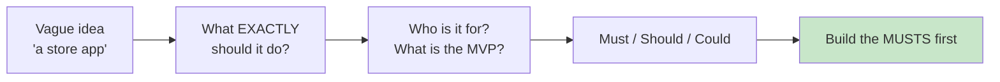
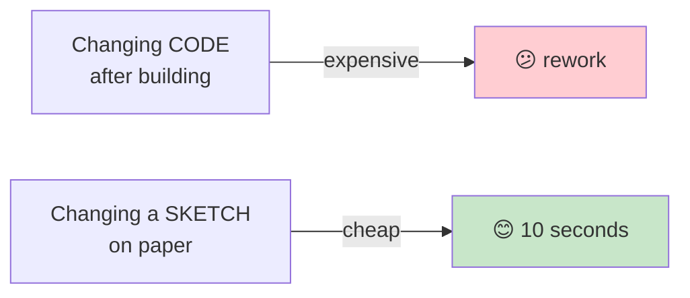
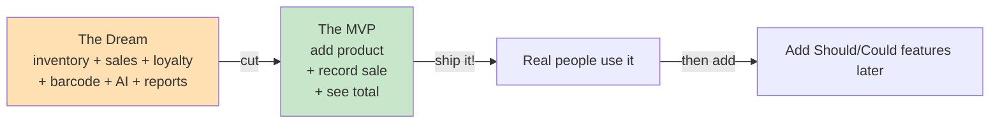
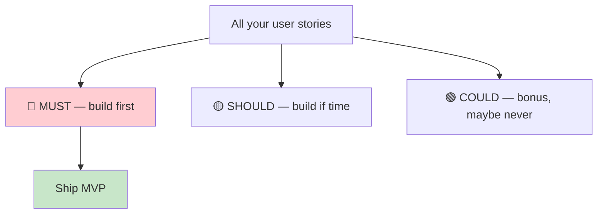

# Requirements & User Stories: Build the Right Thing

**Grade 10 - ICT (Full-Stack Elective)**
**Quarter 1 · Week 7**
**Duration:** 1 week
**Prerequisite:** [`html`](../html/lecture.md) (you've seen a webpage — now learn to *plan* one)

---

## 🎯 Learning Objectives

By the end of this lecture, you will be able to:

1. ✅ Turn a vague idea ("I want to make an app") into **specific, buildable features**
2. ✅ Write **user stories** in the standard format (*As a __, I want __, so that __*)
3. ✅ Sketch a **low-fi wireframe** before writing any code
4. ✅ Define an **MVP** (Minimum Viable Product) and separate it from the "dream" features
5. ✅ Prioritize features using **Must / Should / Could**
6. ✅ Explain why **building the right thing** matters more than building fast

---

## 📖 Table of Contents

1. [Why Most Student Apps Fail Before Line One](#section-1)
2. [From Idea to Features](#section-2)
3. [User Stories: The Standard Format](#section-3)
4. [Wireframing: Sketch Before You Code](#section-4)
5. [MVP: Minimum Viable Product](#section-5)
6. [Prioritizing: Must / Should / Could](#section-6)
7. [When to Use User Stories](#section-7)
8. [Mini-Projects](#mini-projects)
9. [Final Challenge](#final-challenge)
10. [Troubleshooting](#troubleshooting)
11. [What's Next?](#whats-next)

---

<a name="section-1"></a>
## 1. Why Most Student Apps Fail Before Line One

### **The Common Scene**

> Teacher: "Build an app for your community."
> Student: "I'll make a sari-sari store app with inventory, sales, a loyalty program, barcode scanning, an AI chatbot, and a mobile version!"

**Three weeks later:** none of it works, because the student tried to build **everything** and finished **nothing**.

### **The Real Problem Isn't Coding**

Most failed apps don't fail because the developer couldn't code. They fail because:
- ❌ The goal was **too vague** ("make it good").
- ❌ The scope was **too big** (tried to build the dream, not the minimum).
- ❌ Nobody decided **what matters most**.



> 📌 **Coding is the last step.** Planning is the first. A well-planned simple app beats a chaotic ambitious one — every time.

---

<a name="section-2"></a>
## 2. From Idea to Features

### **Ask the Three Planning Questions**

Before writing a single line of code, answer:

1. **Who is the user?** (A sari-sari store owner? A barangay secretary? A student?)
2. **What problem am I solving?** (Tracking stock? Recording clearances? Organizing homework?)
3. **What are the smallest set of features that solve it?** (That's your MVP — Section 5.)

### **Example: The Sari-Sari Store App**

| ❌ Vague | ✅ Specific |
|---|---|
| "An app for a store" | "A web app where a sari-sari store owner can add products, record each sale, and see today's total sales." |
| "Make it look nice" | "On a phone, show a list of products with a big *Record Sale* button." |
| "It should do everything" | "Must: add product, record sale, see total. Could (later): barcode, loyalty, reports." |

Notice how "specific" turns a daydream into **tasks you can actually build and finish**.

---

<a name="section-3"></a>
## 3. User Stories: The Standard Format

A **user story** is one feature, written from the user's point of view, in a fixed sentence:

> **As a** `[type of user]`**, I want** `[an action]`**, so that** `[a benefit]`**.**

### **Worked Examples (sari-sari store)**

✅ *"As a* **store owner**, *I want to* **add a new product with its name and price**, *so that* **I can start tracking it**."*

✅ *"As a* **store owner**, *I want to* **record a sale by choosing a product and quantity**, *so that* **my inventory and sales update automatically**."*

✅ *"As a* **store owner**, *I want to* **see today's total sales on the home page**, *so that* **I know how the day went at a glance**."*

### **The Three Parts**

```mermaid
flowchart LR
    R["As a... (Role)"] -->|"who?"| A["I want to... (Action)"]
    A -->|"what?"| B["so that... (Benefit)"]
    B -->|"why?"
    style R fill:#bbdefb
    style A fill:#fff9c4
    style B fill:#c8e6c9
```

| Part | Question | Bad | Good |
|---|---|---|---|
| **Role** | Who? | "the user" (too vague) | "store owner", "barangay secretary" |
| **Action** | What? | "use the app" | "record a sale" |
| **Benefit** | Why? | (missing) | "so my inventory updates" |

> 💡 **The "so that" is the most important part.** If you can't state the benefit, the feature probably isn't worth building.

### **Bad vs Good Stories**

❌ *"As a user, I want a dashboard."* (Who? What dashboard? Why?)

✅ *"As a store owner, I want to see my top 5 best-selling products this week, so that I know what to restock."*

**🎯 Try It:** Open [`assets/user-story-template.html`](assets/user-story-template.html). Write 5 user stories for an app of your choice (a barangay service app, a school club app, etc.). Use the template — fill in Role, Action, Benefit for each.

---

<a name="section-4"></a>
## 4. Wireframing: Sketch Before You Code

A **wireframe** is a rough drawing of what each screen will look like — **boxes and labels, no colors, no real code**. You sketch it *before* building, so you can change your mind cheaply.

### **Why Wireframe?**



- ✅ It's **fast** — a paper sketch takes 5 minutes.
- ✅ It catches **missing pieces** ("oh, where does the user log out?").
- ✅ It's **shareable** — show the store owner the sketch and ask "is this what you need?" *before* you build the wrong thing.

### **Tools (Pick One)**

- 📝 **Paper and pencil** — the best tool. Truly. Start here.
- ✏️ **Excalidraw** (free, online) — clean hand-drawn-style boxes.
- 🖥️ A simple HTML skeleton with gray boxes and labels.

### **What a Wireframe Contains**

For each screen, draw:
- The **page title**.
- **Where each major element goes** (a box for the product list, a box for the *Add* button, a box for the total).
- **Labels** inside boxes ("Product name", "Price", "Record Sale").

> 📌 **Low-fidelity is the point.** Don't draw colors or fonts. You're planning *layout and flow*, not decorating.

---

<a name="section-5"></a>
## 5. MVP: Minimum Viable Product

The **MVP** is the **smallest version of your app that actually solves the user's problem**. Everything else is a "nice to have."

### **The MVP Mindset**

> "What is the **bare minimum** that a real person would find useful?"



### **Sari-Sari Store: Dream vs MVP**

| | The Dream 🌙 | The MVP ✅ |
|---|---|---|
| Products | Add/edit/delete + barcode scan + photos | **Add a product (name + price)** |
| Sales | Record sale + loyalty points + receipt PDF | **Record a sale (product + qty)** |
| Reports | Weekly charts + top sellers + predictions | **See today's total sales** |

The MVP is **3 features**. You can build that. The dream is **9+ features** — you can't, not first.

> 📌 **Ship the MVP first.** A small finished app that someone uses beats a big unfinished app that nobody uses.

---

<a name="section-6"></a>
## 6. Prioritizing: Must / Should / Could

Once you have a list of user stories, sort them with the **MoSCoW** method:

| Label | Meaning | Example |
|---|---|---|
| 🔴 **Must** | Without this, the app is useless. | "Add product", "Record sale" |
| 🟡 **Should** | Important, but the app works without it for now. | "Edit/delete a product" |
| 🟢 **Could** | Nice to have, only if time allows. | "Sales chart", "barcode scan" |



### **The Rule**

**Build all the MUSTs first.** Only when every Must works do you move to Shoulds, then Coulds. Most students do the opposite (start with the fun "Could" features) and never finish the Musts.

> 💡 This is exactly how professionals ship. A feature that's "nice" but unbuilt is fine. A feature that's "must" but broken means the app failed.

**🎯 Try It:** In [`assets/user-story-template.html`](assets/user-story-template.html), take your user stories and tag each as Must / Should / Could. Then draw a line: everything above the line is your MVP.

---

<a name="section-7"></a>
## 7. When to Use User Stories

✅ **Use them when:**
- Starting **any new project** (even a small one).
- Working with a **real client/stakeholder** (barangay, store owner).
- Planning a **group capstone** — so everyone agrees on what to build.
- You feel **overwhelmed** by a big idea (break it into stories).

❌ **Skip them when:**
- Doing a **quick practice exercise** with fixed instructions.
- **Experimenting/learning** a new technique (just play).

> 📌 For your **capstone**, user stories aren't optional — they're how you and your team agree on scope and avoid building the wrong thing.

---

<a name="mini-projects"></a>
## 8. Mini-Projects

### **Mini-Project 1: Story Writer** (Beginner)
Pick a real problem in your community (barangay service queue, school lost-and-found, class schedule). Write **8 user stories** using the As/I want/So that format. Use [`assets/user-story-template.html`](assets/user-story-template.html).

### **Mini-Project 2: Wireframe on Paper** (Beginner)
For your MVP, sketch the **main screen** and **one action screen** on paper (or Excalidraw). Label every box. Show it to a classmate and ask: "Can you tell what this app does?" If they can't, redraw it clearer.

### **Mini-Project 3: Scope Cut** (Intermediate)
Take a "dream" feature list of 12 items for an app. Cut it to an MVP of **3–4 Musts**. Justify each cut: why is it a Should/Could and not a Must?

---

<a name="final-challenge"></a>
## 9. Final Challenge

### **The One-Page Product Brief**

For a real stakeholder (a sari-sari store, a barangay office, a school club), produce a **single page** containing:

1. **The problem** in one sentence.
2. **The user** (who).
3. **5 user stories** (As/I want/So that).
4. **The MVP**: which stories are Musts (circle them).
5. **One wireframe** of the main screen.

Show this brief to the stakeholder (or your teacher) and ask: *"Is this what you need?"* **Before you write any code.** Their answer will save you hours of building the wrong thing.

---

<a name="troubleshooting"></a>
## 10. Troubleshooting

### **Problem: "I can't think of user stories"**
Start with the user's **worst pain**. What annoys them today? "As a store owner, I hate counting inventory by hand, so I want…" → that's a story.

### **Problem: "All my stories feel like Musts"**
If everything is a Must, nothing is. Force yourself to mark at least **half** as Should/Could. The MVP must be small enough to finish.

### **Problem: "My wireframe keeps changing"**
Good — that's the point! Sketches are cheap to change. Settle the layout on paper *before* coding, not after.

### **Problem: "The stakeholder wants everything"**
That's normal. Your job is to say: *"Let's build the core first (MVP), get it working, then add more."* Professionals do this every day.

---

<a name="whats-next"></a>
## 11. What's Next?

### **You Now Know:**
✅ Why planning beats diving into code
✅ The three planning questions (who / what problem / what MVP)
✅ The user-story format (As a / I want / so that)
✅ How to wireframe before building
✅ What an MVP is and why it wins
✅ Must / Should / Could prioritization

### **Coming Up Next**
You'll use these stories throughout the year. In **Quarter 3**, your user stories become **database tables** (see [`data-modeling`](../data-modeling/lecture.md)). In **Quarter 4**, your capstone **starts** with a product brief like the one in the Final Challenge.

### **The Big Idea**
> The best developers aren't the fastest coders — they're the ones who build **the right thing**. A simple app that solves a real problem beats a fancy app that solves the wrong one.

---

**📝 Quick Reference Card**

```
PLANNING — 3 QUESTIONS
1. WHO is the user?
2. WHAT problem am I solving?
3. WHAT is the smallest set of features that solves it (MVP)?

USER STORY FORMAT
As a [role], I want [action], so that [benefit].
• Role   = who  (store owner, secretary)
• Action = what (record a sale)
• Benefit= why  (inventory updates)

MVP = Minimum Viable Product
The bare minimum that's actually useful.
Ship the MVP FIRST, then add more.

PRIORITIZE (MoSCoW)
🔴 MUST   — build first (the MVP)
🟡 SHOULD — build if time allows
🟢 COULD  — bonus, maybe never

WIREFRAME before you CODE.
Paper sketch = cheap to change. Code = expensive to change.
```

---

**End of Requirements & User Stories Lecture**

*Created for Grade 10 Filipino Students*
*Philippine Context, Real-World Examples, Practical Skills*
