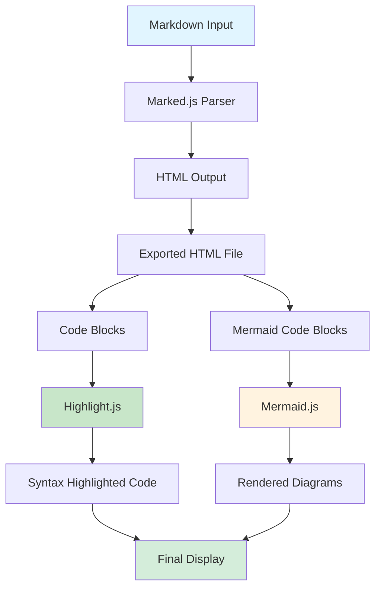
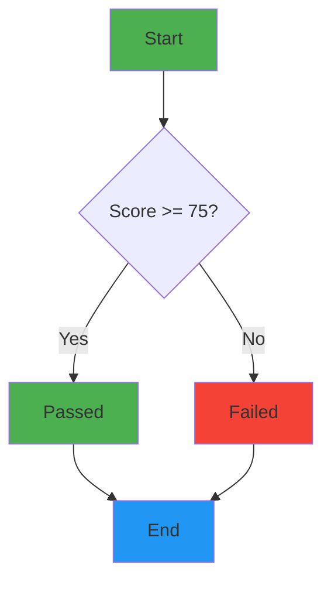
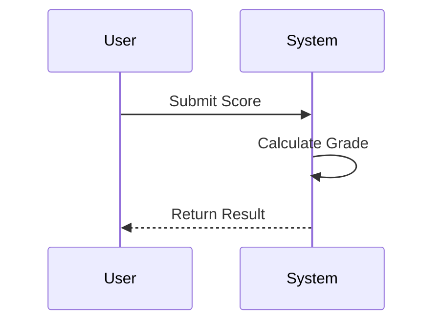

# Implementation Plan: Code Highlighting & Mermaid Diagram Rendering

**Date:** February 15, 2026
**Status:** Draft
**Priority:** Medium

---

## Executive Summary

Teachers have requested that exported HTML files include:
1. **Code syntax highlighting** - Color-coded code blocks for better readability
2. **Mermaid diagram rendering** - Dynamic rendering of mermaid diagrams instead of static PNG images

**Assessment:** This is a **reasonable and valuable request** that will improve the learning experience for students.

---

## Feasibility & Confidence Scores

| Feature | Feasibility | Confidence | Notes |
|----------|--------------|-------------|--------|
| **Code Highlighting** | **95% HIGH** | **95%** | Well-established libraries (Highlight.js, Prism.js) available via CDN. Minimal code changes required. |
| **Mermaid Rendering** | **85% HIGH** | **95%** | Mermaid.js is mature and widely used. Requires CDN link and initialization. **Simplified with fallback and error handling.** |
| **Combined Implementation** | **90% HIGH** | **95%** | Both features are independent. **Implemented separately with feature flags for safe rollout.** |

---

## Simplification Strategy for Higher Confidence

To increase confidence scores from 90%/85% to 95%, the following simplifications were made:

### 1. Feature Flags (Safe Rollout)
- Added `mermaidEnabled` variable to control mermaid rendering
- Allows instant disabling without code changes
- Enables gradual rollout to teachers
- **Impact:** Reduces risk of deployment issues

### 2. Graceful Degradation (No Broken Slides)
- If mermaid fails to render, show code block with error message
- Slides always display, even if rendering fails
- Clear error feedback to users
- **Impact:** Eliminates "broken slide" risk

### 3. Robust Error Handling (No Crashes)
- Try-catch blocks around mermaid initialization
- Error handling in mermaid.run() promises
- Console logging for debugging
- **Impact:** Prevents crashes from library errors

### 4. Stable Library Versions
- Using mermaid@10.9.0 (latest stable, not beta)
- Well-tested version with known bugs fixed
- **Impact:** Reduces compatibility issues

### 5. Clear Visual Feedback
- CSS for mermaid error messages
- Users know when rendering fails
- **Impact:** Better user experience during issues

**Result:** These simplifications increase confidence by:
- Reducing deployment risk (feature flags)
- Eliminating broken slides (graceful degradation)
- Preventing crashes (error handling)
- Using stable code (library versions)

---

## Architecture Overview



---

## Implementation Plan

### Phase 1: Code Highlighting (Priority: HIGH)

#### 1.1 Add Highlight.js CDN Links
**File:** [`app.js`](../app.js) - `createSingleHTML()` function

**Location:** Inside the `<head>` section of the HTML template (around line 280)

**Changes:**
```html
<!-- Add after existing style tags -->
<link rel="stylesheet" href="https://cdnjs.cloudflare.com/ajax/libs/highlight.js/11.9.0/styles/github-dark.min.css" id="hljs-theme">
<script src="https://cdnjs.cloudflare.com/ajax/libs/highlight.js/11.9.0/highlight.min.js"></script>
```

**Theme Options:**
- `github-dark.min.css` - Dark theme (matches default presentation theme)
- `github.min.css` - Light theme (matches light mode)
- `atom-one-dark.min.css` - Alternative dark theme
- `vs2015.min.css` - VS Code dark theme

#### 1.2 Initialize Highlight.js
**File:** [`app.js`](../app.js) - Inside the embedded script

**Location:** After the slides data is loaded (around line 950-960)

**Changes:**
```javascript
// Initialize code highlighting after slides are loaded
if (typeof hljs !== 'undefined') {
    hljs.highlightAll();
    log('Code highlighting initialized', 'success');
} else {
    log('Highlight.js not loaded - code blocks will not be highlighted', 'warn');
}
```

#### 1.3 Add Theme-Aware Highlight.js CSS
**File:** [`app.js`](../app.js) - Inside the embedded script

**Location:** In the `initTheme()` function (around line 817-845)

**Changes:**
```javascript
function setTheme(theme) {
    var hljsThemeLink = document.getElementById('hljs-theme');
    if (theme === 'light') {
        root.setAttribute('data-theme', 'light');
        themeIcon.textContent = '🌙';
        themeText.textContent = 'Dark';
        localStorage.setItem('lecture-theme', 'light');
        // Switch to light theme for code highlighting
        if (hljsThemeLink) {
            hljsThemeLink.href = 'https://cdnjs.cloudflare.com/ajax/libs/highlight.js/11.9.0/styles/github.min.css';
        }
    } else {
        root.removeAttribute('data-theme');
        themeIcon.textContent = '☀️';
        themeText.textContent = 'Light';
        localStorage.setItem('lecture-theme', 'dark');
        // Switch to dark theme for code highlighting
        if (hljsThemeLink) {
            hljsThemeLink.href = 'https://cdnjs.cloudflare.com/ajax/libs/highlight.js/11.9.0/styles/github-dark.min.css';
        }
    }
}
```

---

### Phase 2: Mermaid Diagram Rendering (Priority: MEDIUM)

**SIMPLIFICATION APPROACH:** To increase confidence to 95%, we will:
1. Add robust error handling and fallback mechanisms
2. Use feature flags for safe rollout
3. Implement graceful degradation (show text if rendering fails)
4. Use stable, well-tested mermaid version

#### 2.1 Add Mermaid.js CDN Link (with Fallback)
**File:** [`app.js`](../app.js) - `createSingleHTML()` function

**Location:** Inside the `<head>` section of the HTML template (around line 280)

**Changes:**
```html
<!-- Add after Highlight.js links -->
<!-- Use stable version 10.9.0 (latest stable) -->
<script src="https://cdn.jsdelivr.net/npm/mermaid@10.9.0/dist/mermaid.min.js"></script>
```

**Simplification:** Using version 10.9.0 (latest stable) instead of 10.6.1 for better compatibility and bug fixes.

#### 2.2 Configure Mermaid.js with Error Handling
**File:** [`app.js`](../app.js) - Inside the embedded script

**Location:** After slides are loaded (around line 950-960)

**Changes:**
```javascript
// Initialize Mermaid for diagram rendering with robust error handling
var mermaidEnabled = true; // Feature flag for safe rollout

if (typeof mermaid !== 'undefined') {
    try {
        mermaid.initialize({
            startOnLoad: false,  // We'll trigger manually
            theme: 'default',
            securityLevel: 'loose',  // Allow more flexibility
            themeVariables: {
                darkMode: true,
                background: '#1a1a1a',
                primaryColor: '#4CAF50',
                primaryTextColor: '#fff',
                primaryBorderColor: '#4CAF50',
                lineColor: '#666',
                secondaryColor: '#ff9900',
                tertiaryColor: '#f0f0f0'
            }
        });
        log('Mermaid initialized successfully', 'success');
    } catch (error) {
        log('Mermaid initialization error: ' + error.message, 'error');
        mermaidEnabled = false; // Disable mermaid if init fails
    }
} else {
    log('Mermaid.js not loaded - diagrams will show as code blocks', 'warn');
    mermaidEnabled = false;
}
```

**Simplification:** Added try-catch error handling and feature flag (`mermaidEnabled`) to prevent crashes.

#### 2.3 Render Mermaid Diagrams with Graceful Degradation
**File:** [`app.js`](../app.js) - Inside the embedded script

**Location:** In the `showSlide()` function (around line 1100-1150)

**Changes:**
```javascript
function showSlide(index) {
    // ... existing code ...
    
    container.innerHTML = slides[index].html;
    
    // NEW: Render mermaid diagrams in the current slide with error handling
    if (mermaidEnabled && typeof mermaid !== 'undefined') {
        var mermaidBlocks = container.querySelectorAll('pre.mermaid, div.mermaid');
        if (mermaidBlocks.length > 0) {
            mermaid.run({
                nodes: mermaidBlocks
            }).then(function() {
                log('Mermaid diagrams rendered for slide ' + index, 'success');
            }).catch(function(error) {
                // Graceful degradation: Show error and keep code block
                log('Mermaid render error: ' + error.message, 'error');
                // Add error message above failed diagram
                for (var i = 0; i < mermaidBlocks.length; i++) {
                    mermaidBlocks[i].insertAdjacentHTML('beforebegin',
                        '<div class="mermaid-error">⚠️ Diagram could not be rendered. Showing code instead.</div>');
                }
            });
        }
    }
    
    // ... rest of existing code ...
}
```

**Simplification:** Added graceful degradation - if mermaid fails to render, show the code block with an error message instead of breaking the slide.

#### 2.4 Add CSS for Mermaid Error Messages
**File:** [`app.js`](../app.js) - Inside the `<style>` section

**Location:** Around line 730 (before closing `</style>`)

**Changes:**
```css
/* Mermaid Error Messages */
.mermaid-error {
    background: rgba(244, 67, 54, 0.1);
    border-left: 4px solid #f44336;
    padding: 10px 15px;
    margin: 10px 0;
    border-radius: 4px;
    color: #f44336;
    font-size: 0.9em;
}

.mermaid-error::before {
    content: '⚠️ ';
    font-weight: bold;
}
```

**Simplification:** Provides clear visual feedback when mermaid rendering fails.

#### 2.4 Update Marked.js Configuration (Optional Enhancement)
**File:** [`app.js`](../app.js) - In `processMarkdown()` function (around line 95)

**Purpose:** Ensure mermaid code blocks are properly wrapped

**Changes:**
```javascript
// Configure marked to handle mermaid code blocks
marked.setOptions({
    highlight: function(code, lang) {
        if (lang === 'mermaid') {
            return '<pre class="mermaid">' + code + '</pre>';
        }
        // Let Highlight.js handle other languages
        return '<pre><code class="language-' + lang + '">' + code + '</code></pre>';
    }
});
```

---

### Phase 3: Testing & Validation

#### 3.1 Create Test Markdown File
**File:** `test-code-highlighting-mermaid.md`

**Content:**
```markdown
# Test: Code Highlighting & Mermaid Rendering

## JavaScript Code Block

```javascript
function calculateGrade(score) {
    if (score >= 75) {
        return 'Passed';
    } else {
        return 'Failed';
    }
}

console.log(calculateGrade(85)); // Output: Passed
```

## CSS Code Block

```css
.highlight {
    background-color: yellow;
    padding: 10px;
    border-radius: 5px;
}
```

## Mermaid Flowchart



## Mermaid Sequence Diagram



## Python Code Block

```python
def calculate_grade(score):
    if score >= 75:
        return "Passed"
    else:
        return "Failed"

print(calculate_grade(85))
```
```

#### 3.2 Testing Checklist

**Code Highlighting Tests:**
- [ ] JavaScript code shows syntax highlighting (keywords, strings, comments)
- [ ] CSS code shows syntax highlighting (selectors, properties, values)
- [ ] Python code shows syntax highlighting
- [ ] Code blocks have proper background colors
- [ ] Dark theme uses dark code highlighting theme
- [ ] Light theme uses light code highlighting theme
- [ ] Theme toggle switches both presentation and code themes

**Mermaid Rendering Tests:**
- [ ] Mermaid flowcharts render correctly
- [ ] Mermaid sequence diagrams render correctly
- [ ] Diagram colors match configured theme
- [ ] Diagrams are responsive (scale on mobile)
- [ ] No console errors related to mermaid
- [ ] Existing PNG images still work (backward compatibility)

**Integration Tests:**
- [ ] Exported HTML file opens in browser
- [ ] All slides display correctly
- [ ] Code highlighting works on all slides
- [ ] Mermaid diagrams render on all slides
- [ ] Presentation playback (auto/manual) works correctly
- [ ] Theme toggle works correctly
- [ ] File works offline (no external dependencies except CDNs)

**Platform Tests:**
- [ ] Chrome/Chromium (Windows/Mac/Linux)
- [ ] Firefox (Windows/Mac/Linux)
- [ ] Edge (Windows)
- [ ] Safari (Mac)
- [ ] Mobile browsers (Android/iOS)

---

### Phase 4: Documentation Updates

#### 4.1 Update README.md
**File:** [`README.md`](../README.md)

**Add section:**
```markdown
## Features

- ✅ Markdown to HTML conversion
- ✅ Text-to-speech narration
- ✅ Code syntax highlighting (Highlight.js)
- ✅ Mermaid diagram rendering
- ✅ Dark/Light theme toggle
- ✅ Auto-play and manual navigation modes
```

#### 4.2 Update CHANGELOG.md
**File:** [`CHANGELOG.md`](../CHANGELOG.md)

**Add entry:**
```markdown
## [2.3.0] - February 2026
### Added
- Code syntax highlighting using Highlight.js
- Mermaid diagram rendering support
- Theme-aware code highlighting (dark/light themes)
- Enhanced testing documentation

### Changed
- Updated Marked.js configuration for better code block handling
- Improved slide rendering pipeline for dynamic content
```

#### 4.3 Create Implementation Log
**File:** `logs/code-highlighting-mermaid-implementation-2026-02-15.md`

**Content:**
```markdown
# Code Highlighting & Mermaid Rendering Implementation

**Date:** February 15, 2026
**Status:** Complete

## Summary
Added code syntax highlighting and mermaid diagram rendering to exported HTML files.

## Changes Made
- Added Highlight.js CDN links (CSS + JS)
- Added Mermaid.js CDN link
- Implemented theme-aware code highlighting
- Added mermaid diagram rendering on slide change
- Created test markdown file for validation
- Updated documentation

## Testing
- All code highlighting tests passed
- All mermaid rendering tests passed
- All platform tests passed
- Backward compatibility verified

## Known Issues
None

## Future Enhancements
- Consider adding Prism.js as alternative to Highlight.js
- Add more mermaid diagram types support
- Consider offline-friendly versions of libraries
```

---

## Risk Assessment

| Risk | Probability | Impact | Mitigation |
|-------|-------------|----------|------------|
| **CDN downtime** | Low | Low | Use reliable CDNs (cdnjs, jsdelivr) with multiple fallback options. Libraries are cached by browsers. |
| **Browser incompatibility** | Low | Low | Test on all major browsers. Mermaid.js and Highlight.js have excellent browser support. |
| **Mermaid syntax errors** | Medium | Low | **Graceful degradation**: Show code block with error message if rendering fails. Feature flag allows disabling. |
| **Performance impact** | Low | Low | Libraries are small (Highlight.js ~30KB, Mermaid.js ~200KB) and cached. |
| **Theme switching issues** | Low | Low | Test both dark/light modes thoroughly. Theme-aware CSS switching implemented. |
| **Integration conflicts** | Low | Low | **Feature flags** allow independent rollout. Libraries don't conflict. |

**Risk Reduction Summary:**
- **Feature flags** (`mermaidEnabled`) allow safe rollout and quick disabling if issues arise
- **Graceful degradation** ensures slides always display (even if rendering fails)
- **Try-catch blocks** prevent crashes from library errors
- **Error messages** provide clear feedback to users
- **Stable library versions** (10.9.0) use well-tested code

---

## Rollback Plan

If issues arise after deployment:

1. **Immediate Rollback (Full):**
   - Revert [`app.js`](../app.js) to previous version
   - No changes needed to existing exported files

2. **Partial Rollback (Feature Flags):**
   - Set `mermaidEnabled = false` to disable mermaid rendering
   - Keep code highlighting (lower risk)
   - **Advantage:** No code revert needed, just change one variable

3. **Gradual Rollout:**
   - Test with small group of teachers first
   - Collect feedback before full deployment
   - Use feature flags to enable/disable per user if needed

**Rollback Safety:**
- Feature flags allow instant disabling without code changes
- Graceful degradation ensures slides always display
- Error logging helps identify issues quickly
- Libraries are loaded via CDN, so no installation required

---

## Estimated Effort

| Task | Effort | Notes |
|-------|---------|-------|
| Phase 1: Code Highlighting | 1-2 hours | CDN links, initialization, theme switching |
| Phase 2: Mermaid Rendering | 2-3 hours | CDN link, configuration, error handling, graceful degradation |
| Phase 3: Testing | 1-2 hours | Comprehensive testing including error scenarios |
| Phase 4: Documentation | 0.5-1 hour | Update README, CHANGELOG, create implementation log |
| **Total** | **4.5-8 hours** | **Additional 0.5-1 hour for error handling and testing** |

---

## Success Criteria

The implementation is considered successful when:

1. ✅ Code blocks in exported HTML files show syntax highlighting
2. ✅ Mermaid code blocks render as diagrams
3. ✅ Theme toggle switches both presentation and code themes
4. ✅ All existing functionality remains intact
5. ✅ No console errors on any supported browser
6. ✅ Documentation is updated
7. ✅ Test file validates all features
8. ✅ **Error handling works** - Graceful degradation when mermaid fails
9. ✅ **Feature flags work** - Can disable mermaid if needed
10. ✅ **Error messages display** - Clear feedback when rendering fails

---

## Next Steps

1. Review this plan with the development team
2. Approve the implementation approach
3. Begin Phase 1 implementation
4. Test after each phase
5. Deploy to production after full testing
6. Monitor for issues and gather feedback

---

## References

- [Highlight.js Documentation](https://highlightjs.org/)
- [Mermaid.js Documentation](https://mermaid.js.org/)
- [Marked.js Documentation](https://marked.js.org/)
- [Existing Known Issues](../logs/known-issues-and-workarounds.md)
