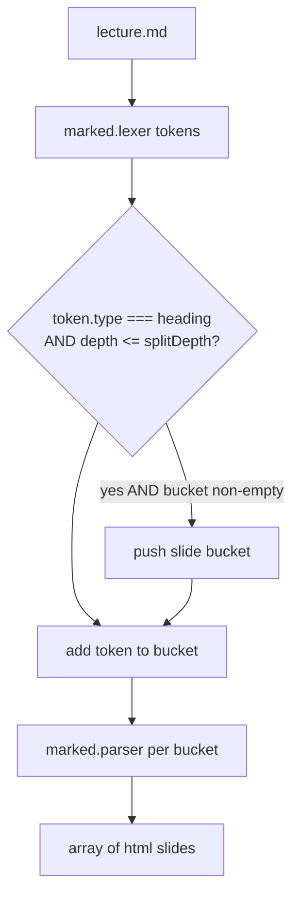

# Phase 2a Plan — Core: `splitSlides` + `createSingleHTML` template port

**Scope (this phase only):** port the slide-splitting logic and the presentation HTML
template into the Node **shared core** (`scripts/lib/`), with tests. This is the foundation
every later phase builds on.

**Explicitly NOT in 2a** (later phases):
- Image inlining as data URIs → **Phase 2b**
- Bundling highlight.js + mermaid locally → **Phase 2c** (so the 2a output still carries CDN `<script>` tags — expected, not a bug)
- Wiring the full `build.js` CLI + `check.js` linter → **Phase 3**
- Express `/export` route → **Phase 4**

The "zero external URLs" acceptance gate is Phase 5/9, so a 2a export legitimately still references CDNs.

---

## Source being ported (from `app.js`, the original browser tool)

| Original | Lines | What it does | Port target |
|---|---|---|---|
| [`processMarkdown`](../app.js:95) | 95–123 | `marked.parse` → DOM walk → split on **every** heading (`H1`–`H6`) | `scripts/lib/split-slides.mjs` |
| [`createSingleHTML`](../app.js:270) | 270–1503 | full presentation HTML (theme CSS + body + runtime player JS) | `scripts/lib/template.mjs` |
| base-URL export | 239–267 | prepend `roycan.github.io/...` to image `src` | **DROPPED (D6 — dead path)** |

Slide data injects at [`app.js:833`](../app.js:833): `<script id="slides-data" type="application/json">…</script>`.

---

## ⚠️ Key decision: split depth (needs your sign-off)

The original DOM code split on **all** headings. Real lectures use `###`/`####` as
**sub-content inside a section**:

```
## CSS Selectors - Part 1      ← section → its own slide
### Element Selectors          ← meant to stay INSIDE the section slide
### Class Selectors
### ID Selectors
```



- **Recommendation: split on `#`/`##` only (depth ≤ 2).** `###`/`####` render as content within the section slide.
  - Evidence: `css` → ~21 slides (vs ~70 micro-slides if all headings split); `database-sqlite` has dozens of `#### Example N` that must NOT each become a slide.
- This matches the locked convention in [`context.md`](../inceptions/context.md) §7: *"`#`/`##` headings split slides."*
- Made configurable via `splitDepth` (default 2) so it can be tuned per lecture later.

## Other small decisions (will just implement, noted for transparency)

1. **Title source** → first slide's `H1`/`H2` text; fallback `'Lecture Presentation'`. (`createSingleHTML` hard-coded the title.)
2. **CDN lib tags kept** in the 2a template (highlight.js + mermaid) — replaced with bundled copies in 2c.
3. **marked v15 token API** → `marked.lexer(md)` then `marked.parser(groupTokens)` per slide bucket; carry the token list's `.links` (reference defs) onto each group so inline links/footnotes resolve.

---

## Deliverables

| File | Purpose |
|---|---|
| [`scripts/lib/split-slides.mjs`](../scripts/lib/split-slides.mjs) | `splitSlides(md, {splitDepth=2}) → [{html}]` (token-based, no DOM) |
| [`scripts/lib/template.mjs`](../scripts/lib/template.mjs) | `renderPresentation(slides, {title}) → string` (verbatim `createSingleHTML` port; drops base-URL; injects slides JSON + title) |
| [`scripts/lib/index.mjs`](../scripts/lib/index.mjs) | barrel export — single import surface for CLI + server (D5) |
| [`scripts/test/split-slides.test.js`](../scripts/test/split-slides.test.js) | counts; depth-2 keeps `###` inside slide; empty input; `####` grouping |
| [`scripts/test/template.test.js`](../scripts/test/template.test.js) | valid `<!doctype html>`; slides JSON present + `</script>`-escaped; title injected; runtime marker present |

**Tests stay green:** existing `scaffold.test.js` (1) + 2 new files.

## Done-when

- [ ] `splitSlides` ports the heading logic using `marked.lexer` tokens (no DOM), depth ≤ 2 default.
- [ ] `renderPresentation` reproduces the `createSingleHTML` output (same CSS/body/runtime JS), minus the dead base-URL branch.
- [ ] `scripts/lib/index.mjs` re-exports both; `npm test` green (3 files).
- [ ] Manual sanity: run `splitSlides` on a real lecture (e.g. `css`) → ~21 slides, no `###` shattered out.
- [ ] Commit as `feat(core): splitSlides + presentation template (Phase 2a)`.
