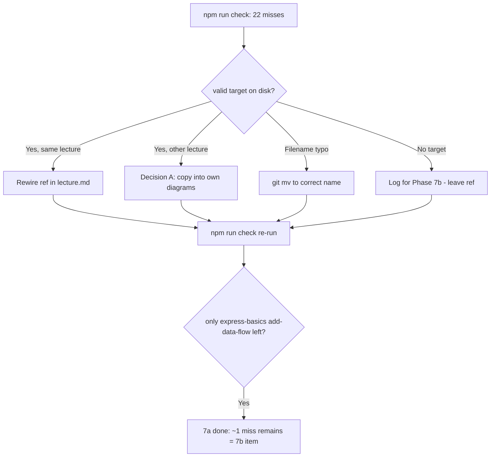

# Phase 7a Plan — Rewire broken image/asset refs

> Source of truth = **`npm run check`** (live), NOT the inventory §2b snapshot (stale — see §3).
> Authoritative phase prompt: [`plans/session-prompts/phase-7a.md`](session-prompts/phase-7a.md).

## 0. Baseline (verified on-disk)

- Branch `reorg`. Phases 0,1,6,2a,2b,2c,3 done. `npm test` = 53 pass.
- `npm run check` currently exits **1** with **22 misses across 8 lectures**.
- `scanMissingImages` ([`scripts/lib/inline-images.mjs`](../scripts/lib/inline-images.mjs)) reports each miss as `{ slideIndex, resolvedPath, src }`; refs resolve **relative to the lecture folder**. The root cause is the **`lecture.md`** Markdown path — we edit Markdown, not built HTML.

## 1. Live worklist (22 misses → classified against on-disk evidence)

| # | Slug | Misses | Verified root cause | 7a action |
|---|---|---|---|---|
| 1 | `css` | 7 | refs `assets/*.png`; files at `diagrams/` (D9 move). Refs: `css-cascade-flow`, `css-style-breakdown`, `css-application-methods`, `css-selector-types`, `css-color-systems`, `css-box-model-nested-structure`, `simple-navigation-bar-structure` | Rewire `assets/X.png` → `diagrams/X.png` in [`lecture.md`](../lectures/css/lecture.md) |
| 2 | `tmc-eval360` | 8 | refs `tmc-eval360/X.png`; 8 PNGs physically at `assets/` (`set2024`,`ratings5`,`profile`,`login360`,`cycles360`,`questions360`,`users360`,`report360`) | Rewire `tmc-eval360/X.png` → `assets/X.png` in [`lecture.md`](../lectures/tmc-eval360/lecture.md) |
| 3 | `authentication-sessions` | 1 | ref `diagrams/supplementary/middleware-stack.png` (ghost `supplementary/` subdir); file at `diagrams/middleware-stack.png` | Rewire → `diagrams/middleware-stack.png` |
| 4 | `ajax-fetch` | 1 | ref `diagrams/promise-state.png`; file is `diagrams/promise-states.png` (missing `s`) | Rewire → add trailing `s` |
| 5 | `csv-datatables-qr` | 1 | ref `diagrams/supplementary/datatables-features.png`; file is `diagrams/datables-features.png` (typo **and** ghost `supplementary/` subdir) | `git mv diagrams/datables-features.png → diagrams/datatables-features.png` + rewire ref → `diagrams/datatables-features.png` |
| 6 | `full-stack` | 1 | ref `diagrams/api-testing/analogy.png`; PNG owned by `api-testing` (cross-lecture) | **Decision A**: copy `analogy.png` → `lectures/full-stack/diagrams/analogy.png`, rewire ref to local |
| 7 | `json-api-audit` | 2 | refs `diagrams/advanced-features/{json-backup-restore,system-architecture}.png`; this lecture has **no `diagrams/`**; the 2 PNGs live in `csv-datatables-qr` (cross-lecture) | **Decision A**: copy both → `lectures/json-api-audit/diagrams/advanced-features/` (refs then resolve) |
| 8 | `express-basics` | 1 | ref `diagrams/add-data-flow.png` — **genuinely missing**, no `.mmd`/`.txt` source in `diagramSrc/` | **Log for 7b** — leave ref as-is, do NOT render in 7a |

**Totals:** 21 repathable + 1 truly-missing (express-basics).

## 2. Pattern note — ghost `diagrams/supplementary/` prefix

Both `authentication-sessions` (middleware-stack) and `csv-datatables-qr` (datatables-features) reference a `diagrams/supplementary/` subdir that does not exist; the files live at `diagrams/` top level. Fix per-ref by dropping `supplementary/`. (csv also needs the filename typo fix.)

## 3. ⚠️ Critical correction to the phase prompt's DONE-WHEN

The phase prompt expects post-7a `check` to show **≈13 misses** (testing-quality ×6, responsive-bulma ×4, express-basics ×1, production-best-practices ×2). **This is wrong / stale.** Verified on disk:

- `testing-quality` → all 12 referenced PNGs **exist** (`diagrams/testing-quality/*.png`).
- `responsive-bulma` → all 8 referenced PNGs **exist** (`diagrams/bulma/*.png`).
- `production-best-practices` → all 5 referenced PNGs **exist** (`diagrams/production-best-practices/*.png`).

These lectures are **absent from the live 22-miss check** precisely because their PNGs are present. Therefore, after 7a rewires the 21 repathable refs, `npm run check` should report **only express-basics `add-data-flow.png` (≈1 miss)** — not 13.

**Implication for Phase 7b:** it likely shrinks to a single item — `express-basics/add-data-flow.png` (render from a new source or stub/log a TODO), **not** 13 PNGs. Re-scope 7b against live `check` when reached.

## 4. Decisions to confirm (before coding)

1. **Cross-lecture copies** (full-stack `analogy.png`; json-api-audit's 2 PNGs) → **Recommended: copy into the referencing lecture's own `diagrams/`** for D2 offline self-containment. (Alternative: relative `../other-slug/...` climb — cross-lecture coupling, fragile; rejected.)
2. **csv typo** → **Recommended: `git mv` to correct spelling + rewire ghost `supplementary/` path** (fix at source; D13 never `rm`).
3. **Scope** → 7a = repathable refs **only**; `express-basics/add-data-flow.png` logged for 7b, not rendered. (Confirmed by prompt; reaffirming.)

## 5. Verify / commit

- After each batch: `npm run check` → miss count drops, no new misses.
- `npm run build -- --all` → the 7 repathable lectures now build clean; only `express-basics` still fails (expected, the 7b item).
- `npm test` → 53 pass (no regression).
- Update [`plans/progress.md`](progress.md): Phase 7a → ✅, append Session 9, ▶ RESUME HERE → Phase 7b (note §2b stale; 7b = express-basics only).
- Commit lecture fixes; docs in a separate commit.

## 6. Mermaid — decision flow

