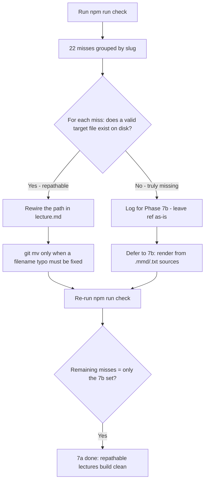

# Session prompt — Phase 7a (rewire broken image/asset refs)

Paste this whole file into a new session to continue without context-window limits.
It tells the new session what to read, where we are, and exactly what to build next.

**Run this phase in Code mode.**

---

## BOOTSTRAP (do this first, in order)

1. Read **[`inceptions/context.md`](../../inceptions/context.md)** — the "second brain": identity (Grade-10 PH CS teacher), the problem, locked decisions **D1–D13** (§6), target architecture (§4), conventions (§7). Note **D9** (CSS PNGs moved `assets/`→`diagrams/`), **D12** (tmc-eval360 canonical copy + PNG locations), **D13** (never delete — `git mv`), and §9 (known image breaks).
2. Read **[`plans/progress.md`](../progress.md)** → find **"▶ RESUME HERE"** (it points to Phase 7a). Skim the Session Log, **especially Session 8 (Phase 3)** — it contains the authoritative worklist and the note that `npm run check` is now the source of truth.
3. Skim **[`plans/reorg-inventory.md`](../reorg-inventory.md)**: §0 (post-move corrections — tmc-eval360 PNG locations), §2a (typo/renamable refs — the *known* subset), §2b (truly-missing PNGs — the **Phase 7b** set, NOT this phase). ⚠️ This inventory is a **stale snapshot**; the live `check` output is broader (it caught cross-lecture misfiles the inventory missed). Reconcile against `check`, not the inventory.
4. Read **[`scripts/check.js`](../../scripts/check.js)** and **[`scripts/lib/inline-images.mjs`](../../scripts/lib/inline-images.mjs)** — the `scanMissingImages(slides,{lectureDir})` helper is what `check` calls; it reports each miss as `{ slideIndex, resolvedPath, src }`. Understand this so you can read the report.
5. Verify on-disk state: `git status` should be clean on branch **`reorg`**; `npm test` → **53 pass, 0 fail**; then **run `npm run check`** — it exits **1** with **22 misses across 8 lectures** (this is expected and IS your worklist).

## CURRENT STATE (where we are)

- Branch `reorg`. Phases **0, 1, 6, 2a, 2b, 2c, 3 done**. All 20 lectures live in `lectures/<slug>/` (each = `lecture.md` + `assets/` + `diagrams/` + `diagram-src/`).
- The shared core is complete and barrel-exported from [`scripts/lib/index.mjs`](../../scripts/lib/index.mjs): `splitSlides`, `inlineImages` (+ its read-only twin `scanMissingImages`), `renderPresentation`, `bundleLibs`/`hasMermaid`, and the orchestrator `buildLecture`.
- The CLI exists: [`scripts/build.js`](../../scripts/build.js) (`--slug`/positional fail-loud; `--all` best-effort + summary) and [`scripts/check.js`](../../scripts/check.js) (scans every `lecture.md`, reports grouped misses, **exits 1 on any miss** — the hard CI gate).
- `npm test` green: **53 tests** (scaffold 1 + split-slides 7 + template 6 + inline-images 13 + bundle-libs 10 + cli 16).
- A clean lecture builds fully offline: `npm run build -- git-github` → `dist/git-github.html` (3.70 MB), zero `cdnjs`/`jsdelivr` URLs, 7 `data:image/png;base64,`.
- **`npm run check` currently exits 1** with **22 missing refs across 8 lectures** — this is the Phase 7a worklist (it is expected; `check` was deliberately shipped RED until 7a/7b fix the known-broken lectures).

## PHASE 7a GOAL

Rewire every broken image/asset ref that has a **valid target on disk** so the lecture builds clean, and **log** (do not render) the truly-missing PNGs for Phase 7b. After 7a, `npm run check` should report **only** the truly-missing PNGs (the §2b set) — every repathable ref is fixed.

### The 22 misses / 8 lectures (authoritative = `npm run check`)

Run `npm run check` to get the **live** grouped report (each row = `slide index | resolved path | src`). The known classifications:

| Slug | Count | Likely cause | 7a action |
|---|---|---|---|
| `css` | 7 | **D9** moved PNGs `assets/`→`diagrams/`, but `lecture.md` still says `assets/css-*.png` | Rewire each ref to `diagrams/css-*.png` in [`lectures/css/lecture.md`](../../lectures/css/lecture.md) |
| `tmc-eval360` | 8 | **D12/§0**: PNGs physically at `lectures/tmc-eval360/assets/`, but `lecture.md` uses inconsistent paths (`tmc-eval360/*.png`, `../assets/tmc-eval360/`) | Rewire all 8 to resolve under the lecture's `assets/` |
| `json-api-audit` | 2 | Run `check`, inspect `src` + `resolvedPath`, find the on-disk target | Rewire to the valid path |
| `csv-datatables-qr` | 1 | **§2a typo**: lecture refs `datatables-features.png` (correct spelling) but the file is `datables-features.png` | Fix the **filename** typo via `git mv` so the correct ref resolves (see decision) |
| `ajax-fetch` | 1 | **§2a typo**: `diagrams/promise-state.png` → actual file is `promise-states.png` | Rewire ref: add trailing `s` |
| `full-stack` | 1 | **§2a** `assets/full-stack.png` → real file at `diagrams/full-stack/full-stack.png`; **also** a cross-lecture misfile `diagrams/api-testing/analogy.png` (owned by `api-testing`) | Rewire to valid path; for the cross-lecture ref see decision |
| `authentication-sessions` | 1 | Run `check`, inspect, find target | Rewire to the valid path |
| `express-basics` | 1 | Likely the truly-missing `add-data-flow` (§2b) | If no on-disk target → **log for 7b**, leave ref |

> Counts may shift slightly once you read the live report — **`npm run check` is the source of truth**, not this table. Classify each miss by whether a target file exists on disk.

### Deliverables

1. **For each of the 22 misses**, classify and act:
   - **Repathable** (a valid target exists somewhere on disk) → fix the path in the source **`lecture.md`** (the Markdown `` ref). `scanMissingImages` reads the *rendered* ``; the **root cause is the `.md` path**, so you edit the Markdown, not built HTML.
   - **Filename typo** (the ref is correct but the *file* is misnamed) → `git mv` the file to the correct name (e.g. csv's `datables-features.png`→`datatables-features.png`).
   - **Truly-missing** (no on-disk target at all) → **leave the ref**, log it for **Phase 7b** (the §2b set: testing-quality ×6, responsive-bulma ×4, express-basics ×1, production-best-practices ×2). Do NOT render anything in 7a.
2. **Re-run `npm run check`** after each batch of fixes to confirm the miss count drops and no new misses appear.
3. **`npm run build -- --all`** → the repathable lectures that previously failed should now build clean; only the 7b lectures (truly-missing PNGs) still fail (expected).
4. Update [`plans/progress.md`](../progress.md): Phase 7a → ✅, append Session 9, ▶ RESUME HERE → Phase 7b. Commit docs separately.

### Non-obvious facts (so you don't re-discover them)

- **`npm run check` is authoritative; the inventory §2/§2b is a stale snapshot.** The inventory predates the Phase 6 moves and missed cross-lecture misfiles (e.g. `full-stack`→`diagrams/api-testing/analogy.png`). Reconcile every decision against `check`'s live output.
- **The fix lives in `lecture.md` source, not built HTML.** `scanMissingImages` discovers `` in rendered slides, but you edit the Markdown ``. Image refs resolve **relative to the lecture folder** (`diagrams/x.png`, `assets/y.png`).
- **`css` (D9):** PNGs were moved `assets/`→`lectures/css/diagrams/` during Phase 6, but [`lectures/css/lecture.md`](../../lectures/css/lecture.md) still references `assets/css-*.png`. Change all 7 to `diagrams/css-*.png`. (The files are confirmed present at `lectures/css/diagrams/` — see the file listing.)
- **`tmc-eval360` (D12/§0):** the 8 PNGs physically live at `lectures/tmc-eval360/assets/` (they were at `web-lectures/tmc-eval360/tmc-eval360/` pre-move). The lecture uses inconsistent paths. Rewire so every ref resolves under the lecture's own `assets/`.
- **Cross-lecture misfiles** (e.g. `full-stack` referencing `diagrams/api-testing/analogy.png`, a file owned by the `api-testing` lecture): do **not** `git mv` a file that another lecture owns (that would break `api-testing`). Either repoint the ref or copy the file into the owning lecture's `diagrams/` — see the decision below.
- **Truly-missing PNGs are NOT 7a.** The §2b set (testing-quality ×6, responsive-bulma ×4, express-basics `add-data-flow` ×1, production-best-practices ×2) has no on-disk target. Log them, leave the ref, defer to 7b. **After 7a, `check` still exits 1 for these — that is expected and correct.** 7a's DONE-WHEN is "check shows *only* the 7b set", NOT "check exits 0".
- **`check` exits 1 on ANY miss** (the hard CI gate from Phase 3). It will stay RED after 7a until 7b renders the truly-missing PNGs. This is by design — don't weaken `check` to force a green.
- **`git mv` for file renames** (the csv typo); **never `rm`**. For ref-only path corrections in `.md`, no file move is needed at all — just edit the Markdown.
- **`git-github` is the known-good clean slug** — use it as the smoke-test control (it already builds clean).

### Decision to confirm with the user BEFORE coding

- **Cross-lecture misfiles** (e.g. `full-stack`→`diagrams/api-testing/analogy.png`): **(a)** repoint the ref to a path that resolves (could be a relative climb `../api-testing/...`, or **(b)** copy the file into the owning lecture's `diagrams/` so each lecture is self-contained. **Recommend (b)** for offline self-containment (D2) — each built file should embed only its own assets. Ask the user.
- **csv filename typo** (`datables-features.png` vs `datatables-features.png`): **(a)** `git mv` the file to the correct spelling (the lecture ref is already correct) — recommended; or **(b)** repath the lecture ref to the typo'd filename. **Recommend (a)** — fix the typo at the source.
- **Scope boundary:** confirm 7a rewires repathable refs **only**; truly-missing PNG rendering stays in **Phase 7b** (clean phase boundary). 7a logs the 7b set but does not render anything.

## RULES

- **ESM** (`"type":"module"`), **kebab-case**, **one commit per phase**, `git mv` only (never `rm`), archive-never-delete (D13). For Markdown ref edits, no move is needed — just edit `.md`.
- **Stay in scope:** do NOT render truly-missing PNGs (Phase 7b), do NOT build the Express `/export` route (Phase 4), do NOT weaken `check.js` to force green.
- **`npm run check` is the worklist + the verifier.** Run it to get the misses; run it again after fixes to confirm progress. Do NOT trust the inventory snapshot over `check`'s live output.
- **At the end:** update [`plans/progress.md`](../progress.md) (Phase 7a → ✅, append Session 9, ▶ RESUME HERE → Phase 7b), commit the lecture fixes + docs.
- Report + **STOP before Phase 7b** — the user reviews between phases.

## DONE WHEN

- [ ] `npm run check` run; all 22 misses classified (repathable vs truly-missing) against live output.
- [ ] Every **repathable** ref rewired in the source `lecture.md` (or its typo'd file `git mv`'d) so it resolves to an on-disk file.
- [ ] Truly-missing PNGs **logged** for Phase 7b; their refs left as-is (not rendered in 7a).
- [ ] `npm run check` now reports **only** the §2b truly-missing set (≈13 misses: testing-quality ×6, responsive-bulma ×4, express-basics ×1, production-best-practices ×2) — all repathable misses gone.
- [ ] `npm run build -- --all` → the previously-broken-but-repathable lectures now build clean; only 7b lectures still fail (expected).
- [ ] `npm test` still green (53 pass) — no test regressions.
- [ ] [`plans/progress.md`](../progress.md) updated; lecture fixes + docs committed.
