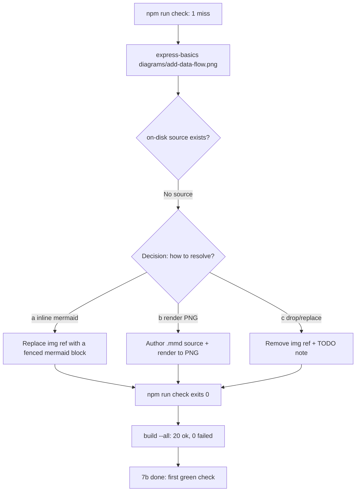

# Session prompt — Phase 7b (resolve the last truly-missing PNG)

Paste this whole file into a new session to continue without context-window limits.
It tells the new session what to read, where we are, and exactly what to build next.

**Run this phase in Code mode.**

---

## BOOTSTRAP (do this first, in order)

1. Read **[`inceptions/context.md`](../../inceptions/context.md)** — the "second brain": identity (Grade-10 PH CS teacher), locked decisions **D1–D13** (§6), target architecture (§4), conventions (§7). Note **D2** (offline, self-contained builds), **D4** (bundle highlight.js always + mermaid *only when a lecture uses a* ```mermaid fence), **D13** (never delete — `git mv` / archive).
2. Read **[`plans/progress.md`](../progress.md)** → find **"▶ RESUME HERE"** (it points to Phase 7b). Skim the Session Log, **especially Session 9 (Phase 7a)** — it holds the authoritative result (`check` 22→1 miss) and the §2b-stale finding. Then **[`plans/phase-7a-plan.md`](../phase-7a-plan.md)** §3 — the §2b-stale proof.
3. Read **[`scripts/check.js`](../../scripts/check.js)** and **[`scripts/lib/inline-images.mjs`](../../scripts/lib/inline-images.mjs)** — `scanMissingImages(slides,{lectureDir})` reports each miss as `{ slideIndex, resolvedPath, src }`; image refs resolve **relative to the lecture folder**.
4. Verify on-disk state: `git status` clean on branch **`reorg`**; `npm test` → **53 pass, 0 fail**; then **run `npm run check`** — it exits **1 with exactly 1 miss** (`express-basics` → `diagrams/add-data-flow.png`). That 1 miss **IS your entire worklist**.

## CURRENT STATE (where we are)

- Branch `reorg`. Phases **0, 1, 6, 2a, 2b, 2c, 3, 7a done**. All 20 lectures live in `lectures/<slug>/` (each = `lecture.md` + `assets/` + `diagrams/` + `diagram-src/`).
- The shared core is complete and barrel-exported from [`scripts/lib/index.mjs`](../../scripts/lib/index.mjs): `splitSlides`, `inlineImages` (+ read-only twin `scanMissingImages`), `renderPresentation`, `bundleLibs`/`hasMermaid`, and the orchestrator `buildLecture`.
- CLI exists: [`scripts/build.js`](../../scripts/build.js) (`--slug`/positional fail-loud; `--all` best-effort + summary) and [`scripts/check.js`](../../scripts/check.js) (scans every `lecture.md`, reports grouped misses, **exits 1 on any miss**).
- `npm test` green: **53 tests**.
- **Phase 7a (Session 9, commits `a1d0e33` + `12f9173`) rewired 21 of 22 broken image refs** so lectures build clean — see the table in Session 9 / [`plans/phase-7a-plan.md`](../phase-7a-plan.md) §1. Net result:
  - `npm run check`: **22 → 1 miss** (only `express-basics/diagrams/add-data-flow.png`).
  - `npm run build -- --all`: **8 → 1 failure** (only `express-basics`); **19 ok, 1 failed (of 20)**.
- **`npm run check` currently exits 1 with 1 miss** — `express-basics` → `diagrams/add-data-flow.png`. This is the Phase 7b worklist (the *only* genuinely-missing PNG in the whole tree).

## PHASE 7b GOAL

Resolve the **last** missing image ref — `express-basics/diagrams/add-data-flow.png` — so **`npm run check` exits 0 (clean, green for the first time)** and `express-basics` builds. Phase 7a deliberately left `check` RED; 7b flips it GREEN.



### The 1 miss (authoritative = `npm run check`)

| Slug | Count | Verified cause | 7b action |
|---|---|---|---|
| `express-basics` | 1 | [`lecture.md`](../../lectures/express-basics/lecture.md) slide 12 refs ``. **No such PNG** and **no `.mmd`/`.txt` source** in `diagram-src/web-server-basics/` (it has `01`–`10`; `06-form-submission` is the closest thematic match; the "06-json-add" app lives in `assets/` not `diagram-src/`). | Pick a resolution (Decision below) and implement. |

### Deliverables

1. **Investigate first:** `grep -ri "add.data.flow\|add-data-flow" lectures/express-basics/` and read the slide-12 context in [`lectures/express-basics/lecture.md`](../../lectures/express-basics/lecture.md) to confirm what the figure should depict (the "add data" flow for the JSON-add / mini-project apps). Confirm there is **no** on-disk source before authoring anything.
2. **Implement ONE resolution** (Decision below).
3. **Re-run `npm run check`** → must exit **0**. `npm run build -- express-basics` → clean. `npm run build -- --all` → **20 ok, 0 failed**.
4. `npm test` → still **53 pass** (no regression).
5. Update [`plans/progress.md`](../progress.md): Phase 7b → ✅, append Session 10, ▶ RESUME HERE → **Phase 4** (Express+EJS editor). Commit.

### Non-obvious facts (so you don't re-discover them)

- **There is NO render pipeline in the repo.** The project uses pre-rendered/vendored assets: Phase 6 *moved* existing PNGs; Phase 2c *vendored* hljs/mermaid UMD bundles. There is **no** mermaid/graphviz CLI render step. So "render from a `.mmd` source" requires either (i) adding a renderer (mermaid CLI / puppeteer — a new dependency), or (ii) reusing the already-bundled mermaid via an **inline** fence (no PNG needed).
- **Inline mermaid is the lowest-friction path (Decision a).** Because `buildLecture` already conditionally bundles mermaid when a lecture has a ```mermaid fence (D4), authoring the add-data flow as a fenced mermaid block needs **no PNG file**, **no new dep**, and `scanMissingImages` passes (no `` to resolve). ⚠️ Trade-off (D2/D4): `express-basics` currently has **no** mermaid fence, so adding one pulls the ~3 MB mermaid bundle into `dist/express-basics.html`. Acceptable for offline-first; note the file-size impact.
- **D13 (never delete).** If you choose to drop the figure, don't silently remove lecture content — replace with a mermaid fence or an explicit TODO note. **Prefer keeping the figure** (inline mermaid) over removing it.
- **`check` stays RED until 7b lands this one fix.** Phase 7a left it RED by design (Phase 3 decision A — honest gate). 7b's *raison d'être* is to flip it green. Do NOT weaken `check.js` to force green.
- **`express-basics` `/images/logo.png`** (line ~567, inside a ```html code fence) is escaped text — *not* a real `` tag, so `scanMissingImages` never flags it. Leave it.
- **⚠️ The inventory §2b "truly-missing ×13" set is STALE** — verified in Phase 7a that `testing-quality` (12 PNGs), `responsive-bulma` (8), and `production-best-practices` (5) **all have their referenced PNGs present**, which is why they never appear in the live `check`. **Do NOT chase them.** Re-scope 7b against live `npm run check` (1 miss), not the inventory.

### Decision to confirm with the user BEFORE coding

How to resolve `express-basics/diagrams/add-data-flow.png`:

- **(a) Inline mermaid fence (RECOMMENDED).** Replace `` with a fenced ```mermaid block authoring the add-data flow. No PNG file, no new dependency, self-contained (D2); mermaid bundles at build (D4). Cost: `dist/express-basics.html` grows ~3 MB. `check` passes (no `` to resolve).
- **(b) Author a source + render to PNG.** Create `diagram-src/web-server-basics/NN-add-data-flow.mmd` and render → `diagrams/add-data-flow.png` via a render step (mermaid CLI / puppeteer — **not currently in the repo**; would be added). Keeps `express-basics` PNG-based (smaller HTML) but introduces a renderer dependency + build step.
- **(c) Drop / replace the figure.** Remove the image ref (or swap for a text/placeholder + TODO note). Smallest diff but loses the figure (against the D13 spirit of not silently dropping content). `check` passes because the ref is gone.

**Recommend (a)** — lowest friction, no new deps, stays self-contained. **Ask the user** which they want.

## RULES

- **ESM** (`"type":"module"`), **kebab-case**, **one commit per phase**, `git mv` only (never `rm`), archive-never-delete (D13).
- **Stay in scope:** 7b = **`express-basics` `add-data-flow` ONLY**. Do NOT touch the other 19 lectures (7a already cleaned them). Do NOT build the Express `/export` route (Phase 4). Do NOT weaken `check.js`.
- **`npm run check` is the verifier** — it must exit **0** at the end of 7b (first green check).
- **At the end:** update [`plans/progress.md`](../progress.md) (Phase 7b → ✅, append Session 10, ▶ RESUME HERE → Phase 4). Commit.
- Report + **STOP before Phase 4** — the user reviews between phases.

## DONE WHEN

- [ ] `npm run check` run; the 1 `express-basics` `add-data-flow` miss classified (no on-disk source) against live output.
- [ ] Resolution implemented per the user's decision (**a** inline mermaid / **b** rendered PNG / **c** drop) so the ref no longer misses.
- [ ] **`npm run check` exits 0** (clean — the first green check).
- [ ] `npm run build -- --all` → **20 ok, 0 failed**.
- [ ] `npm test` still green (53 pass) — no regressions.
- [ ] [`plans/progress.md`](../progress.md) updated (Phase 7b → ✅, Session 10, ▶ RESUME HERE → Phase 4); committed.
