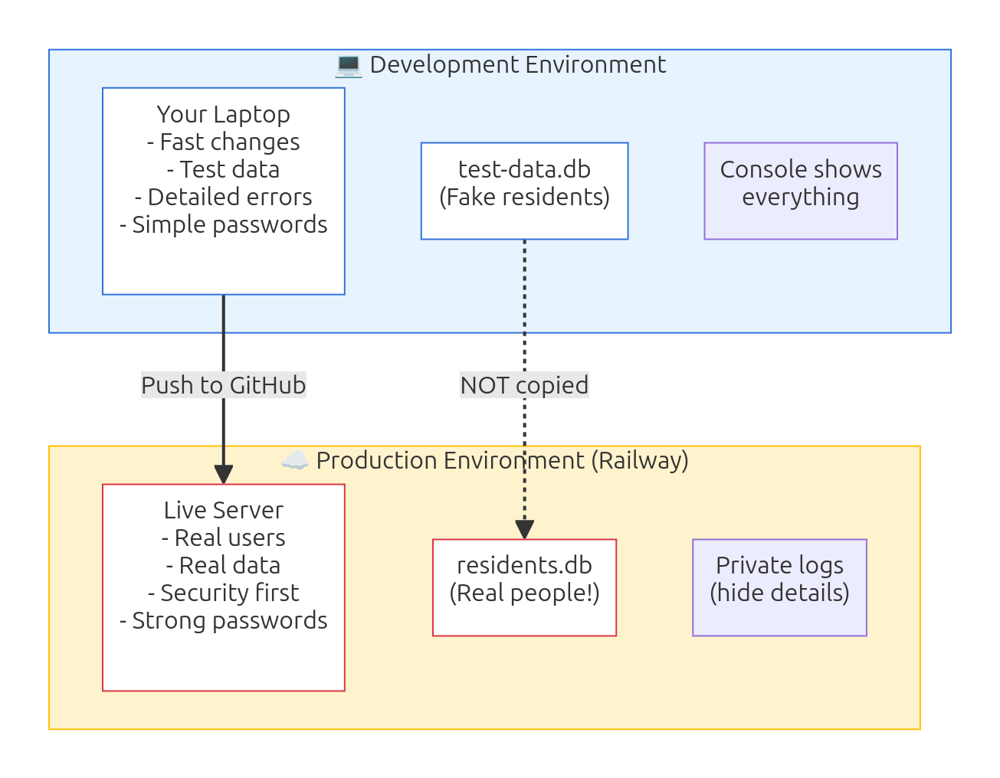

# 🚀 Production Best Practices for Express Apps

**Target Audience:** Grade 9 Filipino students who have built Express apps  
**Prerequisites:** Express basics, Railway deployment basics  
**Time:** 3-4 hours  
**Goal:** Learn to deploy apps safely and professionally

---

## 📖 What You'll Learn

By the end of this lecture, you'll know how to:
- Keep secrets safe with environment variables
- Secure your Express app from common attacks
- Handle errors gracefully
- Monitor your production app
- Create professional deployment checklists

---

## 🎯 Why Production Practices Matter

### The Nightmare Story

**Trixie's Sari-Sari Store Admin (October 2024)**

Trixie, a Grade 9 student, built a beautiful inventory management system for her family's sari-sari store. She deployed it to Railway, excited to show her tita.

**What went wrong:**

1. **Exposed Password** - She hardcoded the admin password in `app.js` and pushed to GitHub. Within 2 days, someone found it and deleted all inventory records.

2. **No Error Handling** - When the database got full, the app just showed a blank page. Her tita couldn't access the app for 3 days.

3. **No Logging** - When orders went missing, there was no way to know what happened. No record of who did what.

4. **No Backups** - After the deletion, they had no way to recover the lost data. 6 months of inventory records gone.

**The Cost:**
- Lost business data
- Family trust damaged
- Had to rebuild everything
- Embarrassment in class

### What She Should Have Done

```
✅ Environment variables for passwords
✅ Error pages for problems
✅ Logging for tracking actions
✅ Automatic backups
✅ Security headers
✅ Rate limiting
✅ Input validation
```

**Result if she had:** App would have prevented unauthorized access, shown friendly errors, logged the attack, and recovered from backups.

---

## 🎓 Section 1: Development vs Production

### Two Different Worlds

When you're **building** your app (development), priorities are:
- Fast changes and testing
- Detailed error messages (for debugging)
- Easy access (no passwords needed)
- Small test data

When your app is **live** (production), priorities change:
- Security (protect real data)
- Stability (don't break)
- Performance (fast for users)
- Privacy (hide sensitive info)

### Real Philippine Example

**Barangay San Juan Directory App**

**Development (your laptop):**
```javascript
// app.js - Development version
const PORT = 3000;
const DB_FILE = 'test-residents.db';  // Fake data
const ADMIN_PASSWORD = '1234';         // Simple password

// Detailed errors (helpful for debugging)
app.use((err, req, res, next) => {
  console.log(err.stack);  // Show full error
  res.send(`Error: ${err.message}`);
});
```

**Production (Railway.app):**
```javascript
// app.js - Production version
const PORT = process.env.PORT || 3000;
const DB_FILE = process.env.DB_FILE;           // From environment
const ADMIN_PASSWORD = process.env.ADMIN_PASS; // From environment

// Safe errors (don't reveal system details)
app.use((err, req, res, next) => {
  console.error(err.stack);  // Log privately
  res.status(500).render('error', { 
    message: 'Something went wrong. Please try again.' 
  });
});
```

**Key Differences:**

| Aspect | Development | Production |
|--------|-------------|------------|
| **Data** | Fake/test data | Real people's info |
| **Errors** | Show everything | Hide details |
| **Passwords** | Simple (1234) | Strong + hidden |
| **Speed** | Can be slow | Must be fast |
| **Who sees it** | Just you | Everyone |



### The Golden Rule

> **Never put real passwords, API keys, or sensitive data directly in your code.**

**Why?**
- Code goes to GitHub (public or not, it's risky)
- Anyone with access can see it
- Can't change passwords without changing code
- Different passwords for dev vs production is impossible

**Solution:** Environment variables (next section!)

---

## 🔐 Section 2: Environment Variables

### What Are Environment Variables?

**Simple definition:** Secret settings that live OUTSIDE your code.

**Think of it like:**
- Your notebook (code) is public - anyone can read it
- Your locker (environment) is private - only you have the key
- You write in your notebook: "Password is in my locker" (not the actual password!)


### The `.env` File

**Purpose:** Store secrets locally during development

**Example `.env` file:**
```
PORT=3000
DB_FILE=barangay.db
ADMIN_USERNAME=kagawad_santos
ADMIN_PASSWORD=strong_password_here_2024
SESSION_SECRET=random_string_abc123xyz789
RAILWAY_URL=https://barangay-directory.up.railway.app
```

**Rules:**
1. ✅ One setting per line
2. ✅ No spaces around `=`
3. ✅ No quotes needed
4. ✅ NEVER commit `.env` to Git
5. ✅ Keep it in the same folder as `app.js`

### Using Environment Variables in Express

**Step 1: Install dotenv package**

```bash
npm install dotenv
```

**Step 2: Load environment variables (top of app.js)**

```javascript
// app.js
require('dotenv').config();  // Must be FIRST LINE after requires

const express = require('express');
const app = express();

// Now you can use process.env
const PORT = process.env.PORT || 3000;
const DB_FILE = process.env.DB_FILE || 'default.db';
const ADMIN_PASS = process.env.ADMIN_PASSWORD;

console.log('Starting server on port:', PORT);
console.log('Using database:', DB_FILE);
// NEVER log passwords!

app.listen(PORT, () => {
  console.log(`Server running on http://localhost:${PORT}`);
});
```

**Step 3: Use in your routes**

```javascript
// Login route - Barangay directory
app.post('/login', (req, res) => {
  const { username, password } = req.body;
  
  // Check against environment variables
  if (username === process.env.ADMIN_USERNAME && 
      password === process.env.ADMIN_PASSWORD) {
    req.session.loggedIn = true;
    res.redirect('/admin/dashboard');
  } else {
    res.render('login', { error: 'Invalid credentials' });
  }
});
```

### Philippine Example: Sari-Sari Store Admin

**File: `.env`**
```
# Store Configuration
STORE_NAME=Tindahan ni Aling Rosa
STORE_ADDRESS=123 Mabini St, Quezon City

# Database
DB_FILE=store_inventory.db

# Admin Access
ADMIN_USERNAME=aling_rosa
ADMIN_PASSWORD=SafePassword2024!
CASHIER_PASSWORD=CashierPass123

# Session Security
SESSION_SECRET=random_very_long_string_here_abc123xyz789

# Railway Production URL
PRODUCTION_URL=https://aling-rosa-store.up.railway.app
```

**File: `app.js`**
```javascript
require('dotenv').config();
const express = require('express');
const session = require('express-session');
const app = express();

// Configuration from environment
const PORT = process.env.PORT || 3000;
const DB_FILE = process.env.DB_FILE;
const STORE_NAME = process.env.STORE_NAME;

// Session setup
app.use(session({
  secret: process.env.SESSION_SECRET,
  resave: false,
  saveUninitialized: false,
  cookie: { 
    secure: process.env.NODE_ENV === 'production',
    maxAge: 24 * 60 * 60 * 1000  // 24 hours
  }
}));

// Routes that use environment variables
app.get('/', (req, res) => {
  res.render('index', { storeName: STORE_NAME });
});

app.post('/admin/login', (req, res) => {
  const { password } = req.body;
  
  if (password === process.env.ADMIN_PASSWORD) {
    req.session.role = 'admin';
    res.redirect('/admin/dashboard');
  } else if (password === process.env.CASHIER_PASSWORD) {
    req.session.role = 'cashier';
    res.redirect('/cashier/sales');
  } else {
    res.render('login', { error: 'Wrong password' });
  }
});

app.listen(PORT);
```

### `.gitignore` - Protect Your Secrets

**CRITICAL:** Never commit `.env` to GitHub!

**File: `.gitignore`**
```
# Dependencies
node_modules/

# Environment variables (SECRETS!)
.env
.env.local
.env.production

# Database files (contain user data)
*.db
*.sqlite
*.sqlite3

# Logs
logs/
*.log

# OS files
.DS_Store
Thumbs.db

# Editor files
.vscode/
.idea/
```

**After creating `.gitignore`:**
```bash
git add .gitignore
git commit -m "Add gitignore to protect secrets"
```

**Check what Git will commit:**
```bash
git status
```

You should NOT see `.env` in the list! If you do, it's in `.gitignore` correctly.

### Railway Environment Variables

**Your Railway app needs the same variables!**

**How to add them on Railway:**

1. Go to Railway dashboard
2. Click your project
3. Click "Variables" tab
4. Add each variable:
   - `ADMIN_USERNAME` = `your_username`
   - `ADMIN_PASSWORD` = `your_strong_password`
   - `SESSION_SECRET` = `long_random_string`
   - `NODE_ENV` = `production`

**Important:** Railway automatically sets `PORT`, you don't need to!

**Railway-specific variables:**
```
NODE_ENV=production
DATABASE_URL=<Railway provides this for PostgreSQL>
```

### Common Mistakes to Avoid

❌ **Mistake 1: Committing `.env` to GitHub**
```bash
# Check before pushing!
git status

# If you see .env listed, DON'T push!
# Add it to .gitignore first
```

❌ **Mistake 2: Hardcoding fallback secrets**
```javascript
// BAD - still exposes password!
const ADMIN_PASS = process.env.ADMIN_PASSWORD || 'password123';

// GOOD - fail loudly if missing
const ADMIN_PASS = process.env.ADMIN_PASSWORD;
if (!ADMIN_PASS) {
  throw new Error('ADMIN_PASSWORD not set in environment!');
}
```

❌ **Mistake 3: Logging secrets**
```javascript
// BAD - password appears in logs!
console.log('Admin password:', process.env.ADMIN_PASSWORD);

// GOOD - confirm it exists without revealing it
console.log('Admin password:', process.env.ADMIN_PASSWORD ? '✓ Set' : '✗ Missing');
```

❌ **Mistake 4: Using weak secrets**
```
# BAD
ADMIN_PASSWORD=123456
SESSION_SECRET=secret

# GOOD
ADMIN_PASSWORD=MyStore2024!SecurePass
SESSION_SECRET=dj38fh2n9f8h23nf92h3f9h23f9h23f92h3f
```

### 🎯 Try It: Setup Environment Variables

**Practice File:** `assets/env-setup-demo/`

**Create these files:**

**1. `.env`**
```
STORE_NAME=Practice Store
ADMIN_PASSWORD=Practice123!
PORT=3000
```

**2. `.gitignore`**
```
node_modules/
.env
*.db
```

**3. `app.js`**
```javascript
require('dotenv').config();
const express = require('express');
const app = express();

app.set('view engine', 'ejs');
app.use(express.urlencoded({ extended: true }));

const PORT = process.env.PORT || 3000;
const STORE_NAME = process.env.STORE_NAME || 'Store Name Not Set';

app.get('/', (req, res) => {
  res.send(`
    <h1>${STORE_NAME}</h1>
    <p>Environment variables working!</p>
    <p>Admin password is: ${process.env.ADMIN_PASSWORD ? '✓ Set (hidden)' : '✗ Not set'}</p>
  `);
});

app.listen(PORT, () => {
  console.log(`Server: http://localhost:${PORT}`);
});
```

**4. Test it:**
```bash
npm install express dotenv
node app.js
```

Open http://localhost:3000 - you should see your store name!

**5. Check Git:**
```bash
git status
```

Make sure `.env` is NOT listed (means `.gitignore` is working!)

---

## ⚙️ Section 3: Configuration Management

### Beyond Simple Variables

As your app grows, you need more than just `.env` files. You need **configuration management**.

### The Config Pattern

**Centralize all configuration in one file.**

**File: `config/config.js`**
```javascript
require('dotenv').config();

// Validate required environment variables
const requiredEnvVars = [
  'ADMIN_PASSWORD',
  'SESSION_SECRET'
];

for (const envVar of requiredEnvVars) {
  if (!process.env[envVar]) {
    throw new Error(`Missing required environment variable: ${envVar}`);
  }
}

// Export configuration object
module.exports = {
  // Server
  port: process.env.PORT || 3000,
  nodeEnv: process.env.NODE_ENV || 'development',
  isProduction: process.env.NODE_ENV === 'production',
  
  // Database
  database: {
    filename: process.env.DB_FILE || 'app.db',
    backupEnabled: process.env.BACKUP_ENABLED === 'true',
    backupInterval: parseInt(process.env.BACKUP_INTERVAL) || 24 * 60 * 60 * 1000
  },
  
  // Authentication
  auth: {
    adminUsername: process.env.ADMIN_USERNAME || 'admin',
    adminPassword: process.env.ADMIN_PASSWORD,
    sessionSecret: process.env.SESSION_SECRET,
    sessionMaxAge: 24 * 60 * 60 * 1000  // 24 hours
  },
  
  // Security
  security: {
    rateLimitWindow: 15 * 60 * 1000,      // 15 minutes
    rateLimitMax: 100,                     // 100 requests per window
    corsOrigin: process.env.CORS_ORIGIN || '*',
    helmetEnabled: true
  },
  
  // Application
  app: {
    name: process.env.APP_NAME || 'My App',
    url: process.env.APP_URL || `http://localhost:${process.env.PORT || 3000}`
  },
  
  // Logging
  logging: {
    level: process.env.LOG_LEVEL || (process.env.NODE_ENV === 'production' ? 'info' : 'debug'),
    enabled: true
  }
};
```

**Using the config in `app.js`:**
```javascript
const express = require('express');
const config = require('./config/config');

const app = express();

console.log('Starting', config.app.name);
console.log('Environment:', config.nodeEnv);
console.log('Port:', config.port);

// Use config throughout your app
app.listen(config.port, () => {
  console.log(`${config.app.name} running at ${config.app.url}`);
});
```

### Philippine Example: Barangay Certificate System

**File: `config/config.js`**
```javascript
require('dotenv').config();

module.exports = {
  barangay: {
    name: process.env.BARANGAY_NAME || 'Barangay San Juan',
    address: process.env.BARANGAY_ADDRESS || 'Quezon City, Metro Manila',
    captain: process.env.BARANGAY_CAPTAIN || 'Hon. Juan Dela Cruz',
    contactNumber: process.env.BARANGAY_CONTACT || '(02) 1234-5678'
  },
  
  certificates: {
    validityDays: parseInt(process.env.CERT_VALIDITY_DAYS) || 90,
    fee: parseFloat(process.env.CERT_FEE) || 50.00,
    requiresSignature: process.env.REQUIRE_SIGNATURE !== 'false'
  },
  
  staff: {
    kagawadUsername: process.env.KAGAWAD_USERNAME || 'kagawad',
    kagawadPassword: process.env.KAGAWAD_PASSWORD,
    secretaryUsername: process.env.SECRETARY_USERNAME || 'secretary',
    secretaryPassword: process.env.SECRETARY_PASSWORD
  },
  
  database: {
    residents: process.env.RESIDENTS_DB || 'residents.db',
    certificates: process.env.CERTIFICATES_DB || 'certificates.db',
    backupHour: parseInt(process.env.BACKUP_HOUR) || 2  // 2 AM daily
  },
  
  isProduction: process.env.NODE_ENV === 'production'
};
```

**File: `.env`**
```
NODE_ENV=development

# Barangay Information
BARANGAY_NAME=Barangay San Juan
BARANGAY_ADDRESS=123 Sampaguita St, Quezon City
BARANGAY_CAPTAIN=Hon. Maria Santos
BARANGAY_CONTACT=(02) 8765-4321

# Certificate Settings
CERT_VALIDITY_DAYS=90
CERT_FEE=50.00
REQUIRE_SIGNATURE=true

# Staff Access
KAGAWAD_USERNAME=kagawad_santos
KAGAWAD_PASSWORD=KagawadSecure2024!
SECRETARY_USERNAME=secretary_reyes
SECRETARY_PASSWORD=SecretaryPass2024!

# Database
RESIDENTS_DB=residents.db
CERTIFICATES_DB=certificates.db
BACKUP_HOUR=2

# Session
SESSION_SECRET=barangay_secret_key_very_long_2024
```

**Usage in routes:**
```javascript
const config = require('./config/config');

// Issue certificate route
app.post('/certificates/issue', (req, res) => {
  const { residentId, certificateType } = req.body;
  
  const validUntil = new Date();
  validUntil.setDate(validUntil.getDate() + config.certificates.validityDays);
  
  const certificate = {
    id: generateId(),
    residentId,
    type: certificateType,
    issuedBy: config.barangay.name,
    captain: config.barangay.captain,
    fee: config.certificates.fee,
    validUntil: validUntil.toISOString(),
    createdAt: new Date().toISOString()
  };
  
  // Save to database...
  res.render('certificate', { certificate, barangay: config.barangay });
});
```

### Different Configs for Different Environments

**Advanced:** Separate config files per environment

**File: `config/development.js`**
```javascript
module.exports = {
  database: {
    filename: 'test-data.db',  // Test database
    logging: true               // Show SQL queries
  },
  security: {
    rateLimitMax: 1000,         // Relaxed for testing
    corsOrigin: '*'             // Accept all origins
  },
  logging: {
    level: 'debug'              // Verbose logs
  }
};
```

**File: `config/production.js`**
```javascript
module.exports = {
  database: {
    filename: process.env.DB_FILE,
    logging: false                    // Don't show SQL
  },
  security: {
    rateLimitMax: 100,                // Strict limits
    corsOrigin: process.env.APP_URL   // Only your domain
  },
  logging: {
    level: 'error'                    // Only errors
  }
};
```

**File: `config/config.js`** (combines them)
```javascript
require('dotenv').config();

const environment = process.env.NODE_ENV || 'development';
const envConfig = require(`./${environment}`);

// Base config (applies to all environments)
const baseConfig = {
  port: process.env.PORT || 3000,
  nodeEnv: environment,
  // ... other base settings
};

// Merge base + environment-specific config
module.exports = {
  ...baseConfig,
  ...envConfig
};
```

---

## 🛡️ Section 4: Security Hardening

### Common Web Attacks (and How to Prevent Them)

**Grade 9-Friendly Explanation:**

Imagine your Express app is a sari-sari store. Customers (users) come in, ask for things (HTTP requests), and you give them what they want (responses). But some customers are bad people trying to:
- Steal money from the register (steal data)
- Break your products (crash your app)
- Trick you into giving them free stuff (exploit vulnerabilities)

**Security hardening** = adding locks, cameras, and guards to your store.


### Security Package: Helmet.js

**What it does:** Adds security headers to HTTP responses

**Think of it like:** Putting a security guard at your store entrance who checks everyone coming in.

**Install:**
```bash
npm install helmet
```

**Use it (very easy!):**
```javascript
const express = require('express');
const helmet = require('helmet');

const app = express();

// Add helmet EARLY (before other middleware)
app.use(helmet());

// Rest of your app...
```

**What helmet does:**
- Hides what software you're using (makes attacks harder)
- Prevents clickjacking (tricking users into clicking bad things)
- Blocks XSS attacks (injecting malicious scripts)
- Forces HTTPS in production
- Many other protections

**For EJS templates, configure helmet:**
```javascript
app.use(helmet({
  contentSecurityPolicy: {
    directives: {
      defaultSrc: ["'self'"],
      styleSrc: ["'self'", "'unsafe-inline'"],  // Allow inline styles
      scriptSrc: ["'self'", "'unsafe-inline'"]  // Allow inline scripts
    }
  }
}));
```

### Rate Limiting (Prevent Spam)

**Problem:** Someone makes 1000 requests per second to crash your app

**Solution:** Limit how many requests per person

**Install:**
```bash
npm install express-rate-limit
```

**Basic setup:**
```javascript
const rateLimit = require('express-rate-limit');

// Allow 100 requests per 15 minutes per IP address
const limiter = rateLimit({
  windowMs: 15 * 60 * 1000,  // 15 minutes
  max: 100,                   // 100 requests
  message: 'Too many requests, please try again later.'
});

// Apply to all routes
app.use(limiter);
```

**Philippine Example: Barangay Certificate Requests**
```javascript
const rateLimit = require('express-rate-limit');

// Strict limit for certificate requests (prevent abuse)
const certificateLimiter = rateLimit({
  windowMs: 60 * 60 * 1000,  // 1 hour
  max: 5,                     // Only 5 certificate requests per hour
  message: 'Too many certificate requests. Please try again in 1 hour.',
  standardHeaders: true,
  legacyHeaders: false
});

// Apply only to certificate routes
app.use('/certificates/request', certificateLimiter);

// More relaxed limit for public browsing
const browseLimiter = rateLimit({
  windowMs: 15 * 60 * 1000,   // 15 minutes
  max: 100,                    // 100 requests
  message: 'Too many requests. Please slow down.'
});

app.use('/residents', browseLimiter);
```

### CSRF Protection (Cross-Site Request Forgery)

**Problem:** A malicious website tricks your logged-in user into making unwanted requests

**Example Attack:**
1. You log into barangay admin panel
2. You visit a bad website (in another tab)
3. That website secretly submits a form to your admin panel
4. Your browser sends your login cookie automatically
5. Unwanted action happens (like deleting residents!)

**Solution:** CSRF tokens


**Install:**
```bash
npm install csrf-sync
```

**Setup:**
```javascript
const { csrfSync } = require('csrf-sync');

// CSRF protection
const { 
  generateToken,      // Function to create token
  csrfSynchronisedProtection  // Middleware
} = csrfSync({
  getTokenFromRequest: (req) => req.body._csrf  // Where to find token
});

// Apply to forms (not GET requests)
app.use(csrfSynchronisedProtection);

// Make token available to all views
app.use((req, res, next) => {
  res.locals.csrfToken = generateToken(req);
  next();
});
```

**In your EJS forms:**
```html
<!-- Add hidden CSRF token to EVERY form -->
<form method="POST" action="/residents/add">
  <!-- CSRF Token (required!) -->
  <input type="hidden" name="_csrf" value="<%= csrfToken %>">
  
  <!-- Regular form fields -->
  <input type="text" name="name" required>
  <input type="text" name="address" required>
  <button type="submit">Add Resident</button>
</form>
```

**Philippine Example: Sari-Sari Store Protected Forms**

**File: `app.js`**
```javascript
const express = require('express');
const helmet = require('helmet');
const { csrfSync } = require('csrf-sync');
const session = require('express-session');

const app = express();

// Security middleware
app.use(helmet());
app.use(express.urlencoded({ extended: true }));
app.use(express.json());

// Session (required for CSRF)
app.use(session({
  secret: process.env.SESSION_SECRET,
  resave: false,
  saveUninitialized: false
}));

// CSRF protection
const { generateToken, csrfSynchronisedProtection } = csrfSync();
app.use(csrfSynchronisedProtection);

// Make CSRF token available to all views
app.use((req, res, next) => {
  res.locals.csrfToken = generateToken(req);
  next();
});

// Protected route - Add product
app.post('/products/add', (req, res) => {
  // CSRF middleware already validated token!
  const { name, price, quantity } = req.body;
  
  // Safe to process now
  // Add product to database...
  
  res.redirect('/products');
});
```

**File: `views/add-product.ejs`**
```html
<!DOCTYPE html>
<html>
<head>
  <title>Add Product - Tindahan ni Aling Rosa</title>
</head>
<body>
  <h1>Add New Product</h1>
  
  <form method="POST" action="/products/add">
    <!-- CSRF Protection -->
    <input type="hidden" name="_csrf" value="<%= csrfToken %>">
    
    <label>Product Name:
      <input type="text" name="name" required>
    </label>
    
    <label>Price:
      <input type="number" name="price" step="0.01" required>
    </label>
    
    <label>Quantity:
      <input type="number" name="quantity" required>
    </label>
    
    <button type="submit">Add Product</button>
  </form>
</body>
</html>
```

**What happens without CSRF token:**
```
POST /products/add
(no _csrf field in form)

Response: 403 Forbidden - Invalid CSRF token
```

### Input Validation & Sanitization

**Problem:** Users can input malicious data

**Examples of bad input:**
- `<script>alert('hacked')</script>` in name field (XSS attack)
- `'; DROP TABLE residents; --` in search (SQL injection)
- Very long text (crash app with memory overflow)

**Solution:** Validate and sanitize ALL user input

**Install:**
```bash
npm install express-validator
```

**Philippine Example: Validate Resident Registration**

```javascript
const { body, validationResult } = require('express-validator');

// Validation rules
const validateResident = [
  body('firstName')
    .trim()                                    // Remove spaces
    .notEmpty().withMessage('First name required')
    .isLength({ min: 2, max: 50 }).withMessage('First name must be 2-50 characters')
    .matches(/^[a-zA-Z\s\-ñÑ]+$/).withMessage('First name can only contain letters'),
  
  body('lastName')
    .trim()
    .notEmpty().withMessage('Last name required')
    .isLength({ min: 2, max: 50 }).withMessage('Last name must be 2-50 characters')
    .matches(/^[a-zA-Z\s\-ñÑ]+$/).withMessage('Last name can only contain letters'),
  
  body('age')
    .isInt({ min: 0, max: 120 }).withMessage('Age must be 0-120'),
  
  body('contactNumber')
    .optional()
    .matches(/^(09|\+639)\d{9}$/).withMessage('Invalid Philippine mobile number'),
  
  body('address')
    .trim()
    .notEmpty().withMessage('Address required')
    .isLength({ max: 200 }).withMessage('Address too long (max 200 characters)')
];

// Apply validation to route
app.post('/residents/add', validateResident, (req, res) => {
  // Check for validation errors
  const errors = validationResult(req);
  
  if (!errors.isEmpty()) {
    // Validation failed - show errors
    return res.render('add-resident', {
      errors: errors.array(),
      formData: req.body  // Keep what they typed
    });
  }
  
  // Validation passed - safe to use data
  const { firstName, lastName, age, contactNumber, address } = req.body;
  
  // Add to database...
  res.redirect('/residents');
});
```

**File: `views/add-resident.ejs`**
```html
<form method="POST" action="/residents/add">
  <input type="hidden" name="_csrf" value="<%= csrfToken %>">
  
  <!-- Show validation errors -->
  <% if (locals.errors && errors.length > 0) { %>
    <div class="errors">
      <ul>
        <% errors.forEach(error => { %>
          <li><%= error.msg %></li>
        <% }); %>
      </ul>
    </div>
  <% } %>
  
  <label>First Name:
    <input type="text" name="firstName" 
           value="<%= locals.formData?.firstName || '' %>" required>
  </label>
  
  <label>Last Name:
    <input type="text" name="lastName" 
           value="<%= locals.formData?.lastName || '' %>" required>
  </label>
  
  <label>Age:
    <input type="number" name="age" 
           value="<%= locals.formData?.age || '' %>" required>
  </label>
  
  <label>Contact Number (optional):
    <input type="tel" name="contactNumber" placeholder="09171234567"
           value="<%= locals.formData?.contactNumber || '' %>">
  </label>
  
  <label>Address:
    <textarea name="address" required><%= locals.formData?.address || '' %></textarea>
  </label>
  
  <button type="submit">Register Resident</button>
</form>
```

### Complete Security Setup Example

**Sari-Sari Store with ALL Security Features**


**File: `app.js`**
```javascript
require('dotenv').config();
const express = require('express');
const helmet = require('helmet');
const rateLimit = require('express-rate-limit');
const { csrfSync } = require('csrf-sync');
const { body, validationResult } = require('express-validator');
const session = require('express-session');

const app = express();

// 1. Helmet - Security headers
app.use(helmet({
  contentSecurityPolicy: {
    directives: {
      defaultSrc: ["'self'"],
      styleSrc: ["'self'", "'unsafe-inline'"],
      scriptSrc: ["'self'", "'unsafe-inline'"]
    }
  }
}));

// 2. Body parsing
app.use(express.urlencoded({ extended: true }));
app.use(express.json());

// 3. Session
app.use(session({
  secret: process.env.SESSION_SECRET,
  resave: false,
  saveUninitialized: false,
  cookie: {
    secure: process.env.NODE_ENV === 'production',
    httpOnly: true,
    maxAge: 24 * 60 * 60 * 1000
  }
}));

// 4. CSRF protection
const { generateToken, csrfSynchronisedProtection } = csrfSync();
app.use(csrfSynchronisedProtection);
app.use((req, res, next) => {
  res.locals.csrfToken = generateToken(req);
  next();
});

// 5. Rate limiting
const generalLimiter = rateLimit({
  windowMs: 15 * 60 * 1000,  // 15 minutes
  max: 100,
  message: 'Too many requests, please try again later.'
});

const loginLimiter = rateLimit({
  windowMs: 15 * 60 * 1000,  // 15 minutes
  max: 5,                     // Only 5 login attempts
  message: 'Too many login attempts. Try again in 15 minutes.'
});

app.use(generalLimiter);
app.use('/login', loginLimiter);

// 6. Views
app.set('view engine', 'ejs');

// Routes with validation
app.get('/', (req, res) => {
  res.render('index', { storeName: 'Tindahan ni Aling Rosa' });
});

// Secure login
app.post('/login', [
  body('username').trim().notEmpty(),
  body('password').notEmpty()
], (req, res) => {
  const errors = validationResult(req);
  if (!errors.isEmpty()) {
    return res.render('login', { error: 'Invalid input' });
  }
  
  const { username, password } = req.body;
  
  if (username === process.env.ADMIN_USERNAME &&
      password === process.env.ADMIN_PASSWORD) {
    req.session.loggedIn = true;
    res.redirect('/admin/dashboard');
  } else {
    res.render('login', { error: 'Wrong credentials' });
  }
});

// Protected route (must be logged in)
app.get('/admin/dashboard', (req, res) => {
  if (!req.session.loggedIn) {
    return res.redirect('/login');
  }
  res.render('admin-dashboard');
});

// Secure product add with validation
app.post('/products/add', [
  body('name').trim().notEmpty().isLength({ max: 100 }),
  body('price').isFloat({ min: 0.01 }),
  body('quantity').isInt({ min: 0 })
], (req, res) => {
  if (!req.session.loggedIn) {
    return res.status(403).send('Forbidden');
  }
  
  const errors = validationResult(req);
  if (!errors.isEmpty()) {
    return res.render('add-product', { errors: errors.array() });
  }
  
  // Safe to add product
  const { name, price, quantity } = req.body;
  // Add to database...
  
  res.redirect('/products');
});

const PORT = process.env.PORT || 3000;
app.listen(PORT, () => {
  console.log(`Secure store running on port ${PORT}`);
});
```

### Security Checklist

Before deploying, check:

✅ **Environment Variables**
- [ ] All secrets in `.env` file
- [ ] `.env` in `.gitignore`
- [ ] Railway environment variables set
- [ ] No hardcoded passwords

✅ **Security Middleware**
- [ ] Helmet installed and configured
- [ ] Rate limiting on login routes
- [ ] CSRF protection on all forms
- [ ] Input validation on all user input

✅ **Sessions**
- [ ] Strong session secret
- [ ] Secure cookies in production
- [ ] Session timeout configured

✅ **Authentication**
- [ ] Strong passwords (not "password123")
- [ ] Limited login attempts
- [ ] Protected admin routes

✅ **Database**
- [ ] Input sanitized before queries
- [ ] Parameterized queries (prevents SQL injection)
- [ ] Database file in `.gitignore`

---

## 📝 Session 1 Summary

In this session, you learned:

### **Section 1: Development vs Production**
- Development: fast changes, detailed errors, simple setup
- Production: security, stability, user-facing
- Never mix the two!

### **Section 2: Environment Variables**
- Store secrets in `.env` file (not in code)
- Use `dotenv` package to load them
- Add `.env` to `.gitignore`
- Set same variables on Railway

### **Section 3: Configuration Management**
- Centralize config in `config/config.js`
- Validate required variables
- Different configs for dev/production
- Easy to change settings

### **Section 4: Security Hardening**
- **Helmet**: Security headers (easy win!)
- **Rate Limiting**: Prevent spam/attacks
- **CSRF Protection**: Prevent form hijacking
- **Input Validation**: Never trust user input

### Key Takeaway

> **Security is NOT optional. It protects your users, your data, and your reputation.**

---

## 🎯 What's Next (Session 2)

In the next session, we'll cover:
- **Section 5:** Error Handling (graceful failures)
- **Section 6:** Logging (tracking what happens)
- **Section 7:** Database Backups (don't lose data!)
- **Section 8:** Monitoring (know when things break)

See you in Session 2! 🚀

---

## ⚠️ Section 5: Error Handling

### Why Error Handling Matters

**The Blank Page Problem:**

Imagine Kagawad Santos from Barangay San Juan is using your certificate system. The database is full, or the server is having issues. Without error handling:

```
User sees: [Blank white page]
User thinks: "Is it broken? Did I do something wrong?"
User does: Calls you at 11 PM panicking
```

With proper error handling:
```
User sees: "Sorry, we're experiencing technical difficulties. 
           Please try again in a few minutes, or contact 
           barangay hall at (02) 1234-5678."
User thinks: "Okay, I'll try later or call them."
User does: Waits or calls during business hours
```

### Types of Errors

**1. Expected Errors (Handle gracefully)**
```javascript
// User enters invalid data
// File doesn't exist
// Database query fails
// Network timeout
```

**2. Unexpected Errors (Log and recover)**
```javascript
// Out of memory
// Server crash
// Database corruption
// Third-party API down
```

### Basic Try-Catch Pattern

**Philippine Example: Barangay Resident Lookup**

```javascript
app.get('/residents/:id', (req, res) => {
  try {
    const { id } = req.params;
    
    // Try to get resident from database
    const resident = db.prepare('SELECT * FROM residents WHERE id = ?').get(id);
    
    if (!resident) {
      // Expected error: resident not found
      return res.status(404).render('error', {
        title: '404 - Resident Not Found',
        message: 'Walang nakitang residente na may ID na ito.',
        suggestion: 'Tingnan ang listahan ng mga residente o subukang muli.'
      });
    }
    
    res.render('resident-detail', { resident });
    
  } catch (error) {
    // Unexpected error: database problem, server issue
    console.error('Error fetching resident:', error);
    
    res.status(500).render('error', {
      title: '500 - May Technical Problem',
      message: 'May problema sa system. Pakisubukan muli mamaya.',
      suggestion: 'Kung patuloy ang problema, tawagan ang barangay hall.'
    });
  }
});
```

### Error Middleware (Central Error Handler)

**Instead of try-catch everywhere, use error middleware:**

```javascript
// Error handling middleware (put LAST, after all routes)
app.use((err, req, res, next) => {
  // Log error details (for you to debug)
  console.error('❌ Error occurred:');
  console.error('Path:', req.path);
  console.error('Method:', req.method);
  console.error('Error:', err.message);
  console.error('Stack:', err.stack);
  
  // Determine error type and response
  let statusCode = err.statusCode || 500;
  let userMessage = 'May problema sa system.';
  let suggestion = 'Subukang muli mamaya.';
  
  // Specific error types
  if (err.code === 'SQLITE_FULL') {
    userMessage = 'Puno na ang database.';
    suggestion = 'Tawagan ang admin para linisin ang database.';
  } else if (err.code === 'ECONNREFUSED') {
    userMessage = 'Hindi makonekta sa database.';
    suggestion = 'Siguruhing tumatakbo ang database server.';
  } else if (err.name === 'ValidationError') {
    statusCode = 400;
    userMessage = 'May mali sa input na datos.';
    suggestion = 'Tingnan ang mga error messages sa form.';
  }
  
  // Send user-friendly error page
  res.status(statusCode).render('error', {
    title: `${statusCode} - Error`,
    message: userMessage,
    suggestion: suggestion,
    // Only show details in development
    details: process.env.NODE_ENV === 'development' ? err.message : null
  });
});
```

### Using Error Middleware in Routes

```javascript
// Your routes can now just throw errors
app.post('/residents/add', async (req, res, next) => {
  try {
    const { firstName, lastName, age, address } = req.body;
    
    // Validation
    if (!firstName || !lastName) {
      const error = new Error('First name and last name required');
      error.statusCode = 400;
      throw error;  // Error middleware will catch this!
    }
    
    // Insert to database
    const result = db.prepare(
      'INSERT INTO residents (firstName, lastName, age, address) VALUES (?, ?, ?, ?)'
    ).run(firstName, lastName, age, address);
    
    res.redirect('/residents');
    
  } catch (error) {
    next(error);  // Pass to error middleware
  }
});
```

### Error Page Template (EJS)

**File: `views/error.ejs`**

```html
<!DOCTYPE html>
<html lang="en">
<head>
  <meta charset="UTF-8">
  <meta name="viewport" content="width=device-width, initial-scale=1.0">
  <title><%= title %></title>
  <style>
    body {
      font-family: Arial, sans-serif;
      max-width: 600px;
      margin: 50px auto;
      padding: 20px;
      text-align: center;
    }
    .error-icon {
      font-size: 80px;
      margin-bottom: 20px;
    }
    h1 {
      color: #dc3545;
      margin-bottom: 10px;
    }
    .message {
      font-size: 18px;
      margin: 20px 0;
      color: #333;
    }
    .suggestion {
      background: #f8f9fa;
      padding: 15px;
      border-radius: 5px;
      margin: 20px 0;
    }
    .details {
      background: #f8d7da;
      border: 1px solid #f5c6cb;
      color: #721c24;
      padding: 15px;
      border-radius: 5px;
      margin-top: 20px;
      text-align: left;
      font-family: monospace;
      font-size: 12px;
    }
    .button {
      display: inline-block;
      padding: 10px 20px;
      background: #3273dc;
      color: white;
      text-decoration: none;
      border-radius: 5px;
      margin-top: 20px;
    }
  </style>
</head>
<body>
  <div class="error-icon">⚠️</div>
  <h1><%= title %></h1>
  <p class="message"><%= message %></p>
  
  <% if (suggestion) { %>
    <div class="suggestion">
      <strong>💡 Suggestion:</strong><br>
      <%= suggestion %>
    </div>
  <% } %>
  
  <a href="/" class="button">← Bumalik sa Home</a>
  
  <% if (details) { %>
    <div class="details">
      <strong>Debug Info (development only):</strong><br>
      <%= details %>
    </div>
  <% } %>
</body>
</html>
```

### Common Error Scenarios

**1. Database Errors**
```javascript
try {
  const residents = db.prepare('SELECT * FROM residents').all();
  res.render('residents', { residents });
} catch (error) {
  if (error.code === 'SQLITE_CANTOPEN') {
    // Database file doesn't exist
    return res.status(500).render('error', {
      message: 'Database hindi makita.',
      suggestion: 'Kontakin ang admin.'
    });
  }
  throw error;  // Other errors go to error middleware
}
```

**2. File Upload Errors**
```javascript
app.post('/upload', (req, res, next) => {
  if (!req.file) {
    const error = new Error('Walang file na na-upload');
    error.statusCode = 400;
    return next(error);
  }
  
  // Check file size (5MB limit)
  if (req.file.size > 5 * 1024 * 1024) {
    const error = new Error('File masyadong malaki (max 5MB)');
    error.statusCode = 400;
    return next(error);
  }
  
  res.redirect('/dashboard');
});
```

**3. Authentication Errors**
```javascript
function requireLogin(req, res, next) {
  if (!req.session.loggedIn) {
    return res.status(401).render('error', {
      title: '401 - Hindi Authorized',
      message: 'Kailangan mong mag-login muna.',
      suggestion: '<a href="/login">Login dito</a>'
    });
  }
  next();
}

// Use in routes
app.get('/admin/dashboard', requireLogin, (req, res) => {
  res.render('admin-dashboard');
});
```

### 404 Not Found Handler

```javascript
// 404 handler (put BEFORE error middleware, AFTER all routes)
app.use((req, res) => {
  res.status(404).render('error', {
    title: '404 - Page Not Found',
    message: 'Hindi makita ang page na hinahanap mo.',
    suggestion: `Baka mali ang URL? Nais mo bang bumalik sa <a href="/">home page</a>?`
  });
});
```

### Error Handling Checklist

✅ **Basic Setup**
- [ ] Error middleware at end of app.js
- [ ] 404 handler before error middleware
- [ ] error.ejs template created
- [ ] Try-catch in database operations

✅ **User Experience**
- [ ] User-friendly error messages (Tagalog/Filipino okay!)
- [ ] Suggest next steps
- [ ] Link back to home/safety
- [ ] Don't show technical details to users

✅ **Developer Experience**
- [ ] Log all errors to console
- [ ] Include error path, method, timestamp
- [ ] Show stack trace in development
- [ ] Hide stack trace in production

---

## 📊 Section 6: Logging

### Why Logging Matters

**The Mystery Problem:**

Barangay secretary: "Sir, may nag-delete ng residente kagabi!"  
You: "Sino?"  
Secretary: "Hindi ko alam."  
You: "Anong oras?"  
Secretary: "Hindi ko rin alam."  
You: "Aling residente?"  
Secretary: "Nakalimutan ko na..."

**Result:** Can't find who did what, when, or why.

**With logging:**
```
[2024-11-12 23:45:12] INFO: User 'secretary_reyes' logged in
[2024-11-12 23:47:33] INFO: User 'secretary_reyes' deleted resident ID 123 (Juan Dela Cruz)
[2024-11-12 23:48:01] INFO: User 'secretary_reyes' logged out
```

**Result:** You know exactly what happened!

### Log Levels

```javascript
DEBUG   - Detailed info for debugging (development only)
INFO    - General information (user logged in, action completed)
WARN    - Warning, something unusual but not broken
ERROR   - Error occurred, something broke
FATAL   - Critical error, app might crash
```

### Simple Console Logging (Basic)

```javascript
// Add timestamps and user info
app.post('/residents/add', (req, res) => {
  const timestamp = new Date().toISOString();
  const user = req.session.username || 'anonymous';
  const { firstName, lastName } = req.body;
  
  console.log(`[${timestamp}] INFO: User '${user}' added resident: ${firstName} ${lastName}`);
  
  // Add to database...
  res.redirect('/residents');
});
```

### Winston - Professional Logging

**Install:**
```bash
npm install winston
```

**Setup: `config/logger.js`**

```javascript
const winston = require('winston');
const path = require('path');

// Create logs directory if it doesn't exist
const fs = require('fs');
const logsDir = 'logs';
if (!fs.existsSync(logsDir)) {
  fs.mkdirSync(logsDir);
}

// Create logger
const logger = winston.createLogger({
  level: process.env.LOG_LEVEL || 'info',
  format: winston.format.combine(
    winston.format.timestamp({ format: 'YYYY-MM-DD HH:mm:ss' }),
    winston.format.errors({ stack: true }),
    winston.format.printf(({ timestamp, level, message, stack }) => {
      return `[${timestamp}] ${level.toUpperCase()}: ${message}${stack ? '\n' + stack : ''}`;
    })
  ),
  transports: [
    // Write all logs to console
    new winston.transports.Console({
      format: winston.format.combine(
        winston.format.colorize(),
        winston.format.printf(({ timestamp, level, message }) => {
          return `[${timestamp}] ${level}: ${message}`;
        })
      )
    }),
    
    // Write all logs to app.log
    new winston.transports.File({ 
      filename: path.join(logsDir, 'app.log'),
      maxsize: 5242880, // 5MB
      maxFiles: 5
    }),
    
    // Write errors to error.log
    new winston.transports.File({ 
      filename: path.join(logsDir, 'error.log'),
      level: 'error',
      maxsize: 5242880, // 5MB
      maxFiles: 5
    })
  ]
});

module.exports = logger;
```

### Using Winston in Your App

**File: `app.js`**

```javascript
const logger = require('./config/logger');

// Log app start
logger.info('🚀 Barangay System starting...');
logger.info(`Environment: ${process.env.NODE_ENV || 'development'}`);
logger.info(`Port: ${PORT}`);

// Log user actions
app.post('/login', (req, res) => {
  const { username, password } = req.body;
  
  if (username === process.env.ADMIN_USERNAME &&
      password === process.env.ADMIN_PASSWORD) {
    req.session.loggedIn = true;
    req.session.username = username;
    
    logger.info(`✅ User '${username}' logged in successfully`);
    res.redirect('/dashboard');
  } else {
    logger.warn(`⚠️ Failed login attempt for username '${username}'`);
    res.render('login', { error: 'Invalid credentials' });
  }
});

// Log CRUD operations
app.post('/residents/add', (req, res) => {
  const { firstName, lastName, age } = req.body;
  const user = req.session.username || 'anonymous';
  
  try {
    const result = db.prepare(
      'INSERT INTO residents (firstName, lastName, age) VALUES (?, ?, ?)'
    ).run(firstName, lastName, age);
    
    logger.info(`✅ User '${user}' added resident: ${firstName} ${lastName} (ID: ${result.lastInsertRowid})`);
    res.redirect('/residents');
    
  } catch (error) {
    logger.error(`❌ Error adding resident: ${error.message}`, { user, firstName, lastName });
    res.status(500).render('error', { message: 'Failed to add resident' });
  }
});

// Log deletions (important!)
app.post('/residents/delete/:id', (req, res) => {
  const { id } = req.params;
  const user = req.session.username || 'anonymous';
  
  try {
    // Get resident details before deleting (for log)
    const resident = db.prepare('SELECT * FROM residents WHERE id = ?').get(id);
    
    if (resident) {
      db.prepare('DELETE FROM residents WHERE id = ?').run(id);
      logger.warn(`🗑️ User '${user}' deleted resident: ${resident.firstName} ${resident.lastName} (ID: ${id})`);
    }
    
    res.redirect('/residents');
    
  } catch (error) {
    logger.error(`❌ Error deleting resident ID ${id}: ${error.message}`, { user });
    res.status(500).render('error', { message: 'Failed to delete resident' });
  }
});

// Log errors
app.use((err, req, res, next) => {
  logger.error(`❌ Error on ${req.method} ${req.path}: ${err.message}`, {
    user: req.session?.username,
    stack: err.stack
  });
  
  res.status(500).render('error', { message: 'Something went wrong' });
});

app.listen(PORT, () => {
  logger.info(`✅ Server running on port ${PORT}`);
});
```

### What to Log

**✅ DO Log:**
- User logins/logouts
- CRUD operations (create, update, delete)
- Important business actions (certificate issued, payment received)
- Errors and warnings
- App start/stop
- Configuration changes

**❌ DON'T Log:**
- Passwords (NEVER!)
- Credit card numbers
- Personal sensitive data
- Too much detail (performance impact)

### Log Format Best Practices

```javascript
// GOOD - Clear, structured
logger.info('User logged in', { username: 'kagawad_santos', ip: req.ip });
logger.warn('Low disk space', { available: '100MB', threshold: '500MB' });
logger.error('Database query failed', { query: 'SELECT...', error: err.message });

// BAD - Unclear, hard to search
logger.info('login');
logger.warn('space');
logger.error('broken');
```

### Viewing Logs

```bash
# View all logs
cat logs/app.log

# View last 50 lines
tail -n 50 logs/app.log

# Follow logs in real-time (like console)
tail -f logs/app.log

# View only errors
cat logs/error.log

# Search for specific user
grep "kagawad_santos" logs/app.log

# Search for errors today
grep "2024-11-12" logs/error.log
```

---

## 💾 Section 7: Database Backups

### Why Backups Matter

**The Disaster Story:**

Tindahan ni Aling Rosa had 6 months of sales data. One day:
1. Hard drive crashed
2. Database file corrupted
3. No backup
4. **All data GONE**

**Result:** 
- Lost track of inventory
- Lost sales records
- Lost customer credit records
- Had to restart from zero

**Cost:** ₱50,000+ in lost business

### Backup Strategy

**3-2-1 Rule:**
- **3** copies of data (original + 2 backups)
- **2** different storage types (local + cloud)
- **1** offsite backup (not same location)

### Manual Backup (Simple)

**For SQLite database:**

```javascript
// Backup function
const fs = require('fs');
const path = require('path');

function backupDatabase() {
  const timestamp = new Date().toISOString().replace(/:/g, '-').split('.')[0];
  const backupDir = 'backups';
  const sourceFile = 'data/residents.db';
  const backupFile = path.join(backupDir, `residents-${timestamp}.db`);
  
  // Create backups directory if it doesn't exist
  if (!fs.existsSync(backupDir)) {
    fs.mkdirSync(backupDir);
  }
  
  // Copy file
  fs.copyFileSync(sourceFile, backupFile);
  
  console.log(`✅ Backup created: ${backupFile}`);
  return backupFile;
}

// Backup button route
app.post('/admin/backup', (req, res) => {
  try {
    const backupFile = backupDatabase();
    logger.info(`Database backup created: ${backupFile}`);
    res.json({ success: true, file: backupFile });
  } catch (error) {
    logger.error(`Backup failed: ${error.message}`);
    res.status(500).json({ success: false, error: error.message });
  }
});
```

### Automatic Daily Backups

**Install node-cron:**
```bash
npm install node-cron
```

**Setup automatic backups:**

```javascript
const cron = require('node-cron');
const fs = require('fs');
const path = require('path');
const logger = require('./config/logger');

// Backup function
function backupDatabase() {
  const timestamp = new Date().toISOString().replace(/:/g, '-').split('.')[0];
  const backupDir = 'backups';
  const sourceFile = 'data/residents.db';
  const backupFile = path.join(backupDir, `residents-${timestamp}.db`);
  
  if (!fs.existsSync(backupDir)) {
    fs.mkdirSync(backupDir, { recursive: true });
  }
  
  fs.copyFileSync(sourceFile, backupFile);
  logger.info(`✅ Automatic backup created: ${backupFile}`);
  
  // Clean old backups (keep last 7 days only)
  cleanOldBackups(backupDir, 7);
  
  return backupFile;
}

// Clean old backups
function cleanOldBackups(backupDir, daysToKeep) {
  const files = fs.readdirSync(backupDir);
  const now = Date.now();
  const maxAge = daysToKeep * 24 * 60 * 60 * 1000; // days to milliseconds
  
  files.forEach(file => {
    const filePath = path.join(backupDir, file);
    const stats = fs.statSync(filePath);
    const age = now - stats.mtimeMs;
    
    if (age > maxAge) {
      fs.unlinkSync(filePath);
      logger.info(`🗑️ Deleted old backup: ${file}`);
    }
  });
}

// Schedule backup every day at 2 AM
cron.schedule('0 2 * * *', () => {
  logger.info('⏰ Running scheduled backup...');
  try {
    backupDatabase();
  } catch (error) {
    logger.error(`❌ Scheduled backup failed: ${error.message}`);
  }
});

logger.info('✅ Automatic backup scheduled (daily at 2 AM)');
```

### Railway Backup (Production)

**Railway doesn't have persistent file storage!**

**Solution: Backup to external service**

```javascript
// Example: Backup to GitHub (simple method)
const { execSync } = require('child_process');

function backupToGithub() {
  try {
    // Create backup file
    const backupFile = backupDatabase();
    
    // Git commands (requires git repo setup)
    execSync('git add backups/*.db');
    execSync(`git commit -m "Auto backup: ${new Date().toISOString()}"`);
    execSync('git push origin main');
    
    logger.info('✅ Backup pushed to GitHub');
  } catch (error) {
    logger.error(`❌ GitHub backup failed: ${error.message}`);
  }
}
```

**Better solution: Download backups locally**

**Add backup download route:**

```javascript
app.get('/admin/download-backup', requireLogin, (req, res) => {
  const backupFile = backupDatabase();
  const fileName = path.basename(backupFile);
  
  res.download(backupFile, fileName, (err) => {
    if (err) {
      logger.error(`Download failed: ${err.message}`);
    } else {
      logger.info(`Backup downloaded: ${fileName}`);
    }
  });
});
```

### Restore from Backup

```javascript
app.post('/admin/restore', requireLogin, (req, res) => {
  const { backupFile } = req.body;
  const sourceFile = 'data/residents.db';
  
  try {
    // Create backup of current data first!
    const emergencyBackup = backupDatabase();
    logger.warn(`⚠️ Creating emergency backup before restore: ${emergencyBackup}`);
    
    // Restore from backup
    fs.copyFileSync(backupFile, sourceFile);
    
    logger.info(`✅ Database restored from: ${backupFile}`);
    res.json({ success: true });
    
  } catch (error) {
    logger.error(`❌ Restore failed: ${error.message}`);
    res.status(500).json({ success: false, error: error.message });
  }
});
```

### Backup Checklist

✅ **Setup**
- [ ] Backups directory created
- [ ] Backup function tested
- [ ] Automatic backup scheduled (cron)
- [ ] Old backups auto-deleted

✅ **Testing**
- [ ] Manual backup works
- [ ] Automatic backup works (check logs)
- [ ] Restore works
- [ ] Download backup works

✅ **Production**
- [ ] Backups stored offsite (not same server)
- [ ] Download backups regularly (weekly)
- [ ] Test restore process (monthly)
- [ ] Monitor backup logs

---

## 📡 Section 8: Monitoring & Health Checks

### Why Monitoring Matters

**The Silent Failure:**

Your app crashes at 2 AM. Nobody knows until 8 AM when users complain. 6 hours of downtime = lost trust, lost business.

**With monitoring:** You get alert at 2:01 AM, fix it by 2:15 AM. Users barely notice.

### Health Check Endpoint

**Simple health check:**

```javascript
// Health check endpoint
app.get('/health', (req, res) => {
  const health = {
    status: 'OK',
    timestamp: new Date().toISOString(),
    uptime: process.uptime(),
    environment: process.env.NODE_ENV || 'development'
  };
  
  res.json(health);
});
```

**Advanced health check (check database):**

```javascript
app.get('/health', async (req, res) => {
  const health = {
    status: 'OK',
    timestamp: new Date().toISOString(),
    uptime: process.uptime(),
    checks: {
      database: 'OK',
      memory: 'OK',
      disk: 'OK'
    }
  };
  
  try {
    // Check database connection
    db.prepare('SELECT 1').get();
    health.checks.database = 'OK';
  } catch (error) {
    health.status = 'ERROR';
    health.checks.database = 'FAILED';
    logger.error('Database health check failed:', error);
  }
  
  // Check memory usage
  const memUsage = process.memoryUsage();
  const memUsedMB = Math.round(memUsage.heapUsed / 1024 / 1024);
  health.checks.memory = `${memUsedMB}MB used`;
  
  if (memUsedMB > 500) {
    health.checks.memory = 'HIGH';
    logger.warn(`High memory usage: ${memUsedMB}MB`);
  }
  
  res.status(health.status === 'OK' ? 200 : 503).json(health);
});
```

### Uptime Monitoring Services (Free!)

**1. UptimeRobot (Free)**
- Website: https://uptimerobot.com
- Checks your app every 5 minutes
- Sends email/SMS if app is down
- Free tier: 50 monitors

**Setup:**
1. Create account on UptimeRobot
2. Add monitor: `https://your-app.railway.app/health`
3. Set alert contacts (email, SMS)
4. Done!

**2. Better Uptime (Free tier)**
- Website: https://betteruptime.com
- More features than UptimeRobot
- Status page included
- Free tier: 10 monitors

### Railway Monitoring

**Railway has built-in monitoring:**
- CPU usage
- Memory usage
- Network traffic
- Deployment logs

**Access:**
1. Go to Railway project
2. Click "Metrics" tab
3. View real-time graphs

### Error Rate Monitoring

**Track error rate over time:**

```javascript
// Simple error counter (in-memory)
let errorCount = 0;
let requestCount = 0;

app.use((req, res, next) => {
  requestCount++;
  next();
});

app.use((err, req, res, next) => {
  errorCount++;
  logger.error(`Error rate: ${errorCount}/${requestCount} (${Math.round(errorCount/requestCount*100)}%)`);
  next(err);
});

// Error rate endpoint
app.get('/admin/stats', requireLogin, (req, res) => {
  const errorRate = requestCount > 0 ? (errorCount / requestCount * 100).toFixed(2) : 0;
  
  res.json({
    totalRequests: requestCount,
    totalErrors: errorCount,
    errorRate: errorRate + '%',
    uptime: process.uptime()
  });
});
```

### Monitoring Checklist

✅ **Basic Monitoring**
- [ ] Health check endpoint created (/health)
- [ ] Health check tests database connection
- [ ] Health check returns proper status codes

✅ **External Monitoring**
- [ ] UptimeRobot or Better Uptime configured
- [ ] Alert email set up
- [ ] Alert SMS set up (optional)
- [ ] Status page created (optional)

✅ **Railway Monitoring**
- [ ] Check metrics dashboard weekly
- [ ] Set up deployment notifications
- [ ] Monitor memory/CPU usage

✅ **Logging Integration**
- [ ] Errors logged with context
- [ ] Warnings for high resource usage
- [ ] Info logs for important events

---

## 📝 Session 2 Summary

In this session, you learned:

### **Section 5: Error Handling**
- Try-catch for expected errors
- Error middleware for centralized handling
- User-friendly error pages (Tagalog/Filipino)
- 404 handler for missing pages
- Never show technical details to users

### **Section 6: Logging**
- Why logging matters (audit trail)
- Winston for professional logging
- Log levels (debug, info, warn, error)
- What to log (and what NOT to log)
- Viewing and searching logs

### **Section 7: Database Backups**
- Why backups are critical
- Manual backup function
- Automatic daily backups (cron)
- Clean old backups (keep 7 days)
- Restore from backup
- Offsite backup strategy

### **Section 8: Monitoring**
- Health check endpoints
- External monitoring (UptimeRobot)
- Railway built-in monitoring
- Error rate tracking
- Alert setup

### Key Takeaway

> **Production apps need more than just features. They need error handling, logging, backups, and monitoring to be reliable.**

---

## Section 9: Performance Optimization ⚡

### Why Performance Matters in the Philippines

**Real-World Context:**
- Slow 3G/4G internet in provinces
- Limited data plans (300 MB per day)
- Budget Android phones (2GB RAM)
- Every second of loading time costs users money

**Story: Aling Rosa's Slow Inventory**

> Aling Rosa's sari-sari store inventory app takes 5 seconds to load. Customers get impatient waiting. She loses sales because it's faster to check stock manually.
> 
> After optimization: Loads in 1 second. Customers happy. Aling Rosa processes orders faster.

### Performance Optimization Strategies

#### 1. Compression (Gzip)

**What:** Compress responses before sending to browser

**Setup:**
```javascript
// Install compression
npm install compression

// app.js
const compression = require('compression');

// Enable gzip compression
app.use(compression());

// That's it! Reduces size by 70-80%
```

**How It Works:**
```
Without compression:
HTML file: 100 KB → Takes 5 seconds on 3G

With compression:
HTML file: 100 KB → Compressed to 25 KB → Takes 1.25 seconds

Savings: 75% smaller, 4x faster!
```

**Example Response:**
```javascript
// Before compression
app.get('/', (req, res) => {
  res.render('index');  // Sends 100 KB HTML
});

// After compression (same code!)
app.use(compression());
app.get('/', (req, res) => {
  res.render('index');  // Sends 25 KB compressed HTML
});
```

#### 2. Browser Caching

**What:** Tell browser to save assets (CSS, JS, images) locally

**Setup:**
```javascript
// app.js
const express = require('express');
const path = require('path');

// Serve static files with caching
app.use(express.static('public', {
  maxAge: '1d'  // Cache for 1 day
}));

// Different cache times for different files
app.use('/css', express.static('public/css', {
  maxAge: '7d'  // CSS rarely changes - cache 7 days
}));

app.use('/js', express.static('public/js', {
  maxAge: '7d'  // JavaScript - cache 7 days
}));

app.use('/images', express.static('public/images', {
  maxAge: '30d'  // Images almost never change - cache 30 days
}));
```

**How It Works:**
```
First visit:
- Download styles.css (5 KB) - Takes 1 second
- Download app.js (10 KB) - Takes 2 seconds
- Download logo.png (20 KB) - Takes 4 seconds
Total: 7 seconds

Second visit (with caching):
- styles.css: Loaded from cache - Instant!
- app.js: Loaded from cache - Instant!
- logo.png: Loaded from cache - Instant!
Total: 0 seconds!
```

**Cache Strategy:**
```javascript
// Cache times based on how often files change

// Never change - cache forever
maxAge: '1y'  // 1 year
// Examples: logos, fonts, libraries

// Rarely change - cache long
maxAge: '30d'  // 30 days
// Examples: product images, icons

// Sometimes change - cache medium
maxAge: '7d'  // 7 days
// Examples: CSS, JavaScript

// Often change - cache short
maxAge: '1d'  // 1 day
// Examples: HTML pages

// Always change - don't cache
maxAge: 0  // No caching
// Examples: user-specific data, inventory counts
```

#### 3. Database Query Optimization

**Problem:** Slow queries freeze your app

**Example - SLOW Query:**
```javascript
// BAD - Loads ALL residents then filters in JavaScript
app.get('/residents', (req, res) => {
  const allResidents = db.prepare('SELECT * FROM residents').all();
  
  // Filter in JavaScript (SLOW if 10,000 residents!)
  const activeResidents = allResidents.filter(r => r.status === 'active');
  
  res.render('residents', { residents: activeResidents });
});
```

**Solution - FAST Query:**
```javascript
// GOOD - Filter in database (FAST even with 100,000 residents!)
app.get('/residents', (req, res) => {
  const activeResidents = db.prepare(
    'SELECT * FROM residents WHERE status = ?'
  ).all('active');
  
  res.render('residents', { residents: activeResidents });
});
```

**Performance Comparison:**
```
10,000 residents:

Slow way (filter in JavaScript):
- Load all 10,000 → 2 seconds
- Filter in JS → 0.5 seconds
Total: 2.5 seconds

Fast way (filter in SQL):
- Database filters instantly → 0.1 seconds
Total: 0.1 seconds

25x faster! 🚀
```

**Index for Speed:**
```sql
-- Without index: Database scans ALL rows
SELECT * FROM residents WHERE lastName = 'Santos';
-- Scans 10,000 rows → 2 seconds

-- Create index on lastName column
CREATE INDEX idx_residents_lastName ON residents(lastName);

-- With index: Database jumps directly to "Santos"
SELECT * FROM residents WHERE lastName = 'Santos';
-- Finds instantly → 0.01 seconds

200x faster! 🚀
```

**When to Use Indexes:**
```javascript
// Create indexes for columns you search/sort by

// If you search by name:
CREATE INDEX idx_residents_lastName ON residents(lastName);

// If you search by barangay:
CREATE INDEX idx_residents_barangay ON residents(barangay);

// If you sort by date:
CREATE INDEX idx_certificates_issuedAt ON certificates(issuedAt);

// If you filter by status:
CREATE INDEX idx_residents_status ON residents(status);
```

**⚠️ Index Trade-offs:**
```
Benefits:
✅ Searches are 10-1000x faster
✅ Sorting is faster
✅ Filtering is faster

Costs:
❌ Takes extra disk space
❌ Inserts/updates slightly slower (index must update)
❌ Too many indexes can slow down writes

Rule of thumb:
- Index columns you search/filter/sort by
- Don't index everything (only important columns)
- Test performance before and after
```

#### 4. Limit Results (Pagination)

**Problem:** Loading 10,000 products at once crashes phone

**Solution:** Load 20 at a time

```javascript
// Pagination helper
app.get('/products', (req, res) => {
  const page = parseInt(req.query.page) || 1;
  const perPage = 20;
  const offset = (page - 1) * perPage;
  
  // Only load 20 products
  const products = db.prepare(`
    SELECT * FROM products 
    ORDER BY name 
    LIMIT ? OFFSET ?
  `).all(perPage, offset);
  
  // Count total for pagination
  const total = db.prepare('SELECT COUNT(*) as count FROM products').get();
  const totalPages = Math.ceil(total.count / perPage);
  
  res.render('products', {
    products: products,
    currentPage: page,
    totalPages: totalPages
  });
});
```

**EJS Template:**
```html
<!-- Display products -->
<% products.forEach(product => { %>
  <div class="product">
    <h3><%= product.name %></h3>
    <p>₱<%= product.price %></p>
  </div>
<% }); %>

<!-- Pagination controls -->
<div class="pagination">
  <% if (currentPage > 1) { %>
    <a href="?page=<%= currentPage - 1 %>">← Previous</a>
  <% } %>
  
  <span>Page <%= currentPage %> of <%= totalPages %></span>
  
  <% if (currentPage < totalPages) { %>
    <a href="?page=<%= currentPage + 1 %>">Next →</a>
  <% } %>
</div>
```

**Performance:**
```
Without pagination:
- Load 10,000 products → 5 seconds
- Render 10,000 HTML elements → 3 seconds
- Total: 8 seconds
- Phone memory: 50 MB

With pagination (20 per page):
- Load 20 products → 0.05 seconds
- Render 20 HTML elements → 0.03 seconds
- Total: 0.08 seconds
- Phone memory: 0.5 MB

100x faster! Uses 100x less memory! 🚀
```

#### 5. Lazy Loading Images

**Problem:** Loading 100 product images at once (10 MB total)

**Solution:** Only load images when visible

```html
<!-- Old way (loads all images immediately) -->


<!-- ... 100 more images ... -->

<!-- New way (loads images when you scroll to them) -->


<!-- ... 100 more images ... -->
```

**How It Works:**
```
Without lazy loading:
- Page loads → Downloads all 100 images (10 MB)
- Takes 20 seconds on 3G
- Uses 10 MB data

With lazy loading:
- Page loads → Downloads only visible images (5 images = 500 KB)
- Takes 1 second
- Uses only 500 KB data
- Other images load when user scrolls down

20x faster! 20x less data! 🚀
```

#### 6. Minify CSS/JavaScript

**What:** Remove spaces, comments, shorten variable names

**Before Minification:**
```css
/* styles.css - 10 KB */
.product-card {
  background-color: white;
  border-radius: 8px;
  padding: 20px;
  margin-bottom: 15px;
}

.product-title {
  font-size: 18px;
  font-weight: bold;
  color: #333;
}
```

**After Minification:**
```css
/* styles.min.css - 3 KB */
.product-card{background-color:#fff;border-radius:8px;padding:20px;margin-bottom:15px}.product-title{font-size:18px;font-weight:700;color:#333}
```

**Tools:**
```bash
# Install minifier
npm install terser clean-css-cli

# Minify JavaScript
npx terser public/js/app.js -o public/js/app.min.js

# Minify CSS
npx cleancss -o public/css/styles.min.css public/css/styles.css
```

**Use in Production:**
```html
<!-- Development (readable) -->
<% if (process.env.NODE_ENV === 'development') { %>
  <link rel="stylesheet" href="/css/styles.css">
  <script src="/js/app.js"></script>
<% } else { %>
  <!-- Production (minified) -->
  <link rel="stylesheet" href="/css/styles.min.css">
  <script src="/js/app.min.js"></script>
<% } %>
```

### Complete Performance Example

```javascript
// app.js - Fully optimized
const express = require('express');
const compression = require('compression');
const app = express();

// 1. Enable gzip compression
app.use(compression());

// 2. Cache static files
app.use(express.static('public', {
  maxAge: process.env.NODE_ENV === 'production' ? '7d' : 0
}));

// 3. Optimized query with index
app.get('/products', (req, res) => {
  const page = parseInt(req.query.page) || 1;
  const perPage = 20;
  const offset = (page - 1) * perPage;
  
  // 4. Pagination (LIMIT/OFFSET)
  const products = db.prepare(`
    SELECT id, name, price, image 
    FROM products 
    WHERE status = 'active'
    ORDER BY name 
    LIMIT ? OFFSET ?
  `).all(perPage, offset);
  
  const total = db.prepare(
    'SELECT COUNT(*) as count FROM products WHERE status = ?'
  ).get('active');
  
  res.render('products', {
    products: products,
    currentPage: page,
    totalPages: Math.ceil(total.count / perPage)
  });
});

// Start server
const PORT = process.env.PORT || 3000;
app.listen(PORT);
```

```html
<!-- views/products.ejs - Optimized -->
<!DOCTYPE html>
<html>
<head>
  <meta charset="UTF-8">
  <meta name="viewport" content="width=device-width, initial-scale=1.0">
  <title>Products - Tindahan ni Aling Rosa</title>
  
  <!-- 6. Use minified CSS in production -->
  <% if (process.env.NODE_ENV === 'production') { %>
    <link rel="stylesheet" href="/css/styles.min.css">
  <% } else { %>
    <link rel="stylesheet" href="/css/styles.css">
  <% } %>
</head>
<body>
  <h1>Mga Produkto</h1>
  
  <!-- Product list -->
  <% products.forEach(product => { %>
    <div class="product">
      <!-- 5. Lazy load images -->
      " 
           alt="<%= product.name %>">
      <h3><%= product.name %></h3>
      <p>₱<%= product.price %></p>
    </div>
  <% }); %>
  
  <!-- Pagination -->
  <div class="pagination">
    <% if (currentPage > 1) { %>
      <a href="?page=<%= currentPage - 1 %>">← Previous</a>
    <% } %>
    <span>Page <%= currentPage %> of <%= totalPages %></span>
    <% if (currentPage < totalPages) { %>
      <a href="?page=<%= currentPage + 1 %>">Next →</a>
    <% } %>
  </div>
</body>
</html>
```

### Performance Checklist

✅ **Compression**
- [ ] Installed compression package
- [ ] Enabled gzip middleware
- [ ] Tested response sizes (before/after)

✅ **Caching**
- [ ] Static files cached (7+ days for CSS/JS/images)
- [ ] Cache headers configured
- [ ] Tested with browser DevTools

✅ **Database**
- [ ] Queries filter in SQL (not JavaScript)
- [ ] Indexes on searched/sorted columns
- [ ] Pagination for large result sets
- [ ] Select only needed columns

✅ **Images**
- [ ] Lazy loading enabled (`loading="lazy"`)
- [ ] Images optimized/compressed
- [ ] Appropriate image sizes (not 5MB phone photos!)

✅ **CSS/JavaScript**
- [ ] Minified in production
- [ ] Loaded at appropriate time (CSS in head, JS at end)
- [ ] Remove unused code

✅ **Testing**
- [ ] Test on slow 3G connection
- [ ] Test on budget Android phone
- [ ] Use Lighthouse for scores
- [ ] Check loading times in DevTools

---

## Section 10: Pre-Deployment Checklist 📋

### Complete Checklist Before Going Live

Before deploying to Railway, check ALL of these:

#### 🔐 Security

```
✅ Environment variables
- [ ] .env file created locally
- [ ] All secrets in .env (not in code)
- [ ] .env added to .gitignore
- [ ] Railway environment variables configured

✅ Authentication
- [ ] Passwords hashed with bcrypt
- [ ] Sessions configured properly
- [ ] Login required for admin pages
- [ ] Session secret in environment variable

✅ Security packages
- [ ] Helmet installed and configured
- [ ] CORS configured (if using API)
- [ ] Rate limiting on login/API
- [ ] CSRF protection on forms
- [ ] Input validation on all forms

✅ Data protection
- [ ] SQL injection prevention (parameterized queries)
- [ ] XSS prevention (escape user input)
- [ ] Never log passwords
- [ ] Never expose database errors to users
```

#### ⚡ Performance

```
✅ Compression
- [ ] compression package installed
- [ ] Gzip enabled

✅ Caching
- [ ] Static files cached (7+ days)
- [ ] Appropriate cache headers

✅ Database
- [ ] Indexes on important columns
- [ ] Pagination on large lists
- [ ] Queries optimized (filter in SQL)

✅ Assets
- [ ] Images optimized/compressed
- [ ] Lazy loading enabled
- [ ] CSS/JS minified in production
```

#### 🛠️ Error Handling

```
✅ Try-catch
- [ ] All database operations wrapped
- [ ] Async operations handled
- [ ] Errors passed to middleware (next(error))

✅ Error pages
- [ ] Custom 404 page
- [ ] Custom error page (500)
- [ ] User-friendly messages (Tagalog/English)
- [ ] No stack traces in production

✅ Logging
- [ ] Winston configured
- [ ] Errors logged with context
- [ ] Log levels appropriate
- [ ] Logs reviewed regularly
```

#### 💾 Database & Backups

```
✅ Database
- [ ] Schema finalized
- [ ] Indexes created
- [ ] Foreign keys configured
- [ ] Test data removed

✅ Backups
- [ ] Backup function created
- [ ] Automatic daily backups (cron)
- [ ] Old backups cleaned (keep 7 days)
- [ ] Restore procedure tested
- [ ] Download backup route (Railway)
```

#### 📊 Monitoring

```
✅ Health checks
- [ ] /health endpoint created
- [ ] Database connection tested
- [ ] Proper status codes (200/503)

✅ External monitoring
- [ ] UptimeRobot configured
- [ ] Alert email set up
- [ ] Status page created (optional)

✅ Railway monitoring
- [ ] Metrics dashboard reviewed
- [ ] Deployment notifications enabled
- [ ] Resource usage checked
```

#### 🧪 Testing

```
✅ Functionality
- [ ] All features tested manually
- [ ] Happy path works (normal usage)
- [ ] Error cases handled
- [ ] Edge cases considered

✅ User acceptance
- [ ] Tested by actual user (not you!)
- [ ] Feedback incorporated
- [ ] User flow makes sense

✅ Devices
- [ ] Tested on phone (Android/iOS)
- [ ] Tested on desktop (Windows/Mac/Linux)
- [ ] Tested on different browsers
- [ ] Responsive design works

✅ Performance
- [ ] Page loads < 3 seconds
- [ ] Tested on 3G connection
- [ ] Images load properly
- [ ] No console errors
```

#### 📝 Code Quality

```
✅ Code organization
- [ ] Files organized (routes, views, config)
- [ ] Code commented where needed
- [ ] No commented-out code
- [ ] No console.log statements (use logger)

✅ Dependencies
- [ ] package.json up to date
- [ ] No unused packages
- [ ] No dev dependencies in production
- [ ] Versions pinned (not ^1.0.0)

✅ Git
- [ ] All changes committed
- [ ] .gitignore complete (node_modules, .env)
- [ ] Meaningful commit messages
- [ ] Pushed to GitHub
```

#### 🚀 Deployment

```
✅ Railway setup
- [ ] Project created
- [ ] GitHub connected
- [ ] Environment variables set
- [ ] Database created (if needed)
- [ ] Domain configured (optional)

✅ Post-deployment
- [ ] App starts successfully
- [ ] All routes work
- [ ] Database connects
- [ ] Health check returns 200
- [ ] Logs show no errors

✅ Documentation
- [ ] README.md created
- [ ] Setup instructions documented
- [ ] Environment variables listed
- [ ] Contact information added
```

### Example Pre-Deployment Workflow

```bash
# 1. Run through checklist
# Go through EVERY item above

# 2. Test locally one more time
npm start
# Visit every page, test every feature

# 3. Check environment variables
cat .env
# Verify all secrets are here, not in code

# 4. Review logs
tail -f logs/combined.log
# Make sure no errors

# 5. Final git commit
git add .
git commit -m "Pre-deployment checks complete"
git push

# 6. Deploy to Railway
# Railway auto-deploys from GitHub

# 7. Post-deployment checks
# Visit live URL
# Test features
# Check /health endpoint
# Review Railway logs

# 8. Setup monitoring
# Add to UptimeRobot
# Test alert emails

# 9. Celebrate! 🎉
# Your app is production-ready!
```

### Quick Reference Card

```
Before Every Deployment:

🔐 SECURITY
- Environment variables set?
- Passwords hashed?
- Secrets hidden?

⚡ PERFORMANCE
- Compression enabled?
- Caching configured?
- Queries optimized?

🛠️ ERROR HANDLING
- Try-catch everywhere?
- Error pages exist?
- Logging configured?

💾 BACKUPS
- Automatic backups?
- Restore tested?

📊 MONITORING
- Health check works?
- UptimeRobot configured?

🧪 TESTING
- All features work?
- Tested on phone?
- No console errors?

If all ✅ → DEPLOY! 🚀
If any ❌ → FIX FIRST!
```

---

## Section 11: When to Use Production Practices 🤔

### Decision Framework

Not every project needs ALL production practices. Here's when to use what:

#### School Project (1-2 weeks)

**Use:**
- ✅ Try-catch for database operations
- ✅ Basic error page
- ✅ .gitignore (node_modules, .env)
- ✅ README with setup instructions

**Skip:**
- ❌ Winston logging (console.log OK)
- ❌ Automatic backups (manual is fine)
- ❌ External monitoring (Railway metrics enough)
- ❌ Advanced security (Helmet, CSRF)

**Why:** Focus on learning concepts, not production complexity

**Example:** Sari-sari store inventory for class demo

---

#### Personal Project (1-2 months)

**Use:**
- ✅ Try-catch + error middleware
- ✅ Winston logging (info level)
- ✅ .env for any secrets
- ✅ Manual backups (download button)
- ✅ Basic health check
- ✅ Helmet (one line of code)

**Skip:**
- ❌ Automatic backups (manual weekly is fine)
- ❌ UptimeRobot (Railway metrics enough)
- ❌ CSRF protection (if no forms)
- ❌ Rate limiting (low traffic)

**Why:** Balance learning with reasonable complexity

**Example:** Barangay directory for your own barangay

---

#### Client Project (Real Business)

**Use:**
- ✅ ALL security practices (Helmet, CSRF, rate limiting)
- ✅ Winston logging (debug level in dev, info in prod)
- ✅ Automatic daily backups
- ✅ UptimeRobot monitoring
- ✅ Performance optimization (compression, caching)
- ✅ Complete error handling
- ✅ Health checks with database validation

**Skip:**
- Nothing! Use everything.

**Why:** Real money, real users, real consequences

**Example:** Aling Rosa's sari-sari store POS system

---

#### Government/Critical System

**Use:**
- ✅ EVERYTHING from client project
- ✅ PLUS: Audit logging (who did what, when)
- ✅ PLUS: Offsite backups (email, Google Drive)
- ✅ PLUS: Multiple alert contacts
- ✅ PLUS: Formal testing (UAT, written test cases)
- ✅ PLUS: Documentation (user manual, admin guide)

**Why:** Public service, legal requirements, high reliability

**Example:** Barangay certificate issuance system

---

### Quick Decision Guide

**Ask yourself:**

1. **Who will use this?**
   - Just me → Basic practices
   - Classmates → Medium practices
   - Real business → All practices
   - Government → All practices + extras

2. **What happens if it breaks?**
   - I get a bad grade → Basic practices
   - Users annoyed → Medium practices
   - Business loses money → All practices
   - Legal problems → All practices + extras

3. **How long will it run?**
   - 1 week demo → Basic practices
   - 1 month project → Medium practices
   - 6+ months → All practices

4. **How much traffic?**
   - 10 users → Basic practices
   - 100 users → Medium practices
   - 1000+ users → All practices

### Practice Prioritization

**If you only have time for 3 things:**
1. Try-catch for database operations
2. Environment variables for secrets
3. Basic error pages

**If you have time for 5 things:**
1-3 above, plus:
4. Winston logging
5. Health check endpoint

**If you have time for 7 things:**
1-5 above, plus:
6. Compression (one line!)
7. Manual backup function

**If you have time for 10 things (full production):**
1-7 above, plus:
8. Automatic backups
9. UptimeRobot monitoring
10. Security packages (Helmet, rate limiting)

### Common Mistakes

**❌ Using EVERYTHING for a school demo**
- Wastes time
- Over-complicates
- Distracts from learning core concepts
- **Fix:** Use only basics (try-catch, error pages)

**❌ Using NOTHING for a real business**
- Data loss risk
- Security vulnerabilities
- Angry customers
- **Fix:** Use full production practices

**❌ Copying practices without understanding**
- "My friend uses Winston, so I will too"
- **Fix:** Understand WHY each practice exists

**❌ Premature optimization**
- Optimizing before you have performance problems
- **Fix:** Make it work first, then optimize if slow

### Philippine Context Examples

**Tindahan ni Aling Rosa (Real Business)**
```
Use:
✅ All security (Helmet, CSRF, rate limiting)
✅ Automatic backups (cron)
✅ Winston logging
✅ UptimeRobot (SMS alerts!)
✅ Compression
✅ Health checks

Why:
- Real money at stake
- Customers depend on it
- Aling Rosa isn't tech-savvy (needs monitoring)
- Runs 24/7
```

**Barangay Directory (School Project)**
```
Use:
✅ Try-catch
✅ Basic error page
✅ .gitignore
✅ README

Skip:
❌ Winston (console.log OK)
❌ UptimeRobot (Railway enough)
❌ CSRF (read-only, no forms)

Why:
- 1-week project
- Only for class demo
- Teacher is the only user
```

**Grade 9-Einstein Class List (Personal Project)**
```
Use:
✅ Try-catch + error middleware
✅ Winston (info level)
✅ .env for session secret
✅ Helmet (one line!)
✅ Manual backup button

Skip:
❌ Automatic backups (manual weekly OK)
❌ UptimeRobot (low stakes)
❌ Rate limiting (only classmates use it)

Why:
- Used by 40 classmates
- Runs for 1 semester
- Low stakes (not critical data)
```

### Final Advice

> **Start simple. Add practices as needed.**
> 
> Don't overwhelm yourself trying to use everything at once. Start with basics (try-catch, error pages). As your project grows or becomes more important, add more practices.

> **When in doubt, ask:**
> 
> 1. What happens if this breaks?
> 2. Who will be affected?
> 3. How long will it run?
> 
> These questions will guide your decisions.

---

## 🎓 Complete Summary

Congratulations! You've completed the Production Best Practices lecture!

### What You Learned

**Session 1: Foundation**
- Development vs Production differences
- Environment variables (.env, Railway)
- Configuration management
- Security hardening (4 layers)

**Session 2: Reliability**
- Error handling (try-catch, middleware)
- Logging (Winston, log levels)
- Database backups (automatic, restore)
- Monitoring (health checks, UptimeRobot)

**Session 3: Optimization & Readiness**
- Performance optimization (compression, caching, queries)
- Pre-deployment checklist (comprehensive)
- When to use production practices (decision framework)

### Key Takeaways

1. **Production is different from development**
   - Different concerns (security, reliability, performance)
   - Secrets must be hidden
   - Users must never see technical errors

2. **Layer your security**
   - Helmet for secure headers
   - Rate limiting for abuse prevention
   - CSRF for form protection
   - Input validation for data safety

3. **Handle errors gracefully**
   - Try-catch for expected errors
   - Error middleware for centralized handling
   - User-friendly error pages
   - Never show stack traces to users

4. **Log everything important**
   - Winston for professional logging
   - Log levels (debug, info, warn, error, fatal)
   - Log context (who, what, when, where)
   - Never log passwords!

5. **Backup your data**
   - Manual backups (download button)
   - Automatic backups (cron daily)
   - Clean old backups (keep 7 days)
   - Test restore procedures

6. **Monitor your app**
   - Health check endpoints
   - External monitoring (UptimeRobot)
   - Alert setup (email, SMS)
   - Check metrics regularly

7. **Optimize for Philippine reality**
   - Slow 3G/4G internet
   - Budget Android phones
   - Limited data plans
   - Compression, caching, pagination

8. **Use appropriate practices**
   - School project: basics only
   - Personal project: medium practices
   - Business/government: all practices
   - Prioritize by consequences

### Your Production Checklist

Before deploying ANY app to production:

```
✅ Security
- Secrets in environment variables
- Helmet installed
- Passwords hashed
- Forms validated

✅ Error Handling
- Try-catch on database operations
- Error middleware configured
- Custom error pages created

✅ Logging
- Winston configured
- Appropriate log levels
- Context included

✅ Backups
- Backup function created
- Automatic daily backups (for important apps)
- Restore tested

✅ Monitoring
- Health check endpoint
- UptimeRobot configured (for important apps)

✅ Performance
- Compression enabled
- Caching configured
- Queries optimized
- Pagination on large lists

✅ Testing
- All features work
- Tested on phone
- Tested on slow connection
- Error cases handled
```

### Real-World Impact

> "After implementing these practices, Aling Rosa's store inventory app went from crashing weekly to running reliably for 6 months straight. Customers are happier, sales are up, and Aling Rosa sleeps better at night."

> "The Barangay San Juan certificate system processes 100 requests per day with zero downtime. Residents get their clearances in minutes instead of hours. The kagawad prints reports directly from the web app."

> "Our Grade 9-Einstein class list ran the entire semester without a single data loss. When we accidentally deleted a student, we restored from backup in 5 minutes. Everyone's grades were safe."

### What's Next

You're now ready to:
1. Deploy production-ready Express apps to Railway
2. Secure applications against common attacks
3. Handle errors gracefully and professionally
4. Monitor applications in production
5. Optimize for Philippine internet conditions
6. Make appropriate decisions for each project

### Continue Learning

**Next lectures:**
- Git & GitHub Collaboration (team projects)
- Testing & Quality (automated testing)
- PWA Basics (offline-first apps)

**Practice projects:**
- Build a secure sari-sari store POS
- Create a barangay certificate system
- Deploy a student management system

---

## 📚 Additional Resources

### Package Documentation

**Security:**
- Helmet: https://helmetjs.github.io/
- express-rate-limit: https://github.com/nfriedly/express-rate-limit
- csrf-sync: https://github.com/Psifi-Solutions/csrf-sync
- express-validator: https://express-validator.github.io/

**Logging:**
- Winston: https://github.com/winstonjs/winston

**Performance:**
- compression: https://github.com/expressjs/compression

**Scheduling:**
- node-cron: https://github.com/node-cron/node-cron

### Monitoring Services

- UptimeRobot: https://uptimerobot.com (free tier)
- Better Uptime: https://betteruptime.com (free tier)
- Railway Docs: https://docs.railway.app

### Testing Tools

- Chrome DevTools (built-in)
- Lighthouse (built-in Chrome)
- Postman (API testing)

---

**Last Updated:** November 13, 2025  
**Status:** Complete (Sections 1-11)  
**Target Audience:** Grade 9 Filipino Students  
**Prerequisites:** Express Basics, Database SQLite  
**Next Lecture:** Git & GitHub Collaboration

---

**🎉 Congratulations on completing the Production Best Practices lecture!**

You're now equipped with professional-level deployment knowledge. Go build something amazing! 🚀🇵🇭
