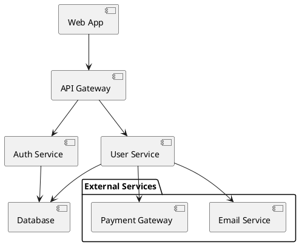
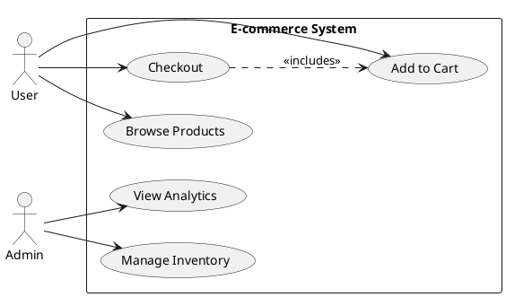
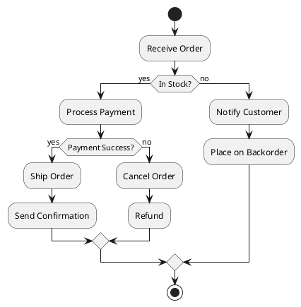
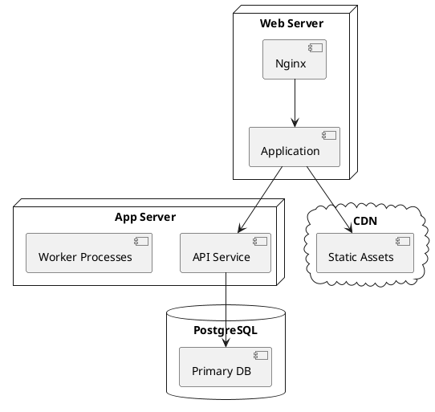
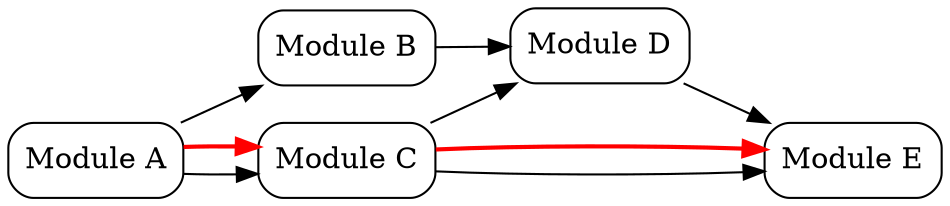
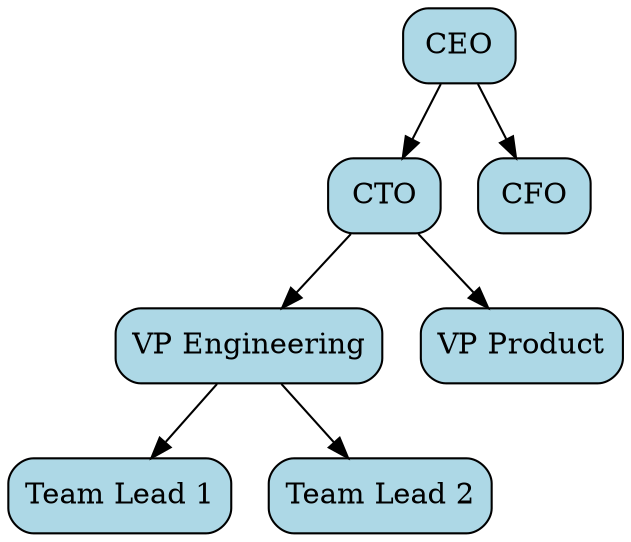
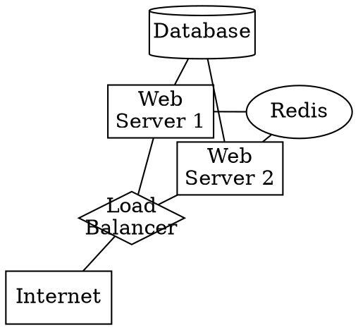

# Multi-Engine Diagram Support Expansion Plan

**Date**: October 19, 2025  
**Status**: Planning Phase  
**Objective**: Expand the Mermaid Diagram Converter to support multiple diagram engines (PlantUML, Graphviz, D2) via Kroki API

---

## Executive Summary

**Current State**: Single-engine app supporting Mermaid diagrams only (9 templates, client-side rendering)

**Target State**: Multi-engine diagram tool supporting 4 engines with 19 curated templates:
- Mermaid (9 templates) - client-side
- PlantUML (4 templates) - via Kroki API
- Graphviz (3 templates) - via Kroki API
- D2 (3 templates) - via Kroki API

**Approach**: Hybrid rendering (Mermaid client-side, others via Kroki API)

**Estimated Effort**: 4-6 hours for MVP

---

## Architecture Changes

### Current Architecture
```
User Input → Mermaid.render() → SVG → Preview
                                    ↓
                              Canvas → PNG Export
```

### New Architecture
```
User Input → [Engine Selector] → Router
                                    ↓
                    ┌───────────────┴──────────────┐
                    ↓                              ↓
            Mermaid.render()              Kroki API (POST)
            (client-side)                 (PlantUML/Graphviz/D2)
                    ↓                              ↓
                   SVG ←──────────────────────── SVG
                    ↓
                 Preview
                    ↓
          PNG Export (hybrid approach)
```

### Key Components to Add/Modify

**1. Engine Configuration (new in `data.js`)**
```javascript
const DIAGRAM_ENGINES = [
  { id: 'mermaid', label: 'Mermaid ⚡', clientSide: true },
  { id: 'plantuml', label: 'PlantUML 🌐', clientSide: false, krokiType: 'plantuml' },
  { id: 'graphviz', label: 'Graphviz 🌐', clientSide: false, krokiType: 'graphviz' },
  { id: 'd2', label: 'D2 🌐', clientSide: false, krokiType: 'd2' }
];
```

**2. Enhanced Template Structure (modify in `data.js`)**
```javascript
const TEMPLATES = [
  { key, label, category, engine, code },  // Add 'engine' field
  // ... 19 total templates
];
```

**3. Engine Selector UI (add to `index.html`)**
```html
<div class="control">
  <div class="select">
    <select id="diagram-type">
      <option value="mermaid">Mermaid ⚡</option>
      <option value="plantuml">PlantUML 🌐</option>
      <option value="graphviz">Graphviz 🌐</option>
      <option value="d2">D2 🌐</option>
    </select>
  </div>
</div>
```

**4. Rendering Router (modify in `app.js`)**
```javascript
async function renderDiagram() {
  const engine = els.diagramType.value;
  const code = els.input.value.trim();
  
  if (engine === 'mermaid') {
    // Existing Mermaid logic
    await renderMermaid(code);
  } else {
    // New Kroki API logic
    await renderKroki(engine, code);
  }
}
```

**5. Kroki API Integration (new function in `app.js`)**
```javascript
async function renderKroki(engine, code) {
  const engineConfig = DIAGRAM_ENGINES.find(e => e.id === engine);
  const krokiType = engineConfig.krokiType;
  
  const url = `https://kroki.io/${krokiType}/svg`;
  const response = await fetch(url, {
    method: 'POST',
    headers: { 'Content-Type': 'text/plain' },
    body: code
  });
  
  const svg = await response.text();
  els.preview.innerHTML = svg;
}
```

**6. Template Filtering (modify in `app.js`)**
```javascript
function buildTemplateDropdown() {
  const currentEngine = els.diagramType.value;
  const filteredTemplates = TEMPLATES.filter(t => t.engine === currentEngine);
  
  // Build dropdown from filteredTemplates
  // ... existing dropdown logic
}
```

**7. Enhanced PNG Export (modify in `app.js`)**
```javascript
async function downloadPNG() {
  const engine = els.diagramType.value;
  
  if (engine === 'mermaid') {
    // Existing: SVG → Canvas → PNG (native + Canvg fallback)
    await downloadPngFromSvg();
  } else {
    // New: Request PNG directly from Kroki
    await downloadPngFromKroki(engine, els.input.value);
  }
}
```

---

## Template Catalog

### Category Structure (Reorganized)

**1. Software Architecture** (5 templates)
- [PlantUML] Component Diagram
- [PlantUML] Deployment Diagram
- [D2] Simple Architecture
- [D2] Layered System
- [Mermaid] Class Diagram

**2. Process & Flow** (6 templates)
- [Mermaid] Flowchart (Top-Down)
- [Mermaid] Flowchart (Left-Right)
- [Mermaid] Sequence Diagram
- [PlantUML] Activity Diagram
- [PlantUML] Use Case Diagram
- [Mermaid] State Diagram

**3. Data & Relationships** (3 templates)
- [Mermaid] ER Diagram
- [Graphviz] Hierarchical Tree
- [Mermaid] Class Diagram (duplicate in both categories)

**4. Planning & Timeline** (2 templates)
- [Mermaid] Gantt Chart
- [Mermaid] Timeline

**5. Networks & Graphs** (4 templates)
- [Graphviz] Directed Graph
- [Graphviz] Network Topology
- [D2] Grid Layout
- [Mermaid] Git Graph

**Total**: 19 templates (some appear in multiple categories)

---

## Detailed Template Specifications

### Mermaid Templates (9 existing)
Keep current stable templates:
1. Flowchart (Top-Down)
2. Flowchart (Left-Right)
3. Sequence Diagram
4. Class Diagram
5. State Diagram
6. Git Graph
7. ER Diagram
8. Gantt Chart
9. Timeline

### PlantUML Templates (4 new)

**1. Component Diagram**

- **Category**: Software Architecture
- **Use case**: System component relationships, microservices

**2. Use Case Diagram**

- **Category**: Process & Flow
- **Use case**: Requirements gathering, user stories

**3. Activity Diagram**

- **Category**: Process & Flow
- **Use case**: Business process modeling, workflows

**4. Deployment Diagram**

- **Category**: Software Architecture
- **Use case**: Infrastructure documentation, DevOps

### Graphviz Templates (3 new)

**1. Directed Graph**

- **Category**: Networks & Graphs
- **Use case**: Dependencies, build order, data flow

**2. Hierarchical Tree**

- **Category**: Data & Relationships
- **Use case**: Org charts, file systems, taxonomies

**3. Network Topology**

- **Category**: Networks & Graphs
- **Use case**: Network diagrams, infrastructure topology

### D2 Templates (3 new)

**1. Simple Architecture**
```d2
users: Users {
  shape: person
}

web: Web App {
  shape: rectangle
}

api: API Server {
  shape: rectangle
}

db: Database {
  shape: cylinder
}

cache: Redis Cache {
  shape: cylinder
}

users -> web: HTTPS
web -> api: REST API
api -> db: SQL
api -> cache: Key-Value
```
- **Category**: Software Architecture
- **Use case**: Clean system architecture diagrams

**2. Layered System**
```d2
direction: down

presentation: Presentation Layer {
  ui: User Interface
  controller: Controllers
}

business: Business Layer {
  services: Business Services
  logic: Business Logic
}

data: Data Layer {
  repositories: Data Repositories
  models: Data Models
}

database: {
  shape: cylinder
  style.fill: "#d4e6f1"
}

presentation.controller -> business.services: API Calls
business.logic -> data.repositories: Data Access
data.repositories -> database: SQL Queries
```
- **Category**: Software Architecture
- **Use case**: Layered architecture, separation of concerns

**3. Grid Layout**
```d2
grid-rows: 3
grid-columns: 3

header: Header {
  grid-column: 1-3
  style.fill: "#3498db"
}

sidebar: Sidebar {
  grid-row: 2-3
  style.fill: "#95a5a6"
}

main: Main Content {
  grid-row: 2
  grid-column: 2-3
  style.fill: "#ecf0f1"
}

footer: Footer {
  grid-row: 3
  grid-column: 2-3
  style.fill: "#34495e"
}
```
- **Category**: Networks & Graphs (or UI Layouts)
- **Use case**: Layout design, grid systems, UI wireframes

---

## Implementation Checklist

### Phase 1: Core Infrastructure (2-3 hours)

**1. Data Structure Updates**
- [ ] Add `DIAGRAM_ENGINES` array to `data.js`
- [ ] Add `engine` field to all existing Mermaid templates in `data.js`
- [ ] Create 4 PlantUML templates in `data.js`
- [ ] Create 3 Graphviz templates in `data.js`
- [ ] Create 3 D2 templates in `data.js`
- [ ] Update template categories (reorganize to use-case based)

**2. UI Updates**
- [ ] Add diagram type selector dropdown to `index.html` (in toolbar)
- [ ] Add `diagramType` element reference to `els` object in `app.js`
- [ ] Add loading spinner element to `index.html` for Kroki API calls
- [ ] Update template dropdown to show `[Engine] Template Name` format

**3. Rendering Engine**
- [ ] Create `renderKroki()` function in `app.js`
- [ ] Create `fetchFromKroki()` helper function in `app.js`
- [ ] Update `renderDiagram()` to route based on engine type
- [ ] Add loading state (show spinner during Kroki API calls)
- [ ] Add error handling for Kroki API failures (network, invalid syntax)

**4. Template System Updates**
- [ ] Modify `buildTemplateDropdown()` to filter by current engine
- [ ] Update template click handler to check engine compatibility
- [ ] Add engine change event listener (rebuild template dropdown on engine switch)

**5. State Management**
- [ ] Add `diagramEngine` to `LS_KEYS` object
- [ ] Update `saveState()` to persist selected engine
- [ ] Update `restoreState()` to restore engine selection
- [ ] Update `currentConfig()` to include engine
- [ ] Update `applyConfig()` to apply engine
- [ ] Update `loadFromHash()` with backward compatibility (default to Mermaid if no engine)

### Phase 2: Export Enhancement (1-2 hours)

**6. PNG Export Updates**
- [ ] Create `downloadPngFromKroki()` function in `app.js`
- [ ] Update `downloadPNG()` to route based on engine (Mermaid vs Kroki)
- [ ] Test PNG quality from Kroki API (different engines may have different output quality)
- [ ] Add error handling for Kroki PNG export failures

**7. SVG Export Updates**
- [ ] Verify `downloadSVG()` works with Kroki-rendered SVGs (should be transparent)
- [ ] Test SVG structure from different engines (ensure no breaking differences)

**8. Copy Functions**
- [ ] Verify `copySVG()` works with all engines
- [ ] Update `copyPermalink()` to include engine in config

### Phase 3: Polish & Testing (1 hour)

**9. Error Handling**
- [ ] Add engine-specific error hints to `makeFriendlyHint()`
- [ ] Handle Kroki API timeouts (show "Server busy, try again" message)
- [ ] Handle Kroki API rate limiting (if applicable)
- [ ] Handle network failures (offline detection)

**10. UI Feedback**
- [ ] Add toast for "Rendering..." with engine name (e.g., "Rendering with PlantUML...")
- [ ] Add indicator in preview area showing which engine rendered current diagram
- [ ] Update presets to be engine-aware (or disable for non-Mermaid engines?)

**11. Testing**
- [ ] Test each template renders correctly
- [ ] Test engine switching (switch engine → template dropdown updates)
- [ ] Test SVG export for all engines
- [ ] Test PNG export for all engines
- [ ] Test permalink with each engine
- [ ] Test backward compatibility (old Mermaid-only permalinks)
- [ ] Test localStorage persistence (refresh page, engine/code restored)
- [ ] Test error states (invalid syntax for each engine)
- [ ] Test offline behavior (Mermaid works, Kroki shows error)

### Phase 4: Documentation (30 min)

**12. Update Documentation**
- [ ] Update `logs/project-context.md`:
  - New architecture diagram
  - Kroki API integration
  - Multi-engine support
  - Template catalog
  - Known limitations (internet required for PlantUML/Graphviz/D2)
- [ ] Update `logs/prompts.md`:
  - Add "Working with Multiple Engines" prompt
  - Update existing prompts to mention engine selection
- [ ] Add inline code comments for new functions

---

## Technical Specifications

### Kroki API Endpoints

**Base URL**: `https://kroki.io`

**Endpoints**:
- SVG: `POST https://kroki.io/{diagram-type}/svg`
- PNG: `POST https://kroki.io/{diagram-type}/png`

**Request**:
```http
POST https://kroki.io/plantuml/svg
Content-Type: text/plain

@startuml
A -> B
@enduml
```

**Response**: Raw SVG or PNG binary data

**Diagram types we'll use**:
- `plantuml`
- `graphviz`
- `d2`
- `mermaid` (available but we'll use client-side)

### localStorage Schema Updates

**New keys**:
```javascript
LS_KEYS.diagramEngine = 'mmd.diagramEngine';  // 'mermaid', 'plantuml', 'graphviz', 'd2'
```

**Enhanced export config**:
```javascript
{
  engine: 'plantuml',  // NEW
  scale: 2,
  bg: '#ffffff',
  padding: 16,
  filename: 'diagram'
}
```

### Permalink Schema Updates

**Before** (Mermaid-only):
```javascript
{
  code: "flowchart TD...",
  cfg: {
    theme: "default",
    direction: "",
    export: { scale: 2, bg: "#fff", padding: 16, filename: "diagram" }
  }
}
```

**After** (multi-engine):
```javascript
{
  code: "@startuml...",
  cfg: {
    engine: "plantuml",  // NEW
    theme: "default",
    direction: "",
    export: { scale: 2, bg: "#fff", padding: 16, filename: "diagram" }
  }
}
```

---

## Risk Assessment

### High Priority Risks

**1. Kroki API Availability/Reliability**
- **Risk**: Public Kroki instance (kroki.io) could have downtime or rate limits
- **Mitigation**: 
  - Add clear user messaging when API is unavailable
  - Consider adding self-hosting instructions in docs
  - Cache rendered SVGs in sessionStorage (reduce re-renders)

**2. Kroki API Latency**
- **Risk**: Network round-trip adds 200-500ms delay vs client-side Mermaid
- **Mitigation**:
  - Show loading spinner immediately
  - Add progress feedback ("Rendering...")
  - Consider debouncing auto-render on template selection

**3. CORS/Security Issues**
- **Risk**: Kroki API might have CORS restrictions
- **Mitigation**: 
  - Verify Kroki CORS headers (public instance should allow all origins)
  - Document any CORS limitations
  - Fallback: proxy through cloudflare worker if needed

**4. Syntax Incompatibilities**
- **Risk**: Users might paste Mermaid syntax when PlantUML is selected (confusion)
- **Mitigation**:
  - Clear labeling of engine in UI (icons: ⚡ vs 🌐)
  - Show which engine is active in preview area
  - Add "Syntax cheat sheet" link per engine

### Medium Priority Risks

**5. PNG Quality Variance**
- **Risk**: Kroki PNG output quality might differ from our native Mermaid pipeline
- **Mitigation**:
  - Test and document expected quality per engine
  - Consider adding quality/DPI parameter to Kroki requests (if supported)

**6. Large Diagram Handling**
- **Risk**: Large diagrams might hit Kroki request size limits or timeout
- **Mitigation**:
  - Document any size limitations
  - Add request timeout handling (show error after 30s)

**7. Template Maintenance**
- **Risk**: 19 templates across 4 engines = more maintenance burden
- **Mitigation**:
  - Use proven, stable syntax patterns
  - Add "Report Issue" link per template
  - Version templates (track which engine version they're tested with)

### Low Priority Risks

**8. Browser Compatibility**
- **Risk**: Fetch API not supported in very old browsers
- **Mitigation**: Already using modern APIs (async/await), acceptable trade-off

**9. localStorage Quota**
- **Risk**: More engines/templates = slightly more localStorage usage
- **Mitigation**: Negligible increase, existing quota handling sufficient

---

## Success Criteria

### Must Have (MVP)
- [x] User can select from 4 diagram engines (Mermaid, PlantUML, Graphviz, D2)
- [x] 19 curated templates available (filtered by selected engine)
- [x] All templates render correctly in preview
- [x] SVG export works for all engines
- [x] PNG export works for all engines
- [x] localStorage persists engine selection
- [x] Permalinks include engine and work correctly
- [x] Old Mermaid-only permalinks still work (backward compatibility)
- [x] Error messages provide useful feedback for each engine

### Nice to Have (Phase 2)
- [ ] Loading progress indicator shows % complete for Kroki calls
- [ ] "Syntax help" links per engine (link to official docs)
- [ ] Template preview thumbnails (tiny SVG preview in dropdown)
- [ ] Template search/filter (if dropdown becomes crowded)
- [ ] Self-hosting instructions for Kroki in docs
- [ ] Client-side caching of rendered diagrams (sessionStorage)

### Metrics to Track (Post-Launch)
- Template usage per engine (which are most popular?)
- Error rate per engine (which engines have syntax issues?)
- Kroki API response times (average latency)
- Export format preferences (SVG vs PNG per engine)

---

## Timeline Estimate

**Total Effort**: 4-6 hours for MVP

**Breakdown**:
- Phase 1 (Core Infrastructure): 2-3 hours
- Phase 2 (Export Enhancement): 1-2 hours
- Phase 3 (Polish & Testing): 1 hour
- Phase 4 (Documentation): 30 minutes

**Suggested Approach**:
- Day 1: Complete Phase 1 + Phase 2 (get all engines rendering + exporting)
- Day 2: Complete Phase 3 + Phase 4 (polish, test, document)

**Incremental Delivery**:
- Checkpoint 1: Mermaid + PlantUML working (2 hours)
- Checkpoint 2: Add Graphviz + D2 (1 hour)
- Checkpoint 3: All exports working (1 hour)
- Checkpoint 4: Polish + docs (1 hour)

---

## Future Enhancements (Post-MVP)

1. **More Engines via Kroki** (easy to add):
   - Ditaa (ASCII art diagrams)
   - BlockDiag (simple block diagrams)
   - SeqDiag (sequence diagrams)
   - ActDiag (activity diagrams)
   - BPMN (business process)
   - Excalidraw (hand-drawn style)
   - ... 20+ more supported by Kroki

2. **Self-Hosted Kroki**:
   - Docker compose instructions
   - Environment variable for Kroki URL
   - Fallback to public instance if self-hosted unavailable

3. **Offline Mode**:
   - Service worker to cache rendered diagrams
   - IndexedDB for larger diagram storage
   - PWA manifest for installable app

4. **Collaboration Features**:
   - Real-time collaboration (via WebSockets + CRDT)
   - Diagram versioning (save snapshots)
   - Team template library (shared templates)

5. **Advanced Export**:
   - PDF export (via jsPDF)
   - Multi-page PDF for large diagrams
   - Vector formats (EPS, SVG with embedded fonts)

6. **Editor Enhancements**:
   - Syntax highlighting per engine (CodeMirror or Monaco)
   - Auto-complete for diagram keywords
   - Live preview (render on keystroke with debounce)

---

## Open Questions

1. **Kroki Instance**: Should we document self-hosting option in MVP, or save for Phase 2?
2. **Rate Limiting**: Do we need to implement client-side rate limiting for Kroki API?
3. **Caching Strategy**: Should rendered SVGs be cached in sessionStorage to reduce API calls?
4. **Theme Support**: Do non-Mermaid engines support theming, or is that Mermaid-only? (Investigate)
5. **Direction Setting**: Should direction selector be hidden for non-flowchart engines, or keep visible?

---

**Status**: Ready for feasibility review  
**Next Step**: Feasibility check, then proceed to implementation
 
---

## Testing Plan (Detailed)

This section provides a concrete testing plan covering automated smoke checks, manual QA, and edge cases to validate the multi-engine expansion.

### Automated Smoke Checks

- Basic render sanity for each engine (Mermaid, PlantUML, Graphviz, D2): POST a small sample diagram and verify returned MIME and non-empty body.
- SVG validity: Ensure returned string starts with `<svg` and contains `xmlns` attribute.
- PNG endpoint sanity: POST diagram to Kroki PNG endpoint and ensure HTTP 200 and binary payload > 1KB.

Suggested test harness (node, minimal):

```javascript
// test/kroki-smoke.js (example)
const fetch = require('node-fetch');
async function test(type, code) {
  const url = `https://kroki.io/${type}/svg`;
  const res = await fetch(url, { method: 'POST', body: code, headers: { 'Content-Type': 'text/plain' } });
  if (!res.ok) throw new Error(`${type} svg failed: ${res.status}`);
  const text = await res.text();
  if (!text.trim().startsWith('<svg')) throw new Error(`${type} returned non-svg`);
  console.log(`${type} OK`);
}

test('plantuml', '@startuml\nA -> B\n@enduml').catch(err => { console.error(err); process.exit(1); });
```

Run these as part of a quick CI step (optional) to verify Kroki availability before exercising the UI.

### Manual QA Scenarios

1. Switch engine to PlantUML, pick the Component template, Replace `Database` label and render. Expect SVG preview and correct relationships.
2. Switch engine to Graphviz, pick Network Topology, render and export SVG and PNG.
3. Switch engine to D2, pick Grid Layout and verify layout grid and exported SVG.
4. Mermaid templates (existing) should render client-side as before; test a complex Mermaid flowchart to ensure no regressions.
5. Permalink creation: create a permalink for a PlantUML diagram and open it in a fresh browser session — the selected engine and code should restore correctly.
6. Offline behavior: disconnect network and confirm Mermaid diagrams still render while Kroki-based engines show an informative error.

### Edge Cases

- Very large diagrams (>= 200KB text) — show clear error or timeout message.
- Invalid syntax per engine — display Kroki error payload (if present) in friendly form.
- Rapid engine switching (change engine then re-render quickly) — UI should not crash and should cancel/ignore in-flight Kroki requests.

---

## Rollout & Deployment Steps

Plan for a staged rollout with a quick feedback loop.

1. Feature branch & internal QA: implement feature behind an opt-in flag (or localStorage toggle) and test locally.
2. Canary release: ship to a small percentage of users (if deployed externally) or share build with a small set of beta testers.
3. Monitor errors & latency (Kroki calls): gather logs and user feedback for 24–72 hours.
4. Full release: merge to `main` and publish. Announce the change in README and changelog.

Fallback & rollback: The app should gracefully degrade to Mermaid-only mode if the Kroki integration experiences critical failures. Provide a visible toggle in settings to force Mermaid-only mode.

---

## Implementation Snippets (copyable)

These are small helper examples to implement in `app.js`.

### fetchWithTimeout (helper)

```javascript
async function fetchWithTimeout(url, opts = {}, timeout = 20000) {
  const controller = new AbortController();
  const id = setTimeout(() => controller.abort(), timeout);
  try {
    const res = await fetch(url, { ...opts, signal: controller.signal });
    clearTimeout(id);
    return res;
  } catch (err) {
    clearTimeout(id);
    throw err;
  }
}
```

### renderKroki (in-app render helper)

```javascript
async function renderKroki(engineId, code) {
  const engineCfg = DIAGRAM_ENGINES.find(e => e.id === engineId);
  if (!engineCfg || !engineCfg.krokiType) throw new Error('Unsupported engine');
  const url = `https://kroki.io/${engineCfg.krokiType}/svg`;
  const res = await fetchWithTimeout(url, { method: 'POST', headers: { 'Content-Type': 'text/plain' }, body: code }, 20000);
  if (!res.ok) {
    const txt = await res.text().catch(() => '');
    throw new Error(`Kroki render error (${res.status}): ${txt}`);
  }
  const svg = await res.text();
  // Optionally sanitize / strip scripts here
  els.preview.innerHTML = svg;
  // annotate preview with engine badge
  els.preview.dataset.engine = engineId;
}
```

### downloadPngFromKroki (export helper)

```javascript
async function downloadPngFromKroki(engineId, code, filename = 'diagram') {
  const engineCfg = DIAGRAM_ENGINES.find(e => e.id === engineId);
  const url = `https://kroki.io/${engineCfg.krokiType}/png`;
  const res = await fetchWithTimeout(url, { method: 'POST', headers: { 'Content-Type': 'text/plain' }, body: code }, 30000);
  if (!res.ok) throw new Error(`Kroki PNG failed: ${res.status}`);
  const blob = await res.blob();
  const link = document.createElement('a');
  link.href = URL.createObjectURL(blob);
  link.download = `${filename}.png`;
  document.body.appendChild(link);
  link.click();
  link.remove();
}
```

Note: PNG responses are binary; ensure you use `res.blob()` and not `res.text()`.

---

## Kroki Self-Hosting Quickstart (optional)

If you prefer not to rely on the public Kroki instance, here's a minimal Docker Compose snippet to run a local Kroki instance. This is intentionally minimal; adjust volumes and resources for production.

```yaml
version: '3.8'
services:
  kroki:
    image: yuzutech/kroki:latest
    ports:
      - "8000:8000"
    environment:
      - KROKI_HOST=0.0.0.0
    restart: unless-stopped
```

After starting, point the app to `http://<host>:8000` by exposing an environment variable or adding a user-configurable Kroki URL in settings. Example runtime override in app code:

```javascript
const KROKI_BASE = localStorage.getItem('mmd.krokiBase') || 'https://kroki.io';
const url = `${KROKI_BASE}/${engineCfg.krokiType}/svg`;
```

Document this option in `logs/project-context.md` under
