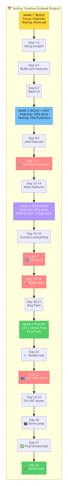
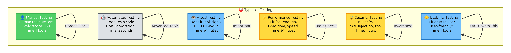
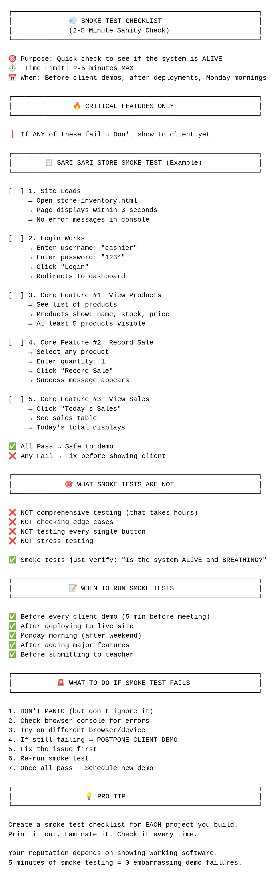
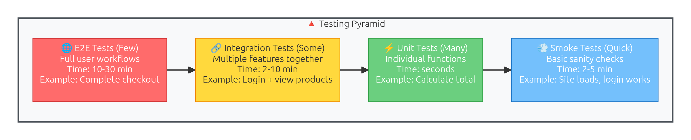
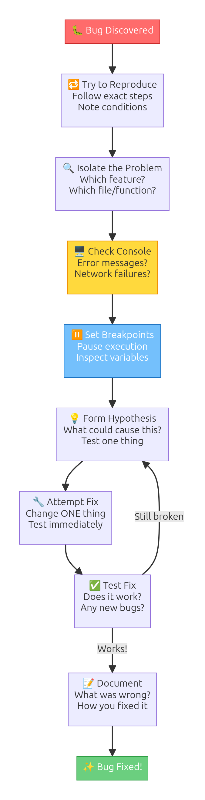
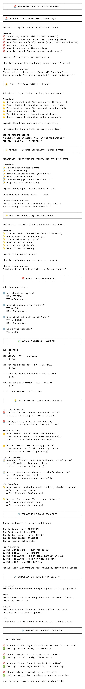
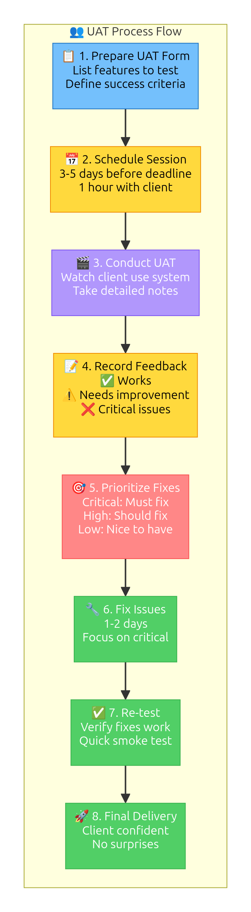
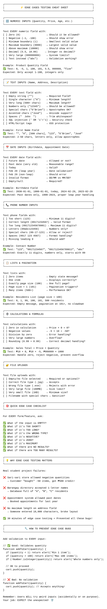
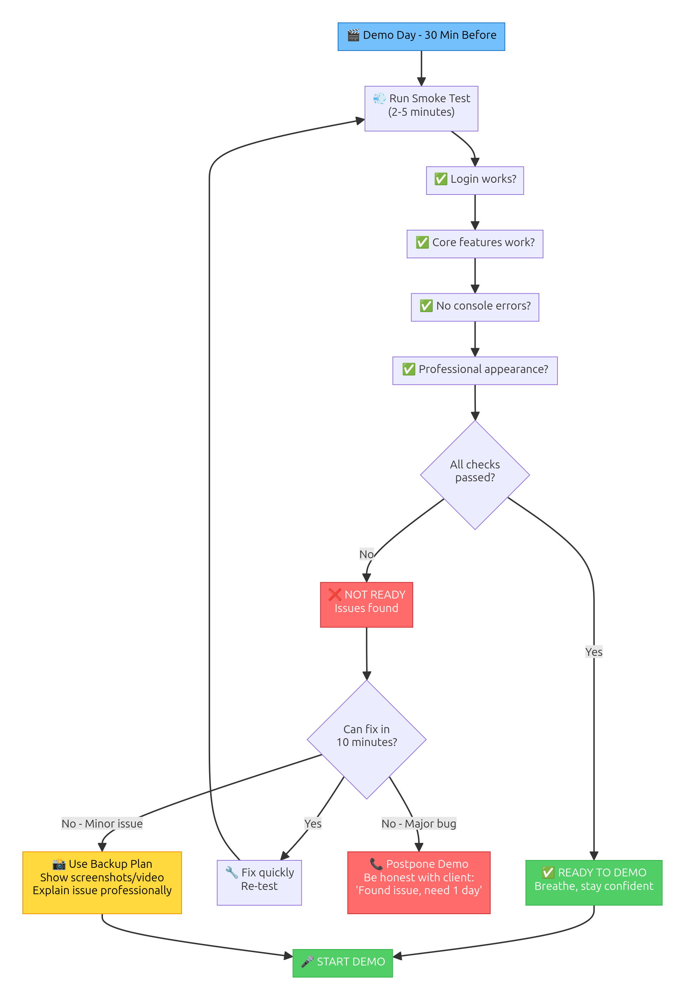

# Testing & Quality Assurance - Delivering with Confidence

> **For Grade 9 Filipino Students**  
> **Goal:** Learn to test your web applications systematically, ensuring you deliver reliable, professional software to clients with confidence.

---

## 🎯 What You'll Learn

By the end of this lecture, you'll be able to:
- Write clear user stories and acceptance criteria BEFORE coding
- Debug systematically using Chrome DevTools (not random clicking)
- Create smoke test checklists to catch bugs early
- Test complete user journeys (E2E testing)
- Conduct User Acceptance Testing (UAT) with real users
- Write professional bug reports clients can understand
- Deliver projects confidently: "I tested everything you paid for"

**Real-world impact:** The difference between "I think it works" and "I KNOW it works because I tested it."

---

## 📖 Table of Contents

1. [Why Test? Real-World Consequences](#section-1-why-test)
2. [From Features to Tests - The Bridge](#section-2-from-features-to-tests)
3. [User Stories - Knowing What to Build](#section-3-user-stories)
4. [Acceptance Criteria - Knowing When You're Done](#section-4-acceptance-criteria)
5. [Smoke Testing - Does It Even Run?](#section-5-smoke-testing)
6. [Debugging Fundamentals - Systematic Problem Solving](#section-6-debugging-fundamentals)
7. [Professional Bug Reports - Clear Communication](#section-7-professional-bug-reports)

---

<a name="section-1-why-test"></a>
## 📌 Section 1: Why Test? Real-World Consequences

### The Sari-Sari Store Nightmare (True Story)

Imagine: You built an inventory system for **Tindahan ni Aling Rosa**. You demoed it once, it worked. You got paid ₱15,000. Everyone's happy.

**Week 2:** Aling Rosa calls, frustrated:
- "When I add products with commas in the name ('Skyflakes, 10pcs'), they don't save properly!"
- "The stock count shows negative numbers after some sales!"
- "When I search for 'Lucky Me', nothing appears even though we have 50 packs!"

**What happened?** You never tested with:
- ❌ Special characters (commas, apostrophes)
- ❌ Edge cases (selling more than stock)
- ❌ Real data (Filipino product names)

**Result:** Lost trust, spent 2 more weeks fixing bugs for free, Aling Rosa tells other store owners "Bata pa yan, di pa marunong."

### The Barangay Directory Disaster

A student built a resident directory for Barangay San Juan. Looked perfect on their laptop.

**Launch day:** Kagawad Maria tries to use it on her phone:
- ❌ Buttons too small to tap (not mobile-tested)
- ❌ Search doesn't work if name has "ñ" (Señorita, Niño)
- ❌ Page crashes when loading 500+ residents (never tested with real data volume)

**Result:** System abandoned, went back to Excel spreadsheets.

### What Testing Prevents

✅ **Lost trust** - Clients see you as professional, not "bata pa"  
✅ **Free bug fixes** - Catch issues before delivery = get paid properly  
✅ **Bad reputation** - Word spreads fast in communities  
✅ **Wasted time** - Fixing bugs after launch takes 10x longer  
✅ **Lost opportunities** - One bad project ruins future projects  

### The Professional Advantage

When you can say:
- ✅ "I tested every feature you paid for"
- ✅ "I tested with real users (your staff tried it)"
- ✅ "I tested on mobile phones (70% of your customers)"
- ✅ "I have a test report showing everything works"

**You stand out.** Small businesses WANT reliability over fancy features.

---

<a name="section-2-from-features-to-tests"></a>
## 🔄 Section 2: From Features to Tests - The Bridge

### The Gap Between "Build" and "Test"

In `project-scoping.md`, you learned to identify projects you can build. Examples:
- ✅ Sari-sari store inventory system
- ✅ Appointment booking system  
- ✅ Barangay information system

**But how do you PROVE these work?**

This section bridges: **Features → Tests → Confidence**

### Example: Sari-Sari Store Feature List

From project-scoping, Aling Rosa's requirements:
1. Product catalog (name, price, stock, category)
2. QR code for product labels
3. Sales recording (who sold what, when)
4. Low stock alerts (below threshold)
5. Sales reports (daily/weekly/monthly)
6. User roles (Admin, Cashier)

**Question:** How do you test each feature systematically?

### The Testing Bridge (Feature → User Story → Acceptance Criteria → Test Cases)

### **Visual Guide: Testing Timeline**


*Figure 1: Project lifecycle showing when each type of testing happens - from user stories to final UAT*

**Step 1: Convert to User Stories**
```
Feature: Product catalog
→ User Story: "As a store owner, I want to add products 
  so that I can track inventory"
```

**Step 2: Write Acceptance Criteria**
```
User Story: Add products
→ Acceptance Criteria:
  - GIVEN I'm logged in as admin
  - WHEN I add a product with name, price, stock
  - THEN I should see the product in the catalog
  - AND the QR code should generate automatically
```

**Step 3: Create Test Cases**
```
Acceptance Criteria: Product appears in catalog
→ Test Cases:
  1. Add "Skyflakes" (₱10, stock: 50)
  2. Verify product appears in product list
  3. Verify QR code displays on product page
  4. Verify price shows as ₱10.00
  5. Verify stock shows as 50
```

### **Visual Guide: Types of Testing**


*Figure 2: Overview of testing types from smoke tests to UAT and their purposes*

### Why This Matters for Project Delivery

Remember the project-scoping conversation:

**Client:** "Can you build our inventory system?"

**Before testing knowledge:**
❌ "Yes, I can build it!" (hoping it works)

**After testing knowledge:**
✅ "Yes! I'll deliver:
- User stories (so we agree on features)
- Test plan (showing everything will be tested)
- Working system (proven with test results)
- Test report (documentation it all works)

I can confidently deliver this in 3-4 weeks."

**See the difference?** You're not just coding—you're **delivering with proof**.

---

<a name="section-3-user-stories"></a>
## 📝 Section 3: User Stories - Knowing What to Build

### What Is a User Story?

A **user story** describes a feature from the user's perspective:

```
As a [role]
I want to [action]
So that [benefit]
```

### **Visual Guide: User Story Format**


*Figure 3: Anatomy of a user story showing role, action, and benefit components with examples*

**Why this format?**
- **"As a [role]"** - Reminds you WHO will use this feature
- **"I want to [action]"** - Focuses on WHAT they need to do
- **"So that [benefit]"** - Explains WHY they need it

### Real Example: Sari-Sari Store

**Bad feature description:**
❌ "The system should have a sales module"  
(What does "sales module" even mean?)

**Good user story:**
✅ **As a cashier**, I want to record sales quickly, so that customers don't wait long at checkout.

**Even better (specific):**
✅ **As a cashier**, I want to scan a product QR code to add it to the sale, so that I don't have to type the product name manually.

### Template: Sari-Sari Store User Stories

Let's write user stories for Aling Rosa's inventory system:

#### 👤 Admin (Store Owner) Stories

```
1. As an admin, I want to add new products with name, price, and stock,
   so that I can track what's available in my store.

2. As an admin, I want to see low stock alerts,
   so that I know what to reorder before running out.

3. As an admin, I want to view daily sales reports,
   so that I know how much I earned today.

4. As an admin, I want to generate QR codes for products,
   so that customers can scan for product info or cashiers can scan at checkout.

5. As an admin, I want to export sales data to CSV,
   so that I can give it to my accountant for taxes.
```

#### 💰 Cashier Stories

```
1. As a cashier, I want to record sales with customer name and items sold,
   so that stock decreases automatically and the sale is logged.

2. As a cashier, I want to see current stock before selling,
   so that I don't sell items we don't have.

3. As a cashier, I want to view my sales history,
   so that I can verify what I sold today.
```

### Why User Stories Matter for Testing

Each user story becomes:
1. ✅ A feature to build
2. ✅ A feature to test
3. ✅ A feature to demo to the client

**Without user stories:** "Did I forget anything?" (anxiety)  
**With user stories:** "I have 8 features, I tested all 8" (confidence)

### Common Mistakes

❌ **Too technical:**  
"As a user, I want the system to use SQLite foreign keys..."  
(Users don't care about database internals)

✅ **User-focused:**  
"As a store owner, I want to see which products sell best..."

❌ **Too vague:**  
"As a user, I want better reports..."  
(What does "better" mean?)

✅ **Specific:**  
"As a store owner, I want to see daily sales totals grouped by category..."

### 🎯 Try It: User Story Template

**Open:** `assets/user-story-template.html`

This interactive tool helps you write user stories:
1. Select role (Admin, Cashier, Customer, etc.)
2. Fill in action (what they want to do)
3. Fill in benefit (why they need it)
4. Click "Generate User Story"
5. Get properly formatted story: "As a [role], I want to [action], so that [benefit]"

**Practice:** Write 3 user stories for a barangay directory system (officials, residents).

---

<a name="section-4-acceptance-criteria"></a>
## ✅ Section 4: Acceptance Criteria - Knowing When You're Done

### The Problem: "Is This Feature Done?"

You built the "Add Product" feature. But is it **done**?

- Does it validate product names?
- Does it prevent negative prices?
- Does it handle duplicate products?
- Does it show success message?
- Does the product appear in the list?

**Without acceptance criteria:** You guess what "done" means.  
**With acceptance criteria:** You have a checklist proving it's done.

### Given/When/Then Format

Acceptance criteria use a simple 3-part structure:

```
GIVEN [initial state/context]
WHEN [action occurs]
THEN [expected result]
AND [additional expected results]
```

### **Visual Guide: Given-When-Then Structure**


*Figure 4: Given-When-Then acceptance criteria format with context, action, and expected outcome*

**Why this format?**
- **GIVEN** - Sets up the test scenario (context)
- **WHEN** - Describes the user action (what they do)
- **THEN** - States what should happen (expected outcome)
- **AND** - Adds more expected outcomes

### Example: Sari-Sari Store "Add Product"

**User Story:**
> As an admin, I want to add new products with name, price, and stock, so that I can track what's available in my store.

**Acceptance Criteria:**

```
Scenario 1: Successfully add product
────────────────────────────────────
GIVEN I am logged in as admin
  AND I am on the "Add Product" page
WHEN I enter product name "Skyflakes"
  AND I enter price "10"
  AND I enter stock quantity "50"
  AND I select category "Snacks"
  AND I click "Save Product"
THEN I should see success message "Product added successfully"
  AND the product should appear in the product list
  AND the product should have a QR code generated
  AND stock should display as 50

Scenario 2: Prevent negative price
──────────────────────────────────
GIVEN I am logged in as admin
  AND I am on the "Add Product" page
WHEN I enter price "-10"
  AND I click "Save Product"
THEN I should see error "Price cannot be negative"
  AND the product should NOT be saved

Scenario 3: Prevent empty product name
───────────────────────────────────────
GIVEN I am logged in as admin
  AND I am on the "Add Product" page
WHEN I leave product name blank
  AND I click "Save Product"
THEN I should see error "Product name is required"
  AND the product should NOT be saved

Scenario 4: Handle duplicate product names
───────────────────────────────────────────
GIVEN I am logged in as admin
  AND a product "Skyflakes" already exists
WHEN I try to add another product named "Skyflakes"
  AND I click "Save Product"
THEN I should see warning "Product already exists. Do you want to update quantity?"
  AND I should have option to cancel or proceed
```

### Why Acceptance Criteria Matter

1. ✅ **Defines "done"** - No guessing if feature is complete
2. ✅ **Prevents scope creep** - "We agreed on these criteria"
3. ✅ **Creates test cases** - Each scenario = one test
4. ✅ **Client communication** - "These are the conditions I'll test"

### From Acceptance Criteria to Test Cases

Each acceptance criteria scenario becomes a manual test:

**Scenario 1: Successfully add product**  
→ **Test Case 1:** 
1. Log in as admin
2. Navigate to Add Product page
3. Enter "Skyflakes", ₱10, stock 50, category Snacks
4. Click Save
5. ✅ Verify success message appears
6. ✅ Verify product in list
7. ✅ Verify QR code displays
8. ✅ Verify stock shows 50

### How Many Scenarios Do You Need?

**Minimum:**
- ✅ 1 "happy path" (everything works perfectly)
- ✅ 1-2 error scenarios (common mistakes)

**Better:**
- ✅ 1 happy path
- ✅ 2-3 error scenarios (validation, duplicates, edge cases)
- ✅ 1 edge case (special characters, max limits)

**Don't overdo it:** You're not Google. Focus on likely scenarios.

### 🎯 Try It: Acceptance Criteria Generator

**Open:** `assets/acceptance-criteria-generator.html`

This tool helps you write acceptance criteria:
1. Enter user story
2. Select scenario type (happy path, error, edge case)
3. Fill in the GIVEN/WHEN/THEN fields
4. Click "Generate Acceptance Criteria"
5. Get properly formatted criteria you can copy-paste

**Practice:** Write acceptance criteria for:
- "Record a sale" (sari-sari store)
- "Search residents" (barangay directory)
- "Book appointment" (appointment system)

---

<a name="section-5-smoke-testing"></a>
## 🔥 Section 5: Smoke Testing - Does It Even Run?

### What Is Smoke Testing?

**Smoke testing** = Quick sanity checks to verify basic functionality works.

**Origin:** Hardware testing—if you plug it in and smoke comes out, it's broken. In software: if basic features don't work, don't bother testing details.

**Purpose:** Catch catastrophic failures fast before wasting time on detailed testing.

### When to Smoke Test

✅ **Before demoing to client** - Avoid embarrassing crashes  
✅ **After deploying to Railway** - Make sure deployment worked  
✅ **After making changes** - Did I break anything?  
✅ **Monday morning** - Did something break over the weekend?  

**Time:** 2-5 minutes (should be FAST)

### **Visual Guide: Smoke Test Checklist**


*Figure 5: Complete smoke test checklist template for quick sanity checking before detailed testing*

### Sari-Sari Store Smoke Test Checklist

```
SMOKE TEST: Sari-Sari Store Inventory System
────────────────────────────────────────────

Date: _______________
Tester: _____________

□ 1. Application loads (no white screen, no errors)
□ 2. Can navigate to login page
□ 3. Can log in as admin (username: admin, password: admin123)
□ 4. Dashboard displays (no errors in console)
□ 5. Can navigate to Products page
□ 6. Product list loads (at least test products appear)
□ 7. Can click "Add Product" button (form appears)
□ 8. Can navigate to Sales page
□ 9. Can log out
□ 10. Can log in as cashier (username: cashier, password: cash123)

✅ PASS - All checks passed, safe to test details
❌ FAIL - Stop, fix broken items before continuing
```

### **Visual Guide: Testing Pyramid**


*Figure 6: Testing pyramid showing the ratio of smoke tests, feature tests, and edge case tests*

### What Smoke Testing is NOT

❌ **Not detailed testing** - Don't test every field, every validation  
❌ **Not edge cases** - Don't test special characters, max limits  
❌ **Not user journeys** - Don't test complete workflows  

**Smoke test asks:** "Can I even start testing?" (basic sanity)  
**E2E test asks:** "Does the complete feature work?" (detailed validation)

### Real-World Example: Before Client Demo

**Thursday 9 AM:** You'll demo the sari-sari store system to Aling Rosa at 2 PM.

**What you do:**

**9:00 AM - Smoke test** (5 minutes)
```
✅ App loads on Railway
✅ Login works
✅ Dashboard displays
✅ Can add a product
✅ Can record a sale
```

**If smoke test FAILS:**
🚨 You have 5 hours to fix critical bug before demo  
(Better to know now than in front of client!)

**If smoke test PASSES:**
✅ Spend remaining time polishing, preparing demo script

### Barangay Directory Smoke Test

```
□ 1. Application loads without errors
□ 2. Can log in as admin
□ 3. Resident list displays (test data appears)
□ 4. Can click "Add Resident" (form appears)
□ 5. Can search residents (search box works)
□ 6. Can navigate between pages (pagination works)
□ 7. Can view resident details (click name → details page)
□ 8. Can log out and log back in
```

### Creating Your Own Smoke Test Checklist

**For ANY project, test these basics:**

1. ✅ **Application loads** (no white screen)
2. ✅ **Login works** (for each user role)
3. ✅ **Main pages load** (list pages, forms)
4. ✅ **Can create a record** (add one item)
5. ✅ **Can view records** (list displays)
6. ✅ **Can navigate** (links and buttons work)
7. ✅ **Logout works**

**Time limit:** If smoke test takes >10 minutes, it's too detailed.

### 🎯 Try It: Interactive Smoke Test Checklist

**Open:** `assets/smoke-test-checklist.html`

Interactive tool for smoke testing:
1. Select project type (Sari-sari store, Barangay directory, Appointment booking)
2. Get generated smoke test checklist
3. Check off items as you test
4. See PASS/FAIL result
5. Export checklist as text (copy-paste to client)

**Practice:** Smoke test one of your previous projects (HTML lecture final challenge, AJAX dashboard).

---

<a name="section-6-debugging-fundamentals"></a>
## 🐛 Section 6: Debugging Fundamentals - Systematic Problem Solving

### The Problem: Random Clicking vs Systematic Debugging

**Random clicking approach (DON'T DO THIS):**
```
❌ Click around hoping error disappears
❌ Change random code
❌ Refresh browser 10 times
❌ Google error message, copy-paste first solution
❌ "It works on my computer" (give up)
```

**Systematic debugging approach (DO THIS):**
```
✅ Read error message carefully
✅ Identify exactly where error occurs
✅ Form hypothesis about cause
✅ Test hypothesis methodically
✅ Fix root cause (not symptoms)
✅ Verify fix works
```

### **Visual Guide: Debugging Workflow**


*Figure 7: Step-by-step systematic debugging process from error detection to verified fix*

### Step 1: Read the Error Message

**Example error:**
```
Uncaught ReferenceError: productName is not defined
    at recordSale (sales.js:42)
    at HTMLButtonElement.onclick (sales.html:18)
```

**What this tells you:**
- ❌ **Type:** ReferenceError (variable doesn't exist)
- ❌ **Problem:** `productName` is not defined
- ❌ **Location:** sales.js, line 42
- ❌ **Triggered by:** Button click in sales.html, line 18

**Don't ignore this information!** It tells you EXACTLY where to look.

### Step 2: Use Console.log Strategically

**Bad console.log usage:**
```javascript
console.log('here');  // WHERE is "here"??
console.log('test');  // Testing WHAT??
console.log(data);    // Is data an array? Object? String?
```

**Good console.log usage:**
```javascript
console.log('🔍 recordSale() started');
console.log('📦 Product name:', productName);
console.log('💰 Price:', price, 'Type:', typeof price);
console.log('📊 Sales array:', sales);
console.table(sales);  // For arrays of objects
```

**Pro tips:**
- ✅ Use emojis to find your logs quickly
- ✅ Log variable name AND value
- ✅ Use `console.table()` for arrays/objects
- ✅ Use `typeof` to check data types
- ✅ Remove console.logs before client demo

### Step 3: Chrome DevTools - Your Best Friend

#### Opening DevTools
- **Windows/Linux:** F12 or Ctrl+Shift+I
- **Mac:** Cmd+Option+I
- **Or:** Right-click → Inspect

#### Console Tab (View Errors and Logs)
```
✅ Shows all errors (red text)
✅ Shows console.log() outputs
✅ Shows warnings (yellow text)
✅ You can type JavaScript directly here to test
```

**Try this in Console:**
```javascript
// Test if a function exists
typeof addProduct  // Should return "function"

// Test if variable exists
productList  // Shows value or "undefined"

// Test code before adding to file
let test = [1, 2, 3];
test.filter(x => x > 1);  // [2, 3]
```

#### Elements Tab (Inspect HTML/CSS)
```
✅ Click element to see its HTML
✅ See all CSS applied to element
✅ Edit HTML/CSS live (temporary testing)
✅ Check if element exists (Ctrl+F to search)
```

#### Network Tab (Check Fetch Requests)
```
✅ See all fetch() requests
✅ Check if JSON file loaded (Status: 200 = success)
✅ View response data
✅ See errors (Status: 404 = file not found)
```

### Step 4: The Debugging Process (Systematic)

**Example problem:** "When I click 'Record Sale', nothing happens"

#### Step 1: Can you reproduce it?
```
✅ Open page
✅ Click "Record Sale" button
✅ Result: Nothing happens (confirmed reproducible)
```

#### Step 2: Check Console for errors
```
Open DevTools → Console tab
Error: "Uncaught TypeError: Cannot read property 'value' of null"
Location: sales.js:35
```

#### Step 3: Go to exact line
```javascript
// sales.js, line 35
const productName = document.getElementById('productName').value;
//                                          ^^^^^^^^^^^^^^
//                  Error: This returns null
```

#### Step 4: Form hypothesis
```
Hypothesis: The element with id="productName" doesn't exist
Why? Maybe I spelled it wrong in HTML?
```

#### Step 5: Check HTML
```html
<!-- sales.html -->
<input type="text" id="product-name" name="productName">
<!--                   ^^^^^^^^^^^^
     FOUND IT! Dash vs no dash mismatch -->
```

#### Step 6: Fix
```javascript
// BEFORE (wrong)
const productName = document.getElementById('productName').value;

// AFTER (correct)
const productName = document.getElementById('product-name').value;
```

#### Step 7: Verify fix
```
✅ Refresh page
✅ Click "Record Sale" button
✅ Result: Sale is recorded successfully!
✅ Check Console: No errors
```

### Common Errors and Solutions

#### Error 1: "Cannot read property 'value' of null"
```
❌ Cause: Element doesn't exist (wrong ID, wrong spelling)
✅ Solution: Check HTML for correct id="..."
✅ Use console.log(document.getElementById('...')); to test
```

#### Error 2: "productName is not defined"
```
❌ Cause: Variable not declared or out of scope
✅ Solution: Check spelling, check if variable exists
✅ Add: let productName = ''; (declare before using)
```

#### Error 3: "Failed to fetch"
```
❌ Cause: JSON file path wrong, or file doesn't exist
✅ Solution: Check path (assets/data.json vs data.json)
✅ Check Network tab: Does request show 404?
```

#### Error 4: "Unexpected token < in JSON"
```
❌ Cause: Server returned HTML instead of JSON (404 page)
✅ Solution: JSON file doesn't exist at that path
✅ Check: Is file named correctly? In right folder?
```

#### Error 5: "price is NaN"
```
❌ Cause: Trying to do math with non-number (like "")
✅ Solution: Convert to number first
✅ Fix: let price = parseFloat(priceInput.value);
```

### Debugging Checklist

When something doesn't work:
1. ✅ **Check Console** - Read error message
2. ✅ **Find exact line** - Error message tells you where
3. ✅ **Add console.logs** - Check variable values
4. ✅ **Form hypothesis** - Guess what's wrong
5. ✅ **Test hypothesis** - Verify your guess
6. ✅ **Fix root cause** - Not just symptoms
7. ✅ **Verify fix** - Test that it actually works
8. ✅ **Test related features** - Did fix break anything else?

### 🎯 Try It: Debugging Practice

**Open:** `assets/debugging-practice.html`

This file has **5 intentional bugs**. Your job:
1. Open in browser
2. Try to use features
3. When errors occur, use DevTools to find them
4. Fix each bug using systematic debugging
5. Verify all features work when done

**Bugs include:**
- Misspelled element ID
- Missing variable declaration
- Wrong JSON file path
- Type mismatch (string vs number)
- Missing function

**Goal:** Practice systematic debugging, not random clicking!

---

<a name="section-7-professional-bug-reports"></a>
## 📋 Section 7: Professional Bug Reports - Clear Communication

### Why Bug Reports Matter

**Scenario:** You delivered the sari-sari store system to Aling Rosa. She calls:

**Bad communication:**
❌ Aling Rosa: "It's broken!"  
❌ You: "What's broken?"  
❌ Aling Rosa: "I don't know, it just doesn't work!"  
❌ You: "Can you send a screenshot?"  
❌ Aling Rosa: "I don't know how..."  

**Result:** You spend 2 hours trying to figure out what she means.

**Good communication:**
✅ Aling Rosa fills out bug report form you provided:
```
What were you trying to do?
- Record a sale for Lucky Me Pancit Canton

What did you expect to happen?
- Sale should be recorded and stock should decrease

What actually happened?
- Error message: "Cannot record sale"

Steps to reproduce:
1. Log in as cashier
2. Go to Sales page
3. Select "Lucky Me Pancit Canton"
4. Enter quantity: 5
5. Click "Record Sale"
6. Error appears
```

**Result:** You know EXACTLY what to fix.

### **Visual Guide: Bug Severity Guide**


*Figure 8: Bug severity classification from critical to low priority with examples and response times*

### Professional Bug Report Template

```
BUG REPORT #___
━━━━━━━━━━━━━━━━━━━━━━━━━━━━━━

📅 DATE REPORTED: _______________
👤 REPORTED BY: ________________
💼 USER ROLE: ___________________ (Admin, Cashier, etc.)

━━━━━━━━━━━━━━━━━━━━━━━━━━━━━━
📝 DESCRIPTION
━━━━━━━━━━━━━━━━━━━━━━━━━━━━━━

Short summary (one sentence):
[e.g., "Cannot record sale when product name has comma"]

━━━━━━━━━━━━━━━━━━━━━━━━━━━━━━
🎯 EXPECTED BEHAVIOR
━━━━━━━━━━━━━━━━━━━━━━━━━━━━━━

What should happen?
[e.g., "Sale should be recorded successfully and stock should decrease"]

━━━━━━━━━━━━━━━━━━━━━━━━━━━━━━
❌ ACTUAL BEHAVIOR
━━━━━━━━━━━━━━━━━━━━━━━━━━━━━━

What actually happens?
[e.g., "Error message appears: 'Cannot process sale'"]

━━━━━━━━━━━━━━━━━━━━━━━━━━━━━━
🔁 STEPS TO REPRODUCE
━━━━━━━━━━━━━━━━━━━━━━━━━━━━━━

Exact steps to make bug happen:
1. [e.g., Log in as cashier]
2. [e.g., Go to Sales page]
3. [e.g., Select product "Lucky Me, Pancit Canton"]
4. [e.g., Enter quantity: 5]
5. [e.g., Click "Record Sale"]
6. [e.g., Error appears]

━━━━━━━━━━━━━━━━━━━━━━━━━━━━━━
🚨 SEVERITY
━━━━━━━━━━━━━━━━━━━━━━━━━━━━━━

□ CRITICAL - System unusable, blocks work
□ HIGH - Major feature broken, has workaround
□ MEDIUM - Minor feature broken, not urgent
□ LOW - Cosmetic issue, doesn't affect functionality

━━━━━━━━━━━━━━━━━━━━━━━━━━━━━━
📱 ENVIRONMENT
━━━━━━━━━━━━━━━━━━━━━━━━━━━━━━

Device: [e.g., Samsung Galaxy A23]
Browser: [e.g., Chrome Mobile 120]
Operating System: [e.g., Android 13]
Screen size: [e.g., Mobile phone]

━━━━━━━━━━━━━━━━━━━━━━━━━━━━━━
📸 SCREENSHOT (if possible)
━━━━━━━━━━━━━━━━━━━━━━━━━━━━━━

[Attach screenshot showing error]

━━━━━━━━━━━━━━━━━━━━━━━━━━━━━━
💡 ADDITIONAL NOTES
━━━━━━━━━━━━━━━━━━━━━━━━━━━━━━

[Any other relevant information]
```

### Real Example: Sari-Sari Store Bug Report

```
BUG REPORT #003
━━━━━━━━━━━━━━━━━━━━━━━━━━━━━━

📅 DATE REPORTED: November 12, 2025
👤 REPORTED BY: Aling Rosa
💼 USER ROLE: Admin (Store Owner)

━━━━━━━━━━━━━━━━━━━━━━━━━━━━━━
📝 DESCRIPTION
━━━━━━━━━━━━━━━━━━━━━━━━━━━━━━

Product name with comma causes "Cannot add product" error

━━━━━━━━━━━━━━━━━━━━━━━━━━━━━━
🎯 EXPECTED BEHAVIOR
━━━━━━━━━━━━━━━━━━━━━━━━━━━━━━

Should be able to add products with names containing commas,
like "Skyflakes, 10pcs" or "Lucky Me, Pancit Canton"

━━━━━━━━━━━━━━━━━━━━━━━━━━━━━━
❌ ACTUAL BEHAVIOR
━━━━━━━━━━━━━━━━━━━━━━━━━━━━━━

Error message appears: "Cannot add product"
Product is not saved to database

━━━━━━━━━━━━━━━━━━━━━━━━━━━━━━
🔁 STEPS TO REPRODUCE
━━━━━━━━━━━━━━━━━━━━━━━━━━━━━━

1. Log in as admin (username: admin)
2. Click "Products" in navigation
3. Click "Add New Product" button
4. Enter product name: "Skyflakes, 10pcs"
5. Enter price: 10
6. Enter stock: 50
7. Select category: Snacks
8. Click "Save Product"
9. Error appears

━━━━━━━━━━━━━━━━━━━━━━━━━━━━━━
🚨 SEVERITY
━━━━━━━━━━━━━━━━━━━━━━━━━━━━━━

☑ HIGH - Major feature broken, has workaround
  (Can add products without commas in name)

━━━━━━━━━━━━━━━━━━━━━━━━━━━━━━
📱 ENVIRONMENT
━━━━━━━━━━━━━━━━━━━━━━━━━━━━━━

Device: Desktop Computer
Browser: Chrome 120
Operating System: Windows 11
Screen size: Desktop (1920x1080)

━━━━━━━━━━━━━━━━━━━━━━━━━━━━━━
💡 ADDITIONAL NOTES
━━━━━━━━━━━━━━━━━━━━━━━━━━━━━━

- Many Filipino products have commas in names
- This affects about 30% of our products
- Workaround: Remove commas (write "10pcs" instead of ", 10pcs")
- Bug happens on both desktop and mobile
```

### Severity Levels Explained

**CRITICAL** 🚨 (Fix immediately, same day)
- System completely broken (won't load)
- Login doesn't work (nobody can use system)
- Data loss (deleting records accidentally)
- Security breach (unauthorized access)

**HIGH** ⚠️ (Fix within 1-2 days)
- Major feature broken (add product fails)
- Workaround exists but inconvenient
- Affects many users
- Blocks important work

**MEDIUM** 📝 (Fix within 1 week)
- Minor feature broken (export CSV fails)
- Doesn't block critical work
- Affects few users
- Easy workaround available

**LOW** ✨ (Fix when convenient)
- Cosmetic issues (button alignment)
- Typos in labels
- Minor UI improvements
- Doesn't affect functionality

### Bug Report Best Practices

✅ **DO:**
- Write clear, specific descriptions
- Include exact steps to reproduce
- Classify severity accurately
- Attach screenshots when possible
- Be objective (not emotional)

❌ **DON'T:**
- Be vague ("it doesn't work")
- Blame the user ("you're using it wrong")
- Exaggerate severity ("EVERYTHING IS BROKEN")
- Write in all caps
- Include multiple bugs in one report

### Client-Friendly Bug Reporting

**For clients who aren't technical:**

Create a simple Google Form or HTML form with fields:
1. What were you trying to do?
2. What did you expect?
3. What actually happened?
4. Can you send a screenshot? (optional)

**Email template you send to client:**
```
Subject: Sari-Sari Store System - Bug Report Form

Hi Aling Rosa,

If you encounter any issues while using the system, 
please fill out this simple form:

[Link to bug report form]

This helps me fix problems quickly! Just answer:
- What you were doing
- What should have happened
- What actually happened

You can also WhatsApp me a screenshot if easier.

Thank you!
[Your name]
```

### 🎯 Try It: Bug Report Form

**Open:** `assets/bug-report-form.html`

Interactive bug report tool:
1. Fill in bug details (description, steps, severity)
2. Click "Generate Bug Report"
3. Get professionally formatted report
4. Copy-paste to client, or save as text file

**Practice:** Write 3 bug reports for issues you've encountered in previous projects.

---

## 🎓 Section Summary

### What You Learned (Sections 1-7)

1. ✅ **Why Test** - Real consequences of not testing (lost trust, wasted time)
2. ✅ **Features → Tests** - Bridge from project-scoping to testing
3. ✅ **User Stories** - "As a [role], I want to [action], so that [benefit]"
4. ✅ **Acceptance Criteria** - GIVEN/WHEN/THEN format defines "done"
5. ✅ **Smoke Testing** - Quick sanity checks (2-5 minutes)
6. ✅ **Debugging** - Systematic problem-solving (not random clicking)
7. ✅ **Bug Reports** - Professional communication with clients

### Key Takeaways

💡 **Testing is about confidence:**  
You can say "I KNOW it works" not "I think it works"

💡 **Testing is about communication:**  
User stories, acceptance criteria, bug reports = clear understanding

💡 **Testing is about professionalism:**  
Clients trust developers who test systematically

💡 **Testing supports delivery:**  
Project-scoping promises → Testing proves you delivered

### Coming Up Next (Sections 8-13)

In the next sections, you'll learn:
- **E2E Testing** - Testing complete user journeys
- **UAT Process** - Testing with real users (parents, teachers)
- **Test Case Library** - Reusable tests for common features
- **Edge Case Testing** - Special characters, max limits, empty data
- **Client Demo Prep** - What to test before showing client
- **Test-First Mindset** - Writing tests while planning (not after)

---

## 📚 Practice Files Reference

| File | Purpose | Features |
|------|---------|----------|
| `user-story-template.html` | Write user stories | Role selector, action/benefit fields, generates "As a..." format |
| `acceptance-criteria-generator.html` | Write acceptance criteria | GIVEN/WHEN/THEN builder, scenario templates |
| `smoke-test-checklist.html` | Create smoke tests | Project templates, interactive checklist, pass/fail results |
| `debugging-practice.html` | Practice debugging | 5 intentional bugs to find and fix systematically |
| `bug-report-form.html` | Write bug reports | Professional template, severity classifier, export function |

---

## 🎯 Homework/Practice

Before next session, complete:

1. **Write 5 user stories** for a barangay directory system
   - Use `user-story-template.html`
   - Include admin and resident perspectives

2. **Write acceptance criteria** for "Add Resident" feature
   - Use `acceptance-criteria-generator.html`
   - Include happy path and 2 error scenarios

3. **Create smoke test checklist** for your HTML lecture final challenge project
   - Use `smoke-test-checklist.html`
   - Test your school website (elementary, high school, or vocational)

4. **Debug the practice file**
   - Open `debugging-practice.html`
   - Find and fix all 5 bugs using systematic debugging
   - Document how you found each bug

5. **Write 3 bug reports** from your previous projects
   - Use `bug-report-form.html`
   - Any bugs you remember encountering (even if you fixed them)

---

## 💬 Discussion Questions

Think about (or discuss with classmates):

1. Have you ever delivered a project that had bugs you didn't catch? What happened?

2. How would user stories have helped in your previous projects?

3. What's the difference between smoke testing and detailed testing? When do you use each?

4. Why is systematic debugging better than random clicking? Share an example.

5. How do professional bug reports help client relationships?

---

## 🔗 Related Documents

- `project-scoping.md` - Projects you can deliver (what to test)
- `express-basics-lecture.md` - Building features (that need testing)
- `database-sqlite-lecture.md` - CRUD operations (test cases for each)
- `authentication-sessions-lecture.md` - Auth testing (user roles, permissions)

---

<a name="section-8-e2e-testing"></a>
## 🌐 Section 8: End-to-End (E2E) Testing - The Full User Journey

### What is E2E Testing?

**End-to-End testing** means testing **complete user workflows** from start to finish, exactly as a real user would do it.

**Example: Sari-sari Store Sale (E2E Test)**
```
1. Login as cashier
2. Search for product "Lucky Me"
3. Add 5 units to cart
4. Calculate total (₱60)
5. Record payment
6. Print receipt
7. Verify inventory decreased by 5
8. Verify sale appears in report
```

That's **one complete E2E test** - it tests the entire sale workflow.

### E2E vs Unit vs Integration

| Test Type | What It Tests | Time | Example |
|-----------|---------------|------|---------|
| **Unit** | One function | Seconds | `calculateTotal(12, 5)` returns `60` |
| **Integration** | Multiple functions together | Minutes | Search + Display Results |
| **E2E** | Full user workflow | 5-30 min | Complete sale from login to receipt |
| **Smoke** | Basic sanity check | 2-5 min | Can I login? Does site load? |

### When to Run E2E Tests

✅ **Before client demos** (make sure workflows work)  
✅ **After adding major features** (nothing broke)  
✅ **Before deployment** (last check before going live)  
✅ **Weekly** (catch regressions early)

❌ **NOT after every small code change** (too slow)

### Writing E2E Test Scripts

**Format:**
```
TEST: [Workflow Name]
ROLE: [Who is doing this]
GOAL: [What they want to accomplish]

STEPS:
1. [Action 1]
   Expected: [What should happen]
2. [Action 2]
   Expected: [What should happen]
...

SUCCESS CRITERIA:
- [Final state 1]
- [Final state 2]
```

**Example: Barangay Directory E2E Test**
```
TEST: Add New Resident
ROLE: Barangay Secretary
GOAL: Register new resident who just moved in

STEPS:
1. Login as secretary
   Expected: Dashboard displays
2. Click "Add Resident"
   Expected: Form appears
3. Fill form:
   - Last Name: Santos
   - First Name: Maria
   - Address: Block 5 Lot 12
   - Birthdate: 1990-05-15
   Expected: All fields accept input
4. Click "Save"
   Expected: Success message appears
5. Go to "Residents List"
   Expected: Maria Santos appears in list
6. Search for "Santos"
   Expected: Maria Santos appears in results

SUCCESS CRITERIA:
- Resident count increased by 1
- Maria Santos in database
- Can find her via search
- No error messages appeared
```

### 🎯 Try It: E2E Test Script Generator

**Open:** `assets/e2e-test-script.html`

Create E2E test scripts:
1. Select workflow type (Sale, Registration, Booking, etc.)
2. Fill in steps
3. Add expected results
4. Generate formatted test script
5. Export and use for testing

---

<a name="section-9-uat-process"></a>
## 👥 Section 9: User Acceptance Testing (UAT) - Let the Client Test

### What is UAT?

**User Acceptance Testing (UAT)** = Client tests your work to see if it meets their needs.

**You say:** "I built what you asked for"  
**Client says:** "Let me try it... yes, this works!" ✅  
**OR:** "This isn't what I meant..." ❌

### Why UAT Matters

**Without UAT:**
```
❌ You think feature works
❌ You test it YOUR way
❌ Client uses it THEIR way
❌ Client finds bugs you didn't catch
❌ Emergency fixes before deadline
❌ Damaged reputation
```

**With UAT:**
```
✅ Client tests early (2-3 days before deadline)
✅ They find issues when there's time to fix
✅ They feel involved (better relationship)
✅ Final delivery has no surprises
✅ Professional reputation grows
```

### **Visual Guide: UAT Process Flow**


*Figure 9: Complete UAT workflow from preparation through client testing to final delivery*

### UAT Session Structure

**Timing:** 3-5 days before final delivery

**Format:**
1. **Prepare UAT Form** (what to test, how to test it)
2. **Schedule 1-hour session** with client
3. **Watch client use the system** (don't help unless stuck)
4. **Record feedback** (both good and bad)
5. **Prioritize fixes** (critical vs nice-to-have)
6. **Fix critical issues** (within 1-2 days)
7. **Quick re-test** (just the fixed parts)
8. **Final delivery**

### UAT Form Template

```
═══════════════════════════════════════════
PROJECT: Sari-sari Store Inventory System
UAT SESSION DATE: [Date]
TESTED BY: [Client Name]
═══════════════════════════════════════════

INSTRUCTION TO CLIENT:
Please test each feature below. Mark whether it:
✅ Works as expected
⚠️ Works but needs improvement
❌ Doesn't work or is confusing

We will fix all ❌ issues before final delivery.

═══════════════════════════════════════════

FEATURE 1: Login
[ ] Open site
[ ] Enter username and password
[ ] Click login
[ ] Dashboard appears

STATUS: ___  NOTES: _________________

─────────────────────────────────────────

FEATURE 2: Record Sale
[ ] Search for product
[ ] Enter quantity
[ ] Click "Record Sale"
[ ] Sale appears in "Today's Sales"
[ ] Stock decreased correctly

STATUS: ___  NOTES: _________________

─────────────────────────────────────────

[Continue for each feature...]

═══════════════════════════════════════════
OVERALL FEEDBACK:

What do you LIKE? ______________________

What MUST be fixed? ____________________

What would be NICE to have? ____________
═══════════════════════════════════════════
```

### 🎯 Try It: UAT Form Generator

**Open:** `assets/uat-form.html`

Create UAT forms:
1. Select project type
2. List features to test
3. Generate formatted UAT form
4. Export and give to client
5. Use during UAT session

---

<a name="section-10-test-case-library"></a>
## 📚 Section 10: Building Your Test Case Library

### What is a Test Case Library?

A **Test Case Library** is your collection of reusable test cases for common features.

### **Visual Guide: Test Case Library Structure**


*Figure 11: Organizing your reusable test cases by feature categories for quick reuse across projects*

**Why build one?**
- Don't write same tests over and over
- Copy-paste and adapt for new projects
- Nothing gets forgotten
- Faster testing every time

### Test Case Format

```
TEST CASE ID: TC-[number]
FEATURE: [What you're testing]
PRECONDITIONS: [What must be true before test]
STEPS:
  1. [Action]
  2. [Action]
  3. [Action]
EXPECTED RESULT: [What should happen]
PASS/FAIL: [ ]
NOTES: [Any observations]
```

### Essential Test Cases for Every Web App

**1. Login Test Cases**
```
TC-001: Valid Login
FEATURE: User Login
PRECONDITIONS: User account exists (username: admin, password: 1234)
STEPS:
  1. Open login page
  2. Enter valid username
  3. Enter valid password
  4. Click "Login"
EXPECTED: Redirect to dashboard, see welcome message
```

```
TC-002: Invalid Password
FEATURE: User Login
PRECONDITIONS: User account exists
STEPS:
  1. Open login page
  2. Enter valid username
  3. Enter WRONG password
  4. Click "Login"
EXPECTED: Error message "Invalid credentials", stay on login page
```

```
TC-003: Empty Fields
FEATURE: User Login
PRECONDITIONS: None
STEPS:
  1. Open login page
  2. Leave username and password empty
  3. Click "Login"
EXPECTED: Error message "Please fill in all fields"
```

**2. CRUD Test Cases (for ANY data management)**

```
TC-010: Create Record (Happy Path)
FEATURE: Add [Item Type]
PRECONDITIONS: Logged in as admin
STEPS:
  1. Click "Add New"
  2. Fill all required fields with valid data
  3. Click "Save"
EXPECTED: Success message, record appears in list
```

```
TC-011: Create Record (Missing Required Field)
FEATURE: Add [Item Type]
PRECONDITIONS: Logged in as admin
STEPS:
  1. Click "Add New"
  2. Leave required field empty
  3. Click "Save"
EXPECTED: Error message "Please fill required fields"
```

```
TC-020: Read/View Record
FEATURE: View [Item Type]
PRECONDITIONS: At least 1 record exists
STEPS:
  1. Go to list page
  2. Click on a record
EXPECTED: Detail page shows all information correctly
```

```
TC-030: Update Record
FEATURE: Edit [Item Type]
PRECONDITIONS: Record exists
STEPS:
  1. Open record
  2. Click "Edit"
  3. Change one field
  4. Click "Save"
EXPECTED: Success message, changes visible in list
```

```
TC-040: Delete Record
FEATURE: Delete [Item Type]
PRECONDITIONS: Record exists
STEPS:
  1. Open record
  2. Click "Delete"
  3. Confirm deletion
EXPECTED: Record removed from list, count decreased by 1
```

**3. Search/Filter Test Cases**

```
TC-050: Search Existing Item
FEATURE: Search
PRECONDITIONS: 10+ records in database
STEPS:
  1. Enter search term that EXISTS
  2. Click "Search"
EXPECTED: Matching records appear
```

```
TC-051: Search Non-Existent Item
FEATURE: Search
PRECONDITIONS: Records in database
STEPS:
  1. Enter search term that DOESN'T exist
  2. Click "Search"
EXPECTED: "No results found" message
```

### Building Your Library

**Start with these folders:**
```
test-cases/
  ├── authentication/
  │   ├── login-tests.txt
  │   └── logout-tests.txt
  ├── crud/
  │   ├── create-tests.txt
  │   ├── read-tests.txt
  │   ├── update-tests.txt
  │   └── delete-tests.txt
  ├── search/
  │   └── search-filter-tests.txt
  └── project-specific/
      ├── sari-sari-store/
      ├── barangay-directory/
      └── appointment-booking/
```

### 🎯 Try It: Test Case Template Generator

**Open:** `assets/test-case-template.html`

Create reusable test cases:
1. Select feature type (Login, CRUD, Search)
2. Fill in specifics
3. Generate formatted test case
4. Export and save in your library
5. Reuse for future projects

---

<a name="section-11-edge-cases"></a>
## ⚡ Section 11: Edge Cases & Boundary Testing

### What Are Edge Cases?

**Edge cases** = unusual inputs or situations that might break your code.

**Normal case:** Customer buys 5 items (everything works)  
**Edge case:** Customer buys 0 items (what happens?)  
**Edge case:** Customer buys 10,000 items (does it crash?)

### Why Edge Cases Matter

**Real story from a student project:**
```
Barangay Directory allowed:
- First Name: "a" (one letter) ✅ Saved successfully
- First Name: [500 characters] ✅ Saved successfully
- First Name: "" (empty) ✅ Saved successfully
- First Name: "123456" (numbers) ✅ Saved successfully

Result: Database full of invalid names, no way to clean it up.
```

**What they should have tested:**
- Minimum length (at least 2 characters)
- Maximum length (reasonable limit)
- Required field (can't be empty)
- Valid characters (only letters)

### **Visual Guide: Edge Cases Cheatsheet**


*Figure 10: Comprehensive edge case testing guide for common input types and scenarios*

### Common Edge Cases to Test

**1. Numeric Inputs**
```
Feature: Quantity field

Normal: 5 ✅
Edge: 0 (zero)
Edge: -1 (negative)
Edge: 1 (minimum)
Edge: 9999 (very large)
Edge: 1.5 (decimal when integer expected)
Edge: "five" (text instead of number)
```

**2. Text Inputs**
```
Feature: Name field

Normal: "Maria Santos" ✅
Edge: "" (empty)
Edge: "A" (one character)
Edge: [500 character string] (very long)
Edge: "123456" (numbers)
Edge: "O'Brien" (apostrophe)
Edge: "José" (special characters)
Edge: "<script>alert('hack')</script>" (code injection)
```

**3. Dates**
```
Feature: Birthdate field

Normal: "1990-05-15" ✅
Edge: Future date (2030-01-01)
Edge: Very old date (1800-01-01)
Edge: Feb 29 on non-leap year
Edge: Invalid format (15/05/1990 vs 1990-05-15)
```

**4. Boundaries**
```
Feature: Stock cannot go below 0

Test: Stock = 10, sell 5 → Stock = 5 ✅
Test: Stock = 10, sell 10 → Stock = 0 ✅
Test: Stock = 10, sell 11 → ???

Feature: Max 100 residents per page

Test: 99 residents → 1 page ✅
Test: 100 residents → 1 page ✅
Test: 101 residents → 2 pages ✅
```

### Edge Case Checklist

**For EVERY input field, test:**
- [ ] Empty value
- [ ] Minimum boundary
- [ ] Maximum boundary
- [ ] One below minimum
- [ ] One above maximum
- [ ] Wrong data type
- [ ] Special characters
- [ ] Very long input

**For EVERY list/table, test:**
- [ ] Zero items (empty state)
- [ ] One item
- [ ] Many items (50+)
- [ ] Pagination boundary (99, 100, 101 if page size = 100)

**For EVERY calculation, test:**
- [ ] Zero
- [ ] Negative numbers
- [ ] Very large numbers
- [ ] Decimals vs integers
- [ ] Division by zero

### Preventing Edge Case Bugs

**Add validation:**
```javascript
// ❌ No validation (dangerous)
function addToCart(quantity) {
  cart.push(quantity);
}

// ✅ With validation (safe)
function addToCart(quantity) {
  if (quantity < 1) {
    alert('Quantity must be at least 1');
    return false;
  }
  if (quantity > 100) {
    alert('Maximum 100 items per order');
    return false;
  }
  if (!Number.isInteger(quantity)) {
    alert('Quantity must be a whole number');
    return false;
  }
  
  cart.push(quantity);
  return true;
}
```

---

<a name="section-12-demo-prep"></a>
## 🎬 Section 12: Client Demo Preparation - The Professional Delivery

### Why Demo Preparation Matters

**You have 15-20 minutes to:**
- Prove your system works
- Show you met requirements
- Build client confidence
- Get paid / get good grade

**One bug during demo = Lost trust**

### **Visual Guide: Demo Readiness Check**


*Figure 12: Complete pre-demo checklist with timeline from 3 days before to demo day*

### The Demo Preparation Checklist

**3 DAYS BEFORE DEMO:**

**1. Run Full E2E Tests**
- [ ] Test every major workflow
- [ ] Document any bugs found
- [ ] Fix critical bugs immediately
- [ ] Retest after fixes

**2. Run UAT Session**
- [ ] Let client test (if possible)
- [ ] Record all feedback
- [ ] Fix blocking issues
- [ ] Confirm client ready to see final demo

**1 DAY BEFORE DEMO:**

**3. Prepare Demo Environment**
- [ ] Fresh database with realistic data (not "test test test")
- [ ] Remove debug code/console.logs
- [ ] Test on same device you'll use for demo
- [ ] Test internet connection (if online demo)
- [ ] Have backup (screenshots, video) if live demo fails

**4. Prepare Demo Script**
```
DEMO SCRIPT: Sari-sari Store System
Duration: 15 minutes
═══════════════════════════════════════

[0:00-2:00] INTRODUCTION
- "Good morning! Today I'll show you the inventory system"
- "It has 3 main features: track products, record sales, view reports"
- "Let me show you how it works..."

[2:00-5:00] FEATURE 1: Product Management
- Show product list (20+ realistic products)
- Add new product: "Tide 24g - ₱8 - Stock: 50"
- Edit product: Change Lucky Me price
- Show: "Easy to manage your inventory"

[5:00-10:00] FEATURE 2: Record Sales (MAIN FEATURE)
- "Now let me show you a typical sale"
- Search "Lucky Me"
- Add 5 units
- Show total: ₱60
- Record sale
- Show: Stock decreased automatically
- Show: Sale appears in today's sales

[10:00-13:00] FEATURE 3: Reports
- Show daily sales report
- Show: Total sales today
- Show: Top selling products
- "You can see which products make most money"

[13:00-15:00] CLOSING
- "This system prevents stock-outs and over-ordering"
- "Saves 2 hours per day vs manual tracking"
- "Ready to use today"
- Q&A
═══════════════════════════════════════
```

**30 MINUTES BEFORE DEMO:**

**5. Final Smoke Test**
- [ ] Run 2-minute smoke test
- [ ] All critical features work
- [ ] No error messages
- [ ] No placeholder text visible
- [ ] Professional appearance

**6. Mental Preparation**
- [ ] Review demo script
- [ ] Prepare for common questions
- [ ] Have backup plan if something fails
- [ ] Stay calm and confident

### During the Demo

**DO:**
✅ Speak clearly and slowly  
✅ Show REAL use cases (not "test test")  
✅ Highlight benefits ("Saves 2 hours/day")  
✅ Show you tested thoroughly  
✅ Answer questions honestly  

**DON'T:**
❌ Apologize for minor UI issues  
❌ Say "This part doesn't work yet"  
❌ Click randomly if confused  
❌ Make excuses  
❌ Demo features you didn't test  

### If Something Goes Wrong

**Bug appears during demo:**
```
❌ DON'T: "Oh no! It was working earlier! I don't know what happened!"

✅ DO: "I see an issue with [specific feature]. I know exactly what 
       causes this - it's a [data/validation/connection] issue. 
       I can fix it in [timeframe]. Let me show you [backup/screenshot]
       of how it should work."
```

**Shows you:**
- Noticed the bug professionally
- Understand the cause
- Have a plan to fix it
- Came prepared with backup

### 🎯 Try It: Demo Prep Checklist

**Open:** `assets/demo-prep-checklist.html`

Prepare for demos:
1. Select project type
2. Get customized prep checklist
3. Check off as you prepare
4. Generate demo script template
5. Mark as READY or NOT READY

---

## 🎯 Practice Exercises (Session 2)

**Session 2 focuses on professional workflows and client-facing testing:**

1. **Write 3 E2E test scripts** for your previous projects
   - Use `e2e-test-script.html`
   - Pick your most complex workflows

2. **Create UAT form** for Barangay Directory project
   - Use `uat-form.html`
   - Include 5-7 main features to test

3. **Build test case library** (start small)
   - Create 10 reusable test cases
   - Use `test-case-template.html`
   - Focus on login and CRUD operations

4. **Test edge cases** on one of your forms
   - Pick a form from previous project
   - Test all edge cases from Section 11
   - Document bugs you find

5. **Prepare mock demo** for your HTML lecture final challenge
   - Use `demo-prep-checklist.html`
   - Write 5-minute demo script
   - Practice it 3 times

---

## 💬 Discussion Questions (Session 2)

Think about:

1. What's the difference between E2E testing and smoke testing? When do you use each?

2. Why should clients test your work BEFORE final delivery?

3. What edge cases have you encountered in your own projects?

4. How does a demo script help you deliver better presentations?

5. What would you do if a bug appears during a client demo?

---

## 🔗 Mini-Projects (Practice with Real Scenarios)

### Mini-Project 1: Barangay Directory Test Plan
**File:** `mini-projects/barangay-test-plan.md`

Create comprehensive test plan including:
- 5 user stories
- 10 acceptance criteria (GIVEN/WHEN/THEN)
- Smoke test checklist (2 minutes)
- 3 E2E test scripts
- UAT form
- 15 test cases (login, CRUD, search)
- Edge case list
- Demo prep checklist

### Mini-Project 2: Appointment Booking UAT Session
**File:** `mini-projects/appointment-uat-session.md`

Simulate UAT session:
- Create UAT form
- List all features to test
- Mock client feedback (3 working, 2 issues)
- Prioritize fixes
- Write bug reports for issues
- Create re-test checklist

---

**Next Session:** Final challenge (complete test plans for 3 projects), diagrams, and implementation documentation!

---

**Created:** November 12, 2025  
**Course:** Web Development for Grade 9 Students  
**Phase 3:** Quality & Testing (Sessions 1-2 of 3)
