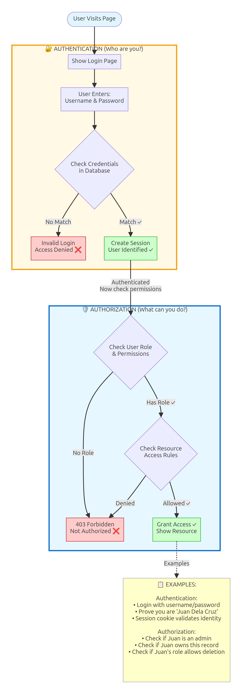
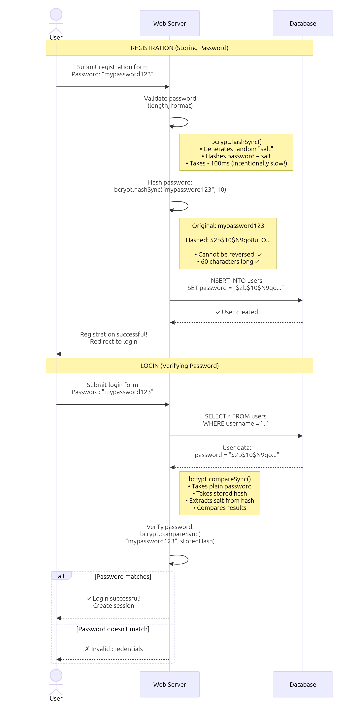
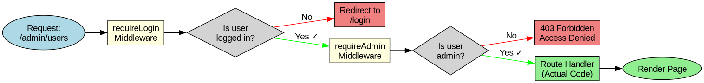
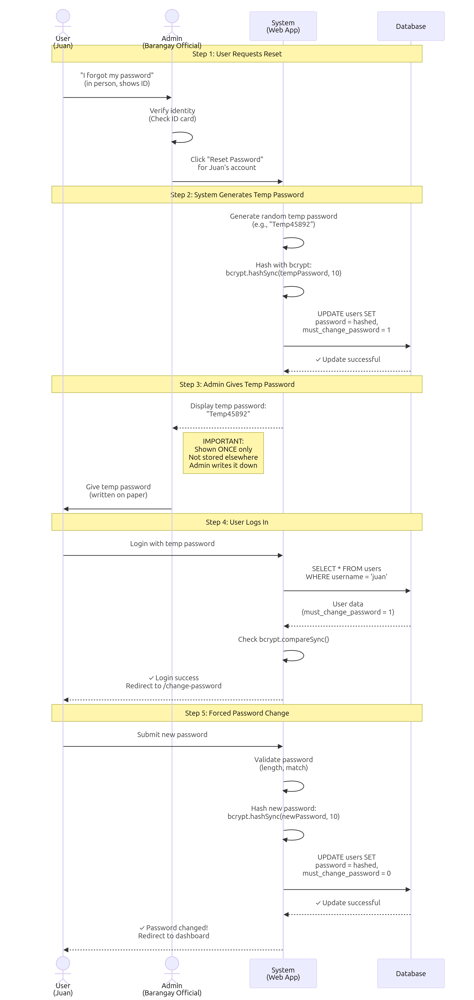
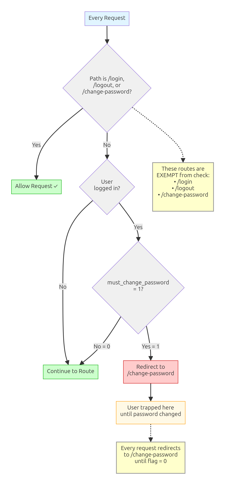
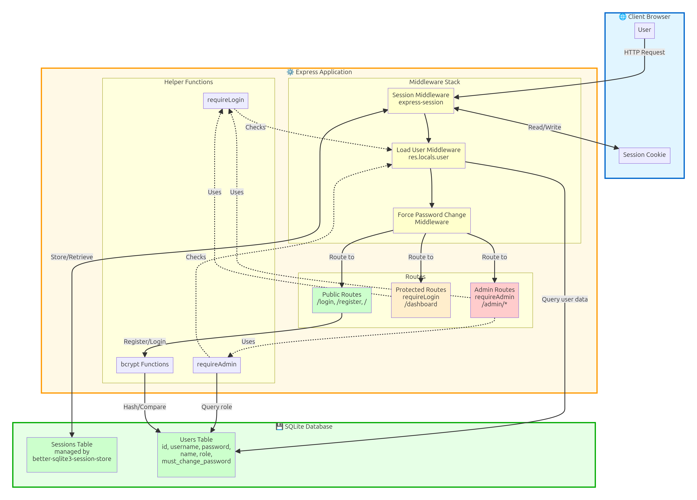

# Building Web Applications - Part 2B
## User Authentication & Authorization

**Target Audience:** Grade 9 Students  
**Prerequisites:** Part 2A (SQLite databases, CRUD operations, prepared statements)  
**Duration:** 3-4 days

---

## 🎯 What You'll Learn

By the end of this lecture, you'll be able to:
- Implement user registration with secure password hashing
- Create login and logout functionality with sessions
- Protect routes to require authentication
- Build a two-role system (Admin and User)
- Use middleware to check permissions
- Implement admin-assisted password reset
- Force users to change passwords on first login
- Understand authentication security fundamentals

**Final Outcome:** Your mini-projects will have professional user authentication just like real web applications!

---

## 🔐 Introduction: Why Authentication?

Remember your Part 2A database projects? They work great, but there's a problem:

### The Open Store Problem

**Maria's Sari-Sari Store App** (from Part 2A):
- Anyone can add products ✅
- Anyone can change prices ❌
- Anyone can delete items ❌
- No record of who did what ❌

**What happened one day:**
- A customer accidentally deleted the entire inventory!
- Maria lost track of all her products
- No way to know who did it
- Had to manually re-enter everything 😭

**The solution:** **Authentication & Authorization**

- **Authentication** = Proving who you are (login)
- **Authorization** = What you're allowed to do (permissions)

---

## 🍔 The Jollibee Badge Analogy

Think of authentication like Jollibee employee badges:

**No Badge System (No Authentication):**
- Anyone can walk into the kitchen
- Anyone can use the cash register
- Anyone can give away free food
- Chaos! 🔥

**With Badge System (Authentication):**
- **Manager badge** (Admin) = Can do everything, view all reports, change prices
- **Crew badge** (User) = Can take orders, prepare food, but can't change prices
- **Customer** (Not logged in) = Can only view menu, place orders

**How it works:**
1. **Badge check** = Login (prove you're an employee)
2. **Badge color** = Role (manager vs crew)
3. **Access control** = Authorization (what you can do)

This is exactly what we're building!

---

## 📊 Section 1: Understanding Authentication vs Authorization

### Authentication (Who are you?)

**Question:** "Are you really Juan Dela Cruz?"

**Process:**
1. Juan provides username and password
2. System checks if credentials match database
3. If match: "Yes, you're Juan!" → Create session
4. If no match: "Access denied!"

**Analogy:** Showing your ID at the school gate

---

### Authorization (What can you do?)

**Question:** "What is Juan allowed to do?"

**Process:**
1. System knows Juan is logged in ✅
2. Juan tries to delete a student
3. System checks: "Is Juan an admin?"
4. If admin: Allow ✅
5. If not admin: Block ❌

**Analogy:** ID card shows you're a teacher (allowed in faculty room) vs student (not allowed)



---

### The Two-Role System

**For Grade 9 projects, two roles cover 90% of needs:**

**Role 1: Admin (Full Access)**
- Create, edit, delete anything
- View all records
- Manage users
- Access admin panel
- See reports and statistics

**Examples:**
- Barangay Directory: Barangay officials
- Class List: Teachers
- Store Inventory: Store managers

**Role 2: User (Limited Access)**
- View own records
- Limited editing (own data only)
- No deletion rights
- No user management
- Restricted reports

**Examples:**
- Barangay Directory: Residents (view own info)
- Class List: Students (view own grades)
- Store Inventory: Cashiers (record sales only)

**Real Talk:** Advanced systems have 3+ roles (moderator, editor, viewer), but mastering 2 roles first builds the foundation!

---

## 🔑 Section 2: Password Security Basics

### The Golden Rule: NEVER Store Plain Passwords!

**❌ WRONG (How NOT to do it):**

```javascript
// BAD - Storing password as plain text
CREATE TABLE users (
  id INTEGER PRIMARY KEY,
  username TEXT,
  password TEXT  -- "mypassword123" stored directly
);

// If database is hacked, attacker sees ALL passwords!
```

**Why this is terrible:**
- Attacker steals database → sees all passwords
- Users reuse passwords → attacker can hack their email, Facebook, etc.
- **You are responsible for protecting your users!**

---

### The Solution: Password Hashing with bcrypt

**What is hashing?**
- One-way math function
- Turns "mypassword123" into gibberish
- **Cannot be reversed** (you can't get original password back)

**Example:**
```
Original:  mypassword123
Hashed:    $2b$10$N9qo8uLOickgx2ZMRZoMye.ICI.uf.8xEBZYSUBOAx7TCrPnEO99e
```

**Key properties:**
- ✅ Same password always gives same hash (can verify)
- ✅ Impossible to reverse (attacker can't get original)
- ✅ Even tiny change = completely different hash
- ✅ bcrypt adds "salt" (makes it even more secure)

**Analogy:** Hashing is like grinding coffee beans. You can verify it's coffee, but you can't ungrind it back into beans!



---

### How Password Verification Works

**Registration (storing password):**
```javascript
1. User enters: "mypassword123"
2. bcrypt hashes it: "$2b$10$N9qo8uLO..."
3. Store hash in database (NOT original password)
```

**Login (checking password):**
```javascript
1. User enters: "mypassword123"
2. Get stored hash from database: "$2b$10$N9qo8uLO..."
3. bcrypt.compare("mypassword123", storedHash)
4. Returns true (match!) or false (wrong password)
```

**Magic:** bcrypt can check if password matches hash, but can't reverse the hash!

---

## 🟢 Section 3: Setting Up Authentication

### Step 1: Install Required Packages

```bash
npm install express-session bcrypt better-sqlite3-session-store
```

**What each package does:**
- `express-session` - Manages user sessions (keeps users logged in)
- `bcrypt` - Hashes passwords securely
- `better-sqlite3-session-store` - Stores sessions in SQLite database

---

### Step 2: Create Users Table

```javascript
// In database/setup-database.js

db.exec(`
  CREATE TABLE IF NOT EXISTS users (
    id INTEGER PRIMARY KEY AUTOINCREMENT,
    username TEXT NOT NULL UNIQUE,
    password TEXT NOT NULL,
    name TEXT NOT NULL,
    role TEXT DEFAULT 'user',
    must_change_password INTEGER DEFAULT 0,
    created_at DATETIME DEFAULT CURRENT_TIMESTAMP
  )
`);

console.log('✅ Users table created');

// Create default admin account
const bcrypt = require('bcrypt');
const hashedPassword = bcrypt.hashSync('admin123', 10);

db.prepare(`
  INSERT INTO users (username, password, name, role)
  VALUES (?, ?, ?, ?)
`).run('admin', hashedPassword, 'Administrator', 'admin');

console.log('✅ Default admin created (username: admin, password: admin123)');
```

**Understanding the schema:**
- `username` - Unique login name (UNIQUE constraint prevents duplicates)
- `password` - **Hashed** password (NOT plain text!)
- `name` - Display name
- `role` - 'admin' or 'user'
- `must_change_password` - Force password change (0 = no, 1 = yes)

---

### Step 3: Configure Sessions in app.js

```javascript
const express = require('express');
const session = require('express-session');
const Database = require('better-sqlite3');
const SqliteStore = require('better-sqlite3-session-store')(session);
const bcrypt = require('bcrypt');

const app = express();
const db = new Database('data/myapp.db');
db.pragma('foreign_keys = ON');

// Middleware
app.set('view engine', 'ejs');
app.use(express.static('public'));
app.use(express.urlencoded({ extended: true }));

// SESSION CONFIGURATION
app.use(session({
  store: new SqliteStore({
    client: db,
    expired: {
      clear: true,
      intervalMs: 900000  // Clear expired sessions every 15 minutes
    }
  }),
  secret: process.env.SESSION_SECRET || 'dev-secret-change-in-production',
  resave: false,
  saveUninitialized: false,
  cookie: {
    maxAge: 1000 * 60 * 60 * 24,  // 24 hours
    httpOnly: true,  // Prevents JavaScript access (security)
    secure: process.env.NODE_ENV === 'production'  // HTTPS only in production
  }
}));

// LOAD USER INTO res.locals (available in all views)
app.use((req, res, next) => {
  if (req.session.userId) {
    const user = db.prepare('SELECT id, username, name, role FROM users WHERE id = ?')
      .get(req.session.userId);
    res.locals.user = user;
  } else {
    res.locals.user = null;
  }
  next();
});

// ... rest of routes
```

**Understanding session config:**
- `store` - Where sessions are saved (SQLite database)
- `secret` - Encryption key (keep this secret!)
- `resave: false` - Don't save session if nothing changed
- `saveUninitialized: false` - Don't create session until something is stored
- `cookie.maxAge` - How long session lasts (24 hours)
- `cookie.httpOnly` - Prevents XSS attacks
- `cookie.secure` - HTTPS only (for production)

**The res.locals pattern:**
- Loads current user into `res.locals.user`
- Now available in **all** EJS templates
- No need to pass `user` to every `res.render()`!

---

## 📝 Section 4: Registration (Creating Accounts)

### Registration Form (views/register.ejs)

```html
<!DOCTYPE html>
<html>
<head>
  <title>Register</title>
  <link rel="stylesheet" href="https://cdn.jsdelivr.net/npm/bulma@0.9.4/css/bulma.min.css">
</head>
<body>
  <section class="section">
    <div class="container">
      <div class="columns is-centered">
        <div class="column is-5">
          <div class="box">
            <h1 class="title">Create Account</h1>
            
            <% if (typeof error !== 'undefined') { %>
              <div class="notification is-danger">
                <%= error %>
              </div>
            <% } %>
            
            <form method="POST" action="/register">
              <div class="field">
                <label class="label">Full Name</label>
                <div class="control">
                  <input class="input" type="text" name="name" required>
                </div>
              </div>
              
              <div class="field">
                <label class="label">Username</label>
                <div class="control">
                  <input class="input" type="text" name="username" required>
                </div>
                <p class="help">Use letters and numbers only</p>
              </div>
              
              <div class="field">
                <label class="label">Password</label>
                <div class="control">
                  <input class="input" type="password" name="password" required>
                </div>
                <p class="help">At least 6 characters</p>
              </div>
              
              <div class="field">
                <label class="label">Confirm Password</label>
                <div class="control">
                  <input class="input" type="password" name="confirmPassword" required>
                </div>
              </div>
              
              <div class="field">
                <div class="control">
                  <button class="button is-primary is-fullwidth" type="submit">
                    Register
                  </button>
                </div>
              </div>
            </form>
            
            <p class="has-text-centered mt-4">
              Already have an account? <a href="/login">Login here</a>
            </p>
          </div>
        </div>
      </div>
    </div>
  </section>
</body>
</html>
```

---

### Registration Route (app.js)

```javascript
// SHOW REGISTRATION FORM
app.get('/register', (req, res) => {
  res.render('register');
});

// HANDLE REGISTRATION
app.post('/register', (req, res) => {
  const { username, password, confirmPassword, name } = req.body;
  
  // VALIDATION
  if (!username || !password || !name) {
    return res.render('register', { error: 'All fields are required' });
  }
  
  if (password.length < 6) {
    return res.render('register', { error: 'Password must be at least 6 characters' });
  }
  
  if (password !== confirmPassword) {
    return res.render('register', { error: 'Passwords do not match' });
  }
  
  // CHECK IF USERNAME EXISTS
  const existing = db.prepare('SELECT id FROM users WHERE username = ?').get(username);
  if (existing) {
    return res.render('register', { error: 'Username already taken' });
  }
  
  // HASH PASSWORD
  const hashedPassword = bcrypt.hashSync(password, 10);
  
  // INSERT USER
  const result = db.prepare(`
    INSERT INTO users (username, password, name, role)
    VALUES (?, ?, ?, ?)
  `).run(username, hashedPassword, name, 'user');
  
  // LOG THE USER IN (create session)
  req.session.userId = result.lastInsertRowid;
  
  // REDIRECT TO HOME
  res.redirect('/');
});
```

**Key security practices:**
1. ✅ Validate all inputs (never trust user data!)
2. ✅ Check password length (at least 6 characters)
3. ✅ Confirm passwords match
4. ✅ Check username is unique
5. ✅ Hash password with bcrypt (10 rounds)
6. ✅ Never store plain password
7. ✅ Create session immediately after registration

---

## 🔓 Section 5: Login & Logout

### Login Form (views/login.ejs)

```html
<!DOCTYPE html>
<html>
<head>
  <title>Login</title>
  <link rel="stylesheet" href="https://cdn.jsdelivr.net/npm/bulma@0.9.4/css/bulma.min.css">
</head>
<body>
  <section class="section">
    <div class="container">
      <div class="columns is-centered">
        <div class="column is-4">
          <div class="box">
            <h1 class="title">Login</h1>
            
            <% if (typeof error !== 'undefined') { %>
              <div class="notification is-danger">
                <%= error %>
              </div>
            <% } %>
            
            <form method="POST" action="/login">
              <div class="field">
                <label class="label">Username</label>
                <div class="control">
                  <input class="input" type="text" name="username" required autofocus>
                </div>
              </div>
              
              <div class="field">
                <label class="label">Password</label>
                <div class="control">
                  <input class="input" type="password" name="password" required>
                </div>
              </div>
              
              <div class="field">
                <div class="control">
                  <button class="button is-primary is-fullwidth" type="submit">
                    Login
                  </button>
                </div>
              </div>
            </form>
            
            <p class="has-text-centered mt-4">
              Don't have an account? <a href="/register">Register here</a>
            </p>
          </div>
        </div>
      </div>
    </div>
  </section>
</body>
</html>
```

---

### Login Route (app.js)

```javascript
// SHOW LOGIN FORM
app.get('/login', (req, res) => {
  // If already logged in, redirect home
  if (req.session.userId) {
    return res.redirect('/');
  }
  res.render('login');
});

// HANDLE LOGIN
app.post('/login', (req, res) => {
  const { username, password } = req.body;
  
  // VALIDATION
  if (!username || !password) {
    return res.render('login', { error: 'Username and password required' });
  }
  
  // FIND USER
  const user = db.prepare('SELECT * FROM users WHERE username = ?').get(username);
  
  if (!user) {
    return res.render('login', { error: 'Invalid username or password' });
  }
  
  // CHECK PASSWORD
  const passwordMatch = bcrypt.compareSync(password, user.password);
  
  if (!passwordMatch) {
    return res.render('login', { error: 'Invalid username or password' });
  }
  
  // CREATE SESSION
  req.session.userId = user.id;
  
  // CHECK IF MUST CHANGE PASSWORD
  if (user.must_change_password === 1) {
    return res.redirect('/change-password');
  }
  
  // REDIRECT TO HOME
  res.redirect('/');
});
```

**Security best practices:**
1. ✅ Same error message for "user not found" and "wrong password" (don't reveal which)
2. ✅ Use bcrypt.compareSync() to check password (secure comparison)
3. ✅ Store only user ID in session (not entire user object)
4. ✅ Check must_change_password flag
5. ✅ Never log passwords (not even for debugging!)

---

### Logout Route (app.js)

```javascript
// LOGOUT
app.post('/logout', (req, res) => {
  req.session.destroy((err) => {
    if (err) {
      console.error('Error destroying session:', err);
    }
    res.redirect('/login');
  });
});
```

**Why POST for logout?**
- GET requests can be triggered by bots, images, etc.
- POST requires intentional form submission
- Prevents accidental logouts

---

## 🛡️ Section 6: Protecting Routes with Middleware

### What is Middleware?

**Middleware** = Code that runs **before** your route handler

**Analogy:** Security guard at Jollibee kitchen
1. Customer tries to enter kitchen
2. Guard checks: "Are you an employee?"
3. If yes: Let them through ✅
4. If no: Stop them ❌

**In Express:**
```javascript
app.get('/admin', securityGuard, actualRoute);
                   ↑               ↑
              Middleware      Route handler
              (checks first)   (runs if allowed)
```



---

### requireLogin Middleware

```javascript
// MIDDLEWARE: Require Login
function requireLogin(req, res, next) {
  if (!req.session.userId) {
    return res.redirect('/login');
  }
  next();  // User is logged in, continue to route
}
```

**How it works:**
1. Check if `req.session.userId` exists
2. If NO → redirect to login
3. If YES → call `next()` (continue to route)

**Usage:**
```javascript
// Anyone can access
app.get('/', (req, res) => {
  res.render('home');
});

// Must be logged in
app.get('/dashboard', requireLogin, (req, res) => {
  res.render('dashboard');
});
```

---

### requireAdmin Middleware

```javascript
// MIDDLEWARE: Require Admin Role
function requireAdmin(req, res, next) {
  if (!req.session.userId) {
    return res.redirect('/login');
  }
  
  const user = db.prepare('SELECT role FROM users WHERE id = ?')
    .get(req.session.userId);
  
  if (!user || user.role !== 'admin') {
    return res.status(403).render('error', {
      message: 'Access denied. Admin only.'
    });
  }
  
  next();
}
```

**How it works:**
1. Check if logged in (if not → login page)
2. Get user's role from database
3. If NOT admin → show error (403 Forbidden)
4. If admin → call `next()` (continue)

**Usage:**
```javascript
// Admin only
app.get('/admin/users', requireAdmin, (req, res) => {
  const users = db.prepare('SELECT * FROM users').all();
  res.render('admin/users', { users });
});

// Admin only - delete user
app.post('/admin/users/:id/delete', requireAdmin, (req, res) => {
  db.prepare('DELETE FROM users WHERE id = ?').run(req.params.id);
  res.redirect('/admin/users');
});
```

---

### Combining Middlewares

You can chain multiple middlewares:

```javascript
// Must be logged in AND must be admin
app.get('/admin/settings', requireLogin, requireAdmin, (req, res) => {
  res.render('admin/settings');
});
```

**Execution order:**
1. `requireLogin` runs → checks login → calls `next()`
2. `requireAdmin` runs → checks role → calls `next()`
3. Route handler runs → renders page

---

## 👤 Section 7: Displaying User Info

### Using res.locals in Templates

Remember we set `res.locals.user` in our middleware? Now we can use it everywhere!

**Navbar with Login/Logout (views/partials/navbar.ejs):**

```html
<nav class="navbar is-primary">
  <div class="navbar-brand">
    <a class="navbar-item" href="/">
      <strong>My App</strong>
    </a>
  </div>
  
  <div class="navbar-menu">
    <div class="navbar-end">
      <% if (user) { %>
        <!-- User is logged in -->
        <div class="navbar-item">
          <span>Welcome, <%= user.name %>!</span>
        </div>
        
        <% if (user.role === 'admin') { %>
          <a class="navbar-item" href="/admin">
            Admin Panel
          </a>
        <% } %>
        
        <div class="navbar-item">
          <form method="POST" action="/logout">
            <button class="button is-light" type="submit">
              Logout
            </button>
          </form>
        </div>
      <% } else { %>
        <!-- User is NOT logged in -->
        <a class="navbar-item" href="/login">
          Login
        </a>
        <a class="navbar-item" href="/register">
          Register
        </a>
      <% } %>
    </div>
  </div>
</nav>
```

**Conditional content based on role:**

```html
<!-- Show to everyone -->
<h1>Welcome to our app!</h1>

<!-- Show only to logged-in users -->
<% if (user) { %>
  <p>Hello, <%= user.name %>!</p>
<% } %>

<!-- Show only to admins -->
<% if (user && user.role === 'admin') { %>
  <a href="/admin/manage-users" class="button is-danger">
    Manage Users
  </a>
<% } %>

<!-- Show only to regular users (not admin) -->
<% if (user && user.role === 'user') { %>
  <p>Contact admin for special access.</p>
<% } %>
```

---

## 🔄 Section 8: Admin-Assisted Password Reset

### Why This Approach?

**Traditional password reset:**
- Send email with reset link
- Requires email service (SMTP setup, costs money)
- Complicated error handling (email fails, spam filters)
- Requires internet connection

**Admin-assisted reset (BETTER for small organizations):**
- ✅ No email needed (works offline!)
- ✅ Admin verifies identity in person (more secure!)
- ✅ Simple to implement
- ✅ Realistic for Philippine barangays, small schools, stores

**Real-world scenario:**
1. Juan forgets password
2. Juan goes to Barangay Hall in person
3. Barangay official (admin) verifies Juan's ID
4. Admin resets Juan's password
5. Admin gives Juan temporary password
6. Juan logs in, forced to create new password



---

### User Management Page (views/admin/users.ejs)

```html
<section class="section">
  <div class="container">
    <h1 class="title">User Management</h1>
    
    <% if (typeof tempPassword !== 'undefined') { %>
      <div class="notification is-success">
        <strong>Temporary Password:</strong> <%= tempPassword %>
        <br>
        Give this to the user. They will be forced to change it on login.
      </div>
    <% } %>
    
    <table class="table is-fullwidth is-striped">
      <thead>
        <tr>
          <th>Name</th>
          <th>Username</th>
          <th>Role</th>
          <th>Created</th>
          <th>Actions</th>
        </tr>
      </thead>
      <tbody>
        <% users.forEach(u => { %>
          <tr>
            <td><%= u.name %></td>
            <td><%= u.username %></td>
            <td>
              <span class="tag <%= u.role === 'admin' ? 'is-danger' : 'is-info' %>">
                <%= u.role %>
              </span>
            </td>
            <td><%= new Date(u.created_at).toLocaleDateString() %></td>
            <td>
              <% if (u.id !== user.id) { %>
                <form method="POST" action="/admin/users/<%= u.id %>/reset-password" style="display: inline;">
                  <button class="button is-small is-warning" type="submit">
                    Reset Password
                  </button>
                </form>
                
                <form method="POST" action="/admin/users/<%= u.id %>/delete" style="display: inline;" 
                      onsubmit="return confirm('Delete <%= u.name %>?')">
                  <button class="button is-small is-danger" type="submit">
                    Delete
                  </button>
                </form>
              <% } else { %>
                <span class="tag is-light">You</span>
              <% } %>
            </td>
          </tr>
        <% }); %>
      </tbody>
    </table>
  </div>
</section>
```

---

### Reset Password Route (app.js)

```javascript
// ADMIN: Show user management
app.get('/admin/users', requireAdmin, (req, res) => {
  const users = db.prepare('SELECT * FROM users ORDER BY created_at DESC').all();
  res.render('admin/users', { users });
});

// ADMIN: Reset user password
app.post('/admin/users/:id/reset-password', requireAdmin, (req, res) => {
  const userId = parseInt(req.params.id);
  
  // Don't let admin reset their own password this way
  if (userId === req.session.userId) {
    return res.redirect('/admin/users');
  }
  
  // Generate temporary password
  const tempPassword = 'Temp' + Math.floor(Math.random() * 100000);
  
  // Hash it
  const hashedPassword = bcrypt.hashSync(tempPassword, 10);
  
  // Update user
  db.prepare(`
    UPDATE users 
    SET password = ?, must_change_password = 1 
    WHERE id = ?
  `).run(hashedPassword, userId);
  
  // Show temp password to admin
  const users = db.prepare('SELECT * FROM users ORDER BY created_at DESC').all();
  res.render('admin/users', { users, tempPassword });
});
```

**How it works:**
1. Admin clicks "Reset Password" for user
2. System generates temporary password (e.g., "Temp45892")
3. Password is hashed and saved
4. `must_change_password` flag is set to 1
5. Temporary password shown to admin (NOT saved anywhere else!)
6. Admin gives temp password to user (in person, SMS, etc.)

---

### Force Password Change (views/change-password.ejs)

```html
<section class="section">
  <div class="container">
    <div class="columns is-centered">
      <div class="column is-5">
        <div class="box">
          <h1 class="title">Change Password Required</h1>
          
          <div class="notification is-warning">
            You must change your password before continuing.
          </div>
          
          <% if (typeof error !== 'undefined') { %>
            <div class="notification is-danger">
              <%= error %>
            </div>
          <% } %>
          
          <form method="POST" action="/change-password">
            <div class="field">
              <label class="label">New Password</label>
              <div class="control">
                <input class="input" type="password" name="newPassword" required>
              </div>
              <p class="help">At least 6 characters</p>
            </div>
            
            <div class="field">
              <label class="label">Confirm New Password</label>
              <div class="control">
                <input class="input" type="password" name="confirmPassword" required>
              </div>
            </div>
            
            <div class="field">
              <div class="control">
                <button class="button is-primary is-fullwidth" type="submit">
                  Change Password
                </button>
              </div>
            </div>
          </form>
        </div>
      </div>
    </div>
  </div>
</section>
```

---

### Change Password Routes (app.js)

```javascript
// MIDDLEWARE: Force password change if required
app.use((req, res, next) => {
  // Skip for login, logout, and change-password routes
  if (req.path === '/login' || req.path === '/logout' || req.path === '/change-password') {
    return next();
  }
  
  // Check if logged in and must change password
  if (req.session.userId) {
    const user = db.prepare('SELECT must_change_password FROM users WHERE id = ?')
      .get(req.session.userId);
    
    if (user && user.must_change_password === 1) {
      return res.redirect('/change-password');
    }
  }
  
  next();
});

// SHOW change password form
app.get('/change-password', requireLogin, (req, res) => {
  res.render('change-password');
});

// HANDLE password change
app.post('/change-password', requireLogin, (req, res) => {
  const { newPassword, confirmPassword } = req.body;
  
  // VALIDATION
  if (!newPassword || !confirmPassword) {
    return res.render('change-password', { error: 'All fields required' });
  }
  
  if (newPassword.length < 6) {
    return res.render('change-password', { 
      error: 'Password must be at least 6 characters' 
    });
  }
  
  if (newPassword !== confirmPassword) {
    return res.render('change-password', { error: 'Passwords do not match' });
  }
  
  // HASH NEW PASSWORD
  const hashedPassword = bcrypt.hashSync(newPassword, 10);
  
  // UPDATE USER
  db.prepare(`
    UPDATE users 
    SET password = ?, must_change_password = 0 
    WHERE id = ?
  `).run(hashedPassword, req.session.userId);
  
  // REDIRECT TO HOME
  res.redirect('/');
});
```

**The flow:**
1. User logs in with temp password
2. Middleware checks `must_change_password` flag
3. If flag = 1, redirect to `/change-password` (happens for EVERY request)
4. User creates new password
5. Flag set to 0, password updated
6. User can now use app normally



---

## 🔒 Section 9: Security Best Practices

### 1. Password Security

**✅ DO:**
- Always use bcrypt (or similar) for hashing
- Use at least 10 rounds for bcrypt
- Require minimum 6 characters (better: 8+)
- Never log passwords (even for debugging)
- Store only hashes, never plain passwords

**❌ DON'T:**
- Store plain text passwords
- Use weak hashing (MD5, SHA1)
- Send passwords in emails
- Display passwords on screen
- Let users use common passwords (optional validation)

---

### 2. Session Security

**✅ DO:**
- Use `httpOnly: true` (prevents JavaScript access)
- Use `secure: true` in production (HTTPS only)
- Set reasonable expiration (24 hours common)
- Use strong session secret (long random string)
- Store session secret in environment variable

**❌ DON'T:**
- Use weak secrets ("secret", "123456")
- Commit secrets to Git
- Allow sessions to last forever
- Store sensitive data in cookies

---

### 3. Input Validation

**✅ DO:**
```javascript
// Validate lengths
if (username.length < 3 || username.length > 20) {
  return res.render('register', { error: 'Invalid username length' });
}

// Validate format
const emailRegex = /^[^\s@]+@[^\s@]+\.[^\s@]+$/;
if (!emailRegex.test(email)) {
  return res.render('register', { error: 'Invalid email format' });
}

// Sanitize inputs
const sanitizedName = name.trim().slice(0, 100);
```

**❌ DON'T:**
- Trust any user input
- Skip validation "because it's optional"
- Only validate on client side
- Assume data types (always parse integers!)

---

### 4. SQL Injection Prevention

**Always use prepared statements (review from Part 2A!):**

```javascript
// ✅ CORRECT
const user = db.prepare('SELECT * FROM users WHERE username = ?')
  .get(username);

// ❌ WRONG - VULNERABLE!
const user = db.prepare(`SELECT * FROM users WHERE username = '${username}'`)
  .get();
```

**See Part 2A lecture for full SQL injection coverage.**

---

### 5. Error Handling

**✅ DO:**
```javascript
try {
  // Database operation
  db.prepare('INSERT INTO users ...').run(...);
} catch (err) {
  console.error('Database error:', err);  // Log for debugging
  res.status(500).send('Something went wrong');  // Generic message
}
```

**❌ DON'T:**
```javascript
try {
  db.prepare('INSERT INTO users ...').run(...);
} catch (err) {
  res.send(`Database error: ${err.message}`);  // EXPOSES DETAILS!
}
```

**Why?** Error messages can reveal:
- Database structure
- Table/column names
- File paths
- Helps attackers plan attacks

---

### 6. Rate Limiting (Advanced)

Prevent brute-force attacks:

```javascript
// Optional: Install express-rate-limit
const rateLimit = require('express-rate-limit');

const loginLimiter = rateLimit({
  windowMs: 15 * 60 * 1000,  // 15 minutes
  max: 5,  // Limit each IP to 5 requests per windowMs
  message: 'Too many login attempts, try again later'
});

// Apply to login route
app.post('/login', loginLimiter, (req, res) => {
  // ... login logic
});
```

---

## 🎓 Section 10: Real-World Example - Complete Auth System

Let's see a complete authenticated app:



### Project Structure
```
my-app/
├── app.js
├── package.json
├── database/
│   └── setup-database.js
├── data/
│   └── myapp.db
└── views/
    ├── home.ejs
    ├── login.ejs
    ├── register.ejs
    ├── change-password.ejs
    ├── dashboard.ejs
    ├── admin/
    │   ├── users.ejs
    │   └── settings.ejs
    └── partials/
        └── navbar.ejs
```

### Complete app.js (Skeleton)

```javascript
const express = require('express');
const session = require('express-session');
const bcrypt = require('bcrypt');
const Database = require('better-sqlite3');
const SqliteStore = require('better-sqlite3-session-store')(session);

const app = express();
const PORT = process.env.PORT || 3000;
const db = new Database('data/myapp.db');
db.pragma('foreign_keys = ON');

// MIDDLEWARE
app.set('view engine', 'ejs');
app.use(express.static('public'));
app.use(express.urlencoded({ extended: true }));

// SESSION
app.use(session({
  store: new SqliteStore({ client: db }),
  secret: process.env.SESSION_SECRET || 'dev-secret-change-in-production',
  resave: false,
  saveUninitialized: false,
  cookie: { maxAge: 1000 * 60 * 60 * 24, httpOnly: true }
}));

// LOAD USER
app.use((req, res, next) => {
  if (req.session.userId) {
    res.locals.user = db.prepare('SELECT id, username, name, role FROM users WHERE id = ?')
      .get(req.session.userId);
  } else {
    res.locals.user = null;
  }
  next();
});

// FORCE PASSWORD CHANGE
app.use((req, res, next) => {
  if (req.path === '/login' || req.path === '/logout' || req.path === '/change-password') {
    return next();
  }
  if (req.session.userId) {
    const user = db.prepare('SELECT must_change_password FROM users WHERE id = ?')
      .get(req.session.userId);
    if (user && user.must_change_password === 1) {
      return res.redirect('/change-password');
    }
  }
  next();
});

// MIDDLEWARE FUNCTIONS
function requireLogin(req, res, next) {
  if (!req.session.userId) return res.redirect('/login');
  next();
}

function requireAdmin(req, res, next) {
  if (!req.session.userId) return res.redirect('/login');
  const user = db.prepare('SELECT role FROM users WHERE id = ?').get(req.session.userId);
  if (!user || user.role !== 'admin') {
    return res.status(403).send('Access denied');
  }
  next();
}

// PUBLIC ROUTES
app.get('/', (req, res) => {
  res.render('home');
});

app.get('/login', (req, res) => {
  if (req.session.userId) return res.redirect('/');
  res.render('login');
});

app.post('/login', (req, res) => {
  // ... (login logic from Section 5)
});

app.get('/register', (req, res) => {
  res.render('register');
});

app.post('/register', (req, res) => {
  // ... (registration logic from Section 4)
});

app.post('/logout', (req, res) => {
  req.session.destroy(() => res.redirect('/login'));
});

// AUTHENTICATED ROUTES
app.get('/dashboard', requireLogin, (req, res) => {
  res.render('dashboard');
});

app.get('/change-password', requireLogin, (req, res) => {
  res.render('change-password');
});

app.post('/change-password', requireLogin, (req, res) => {
  // ... (change password logic from Section 8)
});

// ADMIN ROUTES
app.get('/admin', requireAdmin, (req, res) => {
  res.render('admin/dashboard');
});

app.get('/admin/users', requireAdmin, (req, res) => {
  const users = db.prepare('SELECT * FROM users').all();
  res.render('admin/users', { users });
});

app.post('/admin/users/:id/reset-password', requireAdmin, (req, res) => {
  // ... (reset password logic from Section 8)
});

app.post('/admin/users/:id/delete', requireAdmin, (req, res) => {
  const userId = parseInt(req.params.id);
  if (userId === req.session.userId) {
    return res.redirect('/admin/users');  // Can't delete self
  }
  db.prepare('DELETE FROM users WHERE id = ?').run(userId);
  res.redirect('/admin/users');
});

// START SERVER
app.listen(PORT, () => {
  console.log(`🚀 Server running at http://localhost:${PORT}`);
});
```

---

## 🐛 Section 11: Troubleshooting Guide

### Error: "Cannot find module 'bcrypt'"

**Cause:** bcrypt not installed  
**Solution:**
```bash
npm install bcrypt
```

---

### Error: "Session not persisting"

**Cause:** Session store not configured properly  
**Solution:** Make sure SqliteStore is set up:
```javascript
const SqliteStore = require('better-sqlite3-session-store')(session);
app.use(session({
  store: new SqliteStore({ client: db }),
  // ... rest of config
}));
```

---

### Error: "Illegal arguments: string, undefined"

**Cause:** Trying to compare undefined password  
**Solution:** Check password exists before comparing:
```javascript
if (!password) {
  return res.render('login', { error: 'Password required' });
}
const match = bcrypt.compareSync(password, user.password);
```

---

### Error: "Cannot read property 'id' of undefined"

**Cause:** User not found in database, but code assumes it exists  
**Solution:** Always check if user exists:
```javascript
const user = db.prepare('SELECT * FROM users WHERE id = ?').get(req.session.userId);
if (!user) {
  req.session.destroy();
  return res.redirect('/login');
}
```

---

### Problem: User stays logged in forever

**Cause:** Cookie maxAge not set or too high  
**Solution:**
```javascript
cookie: {
  maxAge: 1000 * 60 * 60 * 24,  // 24 hours
  // ...
}
```

---

### Problem: Password change loop (keeps redirecting)

**Cause:** Forgot to set `must_change_password = 0` after change  
**Solution:** Make sure UPDATE includes this:
```javascript
db.prepare(`
  UPDATE users 
  SET password = ?, must_change_password = 0 
  WHERE id = ?
`).run(hashedPassword, userId);
```

---

### Problem: Can't log in on Railway

**Cause:** Session secret not set in production  
**Solution:** Set environment variable in Railway dashboard:
```
SESSION_SECRET=your-random-long-secret-here-min-32-chars
```

---

## 📚 Section 12: Additional Resources

### Quick References

**Support Materials:**
- See `support-materials/auth-patterns.md` for common auth patterns
- See `support-materials/session-config-guide.md` for session setup
- See `support-materials/security-checklist.md` for deployment checklist

**Migration Guide:**
- See `web-app-basics-part2b-migration-guide.md` for step-by-step upgrade from Part 2A

---

### npm Packages Documentation

- **bcrypt:** [npmjs.com/package/bcrypt](https://www.npmjs.com/package/bcrypt)
- **express-session:** [npmjs.com/package/express-session](https://www.npmjs.com/package/express-session)
- **better-sqlite3-session-store:** [npmjs.com/package/better-sqlite3-session-store](https://www.npmjs.com/package/better-sqlite3-session-store)

---

### Security Resources

- **OWASP Top 10:** [owasp.org/www-project-top-ten](https://owasp.org/www-project-top-ten/)
- **Password Guidelines:** Use 8+ characters, mix uppercase/lowercase/numbers
- **Session Security:** Always use HTTPS in production

---

## 🎓 Summary: What You've Learned

**Congratulations!** You now know:

✅ **Authentication vs Authorization** - Who you are vs what you can do  
✅ **Password security** - bcrypt hashing, never store plain passwords  
✅ **Sessions** - Keep users logged in, express-session setup  
✅ **Registration** - Create accounts with validation  
✅ **Login/Logout** - Authenticate users securely  
✅ **Middleware** - requireLogin, requireAdmin patterns  
✅ **res.locals** - Make user available in all views (DRY)  
✅ **Two-role system** - Admin and User permissions  
✅ **Admin-assisted password reset** - Realistic for small organizations  
✅ **Force password change** - Security best practice  
✅ **Security best practices** - Input validation, error handling, SQL injection prevention  

**You can now build production-ready authenticated web applications!** 🚀

---

## 🚀 What's Next?

**Step 1:** Review concepts in this lecture  
**Step 2:** Read `web-app-basics-part2b-migration-guide.md` to upgrade your Part 2A projects  
**Step 3:** Choose one mini-project to add authentication:
- `practice-apps/barangay-directory-v3/`
- `practice-apps/class-list-v3/`
- `practice-apps/store-inventory-v3/`

**Step 4:** Customize and deploy!

**Part 2C Preview (Coming Next):**
- CSV export/import
- Flash messages for better UX
- QR code generation
- External API integration
- Audit logging
- DataTables.js for advanced tables

---

## 💭 Reflection Questions

1. What's the difference between authentication and authorization?
2. Why must passwords be hashed with bcrypt?
3. How does middleware protect routes?
4. Why use res.locals for user data?
5. What are advantages of admin-assisted password reset?
6. How does the must_change_password flag work?

**Discuss with classmates or write in your journal!**

---

**Ready to add authentication to your projects? See you in the Migration Guide!** 🔐

*Last updated: November 11, 2025*
