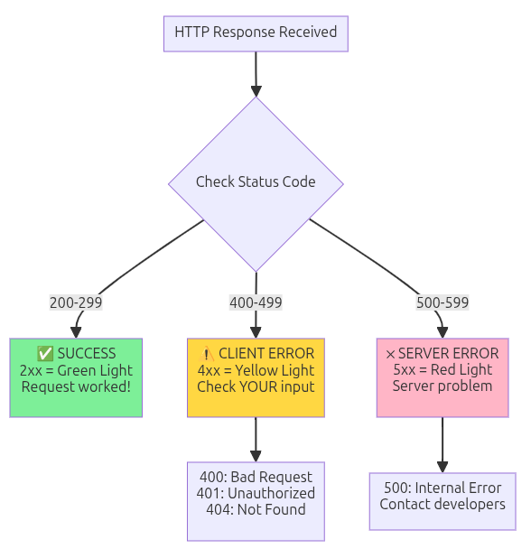

# API Testing Quick Reference Handout
### YMSAT 2026 — For Teachers

---

## What is an API?

**API = Application Programming Interface**

Think of it as a **waiter in a restaurant**:
- **You** (browser) place an order
- **Waiter** (API) carries your request to the kitchen
- **Kitchen** (server) prepares the response
- **Waiter** (API) delivers it back to you

APIs are the invisible messengers that make websites work.


---

## Opening Browser DevTools

| Browser | Shortcut | Alternative |
|---------|----------|-------------|
| Chrome | `F12` or `Ctrl+Shift+I` | Menu → More tools → Developer tools |
| Firefox | `F12` or `Ctrl+Shift+I` | Menu → More tools → Web Developer Tools |
| Mac | `Cmd+Option+I` | Same menu paths as above |

**Steps:**
1. Open DevTools with shortcut above
2. Click the **Network** tab
3. Click **Clear** button to reset the list
4. Perform your action (submit form, click button, etc.)
5. Find the request and examine the response

---

## HTTP Status Codes

| Code | Meaning | What It Means |
|------|---------|---------------|
| **200** | OK | Success! Request worked |
| **201** | Created | New item was created |
| **400** | Bad Request | Check your input data |
| **401** | Unauthorized | Login required |
| **404** | Not Found | Wrong URL/address |
| **500** | Server Error | Report to developers |

**Memory trick:** 
- **2xx** = Green light (success)
- **4xx** = Yellow (you made a mistake)
- **5xx** = Red (server problem)



---

## Network Tab Quick Guide

| Feature | What It Does | Where to Find It |
|---------|--------------|------------------|
| Clear | Reset request list | Top-left (circle with line) |
| Filter | Search for requests | Text box at top |
| XHR | Show only API calls | Filter row button |
| Preserve log | Keep requests after navigation | Checkbox at top |

---

## Test 1: Watch a Form Submission

**Goal:** See what happens when you submit the registration form

1. Open DevTools → Network tab
2. Click **Clear**
3. Go to `/registration` page
4. Fill out the form with test data
5. Submit the form
6. Find the `register` request in the list
7. Click it → view **Response** tab
8. Look for `"success": true`

**What to look for:**
- Status code (should be 200 or 201)
- Response body (JSON with confirmation)


---

## Test 2: Trigger an Error

**Goal:** See what a 404 error looks like

1. Open DevTools → Network tab
2. Navigate to a fake URL: `/this-page-does-not-exist`
3. Find the request in the Network tab
4. Check the **Status** column (should show 404)


[!page-not-found](diagrams/api-testing/page-not-found.png)

---

## Classroom Activity Ideas

| Activity | Description | Time |
|----------|-------------|------|
| Pair Testing | One types, one observes; switch roles | 20 min |
| Bug Hunt | First to find unexpected response wins | 15 min |
| Screenshot Challenge | Capture a successful registration response | 10 min |
| Real-World Detective | What APIs run when you like an Instagram post? | 10 min |

---

## Common Student Issues & Solutions

| Issue | Quick Solution |
|-------|----------------|
| "I can't find the request" | Use the filter box; make sure DevTools was open before the action |
| "I don't understand JSON" | Read it like a labeled form: `name: value` |
| "What does 400 mean?" | Point to status code chart above |
| "DevTools looks scary" | Reassure: it's read-only, can't break anything |

---

## Suggested 1-Hour Session Plan

| Time | Activity |
|------|----------|
| 0:00 | Intro & Restaurant Analogy (10 min) |
| 0:10 | Opening DevTools walkthrough (5 min) |
| 0:15 | Test 1: Registration form (20 min) |
| 0:35 | Test 2: Status codes / 404 (15 min) |
| 0:50 | Discussion & wrap-up (10 min) |


---

## JSON Cheat Sheet

```
{
  "success": true,           ← Boolean (true/false)
  "message": "Welcome!",     ← Text string
  "count": 42,               ← Number
  "items": ["a", "b", "c"]   ← List/array
}
```

**Reading tip:** Look for the field name on the left, value on the right.

---

## Before Your Session Checklist

- [ ] Test the YMSAT website on school computers
- [ ] Verify DevTools opens without restrictions
- [ ] Print or share student tutorial
- [ ] Prepare test data (names, emails)
- [ ] Have this quick reference ready
- [ ] Plan pairs/groups for collaborative work

---

## Key Takeaways for Students

1. **APIs are everywhere** — Every app they use talks through APIs
2. **DevTools is like an X-ray** — See what's really happening
3. **Status codes tell the story** — 200 = good, 400 = check input, 500 = problem
4. **JSON is just labeled data** — Read it like a form
5. **Anyone can observe APIs** — No programming required

---

**YMSAT 2026 | Philippine Science High School**  
*Teaching the next generation to understand the technology they use*
